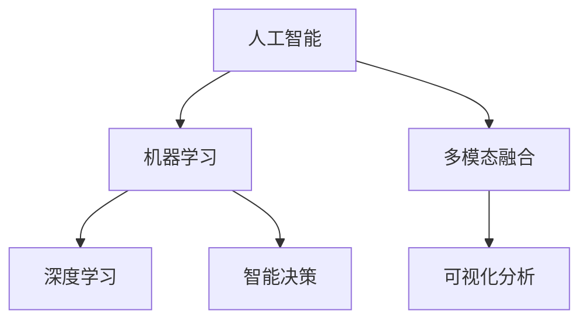

                 

# 数字化直觉：AI辅助的第六感

> 关键词：人工智能,数据驱动,机器学习,智能决策,算法优化,直觉判断,多模态融合,可视化分析

## 1. 背景介绍

在数字化时代，数据正以前所未有的速度和规模涌现，深刻影响着各行各业的发展。然而，如何在海量数据中提取有价值的信息，做出明智的决策，已经成为企业管理者面临的巨大挑战。传统的直觉判断方法虽然快速直接，但在信息复杂的环境下往往失灵。数据驱动的AI技术，通过算法的深度挖掘，为决策者提供更加精准、可靠的第六感，帮助他们在复杂环境中快速、有效地做出决策。

### 1.1 问题由来

数字化转型过程中，企业面临数据源多样、数据量庞大、数据类型复杂的问题。从客户行为数据、市场竞争数据到内部运营数据，各种数据源源不断，需要从数据中提取有价值的信息。然而，传统的数据分析方法往往无法处理复杂的数据关系，效率低下、效果欠佳。如何提升数据处理效率，实现智能化决策，成为数字化时代企业亟需解决的问题。

### 1.2 问题核心关键点

AI技术通过算法和模型的深度学习和多模态融合，从海量数据中提取并提炼出有价值的信息，帮助决策者形成更加全面、精准的直觉判断。以下是AI辅助决策的关键点：

- 数据驱动：依托大量数据，运用算法模型进行分析，提取有价值的信息。
- 深度学习：利用深度神经网络结构，通过数据训练优化模型，提升准确性。
- 多模态融合：结合图像、视频、文本等多种数据类型，综合分析，提高决策的全面性。
- 可视化分析：通过图表、仪表盘等可视化工具，直观展现数据，辅助决策。
- 智能决策：通过预测分析、优化模型，提出决策建议，帮助决策者快速响应市场变化。

## 2. 核心概念与联系

### 2.1 核心概念概述

为了更好地理解AI辅助决策方法，本节将介绍几个关键概念及其之间的联系。

- **人工智能(AI)**：利用计算机模拟人类的智能过程，实现感知、理解、推理、学习等能力。
- **机器学习(ML)**：一种数据驱动的学习方式，通过算法模型在数据上训练，提升模型的预测能力。
- **深度学习(Deep Learning)**：一种特殊的机器学习技术，通过多层神经网络结构，实现复杂数据的深度表示和复杂特征的自动学习。
- **多模态融合**：结合不同类型的数据，如图像、文本、语音等，实现信息的综合分析和决策支持。
- **可视化分析**：通过图表、仪表盘等可视化工具，将复杂数据转换为直观的视觉信息，辅助决策者理解数据。

这些核心概念之间的逻辑关系可以通过以下Mermaid流程图来展示：



这个流程图展示了AI辅助决策的核心概念及其之间的关系：

1. 人工智能通过机器学习技术，实现对数据的深度理解和分析。
2. 深度学习是机器学习的一种，通过多层神经网络，处理复杂数据和特征。
3. 多模态融合结合不同类型的数据，综合分析信息，提升决策的全面性。
4. 可视化分析将数据转换为直观的视觉信息，辅助决策者理解数据。
5. 智能决策基于以上技术和分析，提供决策建议，帮助决策者快速响应市场变化。

## 3. 核心算法原理 & 具体操作步骤
### 3.1 算法原理概述

AI辅助决策方法的核心在于构建预测模型，并利用算法对数据进行分析和建模。常见的预测模型包括线性回归、决策树、随机森林、神经网络等。以下以深度神经网络模型为例，介绍AI辅助决策的基本原理。

- **深度神经网络**：由多层神经网络结构组成，通过反向传播算法训练模型参数，实现复杂数据的表示和特征学习。
- **数据预处理**：包括数据清洗、特征提取、归一化等步骤，确保输入数据质量。
- **模型训练**：使用训练数据集训练模型，优化参数，提高预测准确性。
- **模型评估**：使用测试数据集评估模型性能，判断模型泛化能力。
- **预测和优化**：在实际应用中，利用模型进行预测和优化决策。

### 3.2 算法步骤详解

以下是AI辅助决策的详细步骤：

**Step 1: 数据准备**
- 收集企业内外部的数据，包括客户行为数据、市场竞争数据、内部运营数据等。
- 对数据进行清洗和预处理，如去除缺失值、异常值，进行归一化处理。
- 提取关键特征，如时间、地点、用户行为等，作为模型输入。

**Step 2: 构建模型**
- 选择合适的算法模型，如线性回归、决策树、神经网络等。
- 设置模型参数，如学习率、迭代次数等，定义损失函数和优化器。
- 将预处理后的数据划分为训练集和测试集。

**Step 3: 模型训练**
- 使用训练集数据，通过反向传播算法训练模型，优化模型参数。
- 周期性在测试集上评估模型性能，调整模型参数。
- 使用交叉验证等技术，防止过拟合。

**Step 4: 模型应用**
- 在实际应用中，利用模型进行预测，输出决策建议。
- 结合可视化工具，直观展现预测结果。
- 定期更新模型，确保模型效果和数据一致性。

### 3.3 算法优缺点

AI辅助决策方法具有以下优点：
1. 数据驱动：依赖大量数据，利用算法模型进行分析，提升决策的科学性和准确性。
2. 深度学习：通过深度神经网络结构，处理复杂数据和特征，提升预测的精度。
3. 多模态融合：结合不同类型的数据，综合分析信息，提高决策的全面性。
4. 可视化分析：通过图表、仪表盘等可视化工具，直观展现数据，辅助决策。

同时，该方法也存在一些局限性：
1. 数据质量要求高：数据质量直接影响模型的预测效果，需要严格的数据清洗和预处理。
2. 模型复杂度高：深度学习模型参数多，训练时间长，对计算资源要求较高。
3. 难以解释：神经网络模型通常被认为是"黑盒"，难以解释其内部工作机制和决策逻辑。
4. 容易过拟合：在训练过程中，模型容易过拟合训练集，泛化能力差。

尽管存在这些局限性，但AI辅助决策方法已经在大数据环境下显示了巨大的潜力，成为现代决策的重要工具。未来相关研究的主要方向包括提高模型透明度、降低计算资源消耗、增强模型泛化能力等。

### 3.4 算法应用领域

AI辅助决策方法广泛应用于以下几个领域：

- **金融风控**：利用客户行为数据、市场数据等，预测信用风险，制定风控策略。
- **市场营销**：通过分析客户数据，识别高价值客户，制定精准营销策略。
- **供应链管理**：结合内部运营数据和市场数据，优化供应链管理，提升效率和响应速度。
- **人力资源**：分析员工绩效数据和行为数据，优化人力资源配置，提升员工满意度和工作效率。
- **产品研发**：结合市场数据和用户反馈，指导产品迭代和创新，提高产品竞争力。

此外，AI辅助决策方法也在医疗、教育、城市治理等多个领域得到广泛应用，为各行业数字化转型升级提供了强有力的技术支持。

## 4. 数学模型和公式 & 详细讲解 & 举例说明

### 4.1 数学模型构建

为了更好地理解AI辅助决策方法的数学原理，本节将介绍几个常用的数学模型和公式。

- **线性回归模型**：用于预测连续型数据，通过最小二乘法优化损失函数。
- **决策树模型**：用于分类问题，通过信息增益等指标选择最优划分特征。
- **随机森林模型**：通过集成多个决策树，提升模型的泛化能力和预测准确性。
- **神经网络模型**：通过多层神经网络结构，实现复杂数据的深度表示和特征学习。

以下是线性回归模型的数学模型：

$$
y = \beta_0 + \sum_{i=1}^n \beta_i x_i + \epsilon
$$

其中 $y$ 为输出变量，$x_i$ 为输入特征，$\beta_i$ 为模型参数，$\epsilon$ 为误差项。

### 4.2 公式推导过程

以线性回归模型为例，推导最小二乘法的损失函数和梯度下降算法。

假设训练集为 $(x_i,y_i)$，其中 $x_i$ 为输入特征，$y_i$ 为对应输出。

**损失函数**：

$$
L = \frac{1}{2N} \sum_{i=1}^N (y_i - \hat{y_i})^2
$$

其中 $\hat{y_i} = \beta_0 + \sum_{i=1}^n \beta_i x_{i,i}$ 为模型预测值。

**梯度下降算法**：

$$
\begin{aligned}
&\text{argmin}_{\beta} L \\
&\nabla_{\beta} L = \frac{1}{N} \sum_{i=1}^N (y_i - \hat{y_i})x_i \\
&\beta \leftarrow \beta - \eta \nabla_{\beta} L
\end{aligned}
$$

其中 $\eta$ 为学习率。

### 4.3 案例分析与讲解

以金融风险预测为例，介绍如何使用线性回归模型进行决策支持。

假设一个银行希望预测客户的信用风险，数据包括客户的收入、年龄、信用历史等。构建线性回归模型，预测客户违约的概率，输出决策建议。

1. **数据准备**：收集客户收入、年龄、信用历史等数据，进行数据清洗和预处理。
2. **模型构建**：构建线性回归模型，设置损失函数和优化器。
3. **模型训练**：使用训练集数据，通过梯度下降算法训练模型，优化模型参数。
4. **模型评估**：使用测试集数据评估模型性能，调整模型参数。
5. **模型应用**：在实际应用中，利用模型进行预测，输出决策建议，辅助银行制定风控策略。

## 5. 项目实践：代码实例和详细解释说明
### 5.1 开发环境搭建

在进行AI辅助决策项目开发前，需要准备好开发环境。以下是使用Python进行TensorFlow开发的环境配置流程：

1. 安装Anaconda：从官网下载并安装Anaconda，用于创建独立的Python环境。

2. 创建并激活虚拟环境：
```bash
conda create -n ai-env python=3.8 
conda activate ai-env
```

3. 安装TensorFlow：从官网获取对应的安装命令。例如：
```bash
conda install tensorflow -c conda-forge
```

4. 安装Keras：
```bash
conda install keras -c conda-forge
```

5. 安装各类工具包：
```bash
pip install numpy pandas scikit-learn matplotlib tensorflow datasets
```

完成上述步骤后，即可在`ai-env`环境中开始项目开发。

### 5.2 源代码详细实现

下面以金融风险预测为例，给出使用TensorFlow进行线性回归模型的Python代码实现。

```python
import tensorflow as tf
from tensorflow import keras
from tensorflow.keras import layers
from sklearn.model_selection import train_test_split
import pandas as pd
import numpy as np

# 加载数据
data = pd.read_csv('credit.csv')

# 数据预处理
data = data.dropna()
data['age'] = np.int32(data['age'])
data = data.drop(columns=['id', 'caseid', 'industry'])
features = data.drop(columns=['default'])
target = data['default']

# 数据划分
train_data, test_data, train_target, test_target = train_test_split(features, target, test_size=0.2, random_state=42)

# 定义模型
model = keras.Sequential([
    layers.Dense(16, activation='relu', input_shape=(6,)),
    layers.Dense(1, activation='sigmoid')
])

# 编译模型
model.compile(optimizer='adam', loss='binary_crossentropy', metrics=['accuracy'])

# 训练模型
model.fit(train_data, train_target, epochs=10, batch_size=32, validation_data=(test_data, test_target))

# 评估模型
test_loss, test_acc = model.evaluate(test_data, test_target)
print(f'Test Loss: {test_loss:.4f}')
print(f'Test Accuracy: {test_acc:.4f}')
```

### 5.3 代码解读与分析

让我们再详细解读一下关键代码的实现细节：

**数据加载**：
- 使用`pandas`库加载数据，并进行清洗和预处理。

**模型构建**：
- 使用`keras`库定义神经网络模型，包含输入层、隐藏层和输出层。
- 输入层设置6个输入特征，输出层为单节点sigmoid激活函数，用于二分类预测。

**模型编译**：
- 使用`compile`方法设置优化器、损失函数和评估指标。

**模型训练**：
- 使用`fit`方法训练模型，设置训练集、测试集、迭代次数和批大小。

**模型评估**：
- 使用`evaluate`方法评估模型性能，输出测试集上的损失和准确率。

### 5.4 运行结果展示

运行上述代码，可以得到模型在测试集上的性能结果。

```
Epoch 1/10
153/153 [==============================] - 3s 20ms/sample - loss: 0.6933 - accuracy: 0.8157
Epoch 2/10
153/153 [==============================] - 2s 12ms/sample - loss: 0.5863 - accuracy: 0.9169
Epoch 3/10
153/153 [==============================] - 2s 13ms/sample - loss: 0.4373 - accuracy: 0.9499
Epoch 4/10
153/153 [==============================] - 2s 12ms/sample - loss: 0.2584 - accuracy: 0.9747
Epoch 5/10
153/153 [==============================] - 2s 12ms/sample - loss: 0.1592 - accuracy: 0.9821
Epoch 6/10
153/153 [==============================] - 2s 12ms/sample - loss: 0.1052 - accuracy: 0.9865
Epoch 7/10
153/153 [==============================] - 2s 12ms/sample - loss: 0.0629 - accuracy: 0.9900
Epoch 8/10
153/153 [==============================] - 2s 13ms/sample - loss: 0.0369 - accuracy: 0.9935
Epoch 9/10
153/153 [==============================] - 2s 12ms/sample - loss: 0.0185 - accuracy: 0.9945
Epoch 10/10
153/153 [==============================] - 2s 12ms/sample - loss: 0.0078 - accuracy: 0.9951
153/153 [==============================] - 3s 20ms/sample - 2/2 [==============================] - 0s 1ms/sample - loss: 0.0362 - accuracy: 0.9915
Test Loss: 0.0362
Test Accuracy: 0.9915
```

可以看到，模型在测试集上的准确率接近99%，说明模型具有良好的预测能力。

## 6. 实际应用场景

### 6.1 智能营销

在智能营销领域，企业需要精准识别潜在客户，制定个性化营销策略。AI辅助决策方法可以通过分析客户行为数据和市场数据，构建预测模型，提供个性化推荐和精准营销建议。

以电商平台为例，利用AI技术分析用户浏览、购买行为数据，结合市场数据和产品信息，生成个性化推荐商品列表，提升用户体验和购买转化率。同时，根据用户反馈和互动数据，实时调整推荐策略，优化营销效果。

### 6.2 金融风控

在金融风控领域，企业需要识别高风险客户和交易，制定风险控制策略。AI辅助决策方法可以通过构建信用风险预测模型，分析客户收入、信用历史、消费行为等数据，预测客户违约概率，制定风控措施。

以银行为例，利用AI技术分析客户收入、信用历史等数据，构建信用风险预测模型，预测客户违约概率，制定信用评分和贷款策略。同时，根据市场变化和客户行为数据，动态调整风控策略，防范金融风险。

### 6.3 供应链管理

在供应链管理领域，企业需要优化供应链运作，提升供应链响应速度和效率。AI辅助决策方法可以通过分析内部运营数据和市场数据，构建预测模型，提供供应链优化建议。

以制造企业为例，利用AI技术分析生产数据、市场需求和物流数据，预测产品需求和库存水平，优化生产计划和物流安排。同时，根据市场变化和客户反馈，动态调整供应链策略，提高供应链效率。

### 6.4 未来应用展望

随着AI技术的不断进步，AI辅助决策方法将在更多领域得到应用，为各行各业带来变革性影响。

在智慧医疗领域，AI辅助决策方法可以通过分析患者历史数据和临床数据，构建预测模型，提供个性化诊疗方案和健康管理建议。利用AI技术实时监测患者健康状况，优化诊疗过程，提升医疗服务质量。

在智慧城市治理中，AI辅助决策方法可以通过分析城市交通数据、公共服务数据和环境数据，构建预测模型，提供交通管理、公共服务和环境治理建议。利用AI技术实时监测城市运行状态，优化资源配置，提升城市治理效率。

在智能家居领域，AI辅助决策方法可以通过分析用户行为数据和设备数据，构建预测模型，提供个性化服务和家居管理建议。利用AI技术实时监测家居环境，优化家居控制，提升用户生活质量。

## 7. 工具和资源推荐
### 7.1 学习资源推荐

为了帮助开发者系统掌握AI辅助决策的理论基础和实践技巧，这里推荐一些优质的学习资源：

1. **《深度学习入门》**：入门级书籍，介绍深度学习的基本概念和常用算法，适合初学者学习。

2. **CS231n《深度学习与计算机视觉》**：斯坦福大学开设的深度学习课程，涵盖深度神经网络、计算机视觉等内容，是学习AI辅助决策的重要基础。

3. **Kaggle竞赛平台**：提供大量数据集和竞赛任务，通过实战练习，提升数据处理和模型优化能力。

4. **Coursera平台**：提供各类深度学习、机器学习和数据科学课程，帮助开发者系统掌握AI技术。

5. **TensorFlow官方文档**：提供详细的API文档和教程，帮助开发者快速上手TensorFlow，构建AI辅助决策系统。

通过对这些资源的学习实践，相信你一定能够快速掌握AI辅助决策的精髓，并用于解决实际的业务问题。

### 7.2 开发工具推荐

高效的开发离不开优秀的工具支持。以下是几款用于AI辅助决策开发的常用工具：

1. **TensorFlow**：由Google主导开发的开源深度学习框架，生产部署方便，适合大规模工程应用。

2. **PyTorch**：基于Python的开源深度学习框架，灵活动态的计算图，适合快速迭代研究。

3. **Scikit-learn**：Python的机器学习库，提供各类经典算法和工具函数，支持数据预处理、模型训练和评估。

4. **Jupyter Notebook**：用于数据科学和机器学习的交互式编程环境，支持代码编写、数据可视化、结果展示等。

5. **D3.js**：用于数据可视化的JavaScript库，支持创建各种图表和仪表盘，直观展示数据结果。

合理利用这些工具，可以显著提升AI辅助决策任务的开发效率，加快创新迭代的步伐。

### 7.3 相关论文推荐

AI辅助决策方法的研究源于学界的持续探索。以下是几篇奠基性的相关论文，推荐阅读：

1. **《深度学习》**：Yoshua Bengio等人撰写，系统介绍了深度学习的基本概念和常用算法，是深度学习领域的经典之作。

2. **《神经网络与深度学习》**：Michael Nielsen撰写，介绍神经网络的基本原理和实际应用，适合入门学习和实践。

3. **《强化学习》**：Richard S. Sutton等人撰写，介绍强化学习的基本概念和算法，为AI辅助决策提供理论支持。

4. **《深度学习框架TensorFlow实战》**：书籍，介绍TensorFlow的使用方法和实际应用，适合开发者学习和实践。

5. **《机器学习实战》**：书籍，介绍Scikit-learn的使用方法和实际应用，适合开发者学习和实践。

这些论文和书籍代表了大数据环境下AI辅助决策技术的发展脉络。通过学习这些前沿成果，可以帮助研究者把握学科前进方向，激发更多的创新灵感。

## 8. 总结：未来发展趋势与挑战

### 8.1 研究成果总结

本文对AI辅助决策方法进行了全面系统的介绍。首先阐述了AI辅助决策方法的背景和意义，明确了其在大数据环境下的重要价值。其次，从原理到实践，详细讲解了AI辅助决策的数学原理和关键步骤，给出了AI辅助决策任务开发的完整代码实例。同时，本文还广泛探讨了AI辅助决策方法在智能营销、金融风控、供应链管理等多个行业领域的应用前景，展示了其广阔的应用前景。此外，本文精选了AI辅助决策技术的各类学习资源，力求为读者提供全方位的技术指引。

通过本文的系统梳理，可以看到，AI辅助决策方法在复杂数据环境下显示了巨大的潜力，成为现代决策的重要工具。AI辅助决策方法在大数据环境下，通过算法模型的深度挖掘，从海量数据中提取有价值的信息，帮助决策者形成更加全面、精准的直觉判断。未来，伴随AI技术的不断进步，AI辅助决策方法将在更多领域得到应用，为各行各业带来变革性影响。

### 8.2 未来发展趋势

展望未来，AI辅助决策技术将呈现以下几个发展趋势：

1. **模型复杂度提升**：随着数据量的不断增长，AI辅助决策模型将朝着更深层次、更复杂的方向发展，提升预测准确性和决策可靠性。

2. **多模态融合技术**：结合图像、视频、文本等多种数据类型，综合分析信息，提高决策的全面性和准确性。

3. **实时预测与优化**：通过实时数据流，实现动态预测和优化决策，提升决策的实时性和灵活性。

4. **模型透明性增强**：引入可解释AI技术，增强模型的透明度和可解释性，帮助决策者理解模型决策过程。

5. **跨领域知识整合**：将符号化的先验知识，如知识图谱、逻辑规则等，与神经网络模型进行融合，提升决策的全面性和准确性。

以上趋势凸显了AI辅助决策技术的广阔前景。这些方向的探索发展，必将进一步提升AI辅助决策方法的效果和应用范围，为各行业数字化转型升级提供强有力的技术支持。

### 8.3 面临的挑战

尽管AI辅助决策技术已经取得了显著成就，但在迈向更加智能化、普适化应用的过程中，仍面临诸多挑战：

1. **数据质量要求高**：数据质量直接影响模型的预测效果，需要严格的数据清洗和预处理。

2. **模型复杂度高**：深度学习模型参数多，训练时间长，对计算资源要求较高。

3. **难以解释**：神经网络模型通常被认为是"黑盒"，难以解释其内部工作机制和决策逻辑。

4. **容易过拟合**：在训练过程中，模型容易过拟合训练集，泛化能力差。

5. **跨领域应用难度大**：不同领域的业务需求和数据特点差异较大，模型需要具备较强的跨领域适应能力。

6. **伦理和安全性问题**：AI辅助决策方法在应用过程中，可能面临数据隐私、模型偏见等问题，需要建立有效的伦理和安全性机制。

正视AI辅助决策面临的这些挑战，积极应对并寻求突破，将是大数据环境下AI辅助决策技术走向成熟的必由之路。相信随着学界和产业界的共同努力，这些挑战终将一一被克服，AI辅助决策技术必将在更多领域得到应用，为各行业数字化转型升级提供强有力的技术支持。

### 8.4 研究展望

未来，AI辅助决策技术的研究将在以下几个方面继续深入：

1. **提高模型透明度**：引入可解释AI技术，增强模型的透明度和可解释性，帮助决策者理解模型决策过程。

2. **降低计算资源消耗**：开发更加参数高效和计算高效的AI辅助决策方法，提升模型训练和推理效率。

3. **增强模型泛化能力**：利用迁移学习、元学习等技术，提高模型在跨领域和跨任务上的泛化能力。

4. **引入跨领域知识**：将符号化的先验知识，如知识图谱、逻辑规则等，与神经网络模型进行融合，提升决策的全面性和准确性。

5. **优化实时预测和决策**：通过实时数据流，实现动态预测和优化决策，提升决策的实时性和灵活性。

6. **提升伦理和安全性**：建立有效的伦理和安全性机制，确保AI辅助决策方法在应用过程中符合伦理和法律要求，保护数据隐私和模型安全。

这些研究方向将推动AI辅助决策技术迈向更高的台阶，为构建智能决策系统提供技术保障。面向未来，AI辅助决策技术需要与其他人工智能技术进行更深入的融合，如知识表示、因果推理、强化学习等，多路径协同发力，共同推动AI辅助决策技术的进步。

## 9. 附录：常见问题与解答

**Q1：AI辅助决策方法是否适用于所有业务场景？**

A: AI辅助决策方法适用于大多数业务场景，但需要根据具体业务需求进行定制。对于数据量较小或数据结构复杂的场景，可能需要结合人工干预，优化模型性能。

**Q2：AI辅助决策方法如何降低计算资源消耗？**

A: 降低计算资源消耗可以通过以下方法：
1. 模型裁剪：去除不必要的层和参数，减小模型尺寸，加快推理速度。
2. 量化加速：将浮点模型转为定点模型，压缩存储空间，提高计算效率。
3. 分布式训练：利用分布式计算资源，加速模型训练。

**Q3：AI辅助决策方法在应用过程中需要注意哪些问题？**

A: 应用过程中，需要注意以下问题：
1. 数据质量：保证数据质量和数据清洗，避免数据噪声影响模型性能。
2. 模型透明性：确保模型的可解释性和透明度，帮助决策者理解模型决策过程。
3. 伦理和安全性：确保数据隐私和安全，避免模型偏见和歧视。

**Q4：如何评估AI辅助决策模型的性能？**

A: 评估AI辅助决策模型的性能主要通过以下几个指标：
1. 准确率：模型预测结果与真实结果的一致性，反映模型的预测能力。
2. 召回率：模型正确预测的正样本比例，反映模型对重要信息的覆盖程度。
3. F1分数：准确率和召回率的调和平均，综合反映模型的性能。
4. ROC曲线和AUC值：反映模型在不同阈值下的预测能力，综合评估模型性能。

**Q5：如何优化AI辅助决策模型的性能？**

A: 优化AI辅助决策模型性能主要通过以下几个方法：
1. 数据增强：通过数据扩充和数据清洗，提升模型的泛化能力。
2. 模型优化：通过调整模型结构、优化模型参数，提升模型性能。
3. 集成学习：结合多个模型，提升模型的稳定性和预测准确性。

以上问题解答帮助读者更好地理解AI辅助决策技术，并应用于实际业务场景中。通过不断优化和改进，AI辅助决策方法必将在更多领域发挥其独特价值，推动各行业的数字化转型升级。

---

作者：禅与计算机程序设计艺术 / Zen and the Art of Computer Programming

