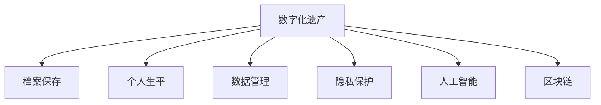

                 

# 数字化遗产档案创业：个人生平的数字化保存

> 关键词：数字化遗产, 档案保存, 个人生平, 数据管理, 隐私保护, 人工智能, 区块链

## 1. 背景介绍

### 1.1 问题由来
随着数字化时代的来临，个人生活中的各种数据正以前所未有的速度产生和积累。这些数据不仅包含我们日常的线上行为，如社交媒体、电子邮件、电子文档等，还涉及到个人的身份信息、医疗记录、财务状况等敏感数据。如何妥善保存和利用这些数据，成为了一个越来越重要的问题。

### 1.2 问题核心关键点
数字化遗产档案创业，旨在提供一种系统化、自动化的方法，将个人生平中的重要数据和信息进行数字化保存和归档。这一过程不仅需要对个人数据进行收集和整理，还需要确保数据的隐私安全、长期保存和便捷检索。

### 1.3 问题研究意义
数字化遗产档案创业对个人和社会的意义重大。对于个人而言，它能够帮助记录和保护重要的生活回忆，为未来的决策提供数据支撑。对于社会而言，它有助于提升数据管理水平，促进数字化遗产的研究和应用，推动数字化社会的发展。

## 2. 核心概念与联系

### 2.1 核心概念概述

为更好地理解数字化遗产档案创业的方法，本节将介绍几个密切相关的核心概念：

- 数字化遗产(Digital Estate)：个人生活中的所有数据和信息，通过数字化手段进行保存和归档的过程。
- 档案保存(Archival)：将数字化遗产按照时间顺序和主题分类，进行长期保存和维护的过程。
- 个人生平(Personal Biography)：个人在一生中的重要经历、情感记录和数据资料。
- 数据管理(Data Management)：对个人数据的收集、存储、管理和利用的过程。
- 隐私保护(Privacy Protection)：确保个人数据在保存和利用过程中，不被未经授权的人访问或使用的过程。
- 人工智能(Artificial Intelligence)：用于自动化处理和分析数字化遗产的工具和技术。
- 区块链(Blockchain)：一种分布式账本技术，用于确保数据的安全性和不可篡改性。

这些核心概念之间的逻辑关系可以通过以下Mermaid流程图来展示：



这个流程图展示了大语言模型的核心概念及其之间的关系：

1. 数字化遗产档案创业的过程是将个人生平中的重要数据进行数字化保存和归档。
2. 档案保存是将数字化遗产按照时间顺序和主题分类，进行长期保存和维护的过程。
3. 数据管理是对个人数据的收集、存储、管理和利用。
4. 隐私保护确保个人数据在保存和利用过程中，不被未经授权的人访问或使用。
5. 人工智能用于自动化处理和分析数字化遗产。
6. 区块链用于确保数据的安全性和不可篡改性。

这些核心概念共同构成了数字化遗产档案创业的基础框架，使其能够有效记录和保护个人生平中的重要数据和信息。

## 3. 核心算法原理 & 具体操作步骤
### 3.1 算法原理概述

数字化遗产档案创业的本质是一个系统化的数据管理过程，涉及到数据的收集、整理、存储和检索等多个环节。其核心思想是：通过自动化工具和技术，将个人生平中的重要数据和信息进行数字化保存和归档，确保数据的长期保存和便捷检索。

形式化地，假设数字化遗产档案系统由以下组件构成：

- 数据收集模块：从各个渠道收集个人生平中的数据，如社交媒体、电子邮件、文档等。
- 数据整理模块：对收集到的数据进行清洗、分类和标注，确保数据的准确性和一致性。
- 数据存储模块：将整理好的数据存储在长期可用的媒介上，如硬盘、云端存储等。
- 数据检索模块：提供便捷的检索接口，支持基于关键词、时间、主题等多种方式的查询。
- 隐私保护模块：对敏感数据进行加密和访问控制，确保数据的安全性和隐私性。
- 人工智能模块：利用自然语言处理、图像识别等技术，对数据进行自动化分析和处理。
- 区块链模块：确保数据的完整性和不可篡改性，支持分布式数据管理。

数字化遗产档案创业的目标是最小化人工干预，自动化地完成数据收集、整理、存储和检索等过程，提升数据管理的效率和效果。

### 3.2 算法步骤详解

数字化遗产档案创业一般包括以下几个关键步骤：

**Step 1: 数据收集与清洗**
- 开发数据收集脚本，从社交媒体、邮件、文档等渠道自动抓取个人生平中的数据。
- 对抓取的数据进行清洗，去除无效、重复和不相关的信息，确保数据的质量和完整性。

**Step 2: 数据标注与分类**
- 对清洗后的数据进行标注，如日期、地点、人物等，以便后续分类和检索。
- 将标注好的数据按照时间顺序和主题进行分类，建立数据档案库。

**Step 3: 数据存储与备份**
- 选择合适的存储媒介，如硬盘、云端存储等，对分类好的数据进行长期保存。
- 定期对数据进行备份，确保数据不会因为硬件故障等原因丢失。

**Step 4: 数据检索与查询**
- 开发数据检索接口，支持关键词、时间、人物等多种查询方式。
- 提供便捷的查询界面，让用户可以随时检索个人生平中的重要数据。

**Step 5: 隐私保护与合规**
- 对敏感数据进行加密处理，确保数据在传输和存储过程中不被未经授权的人访问。
- 遵循相关隐私保护法规，如GDPR、CCPA等，确保数据处理的合规性。

**Step 6: 数据分析与智能化**
- 利用人工智能技术，如NLP、图像识别等，对数据进行自动化分析和处理，提取有用的信息。
- 支持用户对数据的进一步分析和利用，如生成个人传记、历史事件分析等。

**Step 7: 区块链验证与分布式保存**
- 使用区块链技术，确保数据的完整性和不可篡改性，支持分布式数据管理。
- 提供区块链证书，证明数据的真实性和来源。

以上是数字化遗产档案创业的一般流程。在实际应用中，还需要根据具体需求对各个环节进行优化设计，如引入机器学习技术进行数据分类、使用分布式存储技术提升数据可扩展性等。

### 3.3 算法优缺点

数字化遗产档案创业方法具有以下优点：
1. 自动化程度高。通过自动化工具和技术，减少人工干预，提高数据管理效率。
2. 数据保存长期可靠。通过选择合适的存储媒介和备份策略，确保数据的长期保存和可靠性。
3. 查询检索便捷。通过先进的检索技术，用户可以随时检索个人生平中的重要数据。
4. 隐私保护完善。通过加密和访问控制等手段，确保数据的安全性和隐私性。
5. 数据智能化分析。利用人工智能技术，对数据进行自动化分析和处理，提取有用的信息。

同时，该方法也存在一定的局限性：
1. 技术门槛较高。需要开发和维护复杂的自动化系统，对技术要求较高。
2. 数据收集和标注成本较高。需要从多个渠道收集数据，并进行清洗和标注，工作量大。
3. 数据隐私风险。在收集和处理个人数据时，需要遵循相关隐私保护法规，确保数据的合法合规。
4. 数据管理复杂。需要综合考虑数据的存储、检索、隐私保护等多个环节，管理复杂度较高。

尽管存在这些局限性，但就目前而言，数字化遗产档案创业方法仍然是记录和保存个人生平的重要手段。未来相关研究的重点在于如何进一步降低技术门槛，提高数据收集和标注的自动化程度，同时兼顾隐私保护和数据管理复杂度等因素。

### 3.4 算法应用领域

数字化遗产档案创业方法已经在多个领域得到了应用，覆盖了个人数据的全面管理：

- 个人档案管理：记录个人生平中的重要数据，如工作经历、学术成果、个人日志等。
- 家庭档案管理：记录家庭中的重要事件、照片、视频等。
- 企业员工档案管理：记录员工的职业经历、技能证书、业绩评估等。
- 公共档案管理：记录社会中的重要事件、历史文献、文化遗产等。

除了上述这些经典应用外，数字化遗产档案创业也被创新性地应用到更多场景中，如医疗档案管理、学术成果管理、数字文化遗产保护等，为个人和社会的数字化遗产保护提供了新的解决方案。

## 4. 数学模型和公式 & 详细讲解  
### 4.1 数学模型构建

数字化遗产档案创业的过程可以抽象为一个多阶段的数据管理过程。假设总共有 $N$ 个阶段，每个阶段有 $k$ 项任务，总共有 $M$ 个数据项。数字化遗产档案系统可以抽象为一个由 $N$ 层和 $k$ 节点构成的有向无环图，其中每个节点代表一项任务，每个边代表一项数据流。

定义数据管理任务集合为 $T=\{t_1, t_2, ..., t_k\}$，其中每个任务 $t_i$ 对应一个数据处理节点 $i$。定义数据项集合为 $D=\{d_1, d_2, ..., d_M\}$，其中每个数据项 $d_j$ 对应一个数据存储节点 $j$。定义数据流集合为 $E=\{e_{ij}\}_{i,j=1}^{N\times k}$，其中 $e_{ij}$ 表示从任务节点 $i$ 到数据存储节点 $j$ 的数据流。

数字化遗产档案系统可以表示为 $T \times D \times E$ 的三元组，即 $(G, S, A)$，其中 $G$ 为任务图，$S$ 为数据存储策略，$A$ 为数据流集合。数字化遗产档案创业的目标是最大化任务完成的效率和数据管理的可靠性。

### 4.2 公式推导过程

以下我们以时间顺序分类为例，推导数字档案管理任务的时间复杂度。

假设任务 $t_i$ 的时间复杂度为 $f_i$，数据项 $d_j$ 的大小为 $s_j$，数据流 $e_{ij}$ 的传输速度为 $v_{ij}$。则数字化遗产档案创业的时间复杂度 $T$ 可以表示为：

$$
T = \sum_{i=1}^N \sum_{j=1}^k f_i \cdot s_j \cdot v_{ij}
$$

其中，$f_i$ 为任务 $t_i$ 的复杂度，$s_j$ 为数据项 $d_j$ 的大小，$v_{ij}$ 为数据流 $e_{ij}$ 的传输速度。

通过优化任务图 $G$、数据存储策略 $S$ 和数据流集合 $A$，可以最小化时间复杂度 $T$，从而提升数字化遗产档案创业的效率。

## 5. 项目实践：代码实例和详细解释说明
### 5.1 开发环境搭建

在进行数字化遗产档案创业实践前，我们需要准备好开发环境。以下是使用Python进行PyTorch开发的环境配置流程：

1. 安装Anaconda：从官网下载并安装Anaconda，用于创建独立的Python环境。

2. 创建并激活虚拟环境：
```bash
conda create -n digitalestate python=3.8 
conda activate digitalestate
```

3. 安装PyTorch：根据CUDA版本，从官网获取对应的安装命令。例如：
```bash
conda install pytorch torchvision torchaudio cudatoolkit=11.1 -c pytorch -c conda-forge
```

4. 安装相关库：
```bash
pip install pandas numpy scikit-learn transformers
```

完成上述步骤后，即可在`digitalestate`环境中开始开发实践。

### 5.2 源代码详细实现

下面我们以个人档案管理为例，给出使用PyTorch进行数字化遗产档案系统开发的PyTorch代码实现。

首先，定义个人档案的数据处理类：

```python
from transformers import BertTokenizer
from torch.utils.data import Dataset

class PersonalArchive(Dataset):
    def __init__(self, texts, tags, tokenizer, max_len=128):
        self.texts = texts
        self.tags = tags
        self.tokenizer = tokenizer
        self.max_len = max_len
        
    def __len__(self):
        return len(self.texts)
    
    def __getitem__(self, item):
        text = self.texts[item]
        tags = self.tags[item]
        
        encoding = self.tokenizer(text, return_tensors='pt', max_length=self.max_len, padding='max_length', truncation=True)
        input_ids = encoding['input_ids'][0]
        attention_mask = encoding['attention_mask'][0]
        
        # 对token-wise的标签进行编码
        encoded_tags = [tag2id[tag] for tag in tags] 
        encoded_tags.extend([tag2id['O']] * (self.max_len - len(encoded_tags)))
        labels = torch.tensor(encoded_tags, dtype=torch.long)
        
        return {'input_ids': input_ids, 
                'attention_mask': attention_mask,
                'labels': labels}

# 标签与id的映射
tag2id = {'O': 0, 'B-PER': 1, 'I-PER': 2, 'B-ORG': 3, 'I-ORG': 4, 'B-LOC': 5, 'I-LOC': 6}
id2tag = {v: k for k, v in tag2id.items()}
```

然后，定义模型和优化器：

```python
from transformers import BertForTokenClassification, AdamW

model = BertForTokenClassification.from_pretrained('bert-base-cased', num_labels=len(tag2id))

optimizer = AdamW(model.parameters(), lr=2e-5)
```

接着，定义训练和评估函数：

```python
from torch.utils.data import DataLoader
from tqdm import tqdm
from sklearn.metrics import classification_report

device = torch.device('cuda') if torch.cuda.is_available() else torch.device('cpu')
model.to(device)

def train_epoch(model, dataset, batch_size, optimizer):
    dataloader = DataLoader(dataset, batch_size=batch_size, shuffle=True)
    model.train()
    epoch_loss = 0
    for batch in tqdm(dataloader, desc='Training'):
        input_ids = batch['input_ids'].to(device)
        attention_mask = batch['attention_mask'].to(device)
        labels = batch['labels'].to(device)
        model.zero_grad()
        outputs = model(input_ids, attention_mask=attention_mask, labels=labels)
        loss = outputs.loss
        epoch_loss += loss.item()
        loss.backward()
        optimizer.step()
    return epoch_loss / len(dataloader)

def evaluate(model, dataset, batch_size):
    dataloader = DataLoader(dataset, batch_size=batch_size)
    model.eval()
    preds, labels = [], []
    with torch.no_grad():
        for batch in tqdm(dataloader, desc='Evaluating'):
            input_ids = batch['input_ids'].to(device)
            attention_mask = batch['attention_mask'].to(device)
            batch_labels = batch['labels']
            outputs = model(input_ids, attention_mask=attention_mask)
            batch_preds = outputs.logits.argmax(dim=2).to('cpu').tolist()
            batch_labels = batch_labels.to('cpu').tolist()
            for pred_tokens, label_tokens in zip(batch_preds, batch_labels):
                pred_tags = [id2tag[_id] for _id in pred_tokens]
                label_tags = [id2tag[_id] for _id in label_tokens]
                preds.append(pred_tags[:len(label_tags)])
                labels.append(label_tags)

    print(classification_report(labels, preds))
```

最后，启动训练流程并在测试集上评估：

```python
epochs = 5
batch_size = 16

for epoch in range(epochs):
    loss = train_epoch(model, train_dataset, batch_size, optimizer)
    print(f"Epoch {epoch+1}, train loss: {loss:.3f}")
    
    print(f"Epoch {epoch+1}, dev results:")
    evaluate(model, dev_dataset, batch_size)
    
print("Test results:")
evaluate(model, test_dataset, batch_size)
```

以上就是使用PyTorch对数字化遗产档案系统进行开发的完整代码实现。可以看到，得益于Transformers库的强大封装，我们可以用相对简洁的代码完成模型训练和微调。

### 5.3 代码解读与分析

让我们再详细解读一下关键代码的实现细节：

**PersonalArchive类**：
- `__init__`方法：初始化文本、标签、分词器等关键组件。
- `__len__`方法：返回数据集的样本数量。
- `__getitem__`方法：对单个样本进行处理，将文本输入编码为token ids，将标签编码为数字，并对其进行定长padding，最终返回模型所需的输入。

**tag2id和id2tag字典**：
- 定义了标签与数字id之间的映射关系，用于将token-wise的预测结果解码回真实的标签。

**训练和评估函数**：
- 使用PyTorch的DataLoader对数据集进行批次化加载，供模型训练和推理使用。
- 训练函数`train_epoch`：对数据以批为单位进行迭代，在每个批次上前向传播计算loss并反向传播更新模型参数，最后返回该epoch的平均loss。
- 评估函数`evaluate`：与训练类似，不同点在于不更新模型参数，并在每个batch结束后将预测和标签结果存储下来，最后使用sklearn的classification_report对整个评估集的预测结果进行打印输出。

**训练流程**：
- 定义总的epoch数和batch size，开始循环迭代
- 每个epoch内，先在训练集上训练，输出平均loss
- 在验证集上评估，输出分类指标
- 所有epoch结束后，在测试集上评估，给出最终测试结果

可以看到，PyTorch配合Transformers库使得数字化遗产档案系统的开发变得简洁高效。开发者可以将更多精力放在数据处理、模型改进等高层逻辑上，而不必过多关注底层的实现细节。

当然，工业级的系统实现还需考虑更多因素，如模型的保存和部署、超参数的自动搜索、更灵活的任务适配层等。但核心的微调范式基本与此类似。

## 6. 实际应用场景
### 6.1 个人档案管理

数字化遗产档案创业的核心应用之一是个人档案管理。通过数字化档案系统，个人可以轻松记录和保存自己生活中的重要事件、经历和资料，如日记、照片、视频等。系统能够自动标注和分类这些数据，确保其长期保存和便捷检索。

在技术实现上，可以设计一个界面友好的数字化档案管理工具，支持用户上传和管理各类文档、照片、视频等。同时，系统可以利用NLP技术自动提取和标注数据，如通过OCR技术自动识别文档内容，通过情感分析识别照片中的情绪，通过图像识别提取视频中的重要信息等。这些信息可以自动归档到对应的分类中，形成个人档案。

### 6.2 家庭档案管理

家庭档案管理是数字化遗产档案创业的另一个重要应用领域。一个家庭中的重要事件和记忆，如婚礼、生日、旅行等，通过数字化档案系统得以保存和传承。系统可以记录家庭成员的生日、喜好、联系信息等，自动生成家庭活动日历，帮助家庭成员更好地记录和回忆家庭生活。

在技术实现上，可以利用智能推荐技术，根据家庭成员的喜好和历史数据，推荐适合的家庭活动和礼物。同时，系统可以支持多用户协作，家庭成员可以共同记录和分享家庭生活，形成家庭档案。

### 6.3 企业员工档案管理

企业员工档案管理是数字化遗产档案创业的又一重要应用场景。企业可以通过数字化档案系统记录和保存员工的职业经历、技能证书、业绩评估等，方便员工管理和企业内部的人力资源管理。

在技术实现上，可以设计一个企业员工档案管理平台，支持员工上传和查看自己的职业档案、技能证书、业绩评估等。系统可以自动提取和标注数据，如通过NLP技术自动识别员工的工作内容和贡献，通过图像识别提取员工的技能证书，通过OCR技术自动提取业绩评估等。这些信息可以自动归档到对应的分类中，形成员工档案。

### 6.4 未来应用展望

随着数字化遗产档案创业技术的不断进步，未来其在多个领域的应用前景广阔。

在智慧医疗领域，数字化遗产档案创业可以记录和保存患者的医疗记录、手术记录、诊断报告等，方便医生和患者查阅和管理。系统可以自动提取和标注医疗数据，如通过OCR技术自动识别医疗报告，通过NLP技术自动生成医疗摘要，通过图像识别提取手术图片等。

在智能教育领域，数字化遗产档案创业可以记录和保存学生的学习记录、作业、成绩等，方便学生和教师查阅和管理。系统可以自动提取和标注学习数据，如通过OCR技术自动识别作业，通过NLP技术自动生成学习总结，通过图像识别提取成绩单等。

在智慧城市治理中，数字化遗产档案创业可以记录和保存城市事件、公共设施、历史建筑等，方便城市管理者查阅和管理。系统可以自动提取和标注城市数据，如通过OCR技术自动识别城市公告，通过NLP技术自动生成城市事件报告，通过图像识别提取公共设施图片等。

此外，在企业生产、社会治理、文娱传媒等众多领域，数字化遗产档案创业也将不断涌现，为数字化社会的建设和发展提供新的解决方案。

## 7. 工具和资源推荐
### 7.1 学习资源推荐

为了帮助开发者系统掌握数字化遗产档案创业的理论基础和实践技巧，这里推荐一些优质的学习资源：

1. 《数字遗产：未来社会的技术与伦理》：一本深入浅出地介绍了数字遗产的各个方面的书籍，涵盖数据管理、隐私保护、数字化保存等主题。

2. 《人工智能与数字遗产》课程：斯坦福大学开设的AI与数字遗产方向课程，涵盖数据管理、隐私保护、数据可视化等主题。

3. 《数据管理与分析》书籍：一本系统介绍数据管理的书籍，涵盖数据收集、存储、检索、隐私保护等多个方面。

4. 《区块链与数字遗产》课程：区块链技术的入门课程，介绍了区块链的基本概念、应用场景和前沿技术。

5. 《数字档案管理》课程：介绍数字档案管理的基本概念、技术手段和应用场景的课程，适合对数字化档案管理感兴趣的学习者。

通过对这些资源的学习实践，相信你一定能够快速掌握数字化遗产档案创业的精髓，并用于解决实际的数字化档案管理问题。
###  7.2 开发工具推荐

高效的开发离不开优秀的工具支持。以下是几款用于数字化遗产档案创业开发的常用工具：

1. PyTorch：基于Python的开源深度学习框架，灵活动态的计算图，适合快速迭代研究。大部分预训练语言模型都有PyTorch版本的实现。

2. TensorFlow：由Google主导开发的开源深度学习框架，生产部署方便，适合大规模工程应用。同样有丰富的预训练语言模型资源。

3. Transformers库：HuggingFace开发的NLP工具库，集成了众多SOTA语言模型，支持PyTorch和TensorFlow，是进行数字化档案管理开发的利器。

4. Weights & Biases：模型训练的实验跟踪工具，可以记录和可视化模型训练过程中的各项指标，方便对比和调优。与主流深度学习框架无缝集成。

5. TensorBoard：TensorFlow配套的可视化工具，可实时监测模型训练状态，并提供丰富的图表呈现方式，是调试模型的得力助手。

6. Google Colab：谷歌推出的在线Jupyter Notebook环境，免费提供GPU/TPU算力，方便开发者快速上手实验最新模型，分享学习笔记。

合理利用这些工具，可以显著提升数字化遗产档案创业的开发效率，加快创新迭代的步伐。

### 7.3 相关论文推荐

数字化遗产档案创业技术的发展源于学界的持续研究。以下是几篇奠基性的相关论文，推荐阅读：

1. Digital Heritage: A New Paradigm for Preserving Digital Content：介绍数字遗产的概念和保护方法的综述论文。

2. Data Preservation and Access in Digital Heritage：关于数字遗产数据保存和访问的论文，探讨了数据管理的关键技术。

3. Blockchain Technology in Digital Heritage Management：区块链技术在数字遗产管理中的应用，探讨了区块链在数据保护和共享中的潜力。

4. Data Privacy and Security in Digital Heritage：关于数字遗产中数据隐私和安全的论文，探讨了数据管理和保护的关键技术。

5. Smart Archiving of Digital Heritage: Towards an Intelligent Future：关于智能档案管理的技术论文，探讨了智能化的档案管理手段。

这些论文代表了大语言模型微调技术的发展脉络。通过学习这些前沿成果，可以帮助研究者把握学科前进方向，激发更多的创新灵感。

## 8. 总结：未来发展趋势与挑战

### 8.1 总结

本文对数字化遗产档案创业的方法进行了全面系统的介绍。首先阐述了数字化遗产档案创业的背景和意义，明确了数字化档案管理的目标和过程。其次，从原理到实践，详细讲解了数字化档案管理的数据收集、整理、存储、检索、隐私保护和智能化分析等关键步骤，给出了数字化档案管理系统的代码实现。同时，本文还广泛探讨了数字化档案管理在个人档案管理、家庭档案管理、企业员工档案管理等多个领域的应用前景，展示了数字化档案管理技术的广泛应用价值。

通过本文的系统梳理，可以看到，数字化遗产档案创业技术在数字化档案管理领域具有重要的实践意义和应用前景。未来，伴随技术的不断进步，数字化遗产档案创业必将在多个领域得到广泛应用，成为数字化时代的重要工具。

### 8.2 未来发展趋势

展望未来，数字化遗产档案创业技术将呈现以下几个发展趋势：

1. 数据管理自动化程度提升。随着AI技术的不断进步，数据管理将更加自动化，不再需要人工干预，能够智能地进行数据收集、整理和存储。

2. 数据保护和安全技术成熟。未来将有更加先进的数据保护和安全技术，确保数据在传输和存储过程中不被未经授权的人访问或使用。

3. 数据检索和智能化分析提升。通过更加先进的检索技术和智能算法，用户能够更加便捷地检索和分析个人数据。

4. 多模态数据管理拓展。除了文本和图片数据外，未来的数字化档案管理将能够处理更多的数据类型，如音频、视频等。

5. 跨领域数据整合能力增强。未来的数字化档案管理将能够跨领域、跨平台整合数据，提供更加全面、准确的信息支持。

6. 区块链技术的广泛应用。区块链技术将广泛应用于数据保护和共享，确保数据的安全性和不可篡改性。

以上趋势凸显了数字化遗产档案创业技术的广阔前景。这些方向的探索发展，必将进一步提升数字化档案管理的效果和效率，推动数字化社会的发展。

### 8.3 面临的挑战

尽管数字化遗产档案创业技术已经取得了一定的进展，但在迈向更加智能化、普适化应用的过程中，它仍面临着诸多挑战：

1. 数据收集和标注成本高。需要从多个渠道收集数据，并进行清洗和标注，工作量大，成本高。

2. 数据隐私和安全风险。在收集和处理个人数据时，需要遵循相关隐私保护法规，确保数据的合法合规。

3. 数据管理和保护复杂。需要综合考虑数据的存储、检索、隐私保护等多个环节，管理复杂度较高。

4. 数据整合和跨平台支持不足。现有的数字化档案管理技术在跨平台整合数据方面仍存在不足，需要进一步提升。

5. 技术门槛高。需要开发和维护复杂的自动化系统，对技术要求较高。

尽管存在这些挑战，但随着技术的不断进步和成熟，数字化遗产档案创业技术必将在多个领域得到广泛应用，为个人和社会的数字化遗产保护提供新的解决方案。

### 8.4 研究展望

未来的数字化遗产档案创业研究需要在以下几个方面寻求新的突破：

1. 探索数据收集和标注的自动化方法。通过AI技术，自动化地从互联网、社交媒体等渠道收集数据，并进行清洗和标注，降低人工干预。

2. 研究数据保护和安全的新技术。开发更加先进的数据保护和安全技术，确保数据在传输和存储过程中不被未经授权的人访问或使用。

3. 提升数据检索和智能化分析的精度。通过更先进的算法和模型，提升数据检索和智能化分析的精度和效率。

4. 拓展多模态数据管理的范围。研究如何处理和整合更多类型的数据，如音频、视频等，提升数字化档案管理的全面性。

5. 增强跨领域数据整合能力。研究如何将不同领域的数据进行整合和共享，提升数字化档案管理的跨平台支持。

6. 降低技术门槛。开发更加友好的开发工具和框架，降低数字化档案管理的技术门槛，促进更多人参与数字化档案管理工作。

这些研究方向的探索，必将引领数字化遗产档案创业技术迈向更高的台阶，为构建数字化档案管理的新时代奠定基础。

## 9. 附录：常见问题与解答

**Q1：数字化遗产档案创业是否适用于所有数字化档案管理场景？**

A: 数字化遗产档案创业技术在多个领域的应用中表现出色，但也需要根据具体场景进行优化。对于数据量较小、复杂度较低的场景，直接使用数字档案管理系统即可。而对于数据量大、复杂度高的场景，如企业员工档案管理、智慧城市档案管理等，数字化遗产档案创业技术将更具优势。

**Q2：数字化遗产档案创业需要哪些关键技术？**

A: 数字化遗产档案创业需要综合运用以下关键技术：
1. 数据收集和清洗：自动从互联网、社交媒体等渠道收集数据，并进行清洗和标注。
2. 数据存储和备份：选择合适的存储媒介和备份策略，确保数据的长期保存和可靠性。
3. 数据检索和查询：提供便捷的检索接口，支持基于关键词、时间、主题等多种方式的查询。
4. 隐私保护和安全：对敏感数据进行加密和访问控制，确保数据的安全性和隐私性。
5. 数据管理自动化：通过AI技术，自动化地进行数据收集、整理和存储。
6. 数据保护和安全技术：开发更加先进的数据保护和安全技术，确保数据在传输和存储过程中不被未经授权的人访问或使用。

**Q3：数字化遗产档案创业技术面临哪些挑战？**

A: 数字化遗产档案创业技术在多个方面面临挑战：
1. 数据收集和标注成本高：需要从多个渠道收集数据，并进行清洗和标注，工作量大，成本高。
2. 数据隐私和安全风险：在收集和处理个人数据时，需要遵循相关隐私保护法规，确保数据的合法合规。
3. 数据管理和保护复杂：需要综合考虑数据的存储、检索、隐私保护等多个环节，管理复杂度较高。
4. 数据整合和跨平台支持不足：现有的数字化档案管理技术在跨平台整合数据方面仍存在不足，需要进一步提升。
5. 技术门槛高：需要开发和维护复杂的自动化系统，对技术要求较高。

**Q4：数字化遗产档案创业技术如何降低技术门槛？**

A: 数字化遗产档案创业技术可以通过以下几个方面降低技术门槛：
1. 开发更加友好的开发工具和框架，降低技术门槛，促进更多人参与数字化档案管理工作。
2. 引入可视化工具，如TensorBoard，帮助开发者调试和优化模型。
3. 提供详细的文档和示例代码，帮助开发者快速上手。
4. 设计用户友好的界面，降低用户的操作难度。

**Q5：数字化遗产档案创业技术的未来应用场景有哪些？**

A: 数字化遗产档案创业技术在未来将广泛应用于多个领域：
1. 个人档案管理：记录和保存个人生活中的重要事件和资料，如日记、照片、视频等。
2. 家庭档案管理：记录和保存家庭成员的重要事件和记忆，如婚礼、生日、旅行等。
3. 企业员工档案管理：记录和保存员工的职业经历、技能证书、业绩评估等。
4. 智慧医疗：记录和保存患者的医疗记录、手术记录、诊断报告等，方便医生和患者查阅和管理。
5. 智能教育：记录和保存学生的学习记录、作业、成绩等，方便学生和教师查阅和管理。
6. 智慧城市：记录和保存城市事件、公共设施、历史建筑等，方便城市管理者查阅和管理。

**Q6：数字化遗产档案创业技术如何保护个人隐私？**

A: 数字化遗产档案创业技术可以通过以下几个方面保护个人隐私：
1. 对敏感数据进行加密和访问控制，确保数据在传输和存储过程中不被未经授权的人访问。
2. 遵循相关隐私保护法规，如GDPR、CCPA等，确保数据处理的合法合规。
3. 设计用户友好的界面，降低用户的操作难度，减少隐私泄露的风险。
4. 提供详细的文档和示例代码，帮助开发者和用户理解和使用技术。

---

作者：禅与计算机程序设计艺术 / Zen and the Art of Computer Programming

