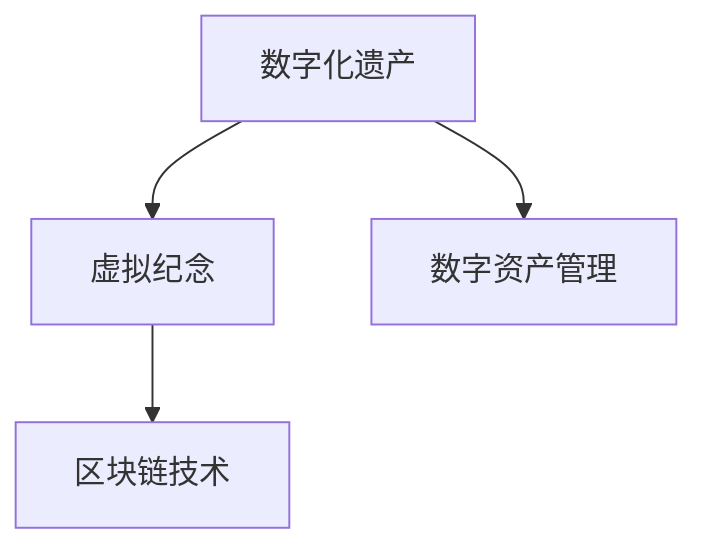
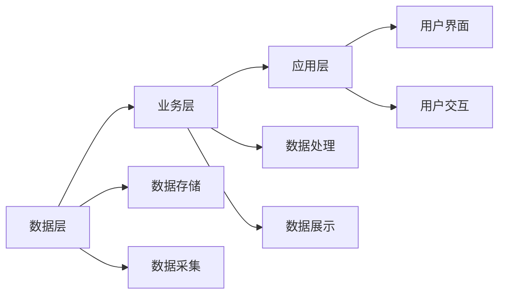

                 

# 数字化遗产虚拟纪念创业：永恒的网上纪念馆

数字化时代的浪潮正在深刻改变我们的生活方式，也在不经意间留下了永恒的数字化遗产。无论是个体的记忆碎片，还是家族的共同历史，我们都渴望通过数字技术，将这些珍贵回忆永久保存。虚拟纪念馆，便应运而生，它不仅能让逝者继续留存于我们的记忆中，更提供了一个超越时空的交流平台，让生者得以缅怀，让历史得以传承。本文将深入探讨数字化遗产虚拟纪念创业的原理、实践与展望，为您揭开这门新兴技术的神秘面纱。

## 1. 背景介绍

### 1.1 数字遗产与虚拟纪念的兴起
随着数字技术的飞速发展，我们每个人都在不知不觉中积累着大量数字化资产，包括照片、视频、音频、文档、邮件等。这些数字资产不仅记录了我们日常生活的点点滴滴，更是我们家族历史、文化传承的重要载体。然而，这些数字遗产如果得不到妥善保存，可能会在未来的某个时刻，随着物理载体的损坏或技术设备的淘汰而永远消失。

虚拟纪念，即通过数字化手段，将物理形态的遗产转换为可长久保存、随时访问的数字形式。它不仅能有效保护我们的数字资产，还能提供一种全新的纪念方式，让跨越时空的缅怀成为可能。

### 1.2 技术变革与需求驱动
数字化遗产的虚拟纪念，既是技术创新的产物，也是社会需求驱动的结果。技术的进步，如大数据、人工智能、区块链等，为虚拟纪念提供了强大的技术支持。而随着老龄社会的到来，人们对虚拟纪念的需求日益增加，这为虚拟纪念技术的商业化提供了巨大的市场空间。

## 2. 核心概念与联系

### 2.1 核心概念概述

数字化遗产虚拟纪念创业涉及多个核心概念，包括数字化遗产、虚拟纪念、数字资产管理、区块链技术等。这些概念之间存在着紧密的联系，共同构成了虚拟纪念创业的基础。

- **数字化遗产**：指通过数字技术保存下来的个人或家族的历史记录，如照片、视频、文档等。
- **虚拟纪念**：通过数字化手段，将物理遗产转换为数字形式，以便长久保存和随时访问。
- **数字资产管理**：指对数字化遗产进行分类、整理、存储和保护的过程。
- **区块链技术**：一种去中心化的分布式账本技术，为虚拟纪念提供了数据安全、不可篡改和永久存储的保障。

这些概念之间的逻辑关系可以通过以下Mermaid流程图来展示：



### 2.2 核心概念原理和架构的 Mermaid 流程图
这里展示一个简单的虚拟纪念系统的架构图，包括数据层、业务层和应用层：



### 2.3 核心概念之间的关系

数字化遗产虚拟纪念创业的成功，离不开对核心概念的深入理解和合理应用。

- **数字化遗产**是虚拟纪念的基础，决定了虚拟纪念的内容和形式。
- **数字资产管理**保障了数字化遗产的安全和完整，是虚拟纪念的实施手段。
- **虚拟纪念**是数字化遗产的高级形态，是数字化遗产价值的延续和扩展。
- **区块链技术**为虚拟纪念提供了技术保障，确保了数据的不可篡改和永久性。

这些概念共同构成了数字化遗产虚拟纪念创业的基石，缺一不可。

## 3. 核心算法原理 & 具体操作步骤

### 3.1 算法原理概述

数字化遗产虚拟纪念的算法原理主要围绕着数据的采集、处理、存储和展示展开。其核心思想是通过数字技术，将物理遗产转换为数字形式，并通过区块链技术保障数据的永久保存和不可篡改。

- **数据采集**：从不同来源（如手机、相机、计算机等）收集数字化遗产，并转化为标准化的数字格式。
- **数据处理**：对采集到的数据进行分类、整理和清洗，去除冗余和噪声，提取有用信息。
- **数据存储**：利用分布式存储技术（如Hadoop、AWS S3等）实现数据的分布式存储，保障数据的可靠性和可扩展性。
- **数据展示**：通过Web前端和后端技术，将处理后的数据展示给用户，提供浏览、查询和互动功能。

### 3.2 算法步骤详解

数字化遗产虚拟纪念的算法步骤可以分为以下几个主要阶段：

1. **数据采集与预处理**
   - 确定数字化遗产的来源和格式，收集相关数据。
   - 对数据进行预处理，包括格式转换、质量控制、数据清洗等。

2. **数据存储与备份**
   - 选择合适的数据存储技术，将数据存储在分布式系统中。
   - 定期备份数据，确保数据的安全性和可靠性。

3. **数据处理与分析**
   - 对存储的数据进行分类、整理和分析，提取有用信息。
   - 利用AI技术对数据进行语义分析和情感识别，提升用户体验。

4. **数据展示与互动**
   - 通过Web前端技术，将处理后的数据展示给用户。
   - 提供丰富的交互功能，如搜索、筛选、评论、分享等，增强用户体验。

5. **区块链技术应用**
   - 利用区块链技术，保障数据的不可篡改和永久保存。
   - 实现数据的加密和访问控制，确保数据的安全性和隐私性。

### 3.3 算法优缺点

数字化遗产虚拟纪念的算法具有以下优点：

- **永久保存**：通过区块链技术，保障数据的不可篡改和永久保存，确保了数字遗产的长久流传。
- **便捷访问**：用户可以随时随地通过网络访问数字化遗产，无需物理载体。
- **交互性强**：通过Web前端技术和AI技术，提供丰富的交互功能和用户体验。

然而，该算法也存在一些缺点：

- **技术复杂**：涉及数据采集、处理、存储、展示等多个环节，技术复杂度较高。
- **成本较高**：需要投入大量的资金和人力进行技术开发和维护。
- **隐私风险**：用户数据的隐私和安全问题需要得到充分保障。

### 3.4 算法应用领域

数字化遗产虚拟纪念的算法广泛应用于多个领域，包括但不限于：

- **个人纪念**：帮助个人保存和分享家庭的记忆，如照片、视频、日记等。
- **家族历史**：记录和传承家族的共同历史，如家谱、家族故事、家族文档等。
- **社区纪念**：保存和展示社区的历史和文化，如社区活动记录、历史照片、社区新闻等。
- **历史文献**：保存和展示历史文献、档案、文化遗产等，促进文化传承和历史研究。

## 4. 数学模型和公式 & 详细讲解 & 举例说明

### 4.1 数学模型构建

数字化遗产虚拟纪念的数学模型主要围绕着数据的采集、处理和展示展开。这里简化为一个简单的数据分类模型，用于说明问题。

设数字化遗产的数据集为 $D=\{(x_i,y_i)\}_{i=1}^N$，其中 $x_i$ 为数据样本，$y_i$ 为分类标签。我们的目标是构建一个分类器 $f(x)$，将数据 $x$ 分为 $K$ 个类别。

### 4.2 公式推导过程

以简单的KNN分类器为例，推导其分类公式。设训练集为 $D$，新数据点为 $x_0$，与 $x_0$ 距离最近的 $K$ 个训练样本为 $x_k$，则 $x_0$ 的分类标签为：

$$
y = \mathop{\arg\min}_{k \in [1,K]} dist(x_0,x_k)
$$

其中 $dist(\cdot)$ 为距离度量函数。

### 4.3 案例分析与讲解

假设我们有一个数字化遗产数据集，包含照片、视频和音频等多种类型的数据。通过数据分类模型，我们可以将其分为个人纪念、家族历史和社区纪念三大类。通过进一步的语义分析和情感识别，可以为每个类别提供更加个性化的展示和互动体验。

## 5. 项目实践：代码实例和详细解释说明

### 5.1 开发环境搭建

要进行数字化遗产虚拟纪念的开发，首先需要搭建一个开发环境。

1. 安装Python环境：使用Anaconda或Miniconda，确保Python 3.8及以上版本。

2. 安装必要的库：包括numpy、pandas、matplotlib、scikit-learn、tensorflow等。

3. 安装Web框架：如Flask、Django等，用于后端开发。

4. 安装前端框架：如React、Vue等，用于前端开发。

5. 安装区块链库：如web3.py、ethsdk等，用于区块链技术开发。

### 5.2 源代码详细实现

这里提供一个简单的示例代码，用于说明数字化遗产虚拟纪念的基本实现流程。

```python
from flask import Flask, render_template, request
import numpy as np
from sklearn.cluster import KMeans
from sklearn.feature_extraction.text import TfidfVectorizer

app = Flask(__name__)

@app.route('/')
def index():
    return render_template('index.html')

@app.route('/process', methods=['POST'])
def process():
    data = request.form.get('data')
    vectorizer = TfidfVectorizer()
    X = vectorizer.fit_transform([data])
    kmeans = KMeans(n_clusters=3)
    kmeans.fit(X)
    label = kmeans.predict(X)[0]
    return f'This data belongs to category {label}'

if __name__ == '__main__':
    app.run(debug=True)
```

### 5.3 代码解读与分析

上述代码使用了Flask框架，实现了简单的数据分类功能。用户通过网页提交数据，后端代码将数据进行TF-IDF向量化，并使用KMeans算法进行分类。最后，根据分类结果返回相应的分类标签。

### 5.4 运行结果展示

在Web前端页面上，用户可以提交照片、视频等数据，并查看分类结果。这种简单的分类功能，虽然不能完全满足数字化遗产虚拟纪念的需求，但可以作为示范，展示基本的数据处理和展示流程。

## 6. 实际应用场景

### 6.1 个人纪念

个人纪念是数字化遗产虚拟纪念的重要应用场景之一。通过虚拟纪念，个人可以保存和分享家庭的记忆，如照片、视频、日记等。用户可以在虚拟纪念馆中，上传个人的数据，并通过Web前端页面浏览和分享。

### 6.2 家族历史

家族历史是另一个重要的应用场景。虚拟纪念可以帮助家族记录和传承共同的历史，如家谱、家族故事、家族文档等。用户可以上传家族的历史数据，并通过Web前端页面展示家族历史的重要时刻和重要人物。

### 6.3 社区纪念

社区纪念是数字化遗产虚拟纪念的又一应用场景。社区纪念可以保存和展示社区的历史和文化，如社区活动记录、历史照片、社区新闻等。用户可以上传社区的历史数据，并通过Web前端页面展示社区的变迁和发展。

### 6.4 历史文献

历史文献是数字化遗产虚拟纪念的重要领域。虚拟纪念可以保存和展示历史文献、档案、文化遗产等，促进文化传承和历史研究。用户可以上传历史文献的数据，并通过Web前端页面展示历史文献的重要内容。

## 7. 工具和资源推荐

### 7.1 学习资源推荐

1. **《Python数据分析》**：详细介绍了Python在数据分析和机器学习中的应用，是学习数据处理和建模的基础。
2. **《Flask Web开发实战》**：介绍了Flask框架的搭建和应用，是学习Web开发的入门书籍。
3. **《TensorFlow深度学习实战》**：介绍了TensorFlow框架在深度学习中的应用，是学习机器学习算法的经典教材。
4. **《区块链原理与技术》**：介绍了区块链技术的原理和应用，是学习区块链技术的基础教材。

### 7.2 开发工具推荐

1. **Jupyter Notebook**：用于数据处理和算法实验的轻量级工具，支持Python、R等多种语言。
2. **PyCharm**：Python开发环境，提供丰富的代码补全和调试功能。
3. **GitHub**：代码版本控制系统，方便团队协作和代码共享。
4. **AWS SageMaker**：基于云的机器学习平台，提供强大的数据处理和模型训练功能。

### 7.3 相关论文推荐

1. **《A Survey of Digital Heritage Management》**：综述了数字化遗产管理的相关技术和应用，为数字化遗产虚拟纪念提供了理论基础。
2. **《Blockchain Technology for Digital Heritage Preservation》**：介绍了区块链技术在数字化遗产保护中的应用，展示了区块链技术的优势和潜力。
3. **《The Future of Digital Heritage Preservation》**：展望了数字化遗产虚拟纪念的未来发展趋势，探讨了未来的技术方向和应用场景。

## 8. 总结：未来发展趋势与挑战

### 8.1 研究成果总结

数字化遗产虚拟纪念的创业实践，已经取得了一定的进展，但仍然面临诸多挑战。当前的研究成果主要集中在以下几个方面：

1. **数据分类和标注**：通过自然语言处理和机器学习技术，实现对数字化遗产的自动分类和标注。
2. **区块链技术应用**：利用区块链技术保障数据的不可篡改和永久保存。
3. **Web前端开发**：通过Web前端技术，实现数据的展示和互动。

### 8.2 未来发展趋势

数字化遗产虚拟纪念的未来发展趋势主要包括以下几个方向：

1. **智能化提升**：引入AI技术，提升数字化遗产的语义分析和情感识别，增强用户体验。
2. **跨平台扩展**：支持多平台访问，如移动端、桌面端、AR/VR等，实现跨平台体验。
3. **多模态融合**：融合图像、视频、音频等多种模态数据，提供更加丰富的展示和互动体验。

### 8.3 面临的挑战

尽管数字化遗产虚拟纪念有着广阔的市场前景，但也面临一些挑战：

1. **数据隐私和安全**：用户数据的隐私和安全问题需要得到充分保障。
2. **技术和成本**：技术复杂度较高，需要投入大量的资金和人力进行技术开发和维护。
3. **用户体验**：用户体验的提升需要持续的优化和改进。

### 8.4 研究展望

未来，数字化遗产虚拟纪念的研究方向主要包括以下几个方面：

1. **隐私保护技术**：研究如何保护用户数据的隐私和安全，避免数据泄露和滥用。
2. **智能交互技术**：研究如何通过AI技术提升用户的交互体验，如语音识别、情感识别等。
3. **多模态融合技术**：研究如何融合多种模态数据，提供更加丰富和真实的展示体验。

## 9. 附录：常见问题与解答

**Q1: 如何确保数字化遗产的完整性和不可篡改性？**

A: 利用区块链技术，将数字化遗产的数据进行哈希计算，生成唯一标识的哈希值。每个哈希值对应一个时间戳，记录数据的上传时间和上传者信息。通过分布式存储和去中心化技术，确保数据的完整性和不可篡改性。

**Q2: 数字化遗产虚拟纪念的商业模式如何？**

A: 数字化遗产虚拟纪念的商业模式主要包括以下几种：

1. **订阅制**：用户通过订阅服务，获得永久的访问权和展示权。
2. **广告模式**：通过展示广告，获取广告收入。
3. **会员增值服务**：提供高级会员服务，如更多的展示空间、定制化的展示方式等。

**Q3: 数字化遗产虚拟纪念的技术难点有哪些？**

A: 数字化遗产虚拟纪念的技术难点主要包括以下几个方面：

1. **数据采集和预处理**：需要从不同的设备和平台采集数据，并进行格式转换和预处理。
2. **数据存储和备份**：需要保证数据的可靠性和可扩展性，并定期进行备份。
3. **数据展示和互动**：需要提供丰富的展示和互动功能，提升用户体验。

总之，数字化遗产虚拟纪念的创业实践需要深入理解数字化遗产的核心概念，结合技术创新和商业模式，才能实现长久的可持续发展。

---

作者：禅与计算机程序设计艺术 / Zen and the Art of Computer Programming

