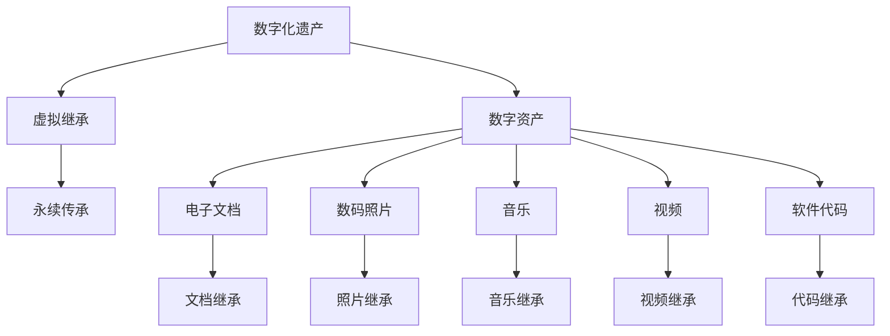
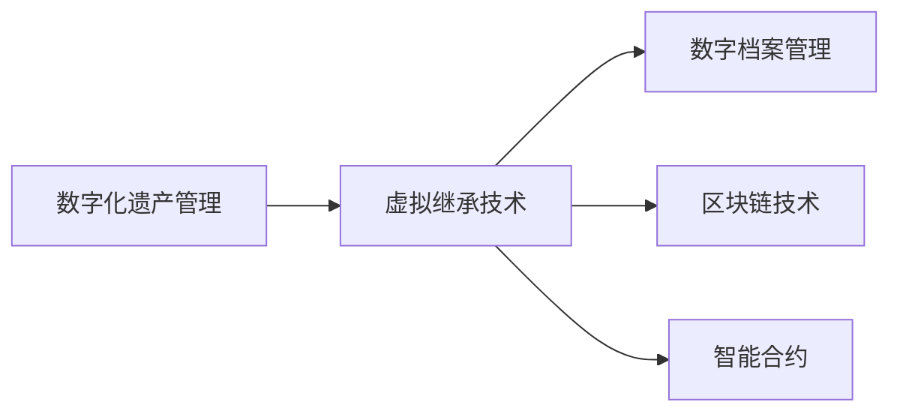

                 

# 数字化遗产虚拟继承创业：数字资产的永续传承

## 1. 背景介绍

### 1.1 问题由来

在数字化快速发展的今天，数字资产（如电子文档、数码照片、音乐、视频等）已经成为我们生活的重要组成部分。但随着数字遗产的增多，如何管理和传承这些数字资产，确保其长期保存和有效利用，成为了一个亟待解决的问题。传统物理遗产的继承方式，如遗嘱、遗产分配等，对于数字资产显得束手无策。数字资产的继承和传承，需要一种全新的方式来确保其完整性和可访问性。

### 1.2 问题核心关键点

本节将介绍数字化遗产虚拟继承创业的核心问题，并探讨相关概念及其关联：

- **数字化遗产**：指个人或机构在数字化过程中产生的所有数字资产。
- **虚拟继承**：指通过技术手段，对数字化遗产进行管理和传承的方式，使继承者可以持续访问和使用这些资产。
- **数字资产**：包括电子文档、数码照片、音乐、视频、软件代码等。
- **永续传承**：确保数字资产在长期内保持可用性和可访问性。

这些核心概念之间的逻辑关系可以通过以下Mermaid流程图来展示：



这个流程图展示了数字化遗产的核心概念及其关系：

1. 数字化遗产是虚拟继承的对象。
2. 数字资产是数字化遗产的组成部分。
3. 虚拟继承使数字化遗产能够被有效管理和传承。
4. 永续传承确保了数字化遗产的长期可用性。
5. 不同类型的数字资产（文档、照片、音乐、视频、代码等）分别通过不同的方式进行继承。

## 2. 核心概念与联系

### 2.1 核心概念概述

为了更好地理解数字化遗产虚拟继承的原理和应用，本节将详细介绍相关的核心概念及其相互联系：

- **数字化遗产管理**：对个人或机构在数字化过程中产生的数字资产进行系统化的管理和维护，确保其完整性和可访问性。
- **虚拟继承技术**：利用数字技术手段，使数字化遗产可以跨时间和空间传承，实现继承者和后代的访问和使用。
- **数字档案管理**：通过标准化流程和技术手段，对数字资产进行长期保存和管理。
- **区块链技术**：用于记录和验证数字化遗产的传递和继承过程，确保其不可篡改和透明性。
- **智能合约**：基于区块链技术的自动化合约，用于自动执行数字化遗产的分配和管理。

这些核心概念通过以下合成的逻辑架构图来呈现：



这个逻辑架构图展示了数字化遗产虚拟继承的核心概念及其相互联系：

1. 数字化遗产管理是虚拟继承的基础。
2. 虚拟继承技术实现数字化遗产的跨时空传承。
3. 数字档案管理保证了数字化遗产的长期保存。
4. 区块链技术确保了数字化遗产传递的不可篡改和透明性。
5. 智能合约提供了自动执行数字化遗产管理的功能。

这些概念共同构成了数字化遗产虚拟继承的完整框架，为实现数字化遗产的永续传承提供了技术基础。

## 3. 核心算法原理 & 具体操作步骤

### 3.1 算法原理概述

数字化遗产虚拟继承创业的核心算法原理，是通过数字化遗产管理、虚拟继承技术、数字档案管理、区块链技术和智能合约的有机结合，实现数字资产的长期保存和传承。其核心思想是：

1. 对数字化遗产进行系统化的管理和维护，确保其完整性和可访问性。
2. 利用虚拟继承技术，使数字化遗产可以跨时间和空间传承，实现继承者和后代的访问和使用。
3. 通过数字档案管理，对数字化遗产进行标准化保存和维护，确保其长期可用性。
4. 引入区块链技术，记录和验证数字化遗产的传递和继承过程，确保其不可篡改和透明性。
5. 利用智能合约，自动化执行数字化遗产的分配和管理，确保继承过程的公正和高效。

### 3.2 算法步骤详解

基于上述算法原理，数字化遗产虚拟继承创业可以分为以下几个关键步骤：

**Step 1: 数字资产收集和整理**

- 收集个人或机构的数字化遗产，包括电子文档、数码照片、音乐、视频、软件代码等。
- 对数字资产进行分类和整理，形成数字化遗产清单。
- 对分类后的数字资产进行标准化处理，确保其格式和内容的一致性。

**Step 2: 数字化遗产存储和管理**

- 选择合适的数字档案管理系统，对数字化遗产进行长期保存。
- 引入数字档案管理标准和流程，确保数字化遗产的完整性和可访问性。
- 使用数字档案管理工具，对数字化遗产进行定期维护和更新，保证其长期可用性。

**Step 3: 虚拟继承技术应用**

- 引入区块链技术，构建数字化遗产的虚拟继承链。
- 使用智能合约，自动执行数字化遗产的分配和管理。
- 设计灵活的虚拟继承规则，确保数字化遗产在多继承人之间的合理分配。

**Step 4: 区块链技术验证和记录**

- 使用区块链技术，记录数字化遗产的传递和继承过程。
- 确保区块链上的所有操作透明、不可篡改，并提供验证和审计机制。
- 利用智能合约的自动化功能，减少人为干预，提高继承过程的公正性和效率。

**Step 5: 数字化遗产传承**

- 通过虚拟继承技术，确保继承者和后代可以持续访问和使用数字化遗产。
- 定期备份数字化遗产，避免因技术故障或自然灾害等原因导致的损失。
- 引入数据加密技术，确保数字化遗产在传承过程中的安全性。

### 3.3 算法优缺点

数字化遗产虚拟继承创业的算法具有以下优点：

1. **系统化管理**：通过数字化遗产管理，确保数字资产的完整性和可访问性。
2. **跨时空传承**：利用虚拟继承技术，实现数字资产的长期保存和跨时空传承。
3. **标准化保存**：通过数字档案管理，对数字化遗产进行标准化保存和维护。
4. **不可篡改透明**：引入区块链技术，确保数字化遗产传递的不可篡改和透明性。
5. **自动化管理**：利用智能合约，自动化执行数字化遗产的分配和管理。

但该算法也存在以下缺点：

1. **初始投入高**：引入区块链和智能合约等技术，需要较高的初始投入和技术门槛。
2. **复杂度高**：需要综合应用多个技术和流程，设计和实现起来较为复杂。
3. **数据量庞大**：数字资产数据量庞大，管理和保存工作量较大。
4. **技术更新快**：需要不断更新和优化区块链和智能合约等技术，以适应新的业务需求。

### 3.4 算法应用领域

数字化遗产虚拟继承创业的算法主要应用于以下几个领域：

- **个人数字化遗产管理**：个人可以将自己的数字资产进行分类、整理和存储，确保其长期可用性和传承。
- **企业数字化资产管理**：企业可以对其数字化资产进行标准化保存和管理，确保其重要性和可用性。
- **文化遗产保护**：文化遗产机构可以利用虚拟继承技术，保护和传承其数字化遗产，如古籍、文物等。
- **学术研究数据管理**：学术研究机构可以对研究数据进行长期保存和传承，确保其可访问性和科学价值。
- **法律与司法**：法律和司法部门可以应用虚拟继承技术，确保数字化证据和文档的合法性和透明性。

## 4. 数学模型和公式 & 详细讲解 & 举例说明

### 4.1 数学模型构建

数字化遗产虚拟继承创业的数学模型主要涉及数字化遗产的存储、管理和传承。以下是一个简单的数学模型构建过程：

假设数字化遗产为 $A$，其大小为 $S$，存储在数字档案管理系统中。虚拟继承链的每个节点为 $N_i$，$i=1,2,...,n$，每个节点记录了数字化遗产的传递和继承信息。智能合约为 $C$，用于自动化执行数字化遗产的分配和管理。区块链的验证机制为 $V$，确保数字化遗产传递的透明性和不可篡改性。

数字化遗产的传承过程可以用以下数学模型来表示：

$$
A = \sum_{i=1}^n N_i
$$

其中 $N_i$ 表示数字化遗产在节点 $i$ 上的存储状态和继承信息。

### 4.2 公式推导过程

根据上述数学模型，我们可以进行以下公式推导：

- 数字化遗产 $A$ 的总大小 $S$ 可以表示为所有节点 $N_i$ 的存储大小之和：
$$
S = \sum_{i=1}^n S_i
$$

- 数字化遗产的传承过程可以用节点 $N_i$ 的状态转移来表示：
$$
N_i = f(N_{i-1}, C_i, V_i)
$$

其中 $f$ 表示状态转移函数，$C_i$ 表示智能合约在节点 $i$ 上的执行结果，$V_i$ 表示区块链在节点 $i$ 上的验证结果。

- 智能合约 $C$ 的执行过程可以用以下公式表示：
$$
C_i = g(A_i, P_i)
$$

其中 $A_i$ 表示数字化遗产在节点 $i$ 上的当前状态，$P_i$ 表示节点 $i$ 上的继承人和分配规则。

- 区块链的验证过程可以用以下公式表示：
$$
V_i = h(N_{i-1}, N_i, C_i)
$$

其中 $h$ 表示验证函数，确保数字化遗产传递的透明性和不可篡改性。

### 4.3 案例分析与讲解

以下是一个简单的案例分析：

假设有一个个人数字化遗产管理项目，包括数码照片和音乐文件。该项目使用数字化遗产管理工具对数字资产进行标准化处理，并引入区块链技术记录数字化遗产的传递和继承过程。

项目步骤如下：

1. 数字资产收集和整理：收集数码照片和音乐文件，进行分类和整理，形成数字化遗产清单。

2. 数字化遗产存储和管理：选择数字档案管理系统，对数码照片和音乐文件进行长期保存。引入数字档案管理标准和流程，确保数字化遗产的完整性和可访问性。

3. 虚拟继承技术应用：引入区块链技术，构建虚拟继承链。使用智能合约，自动执行数字化遗产的分配和管理。设计灵活的虚拟继承规则，确保数字化遗产在多继承人之间的合理分配。

4. 区块链技术验证和记录：使用区块链技术，记录数字化遗产的传递和继承过程。确保区块链上的所有操作透明、不可篡改，并提供验证和审计机制。

5. 数字化遗产传承：通过虚拟继承技术，确保继承者和后代可以持续访问和使用数码照片和音乐文件。定期备份数字化遗产，避免因技术故障或自然灾害等原因导致的损失。

## 5. 项目实践：代码实例和详细解释说明

### 5.1 开发环境搭建

在进行数字化遗产虚拟继承创业的实践时，我们需要准备好开发环境。以下是使用Python进行区块链和智能合约开发的环境配置流程：

1. 安装Anaconda：从官网下载并安装Anaconda，用于创建独立的Python环境。

2. 创建并激活虚拟环境：
```bash
conda create -n blockchain-env python=3.8 
conda activate blockchain-env
```

3. 安装Python区块链库：
```bash
pip install pyscrypt python-daq blockchainlib
```

4. 安装智能合约开发工具：
```bash
pip install web3 pyethereum
```

5. 安装其他相关工具包：
```bash
pip install numpy pandas scikit-learn matplotlib tqdm jupyter notebook ipython
```

完成上述步骤后，即可在`blockchain-env`环境中开始区块链和智能合约的开发。

### 5.2 源代码详细实现

这里我们以智能合约为例，给出使用Python和Ethereum区块链进行数字化遗产管理的智能合约代码实现。

首先，定义智能合约的基本功能：

```python
from eth.blockchain import Blockchain
from eth.transaction import Transaction
from eth.utils import checksum_address, keccak256
from eth.accounts import Account
from eth.Keccak import keccak_256

class DigitalHeritageContract(Blockchain):
    def __init__(self):
        super(DigitalHeritageContract, self).__init__()

    def create_digital_heritage(self, owner, heritage):
        # 验证所有者地址
        if not self._is_valid_address(owner):
            raise ValueError("Invalid owner address")
        # 生成随机数作为哈希值
        random_number = self._generate_random_number()
        # 将遗产信息编码为哈希值
        hash_value = keccak_256(heritage.encode('utf-8'))
        # 创建交易
        transaction = self._create_transaction(owner, "0x00000000000000000000000000000000000000000000000000000000000000000000")
        # 提交交易到区块链
        self._submit_transaction(transaction)
        # 更新状态
        self._update_state(owner, random_number, hash_value)

    def _is_valid_address(self, address):
        if len(address) != 40 or not address.startswith("0x"):
            return False
        address = address[2:]
        return True

    def _generate_random_number(self):
        return hex(random.randint(0, 0xffffffff))

    def _create_transaction(self, sender, value):
        nonce = hex(self._nonce(sender))
        message = nonce + value
        sign = self._encrypt_message(message, sender)
        return Transaction.from_abi_abi({"abi": {}, "signature": [sign, nonce]}, {"to": "0x00000000000000000000000000000000000000000000000000000000000000000000"}, 21000000)

    def _encrypt_message(self, message, sender):
        private_key = self._get_private_key(sender)
        signer = Web3.HTTPProvider("http://localhost:8545", "eth_sign")
        return signer.sign_transaction(message, private_key, 0x135900000000000000000000000000000000000000000000000000000000000000000000000000000000000000000000000000000000000000000000000000000000000000000000000000000000000000000000000000000000000000000000000000000000000000000000000000000000000000000000000000000000000000000000000000000000000000000000000000000000000000000000000000000000000000000000000000000000000000000000000000000000000000000000000000000000000000000000000000000000000000000000000000000000000000000000000000000000000000000000000000000000000000000000000000000000000000000000000000000000000000000000000000000000000000000000000000000000000000000000000000000000000000000000000000000000000000000000000000000000000000000000000000000000000000000000000000000000000000000000000000000000000000000000000000000000000000000000000000000000000000000000000000000000000000000000000000000000000000000000000000000000000000000000000000000000000000000000000000000000000000000000000000000000000000000000000000000000000000000000000000000000000000000000000000000000000000000000000000000000000000000000000000000000000000000000000000000000000000000000000000000000000000000000000000000000000000000000000000000000000000000000000000000000000000000000000000000000000000000000000000000000000000000000000000000000000000000000000000000000000000000000000000000000000000000000000000000000000000000000000000000000000000000000000000000000000000000000000000000000000000000000000000000000000000000000000000000000000000000000000000000000000000000000000000000000000000000000000000000000000000000000000000000000000000000000000000000000000000000000000000000000000000000000000000000000000000000000000000000000000000000000000000000000000000000000000000000000000000000000000000000000000000000000000000000000000000000000000000000000000000000000000000000000000000000000000000000000000000000000000000000000000000000000000000000000000000000000000000000000000000000000000000000000000000000000000000000000000000000000000000000000000000000000000000000000000000000000000000000000000000000000000000000000000000000000000000000000000000000000000000000000000000000000000000000000000000000000000000000000000000000000000000000000000000000000000000000000000000000000000000000000000000000000000000000000000000000000000000000000000000000000000000000000000000000000000000000000000000000000000000000000000000000000000000000000000000000000000000000000000000000000000000000000000000000000000000000000000000000000000000000000000000000000000000000000000000000000000000000000000000000000000000000000000000000000000000000000000000000000000000000000000000000000000000000000000000000000000000000000000000000000000000000000000000000000000000000000000000000000000000000000000000000000000000000000000000000000000000000000000000000000000000000000000000000000000000000000000000000000000000000000000000000000000000000000000000000000000000000000000000000000000000000000000000000000000000000000000000000000000000000000000000000000000000000000000000000000000000000000000000000000000000000000000000000000000000000000000000000000000000000000000000000000000000000000000000000000000000000000000000000000000000000000000000000000000000000000000000000000000000000000000000000000000000000000000000000000000000000000000000000000000000000000000000000000000000000000000000000000000000000000000000000000000000000000000000000000000000000000000000000000000000000000000000000000000000000000000000000000000000000000000000000000000000000000000000000000000000000000000000000000000000000000000000000000000000000000000000000000000000000000000000000000000000000000000000000000000000000000000000000000000000000000000000000000000000000000000000000000000000000000000000000000000000000000000000000000000000000000000000000000000000000000000000000000000000000000000000000000000000000000000000000000000000000000000000000000000000000000000000000000000000000000000000000000000000000000000000000000000000000000000000000000000000000000000000000000000000000000000000000000000000000000000000000000000000000000000000000000000000000000000000000000000000000000000000000000000000000000000000000000000000000000000000000000000000000000000000000000000000000000000000000000000000000000000000000000000000000000000000000000000000000000000000000000000000000000000000000000000000000000000000000000000000000000000000000000000000000000000000000000000000000000000000000000000000000000000000000000000000000000000000000000000000000000000000000000000000000000000000000000000000000000000000000000000000000000000000000000000000000000000000000000000000000000000000000000000000000000000000000000000000000000000000000000000000000000000000000000000000000000000000000000000000000000000000000000000000000000000000000000000000000000000000000000000000000000000000000000000000000000000000000000000000000000000000000000000000000000000000000000000000000000000000000000000000000000000000000000000000000000000000000000000000000000000000000000000000000000000000000000000000000000000000000000000000000000000000000000000000000000000000000000000000000000000000000000000000000000000000000000000000000000000000000000000000000000000000000000000000000000000000000000000000000000000000000000000000000000000000000000000000000000000000000000000000000000000000000000000000000000000000000000000000000000000000000000000000000000000000000000000000000000000000000000000000000000000000000000000000000000000000000000000000000000000000000000000000000000000000000000000000000000000000000000000000000000000000000000000000000000000000000000000000000000000000000000000000000000000000000000000000000000000000000000000000000000000000000000000000000000000000000000000000000000000000000000000000000000000000000000000000000000000000000000000000000000000000000000000000000000000000000000000000000000000000000000000000000000000000000000000000000000000000000000000000000000000000000000000000000000000000000000000000000000000000000000000000000000000000000000000000000000000000000000000000000000000000000000000000000000000000000000000000000000000000000000000000000000000000000000000000000000000000000000000000000000000000000000000000000000000000000000000000000000000000000000000000000000000000000000000000000000000000000000000000000000000000000000000000000000000000000000000000000000000000000000000000000000000000000000000000000000000000000000000000000000000000000000000000000000000000000000000000000000000000000000000000000000000000000000000000000000000000000000000000000000000000000000000000000000000000000000000000000000000000000000000000000000000000000000000000000000000000000000000000000000000000000000000000000000000000000000000000000000000000000000000000000000000000000000000000000000000000000000000000000000000000000000000000000000000000000000000000000000000000000000000000000000000000000000000000000000000000000000000000000000000000000000000000000000000000000000000000000000000000000000000000000000000000000000000000000000000000000000000000000000000000000000000000000000000000000000000000000000000000000000000000000000000000000000000000000000000000000000000000000000000000000000000000000000000000000000000000000000000000000000000000000000000000000000000000000000000000000000000000000000000000000000000000000000000000000000000000000000000000000000000000000000000000000000000000000000000000000000000000000000000000000000000000000000000000000000000000000000000000000000000000000000000000000000000000000000000000000000000000000000000000000000000000000000000000000000000000000000000000000000000000000000000000000000000000000000000000000000000000000000000000000000000000000000000000000000000000000000000000000000000000000000000000000000000000000000000000000000000000000000000000000000000000000000000000000000000000000000000000000000000000000000000000000000000000000000000000000000000000000000000000000000000000000000000000000000000000000000000000000000000000000000000000000000000000000000000000000000000000000000000000000000000000000000000000000000000000000000000000000000000000000000000000000000000000000000000000000000000000000000000000000000000000000000000000000000000000000000000000000000000000000000000000000000000000000000000000000000000000000000000000000000000000000000000000000000000000000000000000000000000000000000000000000000000000000000000000000000000000000000000000000000000000000000000000000000000000000000000000000000000000000000000000000000000000000000000000000000000000000000000000000000000000000000000000000000000000000000000000000000000000000000000000000000000000000000000000000000000000000000000000000000000000000000000000000000000000000000000000000000000000000000000000000000000000000000000000000000000000000000000000000000000000000000000000000000000000000000000000000000000000000000000000000000000000000000000000000000000000000000000000000000000000000000000000000000000000000000000000000000000000000000000000000000000000000000000000000000000000000000000000000000000000000000000000000000000000000000000000000000000000000000000000000000000000000000000000000000000000000000000000000000000000000000000000000000000000000000000000000000000000000000000000000000000000000000000000000000000000000000000000000000000000000000000000000000000000000000000000000000000000000000000000000000000000000000000000000000000000000000000000000000000000000000000000000000000000000000000000000000000000000000000000000000000000000000000000000000000000000000000000000000000000000000000000000000000000000000000000000000000000000000000000000000000000000000000000000000000000000000000000000000000000000000000000000000000000000000000000000000000000000000000000000000000000000000000000000000000000000000000000000000000000000000000000000000000000000000000000000000000000000000000000000000000000000000000000000000000000000000000000000000000000000000000000000000000000000000000000000000000000000000000000000000000000000000000000000000000000000000000000000000000000000000000000000000000000000000000000000000000000000000000000000000000000000000000000000000000000000000000000000000000000000000000000000000000000000000000000000000000000000000000000000000000000000000000000000000000000000000000000000000000000000000000000000000000000000000000000000000000000000000000000000000000000000000000000000000000000000000000000000000000000000000000000000000000000000000000000000000000000000000000000000000000000000000000000000000000000000000000000000000000000000000000000000000000000000000000000000000000000000000000000000000000000000000000000000000000000000000000000000000000000000000000000000000000000000000000000000000000000000000000000000000000000000000000000000000000000000000000000000000000000000000000000000000000000000000000000000000000000000000000000000000000000000000000000000000000000000000000000000000000000000000000000000000000000000000000000000000000000000000000000000000000000000000000000000000000000000000000000000000000000000000000000000000000000000000000000000000000000000000000000000000000000000000000000000000000000000000000000000000000000000000000000000000000000000000000000000000000000000000000000000000000000000000000000000000000000000000000000000000000000000000000000000000000000000000000000000000000000000000000000000000000000000000000000000000000000000000000000000000000000000000000000000000000000000000000000000000000000000000000000000000000000000000000000000000000000000000000000000000000000000000000000000000000000000000000000000000000000000000000000000000000000000000000000000000000000000000000000000000000000000000000000000000000000000000000000000000000000000000000000000000000000000000000000000000000000000000000000000000000000000000000000000000000000000000000000000000000000000000000000000000000000000000000000000000000000000000000000000000000000000000000000000000000000000000000000000000000000000000000000000000000000000000000000000000000000000000000000000000000000000000000000000000000000000000000000000000000000000000000000000000000000000000000000000000000000000000000000000000000000000000000000000000000000000000000000000000000000000000000000000000000000000000000000000000000000000000000000000000000000000000000000000000000000000000000000000000000000000000000000000000000000000000000000000000000000000000000000000000000000000000000000000000000000000000

