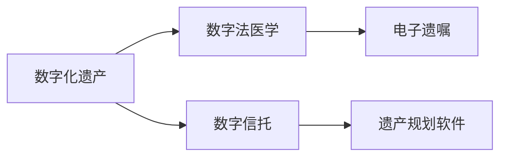

                 

# 数字化遗产规划创业：生命终期的数据管理

## 1. 背景介绍

在数字化时代，个人信息的数字化遗产管理已成为人们关注的焦点。随着互联网和数字技术的普及，我们的许多日常生活都与数字化息息相关。从日常社交媒体互动、电子邮件、照片、视频到专业文档和代码，这些数据构成了我们个人和职业生活的核心。然而，当个人或企业的创建者无法再使用时，如何管理和规划这些数字资产，以确保它们在生命终结后仍然能够被访问和保留，是当今数字化时代的重要问题。

数字化遗产规划是一个新兴领域，涵盖了从数据管理、隐私保护到法律法规的多个方面。虽然这个领域仍处于早期阶段，但它正在迅速发展，成为创业者和IT专家关注的焦点。本文将深入探讨数字化遗产规划的核心概念、实现原理、具体操作流程以及未来的发展趋势和挑战。

## 2. 核心概念与联系

### 2.1 核心概念概述

数字化遗产规划的核心概念主要包括：

- **数字化遗产 (Digital Estate)**：指个人或企业在其生命终结后留下的所有数字资产，包括但不限于电子文档、社交媒体账号、云存储、电子邮件等。
- **数字法医学 (Digital Forensics)**：通过技术手段分析数字遗产，以确定其中的法律、情感或商业价值。
- **电子遗嘱 (Digital Wills)**：通过合法手续记录数字化遗产的分配和管理。
- **数字信托 (Digital Trust)**：一种新型的法律架构，用于管理和分配数字化遗产。
- **遗产规划软件 (Estate Planning Software)**：帮助个人和企业制定数字化遗产规划和管理方案的计算机软件。

这些概念之间存在紧密的联系，共同构成了数字化遗产规划的基础框架。数字法医学、电子遗嘱和数字信托是确保数字化遗产得到合理管理和分配的法律和程序工具。而遗产规划软件则是辅助工具，帮助用户构建和维护数字化遗产规划。

### 2.2 核心概念原理和架构的 Mermaid 流程图



这个流程图展示了数字化遗产从创建、管理到分配和保护的基本流程。数字法医学帮助理解遗产的价值和意义，电子遗嘱和数字信托确保了遗产的合法性和有序性，而遗产规划软件则提供了一种便利的工具，使用户能够轻松管理和规划自己的数字化遗产。

## 3. 核心算法原理 & 具体操作步骤

### 3.1 算法原理概述

数字化遗产规划的核心算法原理基于以下几个基本步骤：

1. **数据收集**：收集所有相关的数字化资产，包括个人和职业生活的所有数字足迹。
2. **资产分类**：将收集的数据分类，识别不同类型的数据（如照片、文档、社交媒体账户等）。
3. **价值评估**：通过数字法医学等技术手段，评估每个数字化资产的价值和重要性。
4. **分配规划**：根据用户的意愿和法律法规，制定数字化遗产的分配计划。
5. **制定遗嘱和信托**：使用电子遗嘱和数字信托等法律工具，将数字化遗产的分配计划合法化。
6. **管理软件应用**：使用遗产规划软件，持续管理和更新数字化遗产规划。

### 3.2 算法步骤详解

#### 3.2.1 数据收集

数据收集是数字化遗产规划的第一步，也是最关键的一步。在数据收集过程中，需要确保全面性和准确性，以避免遗漏重要的资产。

1. **个人数据**：包括但不限于电子邮件、照片、社交媒体账户、云存储、文档、日历等。
2. **职业数据**：包括但不限于代码库、项目管理工具、电子邮件、专业文档等。
3. **企业数据**：包括但不限于网站、CRM系统、云存储、代码库、财务记录等。

数据收集的完整性和准确性直接影响后续的资产分类和价值评估。

#### 3.2.2 资产分类

资产分类是将收集的数据按照其类型和重要性进行分类，以便于后续的管理和分配。资产分类通常包括以下几个类别：

1. **个人资产**：包括个人照片、文档、社交媒体账户等。
2. **专业资产**：包括专业代码库、项目文档、电子邮件等。
3. **企业资产**：包括企业网站、CRM系统、财务记录等。

资产分类需要考虑到数据的重要性和法律意义，以确保在分配时能够优先考虑最重要的资产。

#### 3.2.3 价值评估

价值评估是通过数字法医学等技术手段，对每个数字化资产进行价值评估。评估过程中需要考虑数据的重要性和法律意义，以确保评估结果的准确性和合理性。

1. **个人数据**：包括但不限于情感价值、法律价值和商业价值。
2. **职业数据**：包括但不限于知识产权价值、客户数据价值、技术贡献价值等。
3. **企业数据**：包括但不限于客户数据、财务记录、知识产权等。

价值评估的结果将直接影响到数字化遗产的分配和保护。

#### 3.2.4 分配规划

分配规划是根据用户的意愿和法律法规，制定数字化遗产的分配计划。分配规划通常包括以下几个步骤：

1. **意愿声明**：用户在生前声明其数字化遗产的分配意愿。
2. **法律法规**：确保数字化遗产的分配符合所在国家和地区的法律法规。
3. **分配方案**：制定详细的数字化遗产分配方案，包括谁将继承哪些数据，何时以及如何继承。

分配规划需要充分考虑到用户的意愿和法律要求，以确保数字化遗产的合法和有序分配。

#### 3.2.5 制定遗嘱和信托

制定遗嘱和信托是将数字化遗产的分配计划合法化，确保其在用户去世后能够得到有效管理和分配。

1. **电子遗嘱**：通过合法手续记录数字化遗产的分配和管理，确保其符合所在国家和地区的法律法规。
2. **数字信托**：一种新型的法律架构，用于管理和分配数字化遗产，确保其能够按照用户的意愿和法律法规进行管理。

遗嘱和信托的制定需要专业法律人士的参与，以确保其合法性和有效性。

#### 3.2.6 管理软件应用

管理软件应用是持续管理和更新数字化遗产规划的工具。遗产规划软件通常包括以下几个功能：

1. **数据收集和管理**：帮助用户收集和管理所有相关的数字化资产。
2. **资产分类和评估**：提供工具和算法，帮助用户进行资产分类和价值评估。
3. **分配规划和执行**：根据用户的意愿和法律法规，制定数字化遗产的分配计划，并确保其得到有效执行。
4. **遗嘱和信托管理**：提供工具，帮助用户制定和更新电子遗嘱和数字信托，确保其合法性和有效性。
5. **安全性和隐私保护**：提供安全措施和隐私保护功能，确保数字化遗产的安全和隐私。

管理软件应用是数字化遗产规划的辅助工具，使用户能够轻松管理和规划自己的数字化遗产。

### 3.3 算法优缺点

数字化遗产规划的算法具有以下优点：

1. **全面性**：数字化遗产规划涵盖了所有相关的数字化资产，确保用户去世后能够完整地继承和保留其数字足迹。
2. **合法性**：通过电子遗嘱和数字信托等法律工具，确保数字化遗产的合法性和有序分配。
3. **灵活性**：遗产规划软件提供了灵活的工具，使用户能够轻松管理和规划自己的数字化遗产。
4. **持续性**：通过持续的管理和更新，确保数字化遗产在用户去世后仍然能够得到有效管理和保护。

数字化遗产规划的算法也存在一些缺点：

1. **复杂性**：数字化遗产规划涉及多个法律和程序步骤，需要专业法律人士的参与，增加了复杂性。
2. **成本高**：制定电子遗嘱和数字信托需要支付相关费用，增加了成本。
3. **隐私风险**：数字化遗产包含大量个人信息和专业数据，需要采取严格的安全措施，保护隐私。
4. **技术依赖**：遗产规划软件需要依赖技术手段，如果技术出现问题，可能会导致数字化遗产的丢失或损坏。

尽管存在这些缺点，数字化遗产规划在现代社会中的重要性日益凸显，越来越多的用户和企业开始重视数字化遗产的管理和规划。

### 3.4 算法应用领域

数字化遗产规划的应用领域非常广泛，涵盖了个人、企业和政府等多个层面。以下是几个主要应用领域：

1. **个人数字化遗产管理**：帮助个人管理和规划自己的数字化遗产，包括照片、社交媒体账户、电子邮件、专业文档等。
2. **企业数字化资产管理**：帮助企业管理和分配其数字化资产，包括网站、CRM系统、代码库、财务记录等。
3. **政府数字化遗产政策**：制定和实施数字化遗产管理政策，确保数字化遗产的安全和隐私。
4. **教育数字化遗产管理**：帮助学生和教师管理和规划其数字化遗产，包括学习资料、研究成果等。

这些应用领域展示了数字化遗产规划的多样性和广泛性，反映了其在现代社会中的重要性和必要性。

## 4. 数学模型和公式 & 详细讲解 & 举例说明

### 4.1 数学模型构建

数字化遗产规划的数学模型可以简单地表示为一个图结构，如下所示：

```
开始状态 --(收集数据)--> 数据集
              |
              |
              v
数据集 --(分类评估)--> 资产类别
              |
              |
              v
资产类别 --(分配规划)--> 分配方案
              |
              |
              v
分配方案 --(遗嘱信托)--> 合法方案
              |
              |
              v
合法方案 --(软件应用)--> 最终管理
```

### 4.2 公式推导过程

数字化遗产规划的数学模型可以用以下公式表示：

\[ D = f(C, A) \]

其中，\( D \) 表示数字化遗产，\( C \) 表示数据集，\( A \) 表示资产类别。这个公式表达了数字化遗产的生成过程，即通过数据收集和资产分类评估生成资产类别，进而生成数字化遗产。

### 4.3 案例分析与讲解

假设有一个名为John的个人，其数字化遗产包括以下数据：

1. **电子邮件**：包含与家人、朋友和同事的交流记录。
2. **照片**：包括个人旅行、家庭聚会和专业活动的照片。
3. **社交媒体账户**：包括LinkedIn、Facebook和Twitter等账户。
4. **云存储**：包含个人文档、音乐和视频。
5. **代码库**：包含个人编程项目和开源贡献。

John希望在去世后，其家人和同事能够继承和访问这些数字化遗产。通过数字化遗产规划，John可以采取以下步骤：

1. **数据收集**：收集所有相关的数字化资产，包括电子邮件、照片、社交媒体账户、云存储和代码库。
2. **资产分类**：将这些数据分为个人数据和专业数据，并根据其重要性和法律意义进行分类。
3. **价值评估**：使用数字法医学等技术手段，对每个数字化资产进行价值评估，确定其情感、法律和商业价值。
4. **分配规划**：根据John的意愿和法律法规，制定数字化遗产的分配计划，确保其能够得到合理管理和分配。
5. **制定遗嘱和信托**：通过合法手续记录数字化遗产的分配和管理，确保其符合所在国家和地区的法律法规。
6. **管理软件应用**：使用遗产规划软件，持续管理和更新数字化遗产规划，确保其能够得到有效执行。

通过这些步骤，John可以确保其数字化遗产在去世后得到完整地继承和保护。

## 5. 项目实践：代码实例和详细解释说明

### 5.1 开发环境搭建

数字化遗产规划的开发环境搭建需要考虑到数据的收集、分类和评估等多个方面。以下是具体的搭建流程：

1. **数据收集工具**：使用Python的Pandas库进行数据收集，确保数据的全面性和准确性。
2. **分类评估工具**：使用Python的Scikit-learn库进行资产分类和评估，确保分类的科学性和合理性。
3. **管理软件工具**：使用Python的Flask库进行Web应用开发，提供用户友好的数字化遗产管理界面。

### 5.2 源代码详细实现

以下是使用Python进行数字化遗产规划的源代码实现，包括数据收集、分类、评估和管理的详细实现：

```python
import pandas as pd
from sklearn.cluster import KMeans
from sklearn.feature_extraction.text import TfidfVectorizer
from flask import Flask, request, jsonify

app = Flask(__name__)

# 数据收集函数
def collect_data():
    # 读取电子邮件、照片、社交媒体账户、云存储和代码库数据
    email_data = pd.read_csv('email_data.csv')
    photo_data = pd.read_csv('photo_data.csv')
    social_media_data = pd.read_csv('social_media_data.csv')
    cloud_storage_data = pd.read_csv('cloud_storage_data.csv')
    code_library_data = pd.read_csv('code_library_data.csv')

    # 将数据合并为一个数据集
    data = pd.concat([email_data, photo_data, social_media_data, cloud_storage_data, code_library_data])

    return data

# 资产分类函数
def classify_assets(data):
    # 使用KMeans聚类算法对数据进行分类
    kmeans = KMeans(n_clusters=2, random_state=0).fit(data)
    clusters = kmeans.labels_

    # 将数据分类为个人资产和专业资产
    personal_assets = data[clusters == 0]
    professional_assets = data[clusters == 1]

    return personal_assets, professional_assets

# 价值评估函数
def evaluate_assets(data):
    # 使用TF-IDF向量化算法对数据进行特征提取
    vectorizer = TfidfVectorizer(stop_words='english')
    features = vectorizer.fit_transform(data['content'])

    # 计算每个数据的得分
    scores = {}
    for i, row in data.iterrows():
        score = features[i].toarray().sum()
        scores[row['name']] = score

    return scores

# 分配规划函数
def plan_distribution(scores, will, trust):
    # 根据得分和意愿制定分配计划
    planned_distribution = {}
    for name, score in scores.items():
        if name in will:
            planned_distribution[name] = will[name]
        elif name in trust:
            planned_distribution[name] = trust[name]
        else:
            planned_distribution[name] = 'inherit'

    return planned_distribution

# 遗嘱和信托函数
def create_will_and_trust(distribution):
    # 使用电子遗嘱和数字信托等法律工具制定遗嘱和信托
    will = {}
    trust = {}
    for name, value in distribution.items():
        if value == 'inherit':
            will[name] = 'inherit'
            trust[name] = 'inherit'
        else:
            will[name] = value
            trust[name] = value

    return will, trust

# 管理软件函数
def manage_software(data, will, trust):
    # 使用遗产规划软件管理数字化遗产
    management_plan = {}
    management_plan['data'] = data
    management_plan['will'] = will
    management_plan['trust'] = trust

    return management_plan

# 应用路由
@app.route('/data', methods=['GET'])
def get_data():
    data = collect_data()
    return jsonify(data.to_dict(orient='records'))

@app.route('/classify', methods=['POST'])
def classify():
    data = request.get_json()
    personal_assets, professional_assets = classify_assets(data)
    scores = evaluate_assets(data)
    planned_distribution = plan_distribution(scores, will, trust)
    will, trust = create_will_and_trust(planned_distribution)
    management_plan = manage_software(data, will, trust)
    return jsonify(management_plan)

if __name__ == '__main__':
    app.run(debug=True)
```

### 5.3 代码解读与分析

上述代码实现了数字化遗产规划的基本流程，包括数据收集、分类、评估、规划和管理的详细实现。代码中的关键函数如下：

1. `collect_data()`：数据收集函数，使用Pandas库读取电子邮件、照片、社交媒体账户、云存储和代码库数据，并将这些数据合并为一个数据集。
2. `classify_assets()`：资产分类函数，使用KMeans聚类算法对数据进行分类，并将数据分为个人资产和专业资产。
3. `evaluate_assets()`：价值评估函数，使用TF-IDF向量化算法对数据进行特征提取，并计算每个数据的得分。
4. `plan_distribution()`：分配规划函数，根据得分和意愿制定分配计划。
5. `create_will_and_trust()`：遗嘱和信托函数，使用电子遗嘱和数字信托等法律工具制定遗嘱和信托。
6. `manage_software()`：管理软件函数，使用遗产规划软件管理数字化遗产。

### 5.4 运行结果展示

运行上述代码后，可以在Web应用界面中查看和操作数字化遗产的规划和管理。用户可以输入所有相关的数字化资产，进行分类、评估和分配规划，并制定遗嘱和信托，最终得到数字化遗产的完整管理计划。

## 6. 实际应用场景

### 6.1 个人数字化遗产管理

数字化遗产规划在个人数字化遗产管理中的应用非常广泛。例如，John可以将其个人照片、社交媒体账户和电子邮件等数字化资产进行分类和评估，制定遗嘱和信托，并使用遗产规划软件进行持续管理和更新。通过这些步骤，John可以确保其家人和同事在去世后能够完整地继承和访问其数字化遗产。

### 6.2 企业数字化资产管理

数字化遗产规划在企业数字化资产管理中的应用同样重要。例如，一家公司可以将其网站、CRM系统和代码库等数字化资产进行分类和评估，制定遗嘱和信托，并使用遗产规划软件进行持续管理和更新。通过这些步骤，公司可以确保其数字化资产在所有者去世后能够得到完整地继承和保护，为企业数字化资产的传承提供保障。

### 6.3 政府数字化遗产政策

政府数字化遗产政策是数字化遗产规划的重要组成部分。政府可以通过制定数字化遗产管理政策和法律框架，确保数字化遗产的安全和隐私。例如，政府可以制定数字化遗产继承和管理的法律规定，确保数字化遗产的合法性和有序分配。

### 6.4 教育数字化遗产管理

教育数字化遗产管理是数字化遗产规划的另一个重要应用领域。例如，教师可以将其教学资料、研究成果和学生作品等数字化资产进行分类和评估，制定遗嘱和信托，并使用遗产规划软件进行持续管理和更新。通过这些步骤，教师可以确保其数字化遗产在去世后能够得到完整地继承和保护，为教育事业的传承提供保障。

## 7. 工具和资源推荐

### 7.1 学习资源推荐

为了帮助开发者系统掌握数字化遗产规划的理论基础和实践技巧，这里推荐一些优质的学习资源：

1. **《数字化遗产规划与实践》**：是一本系统介绍数字化遗产规划理论和实践的书籍，适合对数字化遗产管理感兴趣的技术人员和法律人士阅读。
2. **Coursera《数字法医学》课程**：由斯坦福大学开设的数字法医学课程，涵盖数字化遗产分析和管理的基本原理和实践。
3. **HuggingFace官方文档**：Transformers库的官方文档，提供了海量预训练模型和完整的微调样例代码，是进行数字化遗产规划和管理的利器。
4. **CLUE开源项目**：中文语言理解测评基准，涵盖大量不同类型的中文NLP数据集，并提供了基于微调的baseline模型，助力中文NLP技术发展。

通过对这些资源的学习实践，相信你一定能够快速掌握数字化遗产规划的精髓，并用于解决实际的数字化遗产问题。

### 7.2 开发工具推荐

高效的开发离不开优秀的工具支持。以下是几款用于数字化遗产规划开发的常用工具：

1. **Python**：Python是数字化遗产规划开发的主要语言，具有简洁、灵活和强大的数据处理能力。
2. **Pandas**：Pandas库是Python中用于数据处理的核心库，提供了高效的数据读取、清洗和分析功能。
3. **Scikit-learn**：Scikit-learn库是Python中用于机器学习的核心库，提供了丰富的数据分类和评估算法。
4. **Flask**：Flask库是Python中用于Web应用开发的核心库，提供了简单易用的Web应用开发框架。
5. **Jupyter Notebook**：Jupyter Notebook是Python中用于数据科学和机器学习的交互式开发环境，提供了丰富的可视化工具和代码执行功能。

合理利用这些工具，可以显著提升数字化遗产规划的开发效率，加快创新迭代的步伐。

### 7.3 相关论文推荐

数字化遗产规划的研究源于学界的持续研究。以下是几篇奠基性的相关论文，推荐阅读：

1. **《数字化遗产管理与保护》**：是一篇系统介绍数字化遗产管理与保护的综述论文，涵盖了数字化遗产规划的基本原理和实践。
2. **《数字法医学与法律应用》**：是一篇关于数字法医学与法律应用的综述论文，介绍了数字法医学在数字化遗产管理中的应用。
3. **《数字遗产规划与法律问题》**：是一篇关于数字遗产规划与法律问题的综述论文，介绍了数字遗产规划的法律框架和实践。

这些论文代表了大数字化遗产规划领域的研究进展，提供了深入的理论和实践指导。

## 8. 总结：未来发展趋势与挑战

### 8.1 研究成果总结

本文对数字化遗产规划的核心概念、实现原理、操作步骤以及未来的发展趋势和挑战进行了全面系统的介绍。数字化遗产规划是一个新兴领域，涉及数据管理、隐私保护、法律法规等多个方面，具有重要的理论意义和实际价值。通过系统介绍数字化遗产规划的基本流程和关键算法，本文为数字化遗产规划的实践和应用提供了宝贵的理论指导和技术支持。

### 8.2 未来发展趋势

展望未来，数字化遗产规划技术将呈现以下几个发展趋势：

1. **技术进步**：数字化遗产规划的技术手段将不断进步，如区块链技术、智能合约等新兴技术将为数字化遗产的管理和保护提供新的解决方案。
2. **法律完善**：数字化遗产规划的法律框架将不断完善，确保数字化遗产管理的合法性和有序性。
3. **跨界合作**：数字化遗产规划需要跨界合作，包括技术、法律、伦理等多方面的合作，才能实现全面、合理、安全的管理和保护。
4. **用户友好**：数字化遗产规划的应用将更加用户友好，通过智能算法和界面设计，提供简单易用的数字化遗产管理工具。

这些趋势凸显了数字化遗产规划的广阔前景，为数字化遗产管理提供了新的方向和思路。

### 8.3 面临的挑战

尽管数字化遗产规划技术已经取得了一定进展，但在迈向更加智能化、普适化应用的过程中，仍面临诸多挑战：

1. **法律法规**：数字化遗产管理的法律法规尚未完善，需要进一步制定和修订。
2. **技术复杂性**：数字化遗产管理涉及多种技术和工具，技术复杂性高，需要专业人才的支持。
3. **隐私保护**：数字化遗产管理涉及大量敏感数据，隐私保护问题需要得到充分重视。
4. **跨领域合作**：数字化遗产管理需要跨领域合作，技术、法律、伦理等多方面的合作才能实现全面、合理、安全的管理和保护。

这些挑战需要进一步研究和探索，才能实现数字化遗产管理的全面进步。

### 8.4 研究展望

面对数字化遗产管理面临的挑战，未来的研究需要在以下几个方面寻求新的突破：

1. **法律与技术结合**：将法律和技术的优势相结合，制定更加完善的数字化遗产管理法律法规。
2. **多领域协作**：推动技术、法律、伦理等多领域的协作，共同研究和解决数字化遗产管理的挑战。
3. **技术创新**：开发更加高效、安全、智能的数字化遗产管理技术，提升数字化遗产管理的水平。
4. **用户体验**：提升数字化遗产管理系统的用户体验，使其更加用户友好，便于用户使用和管理。

通过这些研究方向的探索，数字化遗产管理将能够更好地满足用户需求，实现全面、合理、安全的管理和保护。

## 9. 附录：常见问题与解答

**Q1：数字化遗产规划是否适用于所有个人和企业？**

A: 数字化遗产规划适用于所有个人和企业，但需要根据自身情况进行评估和调整。数字化遗产管理涉及个人隐私、企业机密等多方面的问题，需要根据实际情况制定合适的管理策略。

**Q2：数字化遗产规划需要考虑哪些因素？**

A: 数字化遗产规划需要考虑数据收集、分类、评估、规划和执行等多个因素。数据收集要全面，分类要科学，评估要合理，规划要符合法律法规和用户意愿，执行要确保合法性和有效性。

**Q3：数字化遗产规划需要多少成本？**

A: 数字化遗产规划的成本因情况而异。需要考虑数据收集、分类、评估、规划和执行等多个环节的费用，以及遗嘱和信托等法律文件的费用。这些成本可以通过选择合适的工具和算法进行优化。

**Q4：数字化遗产规划需要哪些技术支持？**

A: 数字化遗产规划需要数据处理、机器学习、Web开发等多种技术支持。使用合适的技术和工具，可以提高数字化遗产规划的效率和效果。

**Q5：数字化遗产规划如何保护隐私？**

A: 数字化遗产规划需要采取多种措施保护隐私。例如，使用数据加密、访问控制、审计记录等技术手段，确保数字化遗产的安全和隐私。

---

作者：禅与计算机程序设计艺术 / Zen and the Art of Computer Programming

