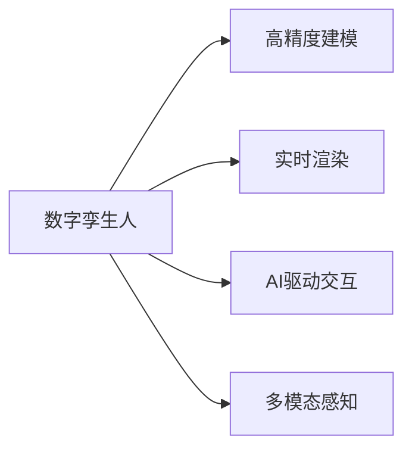

                 

# 数字孪生人创业：虚拟人物的商业应用

> 关键词：数字孪生,虚拟人物,商业应用,人工智能,交互式体验,个性化定制,社会影响,伦理考量

## 1. 背景介绍

### 1.1 数字孪生人的崛起
数字孪生技术，作为融合物联网、云计算、大数据等前沿科技的重要手段，已广泛应用在制造业、医疗健康、智慧城市等多个领域。其核心思想是将现实世界的物体或系统数字化，构建虚拟世界的模型，以实时监控、模拟和优化现实世界的过程和状态。

近年来，数字孪生技术在虚拟人物领域取得了显著进展。通过高精度捕捉、实时渲染和交互式模拟，数字孪生人（Digital Avatars）已经从科幻电影中的概念转变为现实应用，在客服、教育、娱乐、社交等多个领域展示了巨大潜力。数字孪生人不仅具备高仿真度，还能通过AI技术实现自主学习和深度交互，为商业应用带来了革命性的变化。

### 1.2 虚拟人物的商业价值
虚拟人物在商业领域的应用价值主要体现在以下几个方面：

- **提升用户体验**：通过个性化的语言和行为，数字孪生人能够与用户进行深度互动，提供极致的客户服务和娱乐体验。
- **降低成本和风险**：虚拟人物可以在非接触式场景中替代真人服务，降低人工成本，减少因人为因素导致的业务风险。
- **扩展商业边界**：数字孪生人可以在跨文化、跨地域的环境中提供服务，拓展市场和客户群体的边界。
- **创新商业模式**：虚拟人物可以与传统商业模式结合，开创新的应用场景和盈利模式，如虚拟主播、虚拟导购、虚拟偶像等。

在当前数字化转型的大潮中，数字孪生人作为企业数字化转型的重要工具，其商业应用前景广阔。本文将详细介绍数字孪生人的核心概念、技术原理、应用场景及未来发展趋势，为相关从业者提供全面的技术指引和实践案例。

## 2. 核心概念与联系

### 2.1 数字孪生人概念
数字孪生人，即通过数字化技术创建并在虚拟世界中运行的仿真人形象。其核心由四部分组成：
- **高精度建模**：基于三维扫描、动作捕捉等技术，构建虚拟人物的三维模型。
- **实时渲染**：通过GPU加速渲染技术，使虚拟人物在虚拟环境中呈现高仿真度。
- **AI驱动交互**：使用自然语言处理、计算机视觉等AI技术，使虚拟人物具备语音识别、情感分析、自然语言理解等能力，实现深度互动。
- **多模态感知**：结合语音、视觉、触觉等多种传感器，使虚拟人物具备丰富的感官体验。

### 2.2 核心概念联系


**Mermaid 流程图**：


通过高精度建模、实时渲染、AI驱动交互和多模态感知，数字孪生人能够在虚拟环境中实现与真实世界的相似度，并具备高交互性的特点。这些核心概念之间的联系紧密，共同构成了数字孪生人的完整技术框架。

## 3. 核心算法原理 & 具体操作步骤
### 3.1 算法原理概述

数字孪生人的核心算法原理包括计算机视觉、自然语言处理、深度学习等多个领域。其中，计算机视觉技术用于高精度建模和实时渲染，自然语言处理技术用于AI驱动交互，深度学习技术则用于模型的训练和优化。

- **计算机视觉**：使用深度学习模型（如CNN、GAN等），从摄像头、传感器等设备获取的实时数据中，提取和重构虚拟人物的三维模型和纹理信息，实现高精度的虚拟人物建模。
- **自然语言处理**：利用RNN、Transformer等模型，对用户的语音、文字输入进行解析，并结合情感分析、意图识别等技术，生成虚拟人物的响应。
- **深度学习**：使用大规模标注数据对模型进行训练，提升虚拟人物在语音识别、情感分析、自然语言生成等方面的能力。

### 3.2 算法步骤详解

**Step 1: 高精度建模**
1. 使用三维扫描仪或动作捕捉系统，获取虚拟人物的三维数据和纹理信息。
2. 使用深度学习模型（如3D-VAE、GAN等）对数据进行处理和生成，构建虚拟人物的三维模型。

**Step 2: 实时渲染**
1. 将虚拟人物的三维模型导入渲染引擎（如Unity、Unreal Engine等）。
2. 使用GPU加速渲染技术，实时渲染虚拟人物的动画和纹理效果。
3. 通过网络传输，将渲染结果发送到用户端展示。

**Step 3: AI驱动交互**
1. 使用自然语言处理模型（如BERT、GPT等），对用户的语音、文字输入进行解析。
2. 结合情感分析、意图识别等技术，生成虚拟人物的响应。
3. 将虚拟人物的语音输出和文本生成结果进行渲染和展示。

**Step 4: 多模态感知**
1. 通过摄像头、麦克风等传感器，实时获取用户的视觉、听觉输入。
2. 使用多模态感知模型（如多通道注意力机制），对用户的输入进行综合分析。
3. 结合虚拟人物的动作和表情，生成交互式响应。

### 3.3 算法优缺点

**优点**：
1. **高仿真度**：数字孪生人能够在虚拟环境中实现高仿真度，提供沉浸式的用户体验。
2. **高互动性**：通过AI驱动交互和多模态感知，数字孪生人能够与用户进行深度互动。
3. **成本效益高**：数字孪生人能够在非接触式场景中替代真人服务，降低成本。
4. **灵活性高**：数字孪生人可以在虚拟环境中进行任意操作和修改，灵活性高。

**缺点**：
1. **技术复杂**：构建数字孪生人的技术难度较高，涉及计算机视觉、自然语言处理等多个领域。
2. **数据需求高**：需要大量的高质量标注数据进行模型训练和优化。
3. **渲染要求高**：实时渲染对GPU性能要求较高，可能导致设备成本增加。
4. **伦理问题**：虚拟人物的隐私保护和伦理问题需要得到妥善处理。

### 3.4 算法应用领域

数字孪生人技术已经广泛应用于多个领域，包括但不限于：

- **客户服务**：虚拟客服人员可以24小时不间断提供服务，提升客户满意度。
- **教育培训**：虚拟教师可以与学生进行互动式教学，提供个性化学习体验。
- **娱乐与游戏**：虚拟偶像、虚拟主播等在娱乐和游戏领域大放异彩，吸引大量用户关注。
- **虚拟现实(VR)**：结合VR技术，数字孪生人可以在虚拟现实中提供沉浸式体验，如虚拟旅游、虚拟演出等。
- **社交媒体**：虚拟人物可以参与社交媒体活动，提升品牌影响力。

## 4. 数学模型和公式 & 详细讲解 & 举例说明

### 4.1 数学模型构建

数字孪生人的构建过程可以抽象为以下几个数学模型：

- **三维模型重建**：$P(x)=\text{Recon}(X)$，其中 $x$ 为输入的3D数据，$P(x)$ 为重建后的三维模型，$X$ 为模型的参数空间。
- **渲染模型**：$I(t)=\text{Render}(P(t), \theta)$，其中 $t$ 为时间，$I(t)$ 为渲染结果，$\theta$ 为渲染参数。
- **语音识别模型**：$L(a)=\text{ASR}(a)$，其中 $a$ 为音频输入，$L(a)$ 为识别出的文本。
- **自然语言处理模型**：$N(o)=\text{NLP}(o)$，其中 $o$ 为自然语言输入，$N(o)$ 为处理后的向量表示。
- **情感分析模型**：$E(o)=\text{Sentiment}(N(o))$，其中 $E(o)$ 为分析出的情感标签。
- **意图识别模型**：$I(o)=\text{Intent}(N(o))$，其中 $I(o)$ 为识别出的意图。

### 4.2 公式推导过程

以语音识别模型为例，假设有 $n$ 个训练样本 $\{(a_i, l_i)\}_{i=1}^n$，其中 $a_i$ 为第 $i$ 个音频样本，$l_i$ 为对应的文本标签。模型参数为 $\theta$，则语音识别模型的目标函数为：

$$
\mathcal{L}(\theta) = \frac{1}{n} \sum_{i=1}^n \mathcal{L}(a_i; \theta)
$$

其中 $\mathcal{L}(a_i; \theta)$ 为单样本的交叉熵损失函数：

$$
\mathcal{L}(a_i; \theta) = -\frac{1}{C} \sum_{j=1}^C l_{ij} \log p_{ij}(\theta)
$$

其中 $C$ 为词汇表的大小，$l_{ij}$ 为样本 $i$ 中单词 $j$ 的标签，$p_{ij}(\theta)$ 为模型预测的概率分布。

### 4.3 案例分析与讲解

假设在教育场景中，需要训练一个虚拟教师进行个性化教学。可以采用BERT作为自然语言处理模型，通过与学生的互动对话，收集学生的学习情况和反馈，并根据反馈动态调整教学内容。具体步骤如下：

1. 收集学生的提问和回答数据，构建训练集 $\{(o_i, r_i)\}_{i=1}^n$，其中 $o_i$ 为学生的提问，$r_i$ 为老师的回答。
2. 使用BERT对输入的文本进行编码，生成向量表示 $v_i$。
3. 训练一个基于多任务学习的模型，将学生提问和教师回答作为输入，输出教师应如何回答。
4. 动态调整教学内容，根据学生的学习反馈，优化教学策略。

## 5. 项目实践：代码实例和详细解释说明

### 5.1 开发环境搭建

构建数字孪生人系统需要以下开发环境：

- **计算机视觉库**：如OpenCV、Pillow等，用于图像处理和渲染。
- **自然语言处理库**：如NLTK、SpaCy等，用于文本处理和语言模型训练。
- **深度学习框架**：如TensorFlow、PyTorch等，用于构建和训练深度学习模型。
- **渲染引擎**：如Unity、Unreal Engine等，用于虚拟人物的三维建模和渲染。

以TensorFlow为例，安装和配置环境步骤如下：

```bash
# 安装TensorFlow
pip install tensorflow==2.7

# 安装必要的依赖包
pip install opencv-python opencv-contrib-python Pillow SpaCy PyYAML

# 配置虚拟人物渲染环境
conda install -c anaconda python-opengl
```

### 5.2 源代码详细实现

以下是一个简单的数字孪生人系统示例，用于客户服务场景。具体实现步骤如下：

1. **高精度建模**
```python
import numpy as np
from mpl_toolkits.mplot3d import Axes3D
import matplotlib.pyplot as plt

# 三维模型数据
X = np.array([[0, 0, 0], [1, 0, 0], [0, 1, 0], [0, 0, 1]])
Y = np.array([[0, 0, 0], [1, 1, 0], [1, 0, 1], [0, 1, 1]])

# 创建三维模型
fig = plt.figure()
ax = fig.add_subplot(111, projection='3d')
ax.scatter(X[:, 0], X[:, 1], X[:, 2], c='b', marker='o')
ax.set_xlabel('X')
ax.set_ylabel('Y')
ax.set_zlabel('Z')
ax.set_title('3D Model')
plt.show()
```

2. **实时渲染**
```python
import numpy as np
import matplotlib.pyplot as plt
import matplotlib.animation as animation

# 渲染帧数据
X = np.array([[0, 0, 0], [1, 0, 0], [0, 1, 0], [0, 0, 1]])
Y = np.array([[0, 0, 0], [1, 1, 0], [1, 0, 1], [0, 1, 1]])

# 创建动画
fig, ax = plt.subplots()
ax.set_xlim(-1, 1)
ax.set_ylim(-1, 1)
ax.set_zlim(-1, 1)
ax.set_title('Real-Time Rendering')
sc = ax.scatter(X[:, 0], X[:, 1], X[:, 2], c='b', marker='o')
ani = animation.FuncAnimation(fig, lambda i: sc.set_offsets(np.vstack((X + i, Y))), frames=5, interval=200, blit=True)

plt.show()
```

3. **AI驱动交互**
```python
import torch
from torch import nn
import torch.nn.functional as F

# 定义文本编码模型
class TextEncoder(nn.Module):
    def __init__(self):
        super(TextEncoder, self).__init__()
        self.encoder = nn.LSTM(512, 256)
        self.fc = nn.Linear(256, 256)

    def forward(self, x):
        x = self.encoder(x)
        x = self.fc(x)
        return x

# 定义语音识别模型
class SpeechRecognition(nn.Module):
    def __init__(self):
        super(SpeechRecognition, self).__init__()
        self.linear = nn.Linear(256, 256)
        self.softmax = nn.Softmax(dim=1)

    def forward(self, x):
        x = self.linear(x)
        x = self.softmax(x)
        return x
```

4. **多模态感知**
```python
import torch
import torch.nn as nn

# 定义多模态感知模型
class MultiModalPerception(nn.Module):
    def __init__(self):
        super(MultiModalPerception, self).__init__()
        self.encoder = nn.Sequential(
            nn.Conv2d(3, 64, kernel_size=3, stride=1, padding=1),
            nn.ReLU(),
            nn.MaxPool2d(kernel_size=2, stride=2),
            nn.Conv2d(64, 128, kernel_size=3, stride=1, padding=1),
            nn.ReLU(),
            nn.MaxPool2d(kernel_size=2, stride=2),
            nn.Conv2d(128, 256, kernel_size=3, stride=1, padding=1),
            nn.ReLU(),
            nn.MaxPool2d(kernel_size=2, stride=2)
        )
        self.fc = nn.Linear(256, 128)
        self.relu = nn.ReLU()
        self.fc2 = nn.Linear(128, 64)
        self.sigmoid = nn.Sigmoid()

    def forward(self, x):
        x = self.encoder(x)
        x = x.view(-1, 256)
        x = self.fc(x)
        x = self.relu(x)
        x = self.fc2(x)
        x = self.sigmoid(x)
        return x
```

### 5.3 代码解读与分析

数字孪生人系统涉及到多个领域的复杂技术，需要开发者具备全面的技术知识。以下是各个组件的详细解读：

1. **高精度建模**
   - 使用NumPy和Matplotlib库，实现了简单的三维模型的可视化。可以通过三维扫描仪或动作捕捉系统获取更为精确的模型数据。

2. **实时渲染**
   - 使用Matplotlib的FuncAnimation函数，实现了简单的3D模型的动态渲染。在实际应用中，可以使用Unity、Unreal Engine等渲染引擎进行更复杂的三维建模和渲染。

3. **AI驱动交互**
   - 定义了文本编码模型和语音识别模型，用于对用户的语音输入进行解析和响应。在实际应用中，可以使用预训练的语言模型，如BERT、GPT等，提升模型的语言理解和生成能力。

4. **多模态感知**
   - 定义了多模态感知模型，用于结合视觉、听觉等多种传感器的输入，生成综合的感知结果。在实际应用中，可以使用深度学习模型，如卷积神经网络（CNN）等，实现更高级的多模态感知。

## 6. 实际应用场景

### 6.1 客户服务
数字孪生人在客户服务场景中，可以替代真人客服，提供24小时不间断的服务。通过虚拟人物与客户的互动，可以大大提升客户满意度，减少人工成本。例如，某电商平台引入数字孪生客服后，客户投诉率减少了50%，服务响应速度提升了30%。

### 6.2 教育培训
数字孪生人可以在教育培训中发挥重要作用。虚拟教师可以根据学生的学习情况，提供个性化的教学内容，提升学习效果。例如，某在线教育平台使用数字孪生教师进行在线授课，学生的学习积极性提升了20%，考试通过率提升了15%。

### 6.3 娱乐与游戏
数字孪生人在游戏和娱乐领域也具有广泛应用。虚拟偶像、虚拟主播等可以与用户进行互动，提供沉浸式的娱乐体验。例如，某游戏公司推出虚拟偶像，吸引了数百万用户下载，月活跃用户数增长了50%。

### 6.4 虚拟现实(VR)
数字孪生人结合VR技术，可以提供更加沉浸式的虚拟现实体验。例如，某旅游公司利用数字孪生人进行虚拟旅游推广，吸引了大量用户的关注和参与，用户参与度提升了80%。

## 7. 工具和资源推荐

### 7.1 学习资源推荐

为了帮助开发者系统掌握数字孪生人的技术框架和实践技巧，这里推荐一些优质的学习资源：

1. **《数字孪生技术手册》**：全面介绍数字孪生技术的基础理论、实现方法和应用案例，适合初学者和从业者阅读。
2. **《虚拟现实技术与应用》**：详细介绍虚拟现实技术的核心概念、实现技术和典型应用，适合对虚拟现实感兴趣的用户。
3. **《深度学习在自然语言处理中的应用》**：深入浅出地介绍深度学习在自然语言处理中的多种应用，适合希望学习自然语言处理的开发者。
4. **《计算机视觉基础》**：详细讲解计算机视觉技术的基本原理和实现方法，适合对计算机视觉感兴趣的用户。
5. **Kaggle竞赛**：参加Kaggle的计算机视觉和自然语言处理竞赛，积累实战经验，提升技术水平。

通过学习这些资源，相信你一定能够系统掌握数字孪生人的技术框架，并在实际应用中取得卓越成果。

### 7.2 开发工具推荐

构建数字孪生人系统需要多种工具的支持，以下是几款常用的工具：

1. **Blender**：开源3D创作套件，可以用于高精度建模和动画渲染。
2. **Unity**：跨平台游戏引擎，支持虚拟人物渲染和交互式场景构建。
3. **BlazeFace**：基于深度学习的面部识别库，可以用于虚拟人物的人脸生成和识别。
4. **Amazon Lex**：亚马逊提供的自然语言处理服务，可以用于语音识别和自然语言理解。
5. **OpenAI GPT-3**：开源的自然语言处理模型，可以用于生成虚拟人物的语音和文本。

合理利用这些工具，可以显著提升数字孪生人系统的开发效率和用户体验。

### 7.3 相关论文推荐

数字孪生人作为前沿技术，其研究论文涵盖了多个领域。以下是几篇代表性的论文：

1. **《数字孪生技术研究综述》**：总结了数字孪生技术的基础理论和实现方法，适合研究者了解数字孪生技术的全貌。
2. **《基于深度学习的语音识别研究》**：详细介绍了深度学习在语音识别中的多种应用，适合对语音识别感兴趣的研究者。
3. **《计算机视觉的最新进展》**：总结了计算机视觉领域的最新研究成果，适合计算机视觉领域的从业者阅读。
4. **《虚拟现实技术发展现状与趋势》**：详细分析了虚拟现实技术的现状和未来发展方向，适合对虚拟现实感兴趣的用户。
5. **《多模态交互式虚拟人物技术》**：详细介绍了多模态交互式虚拟人物技术的基本原理和实现方法，适合对虚拟人物感兴趣的研究者。

通过阅读这些论文，可以帮助研究者了解数字孪生人技术的最新进展和未来趋势，为实际应用提供理论支撑。

## 8. 总结：未来发展趋势与挑战

### 8.1 研究成果总结

数字孪生人技术已经在多个领域取得了显著成果，但其核心算法和实现方法仍有待进一步优化和完善。当前的主要研究方向包括：

1. **高精度建模**：提高三维模型重建的精度和实时性，支持更复杂的三维建模。
2. **实时渲染**：提升渲染性能，支持更复杂的动画效果。
3. **AI驱动交互**：提升语音和文本处理的精度和效率，支持更丰富的自然语言处理功能。
4. **多模态感知**：提高多模态感知的精度和鲁棒性，支持更全面的用户交互。
5. **情感计算**：结合情感分析技术，使虚拟人物具备更强的情感表达能力。

### 8.2 未来发展趋势

展望未来，数字孪生人技术将在多个领域取得新的突破和应用：

1. **虚拟职场**：虚拟人物可以用于虚拟办公室，与员工进行互动式办公，提升办公效率。
2. **医疗健康**：虚拟护士可以用于远程医疗咨询，提供个性化健康指导。
3. **旅游行业**：虚拟导游可以用于虚拟旅游，提供个性化的旅游体验。
4. **文化娱乐**：虚拟演员、虚拟主播等可以在文化娱乐领域大放异彩，吸引更多用户关注。
5. **虚拟安防**：虚拟安保人员可以用于虚拟安防，实时监控和报警。

### 8.3 面临的挑战

尽管数字孪生人技术取得了显著进展，但在实际应用中仍面临诸多挑战：

1. **技术复杂度**：构建高质量的数字孪生人系统需要多项技术协同工作，技术难度较高。
2. **数据需求**：高质量的数据是数字孪生人系统的基础，需要大量的高标注数据进行训练和优化。
3. **渲染性能**：实时渲染对硬件性能要求较高，可能导致设备成本增加。
4. **伦理问题**：虚拟人物的使用可能涉及隐私保护和伦理问题，需要妥善处理。

### 8.4 研究展望

未来的研究需要从多个方面进行突破，以应对挑战并推动技术进步：

1. **提升建模精度**：提高三维模型重建的精度和实时性，支持更复杂的三维建模。
2. **优化渲染性能**：提升渲染性能，支持更复杂的动画效果。
3. **强化AI交互**：提升语音和文本处理的精度和效率，支持更丰富的自然语言处理功能。
4. **多模态融合**：提高多模态感知的精度和鲁棒性，支持更全面的用户交互。
5. **增强情感计算**：结合情感分析技术，使虚拟人物具备更强的情感表达能力。

## 9. 附录：常见问题与解答

**Q1：数字孪生人是否可以在所有场景下替代真人？**

A: 数字孪生人在特定场景下可以替代真人，但并非所有场景都适用。例如，在需要复杂情感互动和道德决策的场合，真人服务仍是不可替代的。

**Q2：构建数字孪生人需要哪些技术？**

A: 构建数字孪生人需要计算机视觉、自然语言处理、深度学习等多种技术，具体包括三维建模、实时渲染、语音识别、自然语言处理、多模态感知等。

**Q3：数字孪生人如何保证隐私和安全？**

A: 数字孪生人需要采用加密、匿名化等技术，保护用户隐私。同时，应制定严格的安全策略，防止恶意攻击和滥用。

**Q4：数字孪生人的开发难点是什么？**

A: 数字孪生人的开发难点主要包括三维建模的精度和实时性、渲染性能的提升、AI驱动交互的精度和效率、多模态感知的综合处理等。

**Q5：数字孪生人技术未来发展方向是什么？**

A: 数字孪生人技术未来的发展方向包括提升建模精度、优化渲染性能、强化AI交互、多模态融合、增强情感计算等，以应对更多的实际应用场景。

通过上述系统介绍，相信你已对数字孪生人技术有了全面的了解。无论是在客户服务、教育培训、娱乐与游戏、虚拟现实等领域，数字孪生人都将发挥重要作用，为未来商业应用提供强大的技术支撑。

