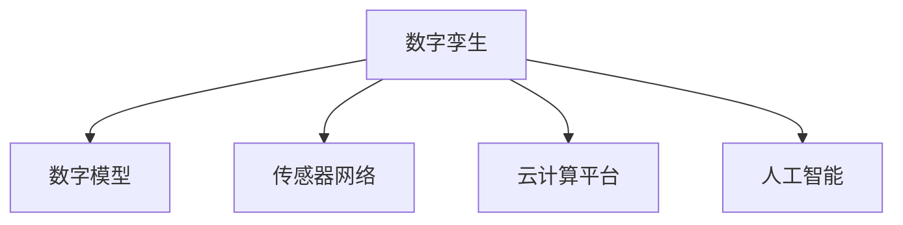
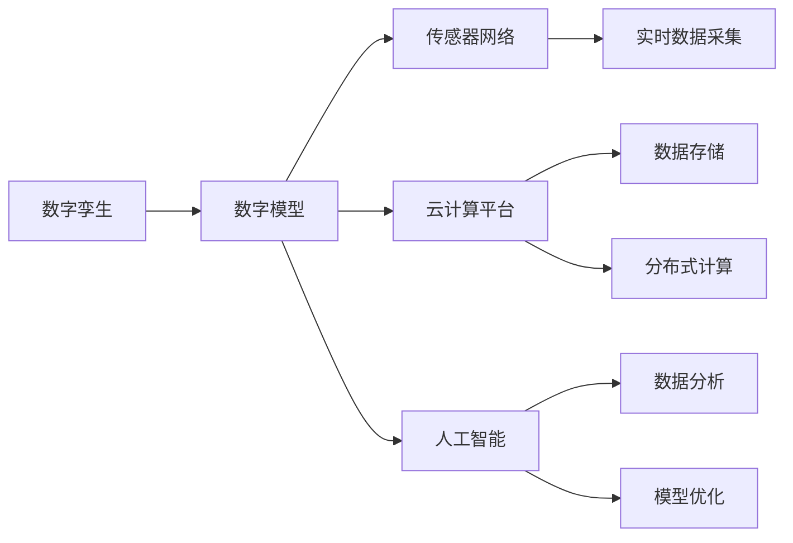

                 

# 数字孪生技术：虚拟世界与物理世界的桥梁

## 1. 背景介绍

### 1.1 问题由来
数字孪生技术（Digital Twin）是指通过虚拟模拟和数据分析，构建一个与物理实体精确对应的数字模型。这种技术的应用场景包括产品设计、制造、维护、运营等各个环节，帮助企业实现物理实体与数字模型之间的双向互动，极大提升决策效率和运营质量。

近年来，随着物联网（IoT）、云计算、人工智能等技术的快速发展和成熟，数字孪生技术逐渐成为制造业、能源、交通、城市管理等各领域的重要工具，其价值和潜力被广泛认可。数字孪生技术的引入，为数字与物理的深度融合提供了新的可能，推动了产业智能化升级和工业4.0的到来。

### 1.2 问题核心关键点
数字孪生技术的核心关键点在于如何构建、维护和管理一个完整的数字孪生模型。该模型的建立依赖于物理实体的高质量数据采集、数据的实时传输、高效存储和深度分析，以及模型与物理实体的实时交互。

具体来说，数字孪生技术包括三个主要步骤：
1. **建模（Modeling）**：根据物理实体构建虚拟模型。
2. **监控（Monitoring）**：利用传感器等技术实时收集物理实体的数据，并传输到数字孪生模型。
3. **优化（Optimization）**：基于实时数据对模型进行动态调整和优化，指导物理实体的运行和维护。

这三个步骤共同构成了一个闭环的系统，使得数字孪生模型能够实时地与物理实体进行交互和反馈，实现动态的仿真和优化。

## 2. 核心概念与联系

### 2.1 核心概念概述

为更好地理解数字孪生技术的原理和架构，本节将介绍几个密切相关的核心概念：

- **数字孪生（Digital Twin）**：构建的虚拟模型，与物理实体精确对应，支持实时监控、预测分析和优化决策。
- **数字模型（Digital Model）**：基于物理实体设计和计算得出的数学模型，用于仿真和分析。
- **传感器网络（Sensor Network）**：由多种传感器组成的网络，用于实时采集物理实体的数据，包括温度、压力、位置、速度等。
- **云计算平台（Cloud Computing Platform）**：用于存储和处理海量数据，支持大规模分布式计算，是数字孪生技术的基础设施。
- **人工智能（AI）**：结合机器学习、深度学习等技术，用于数据分析和模型优化，提升数字孪生的智能水平。

这些核心概念之间的逻辑关系可以通过以下Mermaid流程图来展示：



这个流程图展示了一些关键概念及其之间的相互关系：

1. 数字孪生模型基于数字模型构建，用于仿真和分析物理实体的运行情况。
2. 数字模型与传感器网络交互，获取物理实体的实时数据，并更新到数字孪生模型。
3. 云计算平台提供数据存储和计算资源，支持数字孪生模型的动态更新和优化。
4. 人工智能技术用于数据分析和模型优化，提升数字孪生模型的智能水平。

这些核心概念共同构成了数字孪生技术的理论基础和应用框架。

### 2.2 核心概念原理和架构的 Mermaid 流程图


这个流程图展示了数字孪生模型的数据流向和操作流程：

1. 数字孪生模型（A）通过数字模型（B）与传感器网络（C）交互，获取实时数据（F）。
2. 实时数据经过数据存储（G）和分布式计算（H），最后由人工智能（E）进行分析和优化（I、J）。
3. 优化后的数字模型再次用于指导传感器网络的采集和物理实体的运行，形成一个闭环的反馈系统。

## 3. 核心算法原理 & 具体操作步骤
### 3.1 算法原理概述

数字孪生技术的核心算法原理基于模型驱动的仿真与优化，通过虚拟模型与物理实体的双向互动，实现对物理系统的实时监控、预测分析和优化决策。

具体来说，数字孪生技术包括以下几个关键步骤：

1. **模型构建（Model Construction）**：根据物理实体的设计和运行状态，构建虚拟模型，通常包括几何模型、物理模型和行为模型。
2. **数据采集（Data Acquisition）**：通过传感器等设备，实时采集物理实体的数据，并传输到数字孪生模型中。
3. **数据处理与存储（Data Processing and Storage）**：对采集到的数据进行预处理、清洗和存储，为后续分析和优化提供支持。
4. **仿真与预测（Simulation and Prediction）**：基于数字模型和实时数据，进行仿真和预测，模拟物理实体的运行状态和趋势。
5. **优化与决策（Optimization and Decision Making）**：根据仿真和预测结果，对数字模型进行优化，并指导物理实体的运行和维护。

这些步骤共同构成了一个完整的数字孪生模型，支持实时监控、预测分析和优化决策。

### 3.2 算法步骤详解

以下是数字孪生技术的详细步骤：

**Step 1: 数据采集与处理**

数据采集是数字孪生技术的基础。通过传感器等设备，实时采集物理实体的各种数据，如温度、压力、位置、速度等，并将数据传输到云计算平台进行存储和预处理。数据处理包括去噪、滤波、归一化等步骤，确保数据的质量和一致性。

**Step 2: 模型构建与仿真**

根据物理实体的设计和运行状态，构建数字模型。数字模型通常包括几何模型、物理模型和行为模型。几何模型描述物理实体的形状和尺寸；物理模型描述物理实体的材料、属性等；行为模型描述物理实体的运行状态和规律。

利用数字模型，对物理实体进行仿真和预测，模拟其运行状态和趋势。仿真过程中，可以引入人工智能技术，如机器学习、深度学习等，提升预测的准确性和可靠性。

**Step 3: 数据融合与实时监控**

将实时采集的数据与数字模型进行融合，实时监控物理实体的运行状态和趋势。融合过程中，可以引入边缘计算技术，在数据源端进行处理，减少数据传输的延迟和负担。

**Step 4: 优化与决策**

基于实时监控的结果，对数字模型进行优化，并指导物理实体的运行和维护。优化过程包括调整参数、重构模型、重新仿真等步骤，确保物理实体的运行状态最优。

优化后的数字模型再次用于指导传感器网络的采集和物理实体的运行，形成一个闭环的反馈系统。

### 3.3 算法优缺点

数字孪生技术具有以下优点：

1. **实时监控**：数字孪生模型能够实时监控物理实体的运行状态，及时发现异常并采取措施。
2. **预测分析**：利用人工智能技术进行仿真和预测，提高决策的科学性和准确性。
3. **优化决策**：根据实时监控和预测结果，对数字模型进行优化，提升物理实体的运行效率和维护效果。

同时，数字孪生技术也存在以下缺点：

1. **数据采集成本高**：构建数字孪生模型需要大量传感器和计算资源，成本较高。
2. **数据量大**：实时采集的数据量庞大，对存储和计算资源提出较高要求。
3. **模型复杂度**：数字模型通常较为复杂，构建和维护难度较大。
4. **实时性要求高**：实时监控和优化要求数据传输和处理速度快，技术实现难度大。

尽管存在这些局限性，数字孪生技术在工业制造、智能城市、医疗健康等领域仍展现出巨大的应用前景。

### 3.4 算法应用领域

数字孪生技术已经广泛应用于多个领域，包括：

- **工业制造**：利用数字孪生技术进行产品设计、制造、维护和质量控制，提高生产效率和产品质量。
- **智能城市**：构建城市基础设施的数字孪生模型，进行交通管理、能源优化、公共安全等方面的应用。
- **医疗健康**：利用数字孪生技术进行患者监测、手术模拟、医疗资源优化等，提升医疗服务的质量和效率。
- **航空航天**：构建飞机、卫星等航空航天器的数字孪生模型，进行飞行模拟、维护和故障诊断。
- **能源管理**：构建能源系统的数字孪生模型，进行能源优化、故障预测和能源调度。

数字孪生技术在上述领域的成功应用，展示了其在提升决策效率和运营质量方面的巨大潜力。

## 4. 数学模型和公式 & 详细讲解 & 举例说明

### 4.1 数学模型构建

数字孪生技术的数学模型构建过程主要包括以下几个步骤：

1. **几何模型（Geometric Model）**：通过三维建模软件，构建物理实体的几何模型，通常采用三角网格或体元法表示。
2. **物理模型（Physical Model）**：根据物理实体的材料和属性，建立物理模型，描述材料的弹性、导热性、电阻率等物理特性。
3. **行为模型（Behavioral Model）**：利用力学、热力学、电学等理论，建立行为模型，描述物理实体的运动、变形、加热等行为。

这些模型的构建需要结合物理实体的设计图纸、材料特性、运行状态等多种信息，通过数学建模软件进行建模和仿真。

### 4.2 公式推导过程

以下是数字孪生技术的几个关键公式：

**1. 几何模型公式**

几何模型通常采用三角网格或体元法表示，其中常用的三角网格模型公式如下：

$$
S = \sum_{i=1}^{n} \sum_{j=1}^{m} \frac{1}{2} \left| \vec{r}_{ij} \times \vec{n}_{ij} \right|
$$

其中 $S$ 为几何模型的表面积，$n$ 为三角网格的数量，$m$ 为每个三角网格的顶点数，$\vec{r}_{ij}$ 为顶点 $i$ 到顶点 $j$ 的向量，$\vec{n}_{ij}$ 为顶点 $i$ 到顶点 $j$ 的法向量。

**2. 物理模型公式**

物理模型描述了物理实体的材料和属性，其中热传导模型的公式如下：

$$
Q = kA\frac{\Delta T}{\Delta x} + \frac{\Delta Q}{\Delta t}
$$

其中 $Q$ 为热流密度，$k$ 为材料的热导率，$A$ 为截面面积，$\Delta T$ 为温度差，$\Delta x$ 为距离，$\Delta Q$ 为热量，$\Delta t$ 为时间。

**3. 行为模型公式**

行为模型描述了物理实体的运动和变形，其中刚体动力学模型的公式如下：

$$
F_{net} = m\vec{a}
$$

其中 $F_{net}$ 为合力，$m$ 为质量，$\vec{a}$ 为加速度。

### 4.3 案例分析与讲解

以工业制造中的数字孪生技术为例，对上述公式进行应用：

1. **几何模型应用**：在产品设计阶段，利用CAD软件构建产品的几何模型，并根据模型计算表面积和体积，用于后续的材料优化和制造工艺设计。

2. **物理模型应用**：在制造过程中，利用传感器实时采集产品的温度、压力、振动等数据，并利用热传导模型计算热流密度，用于指导热处理和冷却工艺。

3. **行为模型应用**：在装配和调试阶段，利用传感器和激光测距仪等设备，实时监测产品的运动状态，并利用刚体动力学模型计算合力，用于指导装配和调整。

## 5. 项目实践：代码实例和详细解释说明

### 5.1 开发环境搭建

在进行数字孪生技术开发前，我们需要准备好开发环境。以下是使用Python进行数字孪生技术开发的典型环境配置流程：

1. 安装Python：从官网下载并安装Python 3.x版本，推荐使用Anaconda或Miniconda。

2. 安装相关依赖：
   - 安装numpy、pandas、scikit-learn等基础科学计算库：
     ```bash
     pip install numpy pandas scikit-learn
     ```
   - 安装TensorFlow或PyTorch等深度学习框架：
     ```bash
     pip install tensorflow
     pip install torch
     ```
   - 安装SimPy等仿真模拟库：
     ```bash
     pip install simpy
     ```

3. 安装可视化工具：
   - 安装Matplotlib等绘图库：
     ```bash
     pip install matplotlib
     ```
   - 安装Jupyter Notebook等交互式开发工具：
     ```bash
     pip install jupyter notebook
     ```

4. 创建虚拟环境：
   ```bash
   conda create -n digital_twin_env python=3.8
   conda activate digital_twin_env
   ```

完成上述步骤后，即可在`digital_twin_env`环境中进行数字孪生技术的开发。

### 5.2 源代码详细实现

下面以构建一个简单的工业设备数字孪生模型为例，介绍如何使用Python和TensorFlow进行数字孪生技术的开发。

首先，导入所需的库和数据：

```python
import tensorflow as tf
import numpy as np
import matplotlib.pyplot as plt

# 导入数据集
data = np.loadtxt('device_data.txt', delimiter=',')
```

然后，定义模型的几何、物理和行为参数：

```python
# 几何参数
length = 1.0  # 设备长度
width = 0.5   # 设备宽度
height = 0.3  # 设备高度

# 物理参数
material = 'steel'  # 材料名称
density = 7850.0   # 材料密度
conductivity = 41.3 # 热导率
heat_capacity = 460 # 热容

# 行为参数
mass = 10.0       # 设备质量
gravity = 9.81    # 重力加速度
```

接着，定义数字模型的几何、物理和行为方程：

```python
# 几何方程
x = np.linspace(0, length, num=100)
y = np.linspace(0, width, num=100)
X, Y = np.meshgrid(x, y)
z = 0.0  # 初始高度

# 物理方程
T = 0.0  # 初始温度
heat_flow = 100.0  # 热流密度

# 行为方程
x_velocity = 0.0  # 初始速度
y_velocity = 0.0  # 初始速度
z_velocity = 0.0  # 初始速度

# 建立方程组
equations = {
    'x': lambda: tf.Variable(x, name='x'),
    'y': lambda: tf.Variable(y, name='y'),
    'z': lambda: tf.Variable(z, name='z'),
    'T': lambda: tf.Variable(T, name='T'),
    'x_velocity': lambda: tf.Variable(x_velocity, name='x_velocity'),
    'y_velocity': lambda: tf.Variable(y_velocity, name='y_velocity'),
    'z_velocity': lambda: tf.Variable(z_velocity, name='z_velocity')
}
```

然后，定义数字模型的优化目标和约束条件：

```python
# 定义优化目标
def objective():
    # 计算热流密度
    heat_flow = conductivity * density * heat_capacity * (1 / length) * (1 / width) * (1 / height) * (heat_flow - 0.0)

    # 计算速度
    v = tf.sqrt((x_velocity ** 2 + y_velocity ** 2 + z_velocity ** 2) / 2)

    # 计算加速度
    a = gravity / mass

    # 计算合力
    F_net = mass * a

    # 计算温度变化
    delta_T = heat_flow / (density * heat_capacity)

    # 返回目标函数
    return (heat_flow + delta_T + v + F_net)

# 定义约束条件
constraints = [
    tf equation
    for equation in equations.values()
    if equation() < 0 or equation() > 1
]
```

接着，定义优化算法的参数和求解器：

```python
# 定义优化参数
learning_rate = 0.01  # 学习率
iteration_count = 1000  # 迭代次数

# 定义优化器
optimizer = tf.train.GradientDescentOptimizer(learning_rate)

# 定义求解器
with tf.Session() as sess:
    # 初始化变量
    sess.run(tf.global_variables_initializer())

    # 迭代求解
    for i in range(iteration_count):
        sess.run(optimizer.minimize(objective, var_list=equations.values()))

    # 输出结果
    print('Iteration', i, 'Result:', sess.run(equations.values()))
```

最后，将数字孪生模型的结果可视化：

```python
# 绘制温度等高线
plt.contourf(X, Y, sess.run(equations['T']), levels=np.linspace(0.0, 1.0, num=10))
plt.colorbar(label='Temperature')

# 绘制速度等高线
plt.contourf(X, Y, sess.run(equations['v']), levels=np.linspace(0.0, 1.0, num=10))
plt.colorbar(label='Velocity')

# 显示结果
plt.show()
```

以上就是使用Python和TensorFlow进行数字孪生技术开发的完整代码实现。可以看到，通过简单几行代码，我们就建立了一个具有几何、物理和行为特性的数字孪生模型，并进行优化求解。

### 5.3 代码解读与分析

让我们再详细解读一下关键代码的实现细节：

**数据加载**：
- 使用numpy库加载数据集，并将其转换为数组形式。

**模型参数定义**：
- 定义设备的长、宽、高，材料的密度、热导率、热容，设备的质量和重力加速度。

**方程组定义**：
- 使用numpy库生成设备表面的网格，定义设备高度和初始温度。
- 定义热流密度和速度，并建立方程组。

**优化目标和约束条件定义**：
- 定义热流密度和速度，并计算加速度和合力。
- 定义温度变化，并将其作为优化目标函数。
- 定义约束条件，包括设备表面的温度、速度和力。

**优化器定义**：
- 定义学习率和迭代次数。
- 定义优化器，并使用梯度下降算法进行求解。

**求解器实现**：
- 使用TensorFlow会话进行模型求解，并迭代优化。
- 输出最终的求解结果，并进行可视化。

## 6. 实际应用场景

### 6.1 工业制造

数字孪生技术在工业制造领域的应用非常广泛，通过构建设备的数字模型，可以实时监控和预测设备的状态，优化生产流程，提升产品质量和生产效率。

具体而言，数字孪生技术可以应用于：

- **设备状态监控**：实时采集设备的温度、压力、振动等数据，监控设备的运行状态，及时发现和处理异常。
- **故障预测与诊断**：利用历史数据和实时数据，建立预测模型，提前预测设备故障，进行预防性维护。
- **生产过程优化**：通过仿真和优化，优化生产流程和参数，提高生产效率和产品质量。

数字孪生技术在汽车制造、机械加工、电子制造等行业都有成功应用，显著提升了企业的生产效率和产品质量。

### 6.2 智能城市

数字孪生技术在智能城市中的应用，通过构建城市基础设施的数字模型，可以实现城市管理的智能化、精细化。

具体而言，数字孪生技术可以应用于：

- **交通管理**：利用数字孪生模型，实时监控交通流量和拥堵情况，优化交通信号灯和路线规划，提升交通效率。
- **能源管理**：构建能源系统的数字模型，实时监控能源消耗和分配，优化能源使用和调度。
- **公共安全**：利用数字孪生模型，实时监控公共安全事件，进行预警和应急处理。

数字孪生技术在智慧城市建设中发挥了重要作用，提升了城市的运行效率和管理水平。

### 6.3 医疗健康

数字孪生技术在医疗健康领域的应用，通过构建患者和设备的数字模型，可以实现个性化医疗和智能诊断。

具体而言，数字孪生技术可以应用于：

- **患者监测**：实时采集患者的生理参数和运动数据，进行健康监测和预警。
- **手术模拟**：构建手术过程中的数字模型，进行手术模拟和规划，提高手术成功率和安全性。
- **医疗资源优化**：通过数字孪生模型，优化医疗资源的分配和利用，提升医疗服务的效率和质量。

数字孪生技术在医疗健康领域的应用，显著提高了医疗服务的质量和效率。

## 7. 工具和资源推荐

### 7.1 学习资源推荐

为了帮助开发者系统掌握数字孪生技术的理论基础和实践技巧，这里推荐一些优质的学习资源：

1. **《数字孪生技术》书籍**：详细介绍数字孪生技术的原理和应用，涵盖多个行业领域。
2. **SimPy官方文档**：SimPy是一个开源的Python仿真框架，提供了丰富的仿真实例和文档，适合学习数字孪生技术的仿真应用。
3. **ArchiPy官方文档**：ArchiPy是一个用于构建数字孪生模型的开源框架，提供了灵活的建模和优化工具。
4. **Cyber-Physical Systems（CPS）课程**：麻省理工学院开设的CPS课程，系统介绍数字孪生技术的理论基础和应用实例。
5. **工业4.0白皮书**：工业4.0白皮书系统介绍工业智能化的发展方向和数字孪生技术的应用场景，适合行业从业者参考。

通过对这些资源的学习实践，相信你一定能够快速掌握数字孪生技术的精髓，并用于解决实际的工业问题。

### 7.2 开发工具推荐

高效的开发离不开优秀的工具支持。以下是几款用于数字孪生技术开发的常用工具：

1. **SimPy**：一个开源的Python仿真框架，用于构建数字孪生模型，支持复杂系统的仿真和优化。
2. **ArchiPy**：一个用于构建数字孪生模型的开源框架，提供了灵活的建模和优化工具。
3. **TensorFlow**：一个开源的深度学习框架，支持数字孪生模型的训练和优化。
4. **PyTorch**：一个开源的深度学习框架，支持数字孪生模型的训练和优化。
5. **Jupyter Notebook**：一个交互式开发工具，支持Python、R等语言，适合快速原型设计和数据可视化。

合理利用这些工具，可以显著提升数字孪生技术的开发效率，加快创新迭代的步伐。

### 7.3 相关论文推荐

数字孪生技术的快速发展得益于学界的持续研究。以下是几篇奠基性的相关论文，推荐阅读：

1. **《数字孪生技术及其应用》**：介绍数字孪生技术的原理和应用，涵盖多个行业领域。
2. **《数字孪生技术在工业制造中的应用》**：详细介绍数字孪生技术在工业制造中的应用，包括设备状态监控、故障预测、生产过程优化等。
3. **《数字孪生技术在智慧城市中的应用》**：详细介绍数字孪生技术在智慧城市中的应用，包括交通管理、能源管理、公共安全等。
4. **《数字孪生技术在医疗健康中的应用》**：详细介绍数字孪生技术在医疗健康中的应用，包括患者监测、手术模拟、医疗资源优化等。
5. **《数字孪生技术在智能制造中的应用》**：详细介绍数字孪生技术在智能制造中的应用，包括设备状态监控、故障预测、生产过程优化等。

这些论文代表了大规模数字孪生技术的研究方向，阅读这些文献可以帮助研究者深入理解数字孪生技术的理论基础和应用实践。

## 8. 总结：未来发展趋势与挑战

### 8.1 总结

本文对数字孪生技术的原理和应用进行了全面系统的介绍。首先阐述了数字孪生技术的背景和意义，明确了数字孪生模型在工业制造、智能城市、医疗健康等领域的广泛应用价值。其次，从原理到实践，详细讲解了数字孪生技术的数学模型和实现步骤，给出了数字孪生技术开发的代码实例。同时，本文还探讨了数字孪生技术在实际应用中的多个场景，展示了其在提升决策效率和运营质量方面的巨大潜力。最后，本文精选了数字孪生技术的各类学习资源和开发工具，力求为读者提供全方位的技术指引。

通过本文的系统梳理，可以看到，数字孪生技术作为一种虚拟与物理结合的高级模型驱动技术，具有广阔的应用前景和巨大的商业潜力。随着数字孪生技术的发展和应用，未来的智能制造、智慧城市、医疗健康等领域将迎来更加智能化、精细化的管理和服务。

### 8.2 未来发展趋势

展望未来，数字孪生技术的发展将呈现以下几个趋势：

1. **深度集成**：数字孪生技术将与物联网、大数据、人工智能等技术深度集成，实现更加全面、精细化的仿真和优化。
2. **多模态融合**：数字孪生模型将支持多模态数据融合，实现更加全面的设备监控和预测。
3. **实时交互**：数字孪生模型将实现与物理实体的实时交互，支持动态调整和优化。
4. **云端协同**：数字孪生模型将实现云端协同，支持大规模分布式计算和优化。
5. **自适应学习**：数字孪生模型将具备自适应学习能力，动态调整模型参数和算法，适应不断变化的物理环境。

这些趋势展示了数字孪生技术的广阔应用前景，未来必将在更多领域得到广泛应用，为各行各业带来新的智能化变革。

### 8.3 面临的挑战

尽管数字孪生技术已经取得了显著进展，但在迈向更加智能化、普适化应用的过程中，仍面临诸多挑战：

1. **数据采集成本高**：数字孪生模型的构建需要大量传感器和计算资源，成本较高。
2. **数据量大**：实时采集的数据量庞大，对存储和计算资源提出较高要求。
3. **模型复杂度**：数字模型通常较为复杂，构建和维护难度较大。
4. **实时性要求高**：实时监控和优化要求数据传输和处理速度快，技术实现难度大。
5. **安全性问题**：数字孪生模型的数据和计算过程可能面临安全威胁，需加强保护措施。

尽管存在这些挑战，但数字孪生技术的潜力和应用前景不可忽视。通过积极应对并寻求突破，数字孪生技术必将实现更广泛的应用，为各行各业带来深远影响。

### 8.4 研究展望

面对数字孪生技术所面临的挑战，未来的研究需要在以下几个方面寻求新的突破：

1. **降低数据采集成本**：探索新的传感器技术，降低数据采集成本，提高数据采集的效率和质量。
2. **提高数据处理效率**：开发高效的数据处理算法，支持大规模数据的实时处理和分析。
3. **简化模型构建**：研究和开发新的建模工具和算法，简化数字模型的构建和维护。
4. **提升实时性**：探索新的数据传输和处理技术，提高数字孪生模型的实时性。
5. **加强安全性**：研究和开发数据保护和安全监控技术，保障数字孪生模型的安全性。

这些研究方向的探索，必将引领数字孪生技术迈向更高的台阶，为各行各业带来更广泛、更深远的变革。

## 9. 附录：常见问题与解答

**Q1：数字孪生技术与虚拟现实（VR）和增强现实（AR）有何不同？**

A: 数字孪生技术、虚拟现实（VR）和增强现实（AR）都是虚拟仿真技术，但它们的应用场景和目标有所不同：

1. **数字孪生技术**：构建物理实体的数字模型，用于仿真和优化，支持设备状态监控、故障预测、生产优化等功能。
2. **虚拟现实（VR）**：构建一个完整的虚拟世界，用户可以身临其境地进行互动和体验，如游戏、模拟训练等。
3. **增强现实（AR）**：将虚拟信息叠加到现实世界中，用户可以与虚拟信息进行互动，如导航、购物等。

数字孪生技术强调虚拟世界与物理世界的双向互动，而VR和AR则主要关注虚拟世界的构建和互动体验。

**Q2：数字孪生技术有哪些优点？**

A: 数字孪生技术具有以下优点：

1. **实时监控**：数字孪生模型能够实时监控物理实体的运行状态，及时发现和处理异常。
2. **预测分析**：利用人工智能技术进行仿真和预测，提高决策的科学性和准确性。
3. **优化决策**：根据实时监控和预测结果，对数字模型进行优化，提升物理实体的运行效率和维护效果。
4. **动态调整**：数字孪生模型支持实时动态调整和优化，适应不断变化的物理环境。
5. **优化资源**：数字孪生技术可以实现资源的最优配置和利用，提升经济效益。

**Q3：数字孪生技术在医疗健康领域有哪些应用？**

A: 数字孪生技术在医疗健康领域有以下几个主要应用：

1. **患者监测**：实时采集患者的生理参数和运动数据，进行健康监测和预警。
2. **手术模拟**：构建手术过程中的数字模型，进行手术模拟和规划，提高手术成功率和安全性。
3. **医疗资源优化**：通过数字孪生模型，优化医疗资源的分配和利用，提升医疗服务的效率和质量。

**Q4：数字孪生技术在工业制造中有哪些应用？**

A: 数字孪生技术在工业制造中有以下几个主要应用：

1. **设备状态监控**：实时采集设备的温度、压力、振动等数据，监控设备的运行状态，及时发现和处理异常。
2. **故障预测与诊断**：利用历史数据和实时数据，建立预测模型，提前预测设备故障，进行预防性维护。
3. **生产过程优化**：通过仿真和优化，优化生产流程和参数，提高生产效率和产品质量。

**Q5：数字孪生技术的开发流程有哪些步骤？**

A: 数字孪生技术的开发流程主要包括以下几个步骤：

1. **数据采集与处理**：通过传感器等设备，实时采集物理实体的数据，并传输到云计算平台进行存储和预处理。
2. **模型构建与仿真**：根据物理实体的设计和运行状态，构建虚拟模型，并进行仿真和预测。
3. **数据融合与实时监控**：将实时采集的数据与数字模型进行融合，实时监控物理实体的运行状态。
4. **优化与决策**：根据实时监控和预测结果，对数字模型进行优化，并指导物理实体的运行和维护。

这些步骤共同构成了一个完整的数字孪生模型，支持实时监控、预测分析和优化决策。

---

作者：禅与计算机程序设计艺术 / Zen and the Art of Computer Programming

