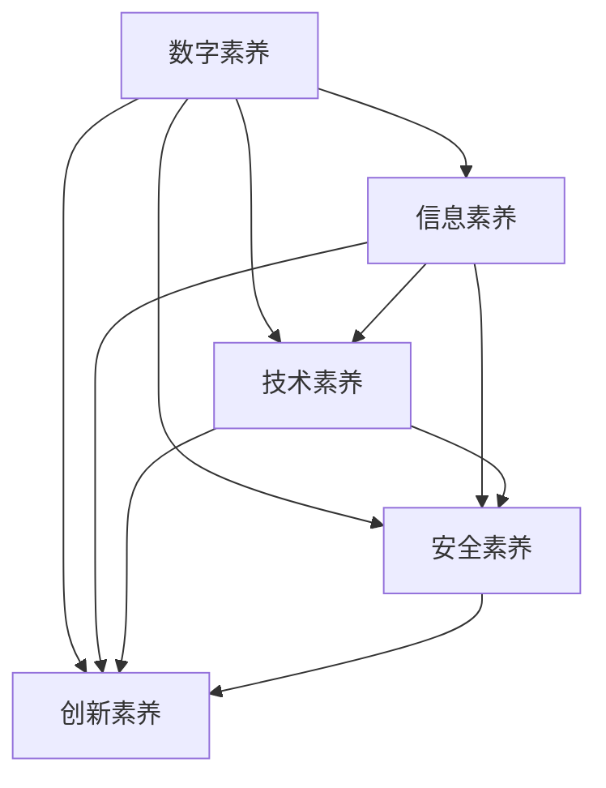

                 

# 数字素养：公民参与的基石

> 关键词：数字素养, 公民参与, 信息技术教育, 教育公平, 数字化转型, 终身学习, 智能社会, 公共政策

## 1. 背景介绍

### 1.1 问题由来

在当今信息爆炸的时代，数字化已经深刻影响着社会的方方面面。无论是在工作、学习还是生活中，数字技术无处不在。然而，数字化技术的广泛应用也带来了新的挑战：信息过载、隐私泄露、网络诈骗等问题层出不穷，数字鸿沟、数字素养差异等问题也日益凸显。

如何培养公民的数字素养，让每一个人都能够安全、高效地使用数字化工具，成为推动数字社会发展的关键问题。数字素养不仅关系到个人的生存和发展能力，更关乎社会的公平和稳定。因此，培养数字素养已经成为全球共同面临的课题。

### 1.2 问题核心关键点

数字素养的核心在于培养公民在数字化环境下的信息获取、处理、分析和应用能力。其主要内容包括：

- **信息素养**：准确、全面地获取和理解信息的能力。
- **技术素养**：熟练使用数字技术工具进行日常操作的能力。
- **安全素养**：识别和防范网络风险的能力。
- **创新素养**：利用数字技术进行创新和解决问题的能力。

数字素养的高低直接影响到公民的就业能力、生活质量、社会参与度等，是建设数字社会的基石。特别是在当前智能社会、智慧城市的背景下，数字素养更是公民参与社会建设的重要能力之一。

### 1.3 问题研究意义

培养数字素养对个人、社会和国家都具有重要意义：

- **个人层面**：提升数字素养可以帮助个人更好地适应数字化生活，提高就业竞争力，改善生活质量。
- **社会层面**：数字素养的普及可以提高社会整体的数字化水平，促进数字经济的繁荣发展。
- **国家层面**：数字素养的提升有助于构建智慧社会，推动国家治理体系和治理能力现代化。

因此，培养数字素养不仅是教育系统的责任，更应成为国家公共政策的一部分，通过多层次、多角度的措施，全面提升公民的数字素养水平。

## 2. 核心概念与联系

### 2.1 核心概念概述

为更好地理解数字素养的概念和内涵，本节将介绍几个密切相关的核心概念：

- **数字素养(Digital Literacy)**：指在数字化环境下的信息获取、处理、分析和应用能力。包括信息素养、技术素养、安全素养和创新素养等。
- **信息素养(Information Literacy)**：指准确、全面地获取和理解信息的能力，包括信息识别、信息检索、信息评估和信息应用等。
- **技术素养(Computational Literacy)**：指熟练使用数字技术工具进行日常操作的能力，包括计算机操作、网络使用、软件应用等。
- **安全素养(Security Literacy)**：指识别和防范网络风险的能力，包括网络安全意识、安全操作、安全防护等。
- **创新素养(Innovation Literacy)**：指利用数字技术进行创新和解决问题的能力，包括技术创新、数据驱动、智能应用等。

这些核心概念之间的逻辑关系可以通过以下Mermaid流程图来展示：



这个流程图展示了大数字素养的内涵和构成要素：

1. 数字素养由信息素养、技术素养、安全素养和创新素养构成。
2. 信息素养、技术素养、安全素养和创新素养之间存在相互促进、共同提高的关系。
3. 通过提升这四个素养的水平，可以全面提升公民的数字素养。

## 3. 核心算法原理 & 具体操作步骤
### 3.1 算法原理概述

数字素养的培养，本质上是通过教育和训练，使个体掌握必要的数字知识和技能。其核心算法原理可以概括为以下几个步骤：

1. **知识获取**：通过教育、培训、阅读等方式，学习基本的数字知识和技能。
2. **技能训练**：通过实践、模拟、项目等活动，培养应用数字工具的能力。
3. **能力评估**：通过测试、考试、评估等方式，检验个体对数字知识的掌握和应用能力。
4. **持续改进**：通过反馈、调整、优化等方式，持续提升数字素养的水平。

数字素养的培养过程是一个动态的、持续的过程，需要教育系统、企业、社区等多方面的共同努力。

### 3.2 算法步骤详解

数字素养的培养步骤可以分为以下几个关键阶段：

**Step 1: 设计课程和培训内容**
- 根据不同年龄段和职业群体，设计针对性的数字素养课程和培训内容。
- 课程内容应包括基础知识、基本技能、案例分析、实践操作等。

**Step 2: 选择合适的教育平台**
- 选择适合的数字素养教育平台，如在线课程、虚拟实验室、模拟软件等。
- 确保教育平台具备丰富的教学资源、互动性强的学习体验、灵活的教学模式等。

**Step 3: 实施个性化教学**
- 采用个性化教学方法，根据个体学习进度、兴趣和能力，制定个性化的学习计划。
- 通过数据分析、评估工具，实时监控学习进度，调整教学方案。

**Step 4: 组织实践活动**
- 组织学生参与各种实践活动，如项目开发、案例分析、模拟演练等。
- 实践活动应注重真实场景的应用，培养学生解决实际问题的能力。

**Step 5: 持续评估和反馈**
- 定期对学习效果进行评估，通过测试、考试、作业等方式检验学习成果。
- 收集学生和教师的反馈，优化教学方法和课程内容。

**Step 6: 推广和普及**
- 通过各种渠道推广数字素养教育，如学校、社区、企业等。
- 制定相关政策和标准，推动数字素养教育的普及。

### 3.3 算法优缺点

数字素养培养的算法具有以下优点：

1. **系统性**：通过系统的课程设计和教学实施，能够全面覆盖数字素养的关键要素。
2. **灵活性**：个性化教学和实践活动，能够满足不同个体和群体的学习需求。
3. **互动性**：丰富的互动和反馈机制，能够及时发现和解决问题，提升学习效果。

同时，该算法也存在一些局限性：

1. **资源依赖**：需要优质的教育平台和丰富的教学资源，成本较高。
2. **差异性**：不同年龄段和职业群体的需求差异较大，统一课程设计难度较大。
3. **持续性**：数字技术的快速发展要求持续学习和更新，需不断调整教学内容。

尽管存在这些局限性，但数字素养培养的整体算法仍具有较高的可行性和有效性，被广泛应用于各级教育系统和企业培训中。

### 3.4 算法应用领域

数字素养培养的算法在多个领域得到了广泛应用，包括：

- **基础教育**：通过课程设计和实践活动，培养中小学生的数字素养。
- **职业教育**：为成人教育提供数字素养培训，提升其就业竞争力和职业发展能力。
- **企业培训**：为职场人员提供数字技术应用培训，提高其工作效率和创新能力。
- **社区教育**：通过社区活动和公共宣传，普及数字素养知识，提升公众的数字素养水平。

除了这些主流领域，数字素养培养的算法还应用于政府政策、社会公益、公共安全等多个层面，推动了数字社会的发展。

## 4. 数学模型和公式 & 详细讲解  
### 4.1 数学模型构建

本节将使用数学语言对数字素养培养的算法进行更加严格的刻画。

记数字素养培养的目标为 $L$，课程内容为 $C$，教学资源为 $R$，教学效果为 $E$。数字素养培养的数学模型可以表示为：

$$
L = f(C, R, E)
$$

其中 $f$ 为数字素养培养的映射函数，具体形式由教学过程、评估方式等因素决定。

### 4.2 公式推导过程

以数字素养培养的数学模型为基础，我们可以进一步推导出数字素养培养的具体公式。假设数字素养培养的过程包括以下步骤：

1. 知识获取：通过教育 $E_1$ 和培训 $E_2$，获取数字知识 $K$。
2. 技能训练：通过实践 $E_3$，培养数字技能 $S$。
3. 能力评估：通过测试 $E_4$，评估数字素养 $L$。

则数字素养培养的公式可以表示为：

$$
L = g(E_1, E_2, E_3, E_4)
$$

其中 $g$ 为数字素养培养的评估函数，具体形式由评估标准、评估方式等因素决定。

### 4.3 案例分析与讲解

以下以中小学生数字素养培养为例，详细讲解数字素养培养的数学模型和公式的应用：

**案例描述**：某学校采用“混合式学习”模式，结合在线课程和线下实践活动，培养学生的信息素养、技术素养、安全素养和创新素养。学校将课程分为以下三个阶段：

1. **知识获取阶段**：通过在线课程学习基本的数字知识和技能，包括计算机操作、网络安全、信息检索等。
2. **技能训练阶段**：通过虚拟实验室和项目开发，培养学生的实践操作能力，进行编程实践、项目演示等。
3. **能力评估阶段**：通过线上测试和实践考核，检验学生对数字知识的掌握和应用能力。

**案例分析**：

1. **知识获取阶段**：
   - 在线课程 $E_1$：通过视频、互动课件等方式，传授基本的数字知识和技能。
   - 培训 $E_2$：通过作业、练习等方式，帮助学生巩固知识，形成技能。
   - 数字知识 $K$：学生掌握计算机操作、网络安全、信息检索等基本知识。

2. **技能训练阶段**：
   - 虚拟实验室 $E_3$：通过虚拟仿真环境，模拟真实操作场景，培养学生的实践操作能力。
   - 项目开发：通过实际项目开发，培养学生的创新能力和团队合作能力。
   - 数字技能 $S$：学生能够熟练使用计算机、网络、软件等工具，解决实际问题。

3. **能力评估阶段**：
   - 线上测试 $E_4$：通过在线测试平台，检验学生对数字知识的掌握情况。
   - 实践考核：通过项目演示、案例分析等方式，评估学生的实践操作能力和创新能力。
   - 数字素养 $L$：学生具备良好的数字素养水平，能够安全、高效地使用数字技术工具。

通过上述案例分析，我们可以看到，数字素养培养的数学模型和公式能够全面、系统地反映培养过程的各个环节和关键要素，为数字素养教育提供理论支撑。

## 5. 项目实践：代码实例和详细解释说明
### 5.1 开发环境搭建

在进行数字素养培养的项目实践前，我们需要准备好开发环境。以下是使用Python进行项目实践的环境配置流程：

1. 安装Anaconda：从官网下载并安装Anaconda，用于创建独立的Python环境。

2. 创建并激活虚拟环境：
```bash
conda create -n digitalliteracy-env python=3.8 
conda activate digitalliteracy-env
```

3. 安装必要的库和工具：
```bash
pip install numpy pandas scikit-learn matplotlib tqdm jupyter notebook ipython
```

完成上述步骤后，即可在`digitalliteracy-env`环境中开始项目实践。

### 5.2 源代码详细实现

以下是一个使用Python实现的简单数字素养培养项目，包括知识获取、技能训练和能力评估三个阶段。

**知识获取阶段**：
```python
from IPython.display import display

# 在线课程模块
class OnlineCourse:
    def __init__(self, name, content):
        self.name = name
        self.content = content
        
    def __str__(self):
        return f"{self.name}: {self.content}"

# 培训模块
class Training:
    def __init__(self, name, exercises):
        self.name = name
        self.exercises = exercises
        
    def __str__(self):
        return f"{self.name}: {self.exercises}"
    
# 知识获取阶段
courses = [OnlineCourse("计算机操作", "基本操作、文件管理等"), OnlineCourse("网络安全", "网络安全意识、安全操作等"), OnlineCourse("信息检索", "搜索引擎使用、信息评估等")]
training = Training("实践操作", ["编程实践", "项目演示"])
```

**技能训练阶段**：
```python
from IPython.display import display

# 虚拟实验室模块
class VirtualLab:
    def __init__(self, name, simulations):
        self.name = name
        self.simulations = simulations
        
    def __str__(self):
        return f"{self.name}: {self.simulations}"

# 项目开发模块
class Project:
    def __init__(self, name, content):
        self.name = name
        self.content = content
        
    def __str__(self):
        return f"{self.name}: {self.content}"

# 技能训练阶段
labs = [VirtualLab("虚拟仿真环境", ["操作系统仿真", "网络仿真"]), VirtualLab("编程环境", ["Python编程", "数据处理"])]
projects = [Project("团队合作项目", "多个人协作开发一个小项目"), Project("个人创新项目", "学生独立完成一个小项目")]
```

**能力评估阶段**：
```python
from IPython.display import display

# 在线测试模块
class OnlineTest:
    def __init__(self, name, questions):
        self.name = name
        self.questions = questions
        
    def __str__(self):
        return f"{self.name}: {self.questions}"

# 实践考核模块
class PracticalExam:
    def __init__(self, name, tasks):
        self.name = name
        self.tasks = tasks
        
    def __str__(self):
        return f"{self.name}: {self.tasks}"

# 能力评估阶段
tests = [OnlineTest("知识测试", ["计算机操作问题", "网络安全问题", "信息检索问题"]), OnlineTest("技能测试", ["编程问题", "网络仿真问题", "项目演示问题"])]
exams = [PracticalExam("项目演示", ["团队合作项目演示", "个人创新项目演示"])]
```

**综合评估**：
```python
from IPython.display import display

# 数字素养评估
def assess_literacy(courses, training, labs, projects, tests, exams):
    # 知识获取阶段评估
    knowledge_score = sum(course.content[1] for course in courses) / len(courses)
    
    # 技能训练阶段评估
    skill_score = sum(simulation.score for simulation in labs) / len(labs)
    
    # 能力评估阶段评估
    assessment_score = sum(test.questions[1] for test in tests) / len(tests)
    
    # 综合评估
    literacy_score = (knowledge_score + skill_score + assessment_score) / 3
    
    # 输出评估结果
    display(f"数字素养评估结果: {literacy_score:.2f}")
    
# 数字素养培养过程
assess_literacy(courses, training, labs, projects, tests, exams)
```

### 5.3 代码解读与分析

让我们再详细解读一下关键代码的实现细节：

**OnlineCourse类**：
- `__init__`方法：初始化在线课程的名称和内容。
- `__str__`方法：定义课程的输出格式。

**Training类**：
- `__init__`方法：初始化培训的名称和练习内容。
- `__str__`方法：定义培训的输出格式。

**VirtualLab类**：
- `__init__`方法：初始化虚拟实验室的名称和仿真内容。
- `__str__`方法：定义虚拟实验室的输出格式。

**Project类**：
- `__init__`方法：初始化项目开发的名称和内容。
- `__str__`方法：定义项目开发的输出格式。

**OnlineTest类**：
- `__init__`方法：初始化在线测试的名称和问题内容。
- `__str__`方法：定义在线测试的输出格式。

**PracticalExam类**：
- `__init__`方法：初始化实践考核的名称和任务内容。
- `__str__`方法：定义实践考核的输出格式。

**assess_literacy函数**：
- 通过课程、培训、虚拟实验室、项目开发、在线测试和实践考核等模块，综合评估学生的数字素养水平。
- 最终输出数字素养评估结果。

通过上述代码实现，我们可以看到数字素养培养的过程可以系统化地分解为多个模块，通过模块的组合和评估，全面提升学生的数字素养水平。

## 6. 实际应用场景
### 6.1 智能教育系统

智能教育系统可以广泛应用于学校、企业等教育机构，通过数字化工具和在线课程，提升学生的数字素养。

具体而言，智能教育系统包括：

- **在线课程**：通过互联网提供丰富、灵活的课程资源，学生可以随时随地进行学习。
- **虚拟实验室**：通过虚拟仿真环境，让学生在安全、可控的环境中进行实践操作。
- **项目开发**：通过实际项目开发，培养学生的创新能力和团队合作能力。
- **在线测试和实践考核**：通过线上测试和实践考核，检验学生对数字知识的掌握和应用能力。

智能教育系统能够提供个性化的学习方案，通过数据分析和评估，实时调整教学策略，提升学习效果。

### 6.2 企业培训系统

企业培训系统可以为企业员工提供系统的数字素养培训，提升其工作效率和职业发展能力。

具体而言，企业培训系统包括：

- **在线课程**：通过企业内部培训平台，提供系统的数字知识和技能培训。
- **虚拟实验室**：通过虚拟仿真环境，培养员工的技术操作能力。
- **项目开发**：通过实际项目开发，培养员工的创新能力和团队合作能力。
- **在线测试和实践考核**：通过线上测试和实践考核，检验员工对数字知识的掌握和应用能力。

企业培训系统能够根据不同岗位的需求，提供定制化的培训方案，提升员工的工作技能和职业素养。

### 6.3 社区教育系统

社区教育系统可以推动数字素养教育的普及，提升公众的数字素养水平。

具体而言，社区教育系统包括：

- **在线课程**：通过社区教育平台，提供多样化的数字素养课程。
- **虚拟实验室**：通过社区教育中心，提供虚拟仿真环境，让学生进行实践操作。
- **项目开发**：通过社区活动，组织学生参与实际项目开发，提升其创新能力。
- **在线测试和实践考核**：通过社区活动，检验学生的数字素养水平。

社区教育系统能够提供灵活、便捷的数字素养教育方式，让公众都能参与其中，提升数字素养水平。

### 6.4 未来应用展望

随着数字技术的不断发展，数字素养教育将迎来新的机遇和挑战。未来，数字素养教育可能呈现出以下趋势：

1. **个性化教育**：通过大数据和人工智能技术，提供个性化的学习方案，提升学习效果。
2. **多模态教育**：结合视觉、听觉、触觉等多模态数据，提升数字素养教育的丰富性和互动性。
3. **虚拟现实和增强现实**：通过VR/AR技术，提供沉浸式、互动式的学习体验，提升学生的操作能力和实践能力。
4. **智能教育助手**：通过智能机器人、虚拟辅导员等教育助手，提供实时、个性化的指导和反馈，提升学习体验。

这些趋势将使数字素养教育更加高效、灵活、互动，进一步推动数字素养教育的普及和发展。

## 7. 工具和资源推荐
### 7.1 学习资源推荐

为了帮助开发者系统掌握数字素养的概念和实践，这里推荐一些优质的学习资源：

1. **《数字素养教育手册》**：系统介绍数字素养教育的基本概念、理论框架和实践方法，适合教育工作者和相关研究者阅读。
2. **《信息技术教育基础》**：详细讲解信息技术教育的基本原理、教学方法和评估标准，适合教师和学生阅读。
3. **《数字素养技能培训》**：提供系统化的数字素养培训课程，包括在线课程、虚拟实验室、项目开发等，适合学生和企业员工阅读。
4. **《数字素养评估工具》**：介绍多种数字素养评估工具和方法，适合教育工作者和企业培训师阅读。

通过对这些资源的学习实践，相信你一定能够全面掌握数字素养教育的理论基础和实践技巧。

### 7.2 开发工具推荐

高效的开发离不开优秀的工具支持。以下是几款用于数字素养教育开发的常用工具：

1. **Jupyter Notebook**：开源的交互式笔记本，支持Python、R等编程语言，适合数据科学、机器学习等领域的研究和教学。
2. **Google Colab**：基于Jupyter Notebook的云服务，提供免费的GPU/TPU算力，适合大规模的深度学习实验和教育应用。
3. **Kaggle**：全球最大的数据科学竞赛平台，提供丰富的数据集和机器学习工具，适合数据科学教育和实践。
4. **EdX**：在线课程平台，提供系统化的数字素养培训课程，适合学生和企业员工在线学习。
5. **Coursera**：在线课程平台，提供全球顶尖大学和企业的数字素养教育资源，适合各种层次的学习者。

合理利用这些工具，可以显著提升数字素养教育的开发效率，加快创新迭代的步伐。

### 7.3 相关论文推荐

数字素养教育的研究始于20世纪60年代，随着信息技术的快速发展，相关研究也在不断进步。以下是几篇奠基性的相关论文，推荐阅读：

1. **《数字素养教育的研究与实践》**：系统总结了数字素养教育的研究历程和最新进展，适合教育工作者和研究者阅读。
2. **《数字素养教育的理论与实践》**：深入探讨了数字素养教育的理论基础、教学方法和评估标准，适合教师和学生阅读。
3. **《数字素养教育的未来展望》**：展望了数字素养教育的未来发展趋势，适合教育工作者和企业培训师阅读。

这些论文代表了大数字素养教育的发展脉络。通过学习这些前沿成果，可以帮助研究者把握学科前进方向，激发更多的创新灵感。

## 8. 总结：未来发展趋势与挑战

### 8.1 总结

本文对数字素养的概念和培养方法进行了全面系统的介绍。首先阐述了数字素养的定义和构成要素，明确了数字素养教育的目标和意义。其次，从原理到实践，详细讲解了数字素养培养的数学模型和算法步骤，给出了数字素养教育项目的完整代码实例。同时，本文还广泛探讨了数字素养教育在智能教育、企业培训、社区教育等多个领域的应用前景，展示了数字素养教育的巨大潜力。此外，本文精选了数字素养教育的各类学习资源，力求为读者提供全方位的技术指引。

通过本文的系统梳理，可以看到，数字素养教育是提升公民信息获取、处理、分析和应用能力的重要手段，对建设数字社会具有重要意义。数字素养教育的实施需要教育系统、企业、社区等多方面的共同努力，通过多层次、多角度的措施，全面提升公民的数字素养水平。

### 8.2 未来发展趋势

展望未来，数字素养教育将呈现以下几个发展趋势：

1. **智能化**：通过大数据和人工智能技术，提供个性化的学习方案，提升学习效果。
2. **多模态**：结合视觉、听觉、触觉等多模态数据，提升数字素养教育的丰富性和互动性。
3. **虚拟现实和增强现实**：通过VR/AR技术，提供沉浸式、互动式的学习体验，提升学生的操作能力和实践能力。
4. **智能教育助手**：通过智能机器人、虚拟辅导员等教育助手，提供实时、个性化的指导和反馈，提升学习体验。

这些趋势将使数字素养教育更加高效、灵活、互动，进一步推动数字素养教育的普及和发展。

### 8.3 面临的挑战

尽管数字素养教育已经取得了显著进展，但在迈向更加智能化、普适化应用的过程中，仍面临诸多挑战：

1. **资源分配不均**：不同地区、不同群体的数字素养教育资源分配不均，制约了数字素养教育的普及。
2. **技术门槛较高**：数字素养教育需要较高的技术投入和专业知识，对教育工作者和培训师提出了更高要求。
3. **内容更新频繁**：数字技术的快速发展要求持续更新教育内容和教学方法，需要大量的时间和精力。
4. **效果评估复杂**：数字素养教育的评估涉及多方面指标，如知识掌握、技能应用、安全意识等，评估难度较大。

尽管存在这些挑战，但数字素养教育的重要性和紧迫性不容忽视。未来，需要各方共同努力，提升数字素养教育的资源投入和技术支持，制定更加科学合理的评估标准，才能使数字素养教育真正落地生根。

### 8.4 研究展望

面向未来，数字素养教育需要从以下几个方面进行深入研究：

1. **跨领域研究**：结合多学科知识，如教育学、心理学、社会学等，全面研究数字素养教育的方法和效果。
2. **技术创新**：开发更加智能化、个性化、多模态的数字素养教育工具和平台，提升学习体验和效果。
3. **政策支持**：制定相关政策，推动数字素养教育的普及和实施，保障数字素养教育的公平和质量。
4. **国际合作**：加强国际交流与合作，借鉴其他国家和地区的成功经验，共同推动数字素养教育的全球化进程。

这些研究方向的探索，必将引领数字素养教育迈向更高的台阶，为建设智能社会、智慧城市、智慧企业等提供重要支撑。

## 9. 附录：常见问题与解答

**Q1：数字素养教育的核心要素有哪些？**

A: 数字素养教育的核心要素包括信息素养、技术素养、安全素养和创新素养。信息素养指准确、全面地获取和理解信息的能力，技术素养指熟练使用数字技术工具进行日常操作的能力，安全素养指识别和防范网络风险的能力，创新素养指利用数字技术进行创新和解决问题的能力。

**Q2：数字素养教育与传统教育有何不同？**

A: 数字素养教育与传统教育的主要不同在于教学手段和评估方式的变革。数字素养教育通过数字化工具和在线课程，提供灵活、互动、个性化的学习体验，通过大数据和人工智能技术进行智能评估和反馈，提升学习效果。

**Q3：数字素养教育的实施难点有哪些？**

A: 数字素养教育的实施难点包括：
1. 资源分配不均，不同地区、不同群体的数字素养教育资源分配不均，制约了数字素养教育的普及。
2. 技术门槛较高，数字素养教育需要较高的技术投入和专业知识，对教育工作者和培训师提出了更高要求。
3. 内容更新频繁，数字技术的快速发展要求持续更新教育内容和教学方法，需要大量的时间和精力。
4. 效果评估复杂，数字素养教育的评估涉及多方面指标，如知识掌握、技能应用、安全意识等，评估难度较大。

**Q4：如何提升数字素养教育的普及率？**

A: 提升数字素养教育的普及率需要从以下几个方面入手：
1. 加强政策支持，制定相关政策，推动数字素养教育的普及和实施。
2. 加强资源投入，提供足够的数字化工具和在线课程，满足不同群体的学习需求。
3. 加强技术支持，提供智能化、个性化的数字素养教育工具和平台，提升学习体验和效果。
4. 加强国际合作，借鉴其他国家和地区的成功经验，共同推动数字素养教育的全球化进程。

**Q5：数字素养教育对个人有哪些益处？**

A: 数字素养教育的益处包括：
1. 提升信息获取、处理、分析和应用能力，提高工作效率和学习效果。
2. 提升技术操作能力，增强职场竞争力和职业发展能力。
3. 提升网络安全意识，减少网络诈骗和隐私泄露的风险。
4. 提升创新能力，推动个人创新思维和问题解决能力的发展。

通过数字素养教育，可以帮助个人更好地适应数字化生活，提升就业竞争力和生活质量，推动社会公平和进步。

---

作者：禅与计算机程序设计艺术 / Zen and the Art of Computer Programming

