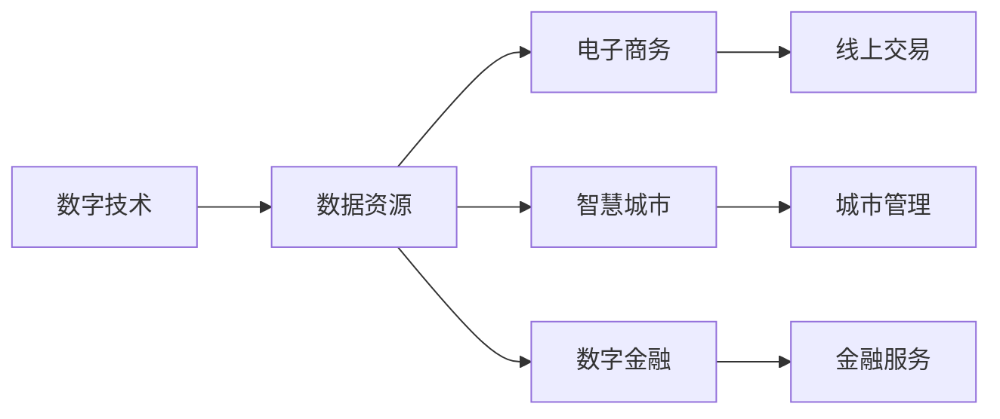

                 

# 数字经济：社会发展的助推器

## 1. 背景介绍

### 1.1 数字经济的定义与内涵

数字经济是指基于数字技术，以数字化信息和网络为依托，通过信息网络技术实现信息、商品、服务、资金等的数字化和网络化生产、交换、分配和消费的经济形态。数字经济的特点包括但不限于以下几个方面：

- **数字化转型**：传统的生产、流通、服务等领域通过数字化手段进行全面升级，实现线上线下融合。
- **网络化协同**：企业间、企业与消费者间通过互联网进行信息交互、资源共享，形成高效协作网络。
- **智能化驱动**：利用人工智能、大数据、云计算等技术，实现生产过程的智能化、个性化定制。
- **全球化市场**：数字技术打破了地理限制，实现全球范围内的资源优化配置。

数字经济已成为推动全球经济发展的重要引擎。联合国《2019年世界经济状况与展望报告》指出，数字经济将显著提升全球生产效率，预计到2030年将使全球GDP增长率提升1-6个百分点，其中发展中国家的提升幅度更大。

### 1.2 数字经济的影响力

数字经济的广泛应用，不仅深刻改变了生产力和生产关系，也重塑了社会治理、文化娱乐、教育医疗等多个领域。以下是数字经济对社会各方面产生的主要影响：

- **生产效率提升**：自动化、智能化生产方式极大地提高了生产效率和产品质量。
- **商业模式创新**：从B2B、B2C到C2B，数字化推动了更多新商业模式的出现，如共享经济、平台经济等。
- **就业结构调整**：数字化推动了职业结构的深刻变化，高技能人才需求增加，传统劳动密集型岗位减少。
- **社会治理优化**：大数据、人工智能等技术应用于公共安全、环境监测、城市管理等方面，提高了社会治理的智能化、精准化水平。
- **文化娱乐变革**：数字技术提供了更为丰富多样的文化娱乐形式，如在线音乐、视频、游戏等。
- **教育医疗进步**：远程教育、在线医疗等新型服务模式的出现，打破了时空限制，提升了教育医疗服务的可及性和质量。

综上所述，数字经济不仅是一种经济发展形态，更是推动社会进步和文明发展的重要力量。

## 2. 核心概念与联系

### 2.1 核心概念概述

为了更好地理解数字经济的内涵和运作机制，下面我们将介绍几个核心概念及其之间的联系：

- **数字技术**：包括互联网、移动互联网、云计算、大数据、人工智能等技术，是数字经济的基础设施。
- **数据资源**：数字经济的核心资源之一，包括用户行为数据、交易数据、社交数据等，驱动着数据分析、模型训练等活动。
- **电子商务**：基于互联网的线上交易模式，包括B2B、B2C、C2C等形式，是数字经济的重要组成部分。
- **智慧城市**：通过数字化手段提升城市管理水平和服务质量，提高市民生活品质，是数字经济的重要应用场景。
- **数字金融**：利用数字技术实现金融服务的数字化、智能化，提高金融效率和安全性，是数字经济的典型应用。

这些概念之间存在紧密的联系：数字技术为数据资源的收集、存储、分析提供了基础；数据资源驱动电子商务、智慧城市、数字金融等业务的发展；而各类业务的发展又进一步促进了数字技术的创新和应用。

### 2.2 核心概念的联系

为了直观展示这些核心概念之间的联系，我们通过以下Mermaid流程图进行说明：



此图展示了数字技术如何通过数据资源的支持，驱动电子商务、智慧城市和数字金融等多个业务的发展。

## 3. 核心算法原理 & 具体操作步骤

### 3.1 算法原理概述

数字经济的核心算法原理基于数据科学、机器学习等技术，旨在通过数据驱动的方式，优化资源配置，提升经济运行效率。以下将详细阐述这一原理：

- **数据采集与清洗**：通过传感器、互联网、社交媒体等渠道收集海量数据，并对数据进行去重、去噪、缺失值填充等处理。
- **数据分析与建模**：利用统计学、机器学习等技术，对数据进行特征提取、模型训练，形成决策支持。
- **算法优化与评估**：通过交叉验证、模型评估等手段，不断优化模型参数和结构，提高模型预测准确性。

### 3.2 算法步骤详解

数字经济中常用的算法步骤主要包括以下几个方面：

1. **数据预处理**：清洗、归一化、编码等步骤，为后续算法训练准备数据。
2. **特征工程**：根据业务需求，选择合适的特征，构建特征集合，如ID、年龄、性别、地域、时间等。
3. **模型训练**：选择合适的算法模型（如线性回归、决策树、随机森林、神经网络等），在训练数据集上进行训练，调整模型参数。
4. **模型评估**：利用测试数据集评估模型性能，计算指标如准确率、召回率、F1值等。
5. **模型部署与监控**：将训练好的模型部署到生产环境，实时监控模型性能，进行调优。

### 3.3 算法优缺点

数字经济中常用的算法具有以下优点：

- **高效性**：自动化数据处理和模型训练，大幅提高工作效率。
- **准确性**：基于大量数据训练的模型具有较高预测准确性。
- **可扩展性**：模型可以随时添加新数据、调整参数，适应不断变化的市场环境。

同时，也存在一些缺点：

- **数据依赖性**：模型训练和优化高度依赖数据质量，数据偏差可能导致模型偏差。
- **模型复杂性**：复杂的算法模型需要较长时间进行训练和优化。
- **解释性不足**：黑箱模型难以解释内部决策逻辑，增加了使用和维护的难度。
- **安全性问题**：数据泄露、模型被攻击等风险可能对业务带来损失。

### 3.4 算法应用领域

数字经济中的算法在多个领域有广泛应用，包括但不限于以下几个方面：

- **零售业**：通过数据分析，实现精准营销、库存优化、需求预测等。
- **金融业**：利用机器学习模型进行信用评估、欺诈检测、投资策略优化等。
- **医疗健康**：通过数据分析，实现疾病预测、个性化治疗、医疗资源优化等。
- **制造业**：应用AI技术进行质量控制、设备维护、供应链优化等。
- **智慧交通**：利用数据分析和预测模型，优化交通流量、减少拥堵、提升安全性等。
- **公共安全**：利用机器学习模型进行异常检测、预测预警、犯罪防范等。

## 4. 数学模型和公式 & 详细讲解 & 举例说明

### 4.1 数学模型构建

在数字经济中，常用的数学模型包括回归模型、分类模型、聚类模型、推荐模型等。以回归模型为例，假设我们希望预测销售额 $y$ 与广告支出 $x$ 之间的关系。常见的回归模型有线性回归、岭回归、Lasso回归等。

### 4.2 公式推导过程

线性回归模型的一般形式为：

$$ y = \beta_0 + \beta_1 x_1 + \beta_2 x_2 + ... + \beta_p x_p + \epsilon $$

其中，$\beta_0$ 为截距，$\beta_1, \beta_2, ..., \beta_p$ 为特征系数，$x_1, x_2, ..., x_p$ 为特征向量，$\epsilon$ 为误差项。

线性回归的参数估计方法为最小二乘法，通过最小化损失函数来求解：

$$ \hat{\beta} = \mathop{\arg\min}_{\beta} \sum_{i=1}^n (y_i - \sum_{j=1}^p \beta_j x_{ij})^2 $$

其中，$n$ 为样本数量，$x_{ij}$ 为样本 $i$ 的第 $j$ 个特征值。

### 4.3 案例分析与讲解

假设我们要预测某电商平台的月销售额，利用线性回归模型进行建模和预测。具体步骤如下：

1. 收集电商平台的销售数据，包括销售额、广告支出、季节性因素等。
2. 对数据进行预处理，如缺失值填充、归一化等。
3. 构建特征向量 $x = [广告支出, 季节性因素, ...]$。
4. 训练线性回归模型，求解 $\beta_0, \beta_1, \beta_2, ..., \beta_p$。
5. 在测试集上评估模型性能，计算均方误差、决定系数等指标。
6. 利用训练好的模型进行预测，根据广告支出预测下个月的销售额。

## 5. 项目实践：代码实例和详细解释说明

### 5.1 开发环境搭建

要进行数字经济相关的数据分析和模型训练，首先需要搭建开发环境。以下提供一个基本的环境配置步骤：

1. 安装Python：Python是数字经济数据分析和建模的主要编程语言，建议安装最新版本，如Python 3.9以上。
2. 安装Pandas：Pandas是Python数据分析的重要库，用于数据处理和清洗。
3. 安装NumPy：NumPy是Python科学计算的核心库，用于数值计算和数组操作。
4. 安装Scikit-Learn：Scikit-Learn是Python机器学习库，提供了多种常用的机器学习算法。
5. 安装Matplotlib：Matplotlib是Python数据可视化的库，用于绘制图表。

### 5.2 源代码详细实现

以下以线性回归模型为例，提供一个简单的代码实现，具体步骤如下：

```python
import numpy as np
import pandas as pd
from sklearn.linear_model import LinearRegression
from sklearn.metrics import mean_squared_error, r2_score
import matplotlib.pyplot as plt

# 读取数据
data = pd.read_csv('sales_data.csv')

# 数据预处理
X = data[['广告支出', '季节性因素']].values
y = data['销售额'].values

# 分割数据集
from sklearn.model_selection import train_test_split
X_train, X_test, y_train, y_test = train_test_split(X, y, test_size=0.2, random_state=42)

# 训练模型
model = LinearRegression()
model.fit(X_train, y_train)

# 预测与评估
y_pred = model.predict(X_test)
mse = mean_squared_error(y_test, y_pred)
rmse = np.sqrt(mse)
r2 = r2_score(y_test, y_pred)

print(f'RMSE: {rmse}, R^2: {r2}')

# 绘制图表
plt.scatter(y_test, y_pred)
plt.xlabel('真实值')
plt.ylabel('预测值')
plt.show()
```

### 5.3 代码解读与分析

- **数据读取与预处理**：通过Pandas库读取CSV格式的数据文件，并对数据进行特征选择和预处理。
- **模型训练与评估**：使用Scikit-Learn库中的LinearRegression模型进行训练，并计算均方误差和决定系数等评估指标。
- **图表绘制**：使用Matplotlib库绘制预测值与真实值之间的散点图，直观展示模型预测效果。

## 6. 实际应用场景

### 6.1 电子商务

电子商务是数字经济的重要组成部分。通过大数据分析，电商平台可以实现个性化推荐、库存优化、需求预测等，提升用户体验和运营效率。

**案例**：某电商平台利用用户浏览、购买记录等数据，训练协同过滤推荐模型，实现个性化商品推荐。具体步骤如下：

1. 收集用户行为数据，如浏览记录、购买记录、评分等。
2. 对数据进行清洗、编码、特征工程等预处理。
3. 构建用户-商品矩阵，进行冷启动分析和模型训练。
4. 实时推荐系统部署到前端页面，提供个性化商品推荐。
5. 定期评估推荐模型性能，调整参数和特征集合。

通过以上步骤，电商平台可以大幅提升用户留存率和销售额，实现精准营销。

### 6.2 智慧城市

智慧城市是数字经济的典型应用场景之一。通过智能数据分析，提升城市管理水平和服务质量，改善市民生活质量。

**案例**：某智慧城市项目利用传感器数据，构建交通流量预测模型，优化城市交通管理。具体步骤如下：

1. 收集城市交通流量、气象数据、道路施工等传感器数据。
2. 对数据进行清洗、归一化、特征工程等预处理。
3. 利用时间序列模型、深度学习模型等构建交通流量预测模型。
4. 实时监控交通流量，优化交通信号灯控制。
5. 通过城市管理中心对模型进行调优和维护。

通过以上步骤，智慧城市可以降低交通拥堵，提高出行效率，提升市民满意度。

### 6.3 数字金融

数字金融是数字经济的重要组成部分，利用数字技术提升金融服务的效率和安全性。

**案例**：某银行利用机器学习模型进行信用评估和反欺诈检测。具体步骤如下：

1. 收集用户的交易数据、信用历史、社交数据等。
2. 对数据进行预处理、特征工程等。
3. 训练信用评估模型和反欺诈检测模型，优化模型参数。
4. 实时监控交易数据，进行信用评分和欺诈预警。
5. 定期评估模型性能，调整模型和参数。

通过以上步骤，银行可以降低不良贷款率，提升金融服务质量，保障客户资金安全。

## 7. 工具和资源推荐

### 7.1 学习资源推荐

要深入理解数字经济，掌握相关技术，以下是一些推荐的资源：

1. 《数字经济：数字化时代的新经济》：该书系统介绍了数字经济的概念、原理和应用，适合初学者和从业者阅读。
2. 《Python数据科学手册》：该书详细介绍了Python在数据科学和机器学习中的应用，是学习数据分析和建模的必备工具。
3. Coursera和Udacity：提供大量关于数据科学、机器学习、人工智能等领域的在线课程，适合自学和提高。
4. Kaggle：Kaggle平台提供海量数据集和竞赛，可以实践和验证数据分析和模型训练的技能。
5. GitHub：GitHub上有大量开源项目和代码，可以学习和借鉴优秀的实践经验。

### 7.2 开发工具推荐

以下是一些常用的开发工具，可以大大提高数字经济项目开发的效率和质量：

1. Jupyter Notebook：用于数据科学和机器学习实验的交互式环境，支持Python、R等多种语言。
2. R Studio：R语言的集成开发环境，支持R语言的数据分析和建模。
3. SQL：用于数据库管理和数据查询，可以方便地进行数据处理和分析。
4. Hadoop和Spark：大数据处理平台，可以处理海量数据，实现分布式计算。
5. Docker和Kubernetes：容器化和容器编排工具，方便管理和部署应用。

### 7.3 相关论文推荐

数字经济领域的论文众多，以下是一些有代表性的文献：

1. 《The Digital Economy: Structure, Dynamics, and Public Policy》：分析了数字经济的结构和动态，探讨了政策建议。
2. 《Big Data and the digital economy》：研究了大数据在数字经济中的应用和影响。
3. 《Artificial Intelligence and the Future of the Digital Economy》：探讨了人工智能在数字经济中的作用和未来发展方向。
4. 《The Future of Work in the Digital Economy》：分析了数字经济对就业结构的影响。
5. 《Digital Platforms and the Digital Economy》：研究了数字平台对数字经济的影响。

## 8. 总结：未来发展趋势与挑战

### 8.1 研究成果总结

数字经济作为推动社会进步的重要力量，其核心技术包括数据采集与处理、数据分析与建模、算法优化与评估等。这些技术在电商、智慧城市、金融等多个领域得到了广泛应用，取得了显著的成效。

### 8.2 未来发展趋势

数字经济的未来发展趋势包括以下几个方面：

1. **智能化升级**：人工智能、机器学习等技术在数字经济中的应用将更加深入，提升智能化水平，推动数字经济向更高层次发展。
2. **数据融合**：多种数据源的融合将带来更全面的分析视角，提升决策的准确性和效率。
3. **云服务普及**：云服务将推动数据存储、计算、分析等任务的云化，降低企业成本，提高资源利用率。
4. **边缘计算**：边缘计算技术将提升数据处理速度，减少数据传输延时，优化资源配置。
5. **区块链应用**：区块链技术将提升数据的安全性和透明性，优化交易流程，降低信任成本。
6. **可持续发展**：数字经济的发展需要注重环保和可持续发展，减少能源消耗，提高资源利用效率。

### 8.3 面临的挑战

数字经济在快速发展的同时，也面临诸多挑战：

1. **数据隐私和安全**：数据泄露、隐私侵犯等安全问题可能对业务带来严重损失。
2. **算法偏见**：模型训练中的数据偏差可能导致算法偏见，影响决策公正性。
3. **技术迭代快**：数字技术发展迅速，需要不断跟进新技术，更新模型和算法。
4. **伦理和道德问题**：数字经济中的伦理和道德问题需要引起重视，如隐私保护、公平性等。
5. **成本和效率**：大规模数据处理和模型训练需要高昂的成本，需要在效率和成本之间找到平衡。

### 8.4 研究展望

面对数字经济的发展趋势和挑战，未来研究需要关注以下几个方面：

1. **数据治理**：制定数据治理规范，确保数据安全和隐私保护。
2. **公平算法**：开发公平算法，消除模型偏见，提升决策公正性。
3. **边缘计算**：探索边缘计算技术，优化数据处理流程，提升响应速度。
4. **可持续发展**：推动数字经济绿色发展，降低环境影响，提高资源利用效率。
5. **伦理和道德研究**：加强数字伦理和道德研究，构建数字经济健康发展的生态系统。

## 9. 附录：常见问题与解答

**Q1: 数字经济和传统经济的区别是什么？**

A: 数字经济和传统经济的主要区别在于生产方式和资源配置的数字化、网络化、智能化。传统经济主要依赖实体资产，而数字经济则通过数据资源实现资源配置和价值创造。

**Q2: 数字经济的发展对就业有什么影响？**

A: 数字经济的发展对就业有双重影响。一方面，自动化和智能化提高了生产效率，减少了部分低技能劳动岗位；另一方面，新的数字岗位和商业模式不断涌现，需要大量高技能人才。因此，劳动力需要不断提升技能，适应就业市场变化。

**Q3: 数字经济的安全性和隐私保护有哪些措施？**

A: 数字经济的安全性和隐私保护需要多层次的措施，包括数据加密、访问控制、匿名化处理、隐私保护算法等。同时，法律法规和技术标准也需要不断完善，保障数据安全和隐私权益。

**Q4: 如何评估数字经济模型的性能？**

A: 数字经济模型的性能评估通常包括准确率、召回率、F1值、ROC曲线、AUC等指标。同时，还需要考虑模型的可解释性、鲁棒性、泛化能力等方面。

**Q5: 数字经济的核心技术有哪些？**

A: 数字经济的核心技术包括数据采集与处理、数据分析与建模、算法优化与评估等。其中，数据采集与处理是基础，数据分析与建模是核心，算法优化与评估是保障。

---

作者：禅与计算机程序设计艺术 / Zen and the Art of Computer Programming

