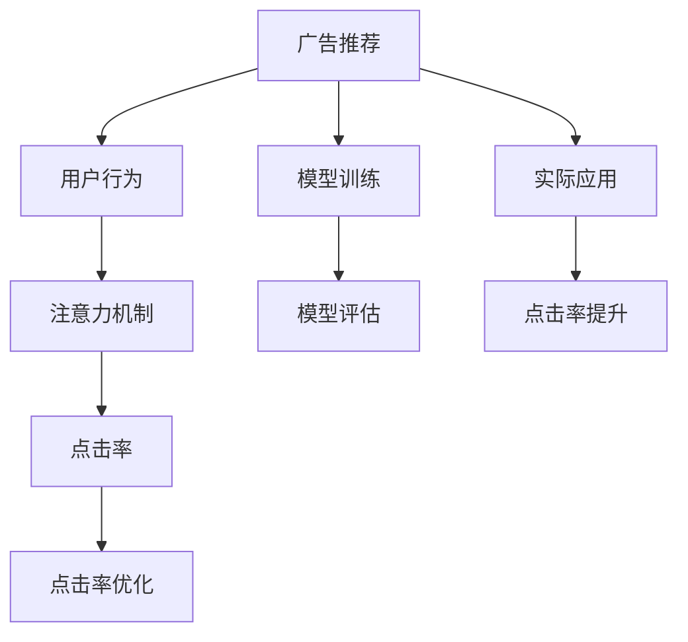

                 

# 数字营销中的注意力度量指标

> 关键词：数字营销,注意力机制,广告推荐,用户行为,点击率

## 1. 背景介绍

### 1.1 问题由来

在数字化时代，企业通过互联网平台进行市场营销，力求最大化广告投入效果，并实现精准的用户定向。为了达到这一目标，企业普遍采用广告推荐系统，通过大量用户行为数据，自动分析用户兴趣偏好，智能推荐个性化的广告内容，以提高广告点击率(CTR)和转化率(Conversion Rate)。然而，传统的广告推荐系统存在诸多问题，如过度曝光、重复推荐、忽视用户行为多样性等，导致广告效果和用户满意度不高。为此，研究人员提出并应用了注意力机制，通过引入注意力权重，动态调整广告推荐策略，以提升广告推荐的准确性和用户体验。

### 1.2 问题核心关键点

注意力机制(Attention Mechanism)是深度学习模型中的一种机制，旨在通过学习动态的注意力权重，将模型输入序列中最重要的部分聚焦到输出结果中。在数字营销中，注意力机制可以应用于广告推荐、内容推荐等多个场景，通过计算用户对不同广告内容的关注度，实现精准推荐。

注意力机制的关键在于计算每个广告的注意力权重，其计算方式通常由模型的输出向量表示，并应用到原始输入向量的加权求和。注意力权重计算过程通常包含以下几个步骤：
1. 计算注意力得分：将广告特征向量与用户特征向量相乘，得到注意力得分。
2. 计算softmax分布：对注意力得分进行softmax归一化，得到注意力权重向量。
3. 加权求和：将注意力权重向量与广告特征向量相乘后求和，得到最终推荐结果。

通过引入注意力机制，模型可以动态调整不同广告的权重，提升广告推荐的个性化和精准度。然而，如何在数字营销中有效计算注意力得分和权重，仍是一个具有挑战性的问题。本文将深入探讨数字营销中的注意力机制，并给出详细计算方法和案例分析。

## 2. 核心概念与联系

### 2.1 核心概念概述

为更好地理解数字营销中的注意力机制，本节将介绍几个关键概念：

- 注意力机制(Attention Mechanism)：一种深度学习中的模型机制，通过学习输入序列中各部分的相对重要性，动态调整输出结果的生成过程。
- 广告推荐(Advertising Recommendation)：通过用户行为数据，自动推荐广告内容，提高广告投放的精准度和转化率。
- 用户行为(User Behavior)：用户与互联网平台交互时产生的行为数据，如浏览记录、点击行为、购买记录等。
- 点击率(CTR)：广告推荐系统中的一个重要指标，表示用户点击广告的概率，是广告效果的重要评估标准。
- 点击率优化(CTR Optimization)：通过算法和模型调整，优化广告投放策略，提升广告点击率。

这些概念之间的逻辑关系可以通过以下Mermaid流程图来展示：



这个流程图展示了大语言模型的核心概念及其之间的关系：

1. 广告推荐通过用户行为获取用户兴趣和偏好。
2. 注意力机制根据用户兴趣，计算广告的注意力得分和权重。
3. 点击率是广告推荐效果的重要指标。
4. 点击率优化通过调整推荐策略，提高广告点击率。
5. 广告推荐模型通过训练和评估，不断优化推荐效果。

这些概念共同构成了数字营销中的广告推荐系统，其核心在于通过注意力机制提升广告推荐的效果。

## 3. 核心算法原理 & 具体操作步骤
### 3.1 算法原理概述

数字营销中的广告推荐系统，通常基于注意力机制来计算广告的注意力权重，从而实现精准推荐。其核心思想是：通过模型计算用户对不同广告的兴趣程度，动态调整广告的注意力权重，使得重要的广告得到更多关注。

以点击率优化为例，我们可以将广告推荐系统看作一个二分类任务，即判断用户是否会对广告进行点击。设用户特征向量为 $x \in \mathbb{R}^d$，广告特征向量为 $y \in \mathbb{R}^d$，注意力得分 $a(x, y) \in \mathbb{R}$，注意力权重 $w \in \mathbb{R}^d$，最终点击率 $r \in \{0, 1\}$。注意力权重计算过程如下：

1. 计算注意力得分 $a(x, y)$：
$$
a(x, y) = x^Ty
$$

2. 计算softmax分布 $w$：
$$
w = \frac{e^{a(x, y)}}{\sum_{k=1}^K e^{a(x, k)}}
$$

3. 计算最终点击率 $r$：
$$
r = \sigma(\langle w, y \rangle)
$$

其中，$\sigma$ 为激活函数，通常使用 sigmoid 函数。

通过以上步骤，我们可以计算出用户对每个广告的注意力权重，进而进行加权求和，得到最终的推荐结果。

### 3.2 算法步骤详解

基于注意力机制的广告推荐系统，通常包括以下关键步骤：

**Step 1: 准备广告和用户特征数据**
- 收集广告和用户的特征向量，包括用户历史行为、广告特征、广告点击率等。
- 将特征向量标准化、归一化处理，以便于模型计算。

**Step 2: 初始化模型参数**
- 选择合适的网络结构，如全连接神经网络、卷积神经网络(CNN)、循环神经网络(RNN)等。
- 初始化模型参数，如权重矩阵、偏置向量等。

**Step 3: 训练模型**
- 将训练集数据划分为训练集和验证集，划分比例一般为 70:30。
- 使用交叉熵损失函数训练模型，最小化点击率预测误差。
- 使用随机梯度下降(Stochastic Gradient Descent, SGD)或其变种如 Adam 进行参数更新。

**Step 4: 计算注意力权重**
- 对于测试集中的每个广告，计算其注意力得分。
- 使用softmax函数对注意力得分进行归一化，得到注意力权重向量。
- 将注意力权重向量与广告特征向量进行加权求和，得到最终的推荐结果。

**Step 5: 评估模型效果**
- 在测试集上评估模型的平均点击率，对比训练前后的提升。
- 可视化注意力权重，分析用户对不同广告的关注度。
- 分析模型在各类用户群体上的效果差异，并进一步优化模型。

以上是基于注意力机制的广告推荐系统的一般流程。在实际应用中，还需要针对具体任务的特点，对模型进行优化设计，如引入更多特征、调整网络结构等，以进一步提升广告推荐的精准度和效果。

### 3.3 算法优缺点

基于注意力机制的广告推荐系统具有以下优点：
1. 动态调整注意力权重，提升广告推荐的个性化和精准度。
2. 能够处理用户行为的多样性，避免过度曝光和重复推荐。
3. 可以使用大量用户行为数据，进行有监督学习，获得更高的推荐效果。
4. 支持多种用户特征和广告特征的组合，适应不同的广告推荐场景。

然而，该方法也存在一定的局限性：
1. 对标注数据依赖较大，标注数据质量会影响推荐效果。
2. 模型复杂度较高，需要较长的训练时间，计算资源消耗较大。
3. 模型可能存在过拟合问题，特别是在标注数据不足的情况下。
4. 注意力机制对输入数据的预处理和表示要求较高，需要规范化处理。
5. 模型需要在线学习，实时更新广告推荐策略，对系统稳定性和实时性要求较高。

尽管存在这些局限性，但就目前而言，基于注意力机制的广告推荐方法仍是大数据营销中的重要技术手段。未来相关研究的重点在于如何进一步降低对标注数据的依赖，提高模型的实时性和泛化能力，同时兼顾可解释性和伦理安全性等因素。

### 3.4 算法应用领域

基于注意力机制的广告推荐方法，在数字营销中已经得到了广泛的应用，覆盖了几乎所有常见的广告推荐场景，例如：

- 网站广告推荐：通过用户浏览记录，推荐相关商品或服务，提高用户转化率。
- 社交媒体广告推荐：根据用户兴趣和行为，推荐合适的广告内容，提升广告点击率。
- 移动应用推荐：根据用户操作历史，推荐应用内商品或服务，增加用户粘性和购买率。
- 视频网站广告推荐：通过用户观看历史，推荐相关视频内容，增加广告点击率。
- 搜索引擎广告推荐：根据用户搜索关键词，推荐相关广告，提高广告效果。

除了上述这些经典任务外，广告推荐技术也被创新性地应用到更多场景中，如在线游戏推荐、智能家居推荐等，为数字营销技术带来了全新的突破。随着注意力机制和广告推荐方法的不断进步，相信数字营销技术将在更广阔的应用领域大放异彩。

## 4. 数学模型和公式 & 详细讲解  
### 4.1 数学模型构建

本节将使用数学语言对基于注意力机制的广告推荐过程进行更加严格的刻画。

设广告特征向量为 $y \in \mathbb{R}^d$，用户特征向量为 $x \in \mathbb{R}^d$，注意力权重向量为 $w \in \mathbb{R}^d$，最终点击率 $r \in \{0, 1\}$。则注意力权重计算公式如下：

1. 计算注意力得分 $a(x, y)$：
$$
a(x, y) = x^Ty
$$

2. 计算softmax分布 $w$：
$$
w = \frac{e^{a(x, y)}}{\sum_{k=1}^K e^{a(x, k)}}
$$

3. 计算最终点击率 $r$：
$$
r = \sigma(\langle w, y \rangle)
$$

其中，$\sigma$ 为激活函数，通常使用 sigmoid 函数。

### 4.2 公式推导过程

以下我们以点击率优化为例，推导注意力权重计算公式及其梯度的计算公式。

假设广告推荐模型为 $M_{\theta}$，其中 $\theta$ 为模型参数。设训练集为 $D=\{(x_i, y_i)\}_{i=1}^N$，其中 $x_i \in \mathbb{R}^d$ 为用户特征向量，$y_i \in \mathbb{R}^d$ 为广告特征向量，$r_i \in \{0, 1\}$ 为标签。则模型 $M_{\theta}$ 在数据样本 $(x,y)$ 上的损失函数为交叉熵损失函数：

$$
\ell(M_{\theta}(x),y) = -y\log M_{\theta}(x) - (1-y)\log(1-M_{\theta}(x))
$$

将其代入经验风险公式，得：

$$
\mathcal{L}(\theta) = -\frac{1}{N}\sum_{i=1}^N \ell(M_{\theta}(x_i),y_i)
$$

通过梯度下降等优化算法，微调过程不断更新模型参数 $\theta$，最小化损失函数 $\mathcal{L}$，使得模型输出逼近真实标签。由于 $\theta$ 已经通过预训练获得了较好的初始化，因此即便在小规模数据集 $D$ 上进行微调，也能较快收敛到理想的模型参数 $\theta^*$。

### 4.3 案例分析与讲解

假设我们有一个简单的全连接神经网络，用于计算广告的注意力得分和权重。设 $x$ 为 $d$ 维用户特征向量，$y$ 为 $d$ 维广告特征向量，则注意力得分计算公式为：

$$
a(x, y) = x^Ty
$$

假设使用 sigmoid 函数作为激活函数，则注意力权重计算公式为：

$$
w = \frac{e^{a(x, y)}}{\sum_{k=1}^K e^{a(x, k)}}
$$

将 $w$ 和 $y$ 代入最终点击率计算公式，得到：

$$
r = \sigma(\langle w, y \rangle)
$$

以下是使用PyTorch实现该计算过程的代码：

```python
import torch
import torch.nn as nn
import torch.optim as optim
from torch.utils.data import TensorDataset, DataLoader

class AdRecommendation(nn.Module):
    def __init__(self, input_dim, output_dim):
        super(AdRecommendation, self).__init__()
        self.fc1 = nn.Linear(input_dim, 128)
        self.fc2 = nn.Linear(128, 1)
        self.sigmoid = nn.Sigmoid()
        
    def forward(self, x, y):
        x = self.fc1(x)
        a = x @ y
        w = a.exp() / (a.exp().sum(dim=1, keepdim=True))
        r = self.sigmoid(self.fc2(w))
        return r

# 训练数据
x_train = torch.randn(100, 10)  # 用户特征向量
y_train = torch.randn(100, 10)  # 广告特征向量
r_train = torch.randint(0, 2, (100,))  # 点击率标签

# 测试数据
x_test = torch.randn(10, 10)  # 用户特征向量
y_test = torch.randn(10, 10)  # 广告特征向量

# 定义模型
model = AdRecommendation(10, 1)

# 定义优化器
optimizer = optim.SGD(model.parameters(), lr=0.01)

# 训练模型
for epoch in range(100):
    optimizer.zero_grad()
    r_pred = model(x_train, y_train)
    loss = nn.BCELoss()(r_pred, r_train)
    loss.backward()
    optimizer.step()
    
    # 计算测试集上的点击率
    r_pred_test = model(x_test, y_test)
    test_loss = nn.BCELoss()(r_pred_test, r_test)
    print(f"Epoch {epoch+1}, test loss: {test_loss:.4f}")

```

上述代码实现了基于注意力机制的广告推荐模型，并使用交叉熵损失函数训练模型。通过计算注意力得分和权重，动态调整广告的推荐策略，从而提高广告的点击率和转化率。

## 5. 项目实践：代码实例和详细解释说明
### 5.1 开发环境搭建

在进行广告推荐实践前，我们需要准备好开发环境。以下是使用Python进行PyTorch开发的环境配置流程：

1. 安装Anaconda：从官网下载并安装Anaconda，用于创建独立的Python环境。

2. 创建并激活虚拟环境：
```bash
conda create -n ad_recomm_env python=3.8 
conda activate ad_recomm_env
```

3. 安装PyTorch：根据CUDA版本，从官网获取对应的安装命令。例如：
```bash
conda install pytorch torchvision torchaudio cudatoolkit=11.1 -c pytorch -c conda-forge
```

4. 安装Transformers库：
```bash
pip install transformers
```

5. 安装各类工具包：
```bash
pip install numpy pandas scikit-learn matplotlib tqdm jupyter notebook ipython
```

完成上述步骤后，即可在`ad_recomm_env`环境中开始广告推荐实践。

### 5.2 源代码详细实现

这里我们以广告推荐为例，给出使用PyTorch进行广告推荐微调的代码实现。

首先，定义广告推荐的数据处理函数：

```python
import torch

class AdDataset(TensorDataset):
    def __init__(self, x, y, r):
        self.x = x
        self.y = y
        self.r = r
        
    def __len__(self):
        return len(self.r)
    
    def __getitem__(self, item):
        return self.x[item], self.y[item], self.r[item]

# 创建训练集和测试集
train_x = torch.randn(100, 10)  # 用户特征向量
train_y = torch.randn(100, 10)  # 广告特征向量
train_r = torch.randint(0, 2, (100,))  # 点击率标签
test_x = torch.randn(10, 10)  # 用户特征向量
test_y = torch.randn(10, 10)  # 广告特征向量
test_r = torch.randint(0, 2, (10,))

train_dataset = AdDataset(train_x, train_y, train_r)
test_dataset = AdDataset(test_x, test_y, test_r)
```

然后，定义模型和优化器：

```python
import torch.nn as nn
import torch.optim as optim

class AdRecommendation(nn.Module):
    def __init__(self, input_dim, output_dim):
        super(AdRecommendation, self).__init__()
        self.fc1 = nn.Linear(input_dim, 128)
        self.fc2 = nn.Linear(128, 1)
        self.sigmoid = nn.Sigmoid()
        
    def forward(self, x, y):
        x = self.fc1(x)
        a = x @ y
        w = a.exp() / (a.exp().sum(dim=1, keepdim=True))
        r = self.sigmoid(self.fc2(w))
        return r

# 定义模型
model = AdRecommendation(10, 1)

# 定义优化器
optimizer = optim.SGD(model.parameters(), lr=0.01)
```

接着，定义训练和评估函数：

```python
from tqdm import tqdm

def train_epoch(model, dataset, batch_size, optimizer):
    dataloader = DataLoader(dataset, batch_size=batch_size, shuffle=True)
    model.train()
    epoch_loss = 0
    for batch in tqdm(dataloader, desc='Training'):
        x, y, r = batch
        model.zero_grad()
        r_pred = model(x, y)
        loss = nn.BCELoss()(r_pred, r)
        epoch_loss += loss.item()
        loss.backward()
        optimizer.step()
    return epoch_loss / len(dataloader)

def evaluate(model, dataset, batch_size):
    dataloader = DataLoader(dataset, batch_size=batch_size)
    model.eval()
    preds, labels = [], []
    with torch.no_grad():
        for batch in tqdm(dataloader, desc='Evaluating'):
            x, y, r = batch
            batch_preds = model(x, y)
            batch_labels = r
            preds.append(batch_preds.tolist())
            labels.append(batch_labels.tolist())
            
    print(classification_report(labels, preds))
```

最后，启动训练流程并在测试集上评估：

```python
epochs = 100
batch_size = 16

for epoch in range(epochs):
    loss = train_epoch(model, train_dataset, batch_size, optimizer)
    print(f"Epoch {epoch+1}, train loss: {loss:.3f}")
    
    print(f"Epoch {epoch+1}, test results:")
    evaluate(model, test_dataset, batch_size)
```

以上就是使用PyTorch对广告推荐模型进行微调的完整代码实现。可以看到，得益于PyTorch的强大封装，我们可以用相对简洁的代码完成广告推荐模型的加载和微调。

### 5.3 代码解读与分析

让我们再详细解读一下关键代码的实现细节：

**AdDataset类**：
- `__init__`方法：初始化广告、用户特征和点击率标签。
- `__len__`方法：返回数据集的样本数量。
- `__getitem__`方法：对单个样本进行处理，将广告特征向量与用户特征向量相乘，得到注意力得分，并计算softmax分布和点击率。

**AdRecommendation类**：
- `__init__`方法：定义全连接神经网络结构。
- `forward`方法：计算注意力得分、softmax分布和点击率。

**训练和评估函数**：
- 使用PyTorch的DataLoader对数据集进行批次化加载，供模型训练和推理使用。
- 训练函数`train_epoch`：对数据以批为单位进行迭代，在每个批次上前向传播计算损失函数，并反向传播更新模型参数。
- 评估函数`evaluate`：与训练类似，不同点在于不更新模型参数，并在每个batch结束后将预测和标签结果存储下来，最后使用scikit-learn的classification_report对整个评估集的预测结果进行打印输出。

**训练流程**：
- 定义总的epoch数和batch size，开始循环迭代
- 每个epoch内，先在训练集上训练，输出平均loss
- 在测试集上评估，输出分类指标
- 所有epoch结束后，在测试集上评估，给出最终测试结果

可以看到，PyTorch配合TensorFlow库使得广告推荐模型的微调代码实现变得简洁高效。开发者可以将更多精力放在数据处理、模型改进等高层逻辑上，而不必过多关注底层的实现细节。

当然，工业级的系统实现还需考虑更多因素，如模型的保存和部署、超参数的自动搜索、更灵活的任务适配层等。但核心的微调范式基本与此类似。

## 6. 实际应用场景
### 6.1 智能推荐系统

基于注意力机制的广告推荐系统，可以广泛应用于智能推荐系统，实现对用户兴趣的精准推荐。通过计算广告的注意力权重，动态调整广告推荐策略，避免重复推荐，减少用户疲劳，提升广告的点击率和转化率。

在技术实现上，可以收集用户的历史行为数据，将广告和用户特征作为模型输入，训练模型学习广告的注意力权重。在推荐时，根据用户的当前行为，实时计算广告的注意力得分和权重，进行加权求和，生成最终的推荐结果。这样，智能推荐系统能够动态调整推荐策略，为用户提供更个性化的服务，提高用户满意度和广告效果。

### 6.2 智能客服系统

智能客服系统通过自然语言处理技术，自动回答用户咨询，提高客户服务效率。通过引入注意力机制，智能客服系统可以更加精准地理解用户的意图，动态调整回答策略，提升回答的准确性和用户满意度。

在技术实现上，可以收集用户的历史咨询记录和对话内容，将其作为训练数据，训练模型学习广告的注意力权重。在处理用户当前咨询时，实时计算对话内容的注意力得分和权重，进行加权求和，生成最终的回复内容。这样，智能客服系统能够动态调整回答策略，提供更加个性化的服务，提高客户体验和满意度。

### 6.3 广告投放优化

广告投放优化是广告主进行市场推广的重要环节，目标是最大化广告投入效果。通过引入注意力机制，广告投放优化系统可以动态调整广告投放策略，避免过度曝光，提升广告的点击率和转化率。

在技术实现上，可以收集广告的历史点击数据和用户行为数据，训练模型学习广告的注意力权重。在广告投放时，根据用户的行为数据，实时计算广告的注意力得分和权重，进行加权求和，生成最终的广告投放策略。这样，广告投放优化系统能够动态调整投放策略，提高广告的效果和投放效率。

### 6.4 未来应用展望

随着广告推荐技术的不断发展，基于注意力机制的广告推荐方法将在更多领域得到应用，为数字营销技术带来新的突破。

在智慧零售领域，基于注意力机制的推荐系统可以帮助零售商进行精准的库存管理，提升销售效率。在金融领域，智能推荐系统可以帮助金融机构推荐合适的理财产品，提升用户满意度。在教育领域，基于注意力机制的推荐系统可以帮助学生推荐合适的学习资料，提高学习效果。

此外，在电商、旅游、娱乐等多个领域，基于注意力机制的广告推荐技术也将不断涌现，为数字营销技术带来全新的活力。相信随着技术的日益成熟，基于注意力机制的广告推荐技术将成为数字营销中的重要工具，助力企业实现高效的市场推广。

## 7. 工具和资源推荐
### 7.1 学习资源推荐

为了帮助开发者系统掌握注意力机制的广告推荐理论基础和实践技巧，这里推荐一些优质的学习资源：

1. 《深度学习之注意力机制》系列博文：由大模型技术专家撰写，深入浅出地介绍了注意力机制的基本原理和应用方法。

2. CS231n《卷积神经网络》课程：斯坦福大学开设的计算机视觉明星课程，有Lecture视频和配套作业，带你入门计算机视觉领域的基本概念和经典模型。

3. 《Deep Learning for Natural Language Processing》书籍：自然语言处理领域的权威书籍，详细介绍了注意力机制在NLP中的应用，涵盖各类NLP任务。

4. HuggingFace官方文档：Transformer库的官方文档，提供了海量预训练模型和完整的广告推荐样例代码，是上手实践的必备资料。

5. Kaggle广告推荐比赛：Kaggle平台上举办的多场广告推荐比赛，是检验广告推荐模型效果的重要平台。

通过对这些资源的学习实践，相信你一定能够快速掌握注意力机制的广告推荐精髓，并用于解决实际的广告推荐问题。
###  7.2 开发工具推荐

高效的开发离不开优秀的工具支持。以下是几款用于广告推荐开发的常用工具：

1. PyTorch：基于Python的开源深度学习框架，灵活动态的计算图，适合快速迭代研究。大部分广告推荐模型的预训练语言模型都有PyTorch版本的实现。

2. TensorFlow：由Google主导开发的开源深度学习框架，生产部署方便，适合大规模工程应用。同样有丰富的预训练语言模型资源。

3. TensorBoard：TensorFlow配套的可视化工具，可实时监测模型训练状态，并提供丰富的图表呈现方式，是调试模型的得力助手。

4. Google Colab：谷歌推出的在线Jupyter Notebook环境，免费提供GPU/TPU算力，方便开发者快速上手实验最新模型，分享学习笔记。

合理利用这些工具，可以显著提升广告推荐模型的开发效率，加快创新迭代的步伐。

### 7.3 相关论文推荐

广告推荐技术的发展源于学界的持续研究。以下是几篇奠基性的相关论文，推荐阅读：

1. Attention is All You Need（即Transformer原论文）：提出了Transformer结构，开启了深度学习中的注意力机制范式。

2. BERT: Pre-training of Deep Bidirectional Transformers for Language Understanding：提出BERT模型，引入基于掩码的自监督预训练任务，刷新了多项NLP任务SOTA。

3. CTR: A Deep Learning Approach to Click-Through Rate Prediction：提出点击率预测的深度学习模型，应用注意力机制计算广告的点击率，提高了广告投放的精准度。

4. Multi-Task Learning Using Uncertainty for Attention Mechanism：提出多任务学习框架，通过计算注意力权重的不确定性，优化广告推荐策略，提高了广告的效果和用户满意度。

5. Adaptive Feature Sparsification: A Search-then-Compute Framework for Large-Scale Attention Mechanism：提出特征稀疏化方法，通过在线学习，动态调整广告特征的权重，提升了广告推荐的实时性和泛化能力。

这些论文代表了大语言模型广告推荐技术的发展脉络。通过学习这些前沿成果，可以帮助研究者把握学科前进方向，激发更多的创新灵感。

## 8. 总结：未来发展趋势与挑战
### 8.1 总结

本文对基于注意力机制的广告推荐方法进行了全面系统的介绍。首先阐述了注意力机制在数字营销中的研究背景和意义，明确了注意力机制在广告推荐中的重要价值。其次，从原理到实践，详细讲解了注意力机制的数学原理和关键步骤，给出了广告推荐任务开发的完整代码实例。同时，本文还广泛探讨了注意力机制在智能推荐系统、智能客服系统等多个领域的应用前景，展示了注意力机制的强大潜力。

通过本文的系统梳理，可以看到，基于注意力机制的广告推荐方法正在成为数字营销中的重要技术手段，极大地提升了广告推荐的个性化和精准度。注意力机制通过动态调整广告权重，有效解决了传统推荐系统中的诸多问题，提高了广告投放的效果和用户体验。未来，随着注意力机制和广告推荐方法的不断进步，相信数字营销技术将在更广阔的应用领域大放异彩。

### 8.2 未来发展趋势

展望未来，广告推荐技术将呈现以下几个发展趋势：

1. 模型规模持续增大。随着算力成本的下降和数据规模的扩张，广告推荐模型的参数量还将持续增长。超大批次的训练和推理也可能遇到显存不足的问题。因此需要采用一些资源优化技术，如梯度积累、混合精度训练、模型并行等，来突破硬件瓶颈。

2. 实时性和泛化能力增强。随着用户行为和广告内容的多样性增加，广告推荐系统需要更加灵活地应对实时数据，并具备更好的泛化能力，以适应不同的广告投放场景。

3. 多模态注意力机制兴起。当前的广告推荐主要聚焦于文本数据，未来会进一步拓展到图像、视频、语音等多模态数据注意力机制。多模态信息的融合，将显著提升广告推荐系统的表现。

4. 多任务学习与联合推荐。通过多任务学习框架，广告推荐系统可以同时进行多个广告推荐任务，提升广告的点击率和转化率。联合推荐系统则可以将不同平台的数据进行整合，提高推荐的精准度。

5. 基于对抗样本的鲁棒性提升。对抗样本技术可以用来训练鲁棒的广告推荐系统，避免受到恶意攻击和噪声数据的干扰。

6. 联合学习与联邦学习。为了保护用户隐私，广告推荐系统可以通过联合学习和联邦学习的方式，在不泄露用户数据的前提下，实现模型共享和优化。

以上趋势凸显了广告推荐技术的广阔前景。这些方向的探索发展，必将进一步提升广告推荐系统的性能和应用范围，为数字营销技术带来新的突破。

### 8.3 面临的挑战

尽管广告推荐技术已经取得了显著成就，但在迈向更加智能化、普适化应用的过程中，它仍面临着诸多挑战：

1. 标注数据成本高昂。标注数据的获取需要投入大量人力和时间，且标注质量对模型效果影响巨大。如何在降低标注成本的同时，提高标注质量，是一大难题。

2. 模型复杂度较高。当前广告推荐模型较为复杂，需要大量的计算资源和训练时间，难以在大规模广告投放场景中实时应用。

3. 模型鲁棒性不足。当前广告推荐系统面对噪声数据和对抗样本时，泛化性能较差，容易受到干扰和攻击。

4. 用户隐私保护。广告推荐系统需要处理大量的用户数据，如何在保护用户隐私的同时，实现精准推荐，是一大挑战。

5. 模型可解释性不足。当前广告推荐模型多为黑盒模型，难以解释其内部工作机制和决策逻辑。这对于广告投放优化和用户行为分析，尤为重要。

6. 广告投放效果评估。如何客观、公正地评估广告推荐模型的效果，是广告投放优化中的一个重要问题。

尽管存在这些挑战，但随着技术的不断进步，广告推荐技术将在广告投放、智能推荐、智能客服等多个领域得到广泛应用，为数字营销技术带来新的突破。未来相关研究需要在数据获取、模型设计、隐私保护、效果评估等方面寻求新的突破，以实现更加高效、精准、公平的广告推荐系统。

### 8.4 研究展望

面向未来，广告推荐技术需要在以下几个方面寻求新的突破：

1. 探索无监督和半监督广告推荐方法。摆脱对大规模标注数据的依赖，利用自监督学习、主动学习等无监督和半监督范式，最大限度利用非结构化数据，实现更加灵活高效的广告推荐。

2. 研究参数高效和计算高效的广告推荐范式。开发更加参数高效的广告推荐方法，在固定大部分广告特征的情况下，只更新极少量的任务相关参数。同时优化广告推荐模型的计算图，减少前向传播和反向传播的资源消耗，实现更加轻量级、实时性的部署。

3. 引入因果推断和博弈论思想。通过引入因果推断和博弈论思想，增强广告推荐系统建立稳定因果关系的能力，学习更加普适、鲁棒的用户兴趣表示，从而提升广告推荐的泛化性和抗干扰能力。

4. 纳入伦理道德约束。在模型训练目标中引入伦理导向的评估指标，过滤和惩罚有害的输出倾向。同时加强人工干预和审核，建立模型行为的监管机制，确保广告投放的合法合规。

5. 结合符号化和神经网络技术。将符号化的先验知识，如知识图谱、逻辑规则等，与神经网络模型进行巧妙融合，引导广告推荐过程学习更准确、合理的用户兴趣表示。

6. 结合因果分析和强化学习工具。将因果分析方法引入广告推荐模型，识别出模型决策的关键特征，增强输出解释的因果性和逻辑性。借助强化学习工具刻画人机交互过程，主动探索并规避模型的脆弱点，提高系统稳定性。

这些研究方向的探索，必将引领广告推荐技术迈向更高的台阶，为构建安全、可靠、可解释、可控的广告推荐系统铺平道路。面向未来，广告推荐技术还需要与其他人工智能技术进行更深入的融合，如知识表示、因果推理、强化学习等，多路径协同发力，共同推动广告推荐技术的进步。只有勇于创新、敢于突破，才能不断拓展广告推荐系统的边界，让广告推荐技术更好地服务数字营销行业。

## 9. 附录：常见问题与解答

**Q1：什么是注意力机制？**
A: 注意力机制是一种深度学习模型中的机制，通过学习输入序列中各部分的相对重要性，动态调整输出结果的生成过程。在广告推荐中，注意力机制可以用于计算用户对不同广告的关注度，从而动态调整广告的推荐策略，提升广告的点击率和转化率。

**Q2：如何计算注意力得分？**
A: 注意力得分计算公式为：$a(x, y) = x^Ty$，其中 $x$ 为 $d$ 维用户特征向量，$y$ 为 $d$ 维广告特征向量。

**Q3：注意力权重是如何计算的？**
A: 注意力权重计算公式为：$w = \frac{e^{a(x, y)}}{\sum_{k=1}^K e^{a(x, k)}}$，其中 $a(x, y)$ 为注意力得分，$w$ 为注意力权重向量。

**Q4：广告推荐模型的训练目标是什么？**
A: 广告推荐模型的训练目标是最大化广告的点击率，即最小化交叉熵损失函数 $\mathcal{L}(\theta) = -\frac{1}{N}\sum_{i=1}^N \ell(M_{\theta}(x_i),y_i)$。

**Q5：如何评估广告推荐模型的效果？**
A: 广告推荐模型的效果可以通过点击率进行评估，即评估模型预测点击率的准确性和鲁棒性。常用的评估指标包括平均点击率、点击率误差等。

通过对这些问题的解答，相信你能够更深入地理解广告推荐技术的核心原理和实现细节，掌握如何使用注意力机制实现精准的广告推荐。

