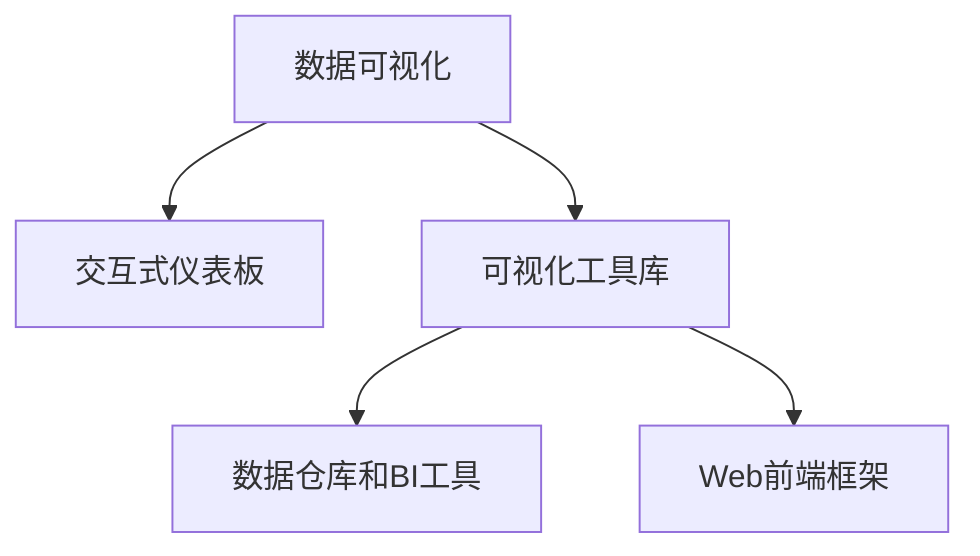

                 

# 数据可视化技术：从图表到交互式仪表板

## 1. 背景介绍

### 1.1 问题由来
在现代信息社会，数据是决策的基础。然而，海量的原始数据往往难以直接用于决策支持，需要通过数据可视化手段将其转化为可视的图表和仪表板。数据可视化不仅仅是美观，更是信息的传递和洞察的关键。

无论是企业数据分析、科学研究、新闻报道还是日常社交，数据可视化都扮演着不可或缺的角色。然而，数据可视化不仅仅是将数据转化为图表，而是要通过图表深入揭示数据的本质，进行有效的信息传递和决策支持。

当前，数据可视化技术已经从简单的图表展示发展到了复杂的交互式仪表板，帮助用户通过直观的界面，快速理解数据，进行决策和分析。交互式仪表板不仅仅是图表的堆砌，更是数据的深度分析和交互式的应用场景。

### 1.2 问题核心关键点
数据可视化的核心在于将数据以图形化形式展示，并通过交互设计提升用户体验和分析效率。交互式仪表板则进一步提升了用户与数据之间的互动，让数据驱动决策更加直观和高效。

- **静态图表与交互式仪表板**：静态图表是将数据以图片形式展示，提供给用户直观的视觉感受；交互式仪表板则通过添加交互功能，让用户能够动态地调整参数，查看数据的动态变化。
- **用户参与与分析效率**：交互式仪表板使得用户能够通过拖放、缩放、筛选等方式参与到数据分析中，提升分析效率。
- **数据驱动决策**：交互式仪表板通过提供多维度的数据展示和分析，帮助用户发现数据中的关键洞察，支持更加科学和精确的决策。

## 2. 核心概念与联系

### 2.1 核心概念概述

为更好地理解数据可视化和交互式仪表板的技术基础，本节将介绍几个密切相关的核心概念：

- **数据可视化**：将数据以图形化的形式展现出来，帮助用户快速理解数据和发现规律。常见的数据可视化形式包括散点图、柱状图、饼图、地图等。
- **交互式仪表板**：通过添加交互元素，如滑块、按钮、弹出框等，使用户能够动态调整参数，查看数据的动态变化，提升分析效率。
- **可视化工具库**：如D3.js、Highcharts、ECharts等，提供丰富的可视化组件和API，方便开发者快速构建可视化界面。
- **数据仓库和BI工具**：如Apache Hive、Apache HBase、Tableau等，提供数据存储和展示的解决方案，支持大容量数据的可视化分析。
- **Web前端框架**：如React、Vue、Angular等，提供交互式界面开发的基础，支持数据可视化的动态展示和用户互动。

这些核心概念之间的逻辑关系可以通过以下Mermaid流程图来展示：



这个流程图展示了大数据可视化及其应用场景的核心概念关系：

1. 数据可视化提供直观的数据展示，是交互式仪表板的基础。
2. 交互式仪表板通过添加交互功能，提升数据分析效率。
3. 可视化工具库提供丰富的组件，支持数据可视化展示。
4. 数据仓库和BI工具提供数据存储和展示解决方案，支撑大规模数据可视化。
5. Web前端框架提供交互界面开发的工具，实现动态展示和用户互动。

## 3. 核心算法原理 & 具体操作步骤
### 3.1 算法原理概述

数据可视化和交互式仪表板的核心原理是将复杂的数据通过图形化的形式展示给用户，并通过交互设计提升用户的分析效率。其核心算法包括以下几个方面：

1. **数据预处理**：对原始数据进行清洗、转换和聚合，使其适合可视化展示。
2. **可视化组件选择**：根据数据的类型和展示需求，选择合适的可视化组件（如散点图、柱状图、饼图、地图等）。
3. **数据展示和交互设计**：通过选择合适的布局、颜色、动画等效果，提升数据的可视化效果，并通过交互设计（如滑块、按钮、拖放等）提升用户体验。
4. **响应式设计**：使得可视化界面在不同设备（如PC、平板、手机）上都能正常显示和交互。

### 3.2 算法步骤详解

以下是数据可视化和交互式仪表板的一般实现步骤：

**Step 1: 数据准备与预处理**
- 收集原始数据，进行清洗和转换。
- 对数据进行聚合和汇总，简化数据展示。
- 根据数据类型选择合适的可视化组件。

**Step 2: 可视化组件配置**
- 选择合适的可视化组件（如ECharts、Highcharts等）。
- 配置组件的样式、布局和交互效果。
- 添加数据源，进行数据绑定。

**Step 3: 数据展示与交互**
- 在Web界面展示可视化图表。
- 添加交互元素（如滑块、按钮、弹出框等）。
- 实现数据的动态展示和用户交互。

**Step 4: 响应式设计**
- 根据不同设备的屏幕尺寸和分辨率，调整界面布局和元素大小。
- 添加响应式效果（如自适应布局、触摸事件等）。

**Step 5: 测试与优化**
- 在实际应用中测试交互式仪表板的功能和性能。
- 根据测试结果进行优化调整。
- 发布优化后的仪表板。

### 3.3 算法优缺点

数据可视化和交互式仪表板技术具有以下优点：
1. 提升数据分析效率：通过可视化展示和交互设计，帮助用户快速理解和分析数据。
2. 增强数据驱动决策：通过多维度的数据展示和分析，帮助用户发现数据中的关键洞察，支持更加科学和精确的决策。
3. 提升用户体验：交互式设计使得用户能够参与到数据分析中，提升用户体验。

同时，该技术也存在一定的局限性：
1. 对数据质量要求高：数据可视化的效果取决于数据的质量和准确性，数据清洗和转换过程较为复杂。
2. 交互设计难度大：交互式仪表板需要精心设计交互元素和交互逻辑，提升交互效果和用户体验。
3. 性能消耗大：复杂的交互效果和动态展示会消耗大量计算资源，可能影响页面加载速度。
4. 可视化组件依赖：选择合适的可视化组件对可视化效果有很大影响，不同的组件支持不同的数据类型和展示需求。

尽管存在这些局限性，但数据可视化和交互式仪表板技术仍是大数据应用的重要手段。未来相关研究的重点在于如何进一步提升数据可视化效率，降低数据处理难度，同时兼顾交互效果和用户体验，提高可视化界面的性能。

### 3.4 算法应用领域

数据可视化和交互式仪表板技术在各个领域得到了广泛的应用，例如：

- **企业数据分析**：通过可视化仪表板，帮助企业快速了解业务运营情况，发现问题和优化方向。
- **科学研究**：通过科学可视化，展示复杂的实验数据和模型结果，帮助科研人员发现新规律。
- **新闻报道**：通过数据新闻可视化，向公众传达复杂的统计信息，提升新闻报道的吸引力。
- **商业智能(BI)**：通过BI工具提供的交互式仪表板，帮助商业分析师进行决策支持。
- **城市治理**：通过地图和监控数据可视化，帮助城市管理者和居民进行实时监控和问题排查。
- **社交媒体**：通过社交媒体数据的可视化，帮助用户了解社交热点和用户行为。

这些领域的应用展示了数据可视化和交互式仪表板技术的广泛性和重要性。随着技术的发展和应用场景的拓展，相信数据可视化和交互式仪表板技术将进一步深入各个行业，为数据驱动决策提供更为直观和高效的支持。

## 4. 数学模型和公式 & 详细讲解  
### 4.1 数学模型构建

本节将使用数学语言对数据可视化和交互式仪表板的过程进行更加严格的刻画。

假设我们有一个数据集 $D=\{(x_i,y_i)\}_{i=1}^N$，其中 $x_i$ 为输入特征，$y_i$ 为输出标签。目标是通过可视化展示和交互设计，使得用户能够快速理解数据和进行决策支持。

定义一个二维可视化图表的函数 $f(x,y)$，其中 $x$ 为输入特征，$y$ 为输出标签。在二维平面上，通过不同的点 $(x,y)$，构建散点图等可视化组件。

通过选择合适的坐标轴、颜色、大小等视觉元素，可以展示数据的分布和趋势。例如，使用散点图展示不同类别数据的分布，使用柱状图展示不同维度的数据对比等。

### 4.2 公式推导过程

以下我们以散点图为例，推导数据可视化展示的数学模型。

假设我们有一个二维数据集 $D=\{(x_i,y_i)\}_{i=1}^N$，其中 $x_i,y_i \in \mathbb{R}$。我们将数据点 $(x_i,y_i)$ 在二维平面上展示，通过点的位置和颜色等视觉元素，展示数据的分布和趋势。

散点图的展示可以通过以下数学模型来实现：

$$
f(x,y) = \begin{cases}
0 & \text{如果} \ (x,y) \notin D \\
1 & \text{如果} \ (x,y) \in D \\
\end{cases}
$$

其中，函数 $f(x,y)$ 为散点图中每个数据点 $(x,y)$ 的展示状态，$D$ 为数据集。

通过调整颜色、大小等视觉元素，可以进一步丰富散点图的展示效果，例如：
- 使用不同颜色表示不同类别。
- 使用不同大小表示不同重要性。
- 使用颜色深浅表示数据密度。

在实际应用中，我们通常使用数据可视化工具库（如ECharts、Highcharts等）来构建散点图等可视化组件，而无需手动编写代码。这些工具库提供了丰富的可视化组件和API，方便开发者快速构建可视化界面。

### 4.3 案例分析与讲解

以下我们以销售数据分析为例，展示如何构建交互式仪表板。

假设我们有一个销售数据集 $D=\{(x_i,y_i)\}_{i=1}^N$，其中 $x_i$ 为销售日期，$y_i$ 为销售额。目标是通过可视化展示和交互设计，帮助销售经理快速了解销售趋势和分析销售额变化。

**Step 1: 数据准备与预处理**
- 收集销售数据，清洗和转换数据格式。
- 对数据进行聚合和汇总，计算每天的销售额和增长率。
- 将数据转换为适合可视化展示的格式，如散点图、柱状图等。

**Step 2: 可视化组件配置**
- 选择合适的可视化组件（如ECharts、Highcharts等）。
- 配置组件的样式、布局和交互效果。
- 添加数据源，进行数据绑定。

**Step 3: 数据展示与交互**
- 在Web界面展示可视化图表。
- 添加交互元素（如滑块、按钮、弹出框等）。
- 实现数据的动态展示和用户交互。

例如，我们可以添加一个日期范围滑块，让用户可以选择特定日期范围，展示该时间段的销售趋势。同时，添加一个销售额增长率的图表，让用户可以直观地看到每天的销售额变化。

通过这种交互式设计，销售经理可以快速查看不同时间段的销售数据，分析销售额变化趋势，发现销售问题并进行优化。

## 5. 项目实践：代码实例和详细解释说明
### 5.1 开发环境搭建

在进行数据可视化和交互式仪表板实践前，我们需要准备好开发环境。以下是使用JavaScript和ECharts进行交互式仪表板开发的环境配置流程：

1. 安装Node.js：从官网下载并安装Node.js，用于JavaScript的开发和运行。

2. 安装NPM：从官网下载并安装NPM（Node Package Manager），用于JavaScript库和框架的管理。

3. 安装ECharts：通过npm安装ECharts库：
```bash
npm install echarts --save
```

4. 创建项目文件夹，并初始化NPM包：
```bash
mkdir project
cd project
npm init -y
```

5. 编写HTML文件，引入ECharts库：
```html
<!DOCTYPE html>
<html lang="en">
<head>
    <meta charset="UTF-8">
    <title>交互式仪表板</title>
    <script src="https://cdn.jsdelivr.net/npm/echarts/dist/echarts.min.js"></script>
</head>
<body>
    <div id="chart-container"></div>
    <script src="index.js"></script>
</body>
</html>
```

6. 编写JavaScript文件，配置ECharts组件：
```javascript
// index.js
// 引入ECharts库
import echarts from 'echarts/lib/echarts';

// 创建图表容器
const container = document.getElementById('chart-container');

// 创建图表实例
const chart = echarts.init(container);

// 配置散点图数据
const data = [
    { name: '产品A', sales: 100, date: '2021-01-01' },
    { name: '产品B', sales: 200, date: '2021-01-02' },
    { name: '产品C', sales: 150, date: '2021-01-03' },
    // 添加更多数据点
];

// 配置散点图参数
const option = {
    title: {
        text: '产品销售额趋势'
    },
    tooltip: {},
    visualMap: {
        min: 0,
        max: 500,
        left: 'left',
        top: 'bottom'
    },
    series: [{
        type: 'scatter',
        data: data,
        symbol: 'circle',
        symbolSize: 5
    }]
};

// 渲染散点图
chart.setOption(option);
```

完成上述步骤后，即可在项目文件夹中启动交互式仪表板。

### 5.2 源代码详细实现

这里我们以销售数据分析为例，展示如何构建交互式仪表板。

首先，定义数据处理函数：

```javascript
function loadSalesData() {
    // 从API获取销售数据
    fetch('https://api.example.com/sales')
        .then(response => response.json())
        .then(data => {
            // 对数据进行处理和聚合
            const salesData = data.map(item => {
                const { date, sales } = item;
                return { name: date, sales: parseInt(sales) };
            });
            
            // 对数据进行排序
            salesData.sort((a, b) => a.name.localeCompare(b.name));
            
            // 返回处理后的数据
            return salesData;
        })
        .catch(error => console.error(error));
}
```

然后，定义可视化组件：

```javascript
function renderSalesScatter() {
    // 获取处理后的销售数据
    const salesData = loadSalesData();
    
    // 创建ECharts实例
    const container = document.getElementById('chart-container');
    const chart = echarts.init(container);
    
    // 配置散点图参数
    const option = {
        title: {
            text: '产品销售额趋势'
        },
        tooltip: {},
        visualMap: {
            min: 0,
            max: 500,
            left: 'left',
            top: 'bottom'
        },
        series: [{
            type: 'scatter',
            data: salesData,
            symbol: 'circle',
            symbolSize: 5
        }]
    };
    
    // 渲染散点图
    chart.setOption(option);
}
```

接着，定义交互功能：

```javascript
function setDateRange(startDate, endDate) {
    // 获取处理后的销售数据
    const salesData = loadSalesData();
    
    // 根据日期范围筛选数据
    const filteredData = salesData.filter(item => {
        const date = new Date(item.name);
        return date >= new Date(startDate) && date <= new Date(endDate);
    });
    
    // 更新ECharts数据
    const container = document.getElementById('chart-container');
    const chart = echarts.init(container);
    chart.setOption({
        series: [{
            data: filteredData
        }]
    });
}
```

最后，启动交互式仪表板：

```javascript
// 初始化销售散点图
renderSalesScatter();

// 添加日期范围滑块
const slider = new Slider({
    min: '2021-01-01',
    max: '2021-01-31',
    value: ['2021-01-01', '2021-01-31'],
    orient: 'horizontal',
    range: true
});
slider.on('input', function (value) {
    const [startDate, endDate] = value;
    setDateRange(startDate, endDate);
});

// 添加销售额增长率图表
const container2 = document.getElementById('chart2-container');
const chart2 = echarts.init(container2);
const growthData = salesData.map(item => {
    const { name, sales } = item;
    return { date: name, growth: (sales - previousSales) / previousSales * 100 };
});
const previousSales = 0;
const growthOption = {
    title: {
        text: '产品销售额增长率'
    },
    tooltip: {},
    visualMap: {
        min: 0,
        max: 100,
        left: 'left',
        top: 'bottom'
    },
    series: [{
        type: 'scatter',
        data: growthData,
        symbol: 'circle',
        symbolSize: 5
    }]
};
chart2.setOption(growthOption);
```

以上就是使用JavaScript和ECharts进行交互式仪表板开发的完整代码实现。可以看到，借助ECharts提供的强大可视化组件和API，开发者可以快速构建交互式仪表板，实现数据的动态展示和用户交互。

### 5.3 代码解读与分析

让我们再详细解读一下关键代码的实现细节：

**loadSalesData函数**：
- 定义了从API获取销售数据的函数，并对数据进行处理和聚合。

**renderSalesScatter函数**：
- 定义了渲染销售散点图的函数，将处理后的数据输入到ECharts中，展示产品的销售额趋势。

**setDateRange函数**：
- 定义了根据日期范围筛选数据的函数，将筛选后的数据更新到ECharts中，实现数据的动态展示。

**初始化销售散点图**：
- 定义了初始化销售散点图的函数，在Web界面中展示数据。

**添加日期范围滑块**：
- 定义了添加日期范围滑块的函数，通过用户输入的日期范围，动态筛选数据并展示。

**添加销售额增长率图表**：
- 定义了添加销售额增长率图表的函数，通过数据计算，展示产品销售额的增长率。

**代码解读**：
- **fetch函数**：用于异步获取API数据。
- **map函数**：用于对数据进行转换和映射。
- **filter函数**：用于根据条件筛选数据。
- **Date对象**：用于处理日期数据。
- **Slider组件**：用于添加日期范围滑块。
- **echarts.init函数**：用于初始化ECharts图表。
- **setOption函数**：用于设置图表参数和数据。

通过这些函数的组合，我们实现了交互式仪表板的核心功能：动态展示数据、筛选数据并展示、添加交互元素等。

## 6. 实际应用场景
### 6.1 智能仪表板在企业数据分析中的应用

企业数据分析是数据可视化技术的重要应用场景之一。通过构建智能仪表板，企业可以快速了解业务运营情况，发现问题和优化方向。

例如，在销售数据分析中，通过可视化展示和交互设计，销售经理可以快速查看不同时间段的销售数据，分析销售额变化趋势，发现销售问题并进行优化。

在供应链管理中，通过可视化展示和交互设计，物流经理可以快速了解订单状态、物流路线等信息，发现物流问题并进行优化。

在财务分析中，通过可视化展示和交互设计，财务分析师可以快速查看财务报表、预算数据等信息，发现财务问题并进行优化。

### 6.2 智能仪表板在科学研究中的应用

科学研究也需要大量的数据可视化支持。通过构建智能仪表板，科研人员可以展示复杂的实验数据和模型结果，帮助其他科研人员理解研究进展。

例如，在天文学研究中，通过可视化展示和交互设计，天文学家可以展示天文望远镜拍摄的天体图像、光谱数据等信息，发现新的天体和现象。

在生物医学研究中，通过可视化展示和交互设计，生物医学研究人员可以展示基因数据、蛋白数据等信息，发现新的基因和蛋白质。

在气象研究中，通过可视化展示和交互设计，气象学家可以展示气象数据、卫星图像等信息，发现新的气象现象和规律。

### 6.3 智能仪表板在新闻报道中的应用

新闻报道也需要大量的数据可视化支持。通过构建智能仪表板，新闻编辑可以展示复杂的数据和统计信息，吸引受众的注意力。

例如，在疫情报告中，通过可视化展示和交互设计，新闻编辑可以展示疫情数据、病例分布等信息，向公众传达复杂的统计信息。

在选举报告中，通过可视化展示和交互设计，新闻编辑可以展示选举数据、投票结果等信息，向公众传达选举动态。

在体育新闻中，通过可视化展示和交互设计，新闻编辑可以展示比赛数据、球队排名等信息，吸引受众的关注。

### 6.4 智能仪表板在城市治理中的应用

城市治理也需要大量的数据可视化支持。通过构建智能仪表板，城市管理者可以实时监控和问题排查，提升城市管理水平。

例如，在交通管理中，通过可视化展示和交互设计，交通管理部门可以展示交通流量、事故数据等信息，发现交通问题并进行优化。

在环境监测中，通过可视化展示和交互设计，环境监测部门可以展示空气质量、水质数据等信息，发现环境问题并进行优化。

在应急管理中，通过可视化展示和交互设计，应急管理部门可以展示警情数据、灾害数据等信息，发现应急问题并进行优化。

### 6.5 智能仪表板在社交媒体中的应用

社交媒体也需要大量的数据可视化支持。通过构建智能仪表板，社交媒体平台可以展示用户行为、互动数据等信息，提升用户体验。

例如，在社交媒体分析中，通过可视化展示和交互设计，社交媒体平台可以展示用户关注、互动数据等信息，发现用户兴趣并进行个性化推荐。

在舆情分析中，通过可视化展示和交互设计，社交媒体平台可以展示舆情数据、热门话题等信息，发现舆情变化并进行实时监控。

在用户行为分析中，通过可视化展示和交互设计，社交媒体平台可以展示用户行为数据、趋势等信息，发现用户行为变化并进行优化。

## 7. 工具和资源推荐
### 7.1 学习资源推荐

为了帮助开发者系统掌握数据可视化和交互式仪表板的技术基础，这里推荐一些优质的学习资源：

1. **《JavaScript数据可视化实战》**：介绍如何使用JavaScript和ECharts进行数据可视化开发，涵盖从静态图表到交互式仪表板的各个方面。

2. **《D3.js数据可视化教程》**：介绍如何使用D3.js进行数据可视化开发，涵盖从数据处理到可视化展示的各个环节。

3. **《Python数据可视化教程》**：介绍如何使用Python进行数据可视化开发，涵盖从数据处理到可视化展示的各个环节。

4. **Coursera《数据可视化》课程**：由Coursera开设的数据可视化课程，涵盖数据可视化基础、工具和应用等多个方面，适合初学者和进阶开发者。

5. **Kaggle《数据可视化竞赛》**：在Kaggle平台上进行的数据可视化竞赛，通过实际数据集进行可视化展示和交互设计，积累实战经验。

通过对这些资源的学习实践，相信你一定能够快速掌握数据可视化和交互式仪表板的精髓，并用于解决实际的NLP问题。

### 7.2 开发工具推荐

高效的开发离不开优秀的工具支持。以下是几款用于数据可视化和交互式仪表板开发的常用工具：

1. **ECharts**：百度开源的JavaScript可视化库，提供丰富的可视化组件和API，方便开发者快速构建可视化界面。

2. **D3.js**：Google开发的JavaScript可视化库，提供了强大的数据可视化功能，支持复杂的数据展示和交互设计。

3. **Highcharts**：Johan Holmberg开发的JavaScript可视化库，提供丰富的图表类型和交互功能，支持多种平台和设备。

4. **Tableau**：Tableau Software提供的商业BI工具，支持大容量数据的可视化展示和分析，适合企业级应用。

5. **Power BI**：微软提供的商业BI工具，支持多数据源的可视化展示和分析，适合企业级应用。

6. **Google Charts**：Google提供的JavaScript可视化库，支持多种图表类型和交互功能，适合Web应用。

合理利用这些工具，可以显著提升数据可视化和交互式仪表板开发的效率，加快创新迭代的步伐。

### 7.3 相关论文推荐

数据可视化和交互式仪表板技术的发展源于学界的持续研究。以下是几篇奠基性的相关论文，推荐阅读：

1. **《信息可视化：原理与技术》**：介绍信息可视化的基本原理和应用技术，涵盖从静态图表到交互式仪表板的各个方面。

2. **《数据驱动的可视化分析》**：介绍如何使用可视化技术进行数据驱动的分析和决策支持，涵盖从数据准备到可视化展示的各个环节。

3. **《交互式数据可视化》**：介绍交互式数据可视化的基本原理和应用技术，涵盖从数据准备到交互设计的各个方面。

4. **《多维数据可视化技术》**：介绍多维数据可视化的基本原理和应用技术，涵盖从数据准备到可视化展示的各个环节。

5. **《实时数据可视化系统》**：介绍实时数据可视化的基本原理和应用技术，涵盖从数据采集到可视化展示的各个环节。

这些论文代表了大数据可视化技术的发展脉络。通过学习这些前沿成果，可以帮助研究者把握学科前进方向，激发更多的创新灵感。

## 8. 总结：未来发展趋势与挑战

### 8.1 总结

本文对数据可视化和交互式仪表板技术进行了全面系统的介绍。首先阐述了数据可视化和交互式仪表板的研究背景和意义，明确了数据可视化在信息展示和决策支持中的重要作用。其次，从原理到实践，详细讲解了数据可视化的数学原理和关键步骤，给出了数据可视化和交互式仪表板开发的完整代码实例。同时，本文还广泛探讨了数据可视化技术在企业分析、科学研究、新闻报道、城市治理等领域的广泛应用，展示了数据可视化技术的巨大潜力和应用前景。最后，本文精选了数据可视化技术的各类学习资源，力求为读者提供全方位的技术指引。

通过本文的系统梳理，可以看到，数据可视化和交互式仪表板技术正在成为数据驱动决策的重要手段，极大地拓展了数据展示和分析的边界，催生了更多的落地场景。随着数据量的不断增长和技术的不断演进，相信数据可视化和交互式仪表板技术将进一步深入各个行业，为数据驱动决策提供更为直观和高效的支持。

### 8.2 未来发展趋势

展望未来，数据可视化和交互式仪表板技术将呈现以下几个发展趋势：

1. **实时数据可视化**：实时数据可视化技术将成为趋势，支持数据流的动态展示和实时分析，提升决策的实时性和准确性。

2. **多模态数据可视化**：多模态数据可视化技术将成为趋势，支持视觉、听觉、触觉等多维数据展示，提升用户体验和分析效果。

3. **交互式数据可视化**：交互式数据可视化技术将成为趋势，支持用户通过拖拽、滑块、按钮等方式，参与到数据分析中，提升分析效率。

4. **智能数据可视化**：智能数据可视化技术将成为趋势，支持数据自动分析和可视化展示，提升分析效率和决策支持能力。

5. **移动端数据可视化**：移动端数据可视化技术将成为趋势，支持在移动设备上展示和分析数据，提升用户便捷性和体验。

6. **云计算数据可视化**：云计算数据可视化技术将成为趋势，支持大规模数据的实时展示和分析，提升数据驱动决策的能力。

这些趋势凸显了数据可视化和交互式仪表板技术的广阔前景。随着技术的不断发展，相信数据可视化和交互式仪表板技术将进一步深入各个行业，为数据驱动决策提供更为直观和高效的支持。

### 8.3 面临的挑战

尽管数据可视化和交互式仪表板技术已经取得了瞩目成就，但在迈向更加智能化、普适化应用的过程中，它仍面临着诸多挑战：

1. **数据处理复杂度**：数据可视化的效果取决于数据的质量和准确性，数据清洗和转换过程较为复杂，需要大量时间和人力投入。

2. **交互设计难度大**：交互式仪表板需要精心设计交互元素和交互逻辑，提升交互效果和用户体验，设计难度较大。

3. **技术门槛高**：数据可视化和交互式仪表板技术涉及多种技术，包括JavaScript、可视化库、数据处理等，技术门槛较高。

4. **用户体验差异大**：不同设备的用户体验差异较大，需要针对不同设备进行适配和优化。

5. **数据安全问题**：数据可视化涉及数据的展示和共享，需要考虑数据安全问题，防止数据泄露和滥用。

6. **性能消耗大**：复杂的交互效果和动态展示会消耗大量计算资源，可能影响页面加载速度和用户体验。

尽管存在这些挑战，但数据可视化和交互式仪表板技术仍是大数据应用的重要手段。未来相关研究的重点在于如何进一步提升数据可视化效率，降低数据处理难度，同时兼顾交互效果和用户体验，提高可视化界面的性能。

### 8.4 研究展望

面对数据可视化和交互式仪表板所面临的挑战，未来的研究需要在以下几个方面寻求新的突破：

1. **提升数据可视化效率**：开发更加高效的数据处理和可视化算法，减少数据清洗和转换的时间，提高数据可视化的效率。

2. **降低交互设计难度**：开发更加易用的交互设计工具和框架，简化交互元素的配置和交互逻辑的设计。

3. **提升技术门槛**：开发更加易学的数据可视化工具和教程，降低技术门槛，普及数据可视化的技术应用。

4. **提升用户体验**：开发更加友好的用户界面和交互方式，提升用户体验和分析效率。

5. **加强数据安全保护**：开发数据加密和安全传输技术，确保数据安全，防止数据泄露和滥用。

6. **优化性能消耗**：开发更加高效的交互效果和动态展示技术，减少计算资源的消耗，提升用户体验。

这些研究方向的探索，必将引领数据可视化和交互式仪表板技术迈向更高的台阶，为数据驱动决策提供更为直观和高效的支持。面向未来，数据可视化和交互式仪表板技术还需要与其他人工智能技术进行更深入的融合，如自然语言处理、知识表示等，多路径协同发力，共同推动数据驱动决策系统的进步。

## 9. 附录：常见问题与解答

**Q1：数据可视化技术如何提升数据分析效率？**

A: 数据可视化技术通过将复杂的数据以图形化的形式展示，使用户能够快速理解数据和发现规律。例如，通过柱状图展示不同类别的数据对比，用户可以直观地看出哪些类别数据多，哪些类别数据少。通过散点图展示数据的分布趋势，用户可以发现数据的集中和离散情况。

**Q2：交互式仪表板如何提升数据分析效率？**

A: 交互式仪表板通过添加交互元素，如滑块、按钮、弹出框等，使用户能够动态调整参数，查看数据的动态变化。例如，通过滑动时间范围滑块，用户可以查看不同时间段的销售数据，发现销售趋势。通过添加筛选条件，用户可以按照特定条件筛选数据，快速发现数据分析的重点。

**Q3：数据可视化技术在企业数据分析中如何应用？**

A: 数据可视化技术在企业数据分析中应用广泛。例如，通过可视化仪表板，销售经理可以快速查看不同时间段的销售数据，发现销售趋势。通过可视化仪表板，物流经理可以查看订单状态、物流路线等信息，发现物流问题并进行优化。通过可视化仪表板，财务分析师可以查看财务报表、预算数据等信息，发现财务问题并进行优化。

**Q4：数据可视化技术在科学研究中如何应用？**

A: 数据可视化技术在科学研究中应用广泛。例如，在天文学研究中，天文学家可以展示天文望远镜拍摄的天体图像、光谱数据等信息，发现新的天体和现象。在生物医学研究中，生物医学研究人员可以展示基因数据、蛋白数据等信息，发现新的基因和蛋白质。在气象研究中，气象学家可以展示气象数据、卫星图像等信息，发现新的气象现象和规律。

**Q5：数据可视化技术在新闻报道中如何应用？**

A: 数据可视化技术在新闻报道中应用广泛。例如，在疫情报告中，新闻编辑可以展示疫情数据、病例分布等信息，向公众传达复杂的统计信息。在选举报告中，新闻编辑可以展示选举数据、投票结果等信息，向公众传达选举动态。在体育新闻中，新闻编辑可以展示比赛数据、球队排名等信息，吸引受众的关注。

**Q6：数据可视化技术在城市治理中如何应用？**

A: 数据可视化技术在城市治理中应用广泛。例如，在交通管理中，交通管理部门可以展示交通流量、事故数据等信息，发现交通问题并进行优化。在环境监测中，环境监测部门可以展示空气质量、水质数据等信息，发现环境问题并进行优化。在应急管理中，应急管理部门可以展示警情数据、灾害数据等信息，发现应急问题并进行优化。

**Q7：数据可视化技术在社交媒体中如何应用？**

A: 数据可视化技术在社交媒体中应用广泛。例如，在社交媒体分析中，社交媒体平台可以展示用户关注、互动数据等信息，发现用户兴趣并进行个性化推荐。在舆情分析中，社交媒体平台可以展示舆情数据、热门话题等信息，发现舆情变化并进行实时监控。在用户行为分析中，社交媒体平台可以展示用户行为数据、趋势等信息，发现用户行为变化并进行优化。

---

作者：禅与计算机程序设计艺术 / Zen and the Art of Computer Programming

