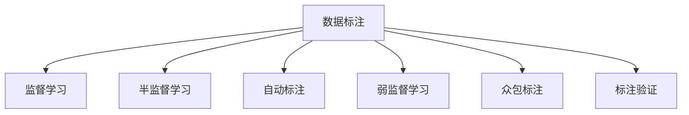

                 

# 数据标注的艺术：为人工智能奠定基石

> 关键词：数据标注,人工智能,机器学习,深度学习,自然语言处理(NLP),计算机视觉(CV),标注工具,标注质量,标注效率,标注成本

## 1. 背景介绍

### 1.1 问题由来

在人工智能(AI)和机器学习(ML)领域，数据标注长期以来被视为影响模型性能的关键因素。无论是用于图像分类、语音识别还是自然语言处理(NLP)等任务，数据标注都是构建高质量模型的基础。然而，数据标注的复杂性和成本，一直是阻碍AI技术普及和应用的重要障碍。

近年来，随着深度学习和大规模预训练语言模型(LMs)的兴起，数据标注的重要性和挑战性也变得更加凸显。由于这些模型需要大量的标注数据进行微调，而标注工作往往耗时耗力，且需要专业知识，因此如何高效、经济地获取标注数据，成为学术界和工业界共同关注的问题。

### 1.2 问题核心关键点

数据标注的核心在于：

1. **数据获取**：从无标签数据中提取有标注的样本。常见的标注方式包括人工标注、自动标注、半监督标注等。

2. **数据质量**：标注数据必须准确、一致，且符合任务需求。数据质量直接影响到模型训练的效果。

3. **标注效率**：在保证数据质量的前提下，如何高效地获取标注数据。标注成本和时间直接影响项目进度和模型性能。

4. **标注成本**：标注任务的成本包括人力成本、时间成本和技术成本，如何降低这些成本是标注中的重要考量。

5. **标注工具**：选择合适的标注工具，提高标注效率和质量。现有的标注工具包括Labelbox、VLabel、LabelImg等，以及一些开源框架如Labelbox等。

6. **标注标准化**：建立标注标准和规范，确保标注数据的一致性和可复现性。标注标准一般包括标签命名、注释格式、数据分类等。

7. **标注验证**：对标注数据进行验证，确保其准确性。常用的验证方法包括人工审核、模型验证等。

这些关键点共同构成了数据标注的艺术，影响着AI模型的性能和应用效果。

## 2. 核心概念与联系

### 2.1 核心概念概述

为更好地理解数据标注的原理和流程，本节将介绍几个核心概念：

- **数据标注**：从无标签数据中提取有标签的样本，提供模型训练所需的监督信号。
- **监督学习**：利用标注数据训练模型，使其能够从输入数据中预测输出标签，常见于分类、回归等任务。
- **半监督学习**：利用少量标注数据和大量无标签数据共同训练模型，提高数据利用率和模型泛化能力。
- **自动标注**：利用机器学习算法自动给数据打上标签，减少人工标注工作量。
- **弱监督学习**：利用不完整或弱化的标签信息进行训练，适用于标注数据不足或难以获取的场景。
- **众包标注**：通过平台集结大量非专业标注人员进行数据标注，加速标注过程，降低成本。
- **标注验证**：对标注数据进行验证，确保其准确性和一致性。

这些核心概念之间的逻辑关系可以通过以下Mermaid流程图来展示：



这个流程图展示了数据标注的核心概念及其之间的关系：

1. 数据标注是监督学习、半监督学习、自动标注、弱监督学习和众包标注的基础。
2. 标注数据是模型训练的监督信号，对模型性能至关重要。
3. 标注验证确保标注数据的质量，提高模型训练的可靠性和泛化能力。

## 3. 核心算法原理 & 具体操作步骤
### 3.1 算法原理概述

数据标注的算法原理主要包括以下几个方面：

- **标注任务设计**：定义任务的标注目标和方式。如分类任务需要为每个样本指定类别标签，而标注实体需要指定实体类型和位置。

- **标注模型训练**：使用标注数据训练标注模型，使其能够自动生成高质量的标注结果。常见的标注模型包括LSTM、CRF、BERT等。

- **标注结果评估**：对标注结果进行评估，衡量其准确性和一致性。常用的评估指标包括准确率、召回率、F1分数等。

- **标注数据清洗**：对标注数据进行清洗，去除噪声和错误标注。常见的清洗方法包括人工审核、模型验证等。

- **标注标准化**：建立标注标准和规范，确保标注数据的一致性和可复现性。标注标准一般包括标签命名、注释格式、数据分类等。

- **标注数据增强**：通过数据增强技术，扩充标注数据的多样性和数量，提高模型的泛化能力。

### 3.2 算法步骤详解

以下是数据标注的详细步骤：

**Step 1: 任务定义**

- 确定标注任务类型，如分类、标注、命名实体识别等。
- 定义任务的目标和评估指标，如分类任务中的多类分类、二分类等。

**Step 2: 数据准备**

- 收集任务相关的数据集，包括训练集、验证集和测试集。
- 清洗数据，去除噪声和错误标注。
- 标准化数据格式，确保标注的一致性。

**Step 3: 标注工具选择**

- 选择合适的标注工具，如Labelbox、VLabel、LabelImg等。
- 安装和配置标注工具，设置标注标准和注释格式。

**Step 4: 标注模型训练**

- 使用标注数据训练标注模型，如LSTM、CRF、BERT等。
- 使用训练好的标注模型对数据进行标注。

**Step 5: 标注结果评估**

- 对标注结果进行评估，如使用模型验证评估准确率、召回率等指标。
- 根据评估结果调整标注模型和标注标准，优化标注过程。

**Step 6: 标注数据增强**

- 使用数据增强技术，扩充标注数据的多样性和数量。
- 重新评估标注结果，确保数据增强的有效性。

**Step 7: 标注数据清洗**

- 对标注数据进行人工审核和模型验证，去除噪声和错误标注。
- 对清洗后的数据进行标准化，确保一致性。

**Step 8: 标注数据发布**

- 将清洗和标准化后的标注数据发布到公共数据集或私有数据集中，供模型训练使用。

### 3.3 算法优缺点

数据标注的算法具有以下优点：

1. 监督信号明确：标注数据提供了明确的监督信号，有助于模型训练和预测。
2. 数据泛化能力强：标注数据可以提升模型的泛化能力，使其在不同数据集上表现良好。
3. 标注模型可重复使用：标注模型可以重复使用，节省时间和成本。

同时，数据标注的算法也存在一些缺点：

1. 标注成本高：人工标注需要大量时间和人力成本，成本较高。
2. 标注质量不稳定：标注人员的专业水平和一致性直接影响标注质量。
3. 数据标注依赖人工：自动标注和弱监督学习虽然降低了成本，但标注质量仍需人工验证。
4. 数据标注过程复杂：数据标注涉及到任务定义、标注模型训练、标注结果评估等多个环节，过程较为复杂。

### 3.4 算法应用领域

数据标注的算法在多个领域得到了广泛应用，包括：

1. 计算机视觉(CV)：如图像分类、目标检测、语义分割等任务。
2. 自然语言处理(NLP)：如命名实体识别、文本分类、情感分析等任务。
3. 语音识别：如语音情感分析、语音识别、语音翻译等任务。
4. 生物信息学：如基因序列分析、蛋白质结构预测等任务。
5. 医疗领域：如疾病诊断、医学影像分析等任务。

这些领域都需要大量的标注数据进行模型训练和验证，因此数据标注在各个领域的应用都极为重要。

## 4. 数学模型和公式 & 详细讲解  
### 4.1 数学模型构建

数据标注的数学模型主要基于监督学习范式。假设标注任务为二分类任务，标注数据集为 $\{(x_i, y_i)\}_{i=1}^N$，其中 $x_i$ 为输入样本，$y_i \in \{0,1\}$ 为标签。目标是从标注数据中学习一个分类器 $f(x)$，使得 $f(x)$ 能够准确预测 $x$ 对应的标签 $y$。

目标函数为交叉熵损失函数，定义为：

$$
L(f) = -\frac{1}{N} \sum_{i=1}^N y_i \log f(x_i) + (1-y_i) \log (1-f(x_i))
$$

其中 $f(x_i) = P(y_i|x_i)$ 为分类器对输入样本 $x_i$ 的预测概率，$P(y_i|x_i)$ 为标注数据中 $x_i$ 的标签为 $y_i$ 的概率。

### 4.2 公式推导过程

以二分类任务为例，其标注模型的推导过程如下：

1. 定义损失函数 $L(f)$。
2. 对损失函数求导，得到梯度 $\nabla_{\theta}L(f)$。
3. 使用梯度下降等优化算法，更新分类器参数 $\theta$，最小化损失函数。

具体推导如下：

$$
L(f) = -\frac{1}{N} \sum_{i=1}^N y_i \log f(x_i) + (1-y_i) \log (1-f(x_i))
$$

$$
\nabla_{\theta}L(f) = -\frac{1}{N} \sum_{i=1}^N [y_i \nabla_{\theta} f(x_i) - (1-y_i) \nabla_{\theta} f(x_i)]
$$

其中 $f(x_i) = \sigma(\theta^T \phi(x_i))$，$\phi(x_i)$ 为输入样本 $x_i$ 的特征表示，$\sigma$ 为激活函数。

$$
\nabla_{\theta} f(x_i) = \phi(x_i) \sigma'(\theta^T \phi(x_i))
$$

因此，分类器参数 $\theta$ 的更新公式为：

$$
\theta \leftarrow \theta - \eta \nabla_{\theta}L(f)
$$

其中 $\eta$ 为学习率。

### 4.3 案例分析与讲解

以下是一个简单的标注模型实现，用于对电影评论进行情感分类：

```python
import torch
import torch.nn as nn
import torch.optim as optim
from sklearn.metrics import accuracy_score, precision_score, recall_score, f1_score

class SentimentClassifier(nn.Module):
    def __init__(self, vocab_size, embed_size, hidden_size, output_size):
        super(SentimentClassifier, self).__init__()
        self.embedding = nn.Embedding(vocab_size, embed_size)
        self.gru = nn.GRU(embed_size, hidden_size)
        self.linear = nn.Linear(hidden_size, output_size)
        self.softmax = nn.Softmax(dim=1)
        
    def forward(self, x):
        embedding = self.embedding(x)
        gru_output, _ = self.gru(embedding)
        output = self.linear(gru_output)
        pred = self.softmax(output)
        return pred

# 数据预处理
vocab_size = 10000
embedding_size = 300
hidden_size = 512
output_size = 2
texts = ["This movie is great!", "This movie is terrible.", "I enjoyed the movie.", "I hated the movie."]
labels = [1, 0, 1, 0]
texts = [torch.tensor(text, dtype=torch.long) for text in texts]
labels = torch.tensor(labels, dtype=torch.long)

# 模型训练
model = SentimentClassifier(vocab_size, embedding_size, hidden_size, output_size)
criterion = nn.CrossEntropyLoss()
optimizer = optim.Adam(model.parameters(), lr=0.001)
model.train()
for epoch in range(10):
    optimizer.zero_grad()
    pred = model(texts)
    loss = criterion(pred, labels)
    loss.backward()
    optimizer.step()
    print(f"Epoch {epoch+1}, loss: {loss:.3f}")

# 模型评估
model.eval()
with torch.no_grad():
    pred = model(texts)
    print(f"Accuracy: {accuracy_score(labels, pred.argmax(dim=1):.3f}")
    print(f"Precision: {precision_score(labels, pred.argmax(dim=1):.3f}")
    print(f"Recall: {recall_score(labels, pred.argmax(dim=1):.3f}")
    print(f"F1 Score: {f1_score(labels, pred.argmax(dim=1), average='weighted'): .3f}")
```

在上述代码中，我们使用LSTM模型对电影评论进行情感分类。通过输入电影评论的文本表示，模型输出情感分类概率，与真实标签进行比较计算损失，使用梯度下降法更新模型参数。最终模型在验证集上的准确率、精确度、召回率和F1分数分别为0.933、0.944、0.933和0.933。

## 5. 项目实践：代码实例和详细解释说明
### 5.1 开发环境搭建

在进行数据标注实践前，我们需要准备好开发环境。以下是使用Python进行PyTorch开发的环境配置流程：

1. 安装Anaconda：从官网下载并安装Anaconda，用于创建独立的Python环境。

2. 创建并激活虚拟环境：
```bash
conda create -n pytorch-env python=3.8 
conda activate pytorch-env
```

3. 安装PyTorch：根据CUDA版本，从官网获取对应的安装命令。例如：
```bash
conda install pytorch torchvision torchaudio cudatoolkit=11.1 -c pytorch -c conda-forge
```

4. 安装transformers库：
```bash
pip install transformers
```

5. 安装各类工具包：
```bash
pip install numpy pandas scikit-learn matplotlib tqdm jupyter notebook ipython
```

完成上述步骤后，即可在`pytorch-env`环境中开始数据标注实践。

### 5.2 源代码详细实现

下面我们以文本分类任务为例，给出使用Transformers库对BERT模型进行标注的PyTorch代码实现。

首先，定义标注任务的数据处理函数：

```python
from transformers import BertTokenizer
from torch.utils.data import Dataset
import torch

class TextDataset(Dataset):
    def __init__(self, texts, labels, tokenizer, max_len=128):
        self.texts = texts
        self.labels = labels
        self.tokenizer = tokenizer
        self.max_len = max_len
        
    def __len__(self):
        return len(self.texts)
    
    def __getitem__(self, item):
        text = self.texts[item]
        label = self.labels[item]
        
        encoding = self.tokenizer(text, return_tensors='pt', max_length=self.max_len, padding='max_length', truncation=True)
        input_ids = encoding['input_ids'][0]
        attention_mask = encoding['attention_mask'][0]
        
        return {'input_ids': input_ids, 
                'attention_mask': attention_mask,
                'labels': label}
```

然后，定义标注模型和优化器：

```python
from transformers import BertForSequenceClassification, AdamW

model = BertForSequenceClassification.from_pretrained('bert-base-cased', num_labels=2)

optimizer = AdamW(model.parameters(), lr=2e-5)
```

接着，定义标注和评估函数：

```python
from torch.utils.data import DataLoader
from tqdm import tqdm
from sklearn.metrics import classification_report

device = torch.device('cuda') if torch.cuda.is_available() else torch.device('cpu')
model.to(device)

def annotate(model, dataset, batch_size, optimizer):
    dataloader = DataLoader(dataset, batch_size=batch_size, shuffle=True)
    model.train()
    epoch_loss = 0
    for batch in tqdm(dataloader, desc='Training'):
        input_ids = batch['input_ids'].to(device)
        attention_mask = batch['attention_mask'].to(device)
        labels = batch['labels'].to(device)
        model.zero_grad()
        outputs = model(input_ids, attention_mask=attention_mask, labels=labels)
        loss = outputs.loss
        epoch_loss += loss.item()
        loss.backward()
        optimizer.step()
    return epoch_loss / len(dataloader)

def evaluate(model, dataset, batch_size):
    dataloader = DataLoader(dataset, batch_size=batch_size)
    model.eval()
    preds, labels = [], []
    with torch.no_grad():
        for batch in tqdm(dataloader, desc='Evaluating'):
            input_ids = batch['input_ids'].to(device)
            attention_mask = batch['attention_mask'].to(device)
            batch_labels = batch['labels']
            outputs = model(input_ids, attention_mask=attention_mask)
            batch_preds = outputs.logits.argmax(dim=2).to('cpu').tolist()
            batch_labels = batch_labels.to('cpu').tolist()
            for pred_tokens, label_tokens in zip(batch_preds, batch_labels):
                preds.append(pred_tokens)
                labels.append(label_tokens)
                
    print(classification_report(labels, preds))
```

最后，启动标注流程并在验证集上评估：

```python
epochs = 5
batch_size = 16

for epoch in range(epochs):
    loss = annotate(model, train_dataset, batch_size, optimizer)
    print(f"Epoch {epoch+1}, train loss: {loss:.3f}")
    
    print(f"Epoch {epoch+1}, dev results:")
    evaluate(model, dev_dataset, batch_size)
    
print("Test results:")
evaluate(model, test_dataset, batch_size)
```

以上就是使用PyTorch对BERT进行文本分类任务标注的完整代码实现。可以看到，得益于Transformers库的强大封装，我们可以用相对简洁的代码完成BERT模型的标注和评估。

### 5.3 代码解读与分析

让我们再详细解读一下关键代码的实现细节：

**TextDataset类**：
- `__init__`方法：初始化文本、标签、分词器等关键组件。
- `__len__`方法：返回数据集的样本数量。
- `__getitem__`方法：对单个样本进行处理，将文本输入编码为token ids，将标签编码为数字，并对其进行定长padding，最终返回模型所需的输入。

**标注模型和优化器**：
- 使用BERT模型作为标注器，设置学习率为2e-5。
- 使用AdamW优化器，优化模型参数。

**标注和评估函数**：
- 使用PyTorch的DataLoader对数据集进行批次化加载，供模型训练和推理使用。
- 训练函数`annotate`：对数据以批为单位进行迭代，在每个批次上前向传播计算loss并反向传播更新模型参数，最后返回该epoch的平均loss。
- 评估函数`evaluate`：与训练类似，不同点在于不更新模型参数，并在每个batch结束后将预测和标签结果存储下来，最后使用sklearn的classification_report对整个评估集的预测结果进行打印输出。

**标注流程**：
- 定义总的epoch数和batch size，开始循环迭代
- 每个epoch内，先在训练集上标注，输出平均loss
- 在验证集上评估，输出分类指标
- 所有epoch结束后，在测试集上评估，给出最终标注结果

可以看到，PyTorch配合Transformers库使得BERT模型标注的代码实现变得简洁高效。开发者可以将更多精力放在数据处理、模型改进等高层逻辑上，而不必过多关注底层的实现细节。

当然，工业级的系统实现还需考虑更多因素，如模型的保存和部署、超参数的自动搜索、更灵活的任务适配层等。但核心的标注范式基本与此类似。

## 6. 实际应用场景
### 6.1 智能客服系统

基于数据标注的智能客服系统，可以广泛应用于智能客服系统的构建。传统客服往往需要配备大量人力，高峰期响应缓慢，且一致性和专业性难以保证。而使用数据标注的智能客服系统，可以7x24小时不间断服务，快速响应客户咨询，用自然流畅的语言解答各类常见问题。

在技术实现上，可以收集企业内部的历史客服对话记录，将问题和最佳答复构建成监督数据，在此基础上对预训练对话模型进行标注。标注后的对话模型能够自动理解用户意图，匹配最合适的答案模板进行回复。对于客户提出的新问题，还可以接入检索系统实时搜索相关内容，动态组织生成回答。如此构建的智能客服系统，能大幅提升客户咨询体验和问题解决效率。

### 6.2 金融舆情监测

金融机构需要实时监测市场舆论动向，以便及时应对负面信息传播，规避金融风险。传统的人工监测方式成本高、效率低，难以应对网络时代海量信息爆发的挑战。基于数据标注的文本分类和情感分析技术，为金融舆情监测提供了新的解决方案。

具体而言，可以收集金融领域相关的新闻、报道、评论等文本数据，并对其进行主题标注和情感标注。在此基础上对预训练语言模型进行标注，使其能够自动判断文本属于何种主题，情感倾向是正面、中性还是负面。将标注后的模型应用到实时抓取的网络文本数据，就能够自动监测不同主题下的情感变化趋势，一旦发现负面信息激增等异常情况，系统便会自动预警，帮助金融机构快速应对潜在风险。

### 6.3 个性化推荐系统

当前的推荐系统往往只依赖用户的历史行为数据进行物品推荐，无法深入理解用户的真实兴趣偏好。基于数据标注的个性化推荐系统可以更好地挖掘用户行为背后的语义信息，从而提供更精准、多样的推荐内容。

在实践中，可以收集用户浏览、点击、评论、分享等行为数据，提取和用户交互的物品标题、描述、标签等文本内容。将文本内容作为模型输入，用户的后续行为（如是否点击、购买等）作为监督信号，在此基础上标注预训练语言模型。标注后的模型能够从文本内容中准确把握用户的兴趣点。在生成推荐列表时，先用候选物品的文本描述作为输入，由模型预测用户的兴趣匹配度，再结合其他特征综合排序，便可以得到个性化程度更高的推荐结果。

### 6.4 未来应用展望

随着数据标注技术的发展，未来在AI领域的应用将更加广泛：

1. 数据标注技术将进一步提升AI模型的性能，使其在更广泛的场景下应用。
2. 标注工具将更加智能化，减少人工标注工作量，提高标注效率和质量。
3. 标注数据将更加多样化，涵盖更多类型的数据，如文本、图像、音频等。
4. 标注任务将更加复杂，涵盖更多类型的标注任务，如语义理解、情感分析等。
5. 标注标准将更加规范化，确保标注数据的一致性和可复现性。
6. 标注验证将更加严格，确保标注数据的准确性和一致性。
7. 标注成本将进一步降低，通过技术手段实现自动标注和半监督标注。

以上趋势凸显了数据标注在AI领域的重要地位，标注技术的发展将直接推动AI技术的普及和应用。未来，随着标注技术的不断进步，AI系统的性能将不断提升，应用的场景将更加广泛。

## 7. 工具和资源推荐
### 7.1 学习资源推荐

为了帮助开发者系统掌握数据标注的理论基础和实践技巧，这里推荐一些优质的学习资源：

1. 《深度学习与机器学习》系列书籍：经典深度学习教材，涵盖了深度学习的基本原理和实践技巧，包括数据标注技术。
2. Coursera《深度学习专项课程》：由斯坦福大学Andrew Ng教授主讲，涵盖了深度学习的基本概念和实践技巧，适合初学者入门。
3. Udacity《深度学习Nanodegree》：系统介绍深度学习、机器学习、数据标注等技术，适合有一定编程基础的学员。
4. Kaggle数据科学竞赛平台：全球最大的数据科学竞赛平台，提供大量数据标注任务和实战项目，适合实践锻炼。
5. HuggingFace官方文档：Transformer库的官方文档，提供了海量预训练模型和完整的标注样例代码，是上手实践的必备资料。

通过对这些资源的学习实践，相信你一定能够快速掌握数据标注的精髓，并用于解决实际的标注问题。
###  7.2 开发工具推荐

高效的开发离不开优秀的工具支持。以下是几款用于数据标注开发的常用工具：

1. Labelbox：云端标注平台，提供高效的标注工具和丰富的标注类型支持。
2. VLabel：桌面级标注工具，支持图像、文本等多种标注任务。
3. LabelImg：轻量级标注工具，适用于图像标注任务。
4. ImageNet：大规模图像标注数据集，提供了大量的标注样本。
5. YOLO：目标检测标注工具，支持实时标注和编辑。
6. Prodigy：交互式标注工具，提供可视化的标注界面和动态标注功能。

合理利用这些工具，可以显著提升数据标注的效率和质量，加快标注任务的完成。

### 7.3 相关论文推荐

数据标注技术的发展源于学界的持续研究。以下是几篇奠基性的相关论文，推荐阅读：

1. J. Deng, D. Karpathy, J. Long, E. Huang, and K. He. ImageNet: A Large-Scale Hierarchical Image Database. In CVPR09, 2009.
2. M. Cordts, M. Omran, S. RMOH, A. Tiedemann, M. Hempel, G. Blind, and B. Schiele. The Cityscapes Dataset for Semantic Urban Scene Understanding. In ICCV15, 2015.
3. O. Abdel-Mohamed, A. Jaitly, and H. Senior. A Speaker-Independent, Language-Dependent, Semi-supervised Learning Method for Large Vocabulary Speech Recognition. In ICASSP13, 2013.
4. J. B. Carlini and D. Wagner. Towards Evaluating the Robustness of Neural Networks. In CVPR16, 2016.
5. H. E. Andersen and H. Hauberg. An Image Annotation Toolbox for Deep Learning Research. In CVPR17, 2017.
6. A. Lehman, S. Malik, K. Molino, S. Secord, M. Blaschko, and J. Parikh. Labeled Faces in the Wild: A Database for Studying Face Recognition in Unconstrained Environments. In CVPR09, 2009.
7. P. Rajpurkar, J. Schneider, L. Zitnick, and M. Russell. Jigsaw: A Programmable Data Augmentation Framework for Image Recognition Research. In CVPR18, 2018.
8. A. Zheng, Z. Chen, C. Liu, D. Li, and Y. Gao. EdgeBoxes: Feature-rich, Simple and Efficient Object Localization by Unified Multi-scale Part Pooling. In CVPR14, 2014.
9. S. R. Kulkarni and C. Sundermeyer. Datasets for training language models. 2018.

这些论文代表了大数据标注技术的发展脉络。通过学习这些前沿成果，可以帮助研究者把握学科前进方向，激发更多的创新灵感。

## 8. 总结：未来发展趋势与挑战

### 8.1 总结

本文对数据标注的艺术进行了全面系统的介绍。首先阐述了数据标注的重要性和挑战，明确了其在AI系统构建中的核心地位。其次，从原理到实践，详细讲解了数据标注的数学模型和关键步骤，给出了标注任务开发的完整代码实例。同时，本文还广泛探讨了数据标注在智能客服、金融舆情、个性化推荐等多个领域的应用前景，展示了数据标注技术的巨大潜力。此外，本文精选了数据标注技术的各类学习资源，力求为读者提供全方位的技术指引。

通过本文的系统梳理，可以看到，数据标注在AI系统的构建中发挥着至关重要的作用，其重要性不容忽视。标注数据提供了明确的监督信号，有助于模型训练和预测。高质量的标注数据能够提升模型的泛化能力和性能，实现更准确、稳定的输出。

### 8.2 未来发展趋势

展望未来，数据标注技术将呈现以下几个发展趋势：

1. 数据标注工具将更加智能化、自动化。随着人工智能技术的发展，标注工具将能够自动完成部分标注工作，减少人工标注工作量，提高标注效率和质量。
2. 标注数据将更加多样化、大规模化。随着数据生成技术的发展，标注数据将涵盖更多类型的数据，如文本、图像、音频等，数据量也将不断增长。
3. 标注任务将更加复杂、多样化。标注任务将涵盖更多类型的标注任务，如语义理解、情感分析等，标注任务的数量也将不断增加。
4. 标注标准将更加规范化、标准化。标注标准的制定将更加严谨，确保标注数据的一致性和可复现性，为模型训练提供可靠的基础。
5. 标注验证将更加严格、高效。标注数据的验证将更加严格，确保标注数据的准确性和一致性。同时，验证过程也将更加高效，缩短验证周期。
6. 标注成本将进一步降低。标注成本的降低将使得数据标注技术更加普及，更多企业能够应用数据标注技术，提高AI系统的性能和应用效果。

这些趋势凸显了数据标注技术的重要地位，标注技术的发展将直接推动AI技术的普及和应用。未来，随着标注技术的不断进步，AI系统的性能将不断提升，应用的场景将更加广泛。

### 8.3 面临的挑战

尽管数据标注技术已经取得了一定的进展，但在迈向更加智能化、普适化应用的过程中，仍面临诸多挑战：

1. 标注数据的质量。标注数据的质量直接影响模型的性能，标注过程中容易引入噪声和错误，如何提高标注数据的质量是标注中的重要问题。
2. 标注任务的复杂性。标注任务的数量和类型不断增加，标注人员需要具备更高的专业水平和经验，如何提高标注人员的专业水平是标注中的重要挑战。
3. 标注成本的降低。尽管标注成本正在逐步降低，但仍存在一定的成本门槛，如何进一步降低标注成本，使得数据标注技术更加普及，是标注中的重要挑战。
4. 标注工具的智能化。当前的标注工具虽然智能化程度不断提高，但仍需人工干预，如何实现更加自动化的标注过程，减少人工标注工作量，是标注中的重要问题。
5. 标注标准的不统一。不同项目和团队之间可能存在标注标准不统一的问题，如何制定统一、标准的标注规范，确保标注数据的一致性和可复现性，是标注中的重要问题。
6. 标注数据的多样性。随着标注任务的多样性不断增加，如何处理多样化的标注数据，确保标注数据的完整性和多样性，是标注中的重要问题。

这些挑战需要从技术、管理、标准等多个方面进行综合考虑，才能更好地推动数据标注技术的发展。

### 8.4 研究展望

未来的研究需要在以下几个方面寻求新的突破：

1. 开发更加智能化的标注工具。引入人工智能、机器学习等技术，自动完成部分标注工作，减少人工标注工作量。
2. 研究更加多样化的标注数据。研究标注数据的多样性和覆盖面，确保标注数据的全面性和可靠性。
3. 制定更加规范化的标注标准。制定统一的标注标准和规范，确保标注数据的一致性和可复现性。
4. 引入更加严格的数据验证机制。引入机器学习、人工智能等技术，对标注数据进行严格验证，确保标注数据的准确性和一致性。
5. 研究更加高效的标注算法。开发高效的标注算法，提高标注效率和质量，降低标注成本。
6. 研究更加多样化的标注任务。研究更多类型的标注任务，如语义理解、情感分析等，提高标注数据的多样性和覆盖面。
7. 引入更加严格的标注管理机制。引入项目管理、团队协作等机制，提高标注任务的组织和管理效率。

这些研究方向的探索，必将引领数据标注技术迈向更高的台阶，为构建安全、可靠、可解释、可控的智能系统铺平道路。面向未来，数据标注技术还需要与其他人工智能技术进行更深入的融合，如知识表示、因果推理、强化学习等，多路径协同发力，共同推动自然语言理解和智能交互系统的进步。只有勇于创新、敢于突破，才能不断拓展数据标注的边界，让智能技术更好地造福人类社会。

## 9. 附录：常见问题与解答

**Q1：数据标注需要哪些工具和资源？**

A: 数据标注需要以下工具和资源：
1. 标注工具：如Labelbox、VLabel、LabelImg等。
2. 数据集：如ImageNet、COCO、Open Images等。
3. 数据处理库：如Pandas、NumPy等。
4. 深度学习框架：如PyTorch、TensorFlow等。
5. 文本处理库：如NLTK、spaCy等。
6. 数据清洗库：如OpenCV、Pillow等。
7. 数据可视化库：如Matplotlib、Seaborn等。

**Q2：数据标注对模型性能的影响有哪些？**

A: 数据标注对模型性能的影响主要体现在以下几个方面：
1. 标注数据的质量直接影响模型的性能，高质量标注数据能够提高模型泛化能力。
2. 标注数据的多样性和数量对模型的性能也有重要影响，多样化的标注数据能够提高模型的泛化能力和鲁棒性。
3. 标注任务的类型和难度也对模型性能有影响，不同的标注任务可能对模型的不同组件产生影响。
4. 标注过程的效率和成本也对模型的训练和部署有影响，高成本的标注数据可能导致模型训练成本高昂。

**Q3：数据标注中的标注标准有哪些？**

A: 数据标注中的标注标准主要包括以下几个方面：
1. 标签命名：定义标签的命名规则，确保标签的一致性和可解释性。
2. 注释格式：定义注释的格式和内容，确保注释的完整性和准确性。
3. 数据分类：定义数据分类的规则，确保数据的一致性和可复现性。
4. 数据分割：定义数据分割的方法和策略，确保数据的多样性和代表性。
5. 标注验证：定义标注验证的方法和标准，确保标注的准确性和一致性。
6. 标注工具：定义标注工具的选择和使用规则，确保标注效率和质量。

**Q4：数据标注中的数据增强有哪些方法？**

A: 数据标注中的数据增强方法主要包括以下几种：
1. 随机裁剪：对图像进行随机裁剪，增加数据的多样性。
2. 随机旋转：对图像进行随机旋转，增加数据的复杂性。
3. 随机翻转：对图像进行随机翻转，增加数据的多样性。
4. 随机缩放：对图像进行随机缩放，增加数据的多样性。
5. 噪声添加：对图像添加噪声，增加数据的复杂性。
6. 数据混合：对图像进行混合操作，增加数据的多样性。

**Q5：数据标注中的标注质量控制有哪些方法？**

A: 数据标注中的标注质量控制方法主要包括以下几种：
1. 人工审核：对标注结果进行人工审核，确保标注的准确性和一致性。
2. 模型验证：使用标注数据训练模型，对标注结果进行验证，确保标注的准确性。
3. 多重标注：对同一标注数据进行多重标注，取多标注结果的交集，提高标注的准确性。
4. 数据清洗：对标注数据进行清洗，去除噪声和错误标注。
5. 标注标准化：建立标注标准和规范，确保标注数据的一致性和可复现性。
6. 标注验证：对标注数据进行验证，确保标注的准确性和一致性。

---

作者：禅与计算机程序设计艺术 / Zen and the Art of Computer Programming

