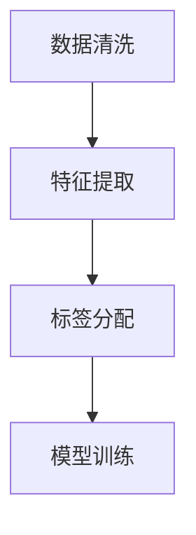

                 

# 数据标注：人工智能背后的无名英雄

## 1. 背景介绍

在人工智能(AI)的飞速发展中，数据标注者通常处于幕后，但正是他们的辛勤工作，才使得算法模型的训练和优化有了坚实的基石。数据标注作为人工智能的“粮食”，对于模型训练的质量和性能起着至关重要的作用。本文将探讨数据标注的核心概念、工作流程及其对人工智能发展的重要性。

## 2. 核心概念与联系

### 2.1 核心概念概述

数据标注（Data Annotation）是指将原始数据转换为模型训练所需格式的过程。这一过程通常包括数据清洗、特征提取、标签分配等环节。数据标注对于机器学习、深度学习和自然语言处理（NLP）等领域的模型训练至关重要。

- **数据清洗**：去除噪声、重复、缺失等数据，保证数据质量。
- **特征提取**：从原始数据中提取模型所需的特征，形成输入输出格式。
- **标签分配**：将标注结果转换为机器可识别格式，如数字标签、文本描述等。

这些环节环环相扣，共同构成数据标注的核心过程。

### 2.2 核心概念原理和架构的 Mermaid 流程图



## 3. 核心算法原理 & 具体操作步骤

### 3.1 算法原理概述

数据标注的算法原理主要基于监督学习，即通过已标注的训练集，训练模型进行数据预测。模型通过反向传播算法，学习如何将输入特征映射到正确的标签上。

### 3.2 算法步骤详解

数据标注的详细步骤包括：

1. **数据收集**：从多种渠道（如公开数据集、第三方API、用户交互等）获取原始数据。
2. **数据清洗**：去除噪声、重复、缺失等数据，保证数据质量。
3. **特征提取**：根据任务需求，从数据中提取有效的特征。
4. **标注**：由标注人员将数据打上正确的标签，如分类标签、回归值、文本标签等。
5. **验证与反馈**：对标注结果进行验证，发现错误并纠正，形成反馈循环。
6. **模型训练**：使用标注后的数据集，训练机器学习或深度学习模型。
7. **评估与优化**：评估模型性能，根据评估结果调整模型参数和标注策略。

### 3.3 算法优缺点

数据标注的优点包括：

- 能够将无结构数据转换为模型训练所需的格式。
- 可提升模型预测准确性，通过标注数据的监督学习，模型能够更好地适应特定任务。
- 支持多领域多任务，如计算机视觉、语音识别、NLP等，标注技术可灵活应用。

缺点包括：

- 标注成本高，特别是对于大规模、高维度数据，标注工作量巨大。
- 标注质量依赖标注人员专业水平，标注误差可能影响模型性能。
- 数据隐私和安全问题，标注过程可能涉及敏感数据的处理。

### 3.4 算法应用领域

数据标注在多个领域中得到了广泛应用：

- **计算机视觉**：图像识别、目标检测、语义分割等任务，如Kaggle竞赛中的ImageNet数据集。
- **自然语言处理**：文本分类、命名实体识别、情感分析等任务，如BERT模型的训练。
- **语音识别**：语音转文本、语音情感识别等任务，如Google的Automatic Speech Recognition。
- **生物信息学**：基因序列分析、蛋白质结构预测等任务，如蛋白质结构预测数据集PDB。

## 4. 数学模型和公式 & 详细讲解 & 举例说明

### 4.1 数学模型构建

以一个简单的二分类问题为例，假设我们有一个训练数据集 $\{(x_i, y_i)\}_{i=1}^N$，其中 $x_i$ 是输入特征，$y_i \in \{0,1\}$ 是标签。我们希望构建一个线性分类器 $f(x) = w \cdot x + b$，其中 $w$ 是权重向量，$b$ 是偏置项。我们的目标是最小化损失函数：

$$ \mathcal{L}(w) = \frac{1}{N}\sum_{i=1}^N \ell(y_i, f(x_i)) $$

其中 $\ell$ 是损失函数，如交叉熵损失。

### 4.2 公式推导过程

对于二分类问题，交叉熵损失函数为：

$$ \ell(y_i, f(x_i)) = -y_i \log f(x_i) - (1-y_i) \log (1-f(x_i)) $$

将其代入损失函数中，得：

$$ \mathcal{L}(w) = -\frac{1}{N}\sum_{i=1}^N [y_i \log f(x_i) + (1-y_i) \log (1-f(x_i))] $$

使用梯度下降算法，优化目标函数：

$$ w \leftarrow w - \eta \nabla_{w}\mathcal{L}(w) $$

其中 $\eta$ 是学习率，$\nabla_{w}\mathcal{L}(w)$ 为损失函数对权重 $w$ 的梯度。

### 4.3 案例分析与讲解

以ImageNet数据集为例，该数据集包含超过1000个类别的图像。标注人员需要对每张图像进行详细的类别标注。例如，对于一张图片，标注者可能需要判断图像中是否包含“猫”，并给出具体的类别标签。

在标注过程中，标注人员需要仔细检查每张图片，确保标注的准确性。例如，对于一张模糊不清的图片，标注者需要判断是否能够确定图片中是否包含“猫”。标注人员还需遵循一定的标注规范，如使用标准的命名方式、统一的数据格式等。

标注完成后，数据科学家将标注数据集分成训练集、验证集和测试集，使用训练集训练模型，并在验证集和测试集上进行评估，调整模型参数以提高准确性。

## 5. 项目实践：代码实例和详细解释说明

### 5.1 开发环境搭建

进行数据标注的开发，需要一个稳定的开发环境。以下是一个简单的搭建步骤：

1. **安装Python**：从官网下载并安装Python。
2. **安装相关库**：使用pip安装pandas、numpy等库。
3. **数据管理**：使用数据库或文件系统存储和管理数据。
4. **标注工具**：使用专用标注工具，如LabelImg、Labelbox等。

### 5.2 源代码详细实现

以下是一个简单的Python代码示例，用于读取图像数据并标注类别：

```python
import os
import cv2

# 定义数据路径和类别列表
data_path = 'path/to/data'
classes = ['cat', 'dog', 'bird']

# 遍历数据文件夹，读取并标注图像
for cls in classes:
    label_path = os.path.join(data_path, cls)
    for img_name in os.listdir(label_path):
        img_path = os.path.join(label_path, img_name)
        label = cls
        img = cv2.imread(img_path)
        # 显示图像和标签信息
        cv2.imshow('Image', img)
        cv2.waitKey(0)
```

### 5.3 代码解读与分析

此代码示例使用Python和OpenCV库，读取文件夹中的图像数据，并展示图像和对应的类别标签。实际操作中，还需要加入数据清洗、标注逻辑等。

### 5.4 运行结果展示

运行代码后，应显示一系列的图像，每张图像下方显示其对应的类别标签。

## 6. 实际应用场景

### 6.1 智能监控系统

智能监控系统需要大量标注的图像数据。通过标注人员对监控录像中的关键场景进行标注，模型能够学习到不同场景的特征，从而提升监控系统的识别精度。

### 6.2 自动驾驶

自动驾驶系统依赖于大量的标注数据进行训练。标注人员需要为车辆在不同环境和条件下录制的视频进行标注，训练模型进行道路识别、交通标志识别、行人检测等任务。

### 6.3 医疗诊断

医疗诊断系统需要大量的医学图像和标注数据。标注人员需要对医学影像进行详细标注，如肿瘤位置、病灶大小等，训练模型进行影像分析，提高诊断准确性。

### 6.4 未来应用展望

未来的数据标注将更加智能化和自动化，减少人工干预。机器学习技术可以自动识别和标注简单的图像数据，减少标注人员的工作量。

## 7. 工具和资源推荐

### 7.1 学习资源推荐

1. **《深度学习》**：Ian Goodfellow等著，涵盖了深度学习的基础知识和应用。
2. **《机器学习实战》**：Peter Harrington著，介绍了机器学习算法和实践技巧。
3. **Kaggle平台**：提供各种数据集和竞赛，有助于数据标注实践。
4. **Coursera平台**：提供计算机视觉、自然语言处理等领域的数据标注课程。

### 7.2 开发工具推荐

1. **Labelbox**：提供云端标注工具，支持多用户协作和项目管理。
2. **LabelImg**：一个简单的标注工具，支持图像和视频的标注。
3. **OpenCV**：开源计算机视觉库，支持图像和视频的处理和标注。

### 7.3 相关论文推荐

1. **《深度学习中数据标注的挑战》**：探讨了深度学习中数据标注的难点和解决方案。
2. **《人工智能数据标注的现状与未来》**：分析了当前数据标注技术的发展和应用。
3. **《多模态数据标注技术》**：研究了多模态数据的标注方法和应用。

## 8. 总结：未来发展趋势与挑战

### 8.1 研究成果总结

数据标注是人工智能发展不可或缺的一环，其重要性不言而喻。通过数据标注，模型能够更好地适应特定任务，提升预测准确性。

### 8.2 未来发展趋势

未来数据标注将朝着智能化、自动化方向发展，减少人工干预，提高标注效率和质量。

### 8.3 面临的挑战

数据标注面临的主要挑战包括标注成本高、标注质量依赖人员专业水平、数据隐私和安全问题等。

### 8.4 研究展望

未来需要更多研究数据标注的自动化技术和智能化方法，提升标注效率和质量，同时保护数据隐私，确保数据安全。

## 9. 附录：常见问题与解答

**Q1: 数据标注对人工智能发展的重要性是什么？**

A: 数据标注是人工智能模型训练的基础，通过标注，模型能够学习到数据中的特征和规律，从而提升预测准确性。数据标注对于计算机视觉、自然语言处理、语音识别等领域的模型训练至关重要。

**Q2: 如何进行数据标注？**

A: 数据标注的流程包括数据收集、数据清洗、特征提取、标签分配、验证与反馈、模型训练、评估与优化等环节。标注人员需要对原始数据进行清洗和特征提取，打上正确的标签，并验证标注结果。

**Q3: 数据标注的质量如何保证？**

A: 标注质量依赖于标注人员的专业水平和经验。为保证标注质量，通常会进行多次标注，并使用标注审核工具，对标注结果进行审核和修正。

**Q4: 数据标注对模型的影响是什么？**

A: 数据标注直接影响模型的训练效果。标注质量高、数量充足的标注数据，能够提高模型训练效果，提升预测准确性。相反，标注质量低、数量不足的标注数据，可能导致模型过拟合，预测准确性下降。

**Q5: 数据标注的未来发展方向是什么？**

A: 数据标注的未来发展方向是智能化、自动化，减少人工干预，提高标注效率和质量。未来可能使用机器学习技术自动标注简单的图像和文本数据，减少人工标注的工作量。同时，数据标注方法和工具也需要不断创新，以适应新的数据格式和应用场景。

