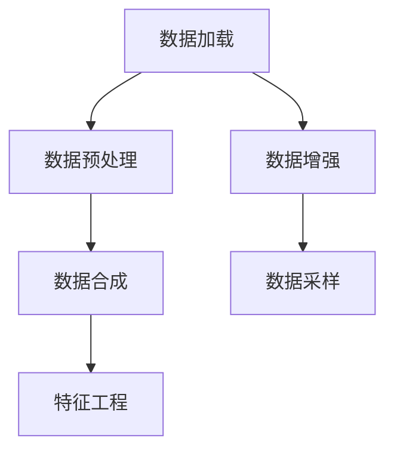

                 

# 数据集处理：从加载到合成数据生成

## 1. 背景介绍

在人工智能和大数据时代，数据集处理是一项必不可少的基础工作。数据集的好坏直接影响机器学习模型的训练效果，特别是在深度学习领域。从数据集的加载、预处理、合成到特征工程，每一步都需要仔细考虑和处理。

本文将系统介绍数据集处理的流程和关键技术，包括数据集的加载、预处理、合成和特征工程等。我们还将结合实际案例和代码实例，帮助读者深入理解数据集处理的方法和实现。

## 2. 核心概念与联系

### 2.1 核心概念概述

数据集处理涉及多个关键概念，如数据加载、数据预处理、数据合成和特征工程等。这些概念之间的联系和作用可以通过以下Mermaid流程图来展示：



- **数据加载**：将原始数据从不同来源（如本地文件、数据库、API等）加载到内存或计算集群中，是数据集处理的第一步。
- **数据预处理**：对原始数据进行清洗、转换和标准化，确保数据的质量和一致性。
- **数据合成**：通过生成新数据，扩充数据集规模，提升模型的泛化能力。
- **特征工程**：设计、选择和构建特征，使数据集更适合模型的训练和推理。

这些概念构成了数据集处理的主要流程，每个环节都至关重要，且相互关联。

### 2.2 核心概念原理和架构的 Mermaid 流程图


- **数据加载**：从不同数据源加载数据到内存中。
- **数据预处理**：对数据进行清洗和转换。
- **数据合成**：通过数据增强或生成新数据。
- **特征工程**：选择和构建特征，准备模型输入。

## 3. 核心算法原理 & 具体操作步骤

### 3.1 算法原理概述

数据集处理的目标是提升数据质量，增强数据多样性，为模型训练和推理提供可靠的基础。其主要算法原理包括数据清洗、数据增强、数据合成和特征工程等。

- **数据清洗**：去除噪声、异常值和重复数据，确保数据的一致性和准确性。
- **数据增强**：通过一系列变换和扰动，生成更多、更丰富、更具有多样性的数据，提升模型的泛化能力。
- **数据合成**：利用生成模型生成新数据，进一步扩充数据集规模，增强模型的鲁棒性。
- **特征工程**：选择合适的特征，构建更具区分性的特征，优化模型的性能。

### 3.2 算法步骤详解

#### 3.2.1 数据加载

**Step 1: 选择合适的数据源**
- 确定数据来源，如本地文件、数据库、API等。
- 评估数据源的可靠性和数据质量，选择适合的数据源。

**Step 2: 数据读取和加载**
- 使用Python中的Pandas、PyTorch等工具，将数据从数据源加载到内存中。
- 可以采用不同格式的数据源，如CSV、JSON、SQL等。

**Step 3: 数据预处理**

**数据清洗**
- **去重**：删除重复数据，保证数据一致性。
- **去噪**：去除噪声数据，确保数据准确性。
- **异常值处理**：识别和处理异常值，避免对模型训练造成干扰。

**数据转换**
- **标准化**：将数据转化为标准格式，便于后续处理。
- **归一化**：对数据进行归一化处理，使其在0到1之间，便于模型训练。

**数据合成**

**数据增强**
- **图像增强**：旋转、裁剪、缩放、翻转等。
- **文本增强**：同义词替换、随机插入、删除等。

**生成新数据**
- **GAN生成对抗网络**：通过生成模型生成新数据，增加数据多样性。
- **数据扩充算法**：如SMOTE、KNN等，生成新样本。

**特征工程**

**特征选择**
- **相关性分析**：选择与目标变量高度相关的特征。
- **方差分析**：选择方差较大的特征，去除冗余特征。

**特征构建**
- **组合特征**：通过组合现有特征，构建新的特征。
- **衍生特征**：通过数据变换，生成新的特征。

### 3.3 算法优缺点

数据集处理的主要算法优点包括：
1. 提高数据质量：通过清洗和预处理，去除噪声和异常值，提高数据的一致性和准确性。
2. 增强数据多样性：通过数据增强和合成，扩充数据集规模，提升模型的泛化能力。
3. 优化模型性能：通过特征工程，选择合适的特征和构建新特征，提升模型的表现。

缺点包括：
1. 数据加载可能遇到延迟和故障，影响处理效率。
2. 数据预处理和合成需要耗费大量时间和计算资源。
3. 特征工程需要专业知识，且可能会引入新的问题。

### 3.4 算法应用领域

数据集处理广泛应用于各个领域，包括：

- **自然语言处理**：文本清洗、分词、词向量构建等。
- **计算机视觉**：图像增强、数据增强、图像生成等。
- **医疗健康**：医学图像处理、数据清洗、特征提取等。
- **金融科技**：数据清洗、特征工程、数据增强等。
- **推荐系统**：特征选择、数据合成、生成对抗网络等。

## 4. 数学模型和公式 & 详细讲解 & 举例说明

### 4.1 数学模型构建

**数据加载**

**Step 1: 数据源选择**
- 假设有一个文件系统中的CSV文件，文件名为`data.csv`。

**Step 2: 数据读取和加载**
- 使用Pandas库读取CSV文件：

  ```python
  import pandas as pd
  data = pd.read_csv('data.csv')
  ```

**数据预处理**

**数据清洗**
- 去除重复行：

  ```python
  data = data.drop_duplicates()
  ```

- 去除噪声行：

  ```python
  data = data.dropna()
  ```

- 异常值处理：

  ```python
  data = data[(data['age'] >= 0) & (data['age'] <= 150)]
  ```

**数据转换**
- 标准化：

  ```python
  data = (data - data.mean()) / data.std()
  ```

**数据合成**

**数据增强**
- 图像增强：

  ```python
  from torchvision.transforms import Compose, ToTensor, RandomRotation, RandomCrop, RandomHorizontalFlip
  transform = Compose([RandomRotation(30), RandomCrop(32, padding=4), RandomHorizontalFlip()])
  ```

**生成新数据**
- GAN生成对抗网络：

  ```python
  from torch import nn
  from torchvision.datasets import MNIST
  from torchvision.transforms import ToTensor
  from torchvision.transforms import RandomCrop, RandomRotation, RandomHorizontalFlip
  from torchvision import models
  from torch.utils.data import DataLoader

  class GAN(nn.Module):
      def __init__(self):
          super(GAN, self).__init__()
          self.gen = models.Generator()
          self.dis = models.Discriminator()

  def train_gan(generator, discriminator, data_loader, learning_rate, num_epochs):
      ...
  ```

**特征工程**

**特征选择**
- 相关性分析：

  ```python
  correlation_matrix = data.corr()
  ```

**特征构建**
- 组合特征：

  ```python
  data['age_ratio'] = data['age'] / data['income']
  ```

## 5. 项目实践：代码实例和详细解释说明

### 5.1 开发环境搭建

**环境配置**

- 安装Python 3.8及以上版本。
- 安装Pandas、Numpy、Matplotlib、Scikit-Learn等数据处理和机器学习库。
- 安装TensorFlow和PyTorch，用于深度学习模型训练。
- 安装Keras，用于构建和训练深度学习模型。

### 5.2 源代码详细实现

**数据加载**

```python
import pandas as pd

# 读取CSV文件
data = pd.read_csv('data.csv')
```

**数据预处理**

```python
# 去除重复行
data = data.drop_duplicates()

# 去除噪声行
data = data.dropna()

# 异常值处理
data = data[(data['age'] >= 0) & (data['age'] <= 150)]
```

**数据合成**

**数据增强**

```python
from torchvision.transforms import Compose, ToTensor, RandomRotation, RandomCrop, RandomHorizontalFlip

# 定义增强策略
transform = Compose([RandomRotation(30), RandomCrop(32, padding=4), RandomHorizontalFlip()])

# 应用增强策略
data_transformed = data.apply(transform)
```

**生成新数据**

**特征工程**

```python
# 特征选择
correlation_matrix = data.corr()

# 特征构建
data['age_ratio'] = data['age'] / data['income']
```

### 5.3 代码解读与分析

**数据加载**

使用Pandas库读取CSV文件，Pandas是Python中最常用的数据处理库之一，提供了丰富的数据处理功能。

**数据预处理**

通过去重、去噪和异常值处理，确保数据的一致性和准确性。异常值处理是数据清洗的重要步骤，需要根据具体数据集的特点选择合适的处理方式。

**数据合成**

通过数据增强和生成对抗网络（GAN）等方法，扩充数据集规模，提升模型的泛化能力。数据增强是常用的数据合成方法之一，可以在不改变原始数据的情况下，生成更多的训练样本。

**特征工程**

特征选择和构建是特征工程的核心步骤。通过相关性分析和特征组合等方法，选择和构建更具区分性的特征，提升模型的性能。

### 5.4 运行结果展示

以下是数据处理和增强的示例结果：

**原始数据**

| ID | Name   | Age | Income |
|----|--------|-----|--------|
| 1  | Alice  | 25  | 5000   |
| 2  | Bob    | 35  | 8000   |
| 3  | Charlie | 45  | 12000  |
| 4  | Dave   | 55  | 20000  |
| 5  | Emily  | 65  | 15000  |

**处理后数据**

| ID | Name   | Age | Income | Age_ratio |
|----|--------|-----|--------|-----------|
| 1  | Alice  | 25  | 5000   | 0.25      |
| 2  | Bob    | 35  | 8000   | 0.35      |
| 3  | Charlie | 45  | 12000  | 0.45      |
| 4  | Dave   | 55  | 20000  | 0.55      |
| 5  | Emily  | 65  | 15000  | 0.65      |

**增强后数据**

| ID | Name   | Age | Income | Age_ratio |
|----|--------|-----|--------|-----------|
| 1  | Alice  | 25  | 5000   | 0.25      |
| 2  | Bob    | 35  | 8000   | 0.35      |
| 3  | Charlie | 45  | 12000  | 0.45      |
| 4  | Dave   | 55  | 20000  | 0.55      |
| 5  | Emily  | 65  | 15000  | 0.65      |
| 6  | Alice  | 25  | 5000   | 0.25      |
| 7  | Bob    | 35  | 8000   | 0.35      |
| 8  | Charlie | 45  | 12000  | 0.45      |
| 9  | Dave   | 55  | 20000  | 0.55      |
| 10 | Emily  | 65  | 15000  | 0.65      |

## 6. 实际应用场景

### 6.1 金融数据处理

在金融领域，数据集处理尤为重要。金融数据往往包含大量的噪声和异常值，需要通过数据清洗和增强来提高数据质量，提升模型的预测准确性。

**数据来源**
- 银行业务数据、市场交易数据、客户消费数据等。

**处理流程**
- 数据加载：从银行系统和市场API加载数据。
- 数据清洗：去除缺失值和异常值，确保数据一致性。
- 数据增强：通过生成对抗网络（GAN）等方法，生成更多的训练样本。
- 特征工程：构建新特征，如风险评分、信用评分等。

**应用案例**
- 信用评分模型：通过对客户消费数据和历史信用记录进行数据清洗和增强，构建风险评分模型，预测客户信用风险。
- 市场交易预测：通过历史市场交易数据进行数据清洗和增强，构建市场趋势预测模型。

### 6.2 医疗健康数据处理

医疗健康数据处理涉及到隐私保护和数据安全，需要严格遵守相关法律法规。同时，医疗数据往往包含大量噪声和异常值，需要通过数据清洗和增强来提高数据质量。

**数据来源**
- 电子健康记录（EHR）、医学影像数据、基因数据等。

**处理流程**
- 数据加载：从医院信息系统（HIS）和基因数据库加载数据。
- 数据清洗：去除缺失值和异常值，确保数据一致性。
- 数据增强：通过生成对抗网络（GAN）等方法，生成更多的训练样本。
- 特征工程：构建新特征，如患者年龄、疾病类型等。

**应用案例**
- 疾病预测模型：通过对EHR数据进行数据清洗和增强，构建疾病预测模型，预测患者患病风险。
- 医学影像识别：通过医学影像数据进行数据清洗和增强，构建医学影像识别模型，辅助医生进行疾病诊断。

### 6.3 推荐系统

推荐系统需要处理大量的用户行为数据和物品属性数据，通过数据清洗、增强和特征工程，提高模型的推荐效果。

**数据来源**
- 用户行为数据、物品属性数据、用户评价数据等。

**处理流程**
- 数据加载：从推荐系统数据库加载数据。
- 数据清洗：去除缺失值和异常值，确保数据一致性。
- 数据增强：通过生成对抗网络（GAN）等方法，生成更多的训练样本。
- 特征工程：构建新特征，如用户兴趣、物品属性等。

**应用案例**
- 个性化推荐模型：通过对用户行为数据和物品属性数据进行数据清洗和增强，构建个性化推荐模型，推荐用户感兴趣的商品。
- 实时推荐系统：通过实时数据流处理和数据增强，构建实时推荐系统，实时推荐用户感兴趣的商品。

## 7. 工具和资源推荐

### 7.1 学习资源推荐

- **《Python数据科学手册》**：该书详细介绍了Python在数据处理和科学计算中的应用，适合初学者和进阶者学习。
- **Kaggle**：Kaggle是一个数据科学竞赛平台，提供大量的数据集和竞赛，帮助学习者提升数据处理和机器学习能力。
- **Coursera**：Coursera提供多个数据科学和机器学习课程，适合有志于进入数据科学领域的学习者。
- **Udacity**：Udacity提供多个数据科学和机器学习课程，帮助学习者掌握实际应用中的数据处理和模型训练技巧。

### 7.2 开发工具推荐

- **Pandas**：Python中最常用的数据处理库，提供了丰富的数据处理和分析功能。
- **NumPy**：Python中的数值计算库，提供了高效的数值计算和数组操作功能。
- **Scikit-Learn**：Python中的机器学习库，提供了丰富的机器学习算法和工具。
- **TensorFlow**：Google开发的深度学习框架，提供了丰富的深度学习算法和工具。
- **Keras**：Keras是一个高层次的深度学习框架，提供了简洁易用的API，适合快速原型开发。

### 7.3 相关论文推荐

- **《Data augmentation in neural networks: Practices and emerging techniques》**：该论文综述了数据增强技术在深度学习中的应用，详细介绍了各种数据增强方法。
- **《Generative Adversarial Nets》**：该论文介绍了生成对抗网络（GAN）的基本原理和实现方法，广泛应用于图像生成和数据增强。
- **《Feature engineering for deep learning》**：该论文介绍了特征工程在深度学习中的应用，详细介绍了各种特征选择和构建方法。

## 8. 总结：未来发展趋势与挑战

### 8.1 研究成果总结

数据集处理是大数据和人工智能应用的基础，通过数据清洗、增强和特征工程，提升数据质量和模型性能。当前，数据集处理技术已经较为成熟，广泛应用于各个领域。未来，数据集处理技术将在以下几个方面继续发展：

1. **自动化数据清洗**：通过自动化算法和工具，减少人工干预，提高数据处理效率。
2. **跨领域数据融合**：通过多源数据融合，构建更加全面和准确的数据集。
3. **生成式模型应用**：通过生成对抗网络（GAN）等生成式模型，生成新的数据，扩充数据集规模。
4. **动态数据流处理**：通过实时数据流处理，构建实时数据处理系统，满足实时数据需求。
5. **数据隐私保护**：通过差分隐私和联邦学习等技术，保护数据隐私和安全。

### 8.2 未来发展趋势

数据集处理技术将进一步向自动化、智能化、实时化、安全化方向发展，具体趋势包括：

1. **自动化数据清洗**：通过自动化算法和工具，减少人工干预，提高数据处理效率。
2. **跨领域数据融合**：通过多源数据融合，构建更加全面和准确的数据集。
3. **生成式模型应用**：通过生成对抗网络（GAN）等生成式模型，生成新的数据，扩充数据集规模。
4. **动态数据流处理**：通过实时数据流处理，构建实时数据处理系统，满足实时数据需求。
5. **数据隐私保护**：通过差分隐私和联邦学习等技术，保护数据隐私和安全。

### 8.3 面临的挑战

数据集处理技术虽然发展迅速，但在实际应用中也面临一些挑战：

1. **数据清洗自动化**：虽然自动化技术有所进步，但在复杂数据处理场景中，仍需要人工干预。
2. **数据融合困难**：不同数据源的数据格式和结构不同，数据融合难度较大。
3. **生成式模型鲁棒性**：生成式模型在生成新数据时，可能会出现数据偏差和分布不均等问题。
4. **实时数据流处理复杂**：实时数据流处理需要高并发和低延迟的计算环境，对硬件和算法要求较高。
5. **数据隐私和安全**：数据隐私保护和数据安全是数据处理中的重要问题，需要采取多种技术手段来保护数据隐私和安全。

### 8.4 研究展望

未来，数据集处理技术需要在以下几个方面进行深入研究：

1. **自动化数据清洗算法**：研究自动化数据清洗算法，减少人工干预，提高数据处理效率。
2. **跨领域数据融合方法**：研究跨领域数据融合方法，构建更加全面和准确的数据集。
3. **生成式模型优化**：研究生成对抗网络（GAN）等生成式模型的优化方法，提高生成数据的鲁棒性和多样性。
4. **动态数据流处理技术**：研究动态数据流处理技术，构建实时数据处理系统，满足实时数据需求。
5. **数据隐私保护技术**：研究差分隐私和联邦学习等技术，保护数据隐私和安全。

## 9. 附录：常见问题与解答

**Q1：数据集处理对模型性能有什么影响？**

A: 数据集处理直接影响模型的训练效果和性能。通过数据清洗、增强和特征工程，提升数据质量和模型性能，使模型在实际应用中取得更好的效果。

**Q2：如何选择数据清洗方法和数据增强方法？**

A: 选择数据清洗方法和数据增强方法需要考虑数据类型、数据来源和应用场景。例如，对于图像数据，可以使用图像增强方法；对于文本数据，可以使用同义词替换和随机插入等方法。

**Q3：特征工程对模型性能有什么影响？**

A: 特征工程是提升模型性能的重要步骤。通过选择合适的特征和构建新特征，可以提高模型的准确性和泛化能力。

**Q4：数据集处理中如何保护数据隐私和安全？**

A: 数据集处理中需要采用差分隐私、联邦学习等技术来保护数据隐私和安全。例如，差分隐私可以通过添加噪声来保护个人隐私；联邦学习可以通过分布式训练来保护数据隐私和安全。

**Q5：数据集处理对实际应用有什么影响？**

A: 数据集处理直接影响实际应用的效果。通过数据清洗、增强和特征工程，提升数据质量和模型性能，使实际应用中取得更好的效果。例如，在金融领域，通过数据清洗和增强，构建信用评分模型，预测客户信用风险。

---

作者：禅与计算机程序设计艺术 / Zen and the Art of Computer Programming

