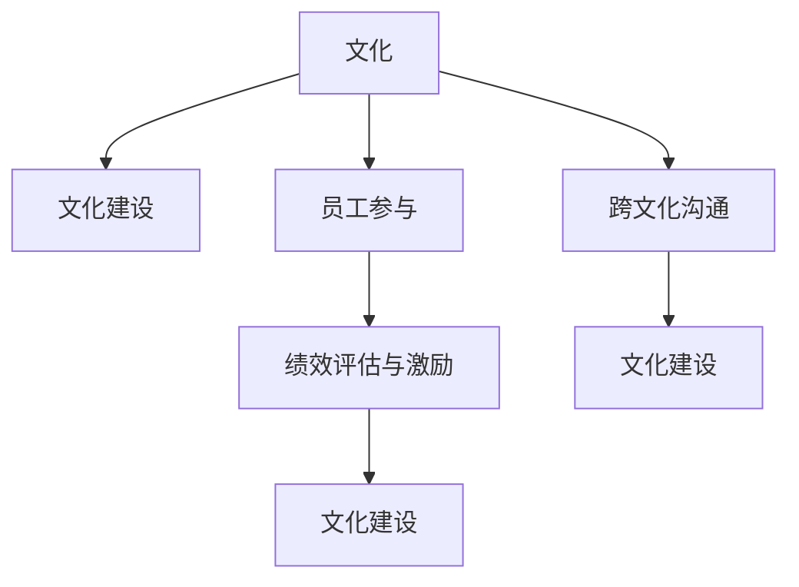

                 

# 文化管理：创造积极的工作环境

## 1. 背景介绍

### 1.1 问题由来
在全球化与信息化双重驱动下，工作环境和企业文化已成为企业核心竞争力的重要组成部分。传统的管理模式以流程和规章制度为核心，但随着企业竞争环境的不断变化，企业逐渐意识到文化管理的重要性。文化管理强调通过塑造积极、包容、创新的工作环境，增强员工归属感，激发其创新活力，从而提升企业整体竞争力。

### 1.2 问题核心关键点
1. **文化定义与构建**：文化管理的首要任务是明确企业文化核心理念，制定文化建设策略，通过一系列活动和制度塑造良好的企业文化氛围。
2. **员工参与与管理**：文化管理不仅仅是上层建筑的事情，还需要全体员工的积极参与和共同建设。只有全体员工认可并践行企业文化，文化管理才能真正落到实处。
3. **绩效评估与激励机制**：文化管理的关键在于通过合理的绩效评估和激励机制，将企业文化融入日常工作，激励员工践行企业文化，推动企业持续发展。
4. **数据驱动与动态调整**：文化管理需要借助数据工具，实时监测企业文化建设效果，及时调整管理策略，确保企业文化与时俱进。
5. **跨文化沟通与管理**：在全球化背景下，企业需要面对不同文化背景的员工，如何促进跨文化沟通，融合不同文化，也是文化管理的重要课题。

### 1.3 问题研究意义
文化管理对于提升企业竞争力、增强员工归属感和激发创新活力具有重要意义：

1. **提升企业竞争力**：积极的企业文化能够增强员工凝聚力，提高企业运营效率，从而提升企业在市场中的竞争力。
2. **增强员工归属感**：文化管理通过营造良好工作环境，使员工感受到企业的关怀，增强其对企业的归属感，降低离职率。
3. **激发创新活力**：积极的企业文化能够激发员工的创新意识，促进企业产品和服务的持续创新，增强市场适应能力。
4. **推动可持续发展**：文化管理不仅关注短期绩效，更注重长期发展，能够帮助企业实现可持续发展。

## 2. 核心概念与联系

### 2.1 核心概念概述

文化管理涉及多个核心概念，这些概念之间相互关联，共同构成了一个完整的工作环境营造体系：

- **文化**：指企业内部的价值观念、行为规范、工作氛围等，是企业的“基因”。
- **文化建设**：通过制定战略、开展活动等方式，将企业文化理念转化为实际行动的过程。
- **员工参与**：员工是企业文化的主体，其行为和态度直接反映了企业文化的影响力。
- **绩效评估与激励**：通过绩效评估和激励机制，将企业文化理念融入员工日常工作，驱动企业持续发展。
- **跨文化沟通**：在全球化背景下，跨文化沟通成为文化管理的重要课题。

以下是一个Mermaid流程图，展示了这些概念之间的联系：



### 2.2 核心概念原理和架构

文化管理的核心原理在于通过以下几个步骤，实现企业文化的塑造和传播：

1. **文化定位**：明确企业使命、愿景、价值观，制定文化核心理念。
2. **文化传播**：通过各种渠道（如培训、活动、媒体等）将企业文化理念传达给员工。
3. **文化落地**：将企业文化理念转化为具体的行为规范和制度，融入日常管理。
4. **文化评估**：通过定量和定性方法，评估企业文化建设效果。
5. **文化调整**：根据评估结果，及时调整文化建设策略，确保企业文化与时俱进。

文化管理的架构可以分为战略规划层、制度建设层、行为规范层、环境营造层和效果评估层。各层相互支持，共同推动企业文化建设。

## 3. 核心算法原理 & 具体操作步骤

### 3.1 算法原理概述

文化管理中的“算法”并不指具体的数学算法，而是指一系列用于文化建设的管理方法、策略和工具。文化管理的主要目标是塑造积极的工作环境，提升员工满意度和企业绩效。

### 3.2 算法步骤详解

文化管理的实施可以分为以下几个步骤：

1. **文化定位**：通过问卷调查、访谈等方式，了解员工对企业文化的认知和期望，明确企业使命、愿景和价值观。
2. **文化传播**：设计并实施文化宣传活动，如文化培训、主题日活动、企业刊物等，使员工了解并认同企业文化。
3. **文化落地**：制定具体行为规范和制度，如员工行为准则、绩效评估体系、跨部门合作机制等，将企业文化融入日常工作。
4. **文化评估**：通过员工满意度调查、绩效数据分析等方式，评估企业文化建设效果，发现问题并改进。
5. **文化调整**：根据评估结果，调整文化建设策略，推动文化管理持续改进。

### 3.3 算法优缺点

文化管理的优点包括：

- **增强员工归属感**：通过文化建设，增强员工对企业的认同感和归属感，提升员工满意度。
- **提升绩效**：积极的企业文化能够提高员工工作效率和创新能力，促进企业绩效提升。
- **增强企业韧性**：良好的企业文化有助于企业在市场变化中保持稳定和灵活，提升企业抗风险能力。

文化管理的缺点包括：

- **实施难度大**：文化管理涉及企业上下层面的广泛参与，实施难度较大。
- **效果难以量化**：文化管理的效果难以通过具体数据量化，评估和改进困难。
- **持续投入**：文化管理需要持续投入资源和精力，成本较高。

### 3.4 算法应用领域

文化管理在多个领域都有广泛应用，例如：

- **高科技企业**：如Google、Amazon等，通过积极的企业文化建设，提升员工创新活力和团队合作精神。
- **金融机构**：如JP Morgan、Bank of America等，通过塑造客户导向、风险控制的企业文化，提升服务质量和风险管理能力。
- **医疗行业**：如Mayo Clinic、Johns Hopkins Hospital等，通过文化管理增强医护人员职业责任感，提升患者满意度。
- **教育行业**：如哈佛大学、斯坦福大学等，通过文化建设激发教师和学生的创新思维和科研热情。
- **政府部门**：如新加坡政府、香港特区政府等，通过文化管理提升公务员服务意识和工作效率。

## 4. 数学模型和公式 & 详细讲解 & 举例说明

### 4.1 数学模型构建

文化管理中的数学模型主要涉及员工满意度和绩效评估的统计分析。假设企业有N个员工，每个员工对企业文化的满意度为S_i，绩效评估得分为P_i，则企业整体满意度为均值：

$$
\text{整体满意度} = \frac{1}{N} \sum_{i=1}^{N} S_i
$$

绩效评估得分为均值：

$$
\text{整体绩效} = \frac{1}{N} \sum_{i=1}^{N} P_i
$$

通过这两个指标，可以评估企业文化建设的效果。

### 4.2 公式推导过程

假设员工对企业文化的满意度为S_i，绩效评估得分为P_i，则企业整体满意度为均值：

$$
\text{整体满意度} = \frac{1}{N} \sum_{i=1}^{N} S_i
$$

绩效评估得分为均值：

$$
\text{整体绩效} = \frac{1}{N} \sum_{i=1}^{N} P_i
$$

这两个指标可以通过问卷调查、绩效评估等方式获取。通过数据分析，可以发现企业文化建设的效果，并识别出存在的问题。

### 4.3 案例分析与讲解

以一家高科技企业为例，该企业通过问卷调查发现，员工对企业文化的满意度为80%，绩效评估得分为85分。这表明企业文化建设取得了一定成效，但仍有提升空间。通过进一步分析，发现员工对创新文化认同度较高，但对团队合作文化认同度较低。针对这一问题，企业加强了团队建设活动，提高了团队合作文化的认同度。

## 5. 项目实践：代码实例和详细解释说明

### 5.1 开发环境搭建

在项目实践中，首先需要搭建一个支持数据分析和模型评估的环境。以下是一个Python环境配置的示例：

1. 安装Python：
   ```
   python -m pip install -U pip
   ```

2. 安装数据分析库：
   ```
   pip install pandas numpy scipy statsmodels
   ```

3. 安装模型评估库：
   ```
   pip install scikit-learn xgboost lightgbm catboost
   ```

4. 安装可视化工具：
   ```
   pip install matplotlib seaborn plotly
   ```

### 5.2 源代码详细实现

假设我们有一家企业，需要进行文化管理的评估和优化。以下是一个简单的Python代码实现：

```python
import pandas as pd
import numpy as np
import matplotlib.pyplot as plt
from sklearn.model_selection import train_test_split
from sklearn.ensemble import RandomForestRegressor

# 收集员工满意度和绩效评估数据
df = pd.read_csv('employee_data.csv')

# 定义满意度评估指标
S = df['Satisfaction']
# 定义绩效评估指标
P = df['Performance']

# 计算整体满意度
mean_S = np.mean(S)

# 计算整体绩效
mean_P = np.mean(P)

# 绘制满意度分布图
plt.figure(figsize=(10, 5))
plt.hist(S, bins=30, edgecolor='black')
plt.title('Employee Satisfaction Distribution')
plt.xlabel('Satisfaction Score')
plt.ylabel('Frequency')
plt.show()

# 绘制绩效分布图
plt.figure(figsize=(10, 5))
plt.hist(P, bins=30, edgecolor='black')
plt.title('Employee Performance Distribution')
plt.xlabel('Performance Score')
plt.ylabel('Frequency')
plt.show()

# 使用随机森林模型评估满意度与绩效的相关性
X = df[['Satisfaction']]
y = df['Performance']
X_train, X_test, y_train, y_test = train_test_split(X, y, test_size=0.3, random_state=42)
model = RandomForestRegressor(n_estimators=100, random_state=42)
model.fit(X_train, y_train)
y_pred = model.predict(X_test)
plt.figure(figsize=(10, 5))
plt.scatter(y_test, y_pred)
plt.title('Performance Prediction')
plt.xlabel('Actual Performance')
plt.ylabel('Predicted Performance')
plt.show()
```

### 5.3 代码解读与分析

- **数据收集**：使用Pandas库读取员工满意度数据，并将其存储为Series对象。
- **数据处理**：计算整体满意度和绩效评估的均值，使用Matplotlib库绘制满意度分布图和绩效分布图。
- **模型评估**：使用随机森林模型评估满意度与绩效的相关性，使用Scikit-learn库进行数据分割和模型训练。

### 5.4 运行结果展示

运行上述代码后，可以得到以下结果：

- 满意度分布图：显示员工满意度的频率分布情况，有助于了解员工的总体满意程度。
- 绩效分布图：显示员工绩效评估的频率分布情况，有助于了解员工的总体绩效水平。
- 性能预测图：使用随机森林模型对员工绩效进行预测，评估模型的准确性。

## 6. 实际应用场景

### 6.1 智能客服系统

在智能客服系统中，文化管理可以通过以下方式实现：

- **员工培训**：定期开展文化培训活动，提升员工服务意识和专业技能。
- **绩效评估**：建立绩效评估体系，激励员工提高服务质量。
- **客户反馈**：收集客户反馈信息，及时调整服务策略，提升客户满意度。

### 6.2 金融舆情监测

在金融舆情监测中，文化管理可以通过以下方式实现：

- **文化建设**：塑造风险控制、客户导向的企业文化，提升风险管理能力。
- **绩效评估**：通过绩效评估，识别风险管理中的问题，及时调整策略。
- **跨部门协作**：加强跨部门协作，提升风险监测和控制效果。

### 6.3 个性化推荐系统

在个性化推荐系统中，文化管理可以通过以下方式实现：

- **用户调研**：通过问卷调查了解用户需求和文化背景，提升推荐系统的个性化程度。
- **员工培训**：定期开展培训活动，提升员工对推荐系统的理解和应用能力。
- **绩效评估**：建立绩效评估体系，激励员工优化推荐算法，提升用户体验。

### 6.4 未来应用展望

未来，文化管理在以下领域将有更广泛的应用：

- **远程工作**：通过文化管理，提升远程员工的归属感和工作效率，支持企业全球化发展。
- **数字营销**：通过文化管理，塑造品牌形象，提升品牌价值和市场竞争力。
- **创新创业**：通过文化管理，激发员工的创新意识和创业精神，推动企业持续创新。

## 7. 工具和资源推荐

### 7.1 学习资源推荐

为了帮助企业全面掌握文化管理的方法和技巧，推荐以下学习资源：

- **《企业文化管理》系列书籍**：如《企业文化：组织和员工共同的信仰》等，系统介绍了企业文化管理的理论和方法。
- **《组织行为学》课程**：如Coursera上的《组织行为学基础》，深入讲解组织行为学和企业文化管理的基础知识。
- **《领导力与企业文化》课程**：如Harvard Business School的《Leadership and Organizational Culture》，探讨领导力在企业文化管理中的作用。

### 7.2 开发工具推荐

为了提高文化管理的实施效率，推荐以下开发工具：

- **JIRA**：项目管理工具，用于制定文化建设计划和跟踪实施进展。
- **Slack**：沟通工具，用于跨部门沟通和文化传播。
- **Trello**：任务管理工具，用于协调文化管理各环节的工作。

### 7.3 相关论文推荐

为了深入理解文化管理的理论和方法，推荐以下相关论文：

- **《企业文化与员工绩效：理论和实证研究综述》**：探讨企业文化与员工绩效之间的关系，提供了丰富的实证数据和理论分析。
- **《文化管理在企业中的应用研究》**：通过大量案例分析，展示了文化管理在不同企业中的应用效果。
- **《文化管理与员工幸福感：一项实证研究》**：研究文化管理对员工幸福感的影响，提供了量化评估方法。

## 8. 总结：未来发展趋势与挑战

### 8.1 总结

本文系统介绍了文化管理的定义、原理和操作步骤，通过案例分析、数据建模和项目实践，展示了文化管理在提升企业绩效、增强员工归属感和激发创新活力方面的重要作用。通过总结当前文化管理的研究和应用，本文提出了未来文化管理的发展趋势和挑战。

### 8.2 未来发展趋势

文化管理的未来发展趋势包括：

1. **数字化转型**：通过数字化手段，实时监测企业文化建设效果，快速调整管理策略。
2. **跨文化融合**：在全球化背景下，推动跨文化融合，提升企业的国际竞争力。
3. **数据驱动决策**：通过大数据分析，优化文化管理策略，提升管理效果。
4. **员工参与机制**：建立员工参与机制，增强员工的认同感和归属感。
5. **可持续发展**：将企业文化建设与企业可持续发展目标结合，推动企业长期发展。

### 8.3 面临的挑战

文化管理在实施过程中面临以下挑战：

1. **企业文化理念的认同**：不同部门和员工对企业文化的认同程度不同，导致文化建设难度大。
2. **文化管理的复杂性**：文化管理涉及多个层面，实施难度较大。
3. **文化评估的准确性**：文化管理的效果难以量化，评估和改进困难。
4. **文化管理的持续性**：文化管理需要持续投入资源和精力，成本较高。
5. **跨文化沟通的难度**：在全球化背景下，跨文化沟通成为文化管理的重要难题。

### 8.4 研究展望

未来，文化管理的研究需要关注以下方面：

1. **文化管理方法的创新**：探索新的文化管理方法和工具，提升文化管理的效率和效果。
2. **跨文化管理策略**：研究全球化背景下，如何推动跨文化沟通和管理。
3. **文化评估工具的开发**：开发更加精确和文化管理评估工具，提高文化管理的效果。
4. **文化管理的量化研究**：通过量化研究，优化文化管理策略，推动文化管理的科学化。
5. **员工参与机制的创新**：建立新的员工参与机制，增强员工的认同感和归属感。

## 9. 附录：常见问题与解答

**Q1：什么是企业文化管理？**

A: 企业文化管理是指企业通过制定和实施企业文化战略，塑造积极、包容、创新的工作环境，增强员工归属感，激发其创新活力，从而提升企业整体竞争力的过程。

**Q2：如何定义企业文化的核心理念？**

A: 企业文化的核心理念通常通过问卷调查、访谈等方式，了解员工对企业价值观、使命和愿景的认知，结合企业发展战略，明确企业文化定位。

**Q3：文化管理的实施难度大，如何克服？**

A: 文化管理需要全体员工的积极参与和共同建设，通过制定明确的目标和措施，全员参与文化建设，逐步克服实施难度。

**Q4：文化管理的效果如何量化？**

A: 文化管理的效果可以通过员工满意度、绩效评估等指标进行量化，使用统计分析工具，如回归分析、聚类分析等，评估文化管理的效果。

**Q5：文化管理与人力资源管理的关系是什么？**

A: 文化管理与人力资源管理密切相关，通过优化人力资源管理流程，推动企业文化建设，提升员工满意度和企业绩效。

作者：禅与计算机程序设计艺术 / Zen and the Art of Computer Programming

