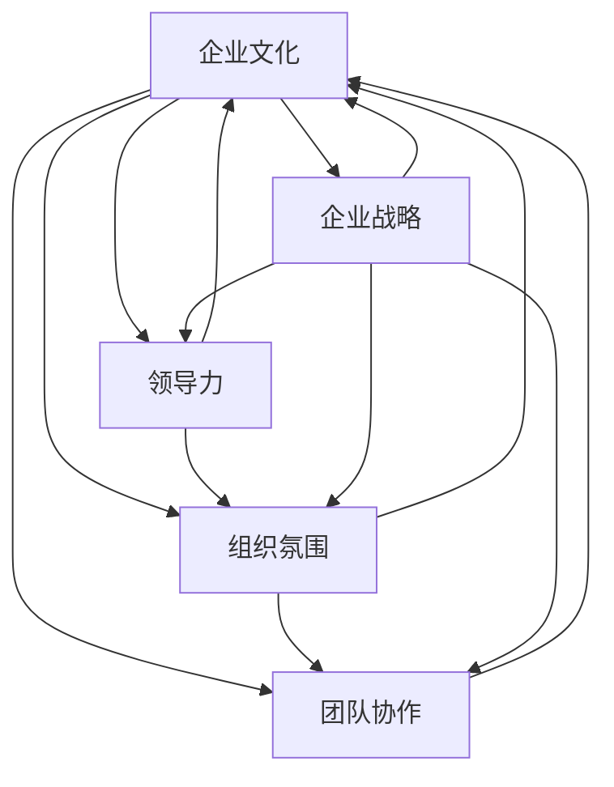

                 

# 文化管理：塑造积极向上的组织氛围

> 关键词：文化管理,组织氛围,员工满意度,领导力,团队协作,企业战略

## 1. 背景介绍

### 1.1 问题由来

随着企业规模的不断扩大，组织结构日益复杂，企业面临的环境日趋动态多变。如何在复杂多变的经营环境中保持稳健的发展，已成为企业关注的重点。特别是随着全球疫情的肆虐，工作方式逐渐向远程办公转变，员工心态、团队协作等问题日益凸显。与此同时，企业如何在数字化转型中寻求新的发展突破，也亟需深入思考。

在这样的背景下，文化管理成为塑造积极向上的组织氛围，提升员工满意度和团队协作能力的关键。文化不仅是企业的软实力，更是其核心竞争力所在。

### 1.2 问题核心关键点

当前，文化管理已经成为企业实现可持续发展的重要保障。文化管理涉及领导力、组织氛围、员工满意度、团队协作等多个层面，企业若能充分利用这些关键点，可以极大地提升企业的核心竞争力，具体关键点如下：

- 塑造企业文化：通过制定明确的价值观、使命和愿景，建立强大的企业文化体系，引导企业走向正确的方向。
- 加强领导力培养：提升领导团队的能力，使其能够有效引导企业的发展方向和运营策略。
- 营造积极的组织氛围：通过优化组织结构、完善激励机制，提升员工满意度和工作积极性。
- 促进团队协作：通过明确团队目标，优化团队合作方式，提升团队协作效率和效果。
- 实施企业战略：通过战略规划和执行，确保企业目标的实现，提升企业的市场竞争力。

## 2. 核心概念与联系

### 2.1 核心概念概述

在深入探讨文化管理之前，我们首先需要理解相关核心概念：

- 企业文化（Corporate Culture）：指企业内部共同的价值观、信仰和行为规范，是企业发展的基础和核心。
- 组织氛围（Organizational Atmosphere）：指企业内部工作环境和工作氛围，直接影响员工的工作满意度和忠诚度。
- 领导力（Leadership）：指领导团队和管理者的决策能力、激励能力和团队协作能力。
- 团队协作（Team Collaboration）：指企业内不同部门或成员之间的协同合作能力，是企业高效运作的保障。
- 企业战略（Corporate Strategy）：指企业的发展目标、发展路径和行动计划，指导企业长期发展。

这些概念之间相互关联，共同构成企业文化管理的整体框架。一个健康的企业文化，应具备强有力的领导力、积极的组织氛围、高效的团队协作和明确的战略规划。

### 2.2 核心概念原理和架构的 Mermaid 流程图



### 2.3 关键节点解释

- **企业文化（A）**：企业文化是企业的核心价值观、信仰和行为规范，是企业发展的基石。
- **领导力（B）**：领导力是企业运营的核心驱动力，直接影响企业文化和组织氛围。
- **组织氛围（C）**：组织氛围是企业内部的工作环境和工作氛围，直接影响员工满意度和忠诚度。
- **团队协作（D）**：团队协作是企业高效运作的关键，是企业战略执行的重要保障。
- **企业战略（E）**：企业战略是企业发展的目标和路径，指导企业的长期发展。

## 3. 核心算法原理 & 具体操作步骤

### 3.1 算法原理概述

文化管理是一个系统的工程，涉及多个维度的协同运作。其主要原理和操作步骤如下：

- **企业文化构建**：通过制定企业的使命、愿景和价值观，形成强有力的企业文化体系。
- **领导力培养**：通过培训、评估、选拔等方式提升领导团队的能力，使其具备良好的决策和激励能力。
- **组织氛围优化**：通过优化组织结构、完善激励机制、加强团队建设等方式，提升员工的满意度和工作积极性。
- **团队协作促进**：通过明确团队目标、优化合作方式、增强沟通交流等方式，提升团队协作效率和效果。
- **企业战略规划**：通过系统化的战略规划和执行，确保企业目标的实现。

### 3.2 算法步骤详解

具体步骤如下：

**Step 1: 企业文化构建**

1. 制定企业使命、愿景和价值观。通过调研、讨论等方式，形成全体员工共同认同的企业文化。
2. 制定相关制度和政策，保障企业文化落地执行。
3. 通过企业文化宣传、培训等方式，增强员工的认同感和归属感。

**Step 2: 领导力培养**

1. 选拔和培训领导团队，提升其决策、激励和协作能力。
2. 建立领导力评估体系，定期评估领导团队的工作绩效。
3. 制定领导力发展计划，持续提升领导团队的能力。

**Step 3: 组织氛围优化**

1. 优化组织结构，提高决策效率和执行能力。
2. 完善激励机制，提升员工的工作积极性和满意度。
3. 加强团队建设，增强员工之间的协作和信任。

**Step 4: 团队协作促进**

1. 明确团队目标，制定团队协作方案。
2. 优化合作方式，建立高效的沟通机制。
3. 加强团队建设，增强团队的凝聚力和执行力。

**Step 5: 企业战略规划**

1. 制定企业发展目标和路径，形成战略规划。
2. 分解战略目标，形成具体的执行计划。
3. 定期评估战略执行效果，调整和优化战略方案。

### 3.3 算法优缺点

文化管理的优势在于：

- **系统性**：涵盖企业文化构建、领导力培养、组织氛围优化、团队协作促进和企业战略规划等多个层面，形成系统的文化管理体系。
- **提升员工满意度**：通过优化组织氛围和团队协作，提升员工满意度和忠诚度。
- **增强企业竞争力**：通过明确的战略规划和执行，提升企业的市场竞争力和市场份额。

文化管理的不足在于：

- **实施难度大**：涉及多方面协同运作，实施难度较大。
- **见效周期长**：文化管理的效果需要较长时间才能显现，短期内难以看到显著提升。
- **受外部环境影响**：企业文化和企业战略的制定和执行，受外部环境变化的影响较大。

### 3.4 算法应用领域

文化管理在多个领域都有广泛应用，主要体现在以下方面：

- **企业内部管理**：提升员工满意度和工作积极性，增强企业的内部凝聚力。
- **团队协作**：优化团队协作方式，增强团队的执行力和创新能力。
- **战略规划**：确保企业目标的实现，提升企业的市场竞争力和市场份额。
- **人力资源管理**：优化人力资源配置，提升人才的吸引力和保留率。
- **企业文化建设**：通过企业文化宣传和培训，增强员工的认同感和归属感。

## 4. 数学模型和公式 & 详细讲解 & 举例说明

### 4.1 数学模型构建

文化管理涉及多个维度的协同运作，可以通过数学模型进行量化评估。

- **企业文化**：可通过员工满意度、离职率等指标进行量化评估。
- **领导力**：可通过领导团队的绩效评估、员工对领导团队的满意度等指标进行量化评估。
- **组织氛围**：可通过员工积极度、工作环境满意度等指标进行量化评估。
- **团队协作**：可通过团队目标达成率、协作效率等指标进行量化评估。
- **企业战略**：可通过市场份额、战略执行效果等指标进行量化评估。

### 4.2 公式推导过程

以员工满意度为例，设定员工满意度的量化指标为 $S$，通过调研得到员工满意度调查表，计算其平均值和方差，得到员工满意度的量化评估公式：

$$
S = \frac{1}{N} \sum_{i=1}^N s_i
$$

其中，$N$ 为调查人数，$s_i$ 为每个员工的满意度评分。

### 4.3 案例分析与讲解

假设某公司通过问卷调查得到100名员工的满意度评分，计算其平均值为85分，标准差为10分。

$$
S = \frac{1}{100} \sum_{i=1}^{100} s_i = 85
$$

通过分析员工满意度评分，公司可以发现员工对公司文化的认可度较高，但仍需进一步优化组织氛围和团队协作。

## 5. 项目实践：代码实例和详细解释说明

### 5.1 开发环境搭建

在进行文化管理实践前，我们需要准备好开发环境。以下是使用Python进行数据分析和可视化环境配置流程：

1. 安装Anaconda：从官网下载并安装Anaconda，用于创建独立的Python环境。

2. 创建并激活虚拟环境：
```bash
conda create -n py-env python=3.8 
conda activate py-env
```

3. 安装必要的库：
```bash
conda install numpy pandas matplotlib seaborn jupyter notebook ipython
```

完成上述步骤后，即可在`py-env`环境中进行文化管理的数据分析和可视化实践。

### 5.2 源代码详细实现

下面以员工满意度分析为例，给出使用Python进行数据分析的代码实现。

```python
import pandas as pd
import matplotlib.pyplot as plt

# 读取员工满意度数据
data = pd.read_csv('employee_satisfaction.csv')

# 计算满意度平均值和方差
mean_satisfaction = data['satisfaction'].mean()
std_satisfaction = data['satisfaction'].std()

# 可视化满意度分布
plt.hist(data['satisfaction'], bins=10, edgecolor='black')
plt.xlabel('Satisfaction Score')
plt.ylabel('Frequency')
plt.title('Employee Satisfaction Distribution')
plt.show()

# 计算满意度相关系数
corr_matrix = data.corr()
print(corr_matrix)

# 热力图可视化相关系数矩阵
plt.imshow(corr_matrix, cmap='hot', interpolation='nearest')
plt.colorbar()
plt.xticks(range(len(corr_matrix.columns)), corr_matrix.columns, rotation=90)
plt.yticks(range(len(corr_matrix.columns)), corr_matrix.columns)
plt.show()
```

### 5.3 代码解读与分析

让我们再详细解读一下关键代码的实现细节：

**代码1：读取员工满意度数据**

```python
data = pd.read_csv('employee_satisfaction.csv')
```

该行代码通过Pandas库读取CSV格式的数据文件，生成一个DataFrame对象，其中包含了员工满意度评分的数据。

**代码2：计算满意度平均值和方差**

```python
mean_satisfaction = data['satisfaction'].mean()
std_satisfaction = data['satisfaction'].std()
```

该行代码计算员工满意度的平均值和标准差，用于评估员工满意度的分布情况。

**代码3：可视化满意度分布**

```python
plt.hist(data['satisfaction'], bins=10, edgecolor='black')
plt.xlabel('Satisfaction Score')
plt.ylabel('Frequency')
plt.title('Employee Satisfaction Distribution')
plt.show()
```

该行代码使用Matplotlib库绘制员工满意度的直方图，展示员工满意度的分布情况。

**代码4：计算满意度相关系数**

```python
corr_matrix = data.corr()
```

该行代码计算员工满意度与其他相关指标的相关系数矩阵，用于评估不同指标之间的关联性。

**代码5：热力图可视化相关系数矩阵**

```python
plt.imshow(corr_matrix, cmap='hot', interpolation='nearest')
plt.colorbar()
plt.xticks(range(len(corr_matrix.columns)), corr_matrix.columns, rotation=90)
plt.yticks(range(len(corr_matrix.columns)), corr_matrix.columns)
plt.show()
```

该行代码使用Matplotlib库绘制相关系数矩阵的热力图，展示不同指标之间的关联性。

### 5.4 运行结果展示

通过上述代码，我们可以直观地看到员工满意度的分布情况、与其他指标的关联性，从而评估公司文化管理的有效性，并提出改进建议。

## 6. 实际应用场景

### 6.1 企业内部管理

文化管理在企业内部管理中发挥着重要作用。通过优化组织氛围和团队协作，可以有效提升员工满意度和忠诚度，增强企业的内部凝聚力。

例如，某公司通过优化组织结构和激励机制，显著提高了员工的工作积极性和满意度，增强了企业的内部凝聚力。通过建立高效的团队协作机制，该公司在市场竞争中取得了显著优势，获得了更多的市场份额和客户满意度。

### 6.2 团队协作

文化管理在团队协作中也具有重要意义。通过明确团队目标、优化合作方式，可以提升团队的协作效率和效果，增强团队的执行力和创新能力。

例如，某研发团队通过建立明确的项目目标和高效的沟通机制，成功协作完成了多个高难度项目。通过优化团队协作方式，该团队在项目执行过程中快速响应需求，提升了项目的成功率和市场竞争力。

### 6.3 企业战略

文化管理在企业战略规划中也起到重要作用。通过明确的战略规划和执行，可以确保企业目标的实现，提升企业的市场竞争力和市场份额。

例如，某公司通过制定明确的战略规划和执行路径，成功进入新市场，实现了业务扩展和市场份额的提升。通过优化战略执行效果，该公司在新市场中取得了显著的市场竞争优势。

### 6.4 未来应用展望

随着企业数字化转型的不断推进，文化管理将在更多领域得到应用，为传统行业带来变革性影响。

在智慧医疗领域，通过文化管理，可以提高医护人员的职业素养和患者满意度，提升医疗服务的质量。

在智能教育领域，通过文化管理，可以提高教师的职业素养和学生满意度，提升教学质量。

在智慧城市治理中，通过文化管理，可以提升政府部门的治理能力和市民满意度，构建更安全、高效的未来城市。

此外，在企业生产、社会治理、文娱传媒等众多领域，文化管理也将不断涌现，为各行各业带来新的发展机遇。

## 7. 工具和资源推荐

### 7.1 学习资源推荐

为了帮助开发者系统掌握文化管理的理论基础和实践技巧，这里推荐一些优质的学习资源：

1. 《企业文化管理》系列博文：由企业管理专家撰写，深入浅出地介绍了企业文化管理的理论和实践。

2. 《组织行为学》课程：商学院开设的组织行为学课程，帮助理解组织氛围和团队协作的理论基础。

3. 《领导力》书籍：领导力专家所著，全面介绍了领导力的理论框架和实际应用。

4. 《企业战略》课程：商学院开设的企业战略课程，帮助理解企业战略规划的理论和实践。

5. 《文化管理》书籍：企业管理专家所著，系统介绍了文化管理的理论、方法和实践案例。

通过对这些资源的学习实践，相信你一定能够快速掌握文化管理的精髓，并用于解决实际的企业管理问题。

### 7.2 开发工具推荐

高效的开发离不开优秀的工具支持。以下是几款用于文化管理开发的常用工具：

1. Python：基于Python的开源数据分析语言，灵活高效，适合数据分析和可视化。

2. R：基于R语言的开源数据分析工具，强大的数据处理和可视化能力，适合科学计算。

3. Excel：微软办公软件，广泛用于数据处理和可视化，适合办公环境。

4. Tableau：数据可视化工具，支持多数据源的可视化展示，适合企业数据管理。

5. Power BI：微软商业智能工具，支持大数据分析和可视化，适合企业数据分析和报告。

合理利用这些工具，可以显著提升文化管理的开发效率，加快创新迭代的步伐。

### 7.3 相关论文推荐

文化管理的研究源于学界的持续研究。以下是几篇奠基性的相关论文，推荐阅读：

1. 《企业文化：组织中不散的魂》：探讨企业文化与组织绩效的关系。

2. 《领导力：组织变革的关键》：探讨领导力对组织变革的影响。

3. 《组织氛围：员工满意度的关键因素》：探讨组织氛围对员工满意度的影响。

4. 《团队协作：高效组织的核心》：探讨团队协作对组织效率的影响。

5. 《企业战略：市场竞争力的源泉》：探讨企业战略对市场竞争力的影响。

这些论文代表了大企业管理理论的发展脉络。通过学习这些前沿成果，可以帮助研究者把握学科前进方向，激发更多的创新灵感。

## 8. 总结：未来发展趋势与挑战

### 8.1 总结

本文对文化管理进行了全面系统的介绍。首先阐述了文化管理在企业管理中的重要性，明确了文化管理在企业文化构建、领导力培养、组织氛围优化、团队协作促进和企业战略规划等多个层面的关键点。其次，从原理到实践，详细讲解了文化管理的数学模型和操作步骤，给出了文化管理任务开发的完整代码实例。同时，本文还广泛探讨了文化管理在企业内部管理、团队协作、企业战略等多个场景中的应用，展示了文化管理的广泛价值。

通过本文的系统梳理，可以看到，文化管理在企业管理中具有重要作用，可以通过优化组织氛围和团队协作，提升员工满意度和忠诚度，增强企业的内部凝聚力和市场竞争力。

### 8.2 未来发展趋势

展望未来，文化管理将呈现以下几个发展趋势：

1. **数字化转型**：伴随企业数字化转型的深入推进，文化管理也将更多地应用大数据、AI等技术手段，实现精准管理和高效优化。

2. **国际化**：伴随企业全球化战略的实施，文化管理也将更多地关注全球化背景下的企业文化管理，提升企业的国际竞争力。

3. **人性化管理**：伴随企业管理理念的进步，文化管理也将更多地关注员工的心理健康和职业发展，提升员工的幸福感和归属感。

4. **可持续发展**：伴随社会责任意识的提升，文化管理也将更多地关注企业的社会责任和可持续发展，提升企业的社会价值。

5. **跨文化融合**：伴随全球化进程的加速，文化管理也将更多地关注跨文化融合和多样性管理，提升企业的全球竞争力。

以上趋势凸显了文化管理的重要性和广阔前景。这些方向的探索发展，必将进一步提升企业的核心竞争力和市场地位。

### 8.3 面临的挑战

尽管文化管理已经取得了一定进展，但在迈向更加智能化、普适化应用的过程中，它仍面临着诸多挑战：

1. **文化差异**：不同文化背景下的员工有不同的价值观和行为习惯，如何在全球化背景下实现文化融合，是一大挑战。

2. **数据隐私**：文化管理过程中涉及大量的员工数据，如何保障数据隐私和安全，是一大难题。

3. **执行难度**：文化管理涉及多方面的协同运作，实施难度较大，如何在组织中实现有效落地，是一大挑战。

4. **效果评估**：文化管理的效果评估存在较大的主观性和复杂性，如何建立科学的评估体系，是一大难题。

5. **长期稳定性**：文化管理的长期效果受多种因素影响，如何实现长期稳定和持续优化，是一大挑战。

面对这些挑战，企业需要积极应对并寻求突破，才能真正实现文化管理的优化和提升。

### 8.4 研究展望

未来研究需要在以下几个方面寻求新的突破：

1. **跨文化管理**：深入研究不同文化背景下的企业文化管理方法，实现跨文化融合和多样性管理。

2. **数据驱动管理**：利用大数据和AI技术，实现文化管理的数字化、精准化和高效化。

3. **员工心理管理**：深入研究员工心理健康的管理方法，提升员工的幸福感和归属感。

4. **全球化战略**：研究全球化背景下企业的文化管理方法，提升企业的国际竞争力和市场地位。

5. **可持续发展**：研究企业的社会责任和文化管理方法，提升企业的社会价值和可持续发展能力。

这些研究方向的探索，必将引领文化管理技术迈向更高的台阶，为企业管理提供新的思路和方法。

## 9. 附录：常见问题与解答

**Q1：企业文化建设有哪些关键步骤？**

A: 企业文化建设的关键步骤包括：
1. 制定企业使命、愿景和价值观，形成全体员工共同认同的企业文化。
2. 制定相关制度和政策，保障企业文化落地执行。
3. 通过企业文化宣传、培训等方式，增强员工的认同感和归属感。

**Q2：如何评估企业文化的效果？**

A: 企业文化的效果可以通过以下指标进行评估：
1. 员工满意度：通过问卷调查等方式，评估员工对企业文化的认同度。
2. 员工忠诚度：通过员工流失率等方式，评估员工的忠诚度。
3. 组织氛围：通过员工积极度、工作环境满意度等方式，评估企业文化营造的氛围。
4. 团队协作：通过团队目标达成率、协作效率等方式，评估企业文化对团队协作的影响。
5. 企业战略：通过市场份额、战略执行效果等方式，评估企业文化对企业战略的贡献。

**Q3：领导力培养的关键步骤是什么？**

A: 领导力培养的关键步骤包括：
1. 选拔和培训领导团队，提升其决策、激励和协作能力。
2. 建立领导力评估体系，定期评估领导团队的工作绩效。
3. 制定领导力发展计划，持续提升领导团队的能力。

**Q4：如何优化组织氛围？**

A: 优化组织氛围的关键步骤包括：
1. 优化组织结构，提高决策效率和执行能力。
2. 完善激励机制，提升员工的工作积极性和满意度。
3. 加强团队建设，增强员工之间的协作和信任。

**Q5：如何促进团队协作？**

A: 促进团队协作的关键步骤包括：
1. 明确团队目标，制定团队协作方案。
2. 优化合作方式，建立高效的沟通机制。
3. 加强团队建设，增强团队的凝聚力和执行力。

通过以上问题的解答，可以更全面地了解企业文化管理的实际操作，为企业的文化管理提供参考。

