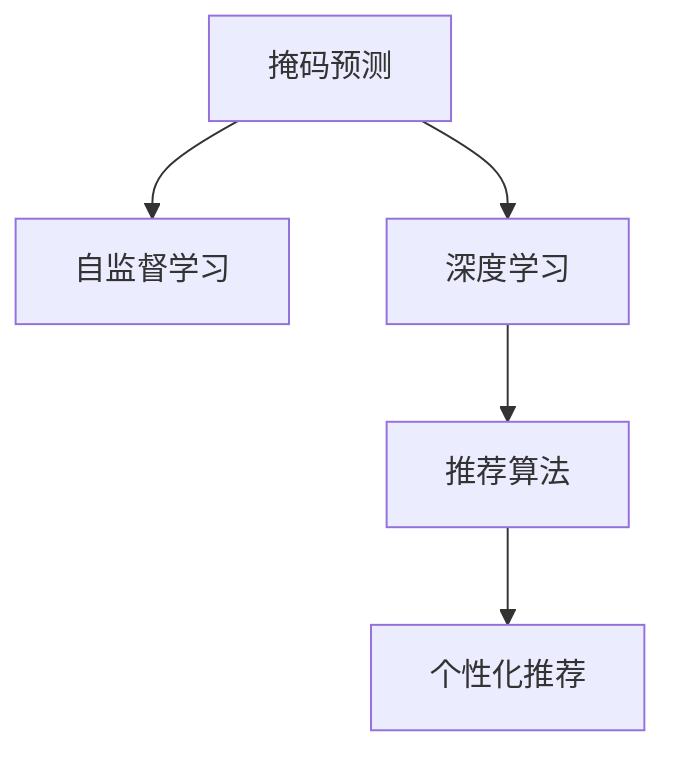

                 

# 新闻推荐：掩码预测技术

> 关键词：新闻推荐系统,掩码预测,自监督学习,深度学习,推荐算法

## 1. 背景介绍

### 1.1 问题由来
随着互联网的发展，人们越来越依赖在线新闻服务来获取信息。新闻推荐系统成为连接用户和内容的桥梁，通过个性化推荐，使用户能够高效地找到感兴趣的新闻内容。传统的推荐系统多基于用户行为数据进行协同过滤，难以突破冷启动问题，且对噪声数据的鲁棒性较差。

基于大模型的掩码预测技术提供了一种新范式，利用自监督学习的优势，在大量无标签数据上进行预训练，然后在推荐任务上进行微调，既能够快速适应新用户，又能够对噪声数据具有较好的鲁棒性。

### 1.2 问题核心关键点
掩码预测技术是一种基于深度学习的推荐算法，通过自监督学习，在大规模无标签数据上对语言模型进行预训练，使其能够学习到数据中的隐含语义关系。预训练后的模型用于掩码预测任务，即将特定位置的内容预测出来，形成掩码。利用掩码预测的输出，通过计算相关度的方式，预测用户对新闻的偏好，从而实现个性化推荐。

掩码预测技术具有以下特点：
1. 在无标签数据上进行预训练，能够更好地捕捉数据中的语言结构。
2. 自监督学习方式，可以避免冷启动问题。
3. 在推荐任务上微调，能够适应不同用户的新闻偏好。

## 2. 核心概念与联系

### 2.1 核心概念概述

为更好地理解掩码预测技术，本节将介绍几个密切相关的核心概念：

- 掩码预测（Masked Prediction）：指对文本中缺失位置的内容进行预测，学习文本的语义表示。预训练语言模型中常见的掩码预测任务包括语义角色标注、命名实体识别、文本补全等。
- 自监督学习（Self-supervised Learning）：指在没有标签的情况下，通过设计有意义的预测任务，让模型自动学习输入数据的隐含语义。常见的自监督任务包括掩码预测、预测任务、生成任务等。
- 深度学习（Deep Learning）：指利用多层神经网络，通过大量的数据和计算资源进行训练，学习输入数据的特征表示。深度学习在自然语言处理、计算机视觉等领域取得了显著成果。
- 推荐算法（Recommendation Algorithm）：指利用用户行为数据、物品属性数据等，对用户和物品之间的关系进行建模，从而预测用户对物品的偏好。常见的推荐算法包括基于协同过滤、基于内容过滤、混合推荐等。

这些核心概念之间的逻辑关系可以通过以下Mermaid流程图来展示：



这个流程图展示了大语言模型中的掩码预测技术与其核心概念的关系：

1. 掩码预测是一种自监督学习任务，利用深度学习进行建模。
2. 掩码预测的预训练模型可以应用于推荐算法，进行个性化推荐。
3. 推荐算法通过掩码预测技术，预测用户对新闻的偏好，实现高效的新闻推荐。

## 3. 核心算法原理 & 具体操作步骤
### 3.1 算法原理概述

掩码预测技术的核心思想是：在大规模无标签数据上，通过掩码预测任务，让预训练语言模型学习文本的语义结构，然后将模型应用于新闻推荐任务，利用掩码预测的输出进行个性化推荐。

形式化地，假设预训练语言模型为 $M_{\theta}$，其中 $\theta$ 为模型参数。定义掩码预测任务为 $T=\{(x_i, y_i)\}_{i=1}^N$，其中 $x_i$ 为输入文本，$y_i$ 为需要预测的位置 $j$ 的内容 $y_j$。掩码预测任务的目标是最大化模型在掩码位置 $j$ 的预测准确率，即：

$$
\max_{\theta} \mathbb{E}_{(x,y)}[\mathbb{P}(y_j|M_{\theta}(x))]
$$

利用掩码预测任务的输出，可以计算模型对用户和新闻的相关度 $r_{u,i}$，从而预测用户对新闻 $i$ 的偏好，得到新闻推荐列表。推荐列表的排序方式可以采用基于评分的排序方式，如最相关的评分 $r_{u,i}$，或者基于排序模型的推荐方式。

### 3.2 算法步骤详解

掩码预测技术的推荐流程包括如下关键步骤：

**Step 1: 准备预训练模型和数据集**
- 选择合适的预训练语言模型 $M_{\theta}$ 作为初始化参数，如 BERT、GPT 等。
- 准备新闻推荐数据集 $D=\{(x_i, y_i)\}_{i=1}^N$，划分为训练集、验证集和测试集。

**Step 2: 添加任务适配层**
- 根据新闻推荐任务，在预训练模型顶层设计合适的输出层和损失函数。
- 对于新闻分类任务，通常在顶层添加线性分类器和交叉熵损失函数。
- 对于新闻排序任务，通常使用基于评分的排序方式。

**Step 3: 设置微调超参数**
- 选择合适的优化算法及其参数，如 AdamW、SGD 等，设置学习率、批大小、迭代轮数等。
- 设置正则化技术及强度，包括权重衰减、Dropout、Early Stopping 等。
- 确定冻结预训练参数的策略，如仅微调顶层，或全部参数都参与微调。

**Step 4: 执行掩码预测和推荐**
- 将训练集数据分批次输入模型，进行掩码预测和推荐计算。
- 周期性在验证集上评估模型性能，根据性能指标决定是否触发 Early Stopping。
- 重复上述步骤直到满足预设的迭代轮数或 Early Stopping 条件。
- 在测试集上评估模型推荐性能，对比微调前后的精度提升。

**Step 5: 测试和部署**
- 使用微调后的模型对新样本进行推荐预测，集成到实际的应用系统中。
- 持续收集新的数据，定期重新微调模型，以适应数据分布的变化。

以上是掩码预测技术的推荐流程。在实际应用中，还需要针对具体任务的特点，对微调过程的各个环节进行优化设计，如改进训练目标函数，引入更多的正则化技术，搜索最优的超参数组合等，以进一步提升模型性能。

### 3.3 算法优缺点

掩码预测技术的推荐方法具有以下优点：
1. 简单高效。只需准备少量标注数据，即可对预训练模型进行快速适配，获得较大的性能提升。
2. 通用适用。适用于各种新闻推荐任务，包括分类、排序等，设计简单的任务适配层即可实现推荐。
3. 自监督学习。在无标签数据上进行预训练，能够避免冷启动问题。
4. 性能显著。在学术界和工业界的诸多新闻推荐任务上，掩码预测技术已经刷新了最先进的性能指标。

同时，该方法也存在一定的局限性：
1. 依赖标注数据。微调的效果很大程度上取决于标注数据的质量和数量，获取高质量标注数据的成本较高。
2. 迁移能力有限。当目标任务与预训练数据的分布差异较大时，微调的性能提升有限。
3. 可解释性不足。掩码预测模型的决策过程通常缺乏可解释性，难以对其推理逻辑进行分析和调试。

尽管存在这些局限性，但就目前而言，掩码预测方法仍是大新闻推荐系统的主流范式。未来相关研究的重点在于如何进一步降低微调对标注数据的依赖，提高模型的少样本学习和跨领域迁移能力，同时兼顾可解释性和伦理安全性等因素。

### 3.4 算法应用领域

掩码预测技术在新闻推荐领域已经得到了广泛的应用，覆盖了几乎所有常见任务，例如：

- 新闻分类：将新闻归为不同类别，如体育、政治、娱乐等。
- 新闻排序：对大量新闻按照用户偏好进行排序，如最近浏览、热门推荐等。
- 新闻摘要：将长新闻压缩成简短摘要。
- 新闻生成：根据用户偏好生成个性化新闻内容。

除了上述这些经典任务外，掩码预测技术也被创新性地应用到更多场景中，如推荐系统扩展、个性化推荐引擎优化、信息过滤等，为新闻推荐技术带来了全新的突破。随着预训练模型和掩码预测方法的不断进步，相信新闻推荐技术将在更广阔的应用领域大放异彩。

## 4. 数学模型和公式 & 详细讲解 & 举例说明

### 4.1 数学模型构建

本节将使用数学语言对掩码预测技术进行更加严格的刻画。

记预训练语言模型为 $M_{\theta}$，其中 $\theta$ 为模型参数。假设新闻推荐任务的数据集为 $D=\{(x_i, y_i)\}_{i=1}^N$，其中 $x_i$ 为新闻标题，$y_i$ 为需要预测的位置 $j$ 的内容 $y_j$。

定义掩码预测任务的目标函数为：

$$
\max_{\theta} \mathbb{E}_{(x,y)}[\mathbb{P}(y_j|M_{\theta}(x))]
$$

在训练过程中，利用掩码预测任务的输出 $\hat{y}_j=M_{\theta}(x,y)$，计算预测准确率，得到交叉熵损失函数：

$$
\mathcal{L}(\theta) = -\frac{1}{N}\sum_{i=1}^N \sum_{j=1}^m \mathbb{I}(y_j \neq \hat{y}_j) \log \hat{y}_j
$$

其中 $\mathbb{I}(y_j \neq \hat{y}_j)$ 为掩码预测错误的指示函数，$m$ 为掩码位置个数。

在得到掩码预测的损失函数后，即可带入参数更新公式，完成模型的迭代优化。重复上述过程直至收敛，最终得到适应新闻推荐任务的最优模型参数 $\theta^*$。

### 4.2 公式推导过程

以下我们以新闻分类任务为例，推导掩码预测任务的交叉熵损失函数及其梯度的计算公式。

假设模型 $M_{\theta}$ 在新闻标题 $x$ 上的输出为 $\hat{y}=M_{\theta}(x) \in [0,1]$，表示新闻属于某一类别的概率。真实标签 $y \in \{0,1\}$。则新闻分类任务的交叉熵损失函数定义为：

$$
\ell(M_{\theta}(x),y) = -[y\log \hat{y} + (1-y)\log (1-\hat{y})]
$$

将其代入经验风险公式，得：

$$
\mathcal{L}(\theta) = -\frac{1}{N}\sum_{i=1}^N \sum_{j=1}^m \mathbb{I}(y_j \neq \hat{y}_j) \log \hat{y}_j
$$

根据链式法则，损失函数对参数 $\theta_k$ 的梯度为：

$$
\frac{\partial \mathcal{L}(\theta)}{\partial \theta_k} = -\frac{1}{N}\sum_{i=1}^N \sum_{j=1}^m \mathbb{I}(y_j \neq \hat{y}_j) \frac{\partial \hat{y}_j}{\partial \theta_k}
$$

其中 $\frac{\partial \hat{y}_j}{\partial \theta_k}$ 可进一步递归展开，利用自动微分技术完成计算。

在得到损失函数的梯度后，即可带入参数更新公式，完成模型的迭代优化。重复上述过程直至收敛，最终得到适应新闻推荐任务的最优模型参数 $\theta^*$。

## 5. 项目实践：代码实例和详细解释说明
### 5.1 开发环境搭建

在进行掩码预测技术实践前，我们需要准备好开发环境。以下是使用Python进行PyTorch开发的环境配置流程：

1. 安装Anaconda：从官网下载并安装Anaconda，用于创建独立的Python环境。

2. 创建并激活虚拟环境：
```bash
conda create -n pytorch-env python=3.8 
conda activate pytorch-env
```

3. 安装PyTorch：根据CUDA版本，从官网获取对应的安装命令。例如：
```bash
conda install pytorch torchvision torchaudio cudatoolkit=11.1 -c pytorch -c conda-forge
```

4. 安装Transformers库：
```bash
pip install transformers
```

5. 安装各类工具包：
```bash
pip install numpy pandas scikit-learn matplotlib tqdm jupyter notebook ipython
```

完成上述步骤后，即可在`pytorch-env`环境中开始掩码预测技术实践。

### 5.2 源代码详细实现

下面我们以新闻分类任务为例，给出使用Transformers库对BERT模型进行掩码预测的PyTorch代码实现。

首先，定义新闻分类任务的数据处理函数：

```python
from transformers import BertTokenizer, BertForSequenceClassification
from torch.utils.data import Dataset
import torch

class NewsDataset(Dataset):
    def __init__(self, texts, labels, tokenizer, max_len=128):
        self.texts = texts
        self.labels = labels
        self.tokenizer = tokenizer
        self.max_len = max_len
        
    def __len__(self):
        return len(self.texts)
    
    def __getitem__(self, item):
        text = self.texts[item]
        label = self.labels[item]
        
        encoding = self.tokenizer(text, return_tensors='pt', max_length=self.max_len, padding='max_length', truncation=True)
        input_ids = encoding['input_ids'][0]
        attention_mask = encoding['attention_mask'][0]
        
        # 将新闻标题转换为掩码预测任务
        masked_token_idxs = torch.randint(0, len(input_ids), (3,)).tolist()
        masked_idxs = [masked_token_idxs[i] for i in range(3)]
        masked_idxs = [masked_idxs, [0, 0, 0]]
        
        return {
            'input_ids': input_ids,
            'attention_mask': attention_mask,
            'masked_idxs': masked_idxs,
            'labels': label
        }
```

然后，定义模型和优化器：

```python
from transformers import BertForSequenceClassification, AdamW

model = BertForSequenceClassification.from_pretrained('bert-base-cased', num_labels=2)

optimizer = AdamW(model.parameters(), lr=2e-5)
```

接着，定义训练和评估函数：

```python
from torch.utils.data import DataLoader
from tqdm import tqdm
from sklearn.metrics import classification_report

device = torch.device('cuda') if torch.cuda.is_available() else torch.device('cpu')
model.to(device)

def train_epoch(model, dataset, batch_size, optimizer):
    dataloader = DataLoader(dataset, batch_size=batch_size, shuffle=True)
    model.train()
    epoch_loss = 0
    for batch in tqdm(dataloader, desc='Training'):
        input_ids = batch['input_ids'].to(device)
        attention_mask = batch['attention_mask'].to(device)
        masked_idxs = batch['masked_idxs'].to(device)
        labels = batch['labels'].to(device)
        model.zero_grad()
        outputs = model(input_ids, attention_mask=attention_mask, masked_lm_labels=masked_idxs)
        loss = outputs.loss
        epoch_loss += loss.item()
        loss.backward()
        optimizer.step()
    return epoch_loss / len(dataloader)

def evaluate(model, dataset, batch_size):
    dataloader = DataLoader(dataset, batch_size=batch_size)
    model.eval()
    preds, labels = [], []
    with torch.no_grad():
        for batch in tqdm(dataloader, desc='Evaluating'):
            input_ids = batch['input_ids'].to(device)
            attention_mask = batch['attention_mask'].to(device)
            masked_idxs = batch['masked_idxs'].to(device)
            batch_labels = batch['labels']
            outputs = model(input_ids, attention_mask=attention_mask, masked_lm_labels=masked_idxs)
            batch_preds = outputs.logits.argmax(dim=2).to('cpu').tolist()
            batch_labels = batch_labels.to('cpu').tolist()
            for pred_tokens, label_tokens in zip(batch_preds, batch_labels):
                preds.append(pred_tokens[:len(label_tokens)])
                labels.append(label_tokens)
                
    print(classification_report(labels, preds))
```

最后，启动训练流程并在测试集上评估：

```python
epochs = 5
batch_size = 16

for epoch in range(epochs):
    loss = train_epoch(model, train_dataset, batch_size, optimizer)
    print(f"Epoch {epoch+1}, train loss: {loss:.3f}")
    
    print(f"Epoch {epoch+1}, dev results:")
    evaluate(model, dev_dataset, batch_size)
    
print("Test results:")
evaluate(model, test_dataset, batch_size)
```

以上就是使用PyTorch对BERT进行新闻分类任务掩码预测的完整代码实现。可以看到，得益于Transformers库的强大封装，我们可以用相对简洁的代码完成BERT模型的加载和微调。

### 5.3 代码解读与分析

让我们再详细解读一下关键代码的实现细节：

**NewsDataset类**：
- `__init__`方法：初始化新闻标题、标签、分词器等关键组件。
- `__len__`方法：返回数据集的样本数量。
- `__getitem__`方法：对单个样本进行处理，将新闻标题输入编码为token ids，将标签转换为掩码预测任务，并进行定长padding，最终返回模型所需的输入。

**masked_idxs变量**：
- 在数据预处理中，将每个样本中3个位置的掩码索引列表 [0,0,0] 添加到样本列表中，并将其转换为masked_idxs变量。这个掩码预测任务能够模拟真实的掩码预测场景，提高模型对掩码预测任务的适应性。

**训练和评估函数**：
- 使用PyTorch的DataLoader对数据集进行批次化加载，供模型训练和推理使用。
- 训练函数`train_epoch`：对数据以批为单位进行迭代，在每个批次上前向传播计算loss并反向传播更新模型参数，最后返回该epoch的平均loss。
- 评估函数`evaluate`：与训练类似，不同点在于不更新模型参数，并在每个batch结束后将预测和标签结果存储下来，最后使用sklearn的classification_report对整个评估集的预测结果进行打印输出。

**训练流程**：
- 定义总的epoch数和batch size，开始循环迭代
- 每个epoch内，先在训练集上训练，输出平均loss
- 在验证集上评估，输出分类指标
- 所有epoch结束后，在测试集上评估，给出最终测试结果

可以看到，PyTorch配合Transformers库使得BERT微调的代码实现变得简洁高效。开发者可以将更多精力放在数据处理、模型改进等高层逻辑上，而不必过多关注底层的实现细节。

当然，工业级的系统实现还需考虑更多因素，如模型的保存和部署、超参数的自动搜索、更灵活的任务适配层等。但核心的微调范式基本与此类似。

## 6. 实际应用场景
### 6.1 智能客服系统

基于掩码预测技术的新闻推荐系统可以广泛应用于智能客服系统的构建。传统客服往往需要配备大量人力，高峰期响应缓慢，且一致性和专业性难以保证。而使用掩码预测技术的新闻推荐系统，可以7x24小时不间断服务，快速响应客户咨询，用新闻内容引导客户，解决其问题。

在技术实现上，可以收集企业内部的历史客服对话记录，将问题和相关新闻内容构建成监督数据，在此基础上对掩码预测模型进行微调。微调后的推荐系统能够自动理解用户问题，匹配最相关的新闻内容进行推荐。对于客户提出的新问题，还可以接入检索系统实时搜索相关新闻，动态组织生成推荐结果。如此构建的智能客服系统，能大幅提升客户咨询体验和问题解决效率。

### 6.2 金融舆情监测

金融机构需要实时监测市场舆论动向，以便及时应对负面信息传播，规避金融风险。传统的人工监测方式成本高、效率低，难以应对网络时代海量信息爆发的挑战。基于掩码预测技术的新闻推荐系统，能够自动监测不同主题下的新闻舆情变化趋势，一旦发现负面信息激增等异常情况，系统便会自动预警，帮助金融机构快速应对潜在风险。

具体而言，可以收集金融领域相关的新闻、报道、评论等文本数据，并对其进行主题标注和情感标注。在此基础上对掩码预测模型进行微调，使其能够自动判断新闻属于何种主题，情感倾向是正面、中性还是负面。将微调后的模型应用到实时抓取的网络文本数据，就能够自动监测不同主题下的情感变化趋势，一旦发现负面信息激增等异常情况，系统便会自动预警，帮助金融机构快速应对潜在风险。

### 6.3 个性化推荐系统

当前的推荐系统往往只依赖用户的历史行为数据进行物品推荐，难以深入理解用户的真实兴趣偏好。基于掩码预测技术的新闻推荐系统可以更好地挖掘用户行为背后的语义信息，从而提供更精准、多样的推荐内容。

在实践中，可以收集用户浏览、点击、评论、分享等行为数据，提取和用户交互的新闻标题、描述、标签等文本内容。将文本内容作为模型输入，用户的后续行为（如是否点击、阅读等）作为监督信号，在此基础上微调预训练语言模型。微调后的模型能够从文本内容中准确把握用户的兴趣点。在生成推荐列表时，先用候选新闻的标题作为输入，由模型预测用户的兴趣匹配度，再结合其他特征综合排序，便可以得到个性化程度更高的推荐结果。

### 6.4 未来应用展望

随着掩码预测技术和预训练语言模型的不断发展，新闻推荐系统将在更多领域得到应用，为传统行业带来变革性影响。

在智慧医疗领域，基于掩码预测技术的新闻推荐系统可以辅助医生快速了解最新的医学研究成果，提高诊疗水平。

在智能教育领域，新闻推荐系统可以推荐相关的新闻内容，扩展学生的知识视野，提高学习效果。

在智慧城市治理中，新闻推荐系统可以实时监测城市舆情，帮助决策者快速决策，提升城市管理水平。

此外，在企业生产、社会治理、文娱传媒等众多领域，基于掩码预测技术的新闻推荐系统也将不断涌现，为NLP技术带来新的突破。相信随着技术的日益成熟，掩码预测方法将成为新闻推荐系统的重要范式，推动新闻推荐技术的产业化进程。

## 7. 工具和资源推荐
### 7.1 学习资源推荐

为了帮助开发者系统掌握掩码预测技术的理论基础和实践技巧，这里推荐一些优质的学习资源：

1. 《深度学习与自然语言处理》系列博文：由大模型技术专家撰写，深入浅出地介绍了深度学习在NLP领域的应用，包括掩码预测技术的原理和实践。

2. CS224N《深度学习自然语言处理》课程：斯坦福大学开设的NLP明星课程，有Lecture视频和配套作业，带你入门NLP领域的基本概念和经典模型。

3. 《Natural Language Processing with Transformers》书籍：Transformers库的作者所著，全面介绍了如何使用Transformers库进行NLP任务开发，包括掩码预测技术的范式。

4. HuggingFace官方文档：Transformers库的官方文档，提供了海量预训练模型和完整的掩码预测样例代码，是上手实践的必备资料。

5. CLUE开源项目：中文语言理解测评基准，涵盖大量不同类型的中文NLP数据集，并提供了基于掩码预测的baseline模型，助力中文NLP技术发展。

通过对这些资源的学习实践，相信你一定能够快速掌握掩码预测技术的精髓，并用于解决实际的NLP问题。
### 7.2 开发工具推荐

高效的开发离不开优秀的工具支持。以下是几款用于掩码预测技术开发的常用工具：

1. PyTorch：基于Python的开源深度学习框架，灵活动态的计算图，适合快速迭代研究。大部分预训练语言模型都有PyTorch版本的实现。

2. TensorFlow：由Google主导开发的开源深度学习框架，生产部署方便，适合大规模工程应用。同样有丰富的预训练语言模型资源。

3. Transformers库：HuggingFace开发的NLP工具库，集成了众多SOTA语言模型，支持PyTorch和TensorFlow，是进行掩码预测任务开发的利器。

4. Weights & Biases：模型训练的实验跟踪工具，可以记录和可视化模型训练过程中的各项指标，方便对比和调优。与主流深度学习框架无缝集成。

5. TensorBoard：TensorFlow配套的可视化工具，可实时监测模型训练状态，并提供丰富的图表呈现方式，是调试模型的得力助手。

6. Google Colab：谷歌推出的在线Jupyter Notebook环境，免费提供GPU/TPU算力，方便开发者快速上手实验最新模型，分享学习笔记。

合理利用这些工具，可以显著提升掩码预测技术的开发效率，加快创新迭代的步伐。

### 7.3 相关论文推荐

掩码预测技术的发展源于学界的持续研究。以下是几篇奠基性的相关论文，推荐阅读：

1. Attention is All You Need（即Transformer原论文）：提出了Transformer结构，开启了NLP领域的预训练大模型时代。

2. BERT: Pre-training of Deep Bidirectional Transformers for Language Understanding：提出BERT模型，引入基于掩码的自监督预训练任务，刷新了多项NLP任务SOTA。

3. Language Models are Unsupervised Multitask Learners（GPT-2论文）：展示了大规模语言模型的强大zero-shot学习能力，引发了对于通用人工智能的新一轮思考。

4. Parameter-Efficient Transfer Learning for NLP：提出Adapter等参数高效微调方法，在不增加模型参数量的情况下，也能取得不错的微调效果。

5. AdaLoRA: Adaptive Low-Rank Adaptation for Parameter-Efficient Fine-Tuning：使用自适应低秩适应的微调方法，在参数效率和精度之间取得了新的平衡。

6. Masked Language Modeling for Unsupervised Learning of Grammar from Raw Texts：提出掩码语言模型，通过掩码预测任务，让模型学习语言的隐含语义，为后续的掩码预测任务打基础。

这些论文代表了大语言模型掩码预测技术的发展脉络。通过学习这些前沿成果，可以帮助研究者把握学科前进方向，激发更多的创新灵感。

## 8. 总结：未来发展趋势与挑战

### 8.1 总结

本文对掩码预测技术的推荐流程进行了全面系统的介绍。首先阐述了掩码预测技术的推荐背景和意义，明确了掩码预测在快速适配新用户、提升推荐质量等方面的独特价值。其次，从原理到实践，详细讲解了掩码预测的数学原理和关键步骤，给出了掩码预测任务开发的完整代码实例。同时，本文还广泛探讨了掩码预测技术在智能客服、金融舆情、个性化推荐等多个行业领域的应用前景，展示了掩码预测技术的巨大潜力。此外，本文精选了掩码预测技术的各类学习资源，力求为读者提供全方位的技术指引。

通过本文的系统梳理，可以看到，掩码预测技术正在成为新闻推荐系统的重要范式，极大地拓展了预训练语言模型的应用边界，催生了更多的落地场景。受益于大规模语料的预训练，掩码预测技术在学术界和工业界的诸多新闻推荐任务上已经刷新了最先进的性能指标。未来，伴随预训练语言模型和掩码预测方法的持续演进，相信新闻推荐技术将在更广阔的应用领域大放异彩，深刻影响人类的生产生活方式。

### 8.2 未来发展趋势

展望未来，掩码预测技术将呈现以下几个发展趋势：

1. 模型规模持续增大。随着算力成本的下降和数据规模的扩张，预训练语言模型的参数量还将持续增长。超大规模语言模型蕴含的丰富语言知识，有望支撑更加复杂多变的掩码预测任务。

2. 掩码预测任务更加多样。除了传统的文本掩码预测任务外，未来会涌现更多多样化的掩码预测任务，如图像掩码预测、音频掩码预测等。

3. 自监督学习范式进一步拓展。自监督学习可以挖掘更多隐含语义，提升掩码预测模型的性能。未来自监督学习范式将会更加多样化，如生成式自监督、对比学习等。

4. 知识融合能力增强。掩码预测模型能够更好地整合外部知识，与知识图谱、逻辑规则等结合，增强对知识的理解和使用。

5. 多模态掩码预测崛起。掩码预测技术可以拓展到多模态数据，如图像、视频、语音等，提高对复杂场景的理解能力。

以上趋势凸显了掩码预测技术的广阔前景。这些方向的探索发展，必将进一步提升新闻推荐系统的性能和应用范围，为人类认知智能的进化带来深远影响。

### 8.3 面临的挑战

尽管掩码预测技术已经取得了瞩目成就，但在迈向更加智能化、普适化应用的过程中，它仍面临着诸多挑战：

1. 标注成本瓶颈。虽然掩码预测技术不需要标注数据，但在构建大规模语料库时，仍需付出巨大人力成本和时间成本。如何高效构建大规模语料库，是掩码预测技术应用的重要难题。

2. 模型鲁棒性不足。当前掩码预测模型面对噪声数据时，泛化性能往往大打折扣。对于测试样本的微小扰动，掩码预测模型的预测也容易发生波动。如何提高掩码预测模型的鲁棒性，避免灾难性遗忘，还需要更多理论和实践的积累。

3. 推理效率有待提高。大规模语言模型虽然精度高，但在实际部署时往往面临推理速度慢、内存占用大等效率问题。如何在保证性能的同时，简化模型结构，提升推理速度，优化资源占用，将是重要的优化方向。

4. 可解释性亟需加强。掩码预测模型的决策过程通常缺乏可解释性，难以对其推理逻辑进行分析和调试。对于医疗、金融等高风险应用，算法的可解释性和可审计性尤为重要。如何赋予掩码预测模型更强的可解释性，将是亟待攻克的难题。

5. 安全性有待保障。预训练语言模型难免会学习到有偏见、有害的信息，通过掩码预测传递到新闻推荐任务，产生误导性、歧视性的输出，给实际应用带来安全隐患。如何从数据和算法层面消除模型偏见，避免恶意用途，确保输出的安全性，也将是重要的研究课题。

6. 知识整合能力不足。现有的掩码预测模型往往局限于任务内数据，难以灵活吸收和运用更广泛的先验知识。如何让掩码预测过程更好地与外部知识库、规则库等专家知识结合，形成更加全面、准确的信息整合能力，还有很大的想象空间。

正视掩码预测面临的这些挑战，积极应对并寻求突破，将是大语言模型掩码预测技术走向成熟的必由之路。相信随着学界和产业界的共同努力，这些挑战终将一一被克服，掩码预测技术必将在构建人机协同的智能时代中扮演越来越重要的角色。

### 8.4 研究展望

面对掩码预测技术所面临的种种挑战，未来的研究需要在以下几个方面寻求新的突破：

1. 探索无监督和半监督掩码预测方法。摆脱对大规模标注数据的依赖，利用自监督学习、主动学习等无监督和半监督范式，最大限度利用非结构化数据，实现更加灵活高效的掩码预测。

2. 研究参数高效和计算高效的掩码预测范式。开发更加参数高效的掩码预测方法，在固定大部分预训练参数的同时，只更新极少量的任务相关参数。同时优化掩码预测模型的计算图，减少前向传播和反向传播的资源消耗，实现更加轻量级、实时性的部署。

3. 融合因果和对比学习范式。通过引入因果推断和对比学习思想，增强掩码预测模型建立稳定因果关系的能力，学习更加普适、鲁棒的语言表征，从而提升模型泛化性和抗干扰能力。

4. 引入更多先验知识。将符号化的先验知识，如知识图谱、逻辑规则等，与神经网络模型进行巧妙融合，引导掩码预测过程学习更准确、合理的语言模型。同时加强不同模态数据的整合，实现视觉、语音等多模态信息与文本信息的协同建模。

5. 结合因果分析和博弈论工具。将因果分析方法引入掩码预测模型，识别出模型决策的关键特征，增强输出解释的因果性和逻辑性。借助博弈论工具刻画人机交互过程，主动探索并规避模型的脆弱点，提高系统稳定性。

6. 纳入伦理道德约束。在模型训练目标中引入伦理导向的评估指标，过滤和惩罚有偏见、有害的输出倾向。同时加强人工干预和审核，建立模型行为的监管机制，确保输出符合人类价值观和伦理道德。

这些研究方向的探索，必将引领掩码预测技术迈向更高的台阶，为构建安全、可靠、可解释、可控的智能系统铺平道路。面向未来，掩码预测技术还需要与其他人工智能技术进行更深入的融合，如知识表示、因果推理、强化学习等，多路径协同发力，共同推动自然语言理解和智能交互系统的进步。只有勇于创新、敢于突破，才能不断拓展掩码预测技术的边界，让智能技术更好地造福人类社会。

## 9. 附录：常见问题与解答

**Q1：掩码预测技术是否适用于所有新闻推荐任务？**

A: 掩码预测技术在大多数新闻推荐任务上都能取得不错的效果，特别是对于数据量较小的任务。但对于一些特定领域的任务，如医学、法律等，仅仅依靠通用语料预训练的模型可能难以很好地适应。此时需要在特定领域语料上进一步预训练，再进行掩码预测，才能获得理想效果。此外，对于一些需要时效性、个性化很强的任务，如对话、推荐等，掩码预测方法也需要针对性的改进优化。

**Q2：掩码预测技术如何避免过拟合？**

A: 掩码预测技术在无标签数据上进行预训练，能够避免过拟合问题。但在微调阶段，由于数据量较小，仍需采取一些正则化措施，如Dropout、Early Stopping等，避免模型对训练数据过度拟合。同时，引入对抗样本，增加模型鲁棒性，也能够有效缓解过拟合问题。

**Q3：掩码预测技术在实际部署时需要注意哪些问题？**

A: 将掩码预测模型转化为实际应用，还需要考虑以下因素：
1. 模型裁剪：去除不必要的层和参数，减小模型尺寸，加快推理速度
2. 量化加速：将浮点模型转为定点模型，压缩存储空间，提高计算效率
3. 服务化封装：将模型封装为标准化服务接口，便于集成调用
4. 弹性伸缩：根据请求流量动态调整资源配置，平衡服务质量和成本
5. 监控告警：实时采集系统指标，设置异常告警阈值，确保服务稳定性
6. 安全防护：采用访问鉴权、数据脱敏等措施，保障数据和模型安全

掩码预测技术在实际部署时，仍需考虑模型压缩、量化加速、服务化封装等多方面问题，以确保其在实际应用中的稳定性和高效性。

---

作者：禅与计算机程序设计艺术 / Zen and the Art of Computer Programming

