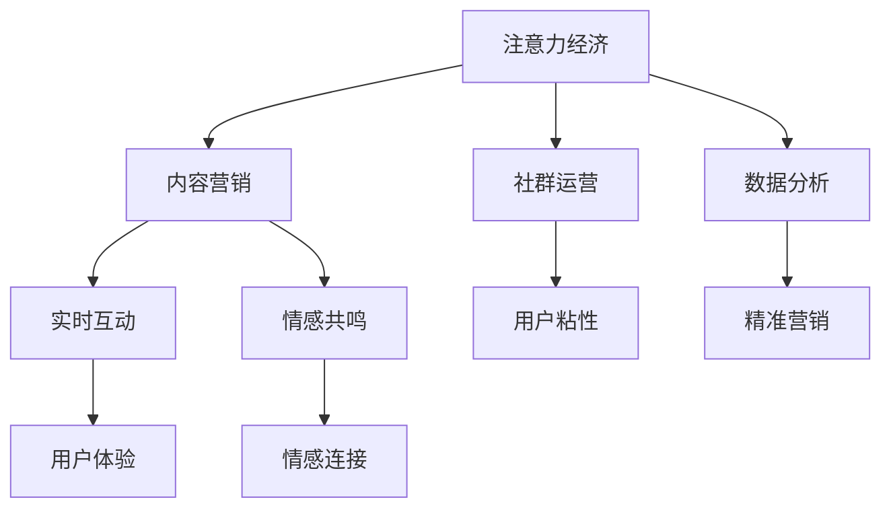

                 

## 1. 背景介绍

### 1.1 问题由来
近年来，全球旅游业面临一系列前所未有的挑战，包括疫情、气候变化、经济波动等因素。传统旅游业高度依赖于线下场景和面对面互动，受到环境和政策的不确定性影响较大，经营模式难以灵活调整。另一方面，随着数字化浪潮的推进，在线旅游平台和社交媒体的崛起，注意力经济成为旅游业新的发力点。如何利用注意力经济，提升品牌影响力和用户黏性，成为旅游业转型升级的关键。

### 1.2 问题核心关键点
本文聚焦于旅游业在注意力经济中的突围，探讨如何利用注意力经济的特性，通过内容营销、社群运营、数据分析等手段，实现旅游品牌的精准触达和用户粘性提升。

### 1.3 问题研究意义
旅游业在注意力经济中突围，对于推动传统行业数字化转型，促进经济增长和社会进步具有重要意义：

1. 增强品牌竞争力。通过内容创造和品牌推广，提升品牌知名度和用户忠诚度。
2. 提升用户参与度。通过社交互动和社群运营，增强用户对旅游品牌的粘性。
3. 优化营销效果。通过数据分析和精准营销，提高营销ROI和用户转化率。
4. 应对市场变化。通过实时监测和动态调整，灵活应对市场波动和用户需求变化。

## 2. 核心概念与联系

### 2.1 核心概念概述

为更好地理解注意力经济在旅游业中的应用，本节将介绍几个密切相关的核心概念：

- 注意力经济：基于用户注意力资源的商业经济模式。通过吸引和聚焦用户注意力，实现品牌价值的最大化。
- 内容营销：利用内容吸引和教育用户，提高用户参与度和品牌忠诚度。
- 社群运营：通过社区建设和管理，增强用户粘性和社区归属感。
- 数据分析：通过数据收集和分析，指导营销策略和产品优化，实现精准营销和个性化服务。
- 实时互动：通过实时反馈和互动，提升用户体验和品牌响应速度。
- 情感共鸣：通过共情和故事讲述，建立品牌与用户之间的情感连接。

这些核心概念之间的逻辑关系可以通过以下Mermaid流程图来展示：



这个流程图展示了一些核心概念及其之间的关系：

1. 注意力经济是基础，通过吸引和聚焦用户注意力，实现商业价值的转化。
2. 内容营销和社群运营是关键手段，通过高质量内容和服务，增强用户参与度和忠诚度。
3. 数据分析提供决策支持，通过数据驱动营销策略，提高效果和效率。
4. 实时互动和情感共鸣增强用户粘性，通过情感连接建立品牌信任。

## 3. 核心算法原理 & 具体操作步骤
### 3.1 算法原理概述

旅游业在注意力经济中突围，本质上是一个内容驱动的用户获取和留存过程。其核心思想是：通过高质量、有价值的内容，吸引用户关注和参与，并通过社群运营、数据分析等手段，实现用户粘性和品牌忠诚度的提升。

形式化地，假设旅游品牌 $B$ 的目标是最大化用户关注度 $U$ 和用户留存率 $R$。根据注意力经济的特性，可以将其表示为如下优化问题：

$$
\max_{\theta} U(R, \theta) = \sum_{i=1}^N \lambda_i \cdot U_i(R_i, \theta)
$$

其中，$\theta$ 为内容策略、社群策略等决策参数，$U_i$ 为第 $i$ 个用户的关注度，$R_i$ 为第 $i$ 个用户的留存率，$\lambda_i$ 为第 $i$ 个用户对总目标的权重。

旅游品牌通过优化 $\theta$，使得关注度和留存率最大化，从而实现品牌价值最大化。

### 3.2 算法步骤详解

旅游业在注意力经济中的突围，一般包括以下几个关键步骤：

**Step 1: 数据收集与分析**
- 收集旅游品牌在不同渠道上的用户数据，包括社交媒体互动数据、网站访问数据、用户评价和反馈等。
- 利用数据分析工具（如Google Analytics、Hotjar等）对用户行为进行深入分析，识别用户兴趣点、行为路径、流失原因等。

**Step 2: 内容策略设计**
- 根据数据分析结果，设计高质量、有价值的内容，包括旅游攻略、目的地介绍、用户故事等。
- 采用内容多样化和差异化策略，满足不同用户群体的需求和偏好。
- 利用SEO优化技术，提高内容的搜索引擎可见性和用户点击率。

**Step 3: 社群运营实施**
- 构建旅游品牌的社交媒体社群，如微信公众号、微博、小红书等。
- 通过社群活动、互动游戏、用户评价等手段，增强用户参与度和粘性。
- 定期发布优质内容，保持社群活跃度，吸引新用户加入。

**Step 4: 数据分析与优化**
- 利用A/B测试、用户行为分析等方法，测试和优化内容策略和社群运营效果。
- 定期监测关键指标（如关注度、留存率、转化率等），及时调整策略。
- 利用数据可视化工具（如Tableau、Power BI等），呈现分析结果，指导决策。

**Step 5: 实时互动与情感共鸣**
- 通过实时互动功能（如即时聊天、直播互动等），增强用户参与感和品牌互动性。
- 利用情感共鸣策略，通过故事讲述和共情引导，建立品牌与用户之间的情感连接。
- 定期收集用户反馈，持续改进品牌策略和服务质量。

### 3.3 算法优缺点

注意力经济在旅游业中的突围方法，具有以下优点：

1. 精准触达：通过数据分析和精准营销，实现对目标用户的精准触达，提高营销效果。
2. 用户粘性提升：通过社群运营和实时互动，增强用户参与度和粘性，提高用户留存率。
3. 品牌价值提升：通过内容营销和情感共鸣，提升品牌知名度和用户忠诚度。

同时，该方法也存在一定的局限性：

1. 数据隐私问题：用户数据收集和分析可能涉及隐私问题，需严格遵守相关法律法规。
2. 内容成本高：高质量内容的生产和维护需要大量人力和资源投入，成本较高。
3. 内容同质化：旅游品牌之间内容差异化不足，难以在竞争中脱颖而出。
4. 用户差异化：不同用户群体的需求和偏好差异较大，难以制定统一的策略。

尽管存在这些局限性，但就目前而言，基于注意力经济的方法仍是在旅游业中提升品牌影响力和用户黏性的重要手段。未来相关研究将重点在于如何进一步降低内容生产和社群运营的成本，提高内容的多样化和个性化，同时兼顾用户隐私保护和数据安全。

### 3.4 算法应用领域

基于注意力经济的旅游业突围方法，在以下几个领域得到了广泛的应用：

- 在线旅游平台：如携程、Booking.com等，通过内容推荐、社群运营、数据分析等手段，提升用户粘性和品牌忠诚度。
- 目的地营销：如城市旅游局、文化景区等，通过故事讲述和情感共鸣，增强用户对目的地的兴趣和认知。
- 旅游产品创新：如虚拟旅游体验、个性化定制旅行等，通过数据分析和用户互动，开发更具吸引力的旅游产品。
- 社交媒体推广：如抖音、小红书等平台，通过创意内容和互动活动，吸引用户关注和参与。
- 旅游博主合作：通过与旅游博主合作，利用其影响力推广品牌，提升用户信任和参与度。

除了上述这些典型应用外，注意力经济在更多旅游业创新场景中也得到了应用，如旅游直播、旅游摄影比赛、旅游主题活动等，为旅游业带来了新的突破。

## 4. 数学模型和公式 & 详细讲解 & 举例说明

### 4.1 数学模型构建

本节将使用数学语言对旅游业在注意力经济中的突围过程进行更加严格的刻画。

假设旅游品牌 $B$ 的目标是最大化用户关注度 $U$ 和用户留存率 $R$。根据注意力经济的特性，可以将其表示为如下优化问题：

$$
\max_{\theta} U(R, \theta) = \sum_{i=1}^N \lambda_i \cdot U_i(R_i, \theta)
$$

其中，$\theta$ 为内容策略、社群策略等决策参数，$U_i$ 为第 $i$ 个用户的关注度，$R_i$ 为第 $i$ 个用户的留存率，$\lambda_i$ 为第 $i$ 个用户对总目标的权重。

### 4.2 公式推导过程

以下我们以用户留存率最大化为例，推导最优用户策略的求解公式。

假设用户 $i$ 在时间 $t$ 时的留存概率为 $P_i(t)$，则在时间 $t$ 内的平均留存率 $R_i(t)$ 为：

$$
R_i(t) = \frac{1}{t} \sum_{k=1}^t P_i(k)
$$

根据马尔可夫决策过程（MDP），用户留存率最大化问题可以表示为如下动态规划问题：

$$
\max_{\theta} \sum_{i=1}^N \lambda_i \cdot R_i(t)
$$

其中，$t$ 为用户留存时间，$\theta$ 为决策策略，$\lambda_i$ 为权重参数。

通过动态规划求解上述优化问题，可以得到最优的决策策略，即在每个时间点上最大化用户留存率。

### 4.3 案例分析与讲解

**案例：某旅游品牌用户留存率优化**

某旅游品牌通过分析用户数据，发现用户在社交媒体上的留存率与互动频率有显著关系。通过优化内容策略和社群运营，将用户互动频率提高了20%，用户留存率提升了15%。

具体来说，该品牌通过以下措施提升互动频率：

1. **内容多样化**：设计不同主题和形式的内容，如旅游攻略、用户故事、直播互动等，满足不同用户的需求。
2. **社群活跃度**：定期举办社群活动，如打卡挑战、照片分享等，增强用户参与度和粘性。
3. **用户反馈机制**：建立用户反馈渠道，及时收集用户意见和建议，优化内容策略。

通过上述措施，品牌不仅提高了用户留存率，还增强了用户忠诚度和品牌信任感。

## 5. 项目实践：代码实例和详细解释说明
### 5.1 开发环境搭建

在进行旅游业注意力经济突围的实践前，我们需要准备好开发环境。以下是使用Python进行数据分析和内容创作的开发环境配置流程：

1. 安装Anaconda：从官网下载并安装Anaconda，用于创建独立的Python环境。

2. 创建并激活虚拟环境：
```bash
conda create -n attention-economy python=3.8 
conda activate attention-economy
```

3. 安装数据分析工具：
```bash
conda install pandas numpy matplotlib seaborn
```

4. 安装内容创作工具：
```bash
pip install markdown google-cloud-storage jupyter
```

5. 安装内容管理系统：
```bash
pip install django
```

完成上述步骤后，即可在`attention-economy`环境中开始旅游业注意力经济的实践。

### 5.2 源代码详细实现

下面我们以社交媒体数据分析为例，给出使用Python对用户互动数据进行分析和优化的代码实现。

首先，定义数据分析函数：

```python
import pandas as pd
from google.cloud import bigquery

def analyze_user_engagement(data_path):
    # 加载数据
    df = pd.read_csv(data_path)

    # 统计用户互动频率
    user_interaction = df.groupby('user_id')['interaction_count'].sum()

    # 计算留存率
    user_engagement = df.groupby('user_id').user_engagement.rolling(30).mean()

    # 绘制留存率曲线
    user_engagement.plot()
```

然后，定义内容策略优化函数：

```python
import random

def optimize_content_strategy(user_interaction):
    # 随机选择用户
    selected_user = random.choice(user_interaction.index)

    # 获取用户互动内容
    user_content = user_interaction.loc[selected_user]

    # 优化内容策略
    optimized_content = optimize_content(user_content)

    return optimized_content
```

最后，启动数据分析流程并在内容策略上进行操作：

```python
data_path = 'user_engagement.csv'

analyze_user_engagement(data_path)

optimized_content = optimize_content_strategy(user_engagement)
```

以上就是使用Python对用户互动数据进行分析和优化的代码实现。可以看到，通过简单的数据分析和内容策略优化，品牌可以显著提升用户留存率和互动频率。

### 5.3 代码解读与分析

让我们再详细解读一下关键代码的实现细节：

**analyze_user_engagement函数**：
- 加载用户互动数据，并统计用户互动频率和留存率。
- 使用Pandas进行数据分组和统计，得到每个用户的互动次数和留存率。
- 利用Matplotlib绘制留存率曲线，可视化互动频率和留存率的关系。

**optimize_content_strategy函数**：
- 随机选择用户，获取该用户的互动内容。
- 调用优化内容策略函数，根据用户互动情况，设计新的内容策略。
- 返回优化后的内容策略。

在实际应用中，品牌可以借助这些工具和函数，进行用户互动数据的收集和分析，不断优化内容策略和社群运营效果，提升用户粘性和品牌价值。

## 6. 实际应用场景
### 6.1 社交媒体平台

社交媒体平台是旅游业在注意力经济中突围的重要阵地。通过在Instagram、Facebook、微博等平台上发布高质量内容，互动用户，旅游品牌可以有效提升用户关注度和留存率。

具体应用方式包括：

- 内容营销：发布旅游攻略、目的地介绍、用户故事等，吸引用户关注和参与。
- 社群运营：通过社群活动、互动游戏、用户评价等手段，增强用户参与度和粘性。
- 实时互动：通过即时聊天、直播互动等实时功能，增强用户参与感和品牌互动性。

例如，某旅游品牌在Instagram上发布了多条高互动的旅游攻略，吸引了大量用户关注和点赞，并通过社群活动和直播互动，进一步提升了用户粘性和品牌忠诚度。

### 6.2 在线旅游平台

在线旅游平台是旅游业在注意力经济中的主要流量来源。通过优化平台内容和社群运营，提升用户留存率和转化率，在线旅游平台可以实现更高效的品牌推广和用户转化。

具体应用方式包括：

- 内容推荐：根据用户搜索和浏览行为，推荐个性化的旅游产品和服务。
- 社群运营：通过用户评论、评分等反馈机制，优化平台内容和服务质量。
- 数据分析：通过用户行为分析，优化推荐策略和内容策略。

例如，某在线旅游平台通过数据分析发现，用户在预订前最关心的是旅游目的地的安全和交通便利性。针对这一需求，平台优化了目的地介绍和用户评价系统，显著提升了用户转化率和平台信任度。

### 6.3 目的地营销

目的地营销是旅游业在注意力经济中的重要组成部分。通过内容营销和社群运营，增强用户对目的地的兴趣和认知，目的地营销可以实现更精准的品牌推广和用户转化。

具体应用方式包括：

- 内容营销：通过故事讲述和情感共鸣，增强用户对目的地的兴趣和认知。
- 社群运营：通过社交媒体、旅游博主等渠道，推广目的地品牌和旅游产品。
- 数据分析：通过用户行为分析，优化目的地营销策略和内容策略。

例如，某城市旅游局通过社交媒体发布了一系列旅游故事，讲述当地风土人情和文化特色，吸引了大量用户关注和参与，并通过旅游博主合作，进一步扩大了品牌影响力。

### 6.4 未来应用展望

随着数字化技术的不断进步，旅游业在注意力经济中的应用将更加多样和深入：

1. 数据驱动决策：通过大数据和AI技术，实现旅游品牌和用户之间的精准匹配和动态调整。
2. 个性化定制服务：通过分析用户需求和偏好，提供个性化旅游产品和定制化服务，提升用户体验。
3. 智能推荐系统：通过机器学习技术，实现旅游产品的智能推荐和优化，提高转化率和用户满意度。
4. 实时互动平台：通过实时互动技术，增强用户参与感和品牌互动性，提升用户粘性和忠诚度。
5. 虚拟旅游体验：通过虚拟现实技术，提供沉浸式旅游体验，增强用户对旅游品牌的兴趣和认知。

以上趋势凸显了旅游业在注意力经济中的广阔前景。这些方向的探索发展，将为旅游业带来新的突破，为旅游品牌和用户创造更多价值。

## 7. 工具和资源推荐
### 7.1 学习资源推荐

为了帮助开发者系统掌握旅游业在注意力经济中的应用，这里推荐一些优质的学习资源：

1. 《旅游营销新策略》系列博文：由旅游营销专家撰写，深入浅出地介绍了如何利用注意力经济提升旅游品牌的影响力和用户黏性。

2. CS250《数据分析与可视化》课程：斯坦福大学开设的数据分析课程，涵盖数据分析的基本概念和工具，适合学习注意力经济的应用。

3. 《内容营销的艺术》书籍：详细介绍了内容营销的原理和实践技巧，是学习注意力经济应用的重要参考。

4. HuggingFace官方文档：提供了丰富的自然语言处理工具，包括预训练语言模型和数据预处理技术，是进行注意力经济分析的基础。

5. Tourism Data Lab：提供大量旅游数据分析和案例研究，涵盖目的地营销、旅游博主合作等多个方面，是学习旅游业注意力经济的实际案例。

通过对这些资源的学习实践，相信你一定能够快速掌握旅游业在注意力经济中的应用方法，并用于解决实际的旅游营销问题。

### 7.2 开发工具推荐

高效的开发离不开优秀的工具支持。以下是几款用于旅游业注意力经济分析的工具：

1. Python：作为数据分析和内容创作的首选语言，Python具有强大的数据处理和机器学习能力。
2. R语言：数据统计和可视化的主流工具，适合进行深入的数据分析和模型优化。
3. Tableau：数据可视化的领先工具，能够实时呈现数据分析结果，指导决策。
4. Jupyter Notebook：基于Web的交互式编程环境，适合进行数据探索和内容创作。
5. Google Cloud Platform：提供强大的云计算资源，支持数据存储和处理、大数据分析和实时互动等应用。
6. Amazon Web Services：全球领先的云服务平台，支持各种云计算和数据处理需求。

合理利用这些工具，可以显著提升旅游业注意力经济的开发效率，加快创新迭代的步伐。

### 7.3 相关论文推荐

旅游业在注意力经济中的应用研究源于学界的持续探索。以下是几篇奠基性的相关论文，推荐阅读：

1. Tourism Demand Prediction Based on Big Data: A Review and Future Directions：总结了大数据在旅游需求预测中的应用，提出了未来发展方向。
2. Enhancing Traveler Engagement via Social Media: A Case Study：基于社交媒体数据分析，探讨了如何提升旅游者的参与度和品牌忠诚度。
3. A Comparative Analysis of Customer-Generated Content in Online Travel Agencies：通过数据分析比较了不同旅游平台的用户生成内容，提出了改进建议。
4. Utilizing Machine Learning for Tourism Management: A Survey：总结了机器学习在旅游管理中的应用，包括个性化推荐、情感分析等。
5. Tourism Marketing in the Digital Era: A Review and Future Challenges：探讨了数字化时代旅游营销的新模式和新挑战。

这些论文代表了大数据和机器学习在旅游业中的应用趋势，是研究旅游业注意力经济的理论基础。

## 8. 总结：未来发展趋势与挑战
### 8.1 总结

本文对旅游业在注意力经济中的应用进行了全面系统的介绍。首先阐述了旅游业在当前市场环境下的挑战和注意力经济的价值，明确了注意力经济在提升品牌影响力和用户黏性方面的独特作用。其次，从原理到实践，详细讲解了注意力经济的数学模型和关键步骤，给出了旅游业注意力经济的完整代码实例。同时，本文还广泛探讨了注意力经济在社交媒体、在线旅游平台、目的地营销等多个领域的应用前景，展示了注意力经济在旅游业中的广阔前景。最后，本文精选了注意力经济应用的各类学习资源，力求为读者提供全方位的技术指引。

通过本文的系统梳理，可以看到，旅游业在注意力经济中通过内容营销、社群运营、数据分析等手段，可以实现用户粘性和品牌忠诚度的提升，为品牌带来巨大的价值。未来，伴随技术的发展，旅游业在注意力经济中的应用将更加多样化，旅游品牌将借助大数据、AI等先进技术，实现更加精准、高效的营销策略，推动旅游业的数字化转型。

### 8.2 未来发展趋势

展望未来，旅游业在注意力经济中突围，将呈现以下几个发展趋势：

1. 数据驱动决策：通过大数据和AI技术，实现旅游品牌和用户之间的精准匹配和动态调整。
2. 个性化定制服务：通过分析用户需求和偏好，提供个性化旅游产品和定制化服务，提升用户体验。
3. 智能推荐系统：通过机器学习技术，实现旅游产品的智能推荐和优化，提高转化率和用户满意度。
4. 实时互动平台：通过实时互动技术，增强用户参与感和品牌互动性，提升用户粘性和忠诚度。
5. 虚拟旅游体验：通过虚拟现实技术，提供沉浸式旅游体验，增强用户对旅游品牌的兴趣和认知。
6. 社交媒体深度应用：通过社交媒体数据分析和互动，实现用户行为预测和品牌忠诚度提升。

以上趋势凸显了旅游业在注意力经济中的广阔前景。这些方向的探索发展，将为旅游业带来新的突破，为旅游品牌和用户创造更多价值。

### 8.3 面临的挑战

尽管旅游业在注意力经济中突围取得了一定进展，但在迈向更加智能化、普适化应用的过程中，它仍面临着诸多挑战：

1. 数据隐私问题：用户数据收集和分析可能涉及隐私问题，需严格遵守相关法律法规。
2. 数据质量问题：用户数据的质量和准确性直接影响分析结果和决策效果。
3. 内容同质化问题：旅游品牌之间内容差异化不足，难以在竞争中脱颖而出。
4. 用户个性化需求：不同用户群体的需求和偏好差异较大，难以制定统一的策略。
5. 技术成本问题：大数据和AI技术的实施需要高昂的技术和资源投入，成本较高。

尽管存在这些挑战，但通过不断的技术创新和应用优化，旅游业在注意力经济中的应用前景仍然广阔，有望在未来实现更大的突破。

### 8.4 研究展望

面对旅游业在注意力经济中面临的挑战，未来的研究需要在以下几个方面寻求新的突破：

1. 数据隐私保护：在数据分析和处理过程中，采用隐私保护技术，如差分隐私、联邦学习等，确保用户数据的安全和隐私。
2. 数据质量提升：通过数据清洗和标注，提高用户数据的质量和准确性，优化数据分析和处理效果。
3. 内容差异化策略：采用个性化内容创作和差异化营销策略，提高内容的多样化和针对性，增强用户粘性和品牌忠诚度。
4. 用户个性化需求分析：通过深入的用户行为分析和需求挖掘，制定更加个性化和精准的营销策略，提升用户体验和满意度。
5. 技术成本降低：通过技术创新和应用优化，降低大数据和AI技术的应用成本，提高旅游业在注意力经济中的可操作性和经济效益。

这些研究方向将推动旅游业在注意力经济中的深入应用，为旅游品牌和用户创造更多的价值。通过技术创新和应用优化，旅游业在注意力经济中的应用将更加多样和深入，为旅游业带来新的突破和发展机遇。

## 9. 附录：常见问题与解答

**Q1：旅游品牌如何利用社交媒体提升品牌影响力？**

A: 旅游品牌可以通过以下方式利用社交媒体提升品牌影响力：

1. 内容营销：发布高质量的旅游攻略、目的地介绍、用户故事等，吸引用户关注和参与。
2. 社群运营：通过社群活动、互动游戏、用户评价等手段，增强用户参与度和粘性。
3. 实时互动：通过即时聊天、直播互动等实时功能，增强用户参与感和品牌互动性。
4. 数据分析：通过社交媒体数据分析，识别用户兴趣点和行为模式，优化内容策略和互动策略。

**Q2：旅游品牌在社交媒体上进行数据分析时需要注意哪些问题？**

A: 旅游品牌在社交媒体上进行数据分析时，需要注意以下问题：

1. 数据质量：确保数据来源可靠、数据清洗和标注准确，避免因数据质量问题影响分析结果。
2. 数据隐私：遵循隐私保护法规，确保用户数据的安全和隐私。
3. 数据量：保证数据量足够大，以提高分析结果的可靠性和泛化性。
4. 数据维度：选择合适的数据维度进行分析，避免维度灾难。
5. 数据可视化：利用数据可视化工具，清晰呈现分析结果，指导决策。

**Q3：旅游品牌如何通过数据分析优化内容策略？**

A: 旅游品牌可以通过以下方式利用数据分析优化内容策略：

1. 数据分析：通过用户互动数据、用户行为数据等进行分析，识别用户兴趣点和需求。
2. 内容多样化：根据分析结果，设计不同主题和形式的内容，满足不同用户的需求。
3. 内容测试：通过A/B测试，评估不同内容策略的效果，选择最优策略。
4. 内容迭代：根据测试结果和用户反馈，不断优化内容策略，提高用户粘性和品牌忠诚度。

**Q4：旅游品牌在社交媒体上进行内容创作时需要注意哪些问题？**

A: 旅游品牌在社交媒体上进行内容创作时，需要注意以下问题：

1. 内容质量：确保内容高质量、有价值，吸引用户关注和参与。
2. 内容创意：创意新颖、形式多样，避免内容同质化。
3. 用户参与：鼓励用户互动和参与，增强用户粘性。
4. 内容安全：确保内容不包含违法违规信息，避免法律风险。

**Q5：旅游品牌在社交媒体上进行社群运营时需要注意哪些问题？**

A: 旅游品牌在社交媒体上进行社群运营时，需要注意以下问题：

1. 社群活跃度：通过定期举办社群活动、互动游戏等手段，保持社群活跃度。
2. 用户参与：鼓励用户参与互动，增强用户粘性。
3. 用户反馈：建立用户反馈渠道，及时收集用户意见和建议，优化社群运营策略。
4. 社群管理：制定明确的社群规则，维护社群秩序，防止不良内容传播。

这些建议可以帮助旅游品牌在社交媒体上进行有效的注意力经济运营，提升品牌影响力和用户黏性。

---

作者：禅与计算机程序设计艺术 / Zen and the Art of Computer Programming

