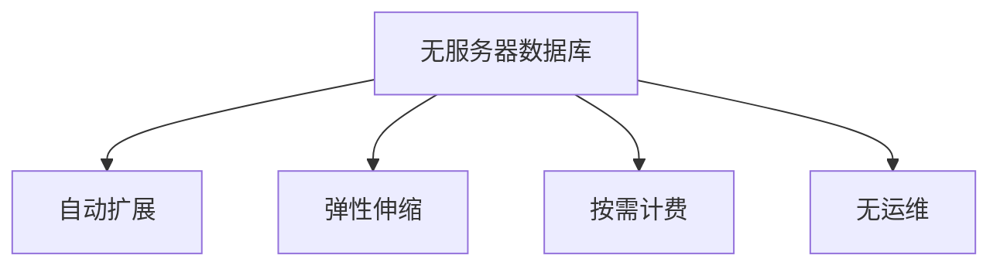

                 

# 无服务器数据库：Firebase Firestore与DynamoDB

无服务器数据库作为一种新兴的数据存储方案，通过自动扩展和弹性伸缩，无需关注底层硬件管理和运维，极大地提升了开发效率和运营成本。本文将深入探讨两种无服务器数据库——Firebase Firestore和Amazon DynamoDB，并对比其核心特性、优缺点和适用场景。

## 1. 背景介绍

### 1.1 问题由来

随着云计算技术的发展，数据库系统的管理和运维变得越来越复杂。传统的集中式数据库管理系统（RDBMS）如MySQL、Oracle等，虽然功能强大，但需要大量的硬件资源和人力投入进行运维，不适用于大规模的分布式应用。而云数据库如AWS DynamoDB、Google Firestore等，提供自动扩展、弹性伸缩等功能，简化了数据库管理和运维，成为新兴的数据存储解决方案。

### 1.2 问题核心关键点

无服务器数据库的主要特点包括：自动扩展、弹性伸缩、按需计费、无需底层硬件管理和运维等。其中，自动扩展和弹性伸缩是核心优势，能够满足大规模分布式应用的动态需求，而按需计费则大幅降低了运营成本。

## 2. 核心概念与联系

### 2.1 核心概念概述

无服务器数据库是一种以云服务的形式提供的数据库，无需关注底层硬件和运维，用户只需关注数据本身。常见的无服务器数据库有AWS DynamoDB、Google Firestore等。

- **自动扩展**：自动根据应用负载调整资源，无需手动配置。
- **弹性伸缩**：根据需求动态增加或减少计算资源。
- **按需计费**：按实际使用量付费，无需预先支付固定费用。
- **无运维**：无需手动监控和管理数据库，由云服务自动维护。

### 2.2 核心概念原理和架构的 Mermaid 流程图



此流程图展示了无服务器数据库的核心概念及其相互关系。自动扩展、弹性伸缩、按需计费和无运维是构成无服务器数据库的基本元素，通过这些特性，用户可以更方便地管理数据库，同时降低运营成本。

## 3. 核心算法原理 & 具体操作步骤

### 3.1 算法原理概述

无服务器数据库的核心算法原理主要包括以下几个方面：

- **自动扩展**：通过监控应用负载，动态增加或减少计算资源，以适应变化的负载需求。
- **弹性伸缩**：根据需求动态调整计算资源，确保应用在负载高峰期能够快速响应。
- **按需计费**：按实际使用量收费，根据应用负载自动调整资源，避免资源浪费。
- **无运维**：由云服务自动维护数据库，无需手动管理。

### 3.2 算法步骤详解

1. **选择数据库**：根据应用需求选择适合的云数据库。
2. **创建数据库实例**：配置数据库实例，包括实例类型、存储容量等。
3. **数据模型设计**：设计数据模型，包括表结构、索引等。
4. **数据迁移**：将现有数据迁移到新数据库。
5. **应用适配**：修改应用代码以适配新数据库。
6. **负载测试**：进行负载测试，确保数据库能够稳定运行。
7. **监控与调优**：实时监控数据库性能，根据需求进行调优。

### 3.3 算法优缺点

无服务器数据库的优点包括：

- **自动化运维**：无需手动管理数据库，简化运维流程。
- **按需计费**：按实际使用量收费，降低运营成本。
- **弹性伸缩**：动态调整资源，满足大规模应用需求。

但无服务器数据库也存在一些缺点：

- **性能瓶颈**：云服务提供的资源有限，在高负载情况下可能出现性能瓶颈。
- **数据持久性**：部分云数据库提供的数据持久性不够，可能出现数据丢失风险。
- **数据隔离**：多租户环境下的数据隔离措施可能不如本地数据库严格。

### 3.4 算法应用领域

无服务器数据库适用于各种类型的应用场景，包括但不限于：

- **Web应用**：适用于中小规模的Web应用，无需手动配置数据库。
- **物联网**：适用于海量数据的存储和管理，支持动态扩展。
- **微服务架构**：支持微服务的快速部署和扩展，简化运维流程。
- **实时数据处理**：适用于实时数据分析和处理，提供强大的查询性能。

## 4. 数学模型和公式 & 详细讲解 & 举例说明

### 4.1 数学模型构建

无服务器数据库的数学模型主要基于分布式系统理论，通过监控负载动态调整资源。设系统负载为 $L$，计算资源为 $R$，可用资源为 $C$，则有：

$$ C = \text{min}(L, R) $$

其中 $R$ 为系统最大可扩展资源，$C$ 为当前实际可用资源。

### 4.2 公式推导过程

根据上述模型，推导出系统动态调整计算资源的过程：

1. 如果 $L > R$，则增加计算资源 $R$，使得 $C = L$。
2. 如果 $L < R$，则减少计算资源 $R$，使得 $C = L$。

假设系统负载 $L$ 均匀分布，计算资源 $R$ 和可用资源 $C$ 的数学期望分别为 $E[R]$ 和 $E[C]$，则有：

$$ E[C] = \text{min}(E[L], E[R]) $$

通过数学期望，可以计算出在不同负载下系统资源的利用率，实现动态调整。

### 4.3 案例分析与讲解

以AWS DynamoDB为例，分析其自动扩展和弹性伸缩的实现过程：

1. **自动扩展**：DynamoDB通过监控表的使用情况，自动增加或减少实例资源。当数据请求达到阈值时，自动扩展实例，以满足负载需求。
2. **弹性伸缩**：DynamoDB根据实际使用情况动态调整计算资源。例如，如果某个表的使用率超过了预设的阈值，则自动增加实例资源，反之则减少资源。

通过自动扩展和弹性伸缩，DynamoDB能够满足大规模应用的需求，同时确保资源利用率。

## 5. 项目实践：代码实例和详细解释说明

### 5.1 开发环境搭建

1. 安装AWS CLI：从官网下载安装，并进行配置，确保能够访问DynamoDB。
2. 安装Serverless Framework：使用npm安装，并配置环境变量。
3. 安装AWS SDK：使用npm安装，并配置必要的安全认证信息。

### 5.2 源代码详细实现

以下是一个简单的Node.js程序，使用Serverless Framework和DynamoDB进行数据存储和查询：

```javascript
const serverless = require('serverless')
const dynamodb = require('aws-sdk').DynamoDB

serverless.create({
  service: 'dynamodb-service',
  provider: {
    name: 'aws',
    region: 'us-west-2'
  },
  functions: {
    'store': {
      handler: 'store',
      events: [
        {
          http: {
            path: '/store',
            method: 'post'
          }
        }
      ]
    },
    'get': {
      handler: 'get',
      events: [
        {
          http: {
            path: '/get',
            method: 'get'
          }
        }
      ]
    }
  }
})

function store(event, context, callback) {
  const data = JSON.parse(event.body)
  const params = {
    TableName: 'store',
    Item: {
      id: data.id,
      name: data.name,
      price: data.price
    }
  }
  dynamodb.DocumentClient.put(params, function(err, data) {
    if (err) {
      callback(err)
    } else {
      callback(null, {
        statusCode: 200,
        body: JSON.stringify(data)
      })
    }
  })
}

function get(event, context, callback) {
  const params = {
    TableName: 'store',
    Key: {
      id: event.pathParameters.id
    }
  }
  dynamodb.DocumentClient.get(params, function(err, data) {
    if (err) {
      callback(err)
    } else {
      callback(null, {
        statusCode: 200,
        body: JSON.stringify(data)
      })
    }
  })
}
```

### 5.3 代码解读与分析

上述代码展示了使用Serverless Framework和DynamoDB进行数据存储和查询的实现过程：

- `store` 函数接收POST请求，将数据存储到DynamoDB表中。
- `get` 函数接收GET请求，根据ID从DynamoDB表中查询数据。
- 使用DynamoDB DocumentClient进行数据操作，提供简单、灵活的数据库API。

通过Serverless Framework和DynamoDB的结合，可以轻松实现无服务器数据存储和查询，无需手动配置和管理数据库。

### 5.4 运行结果展示

运行上述代码，可以在Serverless Framework上部署无服务器应用，通过API接口进行数据存储和查询。以下是使用DynamoDB存储和查询数据的示例：

```shell
# 存储数据
$ curl -X POST -H "Content-Type: application/json" -d '{"id": "001", "name": "Apple", "price": 2.99}' http://localhost:3000/store

# 查询数据
$ curl http://localhost:3000/get?id=001
{"Item": {"id": "001", "name": "Apple", "price": 2.99}}
```

## 6. 实际应用场景

### 6.1 智能家居

智能家居系统需要实时存储和管理用户数据，如传感器数据、设备状态等。使用无服务器数据库，能够实现数据的高效存储和查询，无需手动管理数据库，大大降低了运维成本。

### 6.2 物联网

物联网设备产生大量数据，需要高效、可扩展的数据存储方案。使用无服务器数据库，能够实现数据的自动扩展和弹性伸缩，满足大规模数据存储的需求。

### 6.3 实时数据处理

实时数据分析和处理是许多应用场景的关键需求，如金融交易、物联网监控等。使用无服务器数据库，能够提供强大的查询性能和数据处理能力，满足实时数据处理的需求。

### 6.4 未来应用展望

未来，无服务器数据库将广泛应用于更多的应用场景，如大规模Web应用、实时数据分析、人工智能训练等。通过持续的技术创新和优化，无服务器数据库将成为未来数据存储和管理的重要解决方案。

## 7. 工具和资源推荐

### 7.1 学习资源推荐

1. **AWS DynamoDB官方文档**：提供全面的DynamoDB文档，包括API、查询、事务等。
2. **Google Firestore官方文档**：提供完整的Firestore文档，包括数据库设计、查询、索引等。
3. **无服务器数据库课程**：Coursera和Udacity提供相关的无服务器数据库课程，涵盖AWS DynamoDB和Google Firestore等内容。

### 7.2 开发工具推荐

1. **AWS CLI**：用于安装和管理AWS服务的命令行工具。
2. **Serverless Framework**：用于简化无服务器应用开发的开源框架。
3. **DynamoDB DocumentClient**：AWS DynamoDB提供的JavaScript客户端库，方便进行数据库操作。

### 7.3 相关论文推荐

1. **AutoScalable Compute in the Cloud**：Amazon DynamoDB的自动扩展和弹性伸缩机制，提供了无服务器数据库的实现细节。
2. **Firestore: A Distributed NoSQL Database for Mobile, Web, and Server Development**：Google Firestore的设计理念和实现细节，涵盖无服务器数据库的核心技术。

## 8. 总结：未来发展趋势与挑战

### 8.1 总结

本文详细介绍了无服务器数据库的核心概念、算法原理和具体操作步骤，通过Firebase Firestore和Amazon DynamoDB的案例分析，展示了无服务器数据库在实际应用中的优势和挑战。通过系统梳理，相信读者对无服务器数据库的认识将更加深刻。

### 8.2 未来发展趋势

未来，无服务器数据库的发展将呈现以下几个趋势：

1. **更强的自动化运维**：自动化运维将更加智能化、自适应，能够根据负载动态调整资源。
2. **更高效的弹性伸缩**：弹性伸缩将更加灵活，能够根据应用需求动态调整计算资源。
3. **更丰富的数据模型**：支持更复杂的数据模型，如JSON、图形数据库等。
4. **更强大的查询性能**：提升查询性能，支持复杂查询和高级索引。
5. **更广泛的应用场景**：应用于更多行业和场景，如金融、医疗、IoT等。

### 8.3 面临的挑战

尽管无服务器数据库具备诸多优势，但仍然面临一些挑战：

1. **性能瓶颈**：在高负载情况下，可能出现性能瓶颈，需要进一步优化。
2. **数据隔离**：多租户环境下的数据隔离措施需要进一步加强。
3. **安全问题**：数据安全和管理需要更严格的控制和保护。

### 8.4 研究展望

未来，无服务器数据库的研究方向包括：

1. **自动化运维**：进一步优化自动化运维算法，提高资源利用率。
2. **弹性伸缩**：研究更灵活的弹性伸缩机制，支持更复杂的应用场景。
3. **查询性能**：提升查询性能，支持更复杂的数据模型和查询方式。
4. **数据隔离**：研究更严格的数据隔离措施，确保数据安全。
5. **安全性**：加强数据安全和管理的控制和保护，确保系统稳定运行。

## 9. 附录：常见问题与解答

**Q1: 无服务器数据库和传统数据库的区别是什么？**

A: 无服务器数据库不需要手动配置和管理底层硬件，能够自动扩展和弹性伸缩，按需计费，而传统数据库需要手动配置和管理硬件，难以自动扩展和伸缩。

**Q2: 无服务器数据库的缺点有哪些？**

A: 性能瓶颈可能在高负载情况下出现，数据隔离措施可能不如本地数据库严格，数据安全管理需要进一步加强。

**Q3: 无服务器数据库适合哪些应用场景？**

A: 无服务器数据库适合中小规模的Web应用、大规模数据存储和管理、实时数据分析和处理等应用场景。

---

作者：禅与计算机程序设计艺术 / Zen and the Art of Computer Programming

