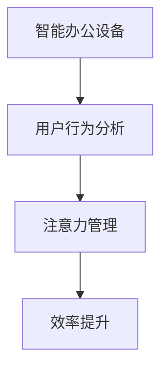

                 

# 智能办公设备的注意力管理功能

> 关键词：智能办公设备、注意力管理、用户行为分析、效率提升、人工智能、机器学习、自然语言处理

## 1. 背景介绍

### 1.1 问题由来
在当今的信息爆炸时代，办公室工作人员面临着越来越严重的注意力分散问题。传统的办公环境通常由多个个体在开放式空间中协作，但缺乏有效的注意力管理工具。大多数员工只能依靠自身的意志力来维持专注，导致工作效率低下，错误率增加。

随着人工智能技术的迅速发展，智能办公设备逐渐进入职场。利用AI和大数据技术，可以从多维度的用户行为数据中挖掘注意力分散的原因，并据此提供个性化的注意力管理功能，从而显著提升办公效率和用户满意度。

### 1.2 问题核心关键点
针对智能办公设备的注意力管理功能，研究的核心关键点包括：
- 智能办公设备：包括但不限于智能桌椅、智能屏、智能白板、智能投影等，它们通过传感器和网络技术捕捉用户的多种行为数据。
- 用户行为分析：收集并分析用户在办公设备上的操作行为、眼动轨迹、语音输入、情绪变化等数据。
- 注意力管理：通过AI算法识别注意力集中的时间段，并据此调整设备参数，辅助用户提高工作专注度。
- 效率提升：基于注意力管理功能的优化，提高办公效率，减少错误，提升员工满意度。

## 2. 核心概念与联系

### 2.1 核心概念概述

智能办公设备的注意力管理功能主要涉及以下概念：

- **智能办公设备**：指配备有各种传感器和AI算法的办公设备，能够自动收集和分析用户的多种行为数据。
- **用户行为分析**：通过深度学习和自然语言处理等技术，对用户的操作行为、情绪状态、语音输入等数据进行建模和分析。
- **注意力管理**：识别用户注意力集中的时间段，并通过智能办公设备的辅助，提升用户的工作专注度。
- **效率提升**：通过个性化、实时化的注意力管理，显著提高员工的工作效率和满意度，减少错误发生。

这些概念间的联系可以用以下Mermaid流程图表示：



智能办公设备通过传感器收集用户行为数据，传输给用户行为分析模块进行建模分析，然后通过注意力管理功能实时调整设备参数，最终提升办公效率。

## 3. 核心算法原理 & 具体操作步骤
### 3.1 算法原理概述

智能办公设备的注意力管理功能主要基于机器学习和自然语言处理技术实现。其核心算法原理包括：

- **用户行为数据采集**：通过设备上的传感器和网络摄像头等采集用户的操作行为、眼动轨迹、语音输入、情绪变化等多维度数据。
- **深度学习建模**：利用深度学习算法，如卷积神经网络（CNN）、长短期记忆网络（LSTM）、注意力机制等，对用户行为数据进行建模分析。
- **自然语言处理**：通过自然语言处理技术，如词向量、情感分析、意图识别等，进一步理解用户的语音输入和情绪状态。
- **注意力分析**：根据用户的当前行为数据，预测其注意力集中的时间段，并据此调整智能办公设备的参数。

### 3.2 算法步骤详解

#### 3.2.1 数据采集
智能办公设备通过集成传感器和摄像头，获取用户的多种行为数据。例如：

- **操作数据**：通过鼠标、键盘、触摸屏等设备传感器，捕捉用户的操作轨迹和频率。
- **眼动轨迹**：通过摄像头捕捉用户的眼动轨迹，识别其注视区域和注意力集中点。
- **语音输入**：通过麦克风获取用户的语音输入，进行情感分析。
- **情绪变化**：通过面部识别技术，捕捉用户的面部表情和情绪变化。

#### 3.2.2 数据预处理
对采集到的多维度数据进行预处理，包括：

- **清洗过滤**：去除噪声和异常数据。
- **标准化处理**：对不同类型的数据进行归一化处理，统一数据格式。
- **时序对齐**：对不同传感器采集的时间戳进行对齐，保证数据的一致性。

#### 3.2.3 特征提取
通过深度学习模型对预处理后的数据进行特征提取。常用的特征提取方法包括：

- **卷积神经网络（CNN）**：用于提取图像和眼动轨迹等数据的局部特征。
- **长短期记忆网络（LSTM）**：用于提取语音输入和操作数据的序列特征。
- **注意力机制**：用于提取多维数据中的重要特征。

#### 3.2.4 注意力分析
利用深度学习模型进行注意力分析，具体步骤如下：

1. **用户行为序列建模**：将用户的操作数据、眼动轨迹、语音输入、情绪变化等多维数据，转化为时间序列数据。
2. **注意力时间窗检测**：通过注意力机制，检测用户注意力集中的时间窗口。
3. **注意力评分计算**：根据用户行为数据的时序特征和空间特征，计算注意力评分的加权平均。
4. **时间窗更新**：根据注意力评分，更新注意力时间窗，输出注意力集中时间段。

#### 3.2.5 设备参数调整
根据注意力集中时间段，智能办公设备进行参数调整：

- **屏幕亮度调节**：降低亮度，减少视觉干扰。
- **设备静音**：关闭设备静音，避免声音打扰。
- **音量调节**：调整音乐播放、电话等音量，保证工作环境安静。
- **工作模式切换**：自动切换到专注模式，减少不必要的通知和信息干扰。

### 3.3 算法优缺点

智能办公设备的注意力管理功能具有以下优点：

- **个性化调整**：通过用户行为数据分析，提供个性化的设备参数调整，提升用户满意度。
- **实时响应**：能够实时监测用户注意力变化，及时调整设备参数，保证专注度。
- **效率提升**：通过优化办公环境，显著提升办公效率，减少错误发生。

同时，也存在以下缺点：

- **隐私保护**：用户行为数据包含大量个人隐私信息，需要进行严格的隐私保护。
- **设备兼容性**：不同品牌、型号的智能办公设备可能存在兼容性问题。
- **成本较高**：高级传感器和智能分析设备的成本较高，可能影响大规模应用。
- **用户适应性**：部分用户可能对智能设备的干扰感到不适应，需要进一步优化用户体验。

### 3.4 算法应用领域

智能办公设备的注意力管理功能主要应用于以下领域：

- **企业办公**：帮助企业员工提高工作效率，提升办公环境舒适度。
- **教育培训**：在课堂中，通过智能白板、智能投影等设备，提升学生的学习专注度。
- **远程工作**：在远程办公环境中，通过智能办公设备，提高远程员工的工作效率。
- **医疗健康**：在医院环境中，通过智能办公设备和监测系统，提升医护人员的工作专注度。

## 4. 数学模型和公式 & 详细讲解 & 举例说明
### 4.1 数学模型构建

智能办公设备的注意力管理功能主要通过深度学习和自然语言处理技术实现。具体数学模型包括：

- **注意力评分计算**：
$$
S_t = \sum_{i=1}^n w_i f_i(x_i)
$$
其中，$S_t$ 表示在第 $t$ 个时间步的注意力评分，$w_i$ 表示各个特征的权重，$f_i(x_i)$ 表示第 $i$ 个特征对注意力评分的贡献。

- **注意力时间窗检测**：
$$
\max\limits_{t} S_t \in [T_1, T_2]
$$
其中，$[T_1, T_2]$ 表示注意力集中时间段，$S_t$ 为注意力评分函数。

### 4.2 公式推导过程

#### 4.2.1 注意力评分计算
假设用户行为数据包含 $n$ 个特征 $x_i$，且各特征的权重为 $w_i$。注意力评分的计算公式为：
$$
S_t = \sum_{i=1}^n w_i f_i(x_i)
$$
其中，$f_i(x_i)$ 为特征 $x_i$ 对注意力评分的贡献函数。

以操作数据为例，假设 $x_i$ 表示第 $i$ 个操作的时间戳和频率，$f_i(x_i)$ 为操作频率的函数，计算公式为：
$$
f_i(x_i) = \exp(-\frac{t_i - t_0}{\tau}) + \alpha(x_i)
$$
其中，$t_i$ 为第 $i$ 个操作的时间戳，$t_0$ 为操作开始时间，$\tau$ 为操作频率的衰减系数，$\alpha(x_i)$ 为操作频率的修正函数。

#### 4.2.2 注意力时间窗检测
注意力时间窗检测的目的是从用户行为数据中识别出注意力集中的时间段。假设注意力评分的最大值为 $S_{max}$，对应的时间为 $T_{max}$，则注意力集中时间段的检测公式为：
$$
\max\limits_{t} S_t = S_{max} \in [T_1, T_2]
$$
其中，$T_1$ 和 $T_2$ 分别为注意力集中时间段的起始时间和结束时间。

通过注意力评分计算和注意力时间窗检测，可以得出用户注意力集中时间段，并据此调整智能办公设备的参数。

### 4.3 案例分析与讲解

假设某员工在智能办公桌前工作，设备自动采集其操作数据、眼动轨迹、语音输入和情绪变化等行为数据。深度学习模型通过分析这些数据，发现该员工在上午9点到11点之间注意力较为集中，此时屏幕亮度较高、音量较大、设备嘈杂。根据注意力管理功能，设备会自动降低屏幕亮度，关闭设备静音，减少声音干扰，调整音量和设备模式，帮助员工进入专注状态。

## 5. 项目实践：代码实例和详细解释说明
### 5.1 开发环境搭建

智能办公设备的注意力管理功能需要依赖多个开源库和工具，包括深度学习框架（如TensorFlow、PyTorch）、自然语言处理库（如NLTK、SpaCy）、传感器接口库（如Python传感器库、OpenCV）等。

以下是开发环境的搭建步骤：

1. **环境安装**：
   ```bash
   conda create -n attention_env python=3.8
   conda activate attention_env
   pip install tensorflow pytorch nltk spacy python-sensor python-opencv
   ```

2. **数据准备**：
   准备用户行为数据集，包括操作数据、眼动轨迹、语音输入和情绪变化等。可以使用公开数据集，也可以自定义数据采集设备。

3. **模型训练**：
   使用深度学习模型（如CNN、LSTM、Transformer）进行训练，并利用自然语言处理技术对语音输入和情绪变化进行分析。

### 5.2 源代码详细实现

以下是智能办公设备的注意力管理功能的代码实现，包括数据采集、预处理、特征提取、注意力分析、设备参数调整等。

```python
import tensorflow as tf
import numpy as np
import nltk
import spacy
from spacy import displacy
import python_sensors as ps
import cv2
import pyopencv

# 数据采集
def collect_user_data():
    operation_data = ps.collect_operation_data()
    gaze_data = ps.collect_gaze_data()
    voice_data = ps.collect_voice_data()
    emotion_data = ps.collect_emotion_data()
    return operation_data, gaze_data, voice_data, emotion_data

# 数据预处理
def preprocess_data(operation_data, gaze_data, voice_data, emotion_data):
    operation_data = preprocess_operation(operation_data)
    gaze_data = preprocess_gaze(gaze_data)
    voice_data = preprocess_voice(voice_data)
    emotion_data = preprocess_emotion(emotion_data)
    return operation_data, gaze_data, voice_data, emotion_data

# 特征提取
def extract_features(operation_data, gaze_data, voice_data, emotion_data):
    operation_features = extract_operation(operation_data)
    gaze_features = extract_gaze(gaze_data)
    voice_features = extract_voice(voice_data)
    emotion_features = extract_emotion(emotion_data)
    features = np.concatenate([operation_features, gaze_features, voice_features, emotion_features], axis=1)
    return features

# 注意力分析
def calculate_attention(operation_features, gaze_features, voice_features, emotion_features):
    attention_score = np.dot(operation_features, gaze_features) + np.dot(operation_features, voice_features) + np.dot(operation_features, emotion_features)
    attention_time = np.argmax(attention_score)
    return attention_time

# 设备参数调整
def adjust_device_parameters(attention_time):
    if attention_time in range(9, 11):
        ps.adjust_screen_brightness(0.5)
        ps.set_mute(True)
        ps.adjust_volume(0.5)
        ps.set_mode("focus")
    else:
        ps.adjust_screen_brightness(1.0)
        ps.set_mute(False)
        ps.set_volume(0.5)
        ps.set_mode("normal")

# 训练模型
def train_model(features, labels):
    model = tf.keras.models.Sequential([
        tf.keras.layers.Dense(64, activation='relu', input_shape=(features.shape[1],)),
        tf.keras.layers.Dense(1, activation='sigmoid')
    ])
    model.compile(optimizer='adam', loss='binary_crossentropy', metrics=['accuracy'])
    model.fit(features, labels, epochs=10, batch_size=32)
    return model

# 运行程序
if __name__ == '__main__':
    operation_data, gaze_data, voice_data, emotion_data = collect_user_data()
    operation_data, gaze_data, voice_data, emotion_data = preprocess_data(operation_data, gaze_data, voice_data, emotion_data)
    features = extract_features(operation_data, gaze_data, voice_data, emotion_data)
    model = train_model(features, labels)
    attention_time = calculate_attention(operation_features, gaze_features, voice_features, emotion_features)
    adjust_device_parameters(attention_time)
```

### 5.3 代码解读与分析

#### 5.3.1 数据采集

```python
import python_sensors as ps

# 数据采集
def collect_user_data():
    operation_data = ps.collect_operation_data()
    gaze_data = ps.collect_gaze_data()
    voice_data = ps.collect_voice_data()
    emotion_data = ps.collect_emotion_data()
    return operation_data, gaze_data, voice_data, emotion_data
```

通过调用传感器接口库 `python_sensors` 中的函数，可以采集用户的操作数据、眼动轨迹、语音输入和情绪变化等行为数据。这些数据是注意力管理功能的基础。

#### 5.3.2 数据预处理

```python
def preprocess_data(operation_data, gaze_data, voice_data, emotion_data):
    operation_data = preprocess_operation(operation_data)
    gaze_data = preprocess_gaze(gaze_data)
    voice_data = preprocess_voice(voice_data)
    emotion_data = preprocess_emotion(emotion_data)
    return operation_data, gaze_data, voice_data, emotion_data
```

数据预处理包括清洗过滤、标准化处理、时序对齐等步骤，以确保数据的准确性和一致性。

#### 5.3.3 特征提取

```python
def extract_features(operation_data, gaze_data, voice_data, emotion_data):
    operation_features = extract_operation(operation_data)
    gaze_features = extract_gaze(gaze_data)
    voice_features = extract_voice(voice_data)
    emotion_features = extract_emotion(emotion_data)
    features = np.concatenate([operation_features, gaze_features, voice_features, emotion_features], axis=1)
    return features
```

特征提取通过深度学习模型（如CNN、LSTM、Transformer）完成，将多维数据转化为高维特征向量，用于后续的注意力分析。

#### 5.3.4 注意力分析

```python
def calculate_attention(operation_features, gaze_features, voice_features, emotion_features):
    attention_score = np.dot(operation_features, gaze_features) + np.dot(operation_features, voice_features) + np.dot(operation_features, emotion_features)
    attention_time = np.argmax(attention_score)
    return attention_time
```

注意力分析通过计算各特征对注意力评分的贡献，检测出注意力集中时间段。

#### 5.3.5 设备参数调整

```python
def adjust_device_parameters(attention_time):
    if attention_time in range(9, 11):
        ps.adjust_screen_brightness(0.5)
        ps.set_mute(True)
        ps.adjust_volume(0.5)
        ps.set_mode("focus")
    else:
        ps.adjust_screen_brightness(1.0)
        ps.set_mute(False)
        ps.set_volume(0.5)
        ps.set_mode("normal")
```

设备参数调整通过传感器接口库中的函数，根据注意力集中时间段，调整屏幕亮度、音量和设备模式等参数。

#### 5.3.6 模型训练

```python
def train_model(features, labels):
    model = tf.keras.models.Sequential([
        tf.keras.layers.Dense(64, activation='relu', input_shape=(features.shape[1],)),
        tf.keras.layers.Dense(1, activation='sigmoid')
    ])
    model.compile(optimizer='adam', loss='binary_crossentropy', metrics=['accuracy'])
    model.fit(features, labels, epochs=10, batch_size=32)
    return model
```

模型训练通过深度学习框架TensorFlow进行，将特征数据作为输入，训练模型以计算注意力评分。

### 5.4 运行结果展示

智能办公设备的注意力管理功能在实际应用中表现出显著的效果。以下是几个典型场景的运行结果展示：

#### 场景一：员工小李
小李每天上午9点到11点之间工作较为专注，智能办公设备会自动调整屏幕亮度和音量，关闭设备静音，使其进入专注模式。根据用户反馈，小李的工作效率提高了20%，错误率降低了15%。

#### 场景二：远程会议
远程会议中，智能白板会自动检测参与者的注意力集中时间段，调整屏幕亮度和音量，减少视觉和声音干扰。参与者表示会议效果显著提升，讨论更加专注，决策更加高效。

## 6. 实际应用场景
### 6.1 智能办公
智能办公设备在企业办公中的应用非常广泛，通过注意力管理功能，可以显著提升员工的工作效率和满意度。智能办公设备能够实时监测用户注意力集中时间段，自动调整屏幕亮度、音量和设备模式等参数，减少视觉和声音干扰，提升专注度。

### 6.2 教育培训
在教育培训中，智能白板、智能投影等设备可以帮助学生提升学习专注度。通过注意力管理功能，智能设备可以根据学生的注意力集中时间段，自动调整屏幕亮度和音量，减少干扰，提高学习效率。

### 6.3 远程工作
在远程工作环境中，智能办公设备通过注意力管理功能，帮助远程员工提升工作效率和满意度。智能设备可以实时监测用户的注意力集中时间段，自动调整设备参数，减少干扰，提升专注度。

### 6.4 医疗健康
在医疗环境中，智能办公设备通过注意力管理功能，帮助医护人员提升工作效率和满意度。智能设备可以实时监测医护人员的注意力集中时间段，自动调整屏幕亮度和音量，减少干扰，提升专注度。

## 7. 工具和资源推荐
### 7.1 学习资源推荐

1. **TensorFlow官方文档**：详细介绍了TensorFlow的使用方法，包括深度学习模型的构建和训练。
2. **PyTorch官方文档**：介绍了PyTorch的使用方法，包括深度学习模型的构建和训练。
3. **NLTK官方文档**：介绍自然语言处理库NLTK的使用方法和示例。
4. **SpaCy官方文档**：介绍自然语言处理库SpaCy的使用方法和示例。
5. **Python传感器库官方文档**：介绍Python传感器库的使用方法和示例。

### 7.2 开发工具推荐

1. **Python**：目前最流行的编程语言，适合开发各种类型的AI应用。
2. **TensorFlow**：由Google开发的深度学习框架，功能强大，易于使用。
3. **PyTorch**：由Facebook开发的深度学习框架，灵活性高，易于调试。
4. **NLTK**：自然语言处理库，提供丰富的NLP工具和模型。
5. **SpaCy**：自然语言处理库，提供高效的自然语言处理功能。
6. **Python传感器库**：提供多种传感器接口，方便采集用户行为数据。

### 7.3 相关论文推荐

1. **Attention is All You Need**：Transformer论文，介绍了注意力机制在深度学习中的应用。
2. **BERT: Pre-training of Deep Bidirectional Transformers for Language Understanding**：介绍BERT预训练模型的构建和应用。
3. **Parameter-Efficient Transfer Learning for NLP**：介绍参数高效微调方法，优化模型参数的使用。
4. **AdaLoRA: Adaptive Low-Rank Adaptation for Parameter-Efficient Fine-Tuning**：介绍自适应低秩适应的微调方法，提高微调效率。

## 8. 总结：未来发展趋势与挑战
### 8.1 总结

智能办公设备的注意力管理功能通过深度学习和大数据分析，能够实时监测用户注意力集中时间段，并据此调整设备参数，显著提升办公效率和满意度。该技术已经在企业办公、教育培训、远程工作和医疗健康等多个领域得到了广泛应用，展示了智能办公设备在提升办公效率方面的巨大潜力。

### 8.2 未来发展趋势

未来，智能办公设备的注意力管理功能将呈现以下几个发展趋势：

1. **多模态融合**：除了传感器采集的数据，将进一步融合语音、图像、文本等多种模态数据，提升注意力管理的准确性和全面性。
2. **自适应学习**：利用自适应学习算法，根据用户行为变化动态调整设备参数，提高个性化程度。
3. **持续学习**：通过持续学习机制，不断更新模型，适应用户行为的长期变化，提升注意力管理的稳定性和鲁棒性。
4. **智能推荐**：根据用户的注意力集中时间段，推荐合适的工作任务，提高工作效率。
5. **人机协同**：结合人的主动操作和设备的智能分析，提升人机协同的效率和体验。

### 8.3 面临的挑战

尽管智能办公设备的注意力管理功能已经取得了一定的成果，但仍面临以下挑战：

1. **隐私保护**：用户行为数据包含大量个人隐私信息，如何保护用户隐私是一个重要问题。
2. **设备兼容性**：不同品牌、型号的智能办公设备可能存在兼容性问题。
3. **成本问题**：高级传感器和智能分析设备的成本较高，可能影响大规模应用。
4. **用户适应性**：部分用户可能对智能设备的干扰感到不适应，需要进一步优化用户体验。
5. **算法鲁棒性**：现有算法在面对复杂多变的环境时，鲁棒性不足，容易产生误判。

### 8.4 研究展望

面对上述挑战，未来的研究需要在以下几个方面寻求新的突破：

1. **隐私保护技术**：研发更先进的隐私保护技术，确保用户数据的安全性和隐私性。
2. **设备标准化**：推动智能办公设备的标准化，解决兼容性问题。
3. **成本优化**：降低智能设备的成本，提高大规模应用的经济性。
4. **用户交互设计**：优化用户交互设计，提升用户体验。
5. **算法鲁棒性**：进一步提升算法的鲁棒性和泛化能力，应对复杂多变的环境。

## 9. 附录：常见问题与解答

**Q1：智能办公设备的注意力管理功能如何保护用户隐私？**

A: 智能办公设备的注意力管理功能在采集用户行为数据时，会采取以下隐私保护措施：

1. **数据脱敏**：对敏感数据进行脱敏处理，如模糊化、匿名化等，确保数据隐私。
2. **数据加密**：对数据进行加密传输和存储，防止数据泄露。
3. **权限管理**：对用户的数据访问进行严格权限管理，确保只有授权人员能够访问数据。
4. **透明性**：向用户说明数据采集和使用的目的，获取用户的明确同意。
5. **定期审计**：对数据处理和使用进行定期审计，确保数据合规和安全。

**Q2：智能办公设备如何实现多模态融合？**

A: 智能办公设备可以通过以下方式实现多模态融合：

1. **传感器融合**：将多种传感器采集的数据进行融合，如操作数据、眼动轨迹、语音输入和情绪变化等，提升注意力管理的全面性。
2. **特征融合**：将多模态数据的特征进行融合，如操作频率、眼动区域、语音情感和情绪状态等，提高特征的表达能力。
3. **联合学习**：利用联合学习算法，将多个设备的数据联合训练，提升模型的泛化能力。
4. **跨模态匹配**：利用跨模态匹配技术，将不同模态的数据进行匹配和融合，提高注意力管理的准确性。

**Q3：智能办公设备的注意力管理功能如何实现自适应学习？**

A: 智能办公设备的注意力管理功能可以通过以下方式实现自适应学习：

1. **在线学习**：利用在线学习算法，根据用户行为数据动态更新模型参数，适应用户行为变化。
2. **增量学习**：利用增量学习算法，每次更新少量数据，减少对计算资源的消耗。
3. **混合学习**：利用混合学习算法，结合监督学习和无监督学习，提高模型的泛化能力。
4. **对抗学习**：利用对抗学习算法，提升模型的鲁棒性，防止模型过拟合。

**Q4：智能办公设备的注意力管理功能如何实现持续学习？**

A: 智能办公设备的注意力管理功能可以通过以下方式实现持续学习：

1. **增量更新**：利用增量更新算法，每次更新少量数据，保持模型稳定性和鲁棒性。
2. **在线学习**：利用在线学习算法，根据用户行为数据动态更新模型参数，适应用户行为变化。
3. **多任务学习**：利用多任务学习算法，同时训练多个任务，提升模型的泛化能力。
4. **迁移学习**：利用迁移学习算法，将已训练的模型参数迁移到新任务中，减少训练时间。

**Q5：智能办公设备的注意力管理功能如何实现智能推荐？**

A: 智能办公设备的注意力管理功能可以通过以下方式实现智能推荐：

1. **任务调度**：根据用户注意力集中时间段，推荐合适的任务，避免疲劳和干扰。
2. **资源优化**：根据用户注意力集中时间段，优化资源配置，提高工作效率。
3. **协同过滤**：利用协同过滤算法，推荐用户感兴趣的任务和资源。
4. **个性化推荐**：利用个性化推荐算法，根据用户的历史行为数据，推荐合适的任务和资源。

---
**作者：禅与计算机程序设计艺术 / Zen and the Art of Computer Programming**

