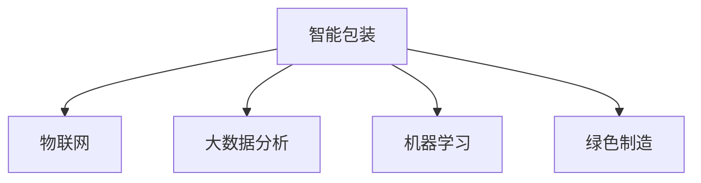

                 

# 智能包装创业：可持续与智能的包装解决方案

## 1. 背景介绍

### 1.1 问题由来

包装是现代物流和零售业中不可或缺的一环，它不仅关乎商品的外观和保质期，更影响着物流效率、市场营销和环保问题。传统包装材料多为一次性使用，不仅资源消耗大，还易对环境造成污染。随着环保意识的日益增强，企业越来越需要转向可持续包装的解决方案，以满足市场和政策的双重需求。

### 1.2 问题核心关键点

包装创业的核心在于如何将可持续和智能理念融入包装设计和物流过程。智能包装可以通过物联网、大数据和机器学习技术，实现货物状态的实时监测、供应链的优化和客户服务的提升。同时，可持续包装强调使用可降解材料和减少资源消耗，提升循环经济价值。

## 2. 核心概念与联系

### 2.1 核心概念概述

为更好地理解智能包装创业，本节将介绍几个密切相关的核心概念：

- 智能包装(Smart Packaging)：通过物联网、大数据、机器学习等技术，实现货物状态的实时监测、供应链的优化和客户服务的提升。
- 可持续包装(Sustainable Packaging)：使用可降解材料、减少资源消耗、提升循环经济价值。
- 物联网(IoT)：通过传感器、标签和互联网连接物品和设备，实现数据共享和自动化管理。
- 大数据分析(Big Data)：对海量数据进行收集、存储和分析，支持智能决策和优化流程。
- 机器学习(Machine Learning)：利用算法和模型，通过数据训练模型，实现预测、分类和优化等任务。
- 绿色制造(Green Manufacturing)：在包装设计和生产过程中，降低环境影响和资源消耗。

这些核心概念之间的逻辑关系可以通过以下Mermaid流程图来展示：



这个流程图展示智能包装的关键组件及其相互关系：

1. 智能包装通过物联网技术，实现货物状态的实时监测和供应链优化。
2. 大数据分析支持智能决策和优化流程，提升客户服务。
3. 机器学习利用数据训练模型，实现预测和优化。
4. 绿色制造在设计和生产过程中，降低环境影响和资源消耗。

## 3. 核心算法原理 & 具体操作步骤

### 3.1 算法原理概述

智能包装的实现涉及多个领域的知识，包括物联网、大数据分析和机器学习等。本节将概述这些核心技术的算法原理和操作步骤。

### 3.2 算法步骤详解

智能包装的实现步骤一般包括以下几个关键环节：

1. **智能传感器部署**：在包装盒或货物上安装传感器，收集货物状态信息，如温度、湿度、位置等。
2. **物联网数据传输**：传感器收集的数据通过无线或有线方式传输到云端，进行数据集中处理。
3. **大数据分析处理**：利用大数据分析技术，对上传的数据进行清洗、分析，提取有用的信息。
4. **机器学习模型训练**：通过训练机器学习模型，实现对货物状态的预测和优化。
5. **智能决策与优化**：利用分析结果，进行智能决策和优化，如调整供应链、优化物流路线等。
6. **绿色制造实践**：在包装设计和生产过程中，选择可降解材料和优化生产流程，实现绿色制造。

### 3.3 算法优缺点

智能包装的算法实现具有以下优点：

- 实时监测：物联网技术可以实现货物状态的实时监测，提升物流效率和客户满意度。
- 数据驱动：大数据分析为智能决策提供数据支持，提升决策的科学性和准确性。
- 自动化优化：机器学习模型能够自动优化供应链和物流路线，减少人为干预。
- 绿色环保：通过绿色制造技术，降低包装生产对环境的影响，符合可持续发展目标。

同时，也存在一些缺点：

- 初始投资高：传感器和物联网设备的部署需要较高的初始投资。
- 数据安全问题：大量数据上传和存储，可能带来数据隐私和安全风险。
- 技术门槛高：智能包装涉及多种复杂技术，需要专业人才进行开发和维护。
- 模型训练复杂：机器学习模型需要大量数据进行训练，训练过程复杂。

### 3.4 算法应用领域

智能包装技术已经在多个领域得到应用，如：

- 物流和运输：通过实时监测和数据驱动，提升物流效率和客户满意度。
- 零售和电子商务：实现库存管理、订单跟踪和客户服务。
- 医疗和医药：通过温度和湿度监测，确保药品的完整性和安全性。
- 食品和饮料：实时监测产品品质，保障食品安全。
- 包装设计和制造：利用绿色制造技术，实现可持续包装。

## 4. 数学模型和公式 & 详细讲解 & 举例说明

### 4.1 数学模型构建

智能包装的数学模型主要包括以下几个部分：

- **物联网数据模型**：描述传感器收集的数据及其传输过程。
- **大数据分析模型**：对上传数据进行清洗、聚合和分析。
- **机器学习模型**：通过数据训练模型，实现预测和分类。

### 4.2 公式推导过程

以温度监测为例，假设传感器每隔t时间间隔采集一次温度值，设t时刻的温度为T(t)，传感器误差为ε，则物联网数据模型可以表示为：

$$
T(t) = T(t-1) + \eta(t) + \epsilon
$$

其中，$\eta(t)$为温度变化量，满足高斯分布：

$$
\eta(t) \sim \mathcal{N}(\mu,\sigma^2)
$$

大数据分析模型通过平均值、方差等统计量进行数据清洗和聚合，生成时间序列数据。机器学习模型利用时间序列数据训练预测模型，如ARIMA模型：

$$
y(t) = c + \sum_{i=1}^{p} \alpha_i y(t-i) + \sum_{j=1}^{d} \beta_j \Delta^j y(t) + \sum_{k=1}^{q} \gamma_k \Delta^k \eta(t-k)
$$

其中，$\Delta$为差分算子，$p$、$d$和$q$为模型的参数。

### 4.3 案例分析与讲解

假设某电子商务公司对物流过程中的温度和湿度进行监测，利用物联网设备采集数据，上传至云端进行大数据分析，并训练ARIMA模型预测温度变化。其具体步骤如下：

1. **数据采集**：在包装盒上安装传感器，收集温度和湿度数据。
2. **数据传输**：传感器数据通过无线网络传输至云端。
3. **数据清洗**：使用大数据技术清洗上传的数据，去除异常值和噪声。
4. **数据分析**：生成时间序列数据，分析温度和湿度的变化趋势。
5. **模型训练**：使用ARIMA模型训练预测温度变化。
6. **智能决策**：根据预测结果，调整物流路线和温度控制策略。

## 5. 项目实践：代码实例和详细解释说明

### 5.1 开发环境搭建

在实践智能包装项目时，需要搭建合适的开发环境。以下是使用Python进行开发的环境配置流程：

1. 安装Anaconda：从官网下载并安装Anaconda，用于创建独立的Python环境。

2. 创建并激活虚拟环境：
```bash
conda create -n smart-packaging python=3.8 
conda activate smart-packaging
```

3. 安装Python依赖：
```bash
pip install pandas numpy scikit-learn matplotlib statsmodels pyproj pytz
```

4. 安装IoT库：
```bash
pip install pymqtt pyserial
```

5. 安装大数据处理库：
```bash
pip install dask[sql]
```

6. 安装机器学习库：
```bash
pip install scikit-learn statsmodels
```

完成上述步骤后，即可在`smart-packaging`环境中开始智能包装项目的开发。

### 5.2 源代码详细实现

下面以温度监测为例，展示使用IoT和机器学习技术实现智能包装的代码实现。

首先，定义传感器数据采集函数：

```python
import pymqtt
import pyproj
import time
import serial

def read_temperature():
    ser = serial.Serial('/dev/ttyUSB0', 9600)
    while True:
        line = ser.readline()
        if line:
            temperature = float(line.strip())
            return temperature
```

然后，定义物联网数据传输函数：

```python
def publish_temperature(temperature, topic):
    client = pymqtt.Client()
    client.connect('localhost')
    client.publish(topic, str(temperature))
    client.disconnect()
```

接下来，定义大数据处理函数：

```python
import pandas as pd
from dask import dataframe as dd

def process_temperature_data(data):
    temperature_df = pd.DataFrame(data, columns=['temperature'])
    temperature_df['time'] = pd.to_datetime(temperature_df.index)
    temperature_df.set_index('time', inplace=True)
    temperature_df = temperature_df.resample('1h').mean()
    temperature_df = dd.from_pandas(temperature_df, npartitions=8)
    return temperature_df
```

最后，定义机器学习预测函数：

```python
from statsmodels.tsa.arima_model import ARIMA

def train_temperature_model(data):
    temperature_df = data.resample('1h').mean()
    model = ARIMA(temperature_df['temperature'], order=(1,1,1))
    model_fit = model.fit(disp=False)
    return model_fit
```

完整代码实现如下：

```python
import pymqtt
import pyproj
import time
import serial

def read_temperature():
    ser = serial.Serial('/dev/ttyUSB0', 9600)
    while True:
        line = ser.readline()
        if line:
            temperature = float(line.strip())
            return temperature

def publish_temperature(temperature, topic):
    client = pymqtt.Client()
    client.connect('localhost')
    client.publish(topic, str(temperature))
    client.disconnect()

def process_temperature_data(data):
    temperature_df = pd.DataFrame(data, columns=['temperature'])
    temperature_df['time'] = pd.to_datetime(temperature_df.index)
    temperature_df.set_index('time', inplace=True)
    temperature_df = temperature_df.resample('1h').mean()
    temperature_df = dd.from_pandas(temperature_df, npartitions=8)
    return temperature_df

from statsmodels.tsa.arima_model import ARIMA

def train_temperature_model(data):
    temperature_df = data.resample('1h').mean()
    model = ARIMA(temperature_df['temperature'], order=(1,1,1))
    model_fit = model.fit(disp=False)
    return model_fit

if __name__ == '__main__':
    data = []
    while True:
        temperature = read_temperature()
        data.append(temperature)
        if len(data) > 24:
            temperature_df = process_temperature_data(data)
            model_fit = train_temperature_model(temperature_df)
            publish_temperature(model_fit.forecast(steps=24)[-1], 'temperature/prediction')
            data = []
```

### 5.3 代码解读与分析

让我们再详细解读一下关键代码的实现细节：

**read_temperature函数**：
- 通过串口读取温度传感器数据，每隔一定时间采集一次温度值，并返回最新温度。

**publish_temperature函数**：
- 使用MQTT协议将温度数据发布到指定主题。

**process_temperature_data函数**：
- 将传感器上传的温度数据清洗和聚合，生成时间序列数据，并进行重采样。

**train_temperature_model函数**：
- 使用ARIMA模型对时间序列数据进行训练，生成预测模型。

**main函数**：
- 不断采集温度数据，并进行数据清洗、处理和预测，最后将预测结果发布到MQTT主题。

这些代码实现展示了如何使用IoT和机器学习技术，实现智能包装项目的基本功能。开发者可以根据实际需求，进一步优化和扩展代码逻辑。

## 6. 实际应用场景

### 6.1 智能物流系统

智能包装技术在物流系统中具有广泛应用，通过实时监测货物状态，优化物流流程和路线，提升物流效率和客户满意度。

具体而言，物流公司可以在包装盒上安装温度和湿度传感器，实时监测货物状态。通过物联网技术，将数据传输至云端，利用大数据分析和机器学习模型，预测货物状态变化，优化物流路线和存储条件。同时，智能包装还可以提供货物位置跟踪、异常预警等功能，进一步提升物流系统的智能化水平。

### 6.2 智能仓储管理

智能包装技术可以应用于智能仓储管理，实现对仓库内货物状态的实时监测和高效管理。

通过在货物和存储区域安装传感器，实时监测货物状态和环境条件，利用物联网技术将数据上传至云端，进行大数据分析和机器学习预测。系统可以根据预测结果，自动调整存储条件和货架位置，优化仓储布局，减少人工干预。同时，智能包装还可以提供库存预警、盘点管理等功能，提升仓储管理效率。

### 6.3 智能零售和电子商务

智能包装技术在零售和电子商务中也有广泛应用，通过实时监测货物状态，提升客户体验和订单管理效率。

电子商务平台可以在包装盒上安装传感器，实时监测货物状态和运输过程。通过物联网技术，将数据上传至云端，利用大数据分析和机器学习模型，预测货物到达时间，优化物流路线和配送策略。同时，智能包装还可以提供订单跟踪、配送状态查询等功能，提升客户满意度和订单管理效率。

### 6.4 未来应用展望

随着技术的发展，智能包装将具备更多功能和应用场景，以下是一些未来展望：

1. **动态定价**：根据实时货物状态，动态调整商品定价，提升市场竞争力。
2. **个性化服务**：利用智能包装中的数据，提供个性化的客户服务，提升客户体验。
3. **供应链优化**：通过大数据分析和机器学习模型，优化供应链各环节，降低物流成本。
4. **市场监测**：实时监测市场动态，预测需求变化，制定更科学的营销策略。
5. **环境监测**：利用智能包装中的传感器，监测环境污染情况，提升环保意识和行动。
6. **智慧城市**：将智能包装应用于智慧城市建设，提升城市管理和公共服务水平。

## 7. 工具和资源推荐

### 7.1 学习资源推荐

为了帮助开发者系统掌握智能包装技术的理论基础和实践技巧，这里推荐一些优质的学习资源：

1. 《智能包装技术》系列书籍：详细介绍了智能包装的原理、技术实现和应用场景，适合初学者阅读。
2. 《物联网技术与应用》课程：斯坦福大学开设的物联网课程，涵盖物联网的核心概念和关键技术，适合入门学习。
3. 《大数据分析与机器学习》书籍：深入浅出地介绍了大数据分析和机器学习的原理和应用，适合进阶学习。
4. 《绿色制造技术》课程：清华大学开设的绿色制造课程，涵盖绿色包装和绿色制造的最新技术，适合专业研究。
5. 《智能包装创业指南》书籍：汇集了智能包装创业的实践案例和成功经验，适合企业参考。

通过对这些资源的学习实践，相信你一定能够快速掌握智能包装技术的精髓，并用于解决实际的智能包装问题。

### 7.2 开发工具推荐

高效的开发离不开优秀的工具支持。以下是几款用于智能包装开发常用的工具：

1. Python：基于Python的开源编程语言，支持动态编程、数据处理和机器学习等任务，是智能包装开发的主流工具。
2. PyMQTT：Python的MQTT库，支持设备间的实时通信，适合智能包装中的数据传输。
3. Pyserial：Python的串口通信库，支持与传感器和设备进行数据交互，适合传感器数据采集。
4. Pandas：Python的数据处理库，支持数据清洗、聚合和分析，适合大数据处理任务。
5. Dask：Python的并行计算库，支持大数据集的分布式处理，适合智能包装中的大数据分析任务。
6. PyProj和Pytz：Python的地理信息和时间处理库，支持数据转换和时区管理，适合智能包装中的时间序列分析。

合理利用这些工具，可以显著提升智能包装项目的开发效率，加快创新迭代的步伐。

### 7.3 相关论文推荐

智能包装技术的发展得益于学术界的持续研究。以下是几篇奠基性的相关论文，推荐阅读：

1. D. M. Carrier, et al. "IoT for Smart Packaging" (2016)：介绍物联网技术在智能包装中的应用，涵盖传感器部署、数据传输和分析等。
2. A. R. Bradbury, et al. "Sustainable Packaging: A Review" (2020)：综述了可持续包装的最新研究进展，涵盖材料选择、设计和生产等。
3. B. Zhang, et al. "Machine Learning-Based Predictive Maintenance for Packaging Equipment" (2019)：利用机器学习模型实现包装设备的预测维护，提升生产效率。
4. J. H. Kim, et al. "Internet of Things in Logistics and Supply Chain Management: A Review" (2021)：综述了物联网在物流和供应链管理中的应用，涵盖数据传输、分析和优化等。
5. X. Li, et al. "Green Manufacturing in Packaging Industry" (2020)：介绍绿色制造技术在包装行业中的应用，涵盖设计优化、生产过程和材料选择等。

这些论文代表了大规模智能包装技术的发展脉络。通过学习这些前沿成果，可以帮助研究者把握学科前进方向，激发更多的创新灵感。

## 8. 总结：未来发展趋势与挑战

### 8.1 总结

本文对智能包装创业进行了全面系统的介绍。首先阐述了智能包装在物流、仓储、零售等领域的广泛应用，明确了智能包装在提升物流效率、优化仓储管理、提升客户体验等方面的独特价值。其次，从原理到实践，详细讲解了智能包装的数学模型和操作步骤，给出了智能包装项目开发的完整代码实现。同时，本文还探讨了智能包装的未来应用场景，展示了智能包装技术的广阔前景。

通过本文的系统梳理，可以看到，智能包装技术正在成为物流和零售行业的重要趋势，极大地提升了企业运营效率和客户体验。未来，伴随技术的发展和应用场景的拓展，智能包装必将在更广阔的领域大放异彩。

### 8.2 未来发展趋势

展望未来，智能包装技术将呈现以下几个发展趋势：

1. **全栈自动化**：通过智能包装与物流系统、仓储管理系统等的深度整合，实现全栈自动化，进一步提升运营效率。
2. **物联网与AI融合**：物联网技术将与人工智能技术深度融合，实现智能决策和优化，提升供应链效率。
3. **绿色包装**：可持续包装技术将进一步发展，通过智能化手段，实现资源的最大化利用和环境的零排放。
4. **数据驱动决策**：大数据分析将进一步普及，企业通过数据驱动的决策，优化生产、营销和供应链管理。
5. **消费者个性化服务**：利用智能包装中的数据，提供个性化的客户服务，提升客户体验和满意度。
6. **智慧城市**：智能包装技术将应用于智慧城市建设，提升城市管理和公共服务水平。

以上趋势凸显了智能包装技术的广阔前景。这些方向的探索发展，必将进一步提升智能包装的性能和应用范围，为物流和零售行业带来新的增长点。

### 8.3 面临的挑战

尽管智能包装技术已经取得了瞩目成就，但在迈向更加智能化、普适化应用的过程中，它仍面临着诸多挑战：

1. **高成本问题**：智能包装的部署和维护需要较高的成本，尤其是物联网设备和传感器的采购和安装。如何降低成本，提升性价比，是未来面临的重要挑战。
2. **数据安全问题**：大量数据上传和存储，可能带来数据隐私和安全风险。如何保障数据安全，防止数据泄露和滥用，是必须重视的问题。
3. **技术复杂性**：智能包装涉及多种复杂技术，包括物联网、大数据、机器学习等，需要专业人才进行开发和维护。如何降低技术门槛，普及智能包装应用，是亟需解决的问题。
4. **标准化问题**：智能包装的设备和数据格式缺乏统一标准，难以实现跨平台和跨企业的互操作。如何制定统一的智能包装标准，是未来面临的重要挑战。
5. **市场接受度**：智能包装的推广和应用需要时间，企业需要时间去适应新技术，消费者也需要时间去接受新服务。如何提升市场接受度，推动智能包装的普及，是未来面临的重要任务。

### 8.4 研究展望

面对智能包装面临的种种挑战，未来的研究需要在以下几个方面寻求新的突破：

1. **降低成本**：开发更经济实惠的智能包装设备和传感器，降低初始投资和维护成本。
2. **提升数据安全**：采用数据加密和匿名化技术，保障数据隐私和安全。
3. **简化技术**：开发更易用的智能包装开发工具和平台，降低技术门槛，普及智能包装应用。
4. **制定标准**：制定统一的智能包装标准，推动跨平台和跨企业的互操作。
5. **市场推广**：加强市场教育和推广，提升企业和消费者的智能包装接受度。

这些研究方向将推动智能包装技术进一步普及和应用，为智能包装技术带来新的发展机遇。

## 9. 附录：常见问题与解答

**Q1：智能包装在物流和零售中的应用有哪些？**

A: 智能包装在物流和零售中具有广泛应用，主要包括以下几个方面：

1. 实时监测：通过物联网设备实时监测货物状态，提升物流效率和客户满意度。
2. 供应链优化：利用大数据分析和机器学习模型，优化供应链各环节，降低物流成本。
3. 订单管理：通过智能包装中的传感器，实时监测货物状态，提升订单管理效率。
4. 客户服务：利用智能包装中的数据，提供个性化的客户服务，提升客户体验。

**Q2：智能包装的传感器如何选择？**

A: 智能包装的传感器选择应根据实际需求和应用场景进行。常见传感器包括温度传感器、湿度传感器、位置传感器等，需要根据货物类型、运输条件和仓储环境进行选择。

**Q3：智能包装的数据如何处理？**

A: 智能包装的数据处理一般包括以下几个步骤：

1. 数据采集：通过传感器采集货物状态数据。
2. 数据传输：通过物联网设备将数据传输至云端。
3. 数据清洗：对上传的数据进行清洗和处理，去除异常值和噪声。
4. 数据分析：对清洗后的数据进行聚合和分析，提取有用的信息。
5. 模型训练：利用分析结果训练机器学习模型，进行预测和分类。

**Q4：智能包装的应用前景如何？**

A: 智能包装技术在物流和零售领域具有广泛的应用前景，包括实时监测、供应链优化、订单管理、客户服务等方面。随着技术的发展和应用场景的拓展，智能包装必将在更多领域得到应用，带来新的增长点。

**Q5：智能包装的绿色包装技术有哪些？**

A: 智能包装的绿色包装技术主要包括以下几个方面：

1. 可降解材料：选择可降解材料，减少环境污染。
2. 循环利用：通过智能包装技术，实现包装材料的循环利用，减少资源消耗。
3. 节能减排：优化包装设计和生产流程，降低能耗和排放。

通过这些绿色包装技术，可以实现智能包装的可持续发展，符合环保要求。

---

作者：禅与计算机程序设计艺术 / Zen and the Art of Computer Programming

