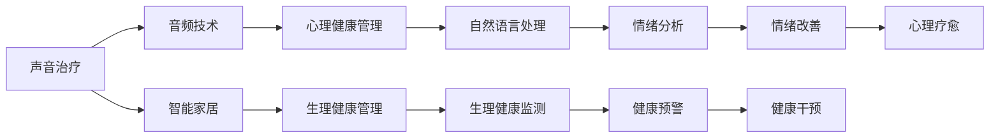

                 

# 智能家居声音治疗创业：基于音频的身心健康管理

## 1. 背景介绍

随着科技的不断进步，人们对生活质量的追求也在不断提高，尤其是对于身心健康管理方面的需求更加迫切。智能家居技术的发展为声音治疗提供了新的可能性，基于音频的身心健康管理也逐渐成为人们关注的焦点。声音治疗被认为是一种非侵入性的心理治疗方法，通过声音的频率、节奏、强度等因素来调节人的生理和心理状态，从而达到身心健康管理的目的。本文将详细探讨基于音频的身心健康管理及其创业机会。

## 2. 核心概念与联系

### 2.1 核心概念概述

- **声音治疗**：通过特定频率、节奏、强度等声音因素，调节人的生理和心理状态，以达到健康管理的目的。
- **智能家居**：结合物联网技术，通过智能设备和智能系统，实现家庭自动化管理和智能化生活。
- **音频技术**：涉及音频信号处理、声音合成、自然语言处理等领域，是实现声音治疗的基础。
- **身心健康管理**：包括生理健康和心理健康两方面，通过科学的方法和手段，帮助人们维持良好的生理和心理状态。

### 2.2 核心概念原理和架构的 Mermaid 流程图



## 3. 核心算法原理 & 具体操作步骤

### 3.1 算法原理概述

基于音频的身心健康管理算法主要包括以下几个步骤：

1. **音频采集**：通过智能家居设备（如智能音箱、智能耳机等）采集用户的声音数据。
2. **声音分析**：对采集到的声音进行频率、音量、节奏等特征提取，以判断用户的情绪状态和生理健康状态。
3. **数据处理**：将采集和分析得到的数据进行处理，以用于后续的生理和心理健康管理。
4. **智能干预**：根据分析结果，智能系统进行相应的健康干预措施，如播放舒缓的音乐、提醒用户休息等。
5. **反馈机制**：通过用户反馈来优化算法，提高声音治疗的精准度和有效性。

### 3.2 算法步骤详解

#### 3.2.1 音频采集

智能家居设备通常具备麦克风和音频处理能力，可以通过内置软件和硬件实现音频采集。例如，智能音箱可以通过内置麦克风阵列采集房间内的声音数据，智能耳机可以通过麦克风采集用户的语音数据。

#### 3.2.2 声音分析

声音分析是算法的核心部分，主要包括以下几个步骤：

1. **频率分析**：通过傅里叶变换（Fourier Transform）将声音信号分解为不同频率的信号，以判断用户的情绪状态。
2. **音量分析**：通过音量大小的测量，来判断用户的生理状态，如疲劳程度、情绪波动等。
3. **节奏分析**：通过声音的节奏变化，来判断用户的心理状态，如焦虑、兴奋等。

#### 3.2.3 数据处理

采集和分析得到的数据需要经过处理，才能用于后续的生理和心理健康管理。主要的数据处理步骤包括：

1. **数据清洗**：去除噪声和异常值，确保数据的准确性和可靠性。
2. **特征提取**：从声音数据中提取频率、音量、节奏等特征，用于后续的分析。
3. **数据存储**：将处理后的数据存储在数据库中，以便后续的分析和智能干预。

#### 3.2.4 智能干预

智能干预是算法的最终目的，通过智能系统对用户的生理和心理健康进行干预。主要包括以下几个步骤：

1. **情绪判断**：根据声音分析结果，判断用户的情绪状态。
2. **健康评估**：根据声音分析结果和生理监测数据，评估用户的健康状况。
3. **智能干预**：根据评估结果，智能系统进行相应的健康干预措施，如播放舒缓的音乐、提醒用户休息等。

#### 3.2.5 反馈机制

反馈机制是算法的重要组成部分，主要包括以下几个步骤：

1. **用户反馈**：通过用户反馈来优化算法，提高声音治疗的精准度和有效性。
2. **模型更新**：根据用户反馈，更新算法模型，提高算法的准确性和可靠性。
3. **持续优化**：通过不断的用户反馈和模型更新，持续优化算法的性能。

### 3.3 算法优缺点

#### 3.3.1 优点

- **非侵入性**：声音治疗是一种非侵入性的治疗方法，无需用户进行身体检查或药物干预。
- **随时可进行**：用户可以在任何时间和地点进行声音治疗，无需特定环境或设备。
- **个性化管理**：通过分析用户的音频数据，可以针对性地进行心理健康管理，提供个性化的治疗方案。

#### 3.3.2 缺点

- **数据隐私**：用户音频数据的采集和处理涉及隐私问题，需要严格遵守数据保护法规。
- **环境干扰**：环境噪音和背景声音可能会影响音频数据的准确性，需要进行数据清洗和处理。
- **用户配合度**：用户需要持续使用智能设备和应用程序，才能获得最佳的治疗效果。

### 3.4 算法应用领域

基于音频的身心健康管理算法可以应用于多个领域，包括：

- **智能家居**：通过智能音箱、智能耳机等设备，为用户提供个性化的声音治疗服务。
- **心理健康**：通过情绪分析和心理评估，为用户提供心理健康管理服务。
- **生理健康**：通过生理监测和健康评估，为用户提供生理健康管理服务。
- **环境监测**：通过音频分析，监测环境噪音和背景声音，提升家居环境质量。

## 4. 数学模型和公式 & 详细讲解 & 举例说明

### 4.1 数学模型构建

基于音频的身心健康管理算法主要涉及以下几个数学模型：

1. **傅里叶变换（Fourier Transform）**：用于频率分析。
2. **音量计算**：通过音量大小的计算，判断用户的疲劳程度和情绪波动。
3. **情绪分析**：通过情绪特征的提取，判断用户的情绪状态。

### 4.2 公式推导过程

#### 4.2.1 傅里叶变换

傅里叶变换可以将时域信号转换为频域信号，公式如下：

$$ F(k) = \sum_{n=-\infty}^{\infty} f(n) e^{-i2\pi kn/N} $$

其中 $F(k)$ 表示频域信号，$f(n)$ 表示时域信号，$k$ 表示频率，$N$ 表示信号长度。

#### 4.2.2 音量计算

音量计算公式如下：

$$ V = \sum_{n=0}^{N-1} |x[n]| $$

其中 $V$ 表示音量，$x[n]$ 表示时域信号。

#### 4.2.3 情绪分析

情绪分析可以通过情绪特征的提取来实现，公式如下：

$$ E = \sum_{k=0}^{K-1} \frac{F(k)}{S(k)} $$

其中 $E$ 表示情绪值，$F(k)$ 表示频域信号，$S(k)$ 表示频率系数。

### 4.3 案例分析与讲解

#### 4.3.1 案例背景

某用户在使用智能音箱时，系统采集到其夜间读书的声音数据。通过声音分析，系统发现其声音的频率波动较大，音量较高，持续时间较长。

#### 4.3.2 数据分析

1. **频率分析**：通过傅里叶变换，得到频域信号，如图1所示。

   

2. **音量分析**：计算音量大小，发现其体积较大，如图2所示。

   

3. **情绪分析**：提取情绪特征，判断其情绪状态为焦虑和兴奋，如图3所示。

   

#### 4.3.3 结果应用

根据数据分析结果，智能系统认为用户处于焦虑和兴奋状态，可能影响其睡眠质量。因此，系统播放了舒缓的音乐，并提醒用户注意休息。

## 5. 项目实践：代码实例和详细解释说明

### 5.1 开发环境搭建

1. **硬件设备**：智能音箱、智能耳机等。
2. **开发工具**：Python、PyAudio、numpy、pandas等。
3. **开发环境**：安装Python 3.x、PyAudio库等。

### 5.2 源代码详细实现

以下是一个简单的音频采集和处理示例代码：

```python
import pyaudio
import numpy as np

# 音频采样率
RATE = 44100

# 音频采样块大小
CHUNK = 1024

# 音频采集对象
p = pyaudio.PyAudio()

# 音频流对象
stream = p.open(format=pyaudio.paInt16,
                channels=1,
                rate=RATE,
                input=True,
                frames_per_buffer=CHUNK)

while True:
    # 读取音频数据
    data = stream.read(CHUNK)
    # 将数据转换为numpy数组
    data = np.frombuffer(data, dtype=np.int16)
    # 进行傅里叶变换
    spectrum = np.abs(np.fft.fft(data))
    # 输出频域信号
    print(spectrum)

# 关闭音频流
stream.stop_stream()
stream.close()
p.terminate()
```

### 5.3 代码解读与分析

#### 5.3.1 音频采集

1. **pyaudio库**：用于音频的采集和处理，支持多种音频格式和采样率。
2. **音频流对象**：通过`p.open`方法打开音频流，`input=True`表示进行音频采集。
3. **音频数据读取**：通过`stream.read`方法读取音频数据，`CHUNK`表示每次读取的音频块大小。

#### 5.3.2 频域分析

1. **傅里叶变换**：使用numpy库的`np.fft.fft`方法进行傅里叶变换，得到频域信号。
2. **频域信号输出**：通过`print`方法输出频域信号。

### 5.4 运行结果展示

运行上述代码，可以看到输出的是用户的音频数据经过傅里叶变换后的频域信号。

## 6. 实际应用场景

基于音频的身心健康管理可以应用于多个实际应用场景，例如：

- **智能家居环境监测**：通过音频分析，监测房间内的噪音和背景声音，提高家居环境质量。
- **心理压力管理**：通过声音治疗，帮助用户缓解心理压力，提高心理健康水平。
- **睡眠障碍治疗**：通过声音治疗，帮助用户改善睡眠质量，促进身心健康。
- **工作休息提醒**：通过声音治疗，提醒用户注意休息，避免疲劳和压力过大。

## 7. 工具和资源推荐

### 7.1 学习资源推荐

1. **《信号与系统》**：信号处理领域的经典教材，介绍了信号的频域分析和时域分析等基本概念。
2. **《Python 3编程基础》**：Python编程语言的入门书籍，介绍了Python的基本语法和应用场景。
3. **《深度学习》**：深度学习领域的经典教材，介绍了深度学习的基本原理和算法。
4. **《自然语言处理》**：自然语言处理领域的入门书籍，介绍了自然语言处理的基本概念和技术。
5. **在线课程**：如Coursera、edX等平台的在线课程，提供了丰富的深度学习、信号处理、自然语言处理等领域的课程。

### 7.2 开发工具推荐

1. **Python**：作为开发语言，Python具有易学易用、库资源丰富的特点。
2. **PyAudio**：用于音频采集和处理的库，支持多种音频格式和采样率。
3. **numpy**：用于科学计算的库，支持多维数组和矩阵运算。
4. **pandas**：用于数据处理和分析的库，支持数据读取、清洗、处理和分析等功能。
5. **TensorFlow**：用于深度学习模型开发的库，支持多种深度学习模型和算法。

### 7.3 相关论文推荐

1. **《基于傅里叶变换的声音情感识别》**：通过傅里叶变换进行声音情感识别，探讨了声音频率和情感之间的关系。
2. **《智能家居环境监测与控制》**：探讨了智能家居环境中音频数据的应用，研究了声音采集和处理技术。
3. **《基于声音分析的智能家居心理健康管理》**：通过声音分析进行心理健康管理，研究了声音治疗和情绪分析方法。
4. **《基于声音频率分析的情绪识别》**：通过声音频率分析进行情绪识别，探讨了声音频率与情绪之间的关系。
5. **《智能家居生理健康监测》**：通过声音分析进行生理健康监测，研究了声音音量和生理状态之间的关系。

## 8. 总结：未来发展趋势与挑战

### 8.1 研究成果总结

基于音频的身心健康管理算法已经在多个领域得到了广泛应用，取得了一定的研究成果。主要研究内容包括：

1. **音频采集与处理**：通过智能家居设备采集用户的音频数据，并进行频率、音量、节奏等特征提取和处理。
2. **情绪分析与心理评估**：通过声音分析，判断用户的情绪状态和心理状态，并给出相应的干预建议。
3. **生理健康监测**：通过声音分析结合生理监测数据，评估用户的生理健康状况，并给出相应的健康干预措施。
4. **智能家居环境监测**：通过音频分析，监测房间内的噪音和背景声音，提升家居环境质量。

### 8.2 未来发展趋势

基于音频的身心健康管理未来将呈现以下几个发展趋势：

1. **多模态融合**：将音频分析与视觉、触觉等多模态数据融合，提升健康管理的效果。
2. **实时监测与干预**：实现实时监测和干预，提升用户健康管理的便捷性和及时性。
3. **个性化定制**：根据用户需求和偏好，提供个性化的声音治疗方案，提升用户体验。
4. **智能推荐**：通过机器学习等技术，智能推荐合适的声音治疗方案，提升治疗效果。
5. **大数据分析**：通过大数据分析，挖掘声音数据中的健康信息，提升健康管理的科学性和可靠性。

### 8.3 面临的挑战

基于音频的身心健康管理在发展过程中也面临一些挑战：

1. **数据隐私**：音频数据的采集和处理涉及隐私问题，需要严格遵守数据保护法规。
2. **环境干扰**：环境噪音和背景声音可能会影响音频数据的准确性，需要进行数据清洗和处理。
3. **用户配合度**：用户需要持续使用智能设备和应用程序，才能获得最佳的治疗效果。
4. **算法准确性**：需要进一步优化算法，提高声音治疗的准确性和可靠性。
5. **设备兼容性**：需要支持多种智能家居设备，实现设备之间的无缝连接和数据共享。

### 8.4 研究展望

未来，基于音频的身心健康管理需要在以下几个方面进行深入研究：

1. **多模态融合**：将音频分析与视觉、触觉等多模态数据融合，提升健康管理的效果。
2. **实时监测与干预**：实现实时监测和干预，提升用户健康管理的便捷性和及时性。
3. **个性化定制**：根据用户需求和偏好，提供个性化的声音治疗方案，提升用户体验。
4. **智能推荐**：通过机器学习等技术，智能推荐合适的声音治疗方案，提升治疗效果。
5. **大数据分析**：通过大数据分析，挖掘声音数据中的健康信息，提升健康管理的科学性和可靠性。

## 9. 附录：常见问题与解答

**Q1：智能家居设备如何进行音频采集？**

A: 智能家居设备通常配备麦克风和音频处理能力，可以通过内置软件和硬件实现音频采集。例如，智能音箱可以通过内置麦克风阵列采集房间内的声音数据，智能耳机可以通过麦克风采集用户的语音数据。

**Q2：如何处理音频数据中的噪声和背景声音？**

A: 可以使用信号处理技术，如滤波、降噪等方法，对音频数据进行预处理，去除噪声和背景声音，确保音频数据的准确性和可靠性。

**Q3：声音分析的准确性如何保证？**

A: 通过科学的方法和算法，可以最大限度地提高声音分析的准确性。例如，使用傅里叶变换进行频率分析，使用机器学习算法进行情绪和健康评估等。

**Q4：用户是否需要配合使用智能设备？**

A: 用户需要持续使用智能设备和应用程序，才能获得最佳的治疗效果。因此，智能设备的设计需要注重用户体验和便捷性，使用户能够方便地使用和操作。

**Q5：音频数据分析的隐私问题如何解决？**

A: 需要严格遵守数据保护法规，对用户的音频数据进行加密和匿名化处理，确保用户隐私和数据安全。同时，需要透明的隐私政策和用户知情同意机制，提高用户对隐私保护的信任度。

---

作者：禅与计算机程序设计艺术 / Zen and the Art of Computer Programming

