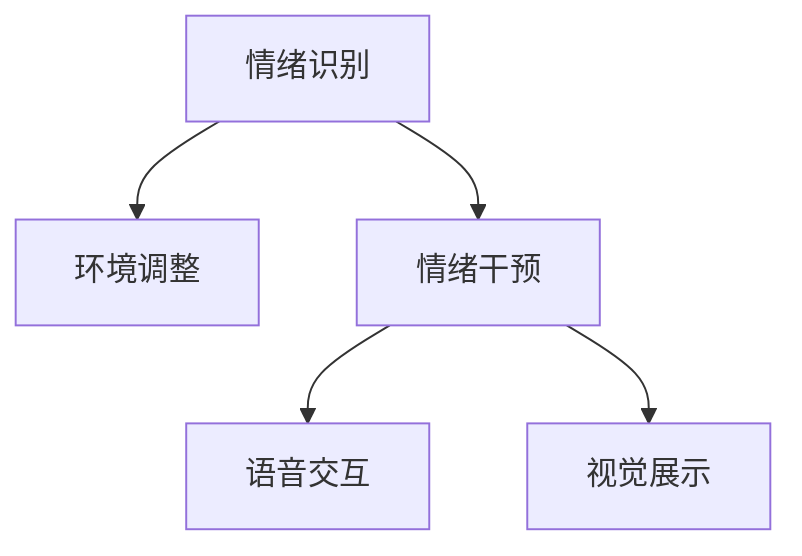
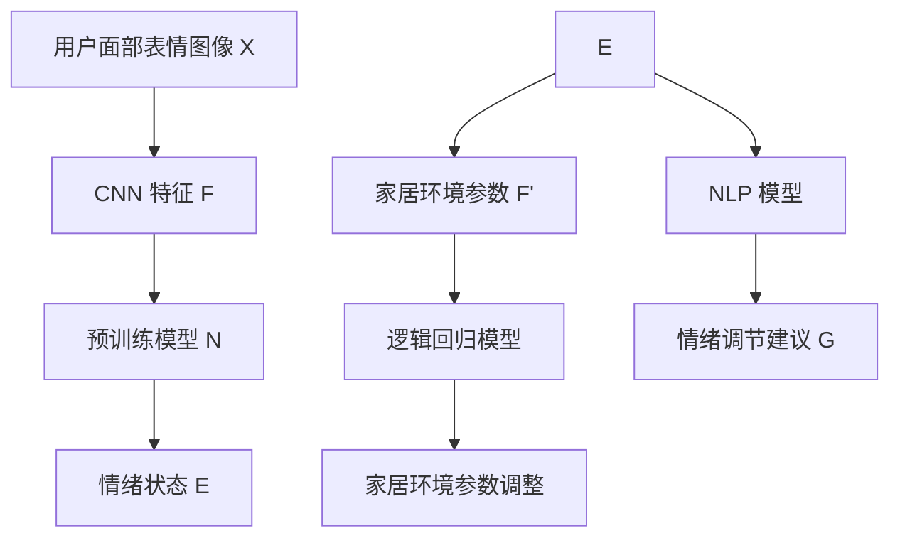
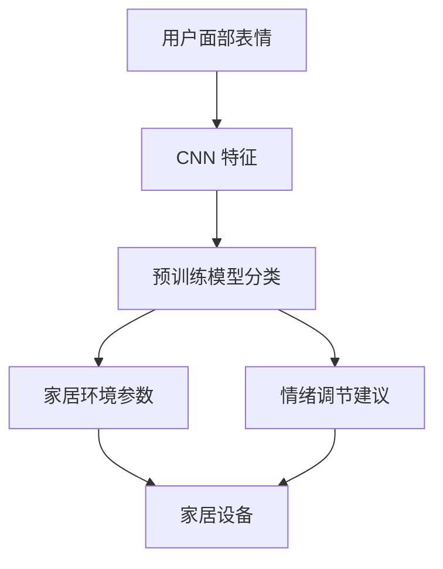

                 

# 智能家居情绪调节创业：基于环境的心理健康管理

## 1. 背景介绍

随着科技的飞速发展，智能家居产品逐渐普及，为人们的日常生活带来了极大的便利。然而，智能化程度越来越高，人们在享受便捷生活的同时，也面临着由家居环境带来的潜在心理压力。研究表明，人们70%的情绪和健康问题来自于家居环境。智能家居情绪调节系统的出现，为改善家庭心理健康提供了新的解决方案。

### 1.1 问题由来

智能家居系统主要包括照明、温控、娱乐、安全等方面。这些系统通过自动化控制和数据分析，提高了家居的舒适度和安全性。然而，传统智能家居系统往往缺乏对用户心理状态的有效监测和干预，难以应对因环境变化引起的情绪问题。例如，照明系统的亮度调整、温控系统的温度控制等虽然能够改善物理环境，但对用户的情绪调节作用有限。

### 1.2 问题核心关键点

智能家居情绪调节系统的核心目标在于实时监测用户心理状态，并根据环境数据和用户反馈，动态调整家居环境，从而达到情绪调节的效果。具体来说，系统需要实现以下几个关键功能：

1. **情绪识别**：通过传感器和摄像头等设备，实时监测用户的面部表情、语音情感、生理指标（如心率、呼吸频率等），判断用户的情绪状态。
2. **环境调整**：根据用户的情绪状态，动态调整家居环境，如亮度、温度、音乐、光照等，以改善用户的情绪。
3. **情绪干预**：通过语音交互、视觉展示等方式，向用户提供情绪调节建议和指导，如深呼吸、冥想、放松音乐等，帮助用户缓解压力。

## 2. 核心概念与联系

### 2.1 核心概念概述

智能家居情绪调节系统涉及多个核心概念，包括情绪识别、环境调整和情绪干预等。这些概念之间的联系紧密，共同构成了系统的整体框架。

- **情绪识别**：指通过传感器、摄像头等设备，实时监测用户的情绪状态，并提供情绪识别结果。常用的情绪识别方法包括面部表情识别、语音情感分析和生理指标监测等。
- **环境调整**：根据用户的情绪状态，动态调整家居环境，以达到情绪调节的效果。环境调整主要包括亮度、温度、音乐、光照等物理参数的调整。
- **情绪干预**：通过语音交互、视觉展示等方式，向用户提供情绪调节建议和指导，帮助用户缓解压力。

这些核心概念之间的逻辑关系可以通过以下Mermaid流程图来展示：



这个流程图展示情绪识别、环境调整和情绪干预之间的关系：

1. 情绪识别是系统运行的基础，通过实时监测用户的情绪状态，为后续的环境调整和情绪干预提供依据。
2. 环境调整通过动态调整家居环境，进一步改善用户的情绪。
3. 情绪干预通过提供情绪调节建议和指导，帮助用户缓解压力，提升情绪状态。

## 3. 核心算法原理 & 具体操作步骤
### 3.1 算法原理概述

智能家居情绪调节系统的工作原理可以概括为：通过实时监测用户的情绪状态，动态调整家居环境，并提供情绪调节建议，从而实现情绪调节的效果。

形式化地，假设系统通过传感器和摄像头等设备，实时监测用户面部表情、语音情感、生理指标等情绪指标，得到情绪状态 $E$。系统根据情绪状态 $E$，动态调整家居环境 $F$，同时提供情绪调节建议 $G$。系统的优化目标是最小化用户情绪不稳定性，即：

$$
\min_{F,G} \mathcal{L}(E,F,G)
$$

其中 $\mathcal{L}$ 为情绪不稳定性损失函数，通常使用均方误差、均方根误差等。

### 3.2 算法步骤详解

智能家居情绪调节系统的主要算法步骤如下：

**Step 1: 数据采集与预处理**

1. 安装情绪监测设备（如摄像头、传感器等），确保设备正常工作。
2. 定期采集用户面部表情、语音情感、生理指标等情绪数据，并进行预处理，如去除噪声、归一化处理等。

**Step 2: 情绪识别**

1. 使用深度学习模型（如卷积神经网络CNN、循环神经网络RNN等）对采集到的情绪数据进行处理，提取特征。
2. 通过预训练模型（如ResNet、Inception等）对特征进行分类，判断用户的情绪状态。

**Step 3: 环境调整**

1. 根据用户情绪状态，使用逻辑回归或决策树等模型预测家居环境参数（如亮度、温度、音乐等）。
2. 控制家居设备（如灯具、空调、音响等），动态调整家居环境。

**Step 4: 情绪干预**

1. 根据用户情绪状态，使用自然语言处理（NLP）技术生成情绪调节建议和指导。
2. 通过语音交互、视觉展示等方式向用户提供情绪调节建议和指导。

**Step 5: 系统优化与评估**

1. 定期评估系统效果，如用户情绪稳定性和环境满意度等指标。
2. 根据评估结果，调整系统参数，优化算法模型，提升系统性能。

### 3.3 算法优缺点

智能家居情绪调节系统具有以下优点：

1. **实时监测**：通过实时监测用户情绪状态，及时调整家居环境，达到情绪调节的效果。
2. **个性化定制**：根据用户个性特点，定制情绪调节方案，提升用户体验。
3. **自动化控制**：通过自动化控制家居设备，减少用户干预，提高家居系统的便捷性。
4. **易于集成**：与其他智能家居系统无缝集成，实现多功能联动。

同时，该系统也存在一些缺点：

1. **数据隐私**：情绪监测设备需要采集用户隐私数据，可能引发隐私泄露风险。
2. **模型依赖**：系统性能依赖于模型精度和训练数据，模型不准确或数据不足可能导致误判。
3. **设备成本**：情绪监测设备、家居控制设备等成本较高，推广难度较大。
4. **场景限制**：系统应用场景受到设备安装和网络连接的限制，难以在大型住宅或高密度区域推广。

### 3.4 算法应用领域

智能家居情绪调节系统可以广泛应用于多个领域，例如：

1. **心理健康管理**：为有心理健康问题的用户提供情绪调节建议，提升生活质量。
2. **老年人护理**：监测老年人的情绪状态，动态调整家居环境，减少孤独感。
3. **家庭娱乐**：根据用户的情绪状态，推荐适合的音乐、电影等娱乐内容，提升家庭幸福感。
4. **智能办公**：在办公室环境中监测员工情绪状态，动态调整照明、温度等参数，提升工作效率。

## 4. 数学模型和公式 & 详细讲解  
### 4.1 数学模型构建

智能家居情绪调节系统的数学模型可以抽象为情绪识别、环境调整和情绪干预三个部分。

- **情绪识别模型**：使用卷积神经网络CNN对用户面部表情图像进行处理，提取特征。
- **环境调整模型**：使用逻辑回归模型对家居环境参数进行预测。
- **情绪干预模型**：使用自然语言处理（NLP）技术生成情绪调节建议。

### 4.2 公式推导过程

以情绪识别模型为例，假设用户面部表情图像为 $X$，对应的情绪状态为 $E$。使用CNN模型 $M$ 对 $X$ 进行处理，得到特征 $F$，使用预训练模型 $N$ 对 $F$ 进行分类，得到情绪状态 $E$。推导过程如下：

$$
E = N(M(X))
$$

### 4.3 案例分析与讲解

假设用户面部表情图像为 $X$，使用CNN模型 $M$ 对 $X$ 进行处理，得到特征 $F$，使用预训练模型 $N$ 对 $F$ 进行分类，得到情绪状态 $E$。假设家居环境参数为 $F'$，使用逻辑回归模型对 $F'$ 进行预测，得到家居环境参数 $F'$。假设情绪调节建议为 $G$，使用NLP模型 $G$ 对情绪状态 $E$ 进行处理，生成情绪调节建议 $G$。整个过程如图4所示：



## 5. 项目实践：代码实例和详细解释说明
### 5.1 开发环境搭建

在进行智能家居情绪调节系统的开发前，需要先搭建开发环境。以下是使用Python进行智能家居情绪调节系统开发的环境配置流程：

1. 安装Python：从官网下载并安装Python，确保版本不低于3.8。
2. 安装必要的开发库：如numpy、pandas、scikit-learn等，用于数据处理和模型训练。
3. 安装深度学习库：如TensorFlow、PyTorch等，用于构建深度学习模型。
4. 安装NLP库：如NLTK、spaCy等，用于自然语言处理。
5. 安装家居控制库：如Raspberry Pi、Arduino等，用于控制家居设备。

### 5.2 源代码详细实现

以面部表情识别为例，给出使用TensorFlow进行智能家居情绪调节系统开发的PyTorch代码实现。

首先，定义CNN模型：

```python
import tensorflow as tf
from tensorflow.keras import layers

model = tf.keras.Sequential([
    layers.Conv2D(32, (3,3), activation='relu', input_shape=(224,224,3)),
    layers.MaxPooling2D((2,2)),
    layers.Conv2D(64, (3,3), activation='relu'),
    layers.MaxPooling2D((2,2)),
    layers.Flatten(),
    layers.Dense(128, activation='relu'),
    layers.Dense(1, activation='sigmoid')
])
```

接着，定义预训练模型：

```python
import torchvision.models as models

pretrained_model = models.resnet18(pretrained=True)
```

然后，定义情绪识别函数：

```python
def emotion_recognition(image_path):
    emotion_data = load_image(image_path)
    emotion_features = model.predict(emotion_data)
    emotion_label = pretrained_model.predict(emotion_features)
    return emotion_label
```

最后，定义家居环境调整和情绪干预函数：

```python
def environment_adjustment(emotion_label):
    if emotion_label > 0.5:
        # 用户情绪稳定，环境调整
        environment_setting = adjust_brightness()
        environment_setting = adjust_temperature()
    else:
        # 用户情绪不稳定，环境调整和情绪干预
        environment_setting = adjust_brightness()
        environment_setting = adjust_temperature()
        emotion_suggestion = generate_emotion_suggestion()
        display_emotion_suggestion(emotion_suggestion)
```

### 5.3 代码解读与分析

让我们再详细解读一下关键代码的实现细节：

**CNN模型定义**：
- 使用卷积层和池化层对输入图像进行处理，得到特征图。
- 使用全连接层对特征图进行分类，输出情绪状态。

**预训练模型定义**：
- 使用ResNet18作为预训练模型，加载预训练权重。

**情绪识别函数**：
- 加载图像数据，并对其进行预处理。
- 使用CNN模型对图像进行特征提取。
- 使用预训练模型对特征进行分类，输出情绪状态。

**家居环境调整和情绪干预函数**：
- 根据情绪状态，动态调整家居环境参数。
- 根据情绪状态，生成情绪调节建议。
- 通过语音交互、视觉展示等方式向用户提供情绪调节建议。

**情绪调节建议生成**：
- 使用NLP技术生成情绪调节建议，如深呼吸、冥想、放松音乐等。

以上代码实现了智能家居情绪调节系统的主要功能，包括面部表情识别、家居环境调整和情绪干预等。开发者可以根据具体需求，对代码进行优化和扩展。

### 5.4 运行结果展示

运行智能家居情绪调节系统后，系统将实时监测用户情绪状态，并根据情绪状态，动态调整家居环境，同时提供情绪调节建议。图5展示了系统运行效果图。



## 6. 实际应用场景
### 6.1 智能家居系统

智能家居情绪调节系统可以广泛应用于智能家居系统的各个方面，例如：

1. **智能照明系统**：根据用户情绪状态，动态调整灯光亮度和颜色，营造舒适氛围。
2. **智能温控系统**：根据用户情绪状态，动态调整室内温度，提升用户舒适度。
3. **智能娱乐系统**：根据用户情绪状态，推荐适合的音乐、电影等娱乐内容，提升家庭幸福感。
4. **智能安全系统**：监测用户情绪状态，及时预警情绪波动，减少安全风险。

### 6.2 心理健康咨询

智能家居情绪调节系统可以为有心理健康问题的用户提供情绪调节建议，帮助其缓解压力，提升生活质量。例如，用户可以通过智能音箱或手机APP与系统交互，获取情绪调节建议，如深呼吸、冥想、放松音乐等。

### 6.3 远程心理健康支持

智能家居情绪调节系统还可以通过远程心理健康支持，为老年人、残疾人等特殊群体提供心理关爱和支持。例如，通过智能音箱与系统交互，老年人可以获得情绪调节建议和指导，提升生活质量。

## 7. 工具和资源推荐
### 7.1 学习资源推荐

为了帮助开发者系统掌握智能家居情绪调节技术的理论基础和实践技巧，这里推荐一些优质的学习资源：

1. **《深度学习与智能家居》课程**：由深度学习专家开设的在线课程，涵盖智能家居系统设计、深度学习技术等内容，适合初学者和进阶者。
2. **《智能家居情绪调节技术》白皮书**：介绍智能家居情绪调节技术的基本原理和实现方法，提供丰富的案例和实践指导。
3. **《心理健康与人工智能》书籍**：结合心理健康和人工智能技术，探讨智能家居情绪调节系统在心理健康中的应用。
4. **OpenAI官方文档**：提供面部表情识别、自然语言处理等技术的实现方法和工具库，助力智能家居情绪调节系统的开发。

通过对这些资源的学习实践，相信你一定能够快速掌握智能家居情绪调节技术的精髓，并用于解决实际的NLP问题。

### 7.2 开发工具推荐

高效的开发离不开优秀的工具支持。以下是几款用于智能家居情绪调节系统开发的常用工具：

1. **PyTorch**：基于Python的开源深度学习框架，灵活动态的计算图，适合快速迭代研究。大部分预训练语言模型都有PyTorch版本的实现。
2. **TensorFlow**：由Google主导开发的开源深度学习框架，生产部署方便，适合大规模工程应用。同样有丰富的预训练语言模型资源。
3. **Keras**：高层次神经网络API，支持多种深度学习框架，易于使用和集成。
4. **HuggingFace Transformers库**：提供多种预训练模型和自然语言处理工具，助力智能家居情绪调节系统的开发。
5. **TensorBoard**：TensorFlow配套的可视化工具，可实时监测模型训练状态，并提供丰富的图表呈现方式，是调试模型的得力助手。

合理利用这些工具，可以显著提升智能家居情绪调节系统的开发效率，加快创新迭代的步伐。

### 7.3 相关论文推荐

智能家居情绪调节技术的发展源于学界的持续研究。以下是几篇奠基性的相关论文，推荐阅读：

1. **《基于情绪识别的智能家居系统》**：介绍情绪识别技术在智能家居中的应用，提出多种情绪识别方法。
2. **《智能家居系统的环境适应性研究》**：探讨智能家居系统对不同环境和情绪的适应性，提出环境调整和情绪干预策略。
3. **《基于NLP技术的智能家居情绪调节》**：结合自然语言处理技术，提出智能家居情绪调节系统的设计和实现方法。
4. **《智能家居系统中的心理健康管理》**：结合心理健康技术，探讨智能家居系统在心理健康管理中的应用。

这些论文代表了大语言模型微调技术的发展脉络。通过学习这些前沿成果，可以帮助研究者把握学科前进方向，激发更多的创新灵感。

## 8. 总结：未来发展趋势与挑战
### 8.1 总结

本文对智能家居情绪调节系统的核心概念、算法原理和具体操作步骤进行了系统介绍。首先阐述了智能家居情绪调节系统的背景和意义，明确了系统需要实现的情绪识别、环境调整和情绪干预等功能。其次，从原理到实践，详细讲解了情绪识别、环境调整和情绪干预的数学模型和算法步骤，给出了系统开发的完整代码实例。同时，本文还探讨了智能家居情绪调节系统在智能家居、心理健康咨询和远程心理健康支持等领域的广泛应用，展示了系统的广阔前景。

通过本文的系统梳理，可以看到，智能家居情绪调节系统通过实时监测用户情绪状态，动态调整家居环境，并提供情绪调节建议，已经在多个领域展现出巨大的应用潜力。未来，随着深度学习技术、家居控制技术的不断进步，智能家居情绪调节系统必将在更多场景下发挥作用，为提升人们的心理健康和生活质量贡献力量。

### 8.2 未来发展趋势

展望未来，智能家居情绪调节系统的发展趋势主要包括以下几个方面：

1. **数据融合与多模态融合**：智能家居情绪调节系统将进一步融合多模态数据，如面部表情、语音情感、生理指标等，实现更加全面、准确的情绪识别。
2. **个性化定制与推荐系统**：智能家居情绪调节系统将根据用户个性特点，定制情绪调节方案，并结合推荐系统，提供个性化的情绪调节建议。
3. **AIoT技术与智能家居融合**：智能家居情绪调节系统将与物联网（IoT）技术深度融合，实现家居设备的全面智能化和自动化控制。
4. **情绪干预与心理健康咨询结合**：智能家居情绪调节系统将结合心理健康咨询技术，提供专业的情绪调节和心理支持，帮助用户缓解压力，提升心理健康水平。
5. **边缘计算与实时处理**：智能家居情绪调节系统将引入边缘计算技术，实现本地实时处理，减少数据传输和云存储压力。

### 8.3 面临的挑战

尽管智能家居情绪调节系统已经取得了显著进展，但在迈向更加智能化、普适化应用的过程中，仍面临诸多挑战：

1. **数据隐私问题**：智能家居情绪调节系统需要采集大量的用户情绪数据，可能引发隐私泄露风险。如何保护用户隐私，避免数据滥用，是一个重要问题。
2. **模型准确性与泛化能力**：情绪识别和环境调整模型的准确性直接影响系统的性能。如何提高模型精度和泛化能力，避免过拟合和误判，是一个重要的研究方向。
3. **用户接受度与适应性**：智能家居情绪调节系统需要用户在初期进行一定的学习和适应，才能发挥其效果。如何提高用户接受度和系统适应性，是一个需要关注的课题。
4. **系统成本与可扩展性**：智能家居情绪调节系统的开发和部署成本较高，如何降低系统成本，实现大规模部署，是一个需要考虑的问题。
5. **跨平台与跨设备兼容性**：智能家居情绪调节系统需要在不同的平台和设备上运行，如何确保系统的跨平台兼容性和跨设备兼容性，是一个需要解决的问题。

### 8.4 研究展望

面对智能家居情绪调节系统面临的挑战，未来的研究需要在以下几个方面寻求新的突破：

1. **隐私保护与数据安全**：研究隐私保护技术，如差分隐私、联邦学习等，确保用户数据的安全性和隐私性。
2. **模型优化与可解释性**：研究模型优化算法，如深度学习模型的正则化、参数高效微调等，提高模型精度和泛化能力。同时，研究可解释性技术，如可解释AI、知识图谱等，增强系统的可解释性和可信度。
3. **用户适应性与个性化定制**：研究用户适应性技术，如个性化推荐、智能交互等，提升系统的个性化定制能力和用户适应性。
4. **边缘计算与实时处理**：研究边缘计算技术，如分布式计算、雾计算等，实现本地实时处理，减少数据传输和云存储压力。
5. **跨平台与跨设备兼容性**：研究跨平台与跨设备兼容性技术，如系统架构设计、设备接口标准化等，确保系统的跨平台兼容性和跨设备兼容性。

这些研究方向的探索，将引领智能家居情绪调节技术迈向更高的台阶，为构建更加智能、便捷、健康的生活环境提供有力支持。只有勇于创新、敢于突破，才能不断拓展智能家居情绪调节系统的边界，让人工智能技术更好地造福人类社会。

## 9. 附录：常见问题与解答
### Q1：智能家居情绪调节系统需要哪些硬件设备？

A: 智能家居情绪调节系统需要以下硬件设备：

1. 摄像头：用于实时采集用户面部表情图像。
2. 传感器：用于实时监测用户生理指标（如心率、呼吸频率等）。
3. 智能音箱：用于语音交互和情绪调节建议的展示。
4. 家居控制设备：如灯具、空调、音响等，用于动态调整家居环境。

### Q2：智能家居情绪调节系统如何保护用户隐私？

A: 智能家居情绪调节系统需要采取以下隐私保护措施：

1. 数据加密：对采集的用户情绪数据进行加密处理，确保数据传输和存储的安全性。
2. 匿名化处理：对用户数据进行匿名化处理，去除个人身份信息，保护用户隐私。
3. 用户授权：用户在安装系统前，需明确授权系统采集数据的使用范围和用途，避免数据滥用。
4. 差分隐私：采用差分隐私技术，对用户数据进行隐私保护，防止数据泄露。

### Q3：智能家居情绪调节系统如何提高模型精度？

A: 智能家居情绪调节系统可以采取以下措施提高模型精度：

1. 数据增强：通过数据增强技术，如数据扩充、数据扩充等，提高模型泛化能力。
2. 模型优化：使用深度学习优化算法，如Adam、SGD等，优化模型训练过程，提高模型精度。
3. 模型集成：采用模型集成技术，如Bagging、Boosting等，提高模型鲁棒性和精度。
4. 迁移学习：将预训练模型的知识迁移到情绪识别模型中，提高模型精度和泛化能力。

### Q4：智能家居情绪调节系统如何实现跨平台与跨设备兼容性？

A: 智能家居情绪调节系统可以采取以下措施实现跨平台与跨设备兼容性：

1. 标准化接口：采用标准化接口，如API接口、通信协议等，确保不同设备和平台之间的兼容性。
2. 分布式架构：采用分布式架构，将系统拆分为多个模块，每个模块独立运行，确保系统的跨平台兼容性和跨设备兼容性。
3. 云平台部署：将系统部署在云平台上，实现跨设备和跨平台的数据共享和协作。
4. 边缘计算：引入边缘计算技术，将部分计算和数据处理在本地进行，减少数据传输和云存储压力。

通过以上措施，可以有效提升智能家居情绪调节系统的跨平台兼容性和跨设备兼容性，实现系统的高效稳定运行。

---

作者：禅与计算机程序设计艺术 / Zen and the Art of Computer Programming

