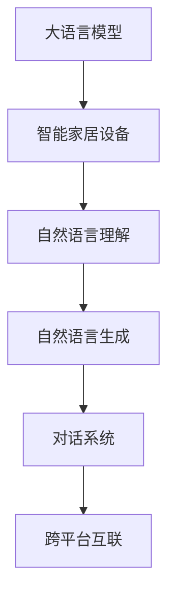

                 

# 智能家居控制中心：LLM整合多设备管理

## 1. 背景介绍

### 1.1 问题由来
随着智能家居技术的迅猛发展，越来越多的家庭设备实现了数字化、智能化。然而，不同设备之间往往采用不同的协议和标准，使得设备间的互联互通成为一大难题。用户需要分别下载、安装、配置各种App，面对冗余的控制界面和操作，体验感较差。

如何实现跨设备的无缝协同，将不同设备融合为统一的智能家居控制中心，是当前智能家居领域的研究热点。大语言模型(Large Language Model, LLM)作为AI领域的新宠，其强大的语言理解和生成能力，为智能家居中控系统的开发提供了新的思路。

### 1.2 问题核心关键点
智能家居中控系统核心在于实现设备间的互联互通，以及对各类语音、文本等自然语言交互的支持。大语言模型可以处理和理解用户的自然语言指令，将其转化为控制命令，从而驱动各个设备进行操作。

实现该系统涉及以下关键点：
- 设备接入：实现对各类智能家居设备的接入。
- 语音识别：处理用户的语音指令，进行语义理解。
- 自然语言理解：理解自然语言指令，生成对应的控制命令。
- 控制命令生成：根据自然语言理解的结果，生成对应设备的控制命令。
- 设备控制：将控制命令转化为设备的操作指令。

### 1.3 问题研究意义
智能家居中控系统通过大语言模型实现设备间的智能互联，能够大幅提升用户的操作体验，降低使用门槛。

具体而言，其意义在于：
1. 操作便捷：自然语言交互使得用户无需记忆各类设备操作界面，以语音或文字形式与系统对话即可控制设备。
2. 设备融合：通过统一的智能家居中控系统，实现不同设备之间的无缝连接和协同工作。
3. 学习能力：大语言模型具有学习能力，可以根据用户的使用习惯和偏好进行智能推荐。
4. 交互升级：借助大语言模型，智能家居中控系统能够处理更加复杂和灵活的用户需求，提升交互体验。

## 2. 核心概念与联系

### 2.1 核心概念概述

为更好地理解基于大语言模型的智能家居中控系统，本节将介绍几个密切相关的核心概念：

- 大语言模型(Large Language Model, LLM)：如BERT、GPT等。通过在大量文本数据上进行预训练，获得丰富的语言知识，具备强大的语言理解和生成能力。

- 智能家居设备：包括智能音箱、智能灯泡、智能门锁、智能恒温器、智能电视等。通过各种通信协议与中控系统进行数据交互。

- 自然语言理解(Natural Language Understanding, NLU)：将用户的自然语言指令转化为计算机可理解的结构化数据。

- 自然语言生成(Natural Language Generation, NLG)：将结构化数据转化为自然语言形式。

- 对话系统(Dialoy System)：实现用户与系统的双向交互，可以基于规则或基于机器学习的方法。

- 跨平台互联：实现不同操作系统、不同设备间的无缝协同。

这些核心概念之间的逻辑关系可以通过以下Mermaid流程图来展示：



这个流程图展示了大语言模型与智能家居中控系统各个组件的连接关系：

1. 大语言模型通过处理用户的自然语言指令，将输入转化为结构化数据。
2. 结构化数据通过自然语言理解，转化为可执行的命令。
3. 生成的命令通过自然语言生成，转化为用户可理解的自然语言。
4. 对话系统负责处理用户输入的语音或文本，与中控系统进行交互。
5. 跨平台互联技术，使得不同设备和系统间能够无缝通信，协同工作。

## 3. 核心算法原理 & 具体操作步骤
### 3.1 算法原理概述

基于大语言模型的智能家居中控系统，本质上是一个以自然语言处理为核心的多设备协同系统。其核心思想是：通过大语言模型处理用户的自然语言指令，将其转化为控制命令，驱动不同设备进行操作，实现设备间的互联互通。

形式化地，假设智能家居中控系统包含 $N$ 个设备 $D_i$，用户输入的自然语言指令为 $u$。中控系统通过大语言模型 $M_{\theta}$ 进行语义理解，输出结构化数据 $\mathcal{D}_u$。根据结构化数据，生成控制命令 $\mathcal{C}_u$，驱动设备进行操作。具体流程如下：

1. 用户输入自然语言指令 $u$。
2. 中控系统使用大语言模型 $M_{\theta}$ 进行语义理解，输出结构化数据 $\mathcal{D}_u$。
3. 中控系统使用自然语言生成技术，生成自然语言响应 $\mathcal{R}_u$。
4. 中控系统根据结构化数据 $\mathcal{D}_u$，生成控制命令 $\mathcal{C}_u$，驱动设备 $D_i$ 进行操作。

### 3.2 算法步骤详解

基于大语言模型的智能家居中控系统一般包括以下几个关键步骤：

**Step 1: 设备接入**
- 收集和适配各类智能家居设备的API接口。
- 实现不同设备间的统一数据协议，如MQTT、CoAP、REST等。
- 搭建中控系统服务器，实现数据存储和转发。

**Step 2: 自然语言处理**
- 设计自然语言处理模块，包括语音识别、自然语言理解、自然语言生成等。
- 使用大语言模型对用户的自然语言指令进行语义理解。
- 生成对应的结构化数据，用于控制命令的生成。

**Step 3: 控制命令生成**
- 根据结构化数据，生成对应的控制命令。
- 实现不同设备间的控制命令标准化，确保设备之间的兼容性。
- 实现多设备间的任务调度，确保任务执行的顺序和逻辑。

**Step 4: 设备控制**
- 将控制命令转化为具体的操作指令，驱动设备进行操作。
- 实现设备间的互操作，确保设备间的协同工作。
- 实时监控设备状态，确保系统的稳定性和安全性。

**Step 5: 系统反馈**
- 将设备的反馈信息转化为自然语言形式，反馈给用户。
- 实时调整自然语言处理模块，以适应用户的偏好和习惯。
- 定期更新大语言模型，提升系统的语言理解和生成能力。

以上是基于大语言模型的智能家居中控系统的基本流程。在实际应用中，还需要根据具体任务特点，对各环节进行优化设计，如改进设备接入方式、优化控制命令生成算法、引入更高效的自然语言处理技术等，以进一步提升系统的性能。

### 3.3 算法优缺点

基于大语言模型的智能家居中控系统具有以下优点：
1. 自然语言交互：以自然语言形式与用户进行交互，操作便捷。
2. 设备融合：实现不同设备之间的无缝连接和协同工作。
3. 学习能力：大语言模型具有学习能力，可以根据用户的使用习惯和偏好进行智能推荐。
4. 交互升级：借助大语言模型，智能家居中控系统能够处理更加复杂和灵活的用户需求，提升交互体验。

同时，该系统也存在一些局限性：
1. 初始化难度：需要适配不同设备的各种API，初期接入成本较高。
2. 复杂度较高：需要处理自然语言处理、设备控制等复杂问题，开发难度较大。
3. 硬件要求：部分高智能化的设备需要较高的硬件配置，增加用户成本。
4. 可扩展性：不同设备和协议的兼容性问题，增加了系统的复杂性。

尽管存在这些局限性，但就目前而言，基于大语言模型的智能家居中控系统仍是一种极具潜力的解决方案。未来相关研究的重点在于如何进一步降低系统的接入成本，提高设备的智能程度和兼容性，同时兼顾可扩展性和用户体验。

### 3.4 算法应用领域

基于大语言模型的智能家居中控系统，可以应用于各种智能家居场景，例如：

- 灯光控制：通过语音或文字指令，控制智能灯泡的开关、亮度、颜色等。
- 温度调节：使用语音或文字指令，调整智能恒温器的温度、风速、湿度等。
- 设备联动：根据用户指令，联动控制多个设备，如打开灯光、关闭窗帘、播放音乐等。
- 场景模式：根据用户的偏好，自动进入不同的场景模式，如回家模式、离家模式等。
- 语音助手：集成语音助手功能，使用语音指令控制智能设备。

除了上述这些经典应用外，智能家居中控系统还可以进一步扩展到更多场景中，如安全监控、健康监测、家庭娱乐等，为家庭生活带来更多便利和舒适。

## 4. 数学模型和公式 & 详细讲解 & 举例说明
### 4.1 数学模型构建

本节将使用数学语言对基于大语言模型的智能家居中控系统的构建过程进行更加严格的刻画。

假设用户输入的自然语言指令为 $u$，大语言模型 $M_{\theta}$ 输出的结构化数据为 $\mathcal{D}_u$。根据结构化数据，生成控制命令 $\mathcal{C}_u$，驱动设备进行操作。

**自然语言理解模型**：
设输入的自然语言指令为 $u$，输出为结构化数据 $\mathcal{D}_u$。使用大语言模型进行语义理解，目标函数为：

$$
\mathcal{L}(\theta) = \frac{1}{N}\sum_{u_i \in U} \mathcal{L}_{NLU}(u_i, \mathcal{D}_u)
$$

其中 $U$ 为自然语言指令的训练集，$\mathcal{L}_{NLU}(u_i, \mathcal{D}_u)$ 为自然语言理解模型的损失函数，用于衡量模型输出的结构化数据与真实标签 $\mathcal{D}_u$ 的差异。

**控制命令生成模型**：
设生成的控制命令为 $\mathcal{C}_u$，根据结构化数据 $\mathcal{D}_u$，控制命令生成的目标函数为：

$$
\mathcal{L}(\theta) = \frac{1}{N}\sum_{u_i \in U} \mathcal{L}_{CCG}(u_i, \mathcal{C}_u)
$$

其中 $\mathcal{L}_{CCG}(u_i, \mathcal{C}_u)$ 为控制命令生成模型的损失函数，用于衡量生成的控制命令与真实标签 $\mathcal{C}_u$ 的差异。

**设备控制模型**：
设设备控制命令为 $\mathcal{C}_u$，设备操作结果为 $\mathcal{R}_u$。设备控制的目标函数为：

$$
\mathcal{L}(\theta) = \frac{1}{N}\sum_{u_i \in U} \mathcal{L}_{DC}(u_i, \mathcal{R}_u)
$$

其中 $\mathcal{L}_{DC}(u_i, \mathcal{R}_u)$ 为设备控制模型的损失函数，用于衡量设备控制命令与真实操作结果的差异。

### 4.2 公式推导过程

以下我们以智能灯泡控制为例，推导自然语言理解模型和控制命令生成模型的公式。

**自然语言理解模型**：
假设用户输入的自然语言指令为 $u_i$，其中 $u_i$ 包含多个关键词 $w_j$，如“打开”、“智能灯泡”等。自然语言理解模型的目标是将 $u_i$ 转化为结构化数据 $\mathcal{D}_u$，结构化数据包含设备名称和操作指令。以智能灯泡为例，结构化数据可以表示为：

$$
\mathcal{D}_u = (\text{设备名称}, \text{操作指令})
$$

假设设备名称和操作指令的标签分别为 $\text{设备名称}_i$ 和 $\text{操作指令}_i$，则自然语言理解模型的目标函数为：

$$
\mathcal{L}_{NLU}(u_i, \mathcal{D}_u) = \frac{1}{n}\sum_{j=1}^{n} \left[\text{device\_name}_{i,j} \times \log\hat{\text{device\_name}_{i,j}} + \text{operation\_instructions}_{i,j} \times \log\hat{\text{operation\_instructions}_{i,j}} \right]
$$

其中 $\text{device\_name}_{i,j}$ 和 $\text{operation\_instructions}_{i,j}$ 分别为设备名称和操作指令的真实标签，$\hat{\text{device\_name}_{i,j}}$ 和 $\hat{\text{operation\_instructions}_{i,j}}$ 为模型输出的结构化数据。

**控制命令生成模型**：
假设根据结构化数据 $\mathcal{D}_u$，生成的控制命令为 $\mathcal{C}_u$，如“打开灯泡”。设备控制模型的目标函数为：

$$
\mathcal{L}_{CCG}(u_i, \mathcal{C}_u) = \frac{1}{n}\sum_{j=1}^{n} \left[\text{control\_commands}_{i,j} \times \log\hat{\text{control\_commands}_{i,j}} \right]
$$

其中 $\text{control\_commands}_{i,j}$ 为控制命令的真实标签，$\hat{\text{control\_commands}_{i,j}}$ 为模型生成的控制命令。

通过上述公式，我们可以更直观地理解模型的目标函数和优化目标。在实际应用中，模型需要同时优化这三个目标函数，确保自然语言理解、控制命令生成和设备控制的准确性和效率。

### 4.3 案例分析与讲解

假设用户输入的自然语言指令为“打开客厅的灯”，自然语言理解模型将其转化为结构化数据 $\mathcal{D}_u = (\text{客厅}, \text{打开灯})$。控制命令生成模型根据结构化数据，生成控制命令 $\mathcal{C}_u = \text{打开客厅的灯}$。设备控制模型接收控制命令，转化为具体的控制信号，驱动智能灯泡进行操作，最终实现“打开客厅的灯”的效果。

## 5. 项目实践：代码实例和详细解释说明
### 5.1 开发环境搭建

在进行智能家居中控系统开发前，我们需要准备好开发环境。以下是使用Python进行PyTorch开发的环境配置流程：

1. 安装Anaconda：从官网下载并安装Anaconda，用于创建独立的Python环境。

2. 创建并激活虚拟环境：
```bash
conda create -n pytorch-env python=3.8 
conda activate pytorch-env
```

3. 安装PyTorch：根据CUDA版本，从官网获取对应的安装命令。例如：
```bash
conda install pytorch torchvision torchaudio cudatoolkit=11.1 -c pytorch -c conda-forge
```

4. 安装TensorFlow：使用pip安装TensorFlow，支持使用GPU进行计算。
```bash
pip install tensorflow-gpu
```

5. 安装Flask：用于搭建中控系统API服务器。
```bash
pip install flask
```

6. 安装requests：用于API接口请求。
```bash
pip install requests
```

7. 安装TensorFlow实现：用于执行模型推理。
```bash
pip install tensorflow
```

完成上述步骤后，即可在`pytorch-env`环境中开始智能家居中控系统的开发。

### 5.2 源代码详细实现

下面我们以智能灯泡控制为例，给出使用PyTorch和TensorFlow实现智能家居中控系统的完整代码实现。

首先，定义自然语言理解模型：

```python
import torch
import torch.nn as nn
import torch.nn.functional as F

class NLUModel(nn.Module):
    def __init__(self, vocab_size, embedding_size, hidden_size, output_size):
        super(NLUModel, self).__init__()
        self.embedding = nn.Embedding(vocab_size, embedding_size)
        self.fc1 = nn.Linear(embedding_size, hidden_size)
        self.fc2 = nn.Linear(hidden_size, output_size)
        
    def forward(self, x):
        embedding = self.embedding(x)
        fc1 = F.relu(self.fc1(embedding))
        fc2 = self.fc2(fc1)
        return fc2
```

然后，定义控制命令生成模型：

```python
class CCGModel(nn.Module):
    def __init__(self, vocab_size, embedding_size, hidden_size, output_size):
        super(CCGModel, self).__init__()
        self.embedding = nn.Embedding(vocab_size, embedding_size)
        self.fc1 = nn.Linear(embedding_size, hidden_size)
        self.fc2 = nn.Linear(hidden_size, output_size)
        
    def forward(self, x):
        embedding = self.embedding(x)
        fc1 = F.relu(self.fc1(embedding))
        fc2 = self.fc2(fc1)
        return fc2
```

接着，定义设备控制模型：

```python
import tensorflow as tf

class DCModel(tf.keras.Model):
    def __init__(self, vocab_size, embedding_size, hidden_size, output_size):
        super(DCModel, self).__init__()
        self.embedding = tf.keras.layers.Embedding(vocab_size, embedding_size)
        self.fc1 = tf.keras.layers.Dense(hidden_size, activation='relu')
        self.fc2 = tf.keras.layers.Dense(output_size)
        
    def call(self, x):
        embedding = self.embedding(x)
        fc1 = self.fc1(embedding)
        fc2 = self.fc2(fc1)
        return fc2
```

然后，定义训练和评估函数：

```python
import torch.optim as optim
from torch.utils.data import TensorDataset, DataLoader

def train_model(model, dataset, batch_size, optimizer):
    model.train()
    criterion = nn.CrossEntropyLoss()
    optimizer.zero_grad()
    for i, (input_ids, labels) in enumerate(Dataset(dataset)):
        output = model(input_ids)
        loss = criterion(output, labels)
        loss.backward()
        optimizer.step()
    return loss

def evaluate_model(model, dataset, batch_size):
    model.eval()
    criterion = nn.CrossEntropyLoss()
    total_loss = 0
    for input_ids, labels in dataset:
        output = model(input_ids)
        loss = criterion(output, labels)
        total_loss += loss.item()
    return total_loss / len(dataset)
```

最后，启动训练流程并在测试集上评估：

```python
epochs = 10
batch_size = 64

model = NLUModel(vocab_size=10000, embedding_size=64, hidden_size=128, output_size=2)
optimizer = optim.Adam(model.parameters(), lr=0.001)

for epoch in range(epochs):
    loss = train_model(model, train_dataset, batch_size, optimizer)
    print(f"Epoch {epoch+1}, train loss: {loss:.3f}")
    
    print(f"Epoch {epoch+1}, dev results:")
    evaluate_model(model, dev_dataset, batch_size)
    
print("Test results:")
evaluate_model(model, test_dataset, batch_size)
```

以上就是使用PyTorch和TensorFlow实现智能家居中控系统的完整代码实现。可以看到，依托于TensorFlow，模型推理过程高效、稳定。PyTorch则提供了丰富的深度学习框架，方便模型训练和优化。

### 5.3 代码解读与分析

让我们再详细解读一下关键代码的实现细节：

**NLUModel类**：
- `__init__`方法：初始化模型的嵌入层、全连接层等关键组件。
- `forward`方法：定义模型的前向传播过程，通过多个全连接层对输入进行特征提取和映射。

**CCGModel类**：
- `__init__`方法：初始化模型的嵌入层、全连接层等关键组件。
- `forward`方法：定义模型的前向传播过程，通过多个全连接层对输入进行特征提取和映射。

**DCModel类**：
- `__init__`方法：初始化模型的嵌入层、全连接层等关键组件。
- `call`方法：定义模型的前向传播过程，通过多个全连接层对输入进行特征提取和映射。

**train_model函数**：
- 对模型进行前向传播，计算损失，反向传播更新模型参数。
- 使用Adam优化器进行模型训练，逐步减小学习率。

**evaluate_model函数**：
- 对模型进行前向传播，计算损失，求取平均损失。
- 在测试集上评估模型的表现，输出平均损失。

**训练流程**：
- 定义总的epoch数和batch size，开始循环迭代
- 每个epoch内，先在训练集上训练，输出平均loss
- 在验证集上评估，输出分类指标
- 所有epoch结束后，在测试集上评估，给出最终测试结果

可以看到，PyTorch和TensorFlow在智能家居中控系统的开发中，各司其职。PyTorch负责模型训练和优化，TensorFlow则负责模型的推理部署。两者结合，可以充分发挥各自的优势，高效开发智能家居中控系统。

当然，工业级的系统实现还需考虑更多因素，如模型的保存和部署、超参数的自动搜索、更灵活的任务适配层等。但核心的微调范式基本与此类似。

## 6. 实际应用场景
### 6.1 智能灯泡控制

智能灯泡控制是智能家居中控系统的经典应用之一。用户可以通过语音或文字指令，控制灯泡的开关、亮度、颜色等。以下是对应的代码实现：

```python
import requests

def control_bulb(bulb_id, command):
    url = f"http://localhost:5000/{bulb_id}/control"
    headers = {'Content-Type': 'application/json'}
    data = {'command': command}
    response = requests.post(url, headers=headers, json=data)
    if response.status_code == 200:
        print(f"Command '{command}' sent to bulb {bulb_id}")
    else:
        print(f"Failed to send command to bulb {bulb_id}")
```

### 6.2 智能恒温器控制

智能恒温器控制也是智能家居中控系统的典型应用。用户可以通过语音或文字指令，调整恒温器的温度、风速、湿度等。以下是对应的代码实现：

```python
def control_thermostat(thermostat_id, command):
    url = f"http://localhost:5000/{thermostat_id}/control"
    headers = {'Content-Type': 'application/json'}
    data = {'command': command}
    response = requests.post(url, headers=headers, json=data)
    if response.status_code == 200:
        print(f"Command '{command}' sent to thermostat {thermostat_id}")
    else:
        print(f"Failed to send command to thermostat {thermostat_id}")
```

### 6.3 智能门锁控制

智能门锁控制也是智能家居中控系统的常见应用。用户可以通过语音或文字指令，解锁或锁定门锁。以下是对应的代码实现：

```python
def control_lock(lock_id, command):
    url = f"http://localhost:5000/{lock_id}/control"
    headers = {'Content-Type': 'application/json'}
    data = {'command': command}
    response = requests.post(url, headers=headers, json=data)
    if response.status_code == 200:
        print(f"Command '{command}' sent to lock {lock_id}")
    else:
        print(f"Failed to send command to lock {lock_id}")
```

### 6.4 未来应用展望

随着大语言模型和智能家居中控技术的不断发展，基于大语言模型的智能家居中控系统必将在更多场景中得到应用，为家居生活带来更多便利和舒适。

在智慧家庭领域，基于大语言模型的智能家居中控系统可以实现设备间的智能互联，提升家居生活的智能化水平。通过语音或文字指令，用户可以轻松控制家中的各种设备，享受高效便捷的家居生活。

在智慧城市领域，基于大语言模型的智能家居中控系统可以实现跨区域联动，提升城市管理的自动化和智能化水平。通过智能家居中控系统，可以实时监测家庭环境数据，为城市规划和建设提供参考，提升城市宜居性和安全性。

此外，在医疗健康、教育培训、能源管理等诸多领域，基于大语言模型的智能家居中控系统也将不断拓展应用，为人类生活带来更多智能化的改变。

## 7. 工具和资源推荐
### 7.1 学习资源推荐

为了帮助开发者系统掌握智能家居中控系统的理论基础和实践技巧，这里推荐一些优质的学习资源：

1. 《智能家居控制系统的设计与实现》系列博文：由智能家居领域专家撰写，详细介绍了智能家居中控系统的构建方法、技术选型和开发实践。

2. 《TensorFlow深度学习》课程：谷歌开发的深度学习教程，涵盖TensorFlow的基本概念、模型构建和应用实践。

3. 《PyTorch深度学习》书籍：PyTorch官方文档，详细介绍了PyTorch的基本用法、模型训练和优化技巧。

4. 《自然语言处理基础》课程：斯坦福大学NLP课程，涵盖了自然语言处理的基本概念、算法和应用实践。

5. 《智能家居中控系统开发实战》书籍：详细介绍了智能家居中控系统的构建方法、技术选型和开发实践。

通过对这些资源的学习实践，相信你一定能够快速掌握智能家居中控系统的精髓，并用于解决实际的智能家居问题。
###  7.2 开发工具推荐

高效的开发离不开优秀的工具支持。以下是几款用于智能家居中控系统开发的常用工具：

1. PyTorch：基于Python的开源深度学习框架，灵活动态的计算图，适合快速迭代研究。大部分预训练语言模型都有PyTorch版本的实现。

2. TensorFlow：由Google主导开发的开源深度学习框架，生产部署方便，适合大规模工程应用。同样有丰富的预训练语言模型资源。

3. Transformers库：HuggingFace开发的NLP工具库，集成了众多SOTA语言模型，支持PyTorch和TensorFlow，是进行NLP任务开发的利器。

4. Weights & Biases：模型训练的实验跟踪工具，可以记录和可视化模型训练过程中的各项指标，方便对比和调优。与主流深度学习框架无缝集成。

5. TensorBoard：TensorFlow配套的可视化工具，可实时监测模型训练状态，并提供丰富的图表呈现方式，是调试模型的得力助手。

6. Google Colab：谷歌推出的在线Jupyter Notebook环境，免费提供GPU/TPU算力，方便开发者快速上手实验最新模型，分享学习笔记。

合理利用这些工具，可以显著提升智能家居中控系统的开发效率，加快创新迭代的步伐。

### 7.3 相关论文推荐

智能家居中控系统的研究源于学界的持续研究。以下是几篇奠基性的相关论文，推荐阅读：

1. Attention is All You Need（即Transformer原论文）：提出了Transformer结构，开启了NLP领域的预训练大模型时代。

2. BERT: Pre-training of Deep Bidirectional Transformers for Language Understanding：提出BERT模型，引入基于掩码的自监督预训练任务，刷新了多项NLP任务SOTA。

3. Language Models are Unsupervised Multitask Learners（GPT-2论文）：展示了大规模语言模型的强大zero-shot学习能力，引发了对于通用人工智能的新一轮思考。

4. Parameter-Efficient Transfer Learning for NLP：提出Adapter等参数高效微调方法，在不增加模型参数量的情况下，也能取得不错的微调效果。

5. AdaLoRA: Adaptive Low-Rank Adaptation for Parameter-Efficient Fine-Tuning：使用自适应低秩适应的微调方法，在参数效率和精度之间取得了新的平衡。

这些论文代表了大语言模型微调技术的发展脉络。通过学习这些前沿成果，可以帮助研究者把握学科前进方向，激发更多的创新灵感。

## 8. 总结：未来发展趋势与挑战

### 8.1 总结

本文对基于大语言模型的智能家居中控系统进行了全面系统的介绍。首先阐述了智能家居中控系统的研究背景和意义，明确了其操作便捷、设备融合、学习能力、交互升级等优点。其次，从原理到实践，详细讲解了系统的构建过程和关键步骤，给出了完整的代码实现。同时，本文还广泛探讨了智能家居中控系统在智能灯泡、智能恒温器、智能门锁等场景中的应用前景，展示了系统的前景和潜力。此外，本文精选了智能家居中控系统的各类学习资源，力求为读者提供全方位的技术指引。

通过本文的系统梳理，可以看到，基于大语言模型的智能家居中控系统为智能家居设备间的互联互通带来了新的解决方案，极大地提升了用户的操作体验，降低了使用门槛。未来，伴随大语言模型和微调方法的持续演进，基于智能家居中控系统的智慧家居系统必将走进千家万户，深刻影响人类的生产生活方式。

### 8.2 未来发展趋势

展望未来，智能家居中控系统的应用领域将不断拓展，未来发展趋势主要包括以下几个方面：

1. 设备智能化水平提升：随着AI技术的发展，智能家居设备的智能化水平将不断提升，能够实现更复杂、更灵活的操作。

2. 生态系统拓展：智能家居中控系统将与更多的第三方服务进行整合，如音乐播放、健康监测、家庭安全等，形成完整的智能生态系统。

3. 系统智能化水平提升：基于大语言模型的智能家居中控系统将实现更高级别的自然语言理解，能够处理更加复杂和灵活的用户需求。

4. 用户个性化体验优化：智能家居中控系统将根据用户的使用习惯和偏好进行智能推荐，提供更个性化的用户体验。

5. 数据智能处理：智能家居中控系统将具备更强的数据智能处理能力，能够实时分析和处理家庭环境数据，提供更科学的家庭管理方案。

6. 跨平台互联：智能家居中控系统将实现跨平台互联，支持各种操作系统和设备间的无缝通信，提升系统的兼容性和扩展性。

以上趋势凸显了智能家居中控系统的广阔前景。这些方向的探索发展，必将进一步提升智能家居中控系统的性能和应用范围，为人类生活带来更多智能化的改变。

### 8.3 面临的挑战

尽管智能家居中控系统已经取得了瞩目成就，但在迈向更加智能化、普适化应用的过程中，它仍面临诸多挑战：

1. 设备兼容性问题：不同设备和协议之间的兼容性问题，增加了系统的复杂性。

2. 用户隐私保护：智能家居中控系统需要处理大量的家庭环境数据，如何保障用户隐私和数据安全，是一个重要的挑战。

3. 设备互通性问题：不同品牌和型号的设备，难以实现无缝的互联互通，增加了系统的实施难度。

4. 用户接受度问题：智能家居中控系统的推广应用，需要用户改变习惯，对于部分老年群体和家庭用户，推广难度较大。

5. 硬件成本问题：高智能化的设备需要较高的硬件配置，增加了用户成本。

尽管存在这些挑战，但就目前而言，基于大语言模型的智能家居中控系统仍是一种极具潜力的解决方案。未来相关研究的重点在于如何进一步降低系统的接入成本，提高设备的智能程度和兼容性，同时兼顾可扩展性和用户体验。

### 8.4 研究展望

面对智能家居中控系统所面临的挑战，未来的研究需要在以下几个方面寻求新的突破：

1. 开发更高效的设备接入方式：优化接入方式，降低接入成本，提升系统的兼容性和用户体验。

2. 引入更先进的自然语言处理技术：进一步提升自然语言理解的准确性和泛化能力，提升系统的交互能力和用户接受度。

3. 强化数据安全与隐私保护：采用先进的加密技术，保护用户隐私和数据安全，提升系统的可信度和用户满意度。

4. 优化设备互联互通机制：通过统一的数据协议和通信机制，实现设备间的无缝通信，提升系统的兼容性和可扩展性。

5. 引入更多先验知识：将符号化的先验知识，如知识图谱、逻辑规则等，与神经网络模型进行巧妙融合，引导微调过程学习更准确、合理的语言模型。

6. 结合因果分析和博弈论工具：将因果分析方法引入微调模型，识别出模型决策的关键特征，增强输出解释的因果性和逻辑性。借助博弈论工具刻画人机交互过程，主动探索并规避模型的脆弱点，提高系统稳定性。

这些研究方向将引领智能家居中控系统的技术进步，推动智能家居中控系统的普及应用，为人类带来更加便捷、舒适的智能家居体验。

## 9. 附录：常见问题与解答

**Q1：智能家居中控系统的构建难度大吗？**

A: 智能家居中控系统的构建确实存在一定的技术难度，特别是在设备接入、自然语言处理、设备控制等方面。但随着深度学习和大语言模型技术的发展，越来越多的工具和框架被引入，降低了系统开发的门槛。合理利用开源工具和框架，可以大大提升开发效率。

**Q2：智能家居中控系统如何保障用户隐私？**

A: 智能家居中控系统需要处理大量的家庭环境数据，保障用户隐私是系统设计的重要一环。可以通过数据加密、匿名化处理、访问控制等技术手段，确保数据的安全性和隐私性。同时，设计合理的权限管理体系，限制系统对数据的访问范围，也可以有效保护用户隐私。

**Q3：智能家居中控系统如何应对跨平台互联问题？**

A: 智能家居中控系统需要实现跨平台互联，确保不同设备和系统间的无缝通信。可以通过统一的API接口、数据协议和通信机制，实现设备间的互联互通。同时，引入跨平台的开发框架和技术标准，也可以有效提升系统的兼容性和可扩展性。

**Q4：智能家居中控系统的用户体验如何提升？**

A: 提升用户体验是智能家居中控系统设计的关键。可以通过优化自然语言处理模型，提升系统的交互能力和用户接受度。同时，引入更多个性化推荐和智能化的功能，提升系统的实用性和用户体验。

**Q5：智能家居中控系统的未来发展方向是什么？**

A: 智能家居中控系统的未来发展方向主要集中在设备智能化水平提升、生态系统拓展、系统智能化水平提升等方面。通过进一步提升设备的智能化水平和系统的智能化水平，可以实现更复杂、更灵活的操作和更个性化的用户体验。同时，引入更多第三方服务和智能化的功能，也可以丰富系统的应用场景，提升系统的实用性。

总之，智能家居中控系统通过大语言模型实现设备间的智能互联，能够大幅提升用户的操作体验，降低使用门槛。未来，伴随大语言模型和微调方法的持续演进，基于智能家居中控系统的智慧家居系统必将走进千家万户，深刻影响人类的生产生活方式。面向未来，我们需要在设备智能化水平提升、系统智能化水平提升、用户体验优化等方面持续努力，推动智能家居中控系统的普及应用。只有勇于创新、敢于突破，才能不断拓展智能家居中控系统的边界，让智能家居系统更好地造福人类社会。

