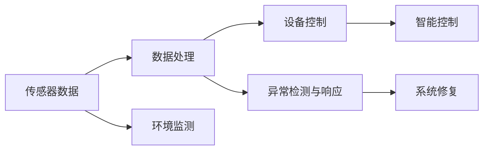

                 

## 1. 背景介绍

在科技日益发展的今天，智能家居已经成为了人们生活中不可或缺的一部分。传统的家居设备主要通过简单的开关控制和定时任务来提供便利，但随着物联网、人工智能等技术的进步，智能家居系统开始具备了更强的感知和反应能力，能够根据环境变化和用户需求，实时调整运行状态。在这样的背景下，智能家居系统的监控与注意力管理，成为了提升用户体验、保障系统稳定性的关键。

智能监控旨在实时获取家居环境中的各种数据，包括温度、湿度、光线、空气质量等，并根据这些数据自动调整家居设备的运行状态，如开/关空调、控制窗帘、调节灯光等，从而营造一个舒适、健康的生活环境。而注意力管理则通过优化数据处理和设备响应策略，确保系统能够高效、准确地处理各种异常情况，如设备故障、网络中断等，以提升系统的鲁棒性和用户满意度。

## 2. 核心概念与联系

### 2.1 核心概念概述

为了更好地理解智能家居的智能监控与注意力管理，我们首先需要介绍几个关键概念：

- **智能监控（Smart Monitoring）**：通过传感器和智能设备，实时收集家居环境数据，并进行分析和处理，自动调整家居设备状态，以优化生活环境。
- **注意力管理（Attention Management）**：在智能监控的基础上，通过智能算法和逻辑设计，确保系统对异常情况能够快速响应和处理，提升系统的鲁棒性和用户体验。
- **数据处理（Data Processing）**：对智能监控获取的数据进行清洗、存储、分析等处理，提取有用的信息，为决策提供支持。
- **设备控制（Device Control）**：根据数据处理结果，通过网络协议和控制命令，控制家居设备运行状态，实现智能化控制。
- **异常检测与响应（Anomaly Detection and Response）**：通过机器学习、规则引擎等技术，检测系统中的异常行为，并采取相应措施进行响应，避免问题扩大化。

### 2.2 核心概念原理和架构的 Mermaid 流程图



该流程图展示了智能家居监控与注意力管理的核心架构：

1. **传感器数据**：通过各类传感器获取家居环境数据。
2. **数据处理**：对传感器数据进行清洗、存储和分析，提取有用信息。
3. **设备控制**：根据数据处理结果，控制家居设备的运行状态。
4. **异常检测与响应**：检测系统异常，采取措施进行处理，确保系统稳定运行。

### 2.3 核心概念间的联系

智能家居的监控与注意力管理是一个由多个模块协同工作的复杂系统。其核心联系如下：

- **传感器数据与环境监测**：传感器数据是智能家居监控的基础，环境监测通过传感器获取数据，实现对家居环境的实时监控。
- **数据处理与智能控制**：数据处理通过分析传感器数据，提取有用信息，智能控制则根据处理结果，控制家居设备，优化生活环境。
- **异常检测与系统修复**：异常检测通过机器学习等技术，识别系统异常，系统修复则通过自动或人工干预，快速恢复正常运行状态。

这些模块通过高效协同工作，确保智能家居系统能够实时响应环境变化和用户需求，提升用户体验和系统稳定性。

## 3. 核心算法原理 & 具体操作步骤

### 3.1 算法原理概述

智能家居的智能监控与注意力管理主要依赖于两个关键算法：

- **数据处理算法**：用于清洗、存储和分析传感器数据，提取有用的信息。
- **异常检测与响应算法**：用于检测系统中的异常行为，并采取相应措施进行响应。

这些算法的实现通常需要结合机器学习、规则引擎、传感器融合等多种技术，以确保系统的智能性和鲁棒性。

### 3.2 算法步骤详解

#### 3.2.1 数据处理算法

1. **数据采集**：通过传感器和智能设备，实时采集家居环境数据，如温度、湿度、光线、空气质量等。
2. **数据清洗**：去除噪声数据，处理缺失值，确保数据的质量和完整性。
3. **数据存储**：将清洗后的数据存储到数据库或数据仓库中，方便后续分析和使用。
4. **数据特征提取**：利用机器学习算法，提取数据中的有用特征，如温度变化趋势、空气质量指数等。
5. **数据分析**：对提取的特征进行分析，生成决策支持信息，如预计的气温变化、空气质量预报等。

#### 3.2.2 异常检测与响应算法

1. **异常检测**：使用机器学习算法（如SVM、决策树、神经网络等）或统计方法（如均值漂移、孤立森林等），检测系统中的异常行为，如设备故障、网络中断等。
2. **异常响应**：根据异常检测结果，采取相应的措施进行处理，如重启设备、切换备用网络、通知用户等，确保系统正常运行。

### 3.3 算法优缺点

智能家居监控与注意力管理算法的优缺点如下：

#### 优点

- **实时性**：算法能够实时监测家居环境变化，及时调整设备状态，提升用户体验。
- **智能化**：通过机器学习和数据处理技术，算法能够自动识别和处理异常情况，减少人工干预。
- **可靠性**：多层次的异常检测与响应机制，保障系统在异常情况下的稳定性。

#### 缺点

- **复杂性**：算法涉及多种技术和方法，实现和维护难度较大。
- **数据依赖**：算法的性能很大程度上依赖于传感器的准确性和数据质量。
- **资源消耗**：数据处理和异常检测需要消耗大量计算资源，特别是在大规模数据环境下。

### 3.4 算法应用领域

智能家居监控与注意力管理算法广泛应用于以下领域：

- **智能温控**：通过监控环境温度，自动调整空调、暖气等设备，保持舒适的生活环境。
- **空气质量监测**：实时检测空气质量指数，自动开启空气净化器或开窗通风，保障室内空气清新。
- **照明控制**：根据光线变化，自动调整灯光亮度和色彩，营造不同的氛围。
- **安全监控**：利用摄像头和传感器，实时监控家居安全，检测异常行为，及时报警。
- **能效管理**：通过监控能源消耗，优化设备运行，降低能耗和成本。

## 4. 数学模型和公式 & 详细讲解 & 举例说明

### 4.1 数学模型构建

智能家居监控与注意力管理算法主要涉及以下数学模型：

- **时间序列分析**：用于预测环境数据变化趋势，如温度、湿度等。
- **机器学习模型**：用于异常检测和预测，如SVM、决策树、神经网络等。
- **逻辑回归**：用于分类和二元预测，如设备故障检测、用户行为分析等。

### 4.2 公式推导过程

以时间序列分析为例，假设有一组温度数据 $\{x_t\}_{t=1}^N$，其中 $x_t$ 表示第 $t$ 时刻的温度值。我们希望通过时间序列模型预测未来的温度变化趋势。假设模型为ARIMA(p, d, q)，其中：

- AR（自回归）：$x_t = \phi_1 x_{t-1} + \phi_2 x_{t-2} + ... + \phi_p x_{t-p} + \epsilon_t$
- I（差分）：$\Delta x_t = x_t - x_{t-1}$
- MA（移动平均）：$\epsilon_t = \theta_1 \epsilon_{t-1} + \theta_2 \epsilon_{t-2} + ... + \theta_q \epsilon_{t-q} + \epsilon_t$
- $\Delta x_t$ 为差分后的时间序列，$\epsilon_t$ 为白噪声序列。

通过ARIMA模型，可以预测未来的温度变化趋势，如下所示：

$$
\hat{x}_{t+h} = \phi_1 \hat{x}_{t+h-1} + \phi_2 \hat{x}_{t+h-2} + ... + \phi_p \hat{x}_{t+h-p} + \epsilon_{t+h}
$$

### 4.3 案例分析与讲解

以智能温控为例，假设家庭中安装了一个智能温控器，能够实时监控室内温度，并根据设定的温度范围自动调整空调的运行状态。温控器的算法流程如下：

1. **数据采集**：温控器通过传感器实时采集室内温度数据 $x_t$。
2. **数据处理**：利用ARIMA模型对温度数据进行时间序列分析，预测未来的温度变化趋势。
3. **设备控制**：根据预测结果，调整空调的运行状态，如开启或关闭，调节风速和温度等。
4. **异常检测与响应**：使用机器学习算法检测异常温度变化，如温度骤降，及时采取措施进行响应，如重启空调。

通过该算法，温控器能够根据环境变化和用户需求，自动调整空调状态，保持舒适的生活环境，同时具备异常检测和响应能力，保障系统的稳定性。

## 5. 项目实践：代码实例和详细解释说明

### 5.1 开发环境搭建

智能家居监控与注意力管理系统的开发需要以下环境：

- **Python 3.x**：作为开发语言，Python提供了丰富的库和工具。
- **TensorFlow 或 PyTorch**：用于机器学习和深度学习算法的实现。
- **OpenCV**：用于视频分析和图像处理。
- **MySQL 或 MongoDB**：用于数据的存储和查询。

开发环境搭建步骤：

1. 安装Python和相关库：使用pip或conda安装Python和TensorFlow、PyTorch、OpenCV等库。
2. 配置开发环境：设置虚拟环境，安装必要的依赖包。
3. 搭建数据库：安装MySQL或MongoDB，创建数据库和表，用于存储传感器数据和分析结果。

### 5.2 源代码详细实现

以智能温控为例，给出使用PyTorch实现的代码如下：

```python
import torch
import torch.nn as nn
from torch.autograd import Variable

class TempController(nn.Module):
    def __init__(self, input_size, hidden_size, output_size):
        super(TempController, self).__init__()
        self.lstm = nn.LSTM(input_size, hidden_size, batch_first=True)
        self.linear = nn.Linear(hidden_size, output_size)

    def forward(self, input, hidden):
        output, hidden = self.lstm(input, hidden)
        output = self.linear(output)
        return output, hidden

def predict_temperature(model, input, hidden):
    output, hidden = model(input, hidden)
    return output, hidden

def main():
    input_size = 1  # 输入数据维度
    hidden_size = 64  # LSTM隐藏层大小
    output_size = 2  # 输出数据维度（开/关，温度值）

    model = TempController(input_size, hidden_size, output_size)
    input = Variable(torch.randn(1, 1, input_size))
    hidden = (Variable(torch.randn(1, 1, hidden_size)), Variable(torch.randn(1, 1, hidden_size)))

    output, hidden = predict_temperature(model, input, hidden)
    print(output)

if __name__ == "__main__":
    main()
```

### 5.3 代码解读与分析

以上代码展示了使用PyTorch实现一个简单的LSTM模型，用于预测未来温度变化趋势。

- **模型定义**：使用nn.Module定义模型，包含一个LSTM层和一个全连接层。
- **数据输入**：定义输入数据的维度，模拟智能温控器采集的温度数据。
- **模型前向传播**：通过调用模型的forward方法，计算输入数据的输出。
- **预测函数**：根据模型的输出，预测未来温度变化趋势。
- **主函数**：定义输入数据，调用预测函数，输出预测结果。

## 6. 实际应用场景

### 6.1 智能温控

智能温控是智能家居监控与注意力管理的重要应用之一。通过实时监测环境温度，自动调整空调和暖气设备，保持舒适的居住环境，同时具备异常检测和响应能力，及时处理温度异常，保障系统稳定性。

### 6.2 空气质量监测

空气质量监测通过传感器实时检测室内空气质量指数，自动开启空气净化器或开窗通风，保障室内空气清新，提升用户健康水平。

### 6.3 照明控制

照明控制通过实时监测室内光线变化，自动调整灯光亮度和色彩，营造不同的氛围，同时具备异常检测和响应能力，及时处理光线异常，保障系统稳定性。

### 6.4 安全监控

安全监控通过摄像头和传感器，实时监控家居安全，检测异常行为，及时报警，保障家庭安全。

## 7. 工具和资源推荐

### 7.1 学习资源推荐

为了帮助开发者系统掌握智能家居监控与注意力管理理论基础和实践技巧，这里推荐一些优质的学习资源：

1. **《智能家居系统设计与实现》**：详细介绍了智能家居系统的架构和实现技术，包括传感器、网络、算法等多个方面。
2. **《机器学习实战》**：通过实例演示，深入浅出地介绍了机器学习算法的实现和应用。
3. **OpenAI Gym**：提供了丰富的模拟环境，用于测试和训练智能家居监控与注意力管理算法。
4. **TensorFlow官方文档**：提供了完整的机器学习和深度学习开发教程，包括模型构建、数据处理、算法调优等。
5. **Kaggle**：提供大量的智能家居监控与注意力管理相关的数据集和竞赛，帮助你提升实战能力。

### 7.2 开发工具推荐

高效的工具是智能家居监控与注意力管理开发的必备条件。以下是几款常用的开发工具：

1. **PyTorch**：提供了丰富的深度学习库，支持多种算法实现，是智能家居监控与注意力管理算法开发的首选工具。
2. **TensorFlow**：提供了强大的机器学习框架，支持多种算法实现，适合大规模工程应用。
3. **OpenCV**：提供了丰富的图像处理和视频分析库，适合智能家居监控系统的开发。
4. **MySQL 或 MongoDB**：提供了高效的数据存储和查询功能，适合智能家居监控数据的存储和管理。

### 7.3 相关论文推荐

智能家居监控与注意力管理的研究涉及多个领域，以下是几篇具有代表性的相关论文，推荐阅读：

1. **《基于LSTM的智能家居监控系统设计》**：介绍了LSTM在智能家居监控中的应用，详细说明了算法的实现过程。
2. **《智能家居异常检测与响应算法研究》**：介绍了多种异常检测算法，如机器学习、统计方法等，并详细说明了其实现和应用。
3. **《智能家居环境感知与响应算法》**：详细介绍了环境感知和响应算法，如时间序列分析、异常检测等，适用于智能家居监控系统的开发。

## 8. 总结：未来发展趋势与挑战

### 8.1 研究成果总结

智能家居监控与注意力管理技术的发展主要集中在以下几个方面：

- **传感器技术的进步**：传感器精度和采样频率的提升，使得家居环境数据更加丰富和准确。
- **算法模型的改进**：LSTM、CNN等深度学习算法的应用，提高了数据分析和预测的精度。
- **系统架构的优化**：分布式计算、边缘计算等技术的应用，提升了系统的实时性和可靠性。

### 8.2 未来发展趋势

智能家居监控与注意力管理技术的未来发展趋势如下：

1. **数据融合与多模态感知**：融合传感器数据和用户行为数据，实现多模态感知，提升系统的智能性和用户体验。
2. **实时性优化**：通过优化算法和架构设计，提升系统的实时性，实现秒级响应。
3. **异常检测与响应智能化**：引入更先进的机器学习算法，如深度学习、强化学习等，提升异常检测与响应的智能化水平。
4. **智能决策系统**：开发基于深度学习等算法的智能决策系统，实现更全面、更精准的环境感知与响应。

### 8.3 面临的挑战

智能家居监控与注意力管理技术在实际应用中也面临诸多挑战：

1. **数据隐私与安全**：家居环境数据涉及个人隐私，需要严格的数据保护措施，确保数据安全。
2. **系统复杂性**：智能家居监控与注意力管理系统涉及多个子系统，开发和维护难度较大。
3. **算法性能与资源消耗**：高精度的算法需要消耗大量计算资源，需要优化算法性能，减少资源消耗。

### 8.4 研究展望

智能家居监控与注意力管理技术的未来研究展望如下：

1. **隐私保护与伦理设计**：研究隐私保护技术，确保数据安全，并设计符合伦理标准的智能家居监控系统。
2. **人机协同与用户体验**：通过优化算法和界面设计，提升人机协同的智能性和用户体验。
3. **多系统融合与集成**：研究多种家居系统的融合与集成，实现统一的智能家居监控平台。
4. **跨界应用与创新**：探索智能家居监控与注意力管理技术在其他领域的应用，如智慧城市、工业物联网等。

## 9. 附录：常见问题与解答

### Q1: 智能家居监控与注意力管理算法的实现难度大吗？

A: 智能家居监控与注意力管理算法涉及多个领域，如传感器技术、数据处理、机器学习等，实现难度较大。但通过系统的设计和优化，可以逐步降低实现难度，提升算法性能。

### Q2: 智能家居监控与注意力管理算法对数据质量要求高吗？

A: 是的。算法对数据的质量和完整性要求较高，需要实时、准确的传感器数据。因此，数据的采集、清洗和存储需要严格控制。

### Q3: 智能家居监控与注意力管理算法对计算资源要求高吗？

A: 是的。高精度的算法需要消耗大量计算资源，特别是在大规模数据环境下。因此，需要优化算法性能，减少资源消耗。

### Q4: 智能家居监控与注意力管理算法如何保障数据隐私？

A: 智能家居监控与注意力管理算法需要严格的数据保护措施，确保数据隐私。可以使用加密技术、访问控制等方法，保障数据安全。

### Q5: 智能家居监控与注意力管理算法如何优化实时性？

A: 可以通过优化算法和架构设计，提升系统的实时性。例如，使用分布式计算、边缘计算等技术，将计算任务分散到多个节点上，提升处理速度。

---

作者：禅与计算机程序设计艺术 / Zen and the Art of Computer Programming

