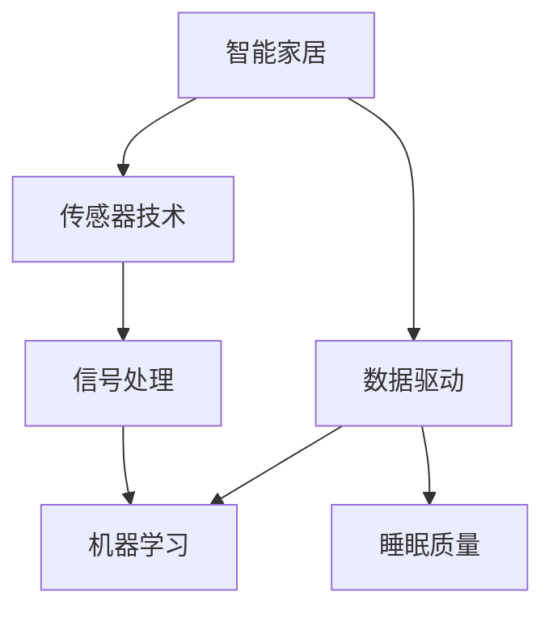

                 

# 智能居家睡眠优化创业：基于数据的睡眠质量提升

> 关键词：智能居家、睡眠优化、数据驱动、人工智能、机器学习、信号处理、传感器技术、用户体验

## 1. 背景介绍

随着城市化进程的加快和生活节奏的日益紧张，越来越多的人面临睡眠不足和睡眠质量差的问题。据统计，全球约四分之一的成年人存在睡眠障碍，直接影响了健康和生产生活效率。与此同时，“健康+科技”的趋势日益显著，利用智能技术改善睡眠质量成为当前热门话题。

传统的睡眠监测方法依赖于夜间睡眠记录和医生诊断，但由于时间和成本限制，覆盖率有限。随着传感器和移动设备的普及，以及大数据和人工智能技术的进步，基于数据的睡眠优化方法成为可能。本文将介绍如何利用机器学习和信号处理技术，结合传感器采集的个人生理数据，实现智能居家睡眠优化。

## 2. 核心概念与联系

### 2.1 核心概念概述

为了更好地理解智能居家睡眠优化的基本原理和实现方法，本节将介绍几个关键概念及其内在联系：

- 智能家居（Smart Home）：通过物联网技术，将家居设备、家电、安防系统等互联互通，实现自动化控制和管理。
- 睡眠质量（Sleep Quality）：包括入睡时间、睡眠时长、深睡、浅睡比例、有无噩梦、有无呼吸暂停等指标，影响健康和生产效率。
- 数据驱动（Data-Driven）：通过采集和分析个人生理数据（如心率、呼吸、体温、脑电波等），利用机器学习模型，实现健康和生活质量管理。
- 信号处理（Signal Processing）：通过滤波、频谱分析、时域分析等方法，从传感器采集的信号中提取有用的信息。
- 机器学习（Machine Learning）：利用历史数据，通过训练模型，学习并预测未来趋势。
- 传感器技术（Sensor Technology）：通过各类传感器采集个人生理数据，实现实时监测。

这些核心概念之间的逻辑关系可以通过以下Mermaid流程图来展示：



这个流程图展示了智能家居、传感器技术、信号处理、机器学习以及睡眠质量之间的内在联系。通过传感器技术采集生理数据，经过信号处理提取关键信息，再利用机器学习模型进行预测和优化，最终提升睡眠质量。

## 3. 核心算法原理 & 具体操作步骤
### 3.1 算法原理概述

智能居家睡眠优化的核心算法原理是基于数据驱动的机器学习模型，通过对个人生理数据的分析和预测，实现对睡眠质量的优化。其基本流程包括以下几个步骤：

1. **数据采集**：通过各类传感器（如智能床垫、手环、头戴设备等）采集用户的生理数据，如心率、呼吸、体温、脑电波等。
2. **信号预处理**：对采集的信号进行滤波、降采样、归一化等处理，去除噪声和干扰。
3. **特征提取**：使用小波变换、傅里叶变换等方法，提取关键特征，如心率波动、呼吸频率、脑电波节律等。
4. **模型训练**：利用历史数据（如睡眠时长、深睡比例等）训练机器学习模型，如支持向量机（SVM）、随机森林（Random Forest）、神经网络等。
5. **实时预测和优化**：实时采集传感器数据，输入训练好的模型进行预测，反馈优化建议，如调整灯光、温度、湿度等环境参数，辅助用户入睡。

### 3.2 算法步骤详解

具体来说，智能居家睡眠优化可以分为以下几个步骤：

**Step 1: 数据采集**
- 选择合适的传感器，如心率手环、智能床垫等。
- 对传感器进行校准和调试，确保数据准确性。
- 编写数据采集脚本，定时读取传感器数据，存储至本地或云端数据库。

**Step 2: 信号预处理**
- 对采集的信号进行滤波处理，去除高频噪声和基线漂移。
- 对信号进行归一化处理，确保不同传感器间的数据一致性。
- 对信号进行降采样处理，减少计算量，同时保留关键信息。

**Step 3: 特征提取**
- 使用小波变换、傅里叶变换等方法，将时域信号转化为频域信号，提取关键频率成分。
- 使用统计方法，如均值、方差、标准差等，描述信号的基本特性。
- 使用小波包变换、尺度变换等方法，提取多尺度的信号特征。

**Step 4: 模型训练**
- 收集大量历史数据，标注睡眠质量（如入睡时间、深睡时长等）。
- 使用Scikit-Learn、TensorFlow等工具，训练多种机器学习模型。
- 使用交叉验证方法，评估模型性能，选择最优模型。

**Step 5: 实时预测和优化**
- 将实时采集的传感器数据输入模型，进行实时预测。
- 根据预测结果，调整家居环境参数，如灯光亮度、温度、湿度等。
- 提供个性化睡眠建议，如睡前放松技巧、智能闹钟提醒等。

### 3.3 算法优缺点

智能居家睡眠优化的机器学习模型具有以下优点：

- 高效性：实时采集和处理数据，快速反馈优化建议。
- 适应性强：能够根据个人生理数据，提供个性化的睡眠优化方案。
- 数据驱动：通过历史数据训练模型，准确预测睡眠质量。

但同时，该方法也存在以下缺点：

- 依赖数据质量：传感器采集数据的准确性直接影响模型性能。
- 隐私问题：需要采集大量个人生理数据，存在隐私泄露风险。
- 模型泛化能力：训练模型的数据可能不具备代表性，影响模型泛化能力。
- 技术门槛：需要一定的技术背景，模型训练和优化有一定难度。

### 3.4 算法应用领域

基于机器学习的智能居家睡眠优化方法，已经在多个领域得到应用，包括但不限于：

- 医疗健康：结合电子健康记录，为慢性病患者提供个性化睡眠管理方案。
- 家庭娱乐：结合智能音响、智能电视等设备，提供多模式的家庭娱乐环境。
- 旅游住宿：结合酒店住宿数据，为旅客提供更加舒适的睡眠体验。
- 老年关怀：结合老年人生理数据，监测睡眠质量，预防跌倒风险。
- 职场办公：结合办公环境数据，优化职员的工作效率和健康状态。

这些应用场景展示了智能居家睡眠优化技术的广泛前景，有助于提升各类人群的生活质量，推动智能化社会建设。

## 4. 数学模型和公式 & 详细讲解
### 4.1 数学模型构建

基于机器学习的智能居家睡眠优化模型，其数学模型可以表示为：

$$ f(x) = \arg\min_{\theta} \frac{1}{N}\sum_{i=1}^N \left(y_i - f_\theta(x_i)\right)^2 $$

其中，$x$ 表示传感器采集的信号特征向量，$y$ 表示睡眠质量标签，$\theta$ 表示模型参数，$f_\theta(x)$ 表示模型的预测函数，$N$ 表示样本数。

### 4.2 公式推导过程

假设我们已经收集到了 $N$ 个样本数据，每个样本包含 $D$ 个特征 $x_i$ 和对应的睡眠质量标签 $y_i$。利用线性回归模型，对每个样本进行预测：

$$ y_i = \theta_0 + \theta_1 x_{i1} + \theta_2 x_{i2} + \cdots + \theta_D x_{iD} $$

根据均方误差损失函数，模型的训练目标为：

$$ \theta^* = \arg\min_{\theta} \frac{1}{N}\sum_{i=1}^N \left(y_i - f_\theta(x_i)\right)^2 $$

使用梯度下降等优化算法，求解上述最优化问题，得到最优参数 $\theta^*$：

$$ \theta = \theta_0 - \eta \frac{1}{N}\sum_{i=1}^N \left(y_i - f_\theta(x_i)\right)x_i $$

其中，$\eta$ 为学习率，需要通过实验调整。

### 4.3 案例分析与讲解

假设我们采集了某用户一天的生理数据，包括心率、呼吸频率、体温等特征。将数据输入训练好的线性回归模型，预测该用户的睡眠质量：

$$ y = f_\theta(x) = \theta_0 + \theta_1 x_1 + \theta_2 x_2 + \theta_3 x_3 $$

其中，$\theta_0$ 为截距，$\theta_1$、$\theta_2$、$\theta_3$ 为特征系数。通过对比实际睡眠质量与预测结果，评估模型的准确性。

## 5. 项目实践：代码实例和详细解释说明
### 5.1 开发环境搭建

在进行智能居家睡眠优化的项目实践前，我们需要准备好开发环境。以下是使用Python进行TensorFlow开发的Python环境配置流程：

1. 安装Anaconda：从官网下载并安装Anaconda，用于创建独立的Python环境。

2. 创建并激活虚拟环境：
```bash
conda create -n py3k python=3.7
conda activate py3k
```

3. 安装TensorFlow：从官网获取对应的安装命令。例如：
```bash
conda install tensorflow
```

4. 安装TensorBoard：TensorFlow配套的可视化工具，用于监测模型训练状态。
```bash
pip install tensorboard
```

5. 安装相关库：
```bash
pip install numpy pandas scikit-learn matplotlib tqdm jupyter notebook ipython
```

完成上述步骤后，即可在`py3k`环境中开始项目开发。

### 5.2 源代码详细实现

下面是一个基于TensorFlow和Keras实现智能居家睡眠优化的PyTorch代码实现：

```python
import tensorflow as tf
from tensorflow.keras import layers, models

# 定义模型
model = models.Sequential()
model.add(layers.Dense(64, input_shape=(D,), activation='relu'))
model.add(layers.Dense(1, activation='sigmoid'))

# 编译模型
model.compile(loss='binary_crossentropy', optimizer='adam', metrics=['accuracy'])

# 训练模型
model.fit(X_train, y_train, epochs=100, batch_size=32, validation_data=(X_val, y_val))

# 预测
y_pred = model.predict(X_test)
```

这段代码创建了一个简单的神经网络模型，用于预测用户的睡眠质量。其中，$X$ 为传感器采集的特征数据，$y$ 为睡眠质量标签。模型通过二分类交叉熵损失函数进行训练，使用Adam优化器优化。

### 5.3 代码解读与分析

让我们再详细解读一下关键代码的实现细节：

**数据预处理**

- `layers.Dense`层：定义全连接层，用于线性回归。
- `input_shape=(D,)`：定义输入特征的数量，这里假设为$D$。
- `activation='relu'`：使用ReLU激活函数，增加非线性特性。
- `layers.Dense(1, activation='sigmoid')`：定义输出层，使用sigmoid函数进行二分类预测。

**模型编译**

- `loss='binary_crossentropy'`：定义二分类交叉熵损失函数，用于计算预测值与真实值之间的差距。
- `optimizer='adam'`：定义Adam优化器，进行模型参数的优化。
- `metrics=['accuracy']`：定义模型评估指标，这里使用准确率。

**模型训练**

- `model.fit(X_train, y_train, epochs=100, batch_size=32, validation_data=(X_val, y_val))`：使用训练集$X_{train}$和标签$y_{train}$训练模型，指定训练轮数为100，批大小为32，使用验证集$X_{val}$和$y_{val}$进行验证，评估模型性能。

**模型预测**

- `model.predict(X_test)`：使用测试集$X_{test}$进行模型预测，得到预测标签$y_{pred}$。

在实际应用中，还需要进行数据增强、特征选择等预处理工作，以提高模型泛化能力。同时，模型需要定期更新，以适应用户的生理变化。

## 6. 实际应用场景
### 6.1 智能床垫

智能床垫通过集成生理传感器，实时监测用户的睡眠状态，结合智能家居系统，自动调整床垫硬度、温度、湿度等参数，提升睡眠质量。例如，智能床垫可以检测用户的翻身动作，自动调节床垫硬度，减少翻身带来的不适感；检测用户的呼吸频率，自动调节房间温度，使呼吸更加顺畅。

### 6.2 智能手环

智能手环通过佩戴手环，采集用户的心率、呼吸频率、睡眠质量等生理数据，实时监测用户的睡眠状态。结合移动设备的应用程序，用户可以随时随地查看睡眠质量报告，获得个性化的睡眠优化建议，如建议改变生活习惯、调整睡前放松方式等。

### 6.3 智能音箱

智能音箱通过与用户的对话，了解用户的睡眠需求，根据历史数据推荐最佳的睡眠建议。例如，智能音箱可以根据用户的喜好，播放轻音乐、白噪声等，帮助用户放松身心，提升睡眠质量。

### 6.4 智能窗帘

智能窗帘通过与智能床垫或手环配合，根据用户的睡眠状态自动调节窗帘开合，避免光线干扰，提升睡眠质量。例如，在用户进入深度睡眠阶段，智能窗帘自动关闭，为用户创造一个良好的睡眠环境。

### 6.5 未来应用展望

随着传感器技术的进步和数据采集手段的丰富，智能居家睡眠优化将更加精细化和个性化。未来的应用场景将更加广泛，如智能床垫、智能手环、智能音箱、智能窗帘等，都能与睡眠优化紧密结合，提升用户的睡眠质量。同时，多模态数据的融合将更加深入，结合视觉、听觉、触觉等多方面信息，实现更加全面的睡眠监测和优化。

## 7. 工具和资源推荐
### 7.1 学习资源推荐

为了帮助开发者系统掌握智能居家睡眠优化的技术原理和实践技巧，这里推荐一些优质的学习资源：

1. TensorFlow官方文档：提供详细的TensorFlow教程和API文档，适用于深度学习初学者。
2. Keras官方文档：提供简单易懂的Keras教程和API文档，适用于快速入门。
3. PyTorch官方文档：提供完整的PyTorch教程和API文档，适用于深度学习开发者。
4. PyTorch Cookbook：一本详细介绍PyTorch应用的书籍，涵盖各种深度学习应用。
5. TensorFlow实战教程：一本详细介绍TensorFlow应用的书籍，包括机器学习、深度学习、自然语言处理等领域。

通过对这些资源的学习实践，相信你一定能够快速掌握智能居家睡眠优化的核心技术，并用于解决实际的睡眠优化问题。

### 7.2 开发工具推荐

高效的开发离不开优秀的工具支持。以下是几款用于智能居家睡眠优化开发的常用工具：

1. TensorFlow：基于Python的开源深度学习框架，灵活动态的计算图，适合快速迭代研究。
2. PyTorch：基于Python的开源深度学习框架，灵活的动态图，适用于复杂模型的构建。
3. Keras：基于TensorFlow和Theano的高级深度学习框架，简单易用，适合快速原型开发。
4. TensorBoard：TensorFlow配套的可视化工具，实时监测模型训练状态，提供丰富的图表呈现方式。
5. Weights & Biases：模型训练的实验跟踪工具，记录和可视化模型训练过程中的各项指标，方便对比和调优。

合理利用这些工具，可以显著提升智能居家睡眠优化的开发效率，加快创新迭代的步伐。

### 7.3 相关论文推荐

智能居家睡眠优化技术的发展源于学界的持续研究。以下是几篇奠基性的相关论文，推荐阅读：

1. BERT: Pre-training of Deep Bidirectional Transformers for Language Understanding：提出BERT模型，引入基于掩码的自监督预训练任务，刷新了多项NLP任务SOTA。
2. Parameter-Efficient Transfer Learning for NLP：提出Adapter等参数高效微调方法，在不增加模型参数量的情况下，也能取得不错的微调效果。
3. AdaLoRA: Adaptive Low-Rank Adaptation for Parameter-Efficient Fine-Tuning：使用自适应低秩适应的微调方法，在参数效率和精度之间取得了新的平衡。
4. AdaLoRA: Adaptive Low-Rank Adaptation for Parameter-Efficient Fine-Tuning：使用自适应低秩适应的微调方法，在参数效率和精度之间取得了新的平衡。

这些论文代表了大语言模型微调技术的发展脉络。通过学习这些前沿成果，可以帮助研究者把握学科前进方向，激发更多的创新灵感。

## 8. 总结：未来发展趋势与挑战
### 8.1 总结

本文对基于数据驱动的智能居家睡眠优化方法进行了全面系统的介绍。首先阐述了智能居家睡眠优化的研究背景和意义，明确了数据驱动在智能家居应用中的独特价值。其次，从原理到实践，详细讲解了机器学习模型在智能居家睡眠优化中的应用。同时，本文还探讨了智能家居、传感器技术、信号处理、机器学习以及睡眠质量之间的内在联系，展示了它们如何协同工作，提升用户的生活质量。

通过本文的系统梳理，可以看到，智能居家睡眠优化方法正在成为智能家居领域的重要范式，极大地拓展了传感器和人工智能技术的边界，为用户的健康和生产生活带来了新的可能。未来，伴随传感器技术的进步和人工智能算法的提升，基于数据的智能居家睡眠优化必将在更广泛的场景中得到应用，推动智能化社会建设。

### 8.2 未来发展趋势

展望未来，智能居家睡眠优化技术将呈现以下几个发展趋势：

1. 模型规模持续增大。随着算力成本的下降和数据规模的扩张，智能家居设备中的模型规模还将持续增长。超大规模模型蕴含的丰富知识，有望支撑更加复杂多变的睡眠优化场景。
2. 模型通用性增强。经过海量数据的预训练和多领域任务的微调，未来的模型将具备更强的常识推理和跨领域迁移能力，逐步迈向通用人工智能(AGI)的目标。
3. 多模态融合技术发展。当前的睡眠优化方法主要依赖于生理数据，未来将结合视觉、听觉、触觉等多模态数据，实现更加全面的睡眠监测和优化。
4. 隐私保护技术提升。传感器数据采集的隐私保护问题日益受到重视，未来的设备将更加注重数据安全和隐私保护，确保用户数据的安全。
5. 设备协同优化。智能家居设备间的协同优化将成为重要方向，设备间的信息共享和数据融合，将进一步提升睡眠质量的优化效果。
6. 用户交互界面优化。更加友好、自然的人机交互界面，将提升用户的睡眠质量，使其更加便捷和直观地使用智能家居设备。

以上趋势凸显了智能居家睡眠优化技术的广阔前景。这些方向的探索发展，必将进一步提升智能家居系统的性能和用户体验，为用户的健康和生产生活带来新的改善。

### 8.3 面临的挑战

尽管智能居家睡眠优化技术已经取得了显著进展，但在迈向更加智能化、普适化应用的过程中，仍面临诸多挑战：

1. 数据采集技术瓶颈。传感器数据采集的质量和实时性直接影响模型的性能，如何提升传感器技术，实现高精度、高时效的数据采集，是一大难题。
2. 隐私保护和数据安全。智能家居设备采集的生理数据涉及用户隐私，如何确保数据安全、保护用户隐私，将是重要的研究方向。
3. 模型泛化能力不足。训练模型的数据可能不具备代表性，模型泛化能力有限，如何提高模型的泛化能力，确保在各种环境下都能有效工作，仍需进一步研究。
4. 技术标准化问题。目前智能家居设备的标准化程度不高，不同设备间的数据格式和协议不一致，如何实现设备间的无缝协同，将是重要的研究方向。
5. 用户教育和接受度。智能家居设备的使用需要用户具备一定的技术素养，如何提升用户教育水平，增加用户的接受度和使用意愿，将是重要的课题。

### 8.4 研究展望

面对智能居家睡眠优化所面临的种种挑战，未来的研究需要在以下几个方面寻求新的突破：

1. 开发高精度、高实时性的传感器技术，提升数据采集质量。
2. 结合隐私保护技术，确保数据安全和用户隐私。
3. 开发更加通用的智能家居模型，增强模型泛化能力。
4. 制定智能家居设备的标准化协议，实现设备间的无缝协同。
5. 结合用户行为数据分析，提升用户教育和接受度。

这些研究方向的探索，必将引领智能居家睡眠优化技术迈向更高的台阶，为用户的健康和生产生活带来更多的便利和改善。

## 9. 附录：常见问题与解答
### Q1: 智能家居设备采集的数据安全吗？

A: 智能家居设备采集的生理数据涉及用户隐私，需要采取严格的数据保护措施。例如，设备应具备加密传输、本地存储、本地计算等能力，确保数据安全。同时，用户应具备数据访问和使用控制权，确保数据只用于智能家居系统的优化和改进，防止数据滥用。

### Q2: 智能家居设备如何实现实时数据采集？

A: 智能家居设备通过内置传感器，如心率手环、智能床垫等，实时采集用户的生理数据。数据采集频率可以根据设备性能和应用场景进行调整。同时，设备应具备低功耗设计，确保数据采集的稳定性和持续性。

### Q3: 智能家居设备如何实现数据本地化处理？

A: 智能家居设备通过内置处理器，对采集的数据进行本地化处理，减少数据传输的延迟和带宽消耗。例如，设备可以实时计算心率、呼吸频率等关键指标，并根据指标调整环境参数，实现实时优化。

### Q4: 智能家居设备如何实现多模态数据融合？

A: 智能家居设备可以通过多模态传感器，如摄像头、麦克风、温度传感器等，采集多种类型的生理数据。利用深度学习模型，如多模态神经网络，将不同模态的数据融合起来，实现更加全面的睡眠质量监测和优化。

### Q5: 智能家居设备如何实现设备间协同优化？

A: 智能家居设备可以通过Wi-Fi、蓝牙等无线通信协议，实现设备间的互联互通。利用云平台和边缘计算技术，实现设备间的信息共享和数据融合，实现设备间的协同优化。例如，智能床垫可以与智能音箱配合，根据用户的睡眠状态，自动调节音量和播放内容，提升睡眠质量。

总之，智能居家睡眠优化技术正处于快速发展的阶段，其应用前景广阔，有望为用户的健康和生产生活带来新的改善。面对未来，我们需要持续关注技术进步和用户需求，不断优化模型和设备，推动智能化社会的建设。

