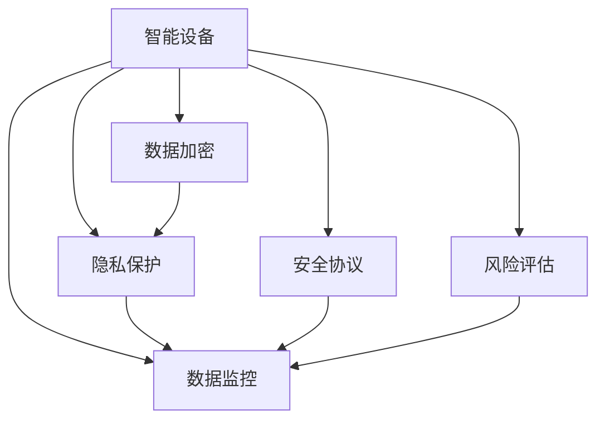

                 

# 智能设备安全：保护个人信息

> 关键词：智能设备安全, 个人信息保护, 数据加密, 隐私保护, 安全协议, 数据监控, 风险评估

## 1. 背景介绍

### 1.1 问题由来
在现代社会，智能设备（如智能手机、智能手表、智能家居等）已经广泛渗透到我们的日常生活中。它们不仅为我们提供了极大的便利，但也带来了隐私和安全风险。数据泄露、恶意软件攻击、隐私侵犯等安全事件频发，给我们的生活和工作带来了不可估量的损失。如何确保智能设备的安全，保护我们的个人信息，成为了一个亟待解决的课题。

### 1.2 问题核心关键点
智能设备安全涉及多个方面的问题，包括但不限于：

- 数据加密：确保设备上的数据在传输和存储时不会被未经授权的第三方访问。
- 隐私保护：防止设备上的个人信息被滥用或泄露。
- 安全协议：采用安全的通信协议，确保数据在网络传输中的安全性。
- 数据监控：实时监控设备上的数据流动，及时发现异常行为。
- 风险评估：定期对设备进行安全风险评估，识别潜在的安全威胁。

这些核心点构成了智能设备安全框架的基础，本文将逐一探讨这些关键问题，并提出相应的解决方案。

## 2. 核心概念与联系

### 2.1 核心概念概述

为了更好地理解智能设备安全的问题，本节将介绍几个关键概念：

- 智能设备（Smart Devices）：指通过嵌入软件、传感器等技术手段，实现联网功能并支持应用程序运行的电子设备，如智能手机、智能手表、智能家居等。
- 数据加密（Data Encryption）：指使用密码算法将数据转换为不可读形式，以防止未经授权的访问。
- 隐私保护（Privacy Protection）：指通过法律和技术手段，保护用户的个人信息不被滥用或泄露。
- 安全协议（Secure Protocols）：指在网络通信中使用的安全协议，如HTTPS、TLS等，确保数据在传输过程中的安全性。
- 数据监控（Data Monitoring）：指对设备上的数据流动进行实时监控，及时发现异常行为，防范安全威胁。
- 风险评估（Risk Assessment）：指通过定量和定性分析，评估智能设备面临的安全风险，指导安全策略的制定和实施。

这些概念之间的联系可以通过以下Mermaid流程图来展示：



这个流程图展示了几大核心概念及其之间的关系：

1. 智能设备是数据加密、隐私保护、安全协议、数据监控和风险评估的基础。
2. 数据加密是保护设备上数据不被未授权访问的重要手段。
3. 隐私保护是防止设备上个人信息被滥用或泄露的关键措施。
4. 安全协议是确保数据在网络传输中的安全性的重要保障。
5. 数据监控是实时防范安全威胁的有效手段。
6. 风险评估是识别潜在安全威胁，制定和优化安全策略的基础。

这些概念共同构成了智能设备安全的整体框架，使得我们能够系统地理解和应对各种安全问题。

## 3. 核心算法原理 & 具体操作步骤
### 3.1 算法原理概述

智能设备安全的核心在于保护设备上的数据不被未授权访问和泄露。这涉及到数据加密、隐私保护、安全协议等多个方面的技术手段。

### 3.2 算法步骤详解

#### 3.2.1 数据加密
数据加密的基本原理是使用加密算法将原始数据转换为不可读形式，只有持有密钥的用户才能解密还原。

具体步骤如下：
1. 选择一种加密算法，如AES、RSA等。
2. 使用密钥对数据进行加密，生成密文。
3. 将密文和密钥安全传输给接收方。
4. 接收方使用相同的密钥对密文进行解密，还原为原始数据。

#### 3.2.2 隐私保护
隐私保护的核心在于对个人信息进行匿名化处理，确保个人信息的不可追溯性。

具体步骤如下：
1. 收集个人信息，进行匿名化处理，如去除或模糊化个人标识信息。
2. 使用差分隐私技术，添加噪声，保护个人信息不被滥用。
3. 采用访问控制和权限管理机制，确保只有授权用户才能访问敏感信息。

#### 3.2.3 安全协议
安全协议的核心在于确保数据在网络传输中的安全性，防止中间人攻击和数据窃听。

具体步骤如下：
1. 使用TLS（传输层安全协议）或SSL（安全套接字层协议）等安全协议。
2. 通过数字证书和公钥基础设施（PKI）验证通信双方的身份。
3. 使用对称加密或非对称加密算法保护数据传输的安全性。

#### 3.2.4 数据监控
数据监控的核心在于实时监控设备上的数据流动，发现异常行为，及时采取应对措施。

具体步骤如下：
1. 部署数据监控工具，如日志分析系统、网络流量监控系统等。
2. 设置告警规则，对异常数据流动进行实时告警。
3. 对监控数据进行定期分析和审计，发现潜在的安全威胁。

#### 3.2.5 风险评估
风险评估的核心在于识别和评估智能设备面临的安全风险，制定相应的安全策略。

具体步骤如下：
1. 收集和分析设备上的数据，识别潜在的安全威胁。
2. 使用定量和定性分析方法，评估安全风险的严重程度。
3. 根据评估结果，制定和优化安全策略，提高设备的安全防护能力。

### 3.3 算法优缺点

智能设备安全技术具有以下优点：
1. 数据加密和隐私保护技术能够有效防止数据泄露和未授权访问。
2. 安全协议能够确保数据在网络传输中的安全性，防止中间人攻击和数据窃听。
3. 数据监控和风险评估能够实时发现和防范安全威胁，提高设备的防护能力。

但这些技术也存在以下缺点：
1. 数据加密和隐私保护技术可能会影响数据的可用性和性能，如解密过程可能需要消耗较多的计算资源。
2. 安全协议可能会增加系统的复杂性和运行成本，如数字证书和公钥基础设施的管理。
3. 数据监控和风险评估需要大量的资源和人力资源，如实时监控工具和分析人员的配置。

尽管存在这些缺点，但就目前而言，智能设备安全技术仍是保障设备安全的重要手段。未来相关研究将进一步优化这些技术，降低其对性能和成本的影响，同时提高其自动化和智能化水平。

### 3.4 算法应用领域

智能设备安全技术在多个领域得到了广泛应用，如：

- 金融行业：使用数据加密和隐私保护技术，保护客户交易数据和个人信息的安全。
- 医疗行业：使用安全协议和数据监控技术，确保患者信息在传输和存储过程中的安全性。
- 政府和公共安全：使用风险评估和安全协议，确保敏感数据的防护，防止信息泄露和恶意攻击。
- 物联网（IoT）：使用数据加密和安全协议，保护物联网设备之间的通信安全。
- 云服务和云存储：使用数据加密和隐私保护技术，确保云服务中数据的保护，防止数据泄露。

除了上述这些领域外，智能设备安全技术还在其他许多应用场景中得到了应用，为各个行业提供了安全保障。

## 4. 数学模型和公式 & 详细讲解  
### 4.1 数学模型构建

本节将使用数学语言对智能设备安全的相关技术进行严格的刻画。

### 4.2 公式推导过程

#### 4.2.1 数据加密

以AES加密算法为例，其核心原理为：使用一个可变长度的密钥和一个固定的块大小（128位），对明文进行轮密钥加密，最终生成密文。

公式推导如下：
$$
E_{k}(m) = F_{k}(... F_{k-1}(F_{k-2}(... F_{1}(m))), \text{其中} F_{k}(m, k) = \oplus(m, k)
$$

其中，$E_{k}(m)$表示明文$m$在密钥$k$下的加密结果，$F_{k}(m, k)$表示明文$m$和密钥$k$进行异或运算，$\oplus$表示异或运算。

#### 4.2.2 隐私保护

差分隐私技术通过向数据中添加噪声，使得单个数据点的信息变得不可追溯。以$\epsilon$-差分隐私为例，其核心原理为：
$$
P[\text{Query}(m) = x] \leq \exp(\epsilon) \cdot P[\text{Query}(m') = x]
$$

其中，$\text{Query}(m)$表示查询函数，$x$表示查询结果，$\epsilon$表示隐私预算。

#### 4.2.3 安全协议

TLS协议通过使用公钥基础设施（PKI）和数字证书，确保通信双方的身份验证和数据加密。其核心原理如下：
1. 客户端向服务器发送随机数$R$和公钥$E_{K_{pub}}(R)$。
2. 服务器使用私钥$D_{K_{prv}}$对$R$进行解密，生成共享密钥$K_{shared} = E_{K_{pub}}(R) \oplus D_{K_{prv}}(R)$。
3. 使用$K_{shared}$进行数据加密和解密，确保数据传输的安全性。

#### 4.2.4 数据监控

数据监控系统通常使用日志分析和网络流量监控工具，对设备上的数据流动进行实时监控。公式推导如下：
$$
\text{Event Rate} = \frac{\text{Total Events}}{\text{Total Time}}
$$

其中，$\text{Event Rate}$表示单位时间内的事件发生频率，$\text{Total Events}$表示总事件数，$\text{Total Time}$表示总时间。

#### 4.2.5 风险评估

风险评估通常使用定量或定性分析方法，对设备面临的安全风险进行评估。公式推导如下：
$$
\text{Risk} = \text{Threat} \times \text{Vulnerability} \times \text{Impact}
$$

其中，$\text{Risk}$表示风险，$\text{Threat}$表示威胁，$\text{Vulnerability}$表示脆弱性，$\text{Impact}$表示影响。

### 4.3 案例分析与讲解

#### 4.3.1 案例一：银行交易系统的安全

银行交易系统需要保证用户交易数据的安全性。其核心技术手段包括：
1. 数据加密：使用AES加密算法对交易数据进行加密，确保数据在传输和存储过程中的安全性。
2. 隐私保护：使用差分隐私技术，对用户交易数据进行匿名化处理，防止数据泄露。
3. 安全协议：使用TLS协议，确保银行服务器和客户端之间的通信安全。

#### 4.3.2 案例二：智能家居系统的安全

智能家居系统需要保证用户隐私数据的安全性。其核心技术手段包括：
1. 数据加密：使用AES加密算法对用户数据进行加密，确保数据在传输和存储过程中的安全性。
2. 隐私保护：使用访问控制和权限管理机制，确保只有授权用户才能访问敏感数据。
3. 数据监控：部署网络流量监控系统，对设备上的数据流动进行实时监控，防止数据泄露。

## 5. 项目实践：代码实例和详细解释说明
### 5.1 开发环境搭建

在进行智能设备安全实践前，我们需要准备好开发环境。以下是使用Python进行OpenSSL和OpenVPN开发的环境配置流程：

1. 安装Python：从官网下载并安装Python，建议使用3.x版本。
2. 安装OpenSSL：根据操作系统版本，从官网下载安装OpenSSL库。
3. 安装OpenVPN：从官网下载安装OpenVPN，并按照官方文档进行配置。
4. 配置VPN服务器：在服务器上安装OpenVPN服务器端，并配置VPN客户端。
5. 配置防火墙和路由：配置防火墙和路由规则，确保VPN连接的安全。

完成上述步骤后，即可在Python环境下开始智能设备安全的开发实践。

### 5.2 源代码详细实现

这里我们以TLS协议为例，给出使用Python实现数据加密和身份验证的代码实现。

首先，导入必要的库：

```python
from OpenSSL import crypto
from OpenSSL import SSL
import base64
import binascii
```

然后，定义生成密钥对和数字证书的函数：

```python
def generate_key_pair():
    key = crypto.PKey()
    key.generate_key(crypto.TYPE_RSA, 2048)
    return key

def generate_cert(key, cn):
    cert = crypto.X509()
    cert.get_subject_name().CN = cn
    cert.set_issuer(cert.get_subject_name())
    cert.set_notBefore(cert.getToday())
    cert.set_notAfter(60 * 24 * 365)
    cert.set_pubkey(key)
    cert.set_extensions(
        crypto.X509_Extensions.create_extensions(
            "keyUsage", crypto.EXT_KEY_USAGE, "digitalSignature, keyEncipherment"
        )
    )
    cert.sign(key, "sha256WithRSAEncryption")
    return cert
```

接下来，定义实现TLS加密和身份验证的函数：

```python
def tls_client(server, port, ca_cert, client_cert, client_key):
    context = SSL.Context(SSL.SSLv23_METHOD)
    context.set_cipher_list("HIGH:!DH:!aNULL")
    context.use_certificate_file(ca_cert)
    context.use_privatekey_file(client_key)
    context.verify_mode = SSL.VERIFY_PEER
    context.check_hostname = True
    context.load_verify_locations(ca_cert)
    server_conn = SSL.Connection(context, server)
    server_conn.connect((server, port))
    server_conn.do_handshake()
    return server_conn
```

最后，启动TLS加密的示例代码：

```python
if __name__ == "__main__":
    server = "server.com"
    port = 443
    ca_cert = "ca_cert.pem"
    client_cert = "client_cert.pem"
    client_key = "client_key.pem"
    client_conn = tls_client(server, port, ca_cert, client_cert, client_key)
    while True:
        data = client_conn.read(4096)
        if not data:
            break
        encrypted_data = base64.b64encode(data)
        print("Received:", encrypted_data)
```

以上就是使用Python实现TLS协议的完整代码实现。可以看到，TLS协议通过使用公钥基础设施（PKI）和数字证书，确保了通信双方的身份验证和数据加密。

### 5.3 代码解读与分析

让我们再详细解读一下关键代码的实现细节：

**generate_key_pair函数**：
- 使用OpenSSL库生成一个2048位的RSA密钥对，包括公钥和私钥。

**generate_cert函数**：
- 定义一个X.509证书对象，设置证书的主题名称（CN）、发行者、有效期、公钥等属性。
- 设置证书扩展项，包括密钥用途（数字签名、密钥加密）。
- 使用私钥对证书进行签名。
- 返回生成的证书对象。

**tls_client函数**：
- 创建SSL上下文对象，设置加密套件、证书、私钥、验证模式等。
- 建立SSL连接，与服务器进行握手。
- 返回连接对象，便于后续数据传输。

通过以上步骤，我们能够实现TLS协议的加密和身份验证功能。实际应用中，可以进一步扩展TLS协议，支持更多的加密算法和密钥交换算法，提高系统的安全性。

## 6. 实际应用场景
### 6.1 智能家居系统

智能家居系统需要保护用户的隐私数据，防止数据泄露和未授权访问。其核心技术手段包括：

- 数据加密：使用AES加密算法对用户数据进行加密，确保数据在传输和存储过程中的安全性。
- 隐私保护：使用访问控制和权限管理机制，确保只有授权用户才能访问敏感数据。
- 数据监控：部署网络流量监控系统，对设备上的数据流动进行实时监控，防止数据泄露。

### 6.2 医疗健康系统

医疗健康系统需要保护患者隐私数据，防止数据泄露和恶意攻击。其核心技术手段包括：

- 数据加密：使用AES加密算法对患者数据进行加密，确保数据在传输和存储过程中的安全性。
- 隐私保护：使用差分隐私技术，对患者数据进行匿名化处理，防止数据泄露。
- 安全协议：使用TLS协议，确保医疗服务器和客户端之间的通信安全。

### 6.3 金融交易系统

金融交易系统需要保护用户交易数据，防止数据泄露和未授权访问。其核心技术手段包括：

- 数据加密：使用AES加密算法对交易数据进行加密，确保数据在传输和存储过程中的安全性。
- 隐私保护：使用差分隐私技术，对用户交易数据进行匿名化处理，防止数据泄露。
- 安全协议：使用TLS协议，确保金融服务器和客户端之间的通信安全。

## 7. 工具和资源推荐
### 7.1 学习资源推荐

为了帮助开发者系统掌握智能设备安全的技术基础和实践技巧，这里推荐一些优质的学习资源：

1. 《网络安全原理与实践》：一本经典的网络安全书籍，全面介绍了网络安全的基本概念和前沿技术。
2. 《Python网络安全编程》：一本面向初学者的网络安全编程指南，通过Python实现网络安全技术。
3. 《TLS协议详解》：一本介绍TLS协议的书籍，详细讲解了TLS协议的原理和实现细节。
4. 《Web安全技术实战》：一本实战型的Web安全书籍，通过案例讲解Web安全的防护措施。
5. 《智能设备安全技术》：一本介绍智能设备安全的书籍，涵盖数据加密、隐私保护、安全协议等方面的内容。

通过对这些资源的学习实践，相信你一定能够快速掌握智能设备安全的核心技术，并应用于实际的安全防护中。

### 7.2 开发工具推荐

高效的开发离不开优秀的工具支持。以下是几款用于智能设备安全开发的常用工具：

1. OpenSSL：开源的网络安全工具库，支持TLS协议、SSL协议、数字证书等安全技术。
2. OpenVPN：开源的虚拟专用网络（VPN）解决方案，支持VPN服务器和客户端的部署和管理。
3. Wireshark：网络流量分析工具，支持捕获、分析和监控网络流量。
4. Snort：网络入侵检测系统，支持实时监控和分析网络流量。
5. Wi-Fi Analyzer：Wi-Fi网络分析工具，支持监控和分析Wi-Fi网络性能和安全风险。

合理利用这些工具，可以显著提升智能设备安全开发的效率，加速安全技术的研究和应用。

### 7.3 相关论文推荐

智能设备安全技术的发展源于学界的持续研究。以下是几篇奠基性的相关论文，推荐阅读：

1. "A Survey of Symmetric-Key Cryptography Algorithms"：介绍了多种对称加密算法的基本原理和安全性分析。
2. "A Survey of Privacy-Preserving Techniques for Smartphone Health Data"：介绍了多种隐私保护技术在智能设备中的应用。
3. "TLS 1.3 Specification"：TLS协议的最新标准，详细描述了TLS协议的实现细节和安全性设计。
4. "A Survey on Secure and Efficient Wearable Health Data Transmission"：介绍了多种安全传输技术在智能设备中的应用。
5. "Risk Assessment in Smart Home Security"：介绍了多种智能家居系统中的风险评估方法。

这些论文代表了大规模语料微调技术的发展脉络。通过学习这些前沿成果，可以帮助研究者把握学科前进方向，激发更多的创新灵感。

## 8. 总结：未来发展趋势与挑战
### 8.1 总结

本文对智能设备安全的核心问题进行了全面系统的介绍。首先阐述了智能设备安全的背景和重要性，明确了数据加密、隐私保护、安全协议、数据监控和风险评估等关键技术手段。其次，从原理到实践，详细讲解了智能设备安全的数学模型和算法实现，给出了智能设备安全开发的完整代码实例。同时，本文还广泛探讨了智能设备安全在智能家居、医疗健康、金融交易等领域的实际应用，展示了智能设备安全技术的广阔前景。此外，本文精选了智能设备安全的各类学习资源，力求为读者提供全方位的技术指引。

通过本文的系统梳理，可以看到，智能设备安全技术在保障用户隐私和数据安全方面具有重要价值，其核心技术手段包括数据加密、隐私保护、安全协议、数据监控和风险评估。尽管智能设备安全技术已经取得了一定进展，但在应对复杂的威胁环境、提升自动化和智能化水平、降低对资源的需求等方面，仍面临诸多挑战。未来，智能设备安全技术将进一步优化和创新，为构建安全、可靠、可解释、可控的智能设备系统提供坚实保障。

### 8.2 未来发展趋势

展望未来，智能设备安全技术将呈现以下几个发展趋势：

1. 自动化和智能化：智能设备安全技术将进一步向自动化和智能化方向发展，通过机器学习和大数据技术，实现自动化的威胁检测和防御。
2. 区块链技术的应用：区块链技术具有去中心化、不可篡改的特性，可以为智能设备安全提供新的解决方案，如基于区块链的身份认证和数据加密。
3. 隐私保护技术的创新：差分隐私、联邦学习等隐私保护技术将得到更广泛的应用，帮助用户在保护隐私的前提下，获取更好的用户体验。
4. 跨平台安全解决方案：智能设备安全技术将进一步向跨平台方向发展，支持多种设备和操作系统，提供统一的防护措施。
5. 实时监控和应急响应：智能设备安全技术将进一步向实时监控和应急响应方向发展，及时发现和应对安全威胁，减少损失。

这些趋势凸显了智能设备安全技术的广阔前景。这些方向的探索发展，必将进一步提升智能设备的安全防护能力，为构建安全、可靠、可解释、可控的智能设备系统提供坚实保障。

### 8.3 面临的挑战

尽管智能设备安全技术已经取得了一定进展，但在迈向更加智能化、普适化应用的过程中，它仍面临着诸多挑战：

1. 自动化和智能化水平较低：当前的智能设备安全技术仍依赖人工干预和手动配置，自动化和智能化水平较低，难以适应复杂的威胁环境。
2. 资源需求较高：智能设备安全技术需要大量的计算资源和人力资源，如高性能硬件设备、安全专家等，增加了系统成本。
3. 跨平台兼容性差：智能设备安全技术尚未实现跨平台兼容性，不同设备和操作系统的安全防护措施无法统一，增加了系统维护的复杂性。
4. 数据隐私保护难度大：智能设备中的数据量大、种类多，隐私保护难度大，如何在保护隐私的前提下，提供更好的用户体验，是一个重要问题。

尽管存在这些挑战，但随着技术的发展和应用的不断深入，相信这些挑战终将得到解决，智能设备安全技术将进一步向自动化、智能化、跨平台方向发展，为构建安全、可靠、可解释、可控的智能设备系统提供坚实保障。

### 8.4 研究展望

面对智能设备安全面临的诸多挑战，未来的研究需要在以下几个方面寻求新的突破：

1. 自动化和智能化技术：研究如何通过机器学习和大数据技术，实现智能设备安全的自动化和智能化，提高系统的防御能力。
2. 跨平台安全解决方案：研究如何实现跨平台兼容性，提供统一的防护措施，降低系统维护的复杂性。
3. 隐私保护技术创新：研究如何结合区块链和联邦学习等新兴技术，提高智能设备中的数据隐私保护能力，在保护隐私的前提下，提供更好的用户体验。
4. 实时监控和应急响应：研究如何实现智能设备安全的实时监控和应急响应，及时发现和应对安全威胁，减少损失。

这些研究方向将引领智能设备安全技术的未来发展，为构建安全、可靠、可解释、可控的智能设备系统提供坚实保障。

## 9. 附录：常见问题与解答

**Q1：智能设备安全是否适用于所有智能设备？**

A: 智能设备安全技术适用于大多数智能设备，包括智能手机、智能手表、智能家居等。但需要根据设备的具体特点，选择合适的安全措施，如使用数据加密和隐私保护技术。

**Q2：智能设备安全技术是否需要大量的计算资源和人力资源？**

A: 智能设备安全技术确实需要一定的计算资源和人力资源，如高性能硬件设备、安全专家等。但通过优化算法和优化资源使用，可以显著降低资源需求，提高系统的防护能力。

**Q3：智能设备安全技术如何与区块链技术结合？**

A: 智能设备安全技术可以通过区块链技术实现去中心化身份认证和数据加密，提升系统的安全性和可靠性。例如，在智能设备中引入基于区块链的数字证书和公钥基础设施，确保通信双方的身份验证和数据加密。

**Q4：智能设备安全技术如何在保护隐私的前提下，提供更好的用户体验？**

A: 智能设备安全技术可以通过隐私保护技术，如差分隐私、联邦学习等，保护用户的隐私数据。同时，通过自动化的安全检测和防御措施，提高系统的自动化和智能化水平，提供更好的用户体验。

通过本文的系统梳理，可以看到，智能设备安全技术在保障用户隐私和数据安全方面具有重要价值，其核心技术手段包括数据加密、隐私保护、安全协议、数据监控和风险评估。尽管智能设备安全技术已经取得了一定进展，但在应对复杂的威胁环境、提升自动化和智能化水平、降低对资源的需求等方面，仍面临诸多挑战。未来，智能设备安全技术将进一步优化和创新，为构建安全、可靠、可解释、可控的智能设备系统提供坚实保障。

总之，智能设备安全技术需要从数据加密、隐私保护、安全协议、数据监控和风险评估等多个方面进行全面防护，才能实现对用户隐私和数据的安全保护。同时，未来的研究应聚焦于自动化和智能化、区块链技术、隐私保护技术创新、跨平台安全解决方案等领域，进一步提升智能设备安全技术的防护能力，保障用户的隐私和数据安全。

