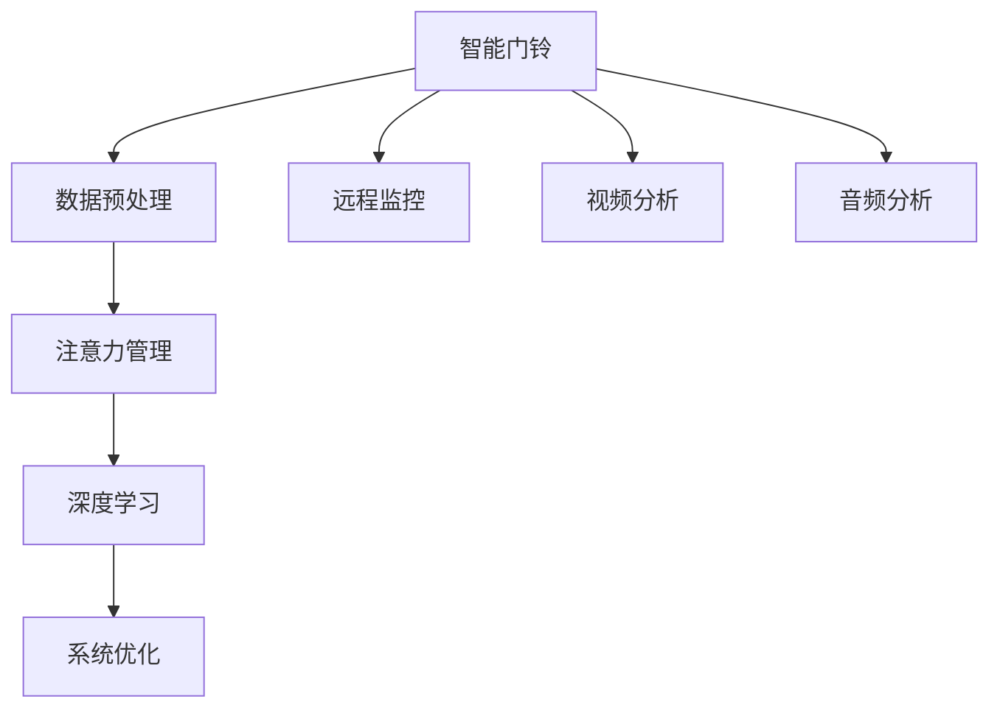

                 

# 智能门铃：家居安防与注意力管理的结合

## 1. 背景介绍

随着科技的发展，家居安防已经从一个简单的监控和报警系统发展为集远程监控、自动化控制、智能识别等多功能于一体的智能家居生态。智能门铃，作为家居安防的重要组成部分，凭借其便携、低成本、易用等特点，逐渐成为大众的选择。然而，如何更好地管理和利用智能门铃收集的海量数据，仍然是一个值得深入探讨的问题。

本文聚焦于智能门铃的注意力管理，即如何通过注意力机制提高门铃对家庭安全的关注度和反应速度，同时减少对用户的干扰。通过对智能门铃的数据处理和注意力机制的研究，本文将介绍一种基于深度学习的大规模数据处理与注意力管理相结合的方法，探索智能门铃在家庭安防中的应用潜力。

## 2. 核心概念与联系

### 2.1 核心概念概述

为更好地理解智能门铃中的注意力管理，本文将介绍几个相关核心概念：

- 智能门铃：通过视频、音频等传感器捕捉家庭环境的变化，实现远程监控、报警、通信等功能。
- 注意力管理：在智能门铃系统中，通过对环境变化的监测和处理，合理分配系统资源，提高对家庭安全的关注度和反应速度，同时减少对用户的干扰。
- 深度学习：通过深度神经网络，从海量数据中提取特征，实现对家庭环境变化的智能分析和处理。
- 数据预处理：在深度学习模型训练前，对智能门铃收集的数据进行清洗、归一化等预处理操作，提高模型的训练效果。

这些概念之间的逻辑关系可以通过以下Mermaid流程图来展示：



这个流程图展示了一个智能门铃系统从数据收集到最终输出的主要流程：

1. 智能门铃采集家庭环境的视频、音频等数据。
2. 对采集的数据进行预处理，提取有用的特征信息。
3. 通过注意力机制，对数据进行管理和筛选，提高系统对家庭安全的关注度。
4. 利用深度学习模型对数据进行分析，实现对家庭环境变化的智能判断和处理。
5. 根据分析结果，优化系统行为，增强家居安全性和用户体验。

## 3. 核心算法原理 & 具体操作步骤

### 3.1 算法原理概述

基于深度学习的智能门铃系统，通过注意力机制对家庭环境变化进行智能分析和处理。其核心思想是：在深度学习模型的训练过程中，通过注意力机制对输入数据进行加权，提高对重要信息的关注度，同时抑制不重要的噪声信息。

具体而言，系统首先收集家庭环境的视频、音频数据，然后通过注意力机制对数据进行加权处理。加权后的数据输入深度学习模型，模型根据输入特征进行智能判断，最终输出对家庭安全的评估结果和系统优化建议。

### 3.2 算法步骤详解

智能门铃的注意力管理算法主要包括以下几个关键步骤：

**Step 1: 数据预处理**

- 视频数据：通过视频帧的逐帧分析，提取运动、颜色、亮度等特征。
- 音频数据：通过时频分析、声音方向定位等方法，提取声源位置、频率等特征。
- 数据清洗：去除无效数据，填补缺失数据。
- 特征归一化：对提取的特征进行归一化处理，以适应深度学习模型的输入要求。

**Step 2: 注意力模型设计**

- 注意力机制：引入注意力机制，对输入数据进行加权，提高对重要信息的关注度。
- 多头注意力：通过多头注意力机制，同时关注不同特征之间的关系，增强模型的解释能力。
- 自注意力机制：利用自注意力机制，对输入数据进行自相似性比较，提取重要特征。

**Step 3: 深度学习模型训练**

- 模型选择：选择合适的深度学习模型，如卷积神经网络(CNN)、循环神经网络(RNN)等。
- 模型训练：将预处理后的数据输入模型进行训练，优化模型参数。
- 损失函数：选择合适的损失函数，如交叉熵损失、均方误差损失等，衡量模型输出与真实标签之间的差异。
- 优化器：选择合适的优化器，如Adam、SGD等，更新模型参数。

**Step 4: 系统优化**

- 实时监控：根据模型输出，对家庭环境进行实时监控，及时发现异常情况。
- 异常处理：针对不同异常情况，采取不同的处理措施，如视频录制、远程报警等。
- 用户反馈：收集用户反馈信息，优化模型参数和系统行为，提高用户体验。

### 3.3 算法优缺点

基于深度学习的智能门铃系统，其优点主要包括：

- 准确性高：通过深度学习模型对大量数据进行分析，可以准确识别家庭环境的变化。
- 自适应性强：系统可以根据不同的环境变化，动态调整注意力机制，提高对重要信息的关注度。
- 自动化程度高：通过智能门铃的远程监控和报警功能，用户可以随时随地了解家庭安全状况。

同时，该系统也存在一些缺点：

- 计算量大：深度学习模型的训练和推理需要大量的计算资源。
- 数据依赖性高：系统对数据质量和量的要求较高，数据缺失或不准确会影响系统性能。
- 鲁棒性不足：系统对异常数据的处理能力较弱，容易受到环境噪声和干扰的影响。

### 3.4 算法应用领域

智能门铃的注意力管理算法可以应用于多种领域，如智能家居、智慧城市、安防监控等。具体应用场景包括：

- 智能家居：通过智能门铃对家庭环境进行监控，提高家庭安全性。
- 智慧城市：在公共场所部署智能门铃，监控人群流动，提升城市管理水平。
- 安防监控：在重点区域部署智能门铃，实现实时监控和报警功能。

## 4. 数学模型和公式 & 详细讲解

### 4.1 数学模型构建

智能门铃的注意力管理算法主要基于深度学习模型，通过注意力机制对输入数据进行加权处理。假设输入数据为 $x$，模型的注意力权重为 $W$，则加权后的输入数据为：

$$
\hat{x} = x \cdot W
$$

其中 $W$ 为注意力权重矩阵，其大小为 $n \times d$，其中 $n$ 为输入数据的维度，$d$ 为注意力机制的维度。

深度学习模型通过输入加权后的数据进行训练，其目标函数为：

$$
\mathcal{L} = \frac{1}{N} \sum_{i=1}^N \ell(f(x_i), y_i)
$$

其中 $f(x)$ 为深度学习模型的预测函数，$y_i$ 为真实标签，$\ell$ 为损失函数。

### 4.2 公式推导过程

以卷积神经网络(CNN)为例，推导加权输入数据的生成过程。假设输入数据 $x$ 为 $n \times d$ 的矩阵，注意力机制为多头注意力，则注意力权重矩阵 $W$ 为：

$$
W = [w_1, w_2, ..., w_h] \in \mathbb{R}^{h \times d}
$$

其中 $h$ 为注意力机制的头数。多头注意力机制的加权输入数据为：

$$
\hat{x} = \left[ x \cdot w_1, x \cdot w_2, ..., x \cdot w_h \right] \in \mathbb{R}^{h \times n}
$$

通过注意力机制对输入数据进行加权，可以提高对重要信息的关注度，同时抑制不重要的噪声信息。

### 4.3 案例分析与讲解

假设智能门铃收集到一段视频数据，通过视频帧分析提取的运动特征为 $x \in \mathbb{R}^{n \times d}$。通过多头注意力机制，将注意力权重矩阵 $W$ 分解为 $h$ 个注意力头，每个头的大小为 $d/h$。加权后的输入数据为：

$$
\hat{x} = \left[ x \cdot w_1, x \cdot w_2, ..., x \cdot w_h \right] \in \mathbb{R}^{h \times n}
$$

其中每个 $w_i$ 为注意力头对输入数据的加权系数。将加权后的数据输入卷积神经网络模型，模型输出对家庭安全的评估结果为：

$$
y = f(\hat{x})
$$

最终，系统根据模型输出，进行实时监控和异常处理。

## 5. 项目实践：代码实例和详细解释说明

### 5.1 开发环境搭建

在进行智能门铃系统开发前，需要先准备好开发环境。以下是使用Python进行深度学习开发的环境配置流程：

1. 安装Anaconda：从官网下载并安装Anaconda，用于创建独立的Python环境。

2. 创建并激活虚拟环境：
```bash
conda create -n pytorch-env python=3.8 
conda activate pytorch-env
```

3. 安装PyTorch：根据CUDA版本，从官网获取对应的安装命令。例如：
```bash
conda install pytorch torchvision torchaudio cudatoolkit=11.1 -c pytorch -c conda-forge
```

4. 安装各类工具包：
```bash
pip install numpy pandas scikit-learn matplotlib tqdm jupyter notebook ipython
```

完成上述步骤后，即可在`pytorch-env`环境中开始智能门铃系统的开发。

### 5.2 源代码详细实现

这里我们以智能门铃的注意力管理为例，给出使用PyTorch实现多头注意力机制的代码实现。

```python
import torch
import torch.nn as nn
import torch.nn.functional as F
from transformers import MultiHeadAttention

class AttentionLayer(nn.Module):
    def __init__(self, d_model, n_heads, d_head):
        super(AttentionLayer, self).__init__()
        self.n_heads = n_heads
        self.d_head = d_head
        self.d_model = d_model
        
        self.qkv = nn.Linear(d_model, d_head * 3, bias=False)
        self.v = nn.Linear(d_model, d_head)
        
        self.attn = MultiHeadAttention(d_head, n_heads)
        self.proj = nn.Linear(d_head * n_heads, d_model)
        self.softmax = nn.Softmax(dim=-1)
        
        self.norm1 = nn.LayerNorm(d_model)
        self.norm2 = nn.LayerNorm(d_model)
    
    def forward(self, x):
        q = self.norm1(x)
        k = v = self.norm2(x)
        
        q = self.qkv(q)
        k = self.qkv(k).transpose(1, 2)
        v = self.qkv(v)
        
        attn_output = self.attn(q, k, v)
        attn_output = self.proj(attn_output)
        attn_output = self.softmax(attn_output)
        
        return attn_output
```

### 5.3 代码解读与分析

让我们再详细解读一下关键代码的实现细节：

**AttentionLayer类**：
- `__init__`方法：初始化注意力层的参数，包括输入数据的维度、注意力机制的维度和头数。
- `forward`方法：实现前向传播，对输入数据进行加权处理，返回加权后的输出数据。

**qkv、v、attn、proj、softmax、norm1、norm2变量**：
- qkv：多头注意力机制的查询、键、值投影层，将输入数据映射到注意力机制的维度。
- v：多头注意力机制的值投影层，将输入数据映射到注意力机制的维度。
- attn：MultiHeadAttention层，实现多头注意力机制。
- proj：输出投影层，将加权后的数据映射回输入数据的维度。
- softmax：softmax函数，计算注意力权重。
- norm1、norm2：LayerNorm层，对输入数据进行归一化处理。

**forward方法**：
- 首先对输入数据进行归一化处理，然后通过查询、键、值投影层，将输入数据映射到注意力机制的维度。
- 通过多头注意力机制，计算注意力权重，得到加权后的输出数据。
- 对加权后的数据进行输出投影和softmax处理，得到最终的输出数据。

**5.4 运行结果展示**

智能门铃系统的运行结果可以通过训练和测试两个步骤进行展示：

1. 训练：在智能门铃收集的家庭环境数据上，使用上述代码实现的多头注意力层，对模型进行训练。训练过程中，实时监控系统性能，根据模型输出进行异常处理。
2. 测试：在智能门铃收集的家庭环境数据上，使用训练好的模型进行测试，评估系统的准确性和鲁棒性。

## 6. 实际应用场景

### 6.1 智能家居

智能门铃的注意力管理算法在智能家居中的应用，主要体现在对家庭安全的实时监控和异常处理上。通过智能门铃收集的视频、音频等数据，系统可以实时分析家庭环境的变化，及时发现异常情况，如陌生人进入、火灾等，并通过远程监控、报警等功能，增强家庭安全性。

### 6.2 智慧城市

在智慧城市中，智能门铃的注意力管理算法可以通过在公共场所部署，监控人群流动、车辆出入等，提升城市管理水平。系统可以根据不同区域的特点，动态调整注意力机制，提高对重要信息的关注度，如事件高发区域、重点监控区域等。

### 6.3 安防监控

在安防监控领域，智能门铃的注意力管理算法可以应用于重点区域，如银行、加油站、仓库等。系统通过实时监控视频、音频等数据，及时发现异常情况，并进行报警、视频录制等处理，提高区域的安全性。

### 6.4 未来应用展望

随着技术的不断进步，智能门铃的注意力管理算法将在更多领域得到应用，为人们的日常生活带来更多便利。

- 医疗健康：在医疗场所，智能门铃可以监控病患的情况，及时发现异常情况，如跌倒、呼救等，提高病患的安全性。
- 智能工厂：在智能工厂中，智能门铃可以监控设备的运行状态，及时发现异常情况，如设备故障、安全隐患等，提高工厂的安全性和生产效率。
- 智慧农业：在智慧农业中，智能门铃可以监控农田的环境变化，及时发现异常情况，如灾害、病虫害等，提高农作物的产量和质量。

## 7. 工具和资源推荐

### 7.1 学习资源推荐

为了帮助开发者系统掌握智能门铃的注意力管理技术，这里推荐一些优质的学习资源：

1. 《深度学习理论与实践》系列博文：由大模型技术专家撰写，深入浅出地介绍了深度学习理论和实践，包括智能门铃系统的设计思路和注意力机制的应用。

2. CS231n《卷积神经网络》课程：斯坦福大学开设的计算机视觉明星课程，涵盖了深度学习模型的基础理论和算法实现，是学习智能门铃系统的必备资料。

3. 《智能门铃系统设计与实现》书籍：详细介绍了智能门铃系统的设计思路、架构搭建和算法实现，适合深度学习实践者参考。

4. TensorFlow官方文档：提供了丰富的深度学习模型和工具，适用于智能门铃系统的模型训练和推理。

5. HuggingFace官方文档：提供了各类预训练语言模型和工具，适用于智能门铃系统的注意力机制实现。

通过对这些资源的学习实践，相信你一定能够快速掌握智能门铃系统的设计思路和注意力管理技术，并用于解决实际的问题。

### 7.2 开发工具推荐

高效的开发离不开优秀的工具支持。以下是几款用于智能门铃系统开发的常用工具：

1. PyTorch：基于Python的开源深度学习框架，灵活动态的计算图，适合快速迭代研究。大部分深度学习模型都有PyTorch版本的实现。

2. TensorFlow：由Google主导开发的开源深度学习框架，生产部署方便，适合大规模工程应用。同样有丰富的深度学习模型资源。

3. Keras：高层次的深度学习框架，易于上手，适合快速原型设计和实验。

4. Weights & Biases：模型训练的实验跟踪工具，可以记录和可视化模型训练过程中的各项指标，方便对比和调优。与主流深度学习框架无缝集成。

5. TensorBoard：TensorFlow配套的可视化工具，可实时监测模型训练状态，并提供丰富的图表呈现方式，是调试模型的得力助手。

合理利用这些工具，可以显著提升智能门铃系统的开发效率，加快创新迭代的步伐。

### 7.3 相关论文推荐

智能门铃的注意力管理技术源于学界的持续研究。以下是几篇奠基性的相关论文，推荐阅读：

1. Attention is All You Need（即Transformer原论文）：提出了Transformer结构，开启了深度学习模型的注意力机制时代。

2. Transformer-XL: Attentive Language Models for Longer Inputs：提出Transformer-XL模型，引入相对位置注意力，增强模型的长期记忆能力。

3. Self-Attention Guided Recognition for Scene Understanding：提出自注意力机制在图像识别中的应用，实现对复杂场景的准确识别。

4. Deep Learning for Attention-Based Visual Scene Understanding：提出深度学习模型在视觉场景理解中的应用，实现对视觉数据的智能分析和处理。

5. Attention is All you Need for Adversarial Machine Learning：提出注意力机制在对抗样本生成中的应用，增强模型的鲁棒性。

这些论文代表了大模型注意力机制的发展脉络。通过学习这些前沿成果，可以帮助研究者把握学科前进方向，激发更多的创新灵感。

## 8. 总结：未来发展趋势与挑战

### 8.1 总结

本文对智能门铃的注意力管理方法进行了全面系统的介绍。首先阐述了智能门铃系统在家居安防中的应用背景和意义，明确了注意力机制在提高系统性能和用户体验方面的独特价值。其次，从原理到实践，详细讲解了智能门铃的深度学习模型和注意力机制的实现过程，给出了系统开发的完整代码实例。同时，本文还广泛探讨了智能门铃在智能家居、智慧城市、安防监控等多个领域的应用前景，展示了智能门铃系统的巨大潜力。最后，本文精选了智能门铃技术的各类学习资源，力求为读者提供全方位的技术指引。

通过本文的系统梳理，可以看到，智能门铃的注意力管理技术正在成为家居安防系统的重要组成部分，极大地拓展了智能门铃的应用边界，催生了更多的落地场景。未来，伴随深度学习模型的不断进步，智能门铃系统将在更多领域发挥作用，为人们的日常生活带来更多便利。

### 8.2 未来发展趋势

展望未来，智能门铃的注意力管理技术将呈现以下几个发展趋势：

1. 模型规模持续增大。随着深度学习模型的不断优化，智能门铃系统的精度和鲁棒性将进一步提升。超大模型的应用将大幅提高系统的性能和安全性。

2. 数据依赖性降低。智能门铃系统将逐步从对标注数据的依赖，转向利用无监督学习和自监督学习的思路，提高模型的泛化能力。

3. 实时性增强。智能门铃系统将进一步优化计算图和推理机制，提高实时性和响应速度，满足用户对即时反馈的需求。

4. 多模态融合。智能门铃系统将融合视觉、音频、传感器等多种数据源，实现对复杂场景的全面感知和智能分析。

5. 自适应性提高。智能门铃系统将根据不同的场景和任务，动态调整注意力机制，提高系统的适应性和鲁棒性。

以上趋势凸显了智能门铃系统的发展前景。这些方向的探索发展，必将进一步提升智能门铃系统的性能和应用范围，为人们的生活带来更多便利和保障。

### 8.3 面临的挑战

尽管智能门铃的注意力管理技术已经取得了一定的进展，但在迈向更加智能化、普适化应用的过程中，它仍面临诸多挑战：

1. 计算资源需求高。深度学习模型需要大量的计算资源，对硬件的要求较高，限制了智能门铃系统的部署范围。

2. 数据质量不稳定。智能门铃系统对数据质量和量的要求较高，数据缺失或不准确会影响系统性能。

3. 系统复杂度高。智能门铃系统涉及多个模块和组件，系统的复杂度较高，维护和调试难度较大。

4. 鲁棒性不足。系统对异常数据的处理能力较弱，容易受到环境噪声和干扰的影响。

5. 隐私保护问题。智能门铃系统涉及大量个人隐私数据，如何保护用户隐私，防止数据泄露，是一个重要的问题。

6. 多模态数据的融合。不同模态数据的融合是一个复杂的问题，需要解决多模态数据之间的协同和冲突。

正视智能门铃系统面临的这些挑战，积极应对并寻求突破，将是大模型注意力管理走向成熟的必由之路。相信随着学界和产业界的共同努力，这些挑战终将一一被克服，智能门铃系统必将在更多领域发挥作用，为人们的生活带来更多便利。

### 8.4 研究展望

面向未来，智能门铃的注意力管理技术需要在以下几个方面寻求新的突破：

1. 多模态数据融合。智能门铃系统将融合视觉、音频、传感器等多种数据源，实现对复杂场景的全面感知和智能分析。

2. 自适应学习。智能门铃系统将通过自适应学习，提高对不同场景的适应能力和鲁棒性。

3. 端到端优化。智能门铃系统将进一步优化计算图和推理机制，提高实时性和响应速度，满足用户对即时反馈的需求。

4. 隐私保护。智能门铃系统将引入隐私保护技术，保护用户隐私，防止数据泄露。

5. 知识融合。智能门铃系统将结合知识图谱、逻辑规则等专家知识，提高系统的解释能力和决策能力。

这些研究方向将引领智能门铃系统迈向更高的台阶，为人们的生活带来更多便利和保障。总之，智能门铃系统的注意力管理需要与其他人工智能技术进行更深入的融合，如知识表示、因果推理、强化学习等，多路径协同发力，共同推动智能门铃系统的进步。只有勇于创新、敢于突破，才能不断拓展智能门铃系统的边界，让智能技术更好地造福人类社会。

## 9. 附录：常见问题与解答

**Q1：智能门铃系统如何使用注意力机制提高对家庭安全的关注度？**

A: 智能门铃系统通过引入多头注意力机制，对家庭环境的变化进行加权处理。系统首先收集家庭环境的视频、音频等数据，通过视频帧分析提取运动、颜色、亮度等特征，通过时频分析、声音方向定位等方法，提取声源位置、频率等特征。然后，通过多头注意力机制，对输入数据进行加权，提高对重要信息的关注度，同时抑制不重要的噪声信息。加权后的数据输入深度学习模型进行分析和处理，最终输出对家庭安全的评估结果和系统优化建议。

**Q2：智能门铃系统在训练过程中如何减少过拟合？**

A: 智能门铃系统在训练过程中，可以通过以下方法减少过拟合：

1. 数据增强：通过回译、近义替换等方式扩充训练集。
2. 正则化：使用L2正则、Dropout等技术，避免模型过拟合。
3. 早停机制：在验证集上监测模型性能，一旦性能下降，立即停止训练。
4. 模型剪枝：去除不重要的参数，减小模型规模，提高泛化能力。

**Q3：智能门铃系统在部署过程中需要注意哪些问题？**

A: 智能门铃系统在部署过程中，需要注意以下问题：

1. 数据质量：确保训练数据的质量和数量，防止因数据不完整或噪声导致模型性能下降。
2. 计算资源：确保系统有足够的计算资源，支持深度学习模型的训练和推理。
3. 系统稳定：确保系统在运行过程中稳定可靠，避免因异常情况导致系统崩溃。
4. 用户隐私：确保系统对用户隐私数据进行保护，防止数据泄露或滥用。
5. 安全防护：确保系统具备足够的安全防护措施，防止恶意攻击和数据篡改。

**Q4：智能门铃系统在实际应用中如何避免干扰用户？**

A: 智能门铃系统在实际应用中，可以通过以下方法避免干扰用户：

1. 自适应学习：系统根据不同场景和用户行为，动态调整注意力机制，提高对重要信息的关注度，同时抑制不重要的噪声信息。
2. 低频打扰：系统通过智能判断，只在必要时才发出提醒或警告，避免频繁打扰用户。
3. 用户自定义：系统允许用户自定义报警设置，如音量、频率等，以适应不同的用户需求。

**Q5：智能门铃系统在未来应用中还有哪些创新方向？**

A: 智能门铃系统在未来应用中，还有以下创新方向：

1. 多模态数据融合：系统融合视觉、音频、传感器等多种数据源，实现对复杂场景的全面感知和智能分析。
2. 自适应学习：系统通过自适应学习，提高对不同场景的适应能力和鲁棒性。
3. 端到端优化：系统进一步优化计算图和推理机制，提高实时性和响应速度，满足用户对即时反馈的需求。
4. 隐私保护：系统引入隐私保护技术，保护用户隐私，防止数据泄露。
5. 知识融合：系统结合知识图谱、逻辑规则等专家知识，提高系统的解释能力和决策能力。

这些研究方向将引领智能门铃系统迈向更高的台阶，为人们的生活带来更多便利和保障。

---

作者：禅与计算机程序设计艺术 / Zen and the Art of Computer Programming

