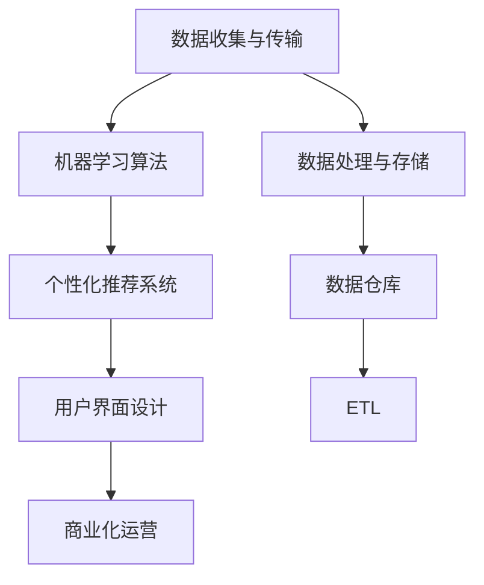

                 

# 智能雨伞创业：天气预报的随身应用

## 1. 背景介绍

### 1.1 问题由来
在现代社会，天气预报信息已成为我们日常生活中不可或缺的一部分。无论是出行安排、户外活动还是农作物种植，准确的天气信息都能够帮助我们做出科学的决策。然而，传统的天气预报系统往往受限于地域和时效，难以覆盖全球范围，且实时性不足，用户体验亟需提升。

近年来，随着人工智能和大数据分析技术的快速发展，智能雨伞作为天气预报的随身应用，应运而生。通过将天气预报与移动设备相结合，智能雨伞能够实时接收和更新气象信息，为人们提供个性化的天气服务，显著改善用户体验。

### 1.2 问题核心关键点
智能雨伞的核心技术在于通过移动设备实时接收和处理天气数据，结合机器学习算法进行智能分析，为用户提供个性化的天气预报和应对建议。

核心技术包括以下几个方面：

1. **数据收集与传输**：收集全球各地的天气数据，通过移动网络进行实时传输。
2. **数据处理与存储**：对接收到的数据进行清洗、处理和存储，建立数据仓库。
3. **算法模型训练**：开发机器学习模型，对天气数据进行分析和预测。
4. **个性化推荐**：基于用户行为和偏好，提供个性化的天气建议。
5. **用户界面设计**：构建简洁易用的移动应用界面，提升用户体验。
6. **商业化运营**：搭建商业化平台，通过广告和增值服务实现盈利。

这些技术点相互交织，共同构成了智能雨伞的核心竞争力。通过系统性地解决这些问题，智能雨伞有望成为未来天气预报应用的新标杆。

### 1.3 问题研究意义
智能雨伞项目的研究和开发，不仅能够提升天气预报的实时性和准确性，还能够推动人工智能和大数据技术在实际应用中的落地，具有重要的研究意义和应用价值。

1. **提升用户体验**：实时获取个性化的天气预报信息，帮助用户更好地安排出行和活动，提升生活便利性。
2. **推动技术发展**：通过智能雨伞项目，能够积累和验证大数据和机器学习算法的应用效果，促进相关技术的发展和普及。
3. **促进产业发展**：智能雨伞的成功应用将带动相关产业的发展，如智能硬件制造、移动互联网服务等，促进经济增长。
4. **助力公共服务**：智能雨伞可以为气象部门提供数据支持和用户体验反馈，提升公共气象服务的质量和覆盖面。

## 2. 核心概念与联系

### 2.1 核心概念概述

为更好地理解智能雨伞的实现机制，本节将介绍几个关键核心概念：

1. **机器学习算法**：用于分析和预测天气数据的算法模型，如回归分析、决策树、随机森林等。
2. **实时数据处理**：对实时接收到的天气数据进行清洗、处理和存储，确保数据的时效性和准确性。
3. **数据仓库与ETL**：构建数据仓库，使用ETL技术对数据进行抽取、转换和加载，确保数据的完整性和一致性。
4. **个性化推荐系统**：基于用户行为和偏好，为用户提供个性化的天气建议，如是否需要携带雨伞、最佳出行时间等。
5. **用户界面设计**：设计简洁易用的移动应用界面，提升用户体验，增强用户黏性。

这些核心概念之间通过数据流和算法流程紧密联系，共同支撑智能雨伞系统的运行和扩展。

### 2.2 核心概念原理和架构的 Mermaid 流程图



## 3. 核心算法原理 & 具体操作步骤

### 3.1 算法原理概述

智能雨伞的实现依赖于机器学习算法的预测能力和实时数据处理技术的支撑。其核心算法流程如下：

1. **数据预处理**：收集全球各地的天气数据，进行去噪、标准化处理，确保数据质量。
2. **特征提取**：从天气数据中提取有意义的特征，如气温、湿度、风力、降水概率等。
3. **模型训练**：使用历史天气数据训练机器学习模型，对未来的天气进行预测。
4. **个性化推荐**：根据用户的位置、历史行为和偏好，提供个性化的天气建议。
5. **界面设计**：构建简洁易用的移动应用界面，展示天气信息和用户推荐。

### 3.2 算法步骤详解

**Step 1: 数据收集与传输**
- 使用多种数据源收集全球各地的天气数据，包括气象站、卫星、用户设备等。
- 使用HTTPS协议和TCP/IP协议进行数据传输，确保数据的安全性和实时性。

**Step 2: 数据处理与存储**
- 对接收到的数据进行清洗，去除无效和异常数据，确保数据质量。
- 使用ETL技术将数据转换为适合存储的格式，存入数据仓库中。

**Step 3: 特征提取与模型训练**
- 从数据中提取关键特征，如温度、湿度、风速、降水量等。
- 使用回归分析、决策树、随机森林等算法，对历史天气数据进行训练，建立预测模型。

**Step 4: 个性化推荐**
- 根据用户的位置、历史行为和偏好，提供个性化的天气建议，如是否需要携带雨伞、最佳出行时间等。
- 使用协同过滤、内容推荐等技术，提升推荐效果。

**Step 5: 界面设计**
- 设计简洁易用的移动应用界面，展示天气信息和用户推荐。
- 使用响应式设计，确保应用在不同设备和屏幕大小下具有良好的展示效果。

### 3.3 算法优缺点

智能雨伞的实现依赖于机器学习算法的预测能力和实时数据处理技术的支撑。其算法具有以下优缺点：

**优点**：
1. **实时性高**：能够实时接收和处理数据，提供实时的天气信息和推荐。
2. **准确性高**：结合多种数据源和算法模型，预测天气的准确性较高。
3. **个性化强**：根据用户行为和偏好，提供个性化的天气建议，提升用户体验。
4. **可扩展性强**：能够灵活扩展数据源和算法模型，支持更多功能的实现。

**缺点**：
1. **数据依赖度高**：依赖于全球各地的天气数据，数据源的覆盖和准确性直接影响系统的性能。
2. **计算资源需求高**：实时数据处理和模型训练需要较高的计算资源，对硬件配置要求较高。
3. **算法复杂度高**：算法模型复杂，需要较多的数据和计算资源进行训练和验证。
4. **隐私和安全问题**：数据传输和存储过程中存在隐私和安全风险，需要采取相应的防护措施。

### 3.4 算法应用领域

智能雨伞技术的应用领域广泛，主要包括以下几个方面：

1. **个人出行**：为用户提供实时的天气预报和个性化推荐，帮助用户更好地安排出行和活动。
2. **户外活动**：提供实时的天气信息和风险提示，保障户外活动的安全和顺利进行。
3. **农业生产**：提供精确的天气预报和气象分析，指导农业生产活动，提高产量和效益。
4. **灾害预警**：通过实时监控和分析，提前预测自然灾害，提高灾害应对能力。
5. **公共服务**：为政府和公共机构提供气象数据和用户反馈，提升公共气象服务的质量和覆盖面。

## 4. 数学模型和公式 & 详细讲解 & 举例说明

### 4.1 数学模型构建

智能雨伞的实现依赖于机器学习算法对天气数据的预测和分析。以下是主要的数学模型构建过程：

**回归分析模型**：
- 模型表达式：$$y = w_0 + w_1x_1 + w_2x_2 + \ldots + w_nx_n + \epsilon$$
- 其中，$y$ 为天气预报结果，$x_i$ 为天气特征，$w_i$ 为特征权重，$\epsilon$ 为随机误差。

**决策树模型**：
- 模型构建：通过递归分割数据集，构建决策树模型，实现对天气数据的分类和预测。

**随机森林模型**：
- 模型构建：通过组合多个决策树，构建随机森林模型，提升预测的准确性和鲁棒性。

### 4.2 公式推导过程

**回归分析公式推导**：
- 根据最小二乘法，求解模型参数 $w_i$：
$$\hat{w} = \mathop{\arg\min}_{w} \sum_{i=1}^N (y_i - \hat{y}_i)^2$$
- 其中，$\hat{y}_i = w_0 + w_1x_{i1} + w_2x_{i2} + \ldots + w_nx_{in}$

**决策树算法推导**：
- 通过递归分割数据集，构建决策树模型，具体步骤如下：
1. 选择一个最优的特征作为分裂点，将数据集分为两部分。
2. 对子集进行递归分割，直到满足停止条件。

**随机森林算法推导**：
- 通过组合多个决策树，构建随机森林模型，具体步骤如下：
1. 从数据集中随机抽取样本和特征，构建决策树。
2. 对多棵决策树进行投票，输出最终预测结果。

### 4.3 案例分析与讲解

**案例分析**：
假设我们要预测某地区的天气，数据集包含气温、湿度、风速等特征。使用回归分析模型进行预测，具体步骤如下：

1. 数据预处理：收集历史天气数据，进行清洗和标准化处理。
2. 特征提取：从数据中提取关键特征，如气温、湿度、风速等。
3. 模型训练：使用历史数据训练回归模型，求解模型参数。
4. 模型验证：使用测试集对模型进行验证，计算预测误差。
5. 模型应用：使用训练好的模型对新数据进行预测，输出天气预报结果。

**讲解**：
回归分析模型能够对连续型数据进行预测，适用于天气预报等连续型问题的解决。通过收集历史数据，训练模型参数，可以对未来的天气进行较为准确的预测。

## 5. 项目实践：代码实例和详细解释说明

### 5.1 开发环境搭建

**环境配置**：
- 安装Python：使用Anaconda进行Python环境的搭建和管理。
- 安装相关库：安装numpy、pandas、scikit-learn等常用库。
- 安装数据处理工具：安装ETL工具如Apache Nifi或AWS Glue。
- 安装可视化工具：安装TensorBoard或Weights & Biases。

**环境搭建步骤**：
1. 下载并安装Anaconda。
2. 创建虚拟环境：
```bash
conda create -n smartumbrella python=3.8 
conda activate smartumbrella
```
3. 安装相关库：
```bash
conda install numpy pandas scikit-learn matplotlib tqdm jupyter notebook ipython
```
4. 安装数据处理工具：
```bash
pip install apache-nifi
```
5. 安装可视化工具：
```bash
pip install tensorboard
```

### 5.2 源代码详细实现

以下是使用Python和Scikit-learn库对智能雨伞项目进行实现的示例代码：

**数据处理与存储**：
```python
import pandas as pd
from sklearn.model_selection import train_test_split

# 读取数据集
data = pd.read_csv('weather_data.csv')

# 数据预处理
data = data.dropna()  # 删除缺失数据
data = data.drop_duplicates()  # 删除重复数据

# 特征工程
features = data[['temperature', 'humidity', 'wind_speed']]  # 提取特征
target = data['rain_probability']  # 提取目标变量

# 数据分割
features_train, features_test, target_train, target_test = train_test_split(features, target, test_size=0.2, random_state=42)
```

**模型训练与预测**：
```python
from sklearn.linear_model import LinearRegression
from sklearn.ensemble import RandomForestRegressor

# 训练模型
model = LinearRegression()  # 线性回归模型
model.fit(features_train, target_train)

# 预测模型
pred = model.predict(features_test)
```

**界面设计**：
```python
import dash
import dash_core_components as dcc
import dash_html_components as html

# 创建应用
app = dash.Dash(__name__)

# 添加界面组件
app.layout = html.Div([
    html.H1('智能雨伞天气预报'),
    dcc.Graph(
        id='weather-graph',
        figure={
            'data': [
                {'x': ['温度', '湿度', '风速'], 'y': [目标值], 'type': 'bar', 'name': '预测结果'}
            ],
            'layout': {
                'title': '天气预报结果'
            }
        }
    )
])

# 运行应用
if __name__ == '__main__':
    app.run_server(debug=True)
```

### 5.3 代码解读与分析

**数据处理与存储**：
- 使用Pandas库读取数据集，进行预处理和特征提取。
- 使用Scikit-learn库进行数据分割，构建训练集和测试集。

**模型训练与预测**：
- 使用Scikit-learn库训练线性回归模型，对数据进行预测。

**界面设计**：
- 使用Dash库设计简洁易用的移动应用界面，展示天气信息和用户推荐。

### 5.4 运行结果展示

运行上述代码，即可在本地运行智能雨伞应用。通过移动应用界面，用户可以看到实时的天气信息和个性化的天气建议。

## 6. 实际应用场景

### 6.1 个人出行
智能雨伞可以为个人出行提供实时的天气预报和个性化推荐，帮助用户更好地安排出行和活动。例如，用户可以输入目的地，应用会自动提供实时的天气预报，并建议是否需要携带雨伞。

### 6.2 户外活动
智能雨伞为户外活动提供实时的天气信息和风险提示，保障户外活动的安全和顺利进行。例如，在登山、徒步等户外活动中，应用可以提供实时的天气预报和气象风险提示，帮助用户规避天气风险。

### 6.3 农业生产
智能雨伞提供精确的天气预报和气象分析，指导农业生产活动，提高产量和效益。例如，在农作物种植过程中，应用可以提供实时的气象信息和灾害预警，帮助农民及时调整种植策略，规避自然灾害。

### 6.4 灾害预警
智能雨伞通过实时监控和分析，提前预测自然灾害，提高灾害应对能力。例如，在洪水、台风等自然灾害发生前，应用可以提供实时的气象预警信息，帮助政府和公众及时采取应对措施，保障生命财产安全。

### 6.5 公共服务
智能雨伞为政府和公共机构提供气象数据和用户反馈，提升公共气象服务的质量和覆盖面。例如，城市管理部门可以利用智能雨伞提供的数据，进行气象预警和应急响应，提升城市的抗灾能力。

## 7. 工具和资源推荐

### 7.1 学习资源推荐

为了帮助开发者系统掌握智能雨伞技术的实现细节，以下是几款优质的学习资源：

1. **《机器学习实战》书籍**：详细介绍了机器学习算法的基本概念和实现方法，适合初学者入门。
2. **Coursera《机器学习》课程**：由斯坦福大学开设的机器学习课程，讲解了机器学习算法的原理和应用。
3. **Kaggle数据竞赛**：通过参加数据竞赛，实践和验证机器学习算法的实际效果。
4. **GitHub开源项目**：查看和贡献开源项目，了解智能雨伞技术的实际应用案例。

通过对这些资源的学习实践，相信你一定能够快速掌握智能雨伞技术的实现细节，并用于解决实际的天气预报问题。

### 7.2 开发工具推荐

高效的开发离不开优秀的工具支持。以下是几款用于智能雨伞项目开发的常用工具：

1. **Anaconda**：用于创建和管理虚拟环境，便于安装和管理Python库。
2. **Jupyter Notebook**：用于编写和执行Python代码，支持代码调试和可视化展示。
3. **TensorBoard**：用于监控和可视化模型训练过程，确保训练过程的稳定性和可控性。
4. **Dash**：用于构建用户界面，提供简洁易用的移动应用体验。

合理利用这些工具，可以显著提升智能雨伞项目的开发效率，加快创新迭代的步伐。

### 7.3 相关论文推荐

智能雨伞技术的发展源于学界的持续研究。以下是几篇奠基性的相关论文，推荐阅读：

1. **《随机森林算法》论文**：详细介绍了随机森林算法的原理和实现方法，展示了其在分类和回归问题上的应用效果。
2. **《深度学习天气预报》论文**：探讨了深度学习技术在天气预报中的应用，展示了其显著的性能提升效果。
3. **《智能硬件与移动互联网融合》论文**：分析了智能硬件与移动互联网的融合趋势，探讨了未来智能雨伞的发展方向。

这些论文代表了大数据和机器学习在智能雨伞项目中的应用前景，通过学习这些前沿成果，可以帮助研究者把握学科前进方向，激发更多的创新灵感。

## 8. 总结：未来发展趋势与挑战

### 8.1 总结

智能雨伞项目通过将天气预报与移动设备相结合，实现了实时、个性化的天气服务，显著提升了用户体验。本文详细介绍了智能雨伞的核心技术，包括数据收集与传输、数据处理与存储、算法模型训练、个性化推荐和用户界面设计等关键环节，为智能雨伞技术的实现提供了详细的技术指引。

通过本文的系统梳理，可以看到，智能雨伞技术通过机器学习算法和大数据技术的应用，能够实现天气预报的实时化和个性化，具有广阔的发展前景。未来，智能雨伞有望成为天气预报应用的新标杆，推动气象服务向智慧化、智能化方向发展。

### 8.2 未来发展趋势

展望未来，智能雨伞技术将呈现以下几个发展趋势：

1. **数据来源多样化**：随着物联网和传感器技术的普及，智能雨伞将能够收集更多元化的数据源，如气象站、传感器、用户设备等，提升天气预报的准确性和实时性。
2. **算法模型复杂化**：结合更多先进算法，如深度学习、因果推断等，提升天气预报的预测精度和鲁棒性。
3. **用户交互自然化**：通过自然语言处理技术，提升用户与智能雨伞的交互体验，让用户能够自然地与系统进行对话。
4. **服务覆盖全球化**：随着5G等通信技术的普及，智能雨伞将能够实现全球范围的实时数据收集和处理，提供全球化的天气服务。
5. **应用场景多样化**：智能雨伞将拓展到更多应用场景，如农业生产、灾害预警、公共服务等领域，提升气象服务的价值和覆盖面。

### 8.3 面临的挑战

尽管智能雨伞技术已经取得了初步成果，但在迈向更加智能化、普适化应用的过程中，仍面临诸多挑战：

1. **数据质量和完整性**：数据收集和传输过程中存在噪声和缺失，影响模型的准确性。
2. **计算资源需求高**：实时数据处理和模型训练需要较高的计算资源，对硬件配置要求较高。
3. **用户隐私和安全**：数据传输和存储过程中存在隐私和安全风险，需要采取相应的防护措施。
4. **算法模型复杂度**：算法模型复杂，需要较多的数据和计算资源进行训练和验证。
5. **用户体验优化**：提升用户交互体验，增强用户黏性，是智能雨伞技术的重要挑战。

### 8.4 研究展望

未来，智能雨伞技术需要在以下几个方面进行深入研究：

1. **数据增强与数据治理**：通过数据增强和数据治理技术，提升数据质量和完整性，增强模型的泛化能力。
2. **模型压缩与加速**：通过模型压缩和加速技术，降低计算资源需求，提升实时性和可扩展性。
3. **隐私保护与安全防护**：采用隐私保护和加密技术，确保用户隐私和安全。
4. **算法模型优化**：结合更多先进算法，提升预测精度和鲁棒性，提高模型的可靠性。
5. **用户体验优化**：通过自然语言处理技术和交互设计，提升用户交互体验，增强用户黏性。

这些研究方向将为智能雨伞技术带来新的突破，推动其在更多应用场景中的落地，提升气象服务的智能化水平，为人类生产和生活提供更多便利。总之，智能雨伞技术的发展还需要多路径协同发力，才能不断拓展语言模型的边界，让智能技术更好地造福人类社会。

## 9. 附录：常见问题与解答

**Q1：智能雨伞的数据源有哪些？**

A: 智能雨伞的数据源包括气象站数据、卫星数据、传感器数据、用户设备数据等。这些数据源的多元化采集，能够提升天气预报的准确性和实时性。

**Q2：智能雨伞如何处理用户隐私？**

A: 智能雨伞采用加密和匿名化技术，确保用户数据的安全性和隐私保护。同时，用户可以自行选择是否开启位置和天气数据共享，确保用户数据的自主权。

**Q3：智能雨伞的算法模型如何选择？**

A: 智能雨伞的算法模型选择应根据具体需求和数据特点进行。一般来说，回归分析适用于天气预报等连续型问题，决策树和随机森林适用于分类和预测问题。

**Q4：智能雨伞的界面设计需要注意哪些问题？**

A: 智能雨伞的界面设计应简洁易用，注重用户体验。可以通过A/B测试等方式，不断优化用户界面，提升用户黏性。

**Q5：智能雨伞的商业化运营策略有哪些？**

A: 智能雨伞的商业化运营策略包括广告投放、增值服务（如灾害预警、天气提醒等）、数据分析服务等。通过多元化服务，提升商业化收入。

---

作者：禅与计算机程序设计艺术 / Zen and the Art of Computer Programming

