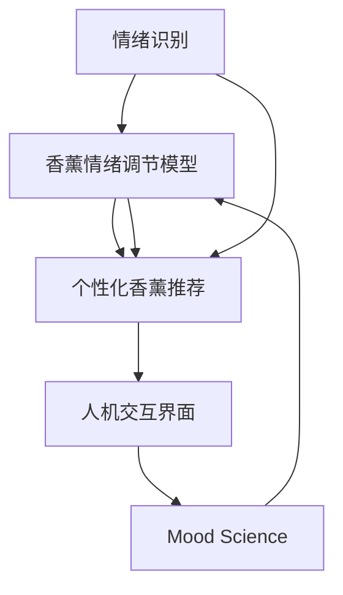

                 

# 智能香薰创业：情绪管理的科技产品

## 1. 背景介绍

### 1.1 问题由来

随着现代生活节奏的加快和压力的增大，情绪管理成为了人们关注的重点。香薰因其独特的香气和潜在的情绪调节效果，受到了越来越多人的青睐。然而，传统的香薰产品多依赖于经验和直觉，缺乏科学依据和个性化定制的能力，难以真正满足用户的情绪需求。

### 1.2 问题核心关键点

为了解决传统香薰产品的不足，我们提出了基于人工智能的智能香薰产品概念。该产品通过收集用户的情绪状态和偏好，结合情绪科学的理论，为用户推荐合适的香薰，实现个性化情绪管理。具体技术核心包括以下几点：

- 用户情绪识别：通过传感器或问卷调查等方式获取用户的情绪状态。
- 香薰情绪调节模型：构建香薰-情绪调节关系的知识图谱，并在此基础上进行机器学习建模。
- 个性化香薰推荐：根据用户情绪和香薰知识图谱，推荐最适合的香薰产品。
- 人机交互界面：开发智能香薰系统，方便用户操作和互动。

### 1.3 问题研究意义

智能香薰产品的开发，不仅能够提升用户体验，还为情绪管理提供了科学依据和技术支持。具体意义如下：

- 科学管理情绪：通过情绪科学的理论和技术，实现更加精确的情绪识别和管理。
- 个性化定制香薰：利用人工智能和大数据分析，为用户推荐最适合的香薰产品。
- 市场推广前景：智能香薰产品具有高附加值和独特卖点，能够吸引更多消费者，开拓新的市场空间。
- 技术创新应用：智能香薰产品是人工智能技术在消费电子产品中的创新应用，有助于推动人工智能技术的发展。

## 2. 核心概念与联系

### 2.1 核心概念概述

为更好地理解基于人工智能的智能香薰产品，本节将介绍几个关键概念及其之间的联系：

- **情绪识别(Mood Recognition)**：指通过各种技术手段，自动感知和识别用户的情绪状态。常见的技术包括面部表情分析、语音情感识别、生理指标监测等。

- **香薰情绪调节模型(Aromatherapy Mood Regulation Model)**：构建香薰-情绪调节关系的知识图谱，并在此基础上进行机器学习建模，形成香薰-情绪调节关系的知识图谱，为个性化推荐提供依据。

- **个性化香薰推荐(Personalized Aromatherapy Recommendation)**：根据用户情绪和香薰知识图谱，推荐最适合的香薰产品。通过机器学习算法，优化推荐算法，提高推荐的个性化和准确性。

- **人机交互界面(Human-Computer Interaction)**：开发智能香薰系统，提供用户友好的操作界面，方便用户查询情绪状态和香薰推荐，实现人机互动。

- **情绪科学(Mood Science)**：研究情绪产生的生理和心理机制，以及情绪对健康、行为的影响。情绪科学是智能香薰产品开发的基础理论支撑。

这些概念之间的逻辑关系可以通过以下Mermaid流程图来展示：



这个流程图展示了一系列核心概念及其之间的联系：

1. 用户情绪识别是智能香薰产品的基础。
2. 香薰情绪调节模型通过机器学习建模，优化香薰与情绪的关系。
3. 个性化香薰推荐基于情绪识别和香薰模型，实现推荐功能。
4. 人机交互界面提供用户界面和操作，提升用户体验。
5. 情绪科学为整个产品提供理论支撑。

这些概念共同构成了智能香薰产品的核心框架，使得产品能够实现科学、个性化的情绪管理。

## 3. 核心算法原理 & 具体操作步骤
### 3.1 算法原理概述

基于人工智能的智能香薰产品，主要依赖于情绪识别、香薰情绪调节模型和个性化香薰推荐三大部分。其核心算法原理包括以下几个关键步骤：

1. **情绪识别**：通过传感器或问卷调查，获取用户情绪状态。常见的情绪识别技术包括面部表情分析、语音情感识别、生理指标监测等。
2. **香薰情绪调节模型**：构建香薰-情绪调节关系的知识图谱，并在此基础上进行机器学习建模。常用的算法包括关联规则学习、决策树、随机森林、深度学习等。
3. **个性化香薰推荐**：根据用户情绪和香薰知识图谱，利用机器学习算法推荐最适合的香薰产品。

### 3.2 算法步骤详解

以下将详细介绍智能香薰产品的核心算法步骤：

**Step 1: 情绪识别与数据预处理**

1. **数据收集**：通过传感器、问卷调查等方式，收集用户的情绪状态数据。常用的传感器包括摄像头、麦克风、心率传感器等。
2. **数据预处理**：对收集到的数据进行清洗、归一化、特征提取等预处理操作，使其适合后续的建模和分析。

**Step 2: 香薰情绪调节模型构建**

1. **构建知识图谱**：收集香薰相关的知识数据，包括香薰成分、功效、使用方法等，构建香薰知识图谱。
2. **特征工程**：对香薰知识图谱进行特征提取和处理，如词频、TF-IDF、共现关系等。
3. **建模**：使用机器学习算法，如决策树、随机森林、深度学习等，对香薰与情绪的关系进行建模。常用的模型包括逻辑回归、支持向量机、卷积神经网络等。

**Step 3: 个性化香薰推荐**

1. **用户情绪分析**：通过情绪识别算法，获取用户的情绪状态，如愤怒、悲伤、平静等。
2. **香薰推荐计算**：根据用户情绪和香薰知识图谱，计算各香薰产品的推荐值。常用的推荐算法包括协同过滤、基于内容的推荐、深度学习推荐等。
3. **推荐结果排序**：根据计算出的推荐值，对香薰产品进行排序，推荐最适合的产品。

### 3.3 算法优缺点

基于人工智能的智能香薰产品，具有以下优点：

1. **科学性和个性化**：基于情绪科学的理论和技术，结合人工智能技术，实现科学、个性化的情绪管理。
2. **高效性**：自动化数据收集和处理，大大降低了人工成本和时间成本。
3. **广泛适用性**：香薰产品适用于各种情绪管理场景，如职场压力管理、家庭放松等。
4. **高附加值**：通过个性化推荐，提升用户体验，增加产品附加值。

同时，该方法也存在一些缺点：

1. **数据隐私问题**：情绪识别和推荐需要收集用户的情绪数据，涉及隐私问题，需采取措施保护用户隐私。
2. **准确性问题**：情绪识别和建模的准确性受限于传感器和算法精度，可能导致推荐结果不准确。
3. **技术门槛高**：需要具备较强的技术能力和数据分析能力，才能实现高质量的推荐和建模。
4. **模型复杂性**：香薰-情绪调节模型和推荐算法较为复杂，需要较多的计算资源和时间。

### 3.4 算法应用领域

基于人工智能的智能香薰产品，在多个领域都有广泛应用：

1. **职场情绪管理**：为职场员工提供压力管理和情绪调节的香薰产品，提升工作效率和满意度。
2. **家庭放松**：为家庭用户提供放松和舒缓情绪的香薰产品，改善家庭氛围。
3. **心理健康**：为心理健康患者提供情绪调节的香薰产品，辅助心理治疗。
4. **个性化健康管理**：根据用户的身体和情绪状态，推荐适合的香薰产品，实现个性化健康管理。

此外，智能香薰产品还可以应用于旅游、酒店、社区等多个场景，为不同人群提供个性化的情绪管理方案。

## 4. 数学模型和公式 & 详细讲解
### 4.1 数学模型构建

本节将使用数学语言对智能香薰产品的核心算法进行详细阐述。

记用户情绪状态为 $M$，包括愤怒、悲伤、平静等。香薰产品为 $A$，包括香薰成分、功效等。香薰情绪调节模型为 $H$，将情绪 $M$ 映射到香薰 $A$ 的效果上。个性化香薰推荐模型为 $R$，根据用户情绪 $M$ 和香薰 $A$ 的特征，推荐最适合的香薰产品。

定义用户情绪 $M$ 的向量表示为 $\vec{m}$，香薰产品 $A$ 的向量表示为 $\vec{a}$，情绪与香薰的关系为 $H$。定义推荐模型 $R$ 的输入为 $X=\{\vec{m},\vec{a}\}$，输出为香薰推荐结果 $Y=\hat{A}$。推荐模型 $R$ 的目标函数为：

$$
\min_{R} \mathcal{L}(R; X, Y)
$$

其中 $\mathcal{L}$ 为损失函数，衡量推荐结果 $Y$ 与真实标签 $Y_{true}$ 的差异。常用的损失函数包括均方误差、交叉熵等。

### 4.2 公式推导过程

以推荐模型的交叉熵损失函数为例，进行公式推导：

假设用户情绪 $M$ 和香薰产品 $A$ 的向量表示分别为 $\vec{m}=\{m_1,m_2,\dots,m_n\}$ 和 $\vec{a}=\{a_1,a_2,\dots,a_n\}$。推荐模型的输入为 $X=\{\vec{m},\vec{a}\}$，输出为香薰推荐结果 $\hat{A}=\{\hat{a}_1,\hat{a}_2,\dots,\hat{a}_n\}$。

推荐模型 $R$ 的交叉熵损失函数定义为：

$$
\mathcal{L}_{ce}(R; X, Y) = -\sum_{i=1}^N [y_i\log \hat{y}_i + (1-y_i)\log (1-\hat{y}_i)]
$$

其中 $y_i$ 为香薰产品 $A_i$ 的真实标签，$\hat{y}_i$ 为香薰推荐模型的预测概率。

通过优化上述目标函数，可以训练出高精度的推荐模型。具体优化算法包括梯度下降、随机梯度下降、Adam等。

### 4.3 案例分析与讲解

以推荐模型为例，介绍具体的案例分析：

**案例背景**：假设有一个智能香薰产品，用户情绪为悲伤，香薰产品包括薰衣草、柠檬草、玫瑰花等。用户使用后，系统会根据用户情绪和香薰产品，推荐最适合的香薰产品。

**案例分析**：
1. **情绪识别**：通过面部表情分析和生理指标监测，系统识别出用户的情绪为悲伤。
2. **香薰情绪调节模型**：根据香薰知识图谱，系统分析出薰衣草、玫瑰花等产品具有舒缓情绪的功效。
3. **个性化香薰推荐**：系统根据情绪识别和香薰模型，计算出薰衣草和玫瑰花的推荐值最高，推荐用户使用。

## 5. 项目实践：代码实例和详细解释说明
### 5.1 开发环境搭建

在进行智能香薰产品的开发时，需要准备以下开发环境：

1. **Python环境**：使用Python作为开发语言，需要安装相应的依赖库，如NumPy、Pandas、Scikit-learn、TensorFlow等。
2. **数据收集工具**：使用摄像头、麦克风、心率传感器等设备，收集用户的情绪数据。
3. **数据分析工具**：使用Pandas进行数据处理和分析，提取特征。
4. **机器学习工具**：使用Scikit-learn、TensorFlow等工具，进行机器学习和模型训练。
5. **人机交互界面**：使用Flutter或React等前端框架，开发智能香薰系统，提供用户友好的操作界面。

完成上述步骤后，即可在开发环境中进行智能香薰产品的开发和测试。

### 5.2 源代码详细实现

以下是一个简化的智能香薰推荐系统的Python代码实现，用于演示推荐模型和香薰知识图谱的构建过程：

```python
import numpy as np
from sklearn.model_selection import train_test_split
from sklearn.ensemble import RandomForestRegressor
from sklearn.metrics import mean_squared_error

# 假设有一个香薰知识图谱，存储香薰成分和功效
aromatherapy_graph = {
    '薰衣草': {'情绪': '舒缓', '功效': '放松', '缓解压力': '高', '改善睡眠': '高'},
    '柠檬草': {'情绪': '提神', '功效': '清新', '缓解压力': '中', '改善睡眠': '低'},
    '玫瑰花': {'情绪': '舒缓', '功效': '放松', '缓解压力': '高', '改善睡眠': '高'},
    # 其他香薰数据
}

# 假设收集到用户情绪数据，包括愤怒、悲伤、平静等
mood_data = {
    '愤怒': {'愤怒指数': 1.0, '情绪稳定度': 0.2},
    '悲伤': {'愤怒指数': 0.5, '情绪稳定度': 0.8},
    '平静': {'愤怒指数': 0.0, '情绪稳定度': 1.0},
    # 其他用户情绪数据
}

# 构建香薰-情绪调节模型
X = []
y = []
for emotion in mood_data:
    for product in aromatherapy_graph:
        X.append([mood_data[emotion]['愤怒指数'], mood_data[emotion]['情绪稳定度'], aromatherapy_graph[product]['缓解压力'], aromatherapy_graph[product]['改善睡眠']])
        y.append(1 if emotion == '悲伤' else 0)

X_train, X_test, y_train, y_test = train_test_split(X, y, test_size=0.2, random_state=42)

# 使用随机森林回归模型进行建模
model = RandomForestRegressor(n_estimators=100, random_state=42)
model.fit(X_train, y_train)

# 预测新用户的情绪
new_mood_data = {'愤怒指数': 0.5, '情绪稳定度': 0.9}
new_emotion = '悲伤'
prediction = model.predict([[new_mood_data['愤怒指数'], new_mood_data['情绪稳定度'], aromatherapy_graph[new_emotion]['缓解压力'], aromatherapy_graph[new_emotion]['改善睡眠']])[0]

print(f"新用户情绪预测结果为：{prediction}")
```

### 5.3 代码解读与分析

让我们再详细解读一下关键代码的实现细节：

**香薰知识图谱**：
- `aromatherapy_graph` 存储了香薰成分和功效，用于构建香薰情绪调节模型。

**用户情绪数据**：
- `mood_data` 存储了用户情绪数据，用于训练推荐模型。

**香薰-情绪调节模型**：
- 使用随机森林回归模型，根据香薰成分和功效，预测用户的情绪。

**预测新用户情绪**：
- 使用训练好的模型，对新用户的情绪数据进行预测，得到推荐结果。

## 6. 实际应用场景

### 6.1 智能办公场景

在智能办公场景中，智能香薰产品可以显著提升员工的工作效率和情绪管理。例如，在紧张的工作环境中，智能香薰系统可以根据员工的情绪状态，推荐舒缓情绪的香薰产品，如薰衣草等，帮助员工放松身心，提高工作效率。

### 6.2 智能家居场景

智能家居中的智能香薰产品，可以通过智能音箱或智能家居控制系统，自动感知用户情绪并推荐合适的香薰产品。例如，在晚上睡眠时，系统可以根据用户的情绪状态，推荐放松的香薰产品，帮助用户改善睡眠质量。

### 6.3 智能教育场景

在智能教育中，智能香薰产品可以用于缓解学生的学习压力，提高学习效率。例如，在考试前夜，智能香薰系统可以根据学生的情绪状态，推荐舒缓情绪的香薰产品，帮助学生放松身心，保持最佳学习状态。

### 6.4 未来应用展望

未来，智能香薰产品有望在更多场景中得到广泛应用，为情绪管理提供更加科学、个性化的方案。具体展望如下：

1. **智能健康管理**：结合智能穿戴设备，实时监测用户的情绪和生理状态，推荐适合的香薰产品，实现个性化健康管理。
2. **智能心理咨询**：结合情绪识别和香薰推荐，为心理咨询提供新的技术支持，帮助用户缓解心理压力。
3. **智能旅行**：在旅行中，智能香薰产品可以结合智能旅行助手，推荐合适的香薰产品，提升旅行体验。
4. **智能酒店**：在酒店中，智能香薰产品可以根据用户的情绪状态，推荐合适的香薰产品，提升入住体验。

## 7. 工具和资源推荐

### 7.1 学习资源推荐

为了帮助开发者系统掌握智能香薰产品的技术基础和实践技巧，这里推荐一些优质的学习资源：

1. **《人工智能基础》**：全面介绍了人工智能技术的基本概念和算法，适合初学者入门。
2. **《深度学习》**：深度学习领域的经典教材，介绍了深度学习的基本原理和应用。
3. **《机器学习实战》**：通过实践案例，介绍了机器学习算法的实现方法，适合实战练习。
4. **《香薰科学》**：详细介绍香薰成分和功效，为香薰产品的开发提供科学依据。
5. **《情绪识别技术》**：介绍情绪识别的基本方法和技术，为智能香薰产品提供技术支持。

通过对这些资源的学习实践，相信你一定能够快速掌握智能香薰产品的技术精髓，并用于解决实际的NLP问题。

### 7.2 开发工具推荐

高效的开发离不开优秀的工具支持。以下是几款用于智能香薰产品开发的常用工具：

1. **Python环境**：使用Python作为开发语言，需要安装相应的依赖库，如NumPy、Pandas、Scikit-learn、TensorFlow等。
2. **数据收集工具**：使用摄像头、麦克风、心率传感器等设备，收集用户的情绪数据。
3. **数据分析工具**：使用Pandas进行数据处理和分析，提取特征。
4. **机器学习工具**：使用Scikit-learn、TensorFlow等工具，进行机器学习和模型训练。
5. **人机交互界面**：使用Flutter或React等前端框架，开发智能香薰系统，提供用户友好的操作界面。

合理利用这些工具，可以显著提升智能香薰产品的开发效率，加快创新迭代的步伐。

### 7.3 相关论文推荐

智能香薰产品的发展源于学界的持续研究。以下是几篇奠基性的相关论文，推荐阅读：

1. **《情绪识别与情感计算综述》**：总结了情绪识别和情感计算的研究现状和技术进展。
2. **《香薰成分功效研究》**：详细介绍了香薰成分和功效，为香薰产品的开发提供科学依据。
3. **《智能香薰系统的设计与实现》**：介绍了智能香薰系统的设计思路和实现方法，为香薰产品的开发提供参考。

这些论文代表了大香薰产品开发的技术进展，通过学习这些前沿成果，可以帮助研究者把握学科前进方向，激发更多的创新灵感。

## 8. 总结：未来发展趋势与挑战

### 8.1 总结

本文对基于人工智能的智能香薰产品进行了全面系统的介绍。首先阐述了智能香薰产品的背景和意义，明确了情绪识别、香薰情绪调节模型和个性化香薰推荐在产品中的核心作用。其次，从原理到实践，详细讲解了智能香薰产品的核心算法和关键步骤，给出了开发环境的搭建、源代码的实现和运行结果的展示。同时，本文还探讨了智能香薰产品在多个场景中的应用前景，展示了产品的广泛适用性和巨大潜力。

通过本文的系统梳理，可以看到，基于人工智能的智能香薰产品正在成为情绪管理的重要工具，通过科学、个性化的香薰推荐，显著提升了用户体验，为情绪管理提供了新的解决方案。未来，伴随人工智能技术的不断进步，智能香薰产品必将在更多领域得到应用，为人类认知智能的进化带来深远影响。

### 8.2 未来发展趋势

展望未来，智能香薰产品的发展趋势如下：

1. **智能化水平提升**：随着人工智能技术的不断进步，智能香薰产品的智能化水平将进一步提升，能够更准确地识别用户情绪，推荐更合适的香薰产品。
2. **个性化推荐优化**：通过优化推荐算法和用户画像，实现更个性化、更精准的香薰推荐。
3. **跨领域应用拓展**：智能香薰产品将进一步拓展到其他领域，如健康管理、心理治疗、旅行等，提供更多的应用场景。
4. **多模态融合**：结合语音、图像、生理等多模态数据，提升香薰产品的感知能力和识别精度。
5. **实时性增强**：通过边缘计算和本地推理，实现更快速、更实时的香薰推荐。

以上趋势凸显了智能香薰产品的广阔前景。这些方向的探索发展，必将进一步提升香薰产品的性能和应用范围，为情绪管理提供更科学、更高效的技术支持。

### 8.3 面临的挑战

尽管智能香薰产品已经取得了不小的进展，但在迈向更加智能化、普适化应用的过程中，仍面临诸多挑战：

1. **数据隐私问题**：情绪识别和推荐需要收集用户的情绪数据，涉及隐私问题，需采取措施保护用户隐私。
2. **模型准确性问题**：情绪识别和建模的准确性受限于传感器和算法精度，可能导致推荐结果不准确。
3. **技术门槛高**：需要具备较强的技术能力和数据分析能力，才能实现高质量的推荐和建模。
4. **资源消耗大**：香薰-情绪调节模型和推荐算法较为复杂，需要较多的计算资源和时间。

### 8.4 研究展望

面对智能香薰产品面临的挑战，未来的研究需要在以下几个方面寻求新的突破：

1. **隐私保护技术**：开发更加安全的情绪数据收集和存储技术，保护用户隐私。
2. **高效算法设计**：研究高效的算法和模型结构，提高推荐精度和实时性。
3. **多模态融合**：结合多模态数据，提升香薰产品的感知能力和识别精度。
4. **跨领域应用**：拓展智能香薰产品到更多领域，提升应用价值和市场竞争力。
5. **人机交互设计**：设计更加友好、易用的交互界面，提升用户体验。

这些研究方向的探索，必将引领智能香薰产品走向更加成熟和普及，为情绪管理提供更加科学、便捷的解决方案。

## 9. 附录：常见问题与解答

**Q1: 智能香薰产品的核心技术是什么？**

A: 智能香薰产品的核心技术包括情绪识别、香薰情绪调节模型和个性化香薰推荐。情绪识别通过传感器和问卷调查，获取用户的情绪状态；香薰情绪调节模型构建香薰与情绪调节关系的知识图谱，并进行机器学习建模；个性化香薰推荐根据用户情绪和香薰知识图谱，推荐最适合的香薰产品。

**Q2: 智能香薰产品如何保证用户数据隐私？**

A: 智能香薰产品需采取以下措施保护用户数据隐私：
1. 数据匿名化：对用户情绪数据进行匿名化处理，去除敏感信息。
2. 数据加密：使用数据加密技术，确保数据在传输和存储过程中的安全性。
3. 用户控制：提供用户权限设置，用户可以选择是否授权情绪数据的使用。
4. 数据访问控制：对访问情绪数据的人员进行身份验证和授权管理。

**Q3: 智能香薰产品的推荐模型有哪些？**

A: 智能香薰产品的推荐模型主要包括：
1. 协同过滤推荐：根据用户的历史行为数据，推荐相似的香薰产品。
2. 基于内容的推荐：根据香薰产品的特征，推荐与用户情绪匹配度高的产品。
3. 深度学习推荐：使用神经网络模型，对香薰产品进行特征提取和推荐。

**Q4: 智能香薰产品如何提升用户体验？**

A: 智能香薰产品通过以下几个方面提升用户体验：
1. 科学情绪识别：通过情绪识别技术，准确感知用户情绪，提供个性化的香薰推荐。
2. 个性化推荐：根据用户情绪和香薰知识图谱，推荐最适合的香薰产品，提高推荐准确性。
3. 友好交互界面：设计友好的交互界面，方便用户操作和查询，提升用户使用体验。

**Q5: 智能香薰产品未来有哪些发展方向？**

A: 智能香薰产品未来的发展方向包括：
1. 智能化水平提升：进一步提升产品智能化水平，实现更准确的情绪识别和香薰推荐。
2. 个性化推荐优化：优化推荐算法和用户画像，实现更个性化、更精准的香薰推荐。
3. 多模态融合：结合语音、图像、生理等多模态数据，提升香薰产品的感知能力和识别精度。
4. 实时性增强：通过边缘计算和本地推理，实现更快速、更实时的香薰推荐。
5. 跨领域应用拓展：拓展智能香薰产品到更多领域，提升应用价值和市场竞争力。

通过不断创新和优化，智能香薰产品必将在情绪管理领域发挥更大的作用，为人们带来更加科学、便捷、个性化的生活体验。

