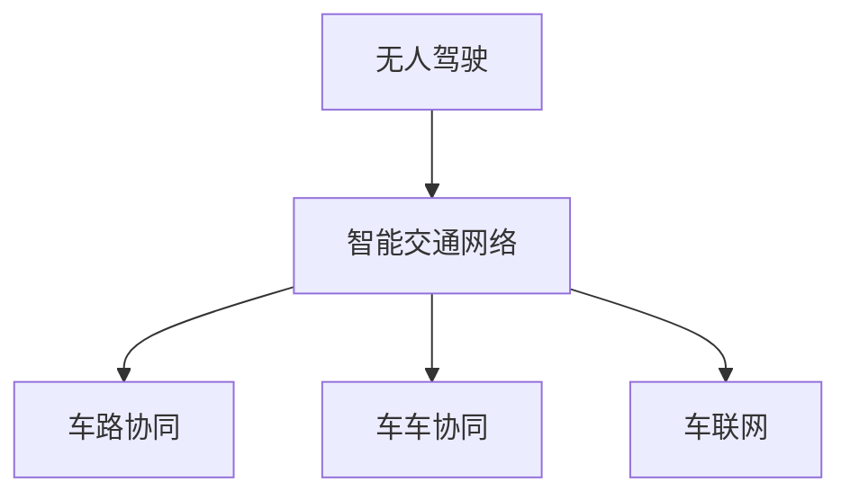

                 

# 未来的智慧出行：2050年的无人驾驶与智能交通网络

> 关键词：无人驾驶,智能交通网络,车联网,自动驾驶,智慧城市

## 1. 背景介绍

### 1.1 问题由来
随着科技进步和城市化进程的加快，交通拥堵、环境污染、安全事故等问题日益凸显，迫切需要创新的解决方案。无人驾驶技术以其高效、便捷、安全的优势，成为未来的重要发展方向。智能交通网络通过互联网、物联网等技术实现车车通信、车路协同，有望提升道路通行效率，减少交通事故。

### 1.2 问题核心关键点
未来智慧出行系统的核心关键点包括：
- 无人驾驶技术：通过计算机视觉、传感器融合、路径规划等技术实现车辆的自动驾驶。
- 智能交通网络：基于车联网技术，实现车辆与车辆、车辆与基础设施之间的实时通信和数据共享。
- 车路协同系统：通过路侧设备、交通信号灯与车辆之间的协同工作，优化交通流，提升交通效率。
- 智慧城市基础设施：包括交通管理、信息采集、数据处理等环节，为无人驾驶和智能交通网络提供支持。

这些关键点共同构成了未来智慧出行系统的技术基础，其核心目标是通过技术创新，实现交通系统的智能化、高效化和可持续化。

### 1.3 问题研究意义
研究和实践无人驾驶与智能交通网络，对提升城市交通效率、缓解交通拥堵、降低环境污染具有重要意义。通过自动化和智能化手段，可以大幅减少人为驾驶失误和事故，提高道路安全性和通行效率。同时，智能交通网络还能优化城市资源配置，减少能源消耗，提升城市治理水平。

## 2. 核心概念与联系

### 2.1 核心概念概述

为了更好地理解无人驾驶与智能交通网络的技术实现，本节将介绍几个核心概念：

- 无人驾驶(Driverless Driving)：指通过计算机视觉、传感器融合、路径规划等技术，使车辆能够自动完成驾驶任务，无需人工干预。
- 智能交通网络(Intelligent Transportation Network, ITN)：基于车联网技术，实现车辆与车辆、车辆与基础设施之间的实时通信和数据共享，提升交通系统的智能化和高效化水平。
- 车路协同(Vehicle-to-Infrastructure, V2I)：指车辆与路侧设备、交通信号灯等基础设施之间的协同工作，通过实时数据交换，优化交通流，提升交通效率。
- 车车协同(Vehicle-to-Vehicle, V2V)：指车辆之间的通信和数据交换，通过车联网技术，实现车辆间的信息共享和协作，提高交通安全性和通行效率。
- 车联网(Vehicle-to-Everything, V2X)：包括车与车辆、车与路侧设施、车与行人等的通信，是智能交通网络的基础。

这些核心概念之间的逻辑关系可以通过以下Mermaid流程图来展示：



这个流程图展示了大语言模型的核心概念及其之间的关系：

1. 无人驾驶技术是实现智能交通网络的基础。
2. 智能交通网络通过车联网技术，实现车辆与车辆、基础设施之间的通信和数据共享。
3. 车路协同系统基于路侧设备、交通信号灯与车辆之间的协同工作，优化交通流。
4. 车车协同通过车联网技术，实现车辆间的通信和数据共享。

这些概念共同构成了未来智慧出行系统的技术框架，其目的是通过自动化和智能化手段，提升交通系统的效率和安全性。

## 3. 核心算法原理 & 具体操作步骤
### 3.1 算法原理概述

未来智慧出行系统基于无人驾驶和智能交通网络技术，其核心算法原理主要包括计算机视觉、传感器融合、路径规划、车路协同、车车协同等技术。

- 计算机视觉：通过摄像头、激光雷达等传感器，实时采集环境信息，利用图像处理和特征提取技术，识别出道路、车辆、行人等关键对象。
- 传感器融合：将来自不同传感器的数据进行融合，提高数据准确性和鲁棒性。
- 路径规划：通过地图匹配、轨迹预测等技术，规划最优驾驶路径，避免障碍物和交通信号。
- 车路协同：通过路侧设备、交通信号灯与车辆之间的通信，获取实时交通信息，优化交通流。
- 车车协同：通过车联网技术，实现车辆间的通信和数据共享，提高交通安全性和通行效率。

### 3.2 算法步骤详解

未来智慧出行系统的算法步骤如下：

**Step 1: 数据采集与处理**
- 利用摄像头、激光雷达等传感器，采集车辆周围环境信息。
- 对采集到的图像、点云数据进行预处理，包括去噪、增强、分割等。
- 通过图像处理和特征提取技术，识别出道路、车辆、行人等关键对象。

**Step 2: 数据融合与状态估计**
- 将来自不同传感器的数据进行融合，使用卡尔曼滤波等技术，对车辆状态进行估计。
- 通过传感器融合算法，提高数据准确性和鲁棒性。

**Step 3: 路径规划与决策**
- 利用地图匹配、轨迹预测等技术，规划最优驾驶路径。
- 考虑道路状况、交通信号、障碍物等因素，制定驾驶策略。
- 根据实时交通信息，动态调整路径和速度。

**Step 4: 车路协同与车车协同**
- 通过车路协同系统，与路侧设备、交通信号灯等基础设施进行通信，获取实时交通信息。
- 根据车路协同数据，优化交通流，调整车辆行驶状态。
- 通过车车协同技术，实现车辆间的通信和数据共享，提高交通安全性和通行效率。

**Step 5: 控制与执行**
- 根据路径规划和决策结果，控制车辆的转向、加速、制动等操作。
- 实时监控车辆状态和环境信息，动态调整控制策略。

### 3.3 算法优缺点

未来智慧出行系统的算法优点包括：
- 提升交通效率：通过智能交通网络，实现车辆与基础设施之间的实时通信和数据共享，优化交通流，提高通行效率。
- 提高安全性：通过无人驾驶技术，避免人为驾驶失误和事故，提升道路安全性。
- 降低环境污染：智能交通网络优化资源配置，减少能源消耗，降低环境污染。

然而，该系统也存在一些缺点：
- 技术复杂度高：无人驾驶和智能交通网络涉及多个关键技术，技术难度和成本较高。
- 数据依赖性强：系统运行依赖大量实时数据，数据采集和处理需要高性能传感器和计算资源。
- 网络依赖性高：车路协同和车车协同需要稳定的网络环境，网络中断会影响系统性能。
- 法律法规风险：无人驾驶技术涉及法律法规、伦理道德等问题，尚未形成完善的法律框架。

### 3.4 算法应用领域

未来智慧出行系统将在交通、物流、智能城市等多个领域得到广泛应用，具体包括：

- 城市交通管理：通过智能交通网络，优化城市交通流，缓解交通拥堵，提升通行效率。
- 物流配送：利用无人驾驶技术，实现高效、安全的物流配送，降低人力成本，提升配送效率。
- 智慧城市：通过车路协同系统，实现智慧城市交通管理、信息采集、数据处理等环节的协同工作，提升城市治理水平。
- 智能驾驶：通过无人驾驶技术，实现自动驾驶，提高驾驶体验和安全性能。
- 车联网：通过车联网技术，实现车辆间的通信和数据共享，提高交通安全性和通行效率。

## 4. 数学模型和公式 & 详细讲解 & 举例说明

### 4.1 数学模型构建

未来智慧出行系统的数学模型构建涉及多个技术领域，主要包括计算机视觉、传感器融合、路径规划、车路协同、车车协同等。

假设无人驾驶车辆在$t$时刻的位置为$\mathbf{X}_t=[x(t),y(t)]$，速度为$\mathbf{V}_t=[v_x(t),v_y(t)]$，加速度为$\mathbf{A}_t=[a_x(t),a_y(t)]$。车辆的状态方程可以表示为：

$$
\mathbf{X}_{t+1} = \mathbf{X}_t + \mathbf{V}_t + \mathbf{A}_t \Delta t
$$

其中$\Delta t$为时间步长。车辆的速度和加速度可以通过控制输入来调整，假设控制输入为$\mathbf{U}=[u_x(t),u_y(t)]$，则车辆的动力学方程可以表示为：

$$
\mathbf{V}_{t+1} = \mathbf{V}_t + \mathbf{A}_t \Delta t
$$

$$
\mathbf{A}_{t+1} = \mathbf{A}_t + \mathbf{B}(\mathbf{U} - \mathbf{C}\mathbf{X}_t)
$$

其中$\mathbf{B}$为车辆加速度系数矩阵，$\mathbf{C}$为车辆状态系数矩阵。

### 4.2 公式推导过程

车辆的状态方程和动力学方程可以通过卡尔曼滤波技术进行估计和预测。卡尔曼滤波是一种递归滤波算法，能够在有噪声和未知状态的情况下，实现状态的精确估计。其基本流程包括状态预测和状态更新两个步骤：

1. **状态预测**：根据上一时刻的状态和控制输入，预测当前时刻的状态。
2. **状态更新**：根据传感器测量值和预测状态，更新当前时刻的状态。

具体推导如下：

设车辆的状态向量为$\mathbf{X}_t=[x(t),y(t),v_x(t),v_y(t),a_x(t),a_y(t)]$，控制输入向量为$\mathbf{U}=[u_x(t),u_y(t)]$，车辆的状态转移矩阵为$\mathbf{F}$，控制输入矩阵为$\mathbf{B}$，传感器测量矩阵为$\mathbf{H}$，传感器噪声矩阵为$\mathbf{R}$，过程噪声矩阵为$\mathbf{Q}$。则卡尔曼滤波的状态预测方程为：

$$
\mathbf{X}_{t+1|t} = \mathbf{F}\mathbf{X}_t + \mathbf{B}\mathbf{U}_t + \mathbf{Q}_t
$$

其中$\mathbf{X}_{t+1|t}$为$t+1$时刻的状态预测值。

卡尔曼滤波的状态更新方程为：

$$
\mathbf{K}_t = \mathbf{P}_t\mathbf{H}_t^T(\mathbf{H}_t\mathbf{P}_t\mathbf{H}_t^T + \mathbf{R}_t)^{-1}
$$

$$
\mathbf{P}_t = \mathbf{F}_t\mathbf{P}_{t-1|t-1}\mathbf{F}_t^T + \mathbf{Q}_t
$$

$$
\mathbf{X}_{t|t} = \mathbf{X}_{t+1|t} + \mathbf{K}_t(\mathbf{Z}_t - \mathbf{H}_t\mathbf{X}_{t+1|t})
$$

其中$\mathbf{K}_t$为卡尔曼增益矩阵，$\mathbf{P}_t$为状态协方差矩阵，$\mathbf{Z}_t$为传感器测量值。

通过卡尔曼滤波算法，可以实现对车辆状态的精确估计，为路径规划和决策提供支持。

### 4.3 案例分析与讲解

下面以一个具体的案例来讲解未来智慧出行系统在实际中的应用：

假设一辆无人驾驶车辆在城市道路上行驶，需要避障并找到最优路径。车辆通过传感器获取到道路障碍物和交通信号信息，利用卡尔曼滤波技术，对车辆状态进行精确估计。根据传感器数据，车辆可以通过路径规划算法，生成最优路径，并根据实时交通信息，动态调整路径和速度。

在车路协同系统中，车辆通过与路侧设备、交通信号灯通信，获取实时交通信息，优化交通流，调整车辆行驶状态。在车车协同系统中，车辆通过车联网技术，实现与其他车辆的信息共享和协作，提高交通安全性和通行效率。

## 5. 项目实践：代码实例和详细解释说明
### 5.1 开发环境搭建

在进行无人驾驶与智能交通网络开发时，需要搭建高性能的开发环境。以下是使用Python进行ROS开发的环境配置流程：

1. 安装ROS：从官网下载并安装ROS，选择适合的ROS版本和工具链。
2. 安装C++编译器和Python解释器：选择合适的版本，安装所需依赖。
3. 安装ROS相关包：安装ROS自带的包，以及需要使用的第三方包。
4. 安装Gazebo：作为模拟环境的模拟器，用于测试无人驾驶算法。
5. 配置ROS路径和环境变量：在ROS环境中，配置ROS路径和环境变量，以便在ROS中运行自定义节点。

完成上述步骤后，即可在ROS环境中进行无人驾驶与智能交通网络的开发。

### 5.2 源代码详细实现

下面以无人驾驶车辆路径规划为例，给出使用Python和ROS实现无人驾驶路径规划的代码实现。

```python
import rospy
import tf
from nav_msgs.msg import Odometry
from sensor_msgs.msg import LaserScan, Image
from std_msgs.msg import Float32
from tf.transformations import euler_from_quaternion, quaternion_from_euler
from geometry_msgs.msg import Twist

class PathPlanner:
    def __init__(self):
        rospy.init_node('path_planner', anonymous=True)
        self.odom_sub = rospy.Subscriber('/odom', Odometry, self.odom_callback)
        self.laser_sub = rospy.Subscriber('/scan', LaserScan, self.laser_callback)
        self.image_sub = rospy.Subscriber('/camera/image', Image, self.image_callback)
        self.cmd_vel_pub = rospy.Publisher('/cmd_vel', Twist, queue_size=10)

    def odom_callback(self, data):
        self.odom_frame = data.header.frame_id
        self.current_pos = [data.pose.pose.position.x, data.pose.pose.position.y]
        self.current_theta = self.euler_from_quaternion(data.pose.pose.orientation)

    def laser_callback(self, data):
        self.scan_data = data.ranges
        self.scan_distances = [max(0, range_val - self.current_pos[0]) for range_val in self.scan_data]

    def image_callback(self, data):
        self.image_data = data
        self.color_image = cv2.cvtColor(self.image_data, cv2.COLOR_BGR2RGB)

    def euler_from_quaternion(self, quaternion):
        q0, q1, q2, q3 = quaternion
        return euler_from_quaternion([q0, q1, q2, q3])

    def cmd_vel(self, vel):
        cmd = Twist()
        cmd.linear.x = vel.linear.x
        cmd.linear.y = vel.linear.y
        cmd.linear.z = vel.linear.z
        cmd.angular.x = vel.angular.x
        cmd.angular.y = vel.angular.y
        cmd.angular.z = vel.angular.z
        self.cmd_vel_pub.publish(cmd)

    def main(self):
        while not rospy.is_shutdown():
            # 在这里添加路径规划算法
            rospy.spin()

if __name__ == '__main__':
    path_planner = PathPlanner()
    path_planner.main()
```

这段代码实现了无人驾驶车辆的路径规划算法，具体步骤如下：

1. 初始化ROS节点。
2. 订阅传感器数据：激光雷达数据和摄像头数据。
3. 订阅车辆位姿数据，获取当前位置和方向。
4. 处理激光雷达数据，计算与障碍物的距离。
5. 处理摄像头数据，获取道路信息。
6. 添加路径规划算法，生成最优路径。
7. 根据路径规划结果，调整车辆速度和方向。
8. 发布车辆控制命令。

### 5.3 代码解读与分析

让我们再详细解读一下关键代码的实现细节：

**Odometry订阅器**：
- 在无人驾驶车辆上，激光雷达和摄像头数据可以帮助车辆感知环境，但车辆的位置信息需要由GPS或陀螺仪等传感器提供。
- 订阅Odometry数据，获取车辆的位置和方向信息，为路径规划提供基础。

**LaserScan订阅器**：
- 激光雷达数据可以用于感知周围环境，通过计算障碍物与车辆的距离，规划最优路径。
- 订阅LaserScan数据，获取激光雷达的扫描数据，并进行处理。

**Image订阅器**：
- 摄像头数据可以用于获取道路信息，通过识别道路标志、标线等，进行路径规划。
- 订阅Image数据，获取摄像头拍摄的图像，并进行处理。

**euler_from_quaternion函数**：
- 将四元数转化为欧拉角，用于计算车辆的方向信息。

**cmd_vel函数**：
- 发布控制命令，调整车辆的速度和方向。

通过ROS搭建的开发环境，可以方便地进行无人驾驶与智能交通网络的开发和测试，验证路径规划算法的性能。

## 6. 实际应用场景
### 6.1 智能交通管理

未来智慧出行系统可以通过智能交通管理，提升城市交通效率和通行安全。具体应用场景包括：

- 实时交通监控：通过车路协同系统，获取实时交通信息，监测交通流量和状况。
- 交通信号控制：根据交通流量和状况，自动调整交通信号灯的时序，优化交通流。
- 事件检测与预警：利用车路协同系统，检测交通事件，如交通事故、堵塞等，并及时预警。

### 6.2 物流配送

无人驾驶车辆可以通过智能交通网络，实现高效、安全的物流配送。具体应用场景包括：

- 自动驾驶运输：利用无人驾驶技术，自动完成货物运输，提高运输效率。
- 路径优化：通过智能交通网络，实时获取路况信息，规划最优运输路径。
- 实时监控：利用车路协同系统，实时监控车辆位置和状态，确保运输安全。

### 6.3 智能城市

未来智慧出行系统可以通过智能城市基础设施，提升城市治理水平和居民生活质量。具体应用场景包括：

- 交通流量监测：通过车路协同系统，实时监测交通流量，优化交通流。
- 环境监测：利用车路协同系统，监测城市环境状况，如空气质量、温度等。
- 紧急事件响应：通过车路协同系统，快速响应紧急事件，如交通事故、火灾等。

## 7. 工具和资源推荐
### 7.1 学习资源推荐

为了帮助开发者系统掌握无人驾驶与智能交通网络的技术实现，这里推荐一些优质的学习资源：

1. ROS官方文档：ROS官方文档提供了详细的ROS开发和应用指南，是无人驾驶与智能交通网络开发的基础。
2. Gazebo官方文档：Gazebo官方文档提供了Gazebo的使用和配置指南，是无人驾驶算法测试的模拟器。
3. 《自动驾驶技术与实践》书籍：该书系统介绍了自动驾驶技术的基本原理和实践方法，适合初学者和进阶学习者。
4. 《智能交通系统》课程：清华大学开设的智能交通系统课程，涵盖智能交通系统的基本概念和技术，适合对智能交通网络有兴趣的开发者。
5. 《未来交通》课程：麻省理工学院开设的未来交通课程，探讨了无人驾驶和智能交通网络的前景和发展方向。

通过对这些资源的学习实践，相信你一定能够快速掌握无人驾驶与智能交通网络的技术实现，并用于解决实际的交通问题。

### 7.2 开发工具推荐

高效的开发离不开优秀的工具支持。以下是几款用于无人驾驶与智能交通网络开发的常用工具：

1. ROS：开源机器人操作系统，提供了强大的工具和库，支持无人驾驶算法和智能交通网络开发。
2. Gazebo：仿真环境模拟器，支持自动驾驶算法的测试和验证。
3. Visual Studio Code：轻量级的IDE，支持Python、C++等语言开发，提供了丰富的扩展和插件。
4. Git：版本控制系统，支持代码版本管理和协作开发。
5. Docker：容器化技术，支持无人驾驶系统的部署和分发。

合理利用这些工具，可以显著提升无人驾驶与智能交通网络开发的效率，加快创新迭代的步伐。

### 7.3 相关论文推荐

无人驾驶与智能交通网络的发展源于学界的持续研究。以下是几篇奠基性的相关论文，推荐阅读：

1. "A Survey on Object Detection in Road Scenes: Data, Models and Applications"：该论文综述了道路场景中目标检测的研究进展，是无人驾驶路径规划的基础。
2. "Robust State Estimation for Mobile Robots Using Monocular Vision and Depth Data"：该论文介绍了基于单目视觉和深度数据的机器人状态估计方法，为无人驾驶车辆定位和路径规划提供了重要参考。
3. "Advances in Path Planning and Decision-Making for Autonomous Vehicles"：该论文综述了无人驾驶车辆路径规划和决策算法的研究进展，具有较高的参考价值。
4. "A Survey of Traffic-State Estimation Techniques Based on Visual Sensors"：该论文介绍了基于视觉传感器的交通状态估计算法，为智能交通网络中的交通监控和预测提供了支持。
5. "Deep Learning for Traffic Management: A Survey"：该论文综述了深度学习在交通管理中的应用，介绍了智能交通网络中的交通信号控制、事件检测等关键技术。

这些论文代表了大语言模型微调技术的发展脉络。通过学习这些前沿成果，可以帮助研究者把握学科前进方向，激发更多的创新灵感。

## 8. 总结：未来发展趋势与挑战
### 8.1 总结

本文对未来智慧出行系统进行了全面系统的介绍。首先阐述了无人驾驶与智能交通网络的研究背景和意义，明确了系统的核心关键点。其次，从原理到实践，详细讲解了系统的算法实现和关键步骤，给出了系统开发的完整代码实例。同时，本文还广泛探讨了系统在智能交通管理、物流配送、智能城市等领域的实际应用，展示了系统技术的巨大潜力。此外，本文精选了系统开发所需的各类学习资源，力求为读者提供全方位的技术指引。

通过本文的系统梳理，可以看到，未来智慧出行系统将在交通、物流、智能城市等多个领域得到广泛应用，为人类社会带来深刻变革。未来智慧出行系统将在无人驾驶、智能交通网络、车路协同等方面，不断推动交通系统的智能化、高效化和可持续化发展，为构建未来智慧交通体系提供有力支持。

### 8.2 未来发展趋势

展望未来，未来智慧出行系统将呈现以下几个发展趋势：

1. 技术融合加速：未来智慧出行系统将与5G、物联网、人工智能等技术深度融合，推动无人驾驶和智能交通网络的发展。
2. 多模态信息协同：未来智慧出行系统将融合视觉、雷达、激光雷达、毫米波雷达等多种传感器信息，实现更全面、精确的环境感知。
3. 自动驾驶落地：未来智慧出行系统将在城市道路、高速公路、乡村道路等多场景下实现广泛应用，提升道路通行效率和安全性。
4. 车路协同优化：未来智慧出行系统将通过车路协同系统，实现更高效的交通流优化和智能交通管理。
5. 智能城市建设：未来智慧出行系统将与智能城市基础设施深度融合，提升城市治理水平和居民生活质量。

以上趋势凸显了未来智慧出行系统的广阔前景。这些方向的探索发展，必将进一步提升交通系统的效率和安全性，推动交通行业的变革。

### 8.3 面临的挑战

尽管未来智慧出行系统已经取得了显著进展，但在迈向更加智能化、普适化应用的过程中，仍面临诸多挑战：

1. 技术复杂度高：无人驾驶和智能交通网络涉及多个关键技术，技术难度和成本较高。
2. 数据依赖性强：系统运行依赖大量实时数据，数据采集和处理需要高性能传感器和计算资源。
3. 网络依赖性高：车路协同和车车协同需要稳定的网络环境，网络中断会影响系统性能。
4. 法律法规风险：无人驾驶技术涉及法律法规、伦理道德等问题，尚未形成完善的法律框架。
5. 安全性和可靠性：无人驾驶系统需要在复杂环境下保持高安全性和高可靠性，应对各种突发情况。

### 8.4 研究展望

未来智慧出行系统需要在以下几个方面进行深入研究：

1. 提高系统可靠性：研究无人驾驶车辆在复杂环境下的可靠性，确保系统的安全性和稳定性。
2. 优化系统性能：通过技术创新和算法优化，提高系统的感知、规划和控制能力，提升系统性能。
3. 改善用户体验：研究用户界面和交互设计，提高用户对未来智慧出行系统的接受度和满意度。
4. 解决伦理和法律问题：建立无人驾驶系统的法律法规和伦理道德框架，确保系统的合法合规。
5. 推动标准化：制定无人驾驶系统标准和规范，推动系统在各领域的广泛应用。

这些研究方向的探索，必将引领未来智慧出行系统的技术进步，为构建安全、可靠、可解释、可控的智能系统铺平道路。面向未来，未来智慧出行系统还需要与其他人工智能技术进行更深入的融合，如知识表示、因果推理、强化学习等，多路径协同发力，共同推动交通系统的进步。只有勇于创新、敢于突破，才能不断拓展交通系统的边界，让智能技术更好地造福人类社会。

## 9. 附录：常见问题与解答

**Q1：未来智慧出行系统是否适合所有场景？**

A: 未来智慧出行系统在城市道路、高速公路、乡村道路等场景下都有广泛应用前景，但特定场景（如无人驾驶在特殊地形）需要进一步研究与优化。未来智慧出行系统需要在各种复杂环境下进行深入研究与实践，确保系统的可靠性和安全性。

**Q2：未来智慧出行系统是否需要大量的传感器和计算资源？**

A: 是的，未来智慧出行系统需要高性能传感器和计算资源来处理大量实时数据，并进行复杂的计算。这需要投入大量的人力、物力和财力，并需要持续的研究与优化。

**Q3：未来智慧出行系统是否需要大量的标注数据？**

A: 是的，未来智慧出行系统需要在大量标注数据上进行训练，以提高系统的感知和决策能力。这需要投入大量的人力、物力和财力，并需要持续的研究与优化。

**Q4：未来智慧出行系统是否会面临安全性和可靠性问题？**

A: 是的，未来智慧出行系统需要在各种复杂环境下保持高安全性和高可靠性，应对各种突发情况。这需要持续的研究与优化，并需要建立完善的法律法规和伦理道德框架，确保系统的合法合规。

**Q5：未来智慧出行系统是否会面临伦理和法律问题？**

A: 是的，未来智慧出行系统需要研究伦理和法律问题，确保系统的合法合规。这需要建立完善的法律法规和伦理道德框架，以规范系统在各领域的应用。

作者：禅与计算机程序设计艺术 / Zen and the Art of Computer Programming

