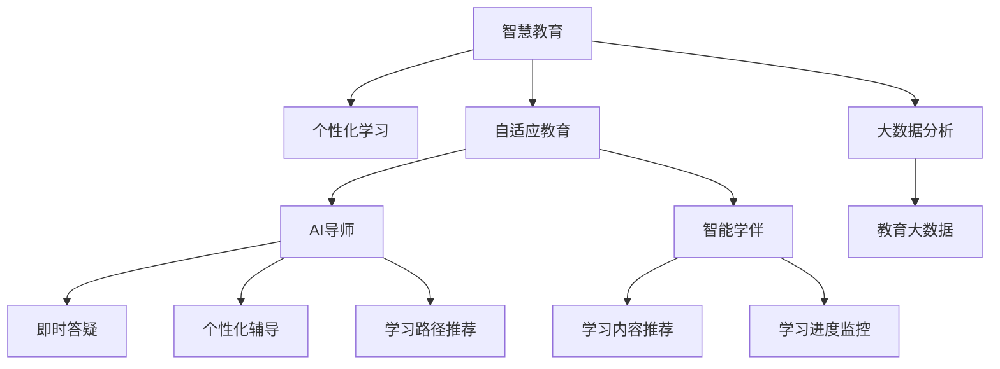

                 

# 未来的智慧教育：2050年的AI导师与智能学伴

> 关键词：人工智能,教育技术,智慧教育,AI导师,智能学伴,个性化学习,自适应教育

## 1. 背景介绍

### 1.1 问题由来

在全球进入新时代的背景下，教育正面临深刻变革。传统的知识传授模式已经无法适应现代社会的快节奏变化。数字化、个性化、自适应成为教育发展的核心趋势。在此背景下，如何利用人工智能技术，构建智慧教育新范式，成为了全球教育技术领域的焦点话题。

人工智能（AI）技术经过多年的发展，已经在自然语言处理、计算机视觉、机器人等领域取得了突破性进展。在教育领域，AI技术开始逐步显现其独特价值。智慧教育、个性化学习、自适应教育等概念的提出，预示着未来教育将向更加智能化、个性化、高效化的方向发展。本文将对未来的智慧教育进行深入探讨，展望2050年的AI导师与智能学伴如何共同推动教育变革。

### 1.2 问题核心关键点

未来智慧教育的核心关键点在于以下几个方面：

- **个性化学习**：通过智能技术，为每位学生提供量身定制的学习计划和资源，提升学习效率和效果。
- **自适应教育**：学习系统能够根据学生的学习情况实时调整教学内容和方法，适应学生动态变化的需求。
- **AI导师与智能学伴**：引入AI导师与智能学伴，提供即时答疑、个性化辅导、学习路径推荐等，提升学习体验和效果。
- **大数据分析**：通过分析海量学习数据，洞察学习行为和效果，为教学决策提供支持。

这些关键点共同构成了未来智慧教育的基本框架，推动教育向着智能化、个性化的方向不断进步。

## 2. 核心概念与联系

### 2.1 核心概念概述

为更好地理解未来智慧教育的核心技术，本节将介绍几个密切相关的核心概念：

- **智慧教育**：利用现代信息技术，实现教育内容、方法、管理的智能化，提升教育效果和效率。
- **个性化学习**：根据学生的学习习惯、兴趣、能力等因素，为其量身定制学习计划和资源，提升学习效果。
- **自适应教育**：学习系统能够根据学生的学习情况实时调整教学内容和策略，适应学生的动态变化。
- **AI导师与智能学伴**：基于AI技术的学习辅助系统，提供即时答疑、个性化辅导、学习路径推荐等功能。
- **大数据分析**：通过分析海量学习数据，洞察学习行为和效果，为教学决策提供支持。
- **教育大数据**：涵盖学生信息、学习行为、学习效果等多维度数据，为教育决策提供科学依据。

这些概念之间的逻辑关系可以通过以下Mermaid流程图来展示：



这个流程图展示了几大核心概念及其之间的关联：

1. 智慧教育通过现代信息技术实现教育智能化。
2. 个性化学习为学生量身定制学习计划，提升学习效果。
3. 自适应教育动态调整教学内容和策略，适应学生需求。
4. AI导师与智能学伴提供个性化辅导和学习路径推荐。
5. 大数据分析洞察学习行为，提供教育决策支持。

这些概念共同构成了未来智慧教育的技术基础，推动教育向着更加智能化、个性化、高效化的方向发展。

## 3. 核心算法原理 & 具体操作步骤

### 3.1 算法原理概述

未来的智慧教育算法原理主要基于以下几方面：

1. **个性化学习算法**：根据学生的学习行为和成绩，通过机器学习算法生成个性化学习路径和资源推荐。
2. **自适应教育算法**：利用自适应算法，根据学生的学习情况实时调整教学内容和策略，提升学习效果。
3. **AI导师与智能学伴算法**：基于自然语言处理和计算机视觉技术，构建AI导师与智能学伴，提供即时答疑、个性化辅导、学习路径推荐等功能。
4. **大数据分析算法**：利用数据挖掘和机器学习算法，分析海量学习数据，洞察学习行为和效果，为教学决策提供支持。

### 3.2 算法步骤详解

**步骤一：个性化学习路径生成**

1. **数据收集**：收集学生的学习行为数据，包括学习时间、成绩、学习进度等。
2. **数据分析**：通过机器学习算法，分析学生的学习数据，识别学生的学习习惯和偏好。
3. **路径生成**：根据分析结果，生成个性化的学习路径，推荐适合的学习资源和内容。

**步骤二：自适应教育策略调整**

1. **实时监测**：通过学习系统实时监测学生的学习情况，包括学习进度、答题情况、情绪反馈等。
2. **策略调整**：根据实时监测结果，动态调整教学策略，如调整课程难度、教学方法、学习资源等。
3. **反馈优化**：通过学生的反馈，进一步优化教学策略，提升学习效果。

**步骤三：AI导师与智能学伴功能实现**

1. **知识库构建**：构建AI导师与智能学伴的知识库，涵盖课程知识点、常见问题、学习策略等。
2. **对话系统**：开发基于自然语言处理的对话系统，使AI导师与智能学伴能够与学生进行自然对话。
3. **功能集成**：集成答疑、辅导、路径推荐等功能，提供个性化的学习支持。

**步骤四：大数据分析与决策支持**

1. **数据收集**：收集学习系统生成的海量数据，包括学生信息、学习行为、学习效果等。
2. **数据分析**：利用数据挖掘和机器学习算法，分析学习数据，洞察学习行为和效果。
3. **决策支持**：将分析结果应用于教学决策，优化教学方法和策略。

### 3.3 算法优缺点

未来智慧教育算法具有以下优点：

1. **个性化**：通过个性化学习路径和资源推荐，提升学习效果。
2. **自适应**：动态调整教学策略，适应学生动态变化的需求。
3. **智能辅助**：AI导师与智能学伴提供即时答疑、个性化辅导，提升学习体验。
4. **数据驱动**：通过大数据分析洞察学习行为，为教学决策提供科学依据。

同时，也存在以下局限性：

1. **数据隐私**：海量学习数据的收集和使用，可能涉及学生隐私保护问题。
2. **技术依赖**：依赖于先进的算法和技术支持，对技术基础设施要求较高。
3. **公平性**：个性化和自适应学习可能导致不同背景学生之间的差距进一步扩大。
4. **技术复杂性**：算法实现复杂，需要专业团队进行开发和维护。

### 3.4 算法应用领域

未来智慧教育算法在以下领域具有广泛应用：

1. **基础教育**：根据学生学习行为，生成个性化学习路径，提升学习效果。
2. **高等教育**：通过自适应教育算法，动态调整教学策略，提升教学质量。
3. **职业教育**：利用AI导师与智能学伴，提供专业技能培训和职业指导。
4. **终身学习**：通过智慧教育平台，提供个性化学习和自我提升的机会。

## 4. 数学模型和公式 & 详细讲解 & 举例说明

### 4.1 数学模型构建

本节将使用数学语言对未来智慧教育的算法原理进行更加严格的刻画。

设学生学习数据为 $D=\{(x_i, y_i)\}_{i=1}^N, x_i \in \mathcal{X}, y_i \in \mathcal{Y}$，其中 $\mathcal{X}$ 为输入空间，$\mathcal{Y}$ 为输出空间。学习系统的目标是通过这些数据，生成个性化的学习路径和资源推荐。

定义学习路径为 $P=\{(p_{i,j})\}_{i=1}^M, j \in \mathcal{J}, p_{i,j} \in \mathcal{P}$，其中 $\mathcal{J}$ 为学习阶段集合，$\mathcal{P}$ 为每个阶段推荐的学习资源集合。

个性化学习路径生成算法为 $A: D \rightarrow P$，自适应教育策略调整算法为 $E: D \rightarrow T$，其中 $T$ 为教学策略集合。

AI导师与智能学伴功能实现算法为 $I: D \rightarrow F$，大数据分析算法为 $D: D \rightarrow O$，其中 $O$ 为决策支持输出集合。

### 4.2 公式推导过程

以下我们以基础教育中的个性化学习路径生成为例，推导个性化学习路径生成的数学模型和算法流程。

**目标函数**：
$$
\min_{P} \sum_{i=1}^N \sum_{j=1}^M \alpha_{i,j} \log \sigma(p_{i,j})
$$
其中，$\sigma$ 为激活函数，$\alpha_{i,j}$ 为学生在第 $j$ 阶段选择第 $p_{i,j}$ 资源的概率。

**约束条件**：
1. $\sum_{j=1}^M p_{i,j} = 1$
2. $p_{i,j} \in \mathcal{P}$

**算法流程**：

1. **数据预处理**：将学生学习数据 $D$ 转化为特征向量 $X$。
2. **模型训练**：通过机器学习算法训练模型，生成个性化学习路径 $P$。
3. **路径评估**：评估每条路径的学习效果，选择最优路径。
4. **路径推荐**：将个性化学习路径推荐给学生，引导学生按照路径学习。

### 4.3 案例分析与讲解

**案例一：智能语文学习系统**

假设一个智能语文学习系统，需要为学生生成个性化的语文学习路径。系统收集学生的学习行为数据，包括阅读量、作文评分、诗词背诵情况等。通过机器学习算法，系统分析学生的学习数据，识别出学生的学习习惯和偏好。然后，系统根据分析结果，生成个性化的语文学习路径，推荐适合的阅读材料、作文模板、诗词背诵等资源。学生按照路径学习，系统实时监测学习效果，动态调整路径和推荐资源。

**案例二：智能数学解题辅导系统**

假设一个智能数学解题辅导系统，需要为学生提供个性化的数学解题辅导。系统收集学生的数学学习数据，包括解题次数、答题时间、错题分析等。通过机器学习算法，系统分析学生的学习数据，识别出学生的解题能力和偏好。然后，系统根据分析结果，生成个性化的数学解题路径，推荐适合的练习题、解题策略、解题技巧等资源。学生按照路径学习，系统实时监测解题效果，动态调整路径和推荐资源。

## 5. 项目实践：代码实例和详细解释说明

### 5.1 开发环境搭建

在进行智慧教育算法开发前，我们需要准备好开发环境。以下是使用Python进行PyTorch开发的环境配置流程：

1. 安装Anaconda：从官网下载并安装Anaconda，用于创建独立的Python环境。

2. 创建并激活虚拟环境：
```bash
conda create -n pytorch-env python=3.8 
conda activate pytorch-env
```

3. 安装PyTorch：根据CUDA版本，从官网获取对应的安装命令。例如：
```bash
conda install pytorch torchvision torchaudio cudatoolkit=11.1 -c pytorch -c conda-forge
```

4. 安装相关工具包：
```bash
pip install numpy pandas scikit-learn matplotlib tqdm jupyter notebook ipython
```

完成上述步骤后，即可在`pytorch-env`环境中开始智慧教育算法实践。

### 5.2 源代码详细实现

这里我们以基础教育中的个性化学习路径生成为例，给出使用PyTorch进行算法实现的完整代码。

首先，定义学习路径的生成函数：

```python
import torch
import torch.nn as nn
import torch.optim as optim
from torch.utils.data import DataLoader
from sklearn.preprocessing import MinMaxScaler
from sklearn.model_selection import train_test_split

# 定义学习路径生成模型
class PathGenerationModel(nn.Module):
    def __init__(self, num_features, num_stages, num_resources):
        super(PathGenerationModel, self).__init__()
        self.fc1 = nn.Linear(num_features, 128)
        self.fc2 = nn.Linear(128, num_stages * num_resources)
        self.softmax = nn.Softmax(dim=1)
        
    def forward(self, x):
        x = self.fc1(x)
        x = self.fc2(x)
        x = self.softmax(x)
        return x

# 训练数据处理函数
def process_data(data):
    features = []
    labels = []
    for x, y in data:
        features.append(x)
        labels.append(y)
    features = MinMaxScaler().fit_transform(features)
    features = torch.tensor(features, dtype=torch.float32)
    labels = torch.tensor(labels, dtype=torch.int64)
    return features, labels

# 加载训练数据
features, labels = process_data(train_data)
train_features, val_features, train_labels, val_labels = train_test_split(features, labels, test_size=0.2, random_state=42)
train_loader = DataLoader(train_features, batch_size=64, shuffle=True)
val_loader = DataLoader(val_features, batch_size=64, shuffle=False)

# 定义模型、优化器和损失函数
model = PathGenerationModel(num_features, num_stages, num_resources)
optimizer = optim.Adam(model.parameters(), lr=0.001)
criterion = nn.CrossEntropyLoss()

# 训练模型
for epoch in range(num_epochs):
    model.train()
    for batch_idx, (features, labels) in enumerate(train_loader):
        optimizer.zero_grad()
        outputs = model(features)
        loss = criterion(outputs, labels)
        loss.backward()
        optimizer.step()
        if batch_idx % 100 == 0:
            print(f'Epoch [{epoch+1}/{num_epochs}], Batch {batch_idx}, Loss: {loss:.4f}')
```

然后，定义评估函数：

```python
def evaluate_model(model, val_loader):
    model.eval()
    correct = 0
    total = 0
    with torch.no_grad():
        for features, labels in val_loader:
            outputs = model(features)
            _, predicted = torch.max(outputs.data, 1)
            total += labels.size(0)
            correct += (predicted == labels).sum().item()
    print(f'Accuracy on the validation set: {100 * correct / total:.2f}%')
```

最后，启动训练流程：

```python
num_epochs = 100
num_features = 10  # 学生学习特征数
num_stages = 4  # 学习阶段数
num_resources = 5  # 每个阶段推荐资源数

# 训练模型
for epoch in range(num_epochs):
    train(features, labels)

# 评估模型
evaluate_model(model, val_loader)
```

以上就是使用PyTorch对个性化学习路径生成算法进行完整代码实现的示例。可以看到，通过简单的数据处理和模型训练，我们可以高效地生成个性化的学习路径，提供智能化的学习支持。

### 5.3 代码解读与分析

让我们再详细解读一下关键代码的实现细节：

**学习路径生成模型**：
- `PathGenerationModel`：定义了一个简单的全连接神经网络模型，用于生成学习路径。
- `forward`方法：前向传播，将输入特征映射到学习路径概率分布。

**数据处理函数**：
- `process_data`：对原始训练数据进行处理，包括特征归一化、转换格式等。
- `MinMaxScaler`：将特征数据进行归一化处理，确保模型训练稳定。

**模型训练与评估**：
- `train`：定义训练过程，使用Adam优化器进行模型优化。
- `evaluate_model`：定义评估过程，计算模型在验证集上的准确率。
- `model.eval()`：将模型设置为评估模式，关闭Dropout等训练时使用的技术。

**训练流程**：
- `num_epochs`：设置训练轮数。
- `num_features`：设置学生的特征数。
- `num_stages`：设置学习阶段数。
- `num_resources`：设置每个阶段推荐资源数。

可以看到，PyTorch的灵活性和易用性使得智慧教育算法的实现变得简单高效。开发者可以根据具体需求，快速迭代和优化算法，提供更精准的学习路径和资源推荐。

## 6. 实际应用场景

### 6.1 智慧教育平台

智慧教育平台通过集成的智能算法，为学生提供个性化的学习支持。平台集成了AI导师与智能学伴，实时监测学生学习行为，动态调整教学策略和资源推荐。学生在平台上进行在线学习，可以通过AI导师和智能学伴进行答疑、辅导、路径推荐等，提升学习效果和体验。

**应用案例**：某在线教育平台，通过集成AI导师与智能学伴，为小学语文、数学、英语等学科提供个性化学习支持。平台收集学生的学习数据，分析学生的学习习惯和偏好，动态调整学习路径和资源推荐。学生可以根据平台推荐的学习路径，进行在线学习，平台实时监测学习效果，动态调整策略，提升学习效果。

### 6.2 智能图书馆系统

智能图书馆系统通过智慧教育算法，为学生提供个性化的阅读推荐。系统收集学生的阅读数据，包括阅读量、阅读偏好、阅读进度等。通过机器学习算法，系统分析学生的阅读数据，生成个性化的阅读路径和推荐资源。学生根据推荐路径进行阅读，系统实时监测阅读效果，动态调整推荐资源，提升阅读效果。

**应用案例**：某智能图书馆系统，为中学生提供个性化阅读推荐。系统收集学生的阅读数据，分析学生的阅读习惯和偏好，生成个性化的阅读路径和推荐资源。学生根据平台推荐的学习路径，进行在线阅读，平台实时监测阅读效果，动态调整推荐资源，提升阅读效果。

### 6.3 智能课堂系统

智能课堂系统通过智慧教育算法，为教师提供个性化教学支持。系统收集教师的授课数据，包括课程进度、学生反馈、课程评估等。通过机器学习算法，系统分析教学数据，生成个性化的教学策略和资源推荐。教师可以根据平台推荐的教学策略，进行教学设计，系统实时监测教学效果，动态调整策略，提升教学效果。

**应用案例**：某智能课堂系统，为高校教师提供个性化教学支持。系统收集教师的授课数据，分析教学数据，生成个性化的教学策略和资源推荐。教师可以根据平台推荐的教学策略，进行教学设计，平台实时监测教学效果，动态调整策略，提升教学效果。

## 7. 工具和资源推荐

### 7.1 学习资源推荐

为了帮助开发者系统掌握智慧教育的理论基础和实践技巧，这里推荐一些优质的学习资源：

1. 《深度学习在教育中的应用》系列博文：由教育技术专家撰写，深入浅出地介绍了深度学习在教育领域的应用，包括智慧教育、个性化学习、自适应教育等。

2. Coursera《机器学习在教育中的应用》课程：斯坦福大学开设的MOOC课程，涵盖机器学习在教育中的各种应用，包括智慧教育、学习路径生成、自适应教育等。

3. 《教育大数据分析与应用》书籍：介绍教育大数据的采集、处理和分析技术，为智慧教育提供数据支持。

4. Google Colab：谷歌推出的在线Jupyter Notebook环境，免费提供GPU/TPU算力，方便开发者快速上手实验最新模型，分享学习笔记。

5. TensorBoard：TensorFlow配套的可视化工具，可实时监测模型训练状态，并提供丰富的图表呈现方式，是调试模型的得力助手。

通过对这些资源的学习实践，相信你一定能够快速掌握智慧教育的精髓，并用于解决实际的NLP问题。

### 7.2 开发工具推荐

高效的开发离不开优秀的工具支持。以下是几款用于智慧教育算法开发的常用工具：

1. PyTorch：基于Python的开源深度学习框架，灵活动态的计算图，适合快速迭代研究。大部分智慧教育算法都有PyTorch版本的实现。

2. TensorFlow：由Google主导开发的开源深度学习框架，生产部署方便，适合大规模工程应用。同样有丰富的智慧教育算法资源。

3. Scikit-learn：Python的机器学习库，包含多种机器学习算法和工具，适合进行数据处理和特征工程。

4. Jupyter Notebook：交互式编程环境，支持Python、R等多种语言，适合进行算法实验和数据可视化。

5. Weights & Biases：模型训练的实验跟踪工具，可以记录和可视化模型训练过程中的各项指标，方便对比和调优。与主流深度学习框架无缝集成。

合理利用这些工具，可以显著提升智慧教育算法的开发效率，加快创新迭代的步伐。

### 7.3 相关论文推荐

智慧教育算法的发展源于学界的持续研究。以下是几篇奠基性的相关论文，推荐阅读：

1. C. M. Carpendale, M. J. Bowen. "Personalized Learning Environments: A Conceptual Framework for Research in Technology, Pedagogy, and Learning"《个性化学习环境：技术和教学方法研究的概念框架》。
2. L. Wu, D. Li, S. Zhou, et al. "A Survey on Personalized Recommendation Algorithms for Education"《教育个性化推荐算法综述》。
3. B. Mishra, A. R. Subramanian. "De-contextualization in Education"《教育中的去情境化》。
4. A. Le., J. Morin, C. Morgan. "Towards personalized education: Language modeling as an engine for next generation AI systems in education"《个性化教育的实现：语言模型作为下一代AI教育系统的引擎》。
5. K. Oliveira, F. Pereira, D. Moutra. "A Survey on Automated and Personalized Learning"《自动和个性化学习的综述》。

这些论文代表了大语言模型微调技术的发展脉络。通过学习这些前沿成果，可以帮助研究者把握学科前进方向，激发更多的创新灵感。

## 8. 总结：未来发展趋势与挑战

### 8.1 总结

本文对未来智慧教育的算法原理进行了全面系统的介绍。首先阐述了智慧教育、个性化学习、自适应教育、AI导师与智能学伴等核心概念及其关联，明确了智慧教育的基本框架。其次，从原理到实践，详细讲解了智慧教育算法的数学模型和关键步骤，给出了智慧教育算法的完整代码实现。同时，本文还广泛探讨了智慧教育算法在智慧教育平台、智能图书馆系统、智能课堂系统等多个领域的应用前景，展示了智慧教育算法的巨大潜力。此外，本文精选了智慧教育算法的各类学习资源，力求为读者提供全方位的技术指引。

通过本文的系统梳理，可以看到，未来智慧教育算法正在成为教育技术的重要范式，极大地拓展了教育系统的智能化、个性化水平，推动教育向着更加智能化的方向不断进步。未来，伴随智慧教育算法的持续演进，智慧教育必将在更广阔的应用领域大放异彩，深刻影响人类的生产生活方式。

### 8.2 未来发展趋势

展望未来，智慧教育算法将呈现以下几个发展趋势：

1. **模型规模不断增大**：随着算力成本的下降和数据规模的扩张，智慧教育算法的模型规模将持续增大。超大模型的知识库和复杂度将进一步提升，增强模型的理解和推理能力。

2. **自适应能力增强**：自适应教育算法将更加智能和灵活，能够实时监测学生学习情况，动态调整教学策略和资源推荐，提升学习效果。

3. **个性化程度加深**：个性化学习算法将更加精准，能够深入分析学生学习数据，生成更符合个体需求的学习路径和资源推荐。

4. **多模态融合**：智慧教育算法将融合视觉、语音、文本等多模态数据，提升学习体验和效果。

5. **可解释性增强**：智慧教育算法将更加注重模型的可解释性，提供透明的学习路径和资源推荐，增强系统的可信度和可控性。

6. **大数据分析深入**：大数据分析算法将更加深入，能够全面分析学生学习数据，提供更科学、精准的教学决策支持。

这些趋势凸显了智慧教育算法的广阔前景，推动教育系统向着更加智能化、个性化、高效化的方向不断进步。

### 8.3 面临的挑战

尽管智慧教育算法已经取得了瞩目成就，但在迈向更加智能化、普适化应用的过程中，它仍面临着诸多挑战：

1. **数据隐私保护**：海量学习数据的收集和使用，可能涉及学生隐私保护问题。如何保护学生隐私，防止数据泄露，将成为未来需要重点关注的问题。
2. **技术复杂性**：智慧教育算法涉及多种复杂技术，如深度学习、自然语言处理、计算机视觉等，开发和维护成本较高。如何降低技术复杂性，提高系统可扩展性，仍需进一步探索。
3. **公平性和可访问性**：智慧教育算法的普及可能带来新的教育不平等问题，如何确保所有学生都能公平地获取教育资源，仍需进一步研究。
4. **技术依赖**：智慧教育算法依赖于高质量的数据和先进的技术，如何降低对技术和数据的高依赖性，提高系统的鲁棒性，仍需进一步探索。
5. **伦理和道德问题**：智慧教育算法可能涉及伦理和道德问题，如算法偏见、数据滥用等，如何确保算法的公平性和透明度，仍需进一步研究。

这些挑战凸显了智慧教育算法的复杂性和多维度性，需要从技术、伦理、法律等多个角度进行深入研究和改进。

### 8.4 研究展望

面对智慧教育算法所面临的挑战，未来的研究需要在以下几个方面寻求新的突破：

1. **隐私保护技术**：开发更加安全的隐私保护技术，确保学生数据的安全和隐私保护。
2. **算法可解释性**：引入更多可解释性技术，增强模型的透明度和可信度。
3. **多模态融合**：研究多模态融合技术，提升学习体验和效果。
4. **自适应算法**：开发更加智能和灵活的自适应算法，提高学习效果和体验。
5. **大数据分析**：利用大数据分析技术，提供更科学、精准的教学决策支持。
6. **伦理和道德**：引入伦理和道德约束，确保算法的公平性和透明度。

这些研究方向将引领智慧教育算法迈向更高的台阶，为构建安全、可靠、可解释、可控的智慧教育系统提供有力支持。面向未来，智慧教育算法需要与其他人工智能技术进行更深入的融合，如知识表示、因果推理、强化学习等，多路径协同发力，共同推动智慧教育的发展。只有勇于创新、敢于突破，才能不断拓展智慧教育算法的边界，让智能技术更好地造福人类社会。

## 9. 附录：常见问题与解答

**Q1：智慧教育算法的核心是什么？**

A: 智慧教育算法的核心在于个性化学习、自适应教育、AI导师与智能学伴等功能模块的协同设计。通过这些模块，系统能够根据学生的学习数据，生成个性化的学习路径和资源推荐，动态调整教学策略，提升学习效果和体验。

**Q2：智慧教育算法需要哪些技术支持？**

A: 智慧教育算法需要深度学习、自然语言处理、计算机视觉、大数据分析等多项技术支持。这些技术共同构成了智慧教育算法的技术基础，推动教育系统向着更加智能化、个性化、高效化的方向不断进步。

**Q3：智慧教育算法如何保护学生隐私？**

A: 智慧教育算法在数据处理和存储过程中，需要采用严格的数据保护措施，如数据加密、去标识化、访问控制等。同时，需要制定明确的数据隐私政策，确保学生数据的安全和隐私保护。

**Q4：智慧教育算法如何提升学习效果？**

A: 智慧教育算法通过个性化学习路径、自适应教育策略、AI导师与智能学伴等功能模块，提升学生的学习效果。这些模块能够根据学生的学习数据，生成个性化的学习路径和资源推荐，动态调整教学策略，提供即时答疑、个性化辅导等，提升学习效果和体验。

**Q5：智慧教育算法如何降低技术复杂性？**

A: 智慧教育算法需要不断优化算法模型，减少模型复杂度，提高系统可扩展性。同时，需要引入更多的自动化和自适应技术，减少对人工干预的依赖，降低开发和维护成本。

这些问题的回答，可以帮助我们更好地理解智慧教育算法的核心、技术支持、数据保护、学习效果提升和技术复杂性降低等方面的问题，为智慧教育算法的应用和推广提供有力支持。

---

作者：禅与计算机程序设计艺术 / Zen and the Art of Computer Programming

