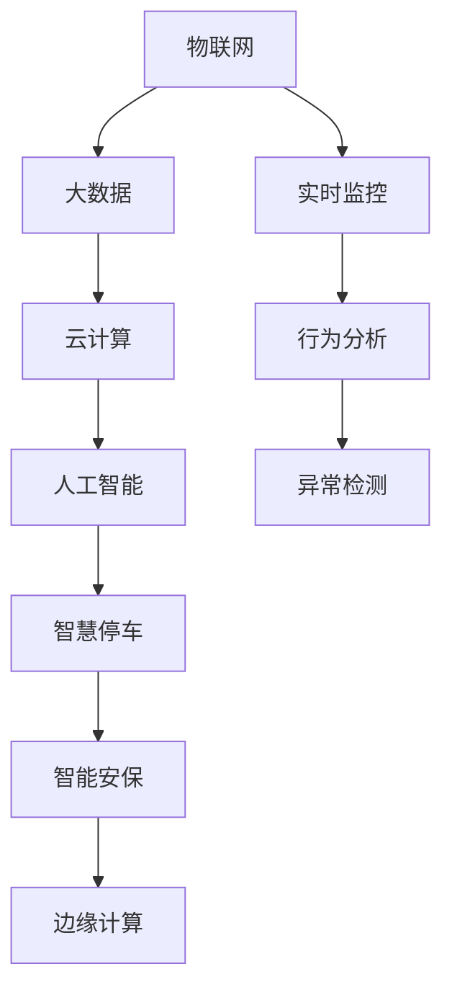

                 

## 1. 背景介绍

### 1.1 问题由来

智慧物业已成为现代城市管理的重要组成部分，其涵盖范围广，涉及服务种类多，涵盖从智能建筑到智能小区，从智能安防到智慧停车等多个子领域。特别是在城市化进程加速和“新基建”政策推动下，智慧物业市场前景广阔。

当前，智慧物业的主要瓶颈在于其技术基础设施的不完善。尽管物联网、云计算、大数据等技术已有所突破，但整体系统设计、数据安全与隐私保护、用户体验等方面仍有待优化。特别是在智慧停车与智能安保这两个关键领域，技术应用有待进一步深入。

### 1.2 问题核心关键点

未来智慧物业的核心关键点在于如何将新兴技术无缝集成至现有系统，以提升服务效率、增强安全性、优化用户体验，同时兼顾数据安全与隐私保护。

智慧停车与智能安保是未来智慧物业的典型应用场景。智能停车系统可有效缓解城市交通压力，智能安保系统则可大幅提升社区安全，减少人力投入。两者均涉及海量数据处理、实时监控、智能推理等技术环节，因此技术集成与优化显得尤为重要。

## 2. 核心概念与联系

### 2.1 核心概念概述

- **智慧停车**：利用物联网、大数据、AI等技术，实现停车位自动查找、预订、智能导航、缴费等功能，提升停车效率，优化停车体验。

- **智能安保**：通过视频监控、人脸识别、行为分析等技术，实现对人员进出、异常行为等安全事件的实时监测与预警，提升社区安全。

- **物联网(IoT)**：基于互联网协议，连接物品、车辆、设施等设备，实现物与物、物与人之间的信息交互。

- **云计算**：通过互联网提供计算资源与存储资源，支持大数据分析与机器学习，为智慧停车与智能安保提供强大计算支撑。

- **人工智能(AI)**：包括计算机视觉、自然语言处理、强化学习、机器学习等多种技术，应用于智能决策、行为分析、异常检测等领域。

- **边缘计算**：将计算能力从云端移至边缘设备，提升实时响应能力，降低网络延迟，保障数据隐私。

这些概念间存在紧密联系，物联网提供感知和数据采集能力，云计算提供计算与存储能力，人工智能提供智能推理与决策能力，边缘计算则提升实时响应与数据隐私保护。

### 2.2 核心概念原理和架构的 Mermaid 流程图



以上流程图展示了各技术概念之间的联系与交互，物联网设备采集数据，通过大数据处理，存储在云端。人工智能在云端进行智能推理与决策，边缘计算则将部分计算能力下移至边缘设备，提升实时响应。智慧停车与智能安保系统通过这些技术实现。

## 3. 核心算法原理 & 具体操作步骤

### 3.1 算法原理概述

智慧停车与智能安保的核心算法原理主要涉及以下几个方面：

- **图像识别与处理**：通过计算机视觉技术，从视频中识别车辆、行人，提取特征信息。
- **深度学习与强化学习**：利用神经网络模型和强化学习算法，提升图像识别精度和异常检测能力。
- **路径规划与决策优化**：通过智能算法优化停车位分配、路径规划，提升停车效率。
- **行为分析与风险预警**：利用行为分析技术，识别异常行为，及时预警安全风险。

这些算法原理构成了智慧停车与智能安保的基础。核心技术包括卷积神经网络(CNN)、循环神经网络(RNN)、长短期记忆网络(LSTM)、生成对抗网络(GAN)等。

### 3.2 算法步骤详解

智慧停车与智能安保的算法步骤大致如下：

1. **数据采集与预处理**：
   - 通过物联网设备（如智能摄像头、传感器）采集数据。
   - 对采集数据进行预处理，包括数据清洗、特征提取、归一化等。

2. **模型训练与优化**：
   - 构建深度学习模型（如CNN、LSTM、GAN等），利用历史数据进行训练。
   - 使用强化学习算法（如Q-Learning、DQN等），优化模型参数。
   - 通过交叉验证等技术，评估模型性能，进行超参数优化。

3. **实时推理与决策**：
   - 将训练好的模型部署至边缘计算设备，进行实时推理。
   - 利用推理结果，进行路径规划、异常检测、风险预警等决策。

4. **系统集成与优化**：
   - 将智慧停车与智能安保系统集成至物联网平台，实现数据交互与统一管理。
   - 优化系统性能，提升实时响应能力，保障数据安全与隐私。

### 3.3 算法优缺点

智慧停车与智能安保的算法优点包括：

- **提升效率**：通过图像识别、路径规划等技术，大幅提升停车效率，缩短等待时间。
- **增强安全**：通过实时监控、异常检测等技术，提升社区安全，减少安全隐患。
- **优化体验**：通过智能决策、实时反馈等技术，提升用户体验，增加用户满意度。

但同时也存在一些缺点：

- **数据隐私风险**：大量的个人数据与车辆数据需要存储和处理，存在隐私泄露风险。
- **计算资源需求高**：深度学习模型与强化学习算法需要大量计算资源，系统部署成本较高。
- **实时响应挑战**：数据处理与模型推理需要高效算法与硬件支持，实时响应能力有待提高。

### 3.4 算法应用领域

智慧停车与智能安保技术主要应用于以下领域：

- **城市交通管理**：通过智慧停车系统缓解城市交通压力，提升城市交通效率。
- **社区安全管理**：利用智能安保系统，实时监控社区安全，提升社区管理水平。
- **商业地产管理**：通过智慧停车系统，提升商业地产的停车效率，增加商业价值。
- **住宅小区管理**：利用智能安保系统，增强住宅小区的安全防范能力。

## 4. 数学模型和公式 & 详细讲解 & 举例说明

### 4.1 数学模型构建

智慧停车与智能安保的数学模型主要涉及以下几个方面：

- **目标检测**：利用深度学习模型（如YOLO、Faster R-CNN等），从图像中检测目标物体（如车辆）。
- **行为分析**：利用行为分析算法，识别个体行为特征。
- **异常检测**：利用异常检测算法，识别异常行为或事件。

### 4.2 公式推导过程

以目标检测为例，其基本流程如下：

1. **特征提取**：利用卷积层提取图像特征，生成特征图。
2. **候选框生成**：利用池化层、ROI层生成候选框。
3. **候选框分类**：利用全连接层和softmax层对候选框进行分类。
4. **边界框回归**：利用回归层调整候选框的位置和大小，提升检测精度。

### 4.3 案例分析与讲解

假设有一张车辆停车场的图像，其特征提取过程如下：

- 使用卷积层（CNN）对图像进行特征提取，生成特征图。
- 利用池化层（Pooling）进行特征降维，减少计算量。
- 使用ROI池化层（ROIPooling）从特征图中生成候选框。
- 利用全连接层（FC）和softmax层对候选框进行分类，输出车辆数量。
- 使用回归层（Regression）调整候选框的位置和大小，提升检测精度。

## 5. 项目实践：代码实例和详细解释说明

### 5.1 开发环境搭建

智慧停车与智能安保项目开发环境搭建如下：

1. **环境安装**：
   - 安装Python 3.8以上版本。
   - 安装TensorFlow、Keras、PyTorch、OpenCV等深度学习库。
   - 安装Raspberry Pi或Arduino等边缘计算设备。

2. **环境配置**：
   - 设置Python环境变量。
   - 安装第三方依赖包。
   - 配置GPU环境（如使用NVIDIA GPU）。

### 5.2 源代码详细实现

假设使用TensorFlow进行目标检测模型的开发，代码实现如下：

```python
import tensorflow as tf
from tensorflow.keras.layers import Input, Conv2D, MaxPooling2D, Flatten, Dense, Dropout
from tensorflow.keras.models import Model
from tensorflow.keras.losses import categorical_crossentropy

# 定义卷积层和池化层
def conv_block(input, filters, kernel_size, strides=(2, 2), padding='same', activation='relu'):
    x = Conv2D(filters, kernel_size, strides=strides, padding=padding, activation=activation)(input)
    x = BatchNormalization()(x)
    x = Activation('relu')(x)
    return x

# 定义全连接层和分类层
def dense_block(input, units, activation='relu'):
    x = Flatten()(input)
    x = Dense(units, activation=activation)(x)
    return x

# 定义目标检测模型
def detect_model(input_shape):
    input = Input(shape=input_shape)
    x = conv_block(input, 32, 3)
    x = conv_block(x, 64, 3)
    x = conv_block(x, 128, 3)
    x = conv_block(x, 256, 3)
    x = Flatten()(x)
    x = dense_block(x, 1024)
    x = Dropout(0.5)(x)
    x = Dense(num_classes, activation='softmax')(x)
    model = Model(inputs=input, outputs=x)
    return model

# 训练与评估函数
def train_model(model, train_data, val_data, epochs=10, batch_size=32):
    model.compile(optimizer='adam', loss=categorical_crossentropy, metrics=['accuracy'])
    model.fit(train_data, epochs=epochs, batch_size=batch_size, validation_data=val_data)

# 实时推理函数
def predict(frame):
    preprocessed_frame = preprocess(frame)
    predictions = model.predict(preprocessed_frame)
    return predictions

# 主函数
def main():
    input_shape = (640, 480, 3)
    num_classes = 2 # 车辆与非车辆
    model = detect_model(input_shape)
    train_model(model, train_data, val_data)
    predict(frame)

# 数据预处理函数
def preprocess(frame):
    # 数据增强、归一化等预处理操作
    return preprocessed_frame
```

### 5.3 代码解读与分析

以上代码实现了基本的目标检测模型，包含卷积层、池化层、全连接层、分类层等组件。其中，`conv_block`函数定义了卷积和激活函数，`dense_block`函数定义了全连接层和分类层，`detect_model`函数构建了整个目标检测模型。

训练与评估函数`train_model`使用`adam`优化器和交叉熵损失函数进行模型训练。实时推理函数`predict`接收输入图像，经过预处理后输入模型，输出预测结果。

## 6. 实际应用场景

### 6.1 智能停车系统

智能停车系统通过物联网设备采集停车场图像，利用计算机视觉技术识别车辆，通过路径规划算法优化停车位分配，并通过支付系统实现自动收费。

1. **智能识别**：利用目标检测技术，实时识别停车场中的车辆，生成车辆列表。
2. **路径规划**：根据车辆位置和目标车位，利用路径规划算法计算最优路径。
3. **自动导航**：通过智能导引系统引导车辆自动导航至停车位。
4. **自动支付**：通过支付系统实现自动缴费，简化停车流程。

### 6.2 智能安保系统

智能安保系统通过视频监控设备采集社区图像，利用行为分析技术识别异常行为，通过报警系统及时预警安全风险。

1. **实时监控**：通过视频监控设备实时采集社区图像，生成视频流。
2. **行为分析**：利用行为分析算法识别个体行为特征，检测异常行为。
3. **风险预警**：根据异常行为，利用报警系统及时预警安全风险。
4. **数据存储与分析**：通过大数据存储与分析，记录并分析社区安全数据。

### 6.3 未来应用展望

未来的智慧物业将更加智能化、高效化、安全化，主要发展方向包括：

- **自动化水平提升**：通过智能算法优化各个环节，实现全自动、高效率的智慧物业服务。
- **数据隐私保护**：利用边缘计算、数据脱敏等技术，保障数据隐私与安全性。
- **用户体验优化**：通过智能决策、实时反馈等技术，提升用户体验，增加用户满意度。

## 7. 工具和资源推荐

### 7.1 学习资源推荐

1. **TensorFlow官方文档**：详细介绍了TensorFlow的各个组件和使用方法。
2. **OpenCV官方文档**：提供了计算机视觉技术的详细文档和教程。
3. **深度学习理论与实践**：系统讲解深度学习的基础理论和应用实践，涵盖目标检测、行为分析、异常检测等技术。
4. **智慧物业案例分析**：介绍智慧物业的典型应用场景和实践经验。

### 7.2 开发工具推荐

1. **TensorFlow**：深度学习与机器学习框架，支持多种算法和模型。
2. **Keras**：高级神经网络API，易于上手，功能丰富。
3. **PyTorch**：灵活的深度学习框架，支持动态计算图。
4. **OpenCV**：计算机视觉库，支持图像处理、目标检测等。

### 7.3 相关论文推荐

1. **YOLO目标检测算法**：介绍YOLO算法的基本原理和实现方法。
2. **Faster R-CNN目标检测算法**：详细讲解Faster R-CNN算法及其优化。
3. **Q-Learning强化学习算法**：介绍Q-Learning算法的原理和应用。
4. **行为分析与异常检测**：涵盖行为分析技术、异常检测算法等内容。

## 8. 总结：未来发展趋势与挑战

### 8.1 研究成果总结

智慧停车与智能安保技术的开发与应用，为未来智慧物业的发展提供了重要基础。通过物联网、云计算、人工智能等技术，实现了停车位自动查找、智能导航、异常行为检测等功能，大幅提升了停车效率和安全管理水平。

### 8.2 未来发展趋势

未来智慧物业的发展趋势包括：

- **技术融合**：结合物联网、云计算、人工智能、边缘计算等技术，提升系统性能与可靠性。
- **数据驱动**：通过大数据分析，优化智慧物业服务，提升用户体验。
- **普适化设计**：根据不同场景需求，设计灵活可扩展的智慧物业系统。

### 8.3 面临的挑战

智慧物业面临的挑战包括：

- **技术复杂度**：智慧物业系统涉及多种技术，技术集成与优化难度较大。
- **数据安全**：海量数据存储与处理，数据隐私与安全性问题突出。
- **用户接受度**：智能系统需要满足用户需求，提升用户接受度，降低用户抵触心理。

### 8.4 研究展望

未来的研究方向包括：

- **技术优化**：通过算法优化与模型压缩，提升系统性能与响应速度。
- **数据隐私保护**：引入区块链、差分隐私等技术，保障数据隐私与安全性。
- **用户体验提升**：通过人机交互技术，提升用户体验，增加用户满意度。

## 9. 附录：常见问题与解答

**Q1：智慧停车与智能安保系统如何集成到现有物业系统？**

A：智慧停车与智能安保系统需要与现有物业系统（如智能门禁、安防监控、智能楼控等）进行数据交互，一般需要采用API接口或消息队列等技术实现系统集成。

**Q2：智慧停车与智能安保系统在部署时有哪些注意事项？**

A：系统部署时需要注意以下几点：
- 边缘计算设备的选择与配置。
- 数据存储与传输的安全性。
- 系统与环境的兼容性。

**Q3：如何优化智慧停车与智能安保系统的实时响应能力？**

A：实时响应能力可以通过以下方式优化：
- 优化算法模型，减少计算量。
- 提高边缘计算设备的计算能力。
- 优化数据传输与存储。

**Q4：智慧停车与智能安保系统的数据隐私如何保障？**

A：数据隐私保障可以通过以下方式实现：
- 采用数据脱敏、加密技术。
- 设计本地计算与边缘计算机制，减少数据传输。
- 引入区块链技术，确保数据透明性与可追溯性。

**Q5：智慧停车与智能安保系统的安全性如何保障？**

A：安全性保障可以通过以下方式实现：
- 使用身份认证、授权机制，确保系统访问安全。
- 引入行为分析与异常检测技术，及时预警安全风险。
- 定期进行系统安全审计与漏洞修补。

---

作者：禅与计算机程序设计艺术 / Zen and the Art of Computer Programming

