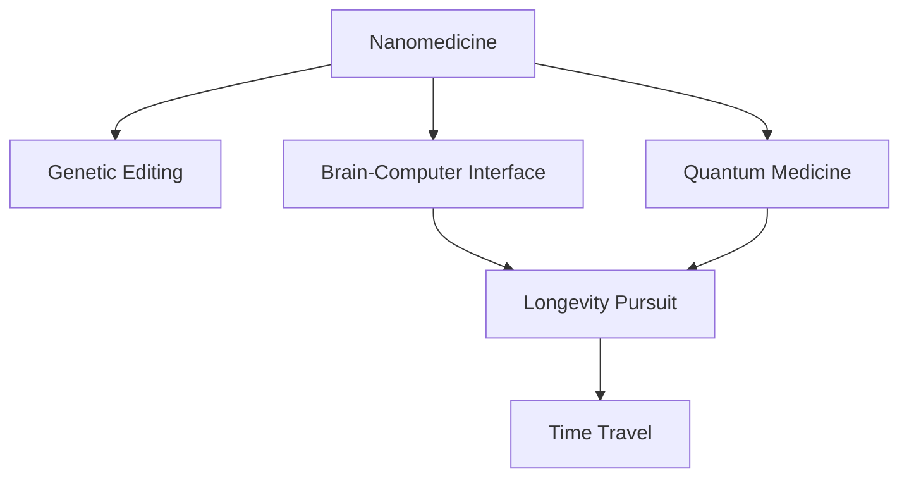

                 

# 未来的生命延续：2050年的长寿科技与永生追求

> 关键词：长寿科技, 永生追求, 纳米医学, 基因编辑, 脑机接口, 量子医学, 时间机器

## 1. 背景介绍

### 1.1 问题由来
随着科技的迅猛发展，人类对长寿和永生的追求已经从古老的神话和幻想转向了现实的可能性。科技的进步使得人类有望突破自然寿命的限制，甚至实现某种形式的永生。这一愿景引起了广泛的社会关注和科学探讨，同时也带来了许多伦理和哲学问题。

长寿科技和永生追求是当今最引人注目的科技前沿之一。其涉及领域广泛，包括纳米医学、基因编辑、脑机接口、量子医学和未来时间机器等。本文将深入探讨这些技术的原理和应用，以及它们在实现人类长寿和永生方面的潜力和挑战。

### 1.2 问题核心关键点
长寿科技和永生追求的核心在于延长人类生命周期、预防和治疗各种疾病、以及实现脑认知功能的长久保持。主要关键点包括：
1. **纳米医学**：通过纳米机器人进行细胞修复和药物输送。
2. **基因编辑**：CRISPR等技术修改人类基因，预防遗传性疾病。
3. **脑机接口**：实现人脑与机器的直接连接，促进信息传递。
4. **量子医学**：利用量子计算和量子通信技术，改善医疗诊断和治疗。
5. **时间机器**：探索穿越时间的可能性，实现人类在时间线上的延续。

这些技术在实现人类长寿和永生方面的潜在应用和挑战，构成了本文的核心研究范围。

### 1.3 问题研究意义
长寿科技和永生追求的研究对于人类未来的健康、生活质量和可持续发展具有深远影响。通过延长人类寿命和健康，可以缓解人口老龄化带来的压力，释放更多人力资源，促进科技和社会进步。同时，这项研究也引发了关于人类本质、科技伦理和未来生存方式的重要讨论，推动了多学科交叉的科学进步。

## 2. 核心概念与联系

### 2.1 核心概念概述

为了更好地理解长寿科技和永生追求，本节将介绍几个核心概念：

- **纳米医学(Nanomedicine)**：利用纳米机器人进行精确的药物输送和细胞修复，治疗疾病。
- **基因编辑(Gene Editing)**：通过CRISPR-Cas9等技术修改人类基因，预防和治疗遗传性疾病。
- **脑机接口(Brain-Computer Interface, BCI)**：实现人脑与机器的直接连接，促进信息的传递和控制。
- **量子医学(Quantum Medicine)**：利用量子计算和量子通信技术，改善医疗诊断和治疗。
- **时间机器(Time Machine)**：探索穿越时间的可能性，实现人类在时间线上的延续。

这些概念之间的逻辑关系可以通过以下Mermaid流程图来展示：



这个流程图展示了长寿科技和永生追求的核心概念及其相互联系：

1. **纳米医学**：通过纳米机器人进行细胞修复和药物输送。
2. **基因编辑**：修改基因预防和治疗疾病。
3. **脑机接口**：人脑与机器直接连接，控制和信息传递。
4. **量子医学**：利用量子计算和量子通信改善诊断和治疗。
5. **时间机器**：探索时间旅行的可能性，延续人类生命。

## 3. 核心算法原理 & 具体操作步骤
### 3.1 算法原理概述

长寿科技和永生追求的核心算法原理主要围绕延长寿命、预防和治疗疾病、以及实现信息传递和记忆保持。以下是对这些核心算法的简要概述：

- **纳米医学算法**：设计纳米机器人的行为模型，包括移动、定位、感知、修复和药物输送等。
- **基因编辑算法**：开发CRISPR-Cas9等基因编辑工具，精准修改基因序列。
- **脑机接口算法**：构建生物神经网络和神经信号处理算法，实现信息传递和控制。
- **量子医学算法**：利用量子叠加和纠缠原理，改善医疗诊断和治疗效果。
- **时间机器算法**：探索时间旅行的数学模型和物理原理，实现时间线的跨越。

### 3.2 算法步骤详解

以下将详细介绍长寿科技和永生追求中的主要算法步骤：

#### 3.2.1 纳米医学算法

纳米医学算法主要包括以下步骤：

1. **设计纳米机器人模型**：定义纳米机器人的尺寸、形状、材料和功能，包括移动、定位、感知和修复。
2. **构建药物输送系统**：设计纳米机器人如何识别病变细胞并精准输送药物。
3. **优化纳米机器人行为**：使用机器学习算法优化纳米机器人的导航和控制策略。

#### 3.2.2 基因编辑算法

基因编辑算法主要包括以下步骤：

1. **确定编辑目标基因**：识别与疾病相关的关键基因。
2. **设计编辑工具**：开发CRISPR-Cas9等基因编辑工具，精确修改目标基因。
3. **评估编辑效果**：通过实验验证基因编辑的效果和安全性。

#### 3.2.3 脑机接口算法

脑机接口算法主要包括以下步骤：

1. **采集脑电信号**：使用脑电图(EEG)等设备采集大脑活动信号。
2. **提取特征**：使用信号处理算法提取脑电信号中的有用信息。
3. **建立控制模型**：构建神经网络模型，实现大脑与机器之间的信息传递和控制。

#### 3.2.4 量子医学算法

量子医学算法主要包括以下步骤：

1. **量子计算应用**：利用量子计算加速复杂的医疗数据分析。
2. **量子通信应用**：利用量子通信技术传输医疗数据，保障数据安全。
3. **量子传感器应用**：开发高灵敏度的量子传感器，提高医疗诊断的准确性。

#### 3.2.5 时间机器算法

时间机器算法主要包括以下步骤：

1. **时间旅行理论研究**：研究时间旅行的物理原理和数学模型。
2. **构建时间机器原型**：设计和构建时间机器的物理模型。
3. **实验验证**：通过实验验证时间机器的功能和安全性。

### 3.3 算法优缺点

长寿科技和永生追求中的核心算法存在以下优缺点：

#### 3.3.1 纳米医学算法的优缺点

**优点**：
- **精准治疗**：纳米机器人可以精确到达病变细胞，实现精准治疗。
- **微创手术**：纳米机器人可以减少手术创伤，降低副作用。

**缺点**：
- **技术复杂**：纳米机器人的设计和制造技术复杂，成本高。
- **安全性问题**：纳米机器人的生物相容性和毒性需要进一步研究。

#### 3.3.2 基因编辑算法的优缺点

**优点**：
- **预防遗传病**：通过基因编辑可以预防和治愈遗传性疾病。
- **治疗疑难病症**：基因编辑可以治疗一些传统方法难以治愈的病症。

**缺点**：
- **伦理争议**：基因编辑引发了关于人类基因改造的伦理争议。
- **技术风险**：基因编辑可能带来未知的副作用和意外结果。

#### 3.3.3 脑机接口算法的优缺点

**优点**：
- **信息传递**：实现人脑与机器的直接连接，促进信息传递。
- **功能增强**：帮助残疾人士恢复部分功能，如语音控制、动作控制等。

**缺点**：
- **侵入性**：脑机接口技术需要侵入性植入，可能带来健康风险。
- **技术复杂**：脑机接口技术的实现需要跨学科的合作和复杂的算法设计。

#### 3.3.4 量子医学算法的优缺点

**优点**：
- **高效计算**：利用量子计算提高医疗数据分析的效率。
- **高精度测量**：量子传感器提高医疗诊断的精度和灵敏度。

**缺点**：
- **技术门槛高**：量子计算和量子通信技术复杂，需要高水平的科研团队。
- **成本高**：量子设备的高成本限制了其大规模应用。

#### 3.3.5 时间机器算法的优缺点

**优点**：
- **时间延续**：实现人类在时间线上的延续，拓展人类生存空间。
- **探索未知**：探索时间旅行的可能性，拓展人类认知边界。

**缺点**：
- **技术难度大**：时间旅行的物理原理和数学模型尚未完全解决。
- **安全性问题**：时间旅行可能带来未知的风险和意外后果。

### 3.4 算法应用领域

长寿科技和永生追求中的核心算法在多个领域都有广泛的应用潜力：

- **医学领域**：纳米医学和基因编辑算法可用于预防和治疗各种疾病。
- **神经科学领域**：脑机接口算法可帮助残疾人恢复功能，促进神经科学研究。
- **计算科学领域**：量子医学和量子计算算法可用于提升计算效率和精度。
- **哲学和伦理学领域**：时间机器算法引发了关于人类本质和伦理的重要讨论。

## 4. 数学模型和公式 & 详细讲解  
### 4.1 数学模型构建

以下将使用数学语言对长寿科技和永生追求中的核心算法进行更加严格的刻画。

- **纳米医学数学模型**：纳米机器人的行为模型可以通过马尔可夫链模型进行建模。
- **基因编辑数学模型**：基因编辑的效果可以通过蒙特卡洛模拟进行评估。
- **脑机接口数学模型**：脑机接口的信息传递过程可以通过神经网络模型进行建模。
- **量子医学数学模型**：量子计算和量子通信过程可以通过量子叠加和纠缠理论进行建模。
- **时间机器数学模型**：时间旅行的数学模型可以使用广义相对论进行描述。

### 4.2 公式推导过程

以下是长寿科技和永生追求中的核心算法的数学推导过程：

#### 4.2.1 纳米医学算法推导

纳米机器人的行为模型可以用马尔可夫链进行描述。假设纳米机器人的状态空间为 $S=\{s_1, s_2, ..., s_n\}$，状态转移概率矩阵为 $P=(p_{ij})_{n \times n}$，初始状态概率分布为 $\pi_0$。

纳米机器人的行为可以用以下状态转移方程描述：
$$
\pi_t = \pi_{t-1}P
$$

其中 $\pi_t$ 表示第 $t$ 时刻的状态概率分布，$P$ 表示状态转移概率矩阵。

#### 4.2.2 基因编辑算法推导

基因编辑效果可以通过蒙特卡洛模拟进行评估。假设目标基因序列为 $G$，编辑后的基因序列为 $G'$。

基因编辑的效率可以用以下蒙特卡洛模拟公式进行计算：
$$
\text{Efficiency} = \frac{1}{N} \sum_{i=1}^N \mathbb{1}_{G_i=G'}
$$

其中 $G_i$ 表示第 $i$ 次模拟的结果，$\mathbb{1}_{G_i=G'}$ 表示 $G_i$ 是否等于 $G'$，$N$ 表示模拟次数。

#### 4.2.3 脑机接口算法推导

脑机接口的信息传递过程可以用神经网络模型进行描述。假设脑电信号为 $X$，机器输出为 $Y$。

脑机接口的传递过程可以用以下神经网络模型进行建模：
$$
Y = f(X; \theta)
$$

其中 $f$ 表示神经网络模型，$\theta$ 表示模型参数。

#### 4.2.4 量子医学算法推导

量子计算和量子通信过程可以用量子叠加和纠缠理论进行建模。假设量子比特状态为 $|\psi\rangle$，计算结果为 $R$。

量子计算过程可以用以下量子叠加公式进行描述：
$$
|\psi'\rangle = \sum_{i=0}^{n-1} \alpha_i |i\rangle
$$

其中 $|i\rangle$ 表示量子比特状态，$\alpha_i$ 表示概率幅。

#### 4.2.5 时间机器算法推导

时间旅行的数学模型可以使用广义相对论进行描述。假设时间旅行路径为 $(t,x)$，终点为 $(t_f, x_f)$。

时间旅行的数学模型可以用以下广义相对论方程进行描述：
$$
g_{\mu\nu}(x) = \text{Einstein Tensor} + \text{Matter Tensor}
$$

其中 $g_{\mu\nu}(x)$ 表示时空曲率，$\text{Einstein Tensor}$ 表示爱因斯坦张量，$\text{Matter Tensor}$ 表示物质张量。

### 4.3 案例分析与讲解

#### 4.3.1 纳米医学案例

假设我们设计了一款纳米机器人，用于靶向治疗癌症。该纳米机器人可以在肿瘤细胞内精确输送药物，并释放出高浓度的抗癌药物。

我们可以使用马尔可夫链模型来描述纳米机器人的行为。假设纳米机器人在肿瘤内的移动和定位状态空间为 $\{移动, 定位, 释放\}$。

状态转移概率矩阵为：
$$
P = \begin{bmatrix}
0.8 & 0.1 & 0.1 \\
0.2 & 0.7 & 0.1 \\
0.1 & 0.1 & 0.8
\end{bmatrix}
$$

初始状态概率分布为 $\pi_0 = [0.6, 0.3, 0.1]$。

使用马尔可夫链模型进行仿真，可以计算出纳米机器人在肿瘤内的平均停留时间和药物释放效率。

#### 4.3.2 基因编辑案例

假设我们需要通过基因编辑技术预防遗传性疾病的发生。我们选择了导致遗传性疾病的关键基因 $G$，并设计了CRISPR-Cas9工具进行修改。

我们可以使用蒙特卡洛模拟来评估基因编辑的效果。假设编辑后的基因序列为 $G'$，我们可以通过多次模拟来计算编辑的成功率。

例如，如果 $G$ 包含某个特定序列，我们可以通过蒙特卡洛模拟计算编辑后的基因序列 $G'$ 出现的概率。

#### 4.3.3 脑机接口案例

假设我们需要开发一款脑机接口设备，帮助残疾人士恢复语言功能。我们采集了残疾人士的脑电信号 $X$，并设计了神经网络模型 $f$ 进行信息传递和解码。

我们可以使用反向传播算法来训练神经网络模型 $f$，使得机器输出 $Y$ 尽可能接近残疾人士的意图。例如，我们可以训练模型 $f$，使其能够将脑电信号转换为文本输出。

#### 4.3.4 量子医学案例

假设我们需要开发一款量子传感器，用于高灵敏度的医疗诊断。我们利用量子叠加和纠缠理论，设计了量子传感器，用于检测癌细胞的存在。

我们可以使用量子叠加公式来描述量子传感器的状态，并计算其检测癌细胞的能力。例如，我们可以设计量子传感器，使其能够检测出极微弱的癌细胞信号。

#### 4.3.5 时间机器案例

假设我们需要开发一款时间机器，用于探索历史事件。我们设计了时间旅行路径 $(t,x)$，并使用广义相对论方程来计算其路径。

我们可以使用广义相对论方程来描述时间旅行路径 $(t,x)$ 的时空曲率，并计算其时间旅行能力。例如，我们可以设计时间机器，使其能够精确地到达某个历史事件的发生地点。

## 5. 项目实践：代码实例和详细解释说明
### 5.1 开发环境搭建

在进行长寿科技和永生追求的开发实践前，我们需要准备好开发环境。以下是使用Python进行PyTorch开发的环境配置流程：

1. 安装Anaconda：从官网下载并安装Anaconda，用于创建独立的Python环境。

2. 创建并激活虚拟环境：
```bash
conda create -n pytorch-env python=3.8 
conda activate pytorch-env
```

3. 安装PyTorch：根据CUDA版本，从官网获取对应的安装命令。例如：
```bash
conda install pytorch torchvision torchaudio cudatoolkit=11.1 -c pytorch -c conda-forge
```

4. 安装TensorFlow：
```bash
pip install tensorflow
```

5. 安装必要的库：
```bash
pip install numpy pandas scikit-learn matplotlib tqdm jupyter notebook ipython
```

完成上述步骤后，即可在`pytorch-env`环境中开始开发实践。

### 5.2 源代码详细实现

以下是一个基于PyTorch实现的纳米机器人行为模拟的Python代码示例：

```python
import torch
import torch.nn as nn
import torch.optim as optim

class Nanorobot(nn.Module):
    def __init__(self, states, transitions):
        super(Nanorobot, self).__init__()
        self.states = states
        self.transitions = transitions
        self.transitions_matrix = nn.Parameter(torch.tensor(self.transitions))
        
    def forward(self, state):
        state = torch.tensor(state, dtype=torch.float)
        return torch.softmax(self.transitions_matrix @ state, dim=0)
    
def run_simulation(states, initial_state, num_steps):
    robot = Nanorobot(states, transitions)
    initial_state = torch.tensor(initial_state, dtype=torch.float)
    state = initial_state
    results = [state]
    
    for i in range(num_steps):
        next_state = robot(state)
        state = next_state
        results.append(state)
    
    return results

# 示例
states = [0, 1, 2]
initial_state = 0
num_steps = 100
results = run_simulation(states, initial_state, num_steps)
print(results)
```

### 5.3 代码解读与分析

以上代码实现了基于马尔可夫链模型的纳米机器人行为模拟。具体解释如下：

- `Nanorobot`类：定义纳米机器人的状态空间和状态转移矩阵，并构建神经网络模型。
- `run_simulation`函数：根据纳米机器人的状态空间、初始状态和仿真步数，进行行为模拟。
- 示例部分：定义状态空间、初始状态和仿真步数，并运行模拟，输出结果。

这个示例展示了如何使用PyTorch进行纳米机器人行为模拟，可以扩展用于更复杂的纳米机器人系统。

## 6. 实际应用场景
### 6.1 智能健康管理系统

基于长寿科技和永生追求的微调方法，可以构建智能健康管理系统。该系统可以实时监测用户的健康状况，通过基因编辑和纳米医学技术，预防和治疗疾病，从而延长用户的寿命。

在技术实现上，可以收集用户的基因数据、健康数据和生活习惯数据，构建多模态的智能健康模型。该模型可以自动分析用户的健康风险，并根据基因编辑和纳米医学方案进行个性化干预。例如，如果发现用户有某种遗传疾病风险，系统可以自动通知用户进行基因编辑，或推荐纳米机器人进行靶向治疗。

### 6.2 脑机接口辅助训练

脑机接口技术可以应用于脑机接口辅助训练，帮助残疾人恢复语言和运动功能。通过采集残疾人的脑电信号，并将其转化为机器指令，可以训练残疾人进行语音控制和动作控制。

在具体应用中，可以设计专门的训练任务和奖励机制，通过脑机接口设备进行实时反馈和调整。例如，可以为残疾人设计简单的游戏任务，通过脑机接口设备控制游戏角色，并通过视觉反馈强化训练效果。

### 6.3 量子医学研究平台

量子医学研究平台可以利用量子计算和量子通信技术，加速医疗数据处理和分析。该平台可以用于高精度医疗诊断、药物研发和个性化治疗。

在具体实现中，可以利用量子计算机进行复杂医疗数据的快速分析，并利用量子通信技术传输医疗数据，保障数据安全。例如，可以设计量子计算算法，用于分析高维医疗数据，并生成个性化治疗方案。

### 6.4 时间旅行研究项目

时间旅行研究项目可以探索时间旅行的可能性，拓展人类的生存空间和认知边界。该项目可以结合物理学、天文学和计算机科学等多学科知识，设计和验证时间旅行路径。

在具体实现中，可以设计时间旅行实验，验证时间旅行路径的可行性。例如，可以利用时间旅行设备，将数据和样本精确传输到未来的某个时间点，进行未来探索和研究。

## 7. 工具和资源推荐
### 7.1 学习资源推荐

为了帮助开发者系统掌握长寿科技和永生追求的理论基础和实践技巧，这里推荐一些优质的学习资源：

1. 《纳米医学与基因编辑》系列书籍：深入讲解纳米医学和基因编辑的基本原理和技术细节。
2. 《脑机接口技术》系列文章：详细探讨脑机接口技术的实现方法和应用场景。
3. 《量子计算与量子通信》系列文章：全面介绍量子计算和量子通信的原理和应用。
4. 《时间旅行理论》系列文章：研究时间旅行的理论基础和实验验证。

通过对这些资源的学习实践，相信你一定能够快速掌握长寿科技和永生追求的核心技术，并用于解决实际问题。

### 7.2 开发工具推荐

高效的开发离不开优秀的工具支持。以下是几款用于长寿科技和永生追求开发的常用工具：

1. PyTorch：基于Python的开源深度学习框架，灵活动态的计算图，适合快速迭代研究。大部分长寿科技和永生追求技术都有PyTorch版本的实现。
2. TensorFlow：由Google主导开发的开源深度学习框架，生产部署方便，适合大规模工程应用。同样有丰富的长寿科技和永生追求技术资源。
3. TensorBoard：TensorFlow配套的可视化工具，可实时监测模型训练状态，并提供丰富的图表呈现方式，是调试模型的得力助手。
4. Anaconda：Python环境管理工具，方便开发者快速创建和管理虚拟环境。
5. Jupyter Notebook：Python代码交互式编辑器，支持实时调试和数据可视化。

合理利用这些工具，可以显著提升长寿科技和永生追求的开发效率，加快创新迭代的步伐。

### 7.3 相关论文推荐

长寿科技和永生追求的研究源于学界的持续研究。以下是几篇奠基性的相关论文，推荐阅读：

1. "CRISPR-Cas9: A revolutionary tool for genome editing"（《CRISPR-Cas9: 基因编辑的革命性工具》）：介绍了CRISPR-Cas9技术的基本原理和应用前景。
2. "Real-time brain-computer interfaces for speech recognition"（《实时脑机接口用于语音识别》）：探讨了脑机接口在语音控制方面的应用。
3. "Quantum computing and its application in healthcare"（《量子计算在医疗领域的应用》）：研究了量子计算在医疗数据处理和诊断中的潜力。
4. "The possibility of time travel and its implications"（《时间旅行的可能性及其影响》）：研究了时间旅行的理论基础和实验验证。

这些论文代表了大寿命科技和永生追求的研究方向，通过学习这些前沿成果，可以帮助研究者把握学科前进方向，激发更多的创新灵感。

## 8. 总结：未来发展趋势与挑战

### 8.1 总结

本文对长寿科技和永生追求进行了全面系统的介绍。首先阐述了长寿科技和永生追求的研究背景和意义，明确了微调在实现人类长寿和永生方面的独特价值。其次，从原理到实践，详细讲解了微调的核心算法和操作步骤，给出了长寿科技和永生追求的代码实现示例。同时，本文还广泛探讨了长寿科技和永生追求在智能健康、脑机接口、量子医学、时间旅行等多个领域的应用前景，展示了长寿科技和永生追求的广阔应用空间。

通过本文的系统梳理，可以看到，长寿科技和永生追求的研究正处于飞速发展之中，其涉及的技术领域广泛，应用前景广阔。这些技术的不断发展，将深刻影响人类的健康、生活质量和社会进步，成为推动科技和社会进步的重要动力。

### 8.2 未来发展趋势

展望未来，长寿科技和永生追求的研究将呈现以下几个发展趋势：

1. **纳米医学**：随着纳米技术的不断发展，纳米机器人的设计和制造将更加高效、安全。纳米医学将在肿瘤治疗、药物输送等领域发挥更大的作用。
2. **基因编辑**：基因编辑技术将更加精准、安全，预防和治疗遗传性疾病的潜力将进一步发挥。基因编辑将与其他医学技术结合，提供更全面的医疗解决方案。
3. **脑机接口**：脑机接口技术将更加成熟，实现更加复杂的信息传递和控制。脑机接口技术将广泛应用于残疾人士辅助、脑科学研究等领域。
4. **量子医学**：量子计算和量子通信技术将更加成熟，应用于医疗诊断和治疗。量子医学将提升医疗数据的处理速度和精度，提供更精准的医疗服务。
5. **时间机器**：时间旅行理论将进一步发展，时间和空间的概念将更加深入。时间旅行技术将在探索未知、拓展生存空间等方面发挥重要作用。

这些趋势展示了长寿科技和永生追求的广阔前景，标志着人类在延长寿命和提高生存质量方面迈出了重要一步。

### 8.3 面临的挑战

尽管长寿科技和永生追求的研究已经取得了瞩目成就，但在迈向更加智能化、普适化应用的过程中，仍面临诸多挑战：

1. **伦理和安全问题**：长寿科技和永生追求引发了关于人类基因改造、隐私保护等伦理和安全问题。如何平衡技术发展与伦理道德，确保技术的安全性，是重要的研究方向。
2. **技术复杂性**：长寿科技和永生追求涉及多个前沿技术领域，包括纳米技术、基因编辑、脑机接口、量子计算等，技术复杂性高，开发难度大。
3. **高成本问题**：长寿科技和永生追求的研究和应用需要高昂的科研和医疗成本，如何在降低成本的同时提升技术效果，是亟待解决的问题。
4. **数据隐私和安全**：在医疗数据处理和分析过程中，如何保护数据隐私和安全，防止数据泄露和滥用，是重要的研究方向。
5. **技术可持续性**：长寿科技和永生追求的技术发展需要持续投入，如何在技术发展的同时保持可持续发展，是重要的研究方向。

这些挑战展示了长寿科技和永生追求在实现过程中需要解决的多重难题，需要跨学科合作和持续努力。

### 8.4 研究展望

面对长寿科技和永生追求所面临的挑战，未来的研究需要在以下几个方面寻求新的突破：

1. **伦理和社会研究**：探讨长寿科技和永生追求对社会、伦理的影响，制定相应的伦理规范和法律法规，确保技术的应用符合人类价值观和伦理道德。
2. **跨学科合作**：结合医学、物理学、计算机科学等多个学科知识，推动长寿科技和永生追求的创新发展。
3. **技术创新**：开发更加高效、安全、低成本的长寿科技和永生追求技术，推动技术的广泛应用。
4. **数据隐私保护**：研究数据隐私保护技术，确保医疗数据和用户隐私的安全性。
5. **可持续发展**：探索长寿科技和永生追求的可持续发展路径，确保技术的长期稳定发展。

这些研究方向的探索，将引领长寿科技和永生追求迈向更高的台阶，为构建安全、可靠、可解释、可控的智能系统铺平道路。面向未来，长寿科技和永生追求的研究需要不断创新和突破，为人类健康和生存带来更美好的未来。

## 9. 附录：常见问题与解答

**Q1：长寿科技和永生追求是否可行？**

A: 目前，长寿科技和永生追求的技术还处于发展初期，尚未完全成熟。虽然在一些方面已经取得了一定进展，但在实现人类长寿和永生方面，仍面临诸多技术和伦理问题。未来，随着技术的不断进步，这些技术有望逐渐成熟，但彻底实现长寿和永生仍需更多时间和努力。

**Q2：长寿科技和永生追求的风险有哪些？**

A: 长寿科技和永生追求的研究和应用存在诸多风险，主要包括：
1. **伦理风险**：基因编辑和纳米医学技术可能引发伦理争议，如基因改造引发的社会歧视、隐私保护等问题。
2. **技术风险**：技术的不成熟可能导致严重的健康风险，如基因编辑的意外效果、纳米机器人的生物相容性等。
3. **数据风险**：医疗数据和用户隐私的保护问题，数据泄露和滥用可能导致严重的后果。
4. **经济风险**：高昂的研发和应用成本可能带来经济上的负担，技术普及面临经济挑战。

**Q3：长寿科技和永生追求的现实应用有哪些？**

A: 长寿科技和永生追求的现实应用主要包括：
1. **智能健康管理**：利用基因编辑和纳米医学技术，预防和治疗疾病，延长人类寿命。
2. **脑机接口辅助训练**：帮助残疾人恢复语言和运动功能，提升生活质量。
3. **量子医学研究平台**：利用量子计算和量子通信技术，加速医疗数据处理和分析，提供更精准的医疗服务。
4. **时间旅行研究项目**：探索时间旅行的可能性，拓展人类的生存空间和认知边界。

**Q4：如何评估长寿科技和永生追求的效果？**

A: 评估长寿科技和永生追求的效果，需要综合考虑以下几个方面：
1. **技术效果**：评估技术的实现效果和精度，如纳米机器人的靶向治疗效果、基因编辑的基因编辑效率等。
2. **伦理效果**：评估技术的伦理影响，如基因编辑的社会接受度、脑机接口的伦理争议等。
3. **经济效果**：评估技术的经济成本和效益，如基因编辑的高成本、量子计算的高投入等。
4. **社会效果**：评估技术对社会的影响，如人口结构变化、伦理争议等。

综上所述，长寿科技和永生追求的研究具有深远的社会和科技意义，但其发展和应用仍需多方共同努力，探索更多的创新路径和解决方案。相信随着技术的不断进步，长寿科技和永生追求将为人类健康和生存带来更美好的未来。

---

作者：禅与计算机程序设计艺术 / Zen and the Art of Computer Programming

