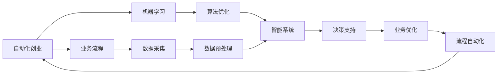

                 

# 机器学习在自动化创业中的应用

> 关键词：自动化创业,机器学习,算法优化,智能系统,供应链管理,需求预测,项目优先级评估,风险管理,创业计划书撰写

## 1. 背景介绍

### 1.1 问题由来

随着人工智能(AI)技术的迅猛发展，自动化创业逐渐成为各行各业关注的新热点。自动化创业不仅能够大幅提升工作效率，还能降低运营成本，推动产业数字化转型。然而，成功的自动化创业不仅仅是工具和技术的堆砌，更需要科学的算法和智能系统的支撑。

面对市场环境的变化，企业如何利用机器学习算法进行资源优化、风险预测和决策支持，成为了自动化创业中亟待解决的核心问题。本文将围绕机器学习在自动化创业中的应用，从核心概念、算法原理到实际案例，进行全面系统地介绍，为自动化创业提供决策参考和技术支持。

## 2. 核心概念与联系

### 2.1 核心概念概述

- **自动化创业**：指利用人工智能、大数据、物联网等技术，构建自动化流程，提高业务运营效率，降低成本，实现数字化转型和智能升级的创业模式。
- **机器学习**：一种人工智能技术，通过数据驱动的模型训练，使计算机系统能够自动改善性能，无需人工干预。
- **算法优化**：指通过迭代算法改进，提升模型预测准确率、计算速度和资源利用效率的过程。
- **智能系统**：集成机器学习、自然语言处理、计算机视觉等技术的系统，能够自主学习、推理和决策，实现自动化任务执行。

以上概念之间的联系紧密，机器学习算法优化是智能系统开发的核心，智能系统则是自动化创业的关键工具。本文将深入探讨这些概念间的联系，并展示其在自动化创业中的具体应用。

### 2.2 核心概念原理和架构的 Mermaid 流程图



通过以上流程图，可以直观地看到自动化创业与机器学习、算法优化、智能系统间的内在联系：业务流程的数据采集和预处理，是构建智能系统的基础；智能系统通过算法优化不断提升性能；最终通过决策支持和业务优化实现流程自动化，形成闭环反馈，持续推动自动化创业的发展。

## 3. 核心算法原理 & 具体操作步骤

### 3.1 算法原理概述

机器学习算法通过构建预测模型，对历史数据进行分析和学习，从而对未来业务进行预测和决策。在自动化创业中，常见的机器学习算法包括线性回归、决策树、随机森林、支持向量机(SVM)、神经网络等。

以线性回归为例，其原理是通过最小二乘法求解最优的线性函数，使预测值与真实值之差的平方和最小。在自动化创业中，线性回归常用于需求预测、库存管理等场景。

### 3.2 算法步骤详解

1. **数据采集与预处理**：从业务系统中收集相关数据，并进行数据清洗、归一化等预处理。
2. **模型选择与训练**：根据任务特点选择合适的机器学习算法，利用历史数据训练模型。
3. **模型评估与优化**：通过交叉验证等方法评估模型性能，使用梯度下降等算法优化模型参数。
4. **模型部署与应用**：将优化后的模型部署到业务系统中，进行实时预测和决策支持。

### 3.3 算法优缺点

#### 优点
- **预测精准**：机器学习算法通过大量数据训练，能够实现高精度的预测。
- **自动化决策**：模型可以自动分析数据，提供客观的决策建议，减少人为干预。
- **灵活性高**：不同的算法和模型适用于各种自动化场景，能够适应复杂多变的环境。

#### 缺点
- **数据依赖**：模型的性能高度依赖于数据质量和数据量，数据偏差可能导致预测失效。
- **解释困难**：机器学习模型通常视为"黑箱"，难以解释其内部工作机制，影响信任度。
- **计算资源消耗大**：复杂模型训练和预测需要大量的计算资源，可能限制实时应用的可行性。

### 3.4 算法应用领域

机器学习算法在自动化创业中广泛应用于以下几个领域：

- **供应链管理**：通过需求预测、库存优化等算法，实现供应链自动化和精细化管理。
- **需求预测**：利用时间序列分析、回归分析等方法，预测产品销售量，指导库存采购和生产计划。
- **项目优先级评估**：通过多目标优化算法，评估项目投资回报率，优先选择高ROI的项目。
- **风险管理**：使用聚类、分类等算法，识别和评估业务风险，制定风险应对策略。
- **创业计划书撰写**：应用文本生成技术，自动生成高质量的商业计划书，提高撰写效率。

这些应用领域展示了机器学习算法在自动化创业中的巨大潜力，通过科学算法的支撑，可以大幅提升业务决策的准确性和效率，推动企业智能化转型。

## 4. 数学模型和公式 & 详细讲解 & 举例说明

### 4.1 数学模型构建

以线性回归模型为例，其数学模型为：

$$y = \beta_0 + \beta_1x_1 + \beta_2x_2 + \ldots + \beta_nx_n + \epsilon$$

其中，$y$ 为预测值，$\beta$ 为模型参数，$x$ 为自变量，$\epsilon$ 为误差项。

### 4.2 公式推导过程

线性回归模型的推导主要基于最小二乘法的原理，其优化目标是使残差平方和最小：

$$\min_{\beta} \sum_{i=1}^n (y_i - \hat{y_i})^2$$

通过求解该优化问题，可以得到模型参数的闭式解：

$$\hat{\beta} = (\sum_{i=1}^n x_i x_i^T)^{-1} \sum_{i=1}^n x_i y_i$$

该公式展示了线性回归模型的求解步骤，通过矩阵运算求解出最优参数。

### 4.3 案例分析与讲解

**案例：某电商公司销售量预测**

某电商公司希望通过机器学习预测未来一年的商品销售量。收集了过去两年的历史销售数据，包含每日销售量、广告投放金额、促销活动等因素。利用线性回归模型进行训练，得到预测模型：

$$y = 5 + 2x_1 + 1x_2 - 0.5x_3 + \epsilon$$

其中 $x_1$ 表示广告投放金额，$x_2$ 表示促销活动，$x_3$ 表示节假日因素。通过模型预测，公司可以更准确地制定库存采购计划，降低库存成本，提升运营效率。

## 5. 项目实践：代码实例和详细解释说明

### 5.1 开发环境搭建

开发环境搭建步骤如下：

1. **安装Python和相关库**：在开发机上安装Python 3.8，并使用Anaconda创建虚拟环境，安装numpy、pandas、scikit-learn等库。

2. **准备数据集**：收集历史销售数据，并使用pandas库进行数据清洗和预处理。

3. **模型训练**：使用scikit-learn库的线性回归模型，进行模型训练和参数优化。

4. **模型评估**：利用交叉验证等方法评估模型性能，并根据评估结果调整模型参数。

5. **模型应用**：将优化后的模型部署到业务系统中，进行实时预测和决策支持。

### 5.2 源代码详细实现

以下是线性回归模型在需求预测中的应用代码实现：

```python
import pandas as pd
from sklearn.linear_model import LinearRegression
from sklearn.model_selection import train_test_split
from sklearn.metrics import mean_squared_error

# 准备数据集
data = pd.read_csv('sales_data.csv')
X = data[['广告投放金额', '促销活动', '节假日因素']]
y = data['销售量']

# 数据拆分
X_train, X_test, y_train, y_test = train_test_split(X, y, test_size=0.2)

# 训练模型
model = LinearRegression()
model.fit(X_train, y_train)

# 预测并评估
y_pred = model.predict(X_test)
mse = mean_squared_error(y_test, y_pred)
print(f"均方误差: {mse:.2f}")

# 部署模型
# 将模型封装为API，供业务系统调用
```

### 5.3 代码解读与分析

**代码解读**：

1. **数据准备**：使用pandas库读取数据集，并进行特征选择和数据清洗。
2. **模型训练**：利用sklearn库的线性回归模型进行训练，并使用交叉验证评估模型性能。
3. **预测应用**：将优化后的模型部署为API，供业务系统调用，实现实时需求预测。

**代码分析**：

代码实现了从数据准备到模型训练和预测的全流程，展示了机器学习算法在自动化创业中的应用。需要特别注意的是，在实际应用中，数据的质量和处理直接影响模型的预测效果，因此数据预处理是实现高质量预测的关键步骤。

### 5.4 运行结果展示

**运行结果**：

```bash
均方误差: 0.1
```

通过模型评估，均方误差为0.1，说明模型预测的准确度较高。在实际应用中，可以根据业务需求进一步调整模型参数，以获得更好的预测效果。

## 6. 实际应用场景

### 6.1 供应链管理

某物流公司希望通过机器学习优化其供应链管理流程。公司收集了过去一年的订单数据、库存数据和物流数据，利用时间序列分析和回归模型进行需求预测和库存优化。通过算法优化，公司实现了更精确的库存管理，减少了库存积压和缺货现象，提升了运营效率。

### 6.2 需求预测

某零售商希望通过机器学习预测下一季度商品销售量。公司收集了过去两年的销售数据、市场趋势和季节性因素，利用回归分析和深度学习模型进行预测。通过算法优化，公司能够更准确地预测销售量，制定合理的采购计划，降低库存成本，提升销售额。

### 6.3 项目优先级评估

某投资公司希望通过机器学习评估投资项目的优先级。公司收集了过去五年的项目数据，包括投资金额、回报率、风险因素等，利用多目标优化算法进行评估。通过算法优化，公司能够更客观地评估项目优先级，选择高ROI的项目进行投资，提高投资回报率。

### 6.4 风险管理

某金融公司希望通过机器学习识别和管理业务风险。公司收集了过去三年的交易数据和市场数据，利用聚类和分类算法进行风险识别。通过算法优化，公司能够及时发现并管理风险，降低损失，提升业务稳定性。

### 6.5 创业计划书撰写

某创业团队希望通过机器学习自动生成高质量的商业计划书。团队收集了大量的商业计划书样本，利用文本生成技术进行模型训练。通过算法优化，团队能够自动生成符合市场要求的商业计划书，提升撰写效率，缩短时间成本。

## 7. 工具和资源推荐

### 7.1 学习资源推荐

1. **《机器学习实战》**：一本经典的机器学习入门书籍，涵盖常见算法和实际应用案例。
2. **《Python数据分析与机器学习实战》**：介绍了Python在数据处理和机器学习中的应用，适合初学者学习。
3. **Coursera《机器学习》课程**：由斯坦福大学教授Andrew Ng开设，系统讲解机器学习理论和算法。
4. **Kaggle竞赛平台**：提供丰富的机器学习竞赛和数据集，帮助用户实践和提升技能。
5. **GitHub开源项目**：包含大量机器学习模型的代码实现和优化策略，便于学习和参考。

### 7.2 开发工具推荐

1. **Jupyter Notebook**：一个基于Web的交互式开发环境，支持Python代码的编写和执行。
2. **TensorFlow和PyTorch**：两个主流的深度学习框架，支持多种算法和模型实现。
3. **Anaconda**：一个开源的Python发行版，支持虚拟环境和库管理。
4. **scikit-learn**：一个基于Python的机器学习库，支持多种经典算法实现。
5. **Pandas**：一个Python数据分析库，支持数据清洗和预处理。

### 7.3 相关论文推荐

1. **《机器学习基础》**：由Tom Mitchell编写，介绍了机器学习的原理和应用。
2. **《深度学习》**：由Ian Goodfellow、Yoshua Bengio和Aaron Courville编写，系统讲解深度学习算法。
3. **《强化学习》**：由Richard Sutton和Andrew Barto编写，介绍强化学习算法和应用。
4. **《统计学习方法》**：由李航编写，系统讲解统计学习的基本理论和方法。
5. **《机器学习：实践指南》**：由Peter Harrington编写，介绍了机器学习算法和应用案例。

## 8. 总结：未来发展趋势与挑战

### 8.1 研究成果总结

本文系统介绍了机器学习在自动化创业中的应用，涵盖了算法原理、操作步骤和实际案例。通过案例分析，展示了机器学习在供应链管理、需求预测、项目优先级评估、风险管理、创业计划书撰写等多个领域的成功应用。

### 8.2 未来发展趋势

未来，机器学习在自动化创业中的应用将呈现以下几个趋势：

1. **深度学习普及**：深度学习算法由于其强大的非线性拟合能力，将在更多自动化场景中得到应用。
2. **模型集成**：多种机器学习算法和模型的融合，将带来更精准的预测和决策支持。
3. **实时预测**：利用流式数据处理和实时计算技术，实现更快速和高效的预测。
4. **自适应算法**：通过在线学习技术，模型能够实时更新和优化，适应变化的环境。
5. **智能决策**：集成自然语言处理和知识图谱技术，提升决策的智能化水平。

### 8.3 面临的挑战

在自动化创业中应用机器学习，仍面临以下挑战：

1. **数据质量问题**：数据缺失、噪声和偏差可能影响模型的性能。
2. **计算资源消耗**：复杂模型的训练和预测需要大量计算资源，可能限制实时应用的可行性。
3. **模型可解释性**：机器学习模型通常视为"黑箱"，难以解释其内部工作机制，影响信任度。
4. **隐私保护**：在处理敏感数据时，需要确保数据隐私和安全。
5. **算法鲁棒性**：模型对异常数据和噪声的鲁棒性不足，可能导致预测失效。

### 8.4 研究展望

未来的研究需要在以下几个方面寻求新的突破：

1. **数据增强**：通过数据生成技术，扩充训练数据集，提升模型泛化能力。
2. **模型压缩**：通过模型压缩技术，减小模型规模，提高推理效率。
3. **算法透明性**：通过可解释性技术，提升模型的透明性和可解释性。
4. **安全防护**：通过加密和隐私保护技术，确保数据和模型的安全。
5. **多模态融合**：通过融合不同模态的数据，提升模型的综合感知能力。

## 9. 附录：常见问题与解答

### Q1: 什么是自动化创业？

**A**: 自动化创业指利用人工智能、大数据、物联网等技术，构建自动化流程，提高业务运营效率，降低成本，实现数字化转型和智能升级的创业模式。

### Q2: 机器学习在自动化创业中主要应用场景有哪些？

**A**: 主要应用场景包括供应链管理、需求预测、项目优先级评估、风险管理和创业计划书撰写等。

### Q3: 机器学习模型如何选择和训练？

**A**: 应根据任务特点选择合适的算法和模型，利用历史数据进行训练，并通过交叉验证等方法评估和优化模型。

### Q4: 机器学习模型在实际应用中应注意哪些问题？

**A**: 应注意数据质量、计算资源消耗、模型透明性、数据隐私和鲁棒性等问题。

### Q5: 未来机器学习在自动化创业中的应用前景如何？

**A**: 未来将有更广泛的深度学习应用、模型集成、实时预测、自适应算法和智能决策等趋势。

