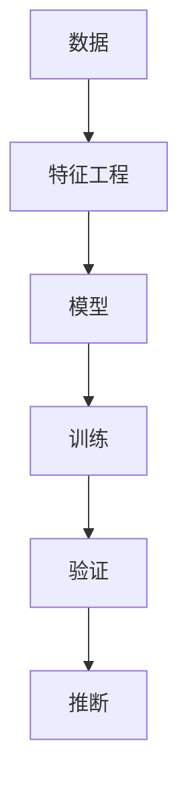

                 

# 模型思维的应用:快速掌握新知识

> 关键词：模型思维, 知识获取, 快速学习, 新知识, 人工智能, 认知科学与工程

## 1. 背景介绍

在当今快速变化的时代，掌握新知识成为了个人和组织成功的关键因素。然而，面对日新月异的技术和知识，传统的学习方式往往难以适应，效率低下。模型思维的引入，提供了一种快速、系统、高效的学习新知识的方法。本文将深入探讨模型思维的原理，并通过具体案例展示其在实际中的应用，以帮助读者快速掌握新知识。

## 2. 核心概念与联系

### 2.1 核心概念概述

模型思维是指通过建立抽象的模型来理解和处理复杂系统的一种思维方式。在人工智能领域，模型思维尤其重要，因为机器学习模型能够从大量数据中提取规律，预测未来结果，辅助决策。以下是几个关键概念：

- **模型**：任何可以描述现实世界现象的抽象结构。在机器学习中，模型是数据特征和预测结果之间的映射关系。
- **训练**：使用已知的数据集调整模型参数，使其能够更准确地预测未知数据。
- **验证**：使用测试集评估模型性能，验证其泛化能力。
- **推断**：使用模型对新数据进行预测或分类。

这些概念之间的联系可以通过以下Mermaid流程图来展示：



## 3. 核心算法原理 & 具体操作步骤

### 3.1 算法原理概述

模型思维的核心理念是通过抽象模型来理解和处理数据。具体来说，将现实问题抽象为数学模型，使用算法训练模型，然后用模型推断未知数据。这种思维方式可以应用于各种领域，如自然语言处理、计算机视觉、金融预测等。

### 3.2 算法步骤详解

模型思维的应用通常包括以下几个关键步骤：

**Step 1: 数据准备**
- 收集并整理数据集，确保数据的完整性和质量。
- 进行特征工程，提取和选择对预测任务有帮助的特征。

**Step 2: 模型选择与设计**
- 根据问题类型选择合适的模型（如线性回归、决策树、神经网络等）。
- 设计模型的结构，包括层数、节点数、激活函数等。

**Step 3: 模型训练**
- 使用训练集数据训练模型，调整模型参数以最小化预测误差。
- 可以使用不同的优化算法（如梯度下降、Adam等）和正则化技术（如L2正则化、Dropout等）来提高模型性能。

**Step 4: 模型验证与调优**
- 使用验证集评估模型性能，调整超参数以优化模型。
- 可以通过交叉验证、网格搜索等方法找到最优的超参数组合。

**Step 5: 模型应用**
- 使用训练好的模型对新数据进行推断，预测结果。
- 可以集成多个模型以提高预测的准确性和鲁棒性。

### 3.3 算法优缺点

模型思维的优点包括：
- 系统性强：通过构建模型，能够对复杂问题进行系统分析。
- 可解释性强：模型的结构与参数可以直接解释预测结果。
- 适用范围广：适用于各种类型的预测和分类任务。

模型思维的缺点包括：
- 数据依赖性强：模型性能依赖于数据质量和数量。
- 过度拟合风险：需要谨慎选择模型和调整超参数以避免过拟合。
- 计算资源要求高：模型训练和推断通常需要大量的计算资源。

### 3.4 算法应用领域

模型思维广泛应用于人工智能的各个领域，以下是几个典型应用：

- **自然语言处理**：如情感分析、文本分类、机器翻译等任务。
- **计算机视觉**：如图像分类、目标检测、图像生成等任务。
- **金融预测**：如股票价格预测、信用评分、风险评估等任务。
- **医疗诊断**：如疾病预测、诊断系统、药物发现等任务。
- **推荐系统**：如个性化推荐、广告定向、用户行为分析等任务。

## 4. 数学模型和公式 & 详细讲解 & 举例说明

### 4.1 数学模型构建

在模型思维中，数学模型是最基本和重要的工具。以下是几个常见数学模型的构建：

- **线性回归模型**：$y = \beta_0 + \beta_1x_1 + \beta_2x_2 + ... + \beta_nx_n + \epsilon$
- **决策树模型**：通过递归地将数据集分为更小的子集，构建树形结构，每个叶子节点代表一个类别。
- **神经网络模型**：通过多层神经元模拟人脑神经系统，构建复杂的非线性模型。

### 4.2 公式推导过程

以线性回归模型为例，其推导过程如下：

设训练集为 $\{(x_i, y_i)\}_{i=1}^N$，其中 $x_i = [x_{i1}, x_{i2}, ..., x_{in}]^T$ 为特征向量，$y_i$ 为标签。线性回归模型为 $y = \beta_0 + \beta_1x_1 + \beta_2x_2 + ... + \beta_nx_n$。

目标是最小化预测误差 $e_i = y_i - \hat{y}_i$，其中 $\hat{y}_i = \beta_0 + \beta_1x_{i1} + \beta_2x_{i2} + ... + \beta_nx_{in}$。

使用最小二乘法，最小化误差平方和 $\sum_{i=1}^N e_i^2 = \sum_{i=1}^N (y_i - \hat{y}_i)^2$。

解得 $\beta_j = \frac{1}{N}\sum_{i=1}^N (x_{ij}\cdot e_i)$，其中 $e_i = y_i - \hat{y}_i$。

### 4.3 案例分析与讲解

以房价预测为例，分析模型思维的应用：

**Step 1: 数据准备**
- 收集历史房价数据，包括房屋面积、地理位置、房屋状况等特征。
- 进行数据清洗和预处理，如缺失值填补、特征归一化等。

**Step 2: 模型选择与设计**
- 选择线性回归模型，设计输入特征 $x = [房屋面积, 地理位置, 房屋状况]^T$。
- 设计输出标签 $y = 房价$。

**Step 3: 模型训练**
- 使用训练集数据训练模型，最小化预测误差。
- 使用梯度下降算法更新模型参数。

**Step 4: 模型验证与调优**
- 使用验证集评估模型性能，调整正则化系数以优化模型。
- 使用交叉验证方法找到最优的正则化系数。

**Step 5: 模型应用**
- 使用训练好的模型对新数据进行房价预测。

## 5. 项目实践：代码实例和详细解释说明

### 5.1 开发环境搭建

在进行模型思维应用实践前，需要准备好开发环境。以下是使用Python进行模型训练和评估的开发环境配置流程：

1. 安装Anaconda：从官网下载并安装Anaconda，用于创建独立的Python环境。
2. 创建并激活虚拟环境：
```bash
conda create -n model-env python=3.8 
conda activate model-env
```

3. 安装必要的Python库：
```bash
pip install numpy pandas scikit-learn matplotlib jupyter notebook
```

4. 安装模型库：
```bash
pip install scikit-learn
```

完成上述步骤后，即可在`model-env`环境中开始模型思维的应用实践。

### 5.2 源代码详细实现

以下是使用scikit-learn库进行房价预测的代码实现：

```python
import pandas as pd
from sklearn.model_selection import train_test_split
from sklearn.linear_model import LinearRegression
from sklearn.metrics import mean_squared_error

# 读取数据集
data = pd.read_csv('house_prices.csv')

# 特征工程
X = data[['area', 'location', 'condition']]  # 特征
y = data['price']  # 标签

# 数据集划分
X_train, X_test, y_train, y_test = train_test_split(X, y, test_size=0.2, random_state=42)

# 模型训练
model = LinearRegression()
model.fit(X_train, y_train)

# 模型验证
y_pred = model.predict(X_test)
rmse = mean_squared_error(y_test, y_pred, squared=False)

# 输出结果
print(f'RMSE: {rmse:.2f}')
```

### 5.3 代码解读与分析

让我们再详细解读一下关键代码的实现细节：

**数据处理**：
- 使用pandas库读取数据集，并进行特征选择。

**模型训练**：
- 使用scikit-learn库的LinearRegression模型进行训练。
- 使用train_test_split函数对数据集进行划分，划分出训练集和测试集。

**模型验证**：
- 使用模型对测试集进行预测，并计算预测误差。
- 使用mean_squared_error函数计算均方根误差（RMSE）。

**结果输出**：
- 输出模型的预测误差，评估模型性能。

## 6. 实际应用场景

### 6.1 智能客服系统

智能客服系统是模型思维应用的一个重要场景。通过构建客户行为预测模型，可以自动分析和理解客户需求，提高客户服务质量和效率。

**数据准备**：
- 收集客户对话记录、历史问题解决记录等数据。

**模型选择与设计**：
- 选择合适的时间序列模型（如ARIMA、LSTM等），设计输入特征（如客户对话内容、历史问题解决时间等）。

**模型训练**：
- 使用历史数据训练模型，预测客户可能提出的问题。

**模型应用**：
- 实时分析客户对话内容，预测客户意图，并提供相应解决方案。

### 6.2 金融风控系统

金融风控系统是模型思维应用的另一个重要场景。通过构建信用评分模型，可以预测客户的违约风险，及时发现和防范金融风险。

**数据准备**：
- 收集客户的个人信息、财务数据、交易记录等。

**模型选择与设计**：
- 选择合适的信用评分模型（如Logistic回归、随机森林等），设计输入特征（如年龄、收入、历史交易记录等）。

**模型训练**：
- 使用历史数据训练模型，预测客户是否违约。

**模型应用**：
- 实时分析客户信息，预测违约风险，并采取相应措施。

### 6.3 医疗诊断系统

医疗诊断系统是模型思维应用的典型应用之一。通过构建疾病预测模型，可以辅助医生进行疾病诊断，提高诊断准确性和效率。

**数据准备**：
- 收集患者的病历、检验报告、影像数据等。

**模型选择与设计**：
- 选择合适的分类模型（如SVM、神经网络等），设计输入特征（如症状、检验结果、影像特征等）。

**模型训练**：
- 使用历史数据训练模型，预测患者是否患病。

**模型应用**：
- 实时分析患者信息，预测疾病风险，并建议治疗方案。

## 7. 工具和资源推荐

### 7.1 学习资源推荐

为了帮助开发者系统掌握模型思维的理论基础和实践技巧，这里推荐一些优质的学习资源：

1. 《Python机器学习》系列书籍：详细介绍了机器学习模型的构建和应用，是入门模型思维的经典教材。
2. Coursera《机器学习》课程：由斯坦福大学教授Andrew Ng主讲，涵盖机器学习的基础和前沿技术。
3. Kaggle竞赛平台：参与各种数据科学竞赛，实践模型思维的应用。
4. 深度学习框架文档：如TensorFlow、PyTorch等，提供了大量的模型实现和案例。
5. 数据科学社区：如Kaggle、GitHub等，汇聚了大量模型思维的代码实现和论文。

通过对这些资源的学习实践，相信你一定能够快速掌握模型思维的精髓，并用于解决实际的业务问题。

### 7.2 开发工具推荐

高效的开发离不开优秀的工具支持。以下是几款用于模型思维开发的常用工具：

1. Jupyter Notebook：支持Python代码块的交互式执行，方便调试和验证模型。
2. TensorFlow：由Google主导开发的深度学习框架，生产部署方便，适合大规模工程应用。
3. PyTorch：基于Python的开源深度学习框架，灵活动态的计算图，适合快速迭代研究。
4. Scikit-learn：Python机器学习库，提供了大量的模型实现和评估工具。
5. Pandas：数据处理和分析库，方便数据清洗和特征工程。
6. Matplotlib：数据可视化库，支持各种图表绘制。

合理利用这些工具，可以显著提升模型思维的开发效率，加快创新迭代的步伐。

### 7.3 相关论文推荐

模型思维的研究源于学界的持续研究。以下是几篇奠基性的相关论文，推荐阅读：

1. 《The Elements of Statistical Learning》：统计学习领域的经典教材，介绍了各种模型的构建和应用。
2. 《Deep Learning》：深度学习领域的经典教材，详细介绍了深度学习模型的构建和应用。
3. 《Pattern Recognition and Machine Learning》：机器学习领域的经典教材，介绍了各种模型的构建和应用。
4. 《Probabilistic Graphical Models》：图形模型领域的经典教材，介绍了概率图模型的构建和应用。
5. 《Statistical Learning Theory》：统计学习理论领域的经典教材，介绍了各种模型的泛化能力和理论基础。

这些论文代表了大模型思维的发展脉络。通过学习这些前沿成果，可以帮助研究者把握学科前进方向，激发更多的创新灵感。

## 8. 总结：未来发展趋势与挑战

### 8.1 总结

本文对模型思维的应用进行了全面系统的介绍。首先阐述了模型思维的理论基础和实践方法，明确了模型思维在各个领域的应用价值。其次，从原理到实践，详细讲解了模型思维的数学模型和操作步骤，给出了模型思维任务开发的完整代码实例。同时，本文还广泛探讨了模型思维在智能客服、金融风控、医疗诊断等实际应用场景中的应用前景，展示了模型思维范式的巨大潜力。此外，本文精选了模型思维的各种学习资源，力求为读者提供全方位的技术指引。

通过本文的系统梳理，可以看到，模型思维的应用已经成为AI领域的重要范式，极大地提升了模型预测的准确性和鲁棒性。未来，伴随模型的进一步演化和数据的不断积累，模型思维必将在更多领域得到应用，为人工智能技术带来更深远的影响。

### 8.2 未来发展趋势

展望未来，模型思维的应用将呈现以下几个发展趋势：

1. 模型的复杂化与多样化。随着算力成本的下降和数据规模的扩张，模型将变得更加复杂和多样化，如深度学习、神经网络、图模型等。
2. 模型自动化的提升。通过自动机器学习（AutoML）等技术，自动选择和调整模型结构与超参数，减少人工干预。
3. 模型的跨领域融合。模型思维将与其他人工智能技术进行更深入的融合，如知识图谱、因果推理、强化学习等，多路径协同发力，共同推动智能系统的进步。
4. 模型的伦理与安全性。模型训练和应用过程中将更多考虑伦理和安全问题，如公平性、隐私保护、模型鲁棒性等。
5. 模型的可解释性与透明性。模型决策过程将更加透明，具备更强的可解释性，帮助用户理解模型的输出结果。

以上趋势凸显了模型思维的应用前景。这些方向的探索发展，必将进一步提升模型思维的性能和应用范围，为人工智能技术带来更深远的影响。

### 8.3 面临的挑战

尽管模型思维的应用取得了显著进展，但在迈向更加智能化、普适化应用的过程中，仍面临诸多挑战：

1. 数据质量和多样性。高质量、多样性的数据是模型性能提升的前提，但现实中的数据往往存在偏见、缺失等问题。
2. 模型的可解释性。模型往往是"黑盒"系统，难以解释其内部工作机制和决策逻辑。
3. 模型的鲁棒性与泛化能力。模型面对新的数据和场景时，泛化能力往往不足，容易出现过拟合或欠拟合问题。
4. 模型的计算资源需求。复杂模型往往需要大量的计算资源，如何优化模型的计算图，提高计算效率，是未来的一个重要研究方向。

### 8.4 研究展望

面对模型思维应用所面临的挑战，未来的研究需要在以下几个方面寻求新的突破：

1. 数据增强与合成。通过数据增强技术，扩充数据集，提高模型的泛化能力。
2. 模型的可解释性与透明性。研究模型的可解释性技术，如LIME、SHAP等，帮助用户理解模型的输出。
3. 模型的鲁棒性与泛化能力。研究模型的鲁棒性技术，如对抗训练、泛化学习等，提升模型的泛化能力。
4. 模型的自动学习与优化。研究自动机器学习（AutoML）技术，自动选择和优化模型结构与超参数，减少人工干预。
5. 模型的跨领域融合与协同。研究模型与其他AI技术的融合与协同，提升系统的整体性能。

这些研究方向的探索，必将引领模型思维技术迈向更高的台阶，为构建智能系统提供更强有力的支撑。

## 9. 附录：常见问题与解答

**Q1: 模型思维的优点有哪些？**

A: 模型思维的优点包括：
1. 系统性强：通过构建模型，能够对复杂问题进行系统分析。
2. 可解释性强：模型的结构与参数可以直接解释预测结果。
3. 适用范围广：适用于各种类型的预测和分类任务。

**Q2: 如何选择合适的模型？**

A: 选择合适的模型需要考虑以下几个因素：
1. 问题类型：不同类型的任务（如分类、回归、聚类等）适合不同的模型。
2. 数据特征：模型的输入特征（如数值型、文本型等）决定了模型的选择。
3. 计算资源：模型的复杂度决定了计算资源的需求。

**Q3: 模型训练中常见的过拟合问题如何解决？**

A: 常见的过拟合问题解决方法包括：
1. 数据增强：通过数据增强技术，扩充数据集，提高模型的泛化能力。
2. 正则化：使用L2正则、Dropout等正则化技术，防止模型过拟合。
3. 交叉验证：使用交叉验证方法，评估模型性能，找到最优的超参数组合。

**Q4: 模型思维在实际应用中需要注意哪些问题？**

A: 模型思维在实际应用中需要注意以下几个问题：
1. 数据准备：确保数据的完整性、准确性和一致性。
2. 模型选择：根据问题类型和数据特征选择合适的模型。
3. 模型训练：调整超参数，优化模型性能。
4. 模型验证：评估模型性能，防止过拟合。
5. 模型应用：实时分析数据，预测结果。

**Q5: 如何评估模型的性能？**

A: 评估模型性能需要考虑以下几个指标：
1. 准确率（Accuracy）：模型正确预测的比例。
2. 精确率（Precision）：预测为正例且实际为正例的比例。
3. 召回率（Recall）：实际为正例中被预测为正例的比例。
4. F1-score：精确率和召回率的调和平均值。
5. ROC曲线：绘制真阳性率与假阳性率的关系曲线，评估模型的性能。

---

作者：禅与计算机程序设计艺术 / Zen and the Art of Computer Programming

