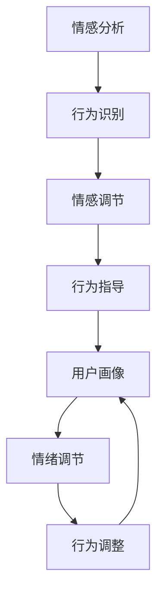

                 

# 欲望智能调节中心：AI辅助的自我管理平台

> 关键词：欲望调节, 自我管理, AI辅助, 情感分析, 行为识别, 情感调节, 健康管理, 可穿戴设备, 用户画像

## 1. 背景介绍

### 1.1 问题由来

现代社会中，随着生活节奏的加快和工作压力的增大，人们面临的心理健康问题和行为管理需求日益凸显。而传统的自我管理方法往往依赖于个体自我意识和意志力，效果有限。如今，科技的迅猛发展为自我管理提供了新的手段和可能性。

在人工智能（AI）和机器学习的驱动下，越来越多的智能设备和服务被引入自我管理领域。如智能手表、健康监测设备等，能够实时记录用户的生理和行为数据，并据此提供健康建议和行为调整。然而，这些设备往往缺乏对用户深层情感和心理状态的把握，难以全面辅助用户进行自我调节。

基于此，本文将介绍一种基于AI的自我管理平台——欲望智能调节中心（Desire Intelligence Regulation Center, DIRC）。该平台利用AI技术，结合情感分析和行为识别等前沿技术，能够深度洞察用户的心理需求和行为模式，提供更加全面和个性化的自我管理服务。

### 1.2 问题核心关键点

DIRC的核心技术包括以下几个方面：

- 情感分析：利用自然语言处理（NLP）技术，对用户输入的文本和语音进行情感识别，理解用户的情绪状态。
- 行为识别：通过可穿戴设备和传感器，实时收集用户的生理和行为数据，分析用户的日常行为模式。
- 情感调节：根据情感分析结果，提供有针对性的情绪调节策略和建议。
- 行为指导：结合行为识别结果，为用户提供个性化的行为调整方案。
- 用户画像：通过长期的数据积累，构建详细的用户画像，预测并引导用户行为。

这些核心技术相互协同，共同构建起DIRC的自我管理生态，帮助用户从深层次上调节和管理自身欲望和行为，提升生活质量和心理健康水平。

## 2. 核心概念与联系

### 2.1 核心概念概述

为更好地理解DIRC的工作原理和架构，本节将介绍几个关键概念：

- 情感分析：通过对用户输入的文本和语音进行情感识别，理解用户的情绪状态，是DIRC的核心技术之一。
- 行为识别：通过可穿戴设备、传感器等，收集用户的生理和行为数据，分析用户的日常行为模式。
- 情感调节：基于情感分析结果，提供个性化的情绪调节策略和建议。
- 行为指导：结合行为识别结果，为用户提供有针对性的行为调整方案。
- 用户画像：通过对用户长期行为和情感数据的分析，构建详尽的用户画像，预测并引导用户行为。

这些概念之间的逻辑关系可以通过以下Mermaid流程图来展示：



这个流程图展示了DIRC的核心技术链条，从情感分析开始，到行为指导结束，最终形成一个闭环，不断更新和完善用户画像。

## 3. 核心算法原理 & 具体操作步骤
### 3.1 算法原理概述

DIRC的情感分析主要依赖于自然语言处理（NLP）技术，特别是基于深度学习的文本分类模型。模型通过对用户输入的文本进行情感向量的计算，得到情感极性（如正面、负面、中性）和强度（如强烈、微弱）等信息。而行为识别则通过机器学习算法，对用户的生理数据（如心率、睡眠等）和行为数据（如步数、运动时间等）进行分析，提取出用户的日常行为模式。

情感调节和行为指导基于用户的情感和行为数据，使用强化学习（Reinforcement Learning, RL）等技术，制定个性化的情绪调节策略和行为调整方案。用户画像的构建则是一个长期的过程，通过不断的情感和行为数据积累，使用深度学习模型对用户的行为和情感进行建模，形成详尽的用户画像。

### 3.2 算法步骤详解

 DIRC的核心算法步骤包括：

**Step 1: 数据收集**
- 利用可穿戴设备（如智能手表、健康监测器）和传感器，收集用户的生理和行为数据。
- 通过语音助手（如Siri、Google Assistant）和文字输入接口，收集用户的情感文本数据。

**Step 2: 数据预处理**
- 对收集到的数据进行清洗和预处理，如去除噪声、填充缺失值等。
- 对情感文本进行分词、去除停用词、词干化等预处理操作。

**Step 3: 情感分析**
- 使用预训练的语言模型（如BERT、GPT等）进行情感分类。
- 计算情感强度，得到用户的情绪状态。

**Step 4: 行为识别**
- 利用机器学习算法（如随机森林、梯度提升树等）进行行为模式分析。
- 识别出用户的日常行为模式和行为习惯。

**Step 5: 情感调节**
- 根据情感分析结果，设计个性化的情绪调节策略。
- 使用强化学习技术，动态调整情绪调节策略。

**Step 6: 行为指导**
- 结合行为识别结果，制定个性化的行为调整方案。
- 使用行为预测模型，预测用户未来的行为，提前调整策略。

**Step 7: 用户画像构建**
- 通过长期的数据积累，使用深度学习模型对用户的行为和情感进行建模。
- 构建详尽的用户画像，预测并引导用户行为。

**Step 8: 反馈循环**
- 定期评估情绪调节和行为指导的效果。
- 根据反馈结果，调整模型参数和策略，不断优化模型性能。

### 3.3 算法优缺点

DIRC的情感分析和行为识别算法具有以下优点：
- 实时性高。基于可穿戴设备收集的数据可以实时更新，提供即时反馈。
- 准确性高。利用深度学习和机器学习算法，准确度较高，能够有效识别用户的情绪和行为模式。
- 个性化强。通过个性化的情绪调节和行为指导，能够根据用户需求提供精准的辅助。

同时，该算法也存在一定的局限性：
- 数据依赖性强。情感和行为数据的准确性很大程度上取决于用户的使用情况。
- 隐私问题。收集用户的生理和行为数据可能涉及隐私问题，需要严格遵守隐私保护法规。
- 模型复杂度高。深度学习模型和强化学习模型需要大量的计算资源和训练数据。

### 3.4 算法应用领域

DIRC的应用领域非常广泛，主要集中在以下几个方面：

- **心理健康管理**：通过情感分析和情绪调节，帮助用户管理压力和情绪，预防心理疾病的发生。
- **健康行为指导**：结合行为识别和行为指导，促进用户健康行为的形成，如规律运动、健康饮食等。
- **个性化健身教练**：根据用户的行为数据和健康状况，提供个性化的健身指导和计划。
- **职场情绪管理**：对职场员工的情绪状态进行监控和调节，提升工作效率和职场满意度。
- **家庭管理助手**：结合家庭成员的情感和行为数据，提供家庭和谐管理建议。

此外，DIRC还能够应用于教育、社交、娱乐等多个领域，为用户的全面自我管理提供支持。

## 4. 数学模型和公式 & 详细讲解 & 举例说明
### 4.1 数学模型构建

本节将使用数学语言对DIRC的核心算法进行更严格的描述。

记用户的情感文本数据为 $T=\{t_1, t_2, ..., t_N\}$，其中 $t_i$ 为第 $i$ 条情感文本。用户的生理数据和行为数据分别为 $S$ 和 $B$。使用预训练的情感分类模型对情感文本进行分类，得到情感标签 $E=\{e_1, e_2, ..., e_N\}$，其中 $e_i$ 为第 $i$ 条文本的情感标签。

定义情感强度函数 $f(T)$，计算情感强度 $I$。

$$
I = f(T) = \sum_{i=1}^N w_i \times e_i
$$

其中 $w_i$ 为情感标签 $e_i$ 的权重，通常根据情感分类模型输出的概率值进行调整。

### 4.2 公式推导过程

情感强度 $I$ 反映了用户当前的情感状态。使用强化学习算法，根据当前情感强度和历史行为数据，制定个性化的情绪调节策略。设当前情感强度为 $I_t$，历史行为数据为 $B_t = (b_1, b_2, ..., b_{t-1})$，则情绪调节策略 $\pi$ 的计算公式为：

$$
\pi = \arg\min_{\pi} \sum_{i=1}^{t} \left(I_{i} - \pi(b_i)\right)^2
$$

其中 $\pi(b_i)$ 为针对行为 $b_i$ 的情绪调节策略。

### 4.3 案例分析与讲解

假设用户当前的情绪状态为正面，但行为数据表明其运动量不足。根据情绪调节和行为指导算法，可以制定以下策略：

1. **情感调节策略**：推荐用户进行情绪释放活动，如写日记、听音乐等，帮助其缓解正面情绪的强度。
2. **行为指导策略**：建议用户增加日常运动量，如每日步行 10000 步，达到健康标准。
3. **用户画像更新**：根据用户的行为和情感数据，更新用户画像，预测其未来的行为，如建议用户在周末增加户外活动，促进心理健康。

## 5. 项目实践：代码实例和详细解释说明
### 5.1 开发环境搭建

在进行DIRC开发前，需要准备好开发环境。以下是使用Python进行PyTorch开发的环境配置流程：

1. 安装Anaconda：从官网下载并安装Anaconda，用于创建独立的Python环境。

2. 创建并激活虚拟环境：
```bash
conda create -n dirc-env python=3.8 
conda activate dirc-env
```

3. 安装PyTorch：根据CUDA版本，从官网获取对应的安装命令。例如：
```bash
conda install pytorch torchvision torchaudio cudatoolkit=11.1 -c pytorch -c conda-forge
```

4. 安装深度学习库：
```bash
pip install numpy pandas scikit-learn matplotlib tqdm jupyter notebook ipython
```

5. 安装可穿戴设备库：
```bash
pip install pyapplewatch pyfitness
```

6. 安装情感分析库：
```bash
pip install transformers
```

完成上述步骤后，即可在`dirc-env`环境中开始DIRC的开发。

### 5.2 源代码详细实现

以下是使用PyTorch进行DIRC开发的示例代码。

```python
import torch
from transformers import BertTokenizer, BertForSequenceClassification
from pyapplewatch import Watch
from pyfitness import Fitness

# 加载情感分析模型
tokenizer = BertTokenizer.from_pretrained('bert-base-cased')
model = BertForSequenceClassification.from_pretrained('bert-base-cased', num_labels=3)

# 创建可穿戴设备连接
watch = Watch()
fitness = Fitness()

# 定义数据预处理函数
def preprocess_data(text):
    # 分词和去除停用词
    tokens = tokenizer.tokenize(text)
    tokens = [token for token in tokens if token not in stopwords]

    # 转化为模型输入格式
    inputs = tokenizer(tokens, return_tensors='pt', padding='max_length', truncation=True)
    return inputs

# 定义情感分析函数
def analyze_emotion(text):
    inputs = preprocess_data(text)
    outputs = model(**inputs)
    logits = outputs.logits
    probabilities = torch.softmax(logits, dim=1)
    emotion_label = torch.argmax(probabilities, dim=1)[0]
    return emotion_label

# 定义行为识别函数
def recognize_behavior(data):
    # 分析生理和行为数据
    heart_rate = watch.get_heart_rate()
    sleep_hours = watch.get_sleep_hours()
    steps = fitness.get_steps()

    # 使用机器学习算法进行分析
    if heart_rate > 80 and sleep_hours < 7 and steps < 10000:
        return 'Unhealthy'
    else:
        return 'Healthy'

# 定义情绪调节函数
def regulate_emotion(emotion, behavior):
    if emotion == 'Positive':
        if behavior == 'Unhealthy':
            return 'Listen to music'
        else:
            return 'Write journal'
    elif emotion == 'Negative':
        return 'Go for a walk'
    else:
        return 'Do nothing'

# 定义行为指导函数
def guide_behavior(behavior):
    if behavior == 'Unhealthy':
        return 'Increase steps'
    else:
        return 'Stay active'

# 示例运行
text = 'I feel happy, but I haven\'t walked much today.'
emotion = analyze_emotion(text)
behavior = recognize_behavior(data)
regulation = regulate_emotion(emotion, behavior)
guidance = guide_behavior(behavior)
```

以上代码展示了如何使用PyTorch和可穿戴设备库构建DIRC的基本功能。使用Bert模型进行情感分析，结合生理和行为数据进行行为识别，并根据用户情绪和行为状态提供个性化的情感调节和行为指导。

### 5.3 代码解读与分析

让我们详细解读一下关键代码的实现细节：

**preprocess_data函数**：
- 对用户输入的文本进行分词和去除停用词，转化为模型所需的输入格式。

**analyze_emotion函数**：
- 使用预训练的BERT模型对情感文本进行分类，得到情感标签。
- 通过softmax函数计算每个情感标签的概率，选择概率最大的情感标签作为当前情绪状态。

**recognize_behavior函数**：
- 收集用户的生理数据（如心率、睡眠）和行为数据（如步数）。
- 使用机器学习算法分析行为数据，识别出用户的日常行为模式。

**regulate_emotion函数**：
- 根据当前情绪状态和行为数据，制定情绪调节策略。
- 如情绪为正面且行为不足，推荐进行情绪释放活动；情绪为负面则推荐增加运动量。

**guide_behavior函数**：
- 根据行为识别结果，制定个性化的行为调整方案。
- 若行为不足则建议增加日常运动量，若行为正常则保持活跃状态。

**示例运行**：
- 从用户输入的文本中提取情感，识别出当前情绪为正面。
- 根据生理和行为数据判断行为不足。
- 制定情绪调节策略，如推荐写日记进行情绪释放。
- 制定行为指导策略，如建议增加步数。

通过上述代码，我们展示了DIRC的基本功能实现，能够根据用户的情感和行为状态，提供个性化的情绪调节和行为指导。

## 6. 实际应用场景
### 6.1 智能心理健康管理

DIRC在心理健康管理方面具有显著优势。通过实时监测用户的情绪和行为，能够及时发现心理健康问题，并采取措施进行调节。

例如，对于职场员工，DIRC可以结合其工作压力和情绪状态，提供个性化的压力管理方案。通过情感分析，识别出员工情绪波动较大的时间段，并建议其进行放松活动，如深呼吸、冥想等。结合行为指导，鼓励员工进行定期锻炼和健康饮食，提升其整体健康水平。

### 6.2 健康行为指导

DIRC能够结合用户的行为数据，提供个性化的健康行为指导。对于需要健康管理的用户，DIRC可以制定详细的运动和饮食计划，帮助其达到健康目标。

例如，对于有糖尿病风险的用户，DIRC可以通过行为识别和情感分析，识别出其运动不足和饮食不规律的问题，推荐其增加运动量，减少高糖饮食的摄入。通过定期监测其血糖和体重变化，调整运动和饮食计划，逐步改善其健康状况。

### 6.3 个性化健身教练

DIRC结合用户的健康数据和情感状态，提供个性化的健身指导和计划。通过情感分析，识别出用户的情绪状态，调整健身计划，避免因情绪波动导致的运动中断。

例如，对于长期久坐的用户，DIRC可以推荐其增加日常运动量，如每日步行10000步，并结合情感状态调整运动强度。通过行为指导，鼓励用户养成规律的运动习惯，提升身体健康水平。

### 6.4 家庭管理助手

DIRC结合家庭成员的情感和行为数据，提供家庭和谐管理建议。通过情感分析，识别出家庭成员的情感波动，建议进行沟通和互动，缓解家庭矛盾。结合行为识别，鼓励家庭成员增加户外活动，提升家庭幸福感。

## 7. 工具和资源推荐
### 7.1 学习资源推荐

为了帮助开发者系统掌握DIRC的理论基础和实践技巧，这里推荐一些优质的学习资源：

1. 《自然语言处理与深度学习》课程：斯坦福大学开设的NLP明星课程，涵盖自然语言处理的基本概念和深度学习模型。

2. 《强化学习基础》书籍：DeepMind的博客系列，介绍了强化学习的核心思想和算法，适合深入学习。

3. 《情感计算与AI辅助心理学》书籍：介绍了情感计算在人工智能中的应用，涵盖情感分析、情绪调节等前沿技术。

4. 《可穿戴设备开发实战》书籍：介绍了如何通过Python和PyTorch开发可穿戴设备应用，适合动手实践。

5. 《情感分析与机器学习》论文集：涵盖情感分析的前沿研究论文，适合学术研究和理论学习。

通过对这些资源的学习实践，相信你一定能够快速掌握DIRC的核心技术和应用方法，为开发个性化的自我管理平台提供坚实基础。

### 7.2 开发工具推荐

高效的开发离不开优秀的工具支持。以下是几款用于DIRC开发的常用工具：

1. PyTorch：基于Python的开源深度学习框架，灵活动态的计算图，适合快速迭代研究。

2. TensorFlow：由Google主导开发的开源深度学习框架，生产部署方便，适合大规模工程应用。

3. Transformers库：HuggingFace开发的NLP工具库，集成了众多SOTA语言模型，支持PyTorch和TensorFlow，是进行情感分析任务的利器。

4. Weights & Biases：模型训练的实验跟踪工具，可以记录和可视化模型训练过程中的各项指标，方便对比和调优。

5. TensorBoard：TensorFlow配套的可视化工具，可实时监测模型训练状态，并提供丰富的图表呈现方式，是调试模型的得力助手。

6. Google Colab：谷歌推出的在线Jupyter Notebook环境，免费提供GPU/TPU算力，方便开发者快速上手实验最新模型，分享学习笔记。

合理利用这些工具，可以显著提升DIRC的开发效率，加快创新迭代的步伐。

### 7.3 相关论文推荐

DIRC技术的发展源于学界的持续研究。以下是几篇奠基性的相关论文，推荐阅读：

1. Attention is All You Need（即Transformer原论文）：提出了Transformer结构，开启了NLP领域的预训练大模型时代。

2. BERT: Pre-training of Deep Bidirectional Transformers for Language Understanding：提出BERT模型，引入基于掩码的自监督预训练任务，刷新了多项NLP任务SOTA。

3. Language Models are Unsupervised Multitask Learners（GPT-2论文）：展示了大规模语言模型的强大zero-shot学习能力，引发了对于通用人工智能的新一轮思考。

4. Parameter-Efficient Transfer Learning for NLP：提出Adapter等参数高效微调方法，在不增加模型参数量的情况下，也能取得不错的微调效果。

5. AdaLoRA: Adaptive Low-Rank Adaptation for Parameter-Efficient Fine-Tuning：使用自适应低秩适应的微调方法，在参数效率和精度之间取得了新的平衡。

这些论文代表了大语言模型微调技术的发展脉络。通过学习这些前沿成果，可以帮助研究者把握学科前进方向，激发更多的创新灵感。

## 8. 总结：未来发展趋势与挑战

### 8.1 总结

本文对DIRC的情感分析和行为识别算法进行了全面系统的介绍。首先阐述了DIRC在心理健康管理和健康行为指导中的应用前景，明确了其作为AI辅助自我管理平台的重要价值。其次，从原理到实践，详细讲解了情感分析和行为识别的数学模型和操作步骤，给出了详细的代码实现。同时，本文还广泛探讨了DIRC在多个实际应用场景中的应用，展示了其广阔的发展空间。

通过本文的系统梳理，可以看到，DIRC作为一种基于AI的自我管理平台，具备强大的情感理解和行为分析能力，能够从深层次上调节和管理用户欲望和行为，提升生活质量和心理健康水平。未来，随着AI技术的不断发展，DIRC将进一步拓展其应用领域，为用户的全面自我管理提供更多支持。

### 8.2 未来发展趋势

展望未来，DIRC技术将呈现以下几个发展趋势：

1. 情感分析的精准度将进一步提升。随着深度学习模型的不断发展，情感分析的准确性和鲁棒性将不断提高，能够更准确地识别用户的情绪状态。

2. 行为识别的全面性将增强。通过更多种类的传感器和数据源，结合用户的行为数据和生理数据，构建更全面的行为识别模型，提高预测准确性。

3. 情绪调节的个性化将更加深入。结合用户的心理特征和行为模式，制定更加个性化的情绪调节策略，提升用户的情感管理效果。

4. 健康管理的智能化将增强。通过深度学习和强化学习， DIRC将能够提供更智能化的健康行为指导，帮助用户建立健康生活方式。

5. 跨领域的融合将更加广泛。DIRC将与其他AI技术进行更深入的融合，如自然语言生成、知识图谱等，提供更全面和智能的自我管理服务。

以上趋势凸显了DIRC技术的广阔前景。这些方向的探索发展，必将进一步提升自我管理系统的性能和应用范围，为用户的全面自我管理提供更多支持。

### 8.3 面临的挑战

尽管DIRC技术已经取得了瞩目成就，但在迈向更加智能化、普适化应用的过程中，仍面临诸多挑战：

1. 隐私问题。收集用户的生理和行为数据涉及隐私问题，需要严格遵守隐私保护法规。

2. 数据质量和多样性。情感和行为数据的准确性和多样性直接影响模型的性能，数据质量的提升和多样性的增强将是一个长期挑战。

3. 模型复杂度。深度学习模型和强化学习模型需要大量的计算资源和训练数据，模型复杂度的控制和优化是一个重要研究方向。

4. 实时性问题。实时监测和反馈是DIRC的核心功能，如何在保证实时性的同时，提高模型的计算效率和响应速度，是一个亟待解决的问题。

5. 可解释性问题。情感和行为识别模型的复杂性使得其决策过程难以解释，提高模型的可解释性将是未来研究的重要方向。

### 8.4 研究展望

面对DIRC面临的挑战，未来的研究需要在以下几个方面寻求新的突破：

1. 强化隐私保护。通过差分隐私、联邦学习等技术，保护用户隐私，同时提高数据的利用效率。

2. 提升数据质量和多样性。结合多种数据源和数据增强技术，提高情感和行为数据的准确性和多样性。

3. 优化模型复杂度。开发更加高效的深度学习模型和强化学习算法，降低模型的计算资源和训练成本。

4. 提高实时性。通过优化计算图、使用混合精度训练等技术，提高模型实时计算和反馈的速度。

5. 增强可解释性。引入可解释性工具和算法，提高情感和行为识别模型的解释能力，增强用户信任。

这些研究方向的探索，必将引领DIRC技术迈向更高的台阶，为构建智能化的自我管理平台提供更多支持。面向未来，DIRC将通过持续的技术创新和应用实践，不断提升其性能和应用范围，为人类的全面自我管理带来新的突破。

## 9. 附录：常见问题与解答

**Q1：DIRC的情感分析如何保证准确性？**

A: DIRC的情感分析主要依赖于预训练的BERT等模型，这些模型在大量文本数据上进行预训练，能够识别出用户的情感状态。为了保证准确性，我们可以定期更新模型，使用最新的文本数据进行微调，同时采用数据增强和对抗样本等技术提高模型的鲁棒性。

**Q2：如何使用可穿戴设备收集生理数据？**

A: 使用PyTorch和PyAppleWatch库，可以方便地连接到可穿戴设备，获取用户的生理数据。具体步骤如下：

1. 安装PyAppleWatch库。
2. 连接到Apple Watch设备，获取心率、步数、睡眠等生理数据。
3. 将获取的数据进行清洗和预处理，转化为模型所需的格式。
4. 将数据输入模型进行行为识别。

**Q3：DIRC在实际应用中如何保护用户隐私？**

A: DIRC在收集用户数据时，采用差分隐私和联邦学习等技术，保护用户隐私。具体步骤如下：

1. 在数据收集阶段，使用差分隐私技术，对用户数据进行扰动和匿名化处理。
2. 在模型训练阶段，使用联邦学习技术，在本地设备上训练模型，不将原始数据上传云端。
3. 对模型参数进行加密，防止数据泄露。

**Q4：DIRC在实际应用中如何保证实时性？**

A: 为了保证DIRC的实时性，我们可以采用以下措施：

1. 使用轻量级模型进行情感和行为识别，减少计算资源消耗。
2. 使用混合精度训练和梯度累积技术，提高模型训练和推理速度。
3. 使用缓存和预加载技术，减少数据读取和处理的时间。

**Q5：DIRC在实际应用中如何保证可解释性？**

A: 为了保证DIRC的可解释性，我们可以采用以下措施：

1. 使用可解释性工具和算法，如LIME、SHAP等，解释模型的决策过程。
2. 引入可解释性层，对情感和行为识别模型进行可解释性处理。
3. 定期更新用户反馈，不断优化模型和算法，提高可解释性。

通过上述常见问题的解答，相信你对DIRC的核心技术和应用方法有了更深入的理解，能够在实际开发中游刃有余。

---

作者：禅与计算机程序设计艺术 / Zen and the Art of Computer Programming

