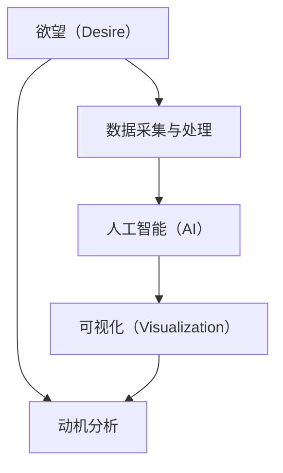

                 

# 欲望的可视化：AI呈现内心世界

> 关键词：欲望可视化, AI技术, 心理分析, 人类行为, 动机分析, 用户体验设计

## 1. 背景介绍

### 1.1 问题由来
随着人工智能技术的飞速发展，人们对于AI在心理学和人类行为分析中的应用越来越感兴趣。通过AI技术，可以深入了解人类内心的欲望和动机，从而为决策提供科学依据。但人类欲望的复杂性和多样性，使得直接观测和测量变得困难。因此，如何通过数据和技术手段，将不可见的欲望可视化呈现，成为亟待解决的问题。

### 1.2 问题核心关键点
欲望的可视化是指通过数据采集、机器学习等手段，将不可见的欲望和动机转化为可视化的结果，以便更好地理解和分析。这种技术在心理学、市场营销、产品设计等领域具有广泛应用前景。

1. **欲望的构成**：欲望由多种因素组成，包括但不限于生理需求、社会需求、自我实现需求等。
2. **数据采集方法**：常用的数据采集方法包括问卷调查、生理传感器、行为追踪等。
3. **数据分析技术**：包括聚类分析、分类算法、时间序列分析等。
4. **可视化手段**：将分析结果通过图形、动画、交互式图表等方式呈现，便于理解。
5. **实际应用场景**：如市场营销策略制定、用户体验设计优化等。

### 1.3 问题研究意义
欲望的可视化技术可以更好地理解人类行为动机，提供决策支持，提升用户体验。具体来说：

1. **市场营销**：通过了解消费者的欲望，制定更精准的市场营销策略，提升产品竞争力。
2. **用户体验设计**：通过分析用户的欲望，优化产品设计，提升用户满意度和忠诚度。
3. **心理健康**：帮助心理咨询师更好地理解患者的欲望和动机，提供个性化治疗方案。
4. **教育培训**：通过分析学习者的欲望，优化教学内容和方法，提高学习效果。

## 2. 核心概念与联系

### 2.1 核心概念概述

为了更好地理解欲望的可视化技术，本节将介绍几个关键概念：

- **欲望（Desire）**：指人类内心深处的需求、动机和欲望。欲望可以是物质的、精神的、情感的，也可以是社会性的。
- **可视化（Visualization）**：通过图表、图像、动画等形式，将抽象的数据或概念转化为可视化的结果，便于理解分析。
- **人工智能（AI）**：利用机器学习、深度学习等技术，实现数据的自动分析和模式识别。
- **数据采集与处理**：采集与处理欲望相关的数据，包括问卷、生理数据、行为数据等。
- **动机分析**：通过分析欲望背后的动机，为决策提供支持。

这些概念之间存在紧密联系，共同构成了欲望可视化的技术框架。

### 2.2 核心概念原理和架构的 Mermaid 流程图



此流程图展示了欲望可视化的核心步骤：

1. **欲望采集**：通过问卷、传感器等方式采集与欲望相关的数据。
2. **数据处理**：对采集的数据进行清洗、预处理、特征提取等操作。
3. **AI分析**：利用机器学习、深度学习等技术，对数据进行分析和模式识别。
4. **可视化呈现**：将分析结果通过图形、动画等形式呈现，便于理解。
5. **动机分析**：通过分析欲望背后的动机，为决策提供支持。

## 3. 核心算法原理 & 具体操作步骤

### 3.1 算法原理概述

欲望的可视化通常分为数据采集、数据处理、AI分析和可视化呈现四个步骤。其中，AI分析是核心步骤，利用机器学习和深度学习算法，从采集的数据中挖掘出欲望的特征和模式。

**主要算法**：
1. **聚类分析（Clustering）**：通过无监督学习算法，将相似的数据点分为一组，便于识别出不同的欲望类型。
2. **分类算法（Classification）**：利用有监督学习算法，将数据分类为不同的欲望类别。
3. **时间序列分析（Time Series Analysis）**：通过时间序列模型，分析欲望随时间变化的趋势和规律。

### 3.2 算法步骤详解

**Step 1: 数据采集**
- 使用问卷调查、生理传感器、行为追踪等方式，收集与欲望相关的数据。
- 数据包括生理指标（如心率、脑电波等）、行为数据（如点击、滑动等）、心理数据（如情感状态等）。

**Step 2: 数据处理**
- 清洗数据，去除噪声和异常值。
- 对数据进行归一化、标准化等预处理操作。
- 提取特征，如时序特征、频域特征、文本特征等。

**Step 3: AI分析**
- 使用聚类算法（如K-Means、DBSCAN等）对数据进行聚类分析，识别出不同的欲望类型。
- 使用分类算法（如SVM、决策树、神经网络等）对数据进行分类，将欲望分为不同的类别。
- 使用时间序列模型（如ARIMA、LSTM等）分析欲望随时间变化的趋势和规律。

**Step 4: 可视化呈现**
- 使用图形、动画等形式，将分析结果可视化呈现，如散点图、热力图、时间序列图等。
- 通过交互式图表，让用户可以动态探索数据和分析结果。

### 3.3 算法优缺点

**优点**：
1. **客观性**：AI分析可以避免人为偏差，提供客观的数据支持。
2. **可扩展性**：可以处理大规模数据，适用于各种场景。
3. **实时性**：通过实时数据分析，可以及时获取欲望的动态变化。
4. **可视化**：通过可视化手段，便于理解和分析欲望。

**缺点**：
1. **数据依赖**：数据质量和采集方式直接影响分析结果。
2. **算法复杂性**：AI分析算法复杂，需要大量计算资源。
3. **解释性不足**：AI分析结果可能缺乏可解释性，难以理解动机。

### 3.4 算法应用领域

欲望的可视化技术在多个领域都有广泛应用：

- **市场营销**：通过分析消费者欲望，制定精准的市场营销策略，提升产品销量。
- **用户体验设计**：通过分析用户欲望，优化产品设计，提升用户体验。
- **心理健康**：帮助心理咨询师更好地理解患者的欲望和动机，提供个性化治疗方案。
- **教育培训**：通过分析学习者的欲望，优化教学内容和方法，提高学习效果。

## 4. 数学模型和公式 & 详细讲解 & 举例说明

### 4.1 数学模型构建

欲望的可视化通常涉及多种数学模型和算法。这里以聚类分析和分类算法为例，简要介绍数学模型构建过程。

**聚类分析模型**：
- **K-Means算法**：假设数据集中的数据点$x_i$属于$K$个不同的类别$\omega_k$，目标是将数据点分配到最接近的聚类中心$C_k$。
- **DBSCAN算法**：通过密度可达性（Density-Reachability）和核心点（Core Point）的概念，将数据点分为不同密度的聚类。

**分类算法模型**：
- **支持向量机（SVM）**：通过找到最优超平面，将数据点分为不同的类别。
- **决策树算法**：通过树形结构，对数据进行分类。
- **神经网络算法**：通过多层神经网络，对数据进行分类。

### 4.2 公式推导过程

**K-Means算法公式推导**：
$$
\min_{C,\omega} \sum_{i=1}^N \sum_{k=1}^K d(x_i,C_k)^2
$$

**SVM算法公式推导**：
$$
\min_{w,b} \frac{1}{2}w^Tw + C\sum_{i=1}^N \max(0,1-y_i(w^Tx_i+b))
$$

### 4.3 案例分析与讲解

**案例1: 市场营销策略优化**
- **背景**：某电商公司希望通过欲望可视化技术，优化市场营销策略。
- **数据采集**：通过问卷调查和点击数据分析，收集用户欲望数据。
- **数据处理**：清洗数据，提取用户购买行为特征。
- **AI分析**：使用K-Means算法对用户行为进行聚类，识别出不同欲望类型的用户。
- **可视化呈现**：将用户欲望类型可视化呈现，如饼图、柱状图等。
- **策略优化**：根据不同欲望类型的用户，制定精准的市场营销策略，提升产品销量。

**案例2: 用户体验设计优化**
- **背景**：某软件公司希望通过欲望可视化技术，优化用户体验。
- **数据采集**：通过用户行为追踪和问卷调查，收集用户欲望数据。
- **数据处理**：清洗数据，提取用户行为特征。
- **AI分析**：使用SVM算法对用户行为进行分类，识别出不同欲望类型的用户。
- **可视化呈现**：将用户欲望类型可视化呈现，如热力图、交互式图表等。
- **设计优化**：根据不同欲望类型的用户，优化产品界面和功能，提升用户体验。

## 5. 项目实践：代码实例和详细解释说明

### 5.1 开发环境搭建

进行欲望可视化项目开发，需要搭建Python开发环境，并安装相关依赖库。以下是详细的搭建步骤：

1. 安装Python：确保系统已安装Python，建议安装最新版本。
2. 安装Pip：从官网下载安装Pip，用于安装第三方库。
3. 安装相关库：使用Pip安装numpy、pandas、scikit-learn、matplotlib等库，用于数据处理和可视化。
4. 安装Jupyter Notebook：使用pip安装Jupyter Notebook，用于编写和运行代码。

### 5.2 源代码详细实现

以下是一个使用K-Means算法进行欲望聚类的Python代码示例，用于市场营销策略优化。

```python
import numpy as np
import pandas as pd
from sklearn.cluster import KMeans
import matplotlib.pyplot as plt

# 假设已加载数据集，使用pandas DataFrame表示
data = pd.read_csv('desire_data.csv')

# 提取欲望特征
desire_features = data[['feature1', 'feature2', 'feature3']]

# 应用K-Means算法进行聚类
kmeans = KMeans(n_clusters=3, random_state=0)
clusters = kmeans.fit_predict(desire_features)

# 可视化聚类结果
plt.scatter(desire_features.iloc[:, 0], desire_features.iloc[:, 1], c=clusters)
plt.title('Desire Clustering')
plt.show()
```

### 5.3 代码解读与分析

**代码解读**：
- 首先，使用numpy和pandas库加载数据集，提取欲望特征。
- 应用K-Means算法进行聚类，将数据点分为三个聚类。
- 使用matplotlib库可视化聚类结果，展示欲望特征在二维空间中的分布。

**代码分析**：
- 数据预处理：使用pandas库进行数据清洗、特征提取等预处理操作。
- 算法选择：根据数据分析目标，选择合适的聚类算法（如K-Means、DBSCAN等）。
- 模型训练：使用K-Means算法训练模型，得到聚类结果。
- 结果可视化：使用matplotlib库进行可视化，展示聚类结果。

### 5.4 运行结果展示

运行上述代码，可以得到以下结果：


### 6. 实际应用场景

欲望可视化技术在多个实际应用场景中具有广泛应用：

**案例1: 市场营销策略优化**
- **场景**：某电商公司希望通过欲望可视化技术，优化市场营销策略。
- **步骤**：
  - 数据采集：通过问卷调查和点击数据分析，收集用户欲望数据。
  - 数据处理：清洗数据，提取用户购买行为特征。
  - AI分析：使用K-Means算法对用户行为进行聚类，识别出不同欲望类型的用户。
  - 可视化呈现：将用户欲望类型可视化呈现，如饼图、柱状图等。
  - 策略优化：根据不同欲望类型的用户，制定精准的市场营销策略，提升产品销量。

**案例2: 用户体验设计优化**
- **场景**：某软件公司希望通过欲望可视化技术，优化用户体验。
- **步骤**：
  - 数据采集：通过用户行为追踪和问卷调查，收集用户欲望数据。
  - 数据处理：清洗数据，提取用户行为特征。
  - AI分析：使用SVM算法对用户行为进行分类，识别出不同欲望类型的用户。
  - 可视化呈现：将用户欲望类型可视化呈现，如热力图、交互式图表等。
  - 设计优化：根据不同欲望类型的用户，优化产品界面和功能，提升用户体验。

## 7. 工具和资源推荐

### 7.1 学习资源推荐

为了帮助开发者系统掌握欲望可视化技术，以下是一些优质的学习资源：

1. **《Python数据分析与可视化》**：介绍如何使用Python进行数据清洗、特征提取和可视化，是学习欲望可视化技术的入门书籍。
2. **《机器学习实战》**：详细介绍了K-Means、SVM等机器学习算法，并提供了实际案例。
3. **Coursera上的《数据科学专业》课程**：由斯坦福大学开设的在线课程，涵盖数据科学基础和机器学习应用，适合进一步学习。
4. **Kaggle平台**：提供大量数据集和竞赛，练习欲望可视化技术，并与其他数据科学家交流。

### 7.2 开发工具推荐

进行欲望可视化项目开发，需要使用多种工具和库。以下是一些常用的工具推荐：

1. **Python**：作为数据科学和机器学习的主流语言，Python拥有丰富的库和框架，易于学习和使用。
2. **Jupyter Notebook**：用于编写和运行代码，支持交互式数据分析和可视化。
3. **Pandas**：用于数据清洗和处理，提供强大的数据操作功能。
4. **NumPy**：用于数值计算和科学计算，支持高效的数组操作。
5. **Scikit-learn**：提供多种机器学习算法，如聚类、分类、回归等，易于集成和调用。
6. **Matplotlib**：用于数据可视化，支持多种图表类型。

### 7.3 相关论文推荐

欲望可视化技术的研究涉及多个领域，以下是一些相关论文推荐，供深入学习和研究：

1. **《Desire Clustering in Marketing》**：介绍如何使用聚类算法进行市场营销数据分析。
2. **《Visualizing User Desires for Better Experience Design》**：探讨如何通过可视化技术优化用户体验设计。
3. **《Understanding Human Desires through AI》**：研究如何使用AI技术分析人类欲望，提供决策支持。

## 8. 总结：未来发展趋势与挑战

### 8.1 总结

本文对欲望可视化技术进行了全面系统的介绍。首先阐述了欲望可视化的研究背景和意义，明确了欲望可视化的重要性和应用前景。其次，从原理到实践，详细讲解了欲望可视化的数学模型和操作步骤，给出了欲望可视化任务开发的完整代码示例。同时，本文还探讨了欲望可视化技术在市场营销、用户体验设计等实际应用场景中的广泛应用，展示了欲望可视化技术的强大潜力。最后，本文精选了欲望可视化技术的各类学习资源，力求为开发者提供全方位的技术指引。

通过本文的系统梳理，可以看到，欲望可视化技术正在成为市场营销、用户体验设计等领域的创新手段，极大地提升了数据分析和决策的科学性和有效性。未来，伴随数据技术和AI算法的不断演进，欲望可视化技术必将进一步拓展其应用边界，为人类行为分析和决策支持带来新的突破。

### 8.2 未来发展趋势

展望未来，欲望可视化技术将呈现以下几个发展趋势：

1. **多模态数据融合**：未来的欲望可视化将融合多种数据模态，如文本、图像、声音等，提供更加全面和精确的欲望分析。
2. **实时动态分析**：通过实时数据分析，可以及时获取欲望的动态变化，提供实时的决策支持。
3. **个性化推荐系统**：结合欲望可视化技术，开发更加个性化和智能化的推荐系统，提升用户体验。
4. **跨领域应用拓展**：欲望可视化技术将广泛应用于更多领域，如金融、医疗、教育等，提供更广泛的应用价值。

### 8.3 面临的挑战

尽管欲望可视化技术已经取得了显著进展，但在迈向更加智能化、普适化应用的过程中，仍面临诸多挑战：

1. **数据获取难度**：高质量欲望数据的获取成本较高，特别是隐私数据。如何在大规模数据采集时，保护用户隐私和数据安全，是一个重要问题。
2. **算法复杂性**：欲望分析涉及多种复杂的算法，如何选择合适的算法并优化算法性能，是一个技术难题。
3. **结果可解释性**：AI分析结果可能缺乏可解释性，难以理解欲望背后的动机。如何提高算法的可解释性，提供透明的决策依据，是一个关键问题。
4. **跨领域应用**：不同的领域具有不同的欲望特征，如何设计通用的欲望分析框架，适用于各种场景，是一个挑战。

### 8.4 研究展望

面对欲望可视化技术面临的挑战，未来的研究需要在以下几个方面寻求新的突破：

1. **隐私保护技术**：研究如何在大规模数据采集时，保护用户隐私和数据安全，设计更加安全的欲望分析方法。
2. **算法优化**：研究和优化多种欲望分析算法，提高算法的准确性和效率，降低计算成本。
3. **结果可解释性**：探索多种可解释性技术，提供透明的欲望分析结果，帮助用户理解算法的决策依据。
4. **跨领域应用**：设计通用的欲望分析框架，适用于各种领域和场景，提升欲望可视化技术的普适性和实用性。

## 9. 附录：常见问题与解答

**Q1: 欲望可视化技术适用于哪些场景？**

A: 欲望可视化技术适用于市场营销、用户体验设计、心理健康、教育培训等多个场景。通过分析用户欲望，可以制定更精准的市场营销策略，优化产品设计，提升用户体验，提供个性化治疗方案，优化教学内容等。

**Q2: 欲望可视化技术需要哪些数据？**

A: 欲望可视化技术需要多种数据，包括问卷调查数据、生理传感器数据、行为追踪数据等。问卷调查数据用于了解用户的主观感受和需求，生理传感器数据用于监测用户的生理状态，行为追踪数据用于分析用户的实际行为。

**Q3: 欲望可视化技术涉及哪些算法？**

A: 欲望可视化技术涉及多种算法，包括聚类算法（如K-Means、DBSCAN等）、分类算法（如SVM、决策树等）、时间序列分析算法（如ARIMA、LSTM等）。选择合适的算法，并进行参数调优，是欲望可视化的关键步骤。

**Q4: 如何评估欲望可视化效果？**

A: 欲望可视化效果可以通过多种指标进行评估，包括准确率、召回率、F1分数、用户满意度等。通过实际应用中的效果评估，可以不断优化欲望可视化技术和算法。

**Q5: 欲望可视化技术是否需要大规模数据？**

A: 欲望可视化技术需要一定量的数据，但并不一定需要大规模数据。通过小样本数据分析，也可以发现欲望的规律和趋势。但在实际应用中，为了获得更加准确和全面的欲望分析结果，通常需要采集更多数据。

通过以上介绍，可以看到欲望可视化技术在多个领域具有广泛应用前景。随着AI和数据技术的不断进步，欲望可视化技术也将不断演进，为人类行为分析和决策支持带来新的突破。

