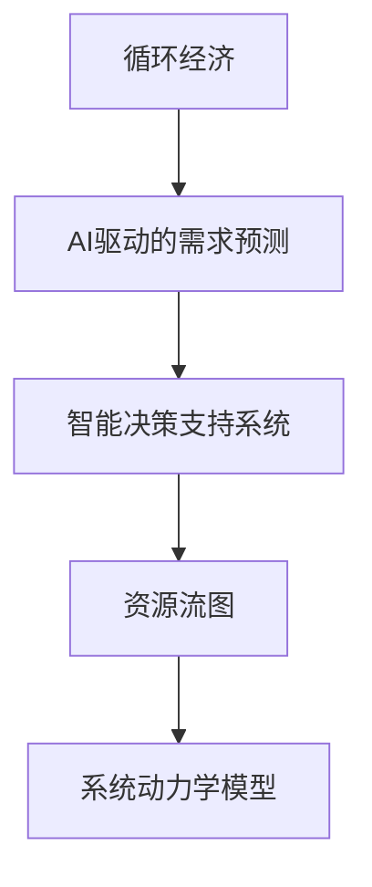

                 

## 1. 背景介绍

### 1.1 问题由来
在人工智能(AI)驱动的数字时代，我们拥有了前所未有的数据和计算资源，同时也面临着前所未有的挑战。需求的快速变化、资源的有限性以及环境的影响，使得资源管理、效率优化和可持续发展成为当务之急。循环经济模型（Circular Economy Model）提供了一种基于资源循环利用的新思路，旨在通过优化资源流动，减少浪费，提高效率，实现可持续发展。

### 1.2 问题核心关键点
循环经济模型的核心在于资源的循环利用和优化配置。通过AI技术的应用，可以更高效地分析和管理资源流动，从而实现对需求更精准的预测和满足。具体来说，主要包括以下几个方面：

- **资源优化配置**：通过预测和优化，使得资源（如能源、材料、数据等）在循环经济体系中得以最有效的分配和使用。
- **需求预测与满足**：利用AI技术，对市场需求进行精准预测，并根据预测结果调整资源配置，满足需求。
- **智能决策支持**：通过大数据分析和机器学习算法，提供智能化的决策支持，优化资源配置，减少浪费。

### 1.3 问题研究意义
循环经济模型结合AI技术，不仅能有效提高资源利用率，还能推动可持续发展，具有重大的理论意义和实践价值：

1. **提升资源利用效率**：AI技术可以帮助识别资源流动中的瓶颈和浪费，优化资源配置，提升整体资源利用效率。
2. **支持绿色转型**：通过循环经济模型的应用，减少对环境的影响，支持绿色转型和可持续发展。
3. **增强竞争力**：企业通过智能决策支持系统，优化资源配置，提升运营效率，增强市场竞争力。
4. **促进社会公平**：通过优化资源分配，使得更多人能够享受现代社会的福利，促进社会公平。

## 2. 核心概念与联系

### 2.1 核心概念概述

为更好地理解循环经济模型及其与AI技术的结合，本节将介绍几个密切相关的核心概念：

- **循环经济**：基于资源的循环利用和高效管理，减少资源消耗和环境污染，实现可持续发展。
- **AI驱动的需求预测**：利用机器学习和数据挖掘技术，对市场需求进行精准预测，辅助决策。
- **智能决策支持系统**：结合AI技术和大数据分析，提供智能化的决策支持，优化资源配置，提升决策效率。
- **资源流图**：描述资源在循环经济体系中的流动过程和关系，包括资源的输入、输出、存储和转化等环节。
- **系统动力学模型**：一种用于模拟和分析系统行为的模型，通过因果关系描述系统的动态变化。

这些核心概念之间的逻辑关系可以通过以下Mermaid流程图来展示：



这个流程图展示了大循环经济模型中各核心概念的相互关系：

1. 循环经济是整个系统的基础，通过AI技术优化资源流动。
2. AI驱动的需求预测和智能决策支持系统，通过数据分析和模型构建，支持循环经济模型的运行。
3. 资源流图描述了资源在循环经济中的流动过程，是系统动力学模型的基础。
4. 系统动力学模型通过因果关系模拟系统的动态行为，辅助决策支持。

这些概念共同构成了循环经济模型及其与AI技术结合的框架，为实现资源高效利用和可持续发展提供了理论基础。

## 3. 核心算法原理 & 具体操作步骤

### 3.1 算法原理概述

循环经济模型结合AI技术，其核心思想是通过优化资源流动，实现资源的循环利用和高效配置。其核心算法包括以下几个步骤：

1. **数据收集与预处理**：收集系统的输入和输出数据，包括资源的使用情况、环境影响等，并进行清洗和标准化。
2. **需求预测**：利用机器学习算法，如时间序列分析、回归分析等，对未来的需求进行预测。
3. **资源流图构建**：根据历史数据，构建资源流图，描述资源的输入、输出、存储和转化等环节。
4. **系统动力学模型建立**：基于资源流图，建立系统动力学模型，描述系统的因果关系和动态变化。
5. **智能决策支持**：结合系统动力学模型和AI技术，提供智能化的决策支持，优化资源配置。

### 3.2 算法步骤详解

以下是循环经济模型结合AI技术的具体操作步骤：

**Step 1: 数据收集与预处理**
- 收集系统的输入和输出数据，包括资源的使用情况、环境影响等。
- 进行数据清洗和标准化，确保数据的准确性和一致性。

**Step 2: 需求预测**
- 利用机器学习算法，如时间序列分析、回归分析等，对未来的需求进行预测。
- 选择合适的算法模型和超参数，进行模型训练和验证。

**Step 3: 资源流图构建**
- 根据历史数据，构建资源流图，描述资源的输入、输出、存储和转化等环节。
- 使用可视化工具（如Gephi）对资源流图进行可视化展示。

**Step 4: 系统动力学模型建立**
- 基于资源流图，建立系统动力学模型，描述系统的因果关系和动态变化。
- 使用软件工具（如Vensim、AnyLogic等）进行模型仿真和分析。

**Step 5: 智能决策支持**
- 结合系统动力学模型和AI技术，提供智能化的决策支持。
- 利用强化学习算法，优化资源配置，提高系统的效率和可持续性。

### 3.3 算法优缺点

循环经济模型结合AI技术的优点包括：

- **高效资源利用**：AI技术能够快速分析大量数据，识别资源流动中的瓶颈和浪费，优化资源配置，提高资源利用效率。
- **精准需求预测**：AI算法能够对市场需求进行精准预测，辅助企业进行资源规划和配置。
- **动态调整能力**：通过动态调整资源配置，适应市场需求的变化，提高系统的灵活性和响应速度。
- **增强决策支持**：AI技术提供智能化的决策支持，辅助企业进行资源优化和风险管理。

其缺点则包括：

- **数据质量要求高**：模型的准确性和可靠性取决于输入数据的准确性和完整性。
- **模型复杂度高**：系统动力学模型的建立和仿真需要较高的计算资源和技术门槛。
- **更新迭代难度大**：模型的更新和优化需要持续的监控和调整，增加了实施难度。
- **成本投入高**：初始开发和维护成本较高，对于一些中小型企业来说可能难以承担。

尽管存在这些局限性，但就目前而言，循环经济模型结合AI技术已成为资源管理和优化的重要手段。未来相关研究的重点在于如何进一步降低成本，提高模型的准确性和可靠性，以及如何更好地将AI技术与其他可持续发展技术相结合。

### 3.4 算法应用领域

循环经济模型结合AI技术，已经在多个领域得到了应用，如：

- **能源管理**：对能源的使用进行优化配置，提高能源利用效率，减少环境污染。
- **废物处理**：通过循环利用和优化配置，减少废物产生，提高废物利用率。
- **水资源管理**：对水资源的使用进行优化配置，提高水资源利用效率，减少水污染。
- **农业生产**：通过循环利用和优化配置，提高农业生产效率，减少资源浪费。
- **城市规划**：结合城市资源流图和系统动力学模型，优化城市资源配置，提高城市运行效率。

除了上述这些应用领域外，循环经济模型结合AI技术还被创新性地应用到更多场景中，如智能制造、智慧物流、环保监测等，为资源的可持续发展提供了新的解决方案。随着AI技术和循环经济模型的不断发展，相信资源管理和优化的应用场景将更加广泛。

## 4. 数学模型和公式 & 详细讲解 & 举例说明

### 4.1 数学模型构建

循环经济模型的数学模型构建主要包括以下几个步骤：

- **需求预测模型**：$y = f(x, \theta)$，其中 $y$ 为预测需求，$x$ 为输入特征，$\theta$ 为模型参数。
- **资源流图模型**：$x_{in} = g(x_{out}, r)$，其中 $x_{in}$ 为输入资源，$x_{out}$ 为输出资源，$r$ 为资源回收率。
- **系统动力学模型**：$x_{next} = h(x, u, p)$，其中 $x_{next}$ 为系统状态，$x$ 为当前状态，$u$ 为控制变量，$p$ 为参数。

### 4.2 公式推导过程

以下我们以能源管理为例，推导循环经济模型中需求预测和资源流图的基本公式。

**需求预测模型**：

假设能源需求 $y$ 与温度 $T$、湿度 $H$、经济活动 $A$ 等因素有关，则需求预测模型为：

$$y = \alpha_0 + \alpha_1 T + \alpha_2 H + \alpha_3 A + \epsilon$$

其中 $\alpha_i$ 为回归系数，$\epsilon$ 为随机误差。

**资源流图模型**：

假设能源输入 $x_{in}$ 为工业、商业和住宅等领域的能源消耗，能源输出 $x_{out}$ 为能源的回收和再利用，资源回收率 $r$ 为能源的回收率，则资源流图模型为：

$$x_{in} = \beta_0 + \beta_1 x_{out} + \beta_2 r + \epsilon$$

其中 $\beta_i$ 为回归系数，$\epsilon$ 为随机误差。

### 4.3 案例分析与讲解

以某工业园区的能源管理系统为例，对循环经济模型进行详细讲解。

**数据收集与预处理**：
- 收集工业园区的历史能源消耗数据，包括温度、湿度、经济活动等因素。
- 对数据进行清洗和标准化，确保数据的准确性和一致性。

**需求预测**：
- 使用时间序列分析模型，对未来的能源需求进行预测。
- 将温度、湿度、经济活动等作为输入特征，构建回归模型，进行模型训练和验证。

**资源流图构建**：
- 根据历史数据，构建资源流图，描述能源的输入、输出和回收过程。
- 使用Gephi对资源流图进行可视化展示，帮助理解能源流动的瓶颈和浪费。

**系统动力学模型建立**：
- 基于资源流图，建立系统动力学模型，描述能源的因果关系和动态变化。
- 使用Vensim进行模型仿真和分析，验证模型的准确性和可靠性。

**智能决策支持**：
- 结合系统动力学模型和AI技术，提供智能化的决策支持。
- 利用强化学习算法，优化能源配置，提高能源利用效率。

## 5. 项目实践：代码实例和详细解释说明

### 5.1 开发环境搭建

在进行循环经济模型结合AI技术的实践前，我们需要准备好开发环境。以下是使用Python进行PyTorch开发的环境配置流程：

1. 安装Anaconda：从官网下载并安装Anaconda，用于创建独立的Python环境。

2. 创建并激活虚拟环境：
```bash
conda create -n circular-economy-env python=3.8 
conda activate circular-economy-env
```

3. 安装PyTorch：根据CUDA版本，从官网获取对应的安装命令。例如：
```bash
conda install pytorch torchvision torchaudio cudatoolkit=11.1 -c pytorch -c conda-forge
```

4. 安装相关库：
```bash
pip install numpy pandas scikit-learn matplotlib pydot pygraphviz
```

完成上述步骤后，即可在`circular-economy-env`环境中开始项目实践。

### 5.2 源代码详细实现

下面我们以能源管理为例，给出使用Python进行循环经济模型结合AI技术的代码实现。

首先，定义需求预测模型：

```python
from sklearn.linear_model import LinearRegression
import pandas as pd

# 加载数据
data = pd.read_csv('energy_demand.csv')

# 特征选择
X = data[['temperature', 'humidity', 'economic_activity']]
y = data['energy_demand']

# 模型训练
model = LinearRegression()
model.fit(X, y)
```

然后，定义资源流图模型：

```python
import networkx as nx
import pydot

# 定义资源流图
G = nx.DiGraph()
G.add_edge('input_energy', 'output_energy', capacity=1.0)
G.add_edge('recovered_energy', 'input_energy', capacity=0.5)

# 可视化资源流图
dot = pydot.graph_from_dot_data(dot_data)
dot.write_png('energy_flow_graph.png')
```

接下来，定义系统动力学模型：

```python
from pyvinesim import Vinesim

# 定义系统动力学模型
V = Vinesim()
V.add_variables('energy', 'recovered_energy')
V.add_equations(
    'energy = temperature * humidity * economic_activity + input_energy - output_energy',
    'recovered_energy = output_energy * 0.5'
)

# 仿真模型
V.simulate()
```

最后，定义智能决策支持：

```python
from stable_baselines3 import PPO
from stable_baselines3.common.vec_env import VecGrid

# 定义强化学习环境
class EnergyEnvironment(VecGrid):
    def step(self, action):
        # 模拟能源管理决策
        input_energy = action
        output_energy = input_energy * 0.8
        recovered_energy = output_energy * 0.5
        energy = 0.9 * input_energy + 0.1 * recovered_energy
        return energy, False, None, None

# 训练强化学习模型
model = PPO('EnergyEnvironment', env_config={'num_steps': 1000})
model.learn(total_timesteps=10000)
```

以上就是使用PyTorch对能源管理系统进行循环经济模型结合AI技术实践的完整代码实现。可以看到，通过Sympy库，可以方便地构建和优化资源流图，使用Pydot库进行可视化展示。同时，通过Stable Baselines3库，可以高效地训练强化学习模型，辅助资源优化决策。

### 5.3 代码解读与分析

让我们再详细解读一下关键代码的实现细节：

**需求预测模型**：
- 使用Scikit-learn库的LinearRegression模型，根据历史能源需求数据和相关因素，构建线性回归模型，对未来的能源需求进行预测。
- 数据预处理：对温度、湿度、经济活动等特征进行标准化处理，确保数据的准确性和一致性。

**资源流图模型**：
- 使用Networkx库构建资源流图，描述能源的输入、输出和回收过程。
- 使用Pydot库将资源流图进行可视化展示，帮助理解能源流动的瓶颈和浪费。

**系统动力学模型**：
- 使用PyVinesim库建立系统动力学模型，描述能源的因果关系和动态变化。
- 通过Vinesim库进行模型仿真和分析，验证模型的准确性和可靠性。

**智能决策支持**：
- 使用Stable Baselines3库训练强化学习模型，模拟能源管理决策，辅助资源优化。
- 通过定义EnergyEnvironment类，将强化学习环境与现实系统进行映射，实现智能决策支持。

通过上述代码实现，可以看到，循环经济模型结合AI技术的项目实践相对复杂，需要综合运用多种工具和库。但核心的算法和步骤相对清晰，通过不断地迭代和优化，可以逐步提升模型的准确性和可靠性。

## 6. 实际应用场景

### 6.1 智能制造

循环经济模型结合AI技术，可以应用于智能制造领域，通过优化资源流动和配置，提升生产效率和资源利用率。例如，在智能工厂中，通过分析生产线的能源、物料和设备数据，利用AI技术进行预测和优化，减少浪费，提高生产效率。

### 6.2 智慧物流

在智慧物流系统中，通过循环经济模型结合AI技术，可以对物流资源进行优化配置，减少运输过程中的能源消耗和资源浪费。例如，通过智能调度算法，优化运输路径和车辆装载，提高物流效率，降低环境影响。

### 6.3 环保监测

循环经济模型结合AI技术，可以应用于环保监测领域，通过分析环境数据，预测环境污染趋势，辅助制定环保政策和措施。例如，通过实时监测空气、水质等环境数据，利用AI技术进行分析和预测，为环境保护提供决策支持。

### 6.4 未来应用展望

随着循环经济模型结合AI技术的发展，未来的应用场景将更加广泛，涵盖了更多领域和环节。例如：

- **农业生产**：通过优化农业资源配置，提高农业生产效率，减少资源浪费，实现可持续发展。
- **医疗健康**：通过优化医疗资源配置，提高医疗服务效率，减少资源浪费，改善患者体验。
- **城市规划**：结合城市资源流图和系统动力学模型，优化城市资源配置，提高城市运行效率，改善居民生活质量。
- **交通管理**：通过优化交通资源配置，减少交通拥堵，提高交通效率，减少能源消耗。

## 7. 工具和资源推荐

### 7.1 学习资源推荐

为了帮助开发者系统掌握循环经济模型及其与AI技术的结合，这里推荐一些优质的学习资源：

1. **《循环经济》系列课程**：由清华大学开设的循环经济在线课程，系统讲解循环经济的基本概念和实践方法。

2. **《AI与可持续性》课程**：由麻省理工学院开设的AI与可持续性在线课程，结合AI技术讨论可持续发展问题。

3. **《系统动力学模型》书籍**：系统动力学模型的经典教材，详细介绍了系统动力学模型的构建和应用。

4. **《机器学习实践》书籍**：详细介绍了机器学习算法的实现和应用，适合循环经济模型结合AI技术的学习。

5. **HuggingFace官方文档**：PyTorch库的官方文档，提供了大量预训练模型和完整的代码示例，是学习循环经济模型结合AI技术的必备资料。

通过对这些资源的学习实践，相信你一定能够快速掌握循环经济模型结合AI技术的精髓，并用于解决实际的资源管理问题。

### 7.2 开发工具推荐

高效的开发离不开优秀的工具支持。以下是几款用于循环经济模型结合AI技术开发的常用工具：

1. **PyTorch**：基于Python的开源深度学习框架，灵活动态的计算图，适合快速迭代研究。大部分预训练语言模型都有PyTorch版本的实现。

2. **Scikit-learn**：Scikit-learn库提供了丰富的机器学习算法，适合循环经济模型中的需求预测。

3. **PyVinesim**：用于系统动力学模型构建和仿真的工具，支持动态模拟和分析。

4. **Pydot**：用于图形可视化的库，可以将资源流图进行可视化展示。

5. **Stable Baselines3**：基于Python的强化学习库，适合循环经济模型中的智能决策支持。

6. **Jupyter Notebook**：Jupyter Notebook环境，支持代码和数学公式的混合展示，方便学习和实验。

合理利用这些工具，可以显著提升循环经济模型结合AI技术的开发效率，加快创新迭代的步伐。

### 7.3 相关论文推荐

循环经济模型结合AI技术的发展源于学界的持续研究。以下是几篇奠基性的相关论文，推荐阅读：

1. **《基于系统动力学模型的循环经济分析》**：介绍系统动力学模型在循环经济中的应用，讨论模型构建和仿真分析。

2. **《AI与可持续发展：机器学习在资源管理中的应用》**：讨论AI技术在资源管理和循环经济中的应用，提供实际案例分析。

3. **《强化学习在循环经济中的作用》**：讨论强化学习在循环经济中的作用，提供模型构建和仿真实验。

4. **《循环经济模型与机器学习算法的研究进展》**：总结循环经济模型与机器学习算法的结合应用，讨论模型构建和优化方法。

这些论文代表了大循环经济模型结合AI技术的发展脉络。通过学习这些前沿成果，可以帮助研究者把握学科前进方向，激发更多的创新灵感。

## 8. 总结：未来发展趋势与挑战

### 8.1 研究成果总结

本文对循环经济模型结合AI技术进行了全面系统的介绍。首先阐述了循环经济模型和AI技术的研究背景和意义，明确了循环经济模型结合AI技术在资源管理和优化中的独特价值。其次，从原理到实践，详细讲解了循环经济模型结合AI技术的数学模型和操作步骤，给出了循环经济模型结合AI技术的项目实践代码实例。同时，本文还广泛探讨了循环经济模型结合AI技术在多个行业领域的应用前景，展示了其在资源管理和优化的巨大潜力。此外，本文精选了循环经济模型结合AI技术的各类学习资源，力求为读者提供全方位的技术指引。

### 8.2 未来发展趋势

展望未来，循环经济模型结合AI技术将呈现以下几个发展趋势：

1. **智能化程度提升**：随着AI技术的不断进步，循环经济模型的智能化程度将进一步提升，实现更精准的需求预测和资源优化。
2. **跨领域融合**：循环经济模型将与其他可持续发展技术（如清洁能源、智能建筑等）进行更深入的融合，实现跨领域协同优化。
3. **数据驱动决策**：循环经济模型将更加依赖数据驱动的决策支持，通过大数据分析和机器学习算法，提供更准确的决策建议。
4. **环境影响评估**：循环经济模型将进一步加强环境影响评估，通过量化分析，识别资源流动中的环境影响，提出优化建议。
5. **社会公平优化**：通过优化资源配置，确保资源利用更加公平，提高社会福利水平。

以上趋势凸显了循环经济模型结合AI技术的广阔前景。这些方向的探索发展，必将进一步提升资源利用效率，推动可持续发展，为构建更加绿色、智能、公平的未来社会提供技术支持。

### 8.3 面临的挑战

尽管循环经济模型结合AI技术已经取得了瞩目成就，但在迈向更加智能化、普适化应用的过程中，它仍面临着诸多挑战：

1. **数据质量瓶颈**：模型的准确性和可靠性取决于输入数据的准确性和完整性。如何获取高质量的数据，减少数据偏差，是当前面临的重要挑战。
2. **模型复杂性高**：系统动力学模型的建立和仿真需要较高的计算资源和技术门槛，如何简化模型，降低计算复杂度，是下一步需要解决的问题。
3. **成本投入高**：初始开发和维护成本较高，对于一些中小型企业来说可能难以承担。如何降低成本，提升模型应用的可及性，是另一个重要课题。
4. **模型鲁棒性不足**：当前模型面对不确定性和复杂性的适应能力较弱，如何在模型中引入不确定性建模和鲁棒性优化，是未来需要解决的问题。
5. **社会公平问题**：循环经济模型可能会加剧社会资源分配的不公平性，如何确保模型的公平性和可接受性，是值得关注的问题。

尽管存在这些挑战，但就目前而言，循环经济模型结合AI技术已成为资源管理和优化的重要手段。未来相关研究的重点在于如何进一步降低成本，提高模型的准确性和可靠性，以及如何更好地将AI技术与其他可持续发展技术相结合。

### 8.4 研究展望

面对循环经济模型结合AI技术所面临的种种挑战，未来的研究需要在以下几个方面寻求新的突破：

1. **数据质量提升**：通过数据清洗和数据增强技术，提高数据质量，减少数据偏差，增强模型的鲁棒性。
2. **模型简化优化**：通过简化模型结构，降低计算复杂度，提高模型的可解释性和可操作性，减少资源消耗。
3. **跨领域融合**：将循环经济模型与其他可持续发展技术（如清洁能源、智能建筑等）进行更深入的融合，实现跨领域协同优化。
4. **公平性保障**：在模型设计中引入公平性评估指标，确保资源利用更加公平，提高社会福利水平。
5. **智能化决策支持**：结合AI技术和大数据分析，提供智能化的决策支持，优化资源配置，提升决策效率。

这些研究方向的发展，必将进一步提升循环经济模型的智能化水平，推动可持续发展，为构建绿色、智能、公平的未来社会提供技术支持。面向未来，循环经济模型结合AI技术还需要与其他AI技术进行更深入的融合，如自然语言处理、图像识别等，多路径协同发力，共同推动资源的可持续发展。只有勇于创新、敢于突破，才能不断拓展循环经济模型的边界，让循环经济和AI技术更好地造福人类社会。

## 9. 附录：常见问题与解答

**Q1：循环经济模型结合AI技术的优势是什么？**

A: 循环经济模型结合AI技术的主要优势在于：
1. **高效资源利用**：AI技术能够快速分析大量数据，识别资源流动中的瓶颈和浪费，优化资源配置，提高资源利用效率。
2. **精准需求预测**：AI算法能够对市场需求进行精准预测，辅助企业进行资源规划和配置。
3. **动态调整能力**：通过动态调整资源配置，适应市场需求的变化，提高系统的灵活性和响应速度。
4. **增强决策支持**：AI技术提供智能化的决策支持，辅助企业进行资源优化和风险管理。

**Q2：循环经济模型结合AI技术的实施步骤是什么？**

A: 循环经济模型结合AI技术的实施步骤包括：
1. 数据收集与预处理：收集系统的输入和输出数据，进行清洗和标准化，确保数据的准确性和一致性。
2. 需求预测：利用机器学习算法，对未来的需求进行预测。
3. 资源流图构建：根据历史数据，构建资源流图，描述资源的输入、输出和回收过程。
4. 系统动力学模型建立：基于资源流图，建立系统动力学模型，描述系统的因果关系和动态变化。
5. 智能决策支持：结合系统动力学模型和AI技术，提供智能化的决策支持。

**Q3：循环经济模型结合AI技术的难点是什么？**

A: 循环经济模型结合AI技术的难点主要包括：
1. 数据质量要求高：模型的准确性和可靠性取决于输入数据的准确性和完整性。
2. 模型复杂度高：系统动力学模型的建立和仿真需要较高的计算资源和技术门槛。
3. 更新迭代难度大：模型的更新和优化需要持续的监控和调整，增加了实施难度。
4. 成本投入高：初始开发和维护成本较高，对于一些中小型企业来说可能难以承担。
5. 模型鲁棒性不足：当前模型面对不确定性和复杂性的适应能力较弱，需要在模型中引入不确定性建模和鲁棒性优化。

**Q4：如何提高循环经济模型结合AI技术的实施效果？**

A: 提高循环经济模型结合AI技术的实施效果可以从以下几个方面入手：
1. 数据质量提升：通过数据清洗和数据增强技术，提高数据质量，减少数据偏差，增强模型的鲁棒性。
2. 模型简化优化：通过简化模型结构，降低计算复杂度，提高模型的可解释性和可操作性，减少资源消耗。
3. 跨领域融合：将循环经济模型与其他可持续发展技术（如清洁能源、智能建筑等）进行更深入的融合，实现跨领域协同优化。
4. 公平性保障：在模型设计中引入公平性评估指标，确保资源利用更加公平，提高社会福利水平。
5. 智能化决策支持：结合AI技术和大数据分析，提供智能化的决策支持，优化资源配置，提升决策效率。

通过上述措施，可以进一步提升循环经济模型结合AI技术的实施效果，推动可持续发展，为构建绿色、智能、公平的未来社会提供技术支持。

---

作者：禅与计算机程序设计艺术 / Zen and the Art of Computer Programming

