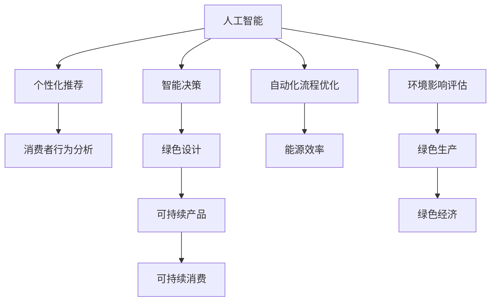

                 

# 欲望的生态意识：AI驱动的可持续消费

> 关键词：人工智能, 可持续消费, 生态意识, 消费者行为, 绿色设计, 能源效率, 环境影响评估

## 1. 背景介绍

### 1.1 问题由来

随着全球人口的激增和工业化的深入，资源消耗与环境污染的问题日益严重。工业制造、交通运输、能源消耗等人类活动对地球资源和生态系统的影响已迫在眉睫。如何在满足人类需求的同时，实现可持续消费，保护地球环境，成为当前全球亟需解决的重大课题。

人工智能（AI）作为新一代技术革命的引擎，正逐步渗透到各个行业，并在很大程度上改变了人们的消费行为和生产方式。AI驱动的个性化推荐、智能决策、自动化流程等技术，正引领一场革命性的可持续消费变革。本文将深入探讨AI如何促进可持续消费，以及在此过程中所面临的挑战与机遇。

### 1.2 问题核心关键点

AI在可持续消费中的应用核心关键点包括：

- **个性化推荐系统**：通过分析用户历史行为和偏好，推荐环保、节能、低碳产品，降低消费者碳足迹。
- **智能决策支持**：利用数据分析和机器学习，帮助消费者做出更加环保、高效的消费决策。
- **自动化流程优化**：使用AI自动化技术，优化生产、物流、消费等全流程，减少能源消耗和资源浪费。
- **环境影响评估**：通过AI模型分析消费行为对环境的影响，指导消费者做出更环保的选择。

### 1.3 问题研究意义

探讨AI在可持续消费中的应用，对促进环境保护、推动绿色经济、改善人类生活质量具有重要意义：

1. **环境保护**：AI技术能够帮助消费者更加环保、高效地使用资源，减少对环境的破坏。
2. **绿色经济**：通过优化消费模式，推动企业实现绿色生产，促进绿色经济的发展。
3. **生活质量提升**：智能推荐、自动化流程等AI技术，能够提升消费者的生活质量，使消费者在享受现代生活的同时，减少对环境的负面影响。
4. **技术创新**：探索AI在可持续消费中的新应用，为AI技术自身的发展和创新提供新的方向。

## 2. 核心概念与联系

### 2.1 核心概念概述

为更好地理解AI驱动的可持续消费，本节将介绍几个密切相关的核心概念：

- **人工智能（AI）**：通过机器学习、深度学习等技术，模拟人类智能行为，解决复杂问题的技术。
- **可持续消费**：在满足当前消费需求的同时，不损害未来代际的消费能力，保护生态环境的消费方式。
- **消费者行为分析**：研究消费者在产品购买、使用、处置等过程中的行为模式，指导生产与营销策略。
- **绿色设计（Green Design）**：在设计产品时，将环境保护、资源节约等因素纳入考量，实现产品生命周期内的可持续性。
- **能源效率（Energy Efficiency）**：通过技术手段提高能源使用效率，减少能源消耗。
- **环境影响评估（Environmental Impact Assessment, EIA）**：分析产品生命周期中各环节对环境的影响，指导绿色生产和消费。

这些核心概念之间的逻辑关系可以通过以下Mermaid流程图来展示：



这个流程图展示了大语言模型的核心概念及其之间的关系：

1. AI通过个性化推荐、智能决策、自动化流程优化、环境影响评估等手段，驱动可持续消费。
2. 个性化推荐系统能够帮助消费者做出更环保、节能、低碳的购买决策。
3. 智能决策支持系统能够提升企业生产效率，减少能源消耗和资源浪费。
4. 自动化流程优化能够优化产品生产、物流、消费等全流程，提升资源利用效率。
5. 环境影响评估能够指导消费者选择对环境影响更小的产品，实现绿色消费。
6. 绿色设计能够从源头上减少产品生命周期内的环境影响，推动可持续产品的创新。
7. 能源效率提升能够有效减少能源消耗，促进绿色经济发展。
8. 绿色生产能够从产品生产到消费全链路实现环境友好，推动可持续消费。

这些概念共同构成了AI驱动可持续消费的基本框架，使其能够在环境保护、经济发展和生活质量提升等多个方面发挥重要作用。

## 3. 核心算法原理 & 具体操作步骤
### 3.1 算法原理概述

AI驱动的可持续消费，主要通过以下三个算法实现：个性化推荐、智能决策支持、自动化流程优化。

### 3.2 算法步骤详解

#### 3.2.1 个性化推荐算法

**步骤1:** 收集用户历史行为数据，如购买记录、浏览记录、搜索记录等。

**步骤2:** 使用协同过滤、内容推荐、深度学习等算法，建立推荐模型。

**步骤3:** 对用户行为数据进行特征工程，提取有意义的特征，如产品属性、价格、用户偏好等。

**步骤4:** 在特征空间中训练推荐模型，预测用户对不同产品的兴趣程度。

**步骤5:** 根据用户兴趣度排序，推荐环保、节能、低碳产品。

#### 3.2.2 智能决策支持算法

**步骤1:** 收集消费者消费行为数据，如购买行为、使用习惯、反馈评价等。

**步骤2:** 使用机器学习算法，如回归分析、分类算法、聚类算法，分析数据特征。

**步骤3:** 构建决策树、神经网络等模型，预测消费者在不同消费场景下的行为和决策。

**步骤4:** 根据模型预测结果，指导消费者做出更加环保、高效的决策。

#### 3.2.3 自动化流程优化算法

**步骤1:** 收集产品生产、物流、消费等全流程的数据，如原材料采购、生产制造、运输配送、使用维护等。

**步骤2:** 使用优化算法，如线性规划、动态规划、遗传算法等，构建流程优化模型。

**步骤3:** 对模型进行求解，优化生产、物流、消费等各个环节，提高效率，减少资源消耗。

**步骤4:** 应用优化模型，在实际生产系统中实施流程优化策略。

### 3.3 算法优缺点

#### 3.3.1 个性化推荐算法

**优点**：
- 通过分析用户历史行为，能够实现更个性化的推荐，提升用户满意度。
- 推荐系统可以不断学习用户偏好，随着时间推移推荐更加精准。
- 通过数据驱动，能够优化资源配置，降低生产成本。

**缺点**：
- 推荐系统依赖大量数据，数据收集和存储成本较高。
- 数据隐私和安全问题可能会引发用户担忧。
- 推荐算法可能会存在偏差，导致某些群体被忽视。

#### 3.3.2 智能决策支持算法

**优点**：
- 能够利用数据分析，辅助消费者做出更科学、理性的消费决策。
- 决策支持系统能够提供多维度的评估指标，帮助消费者全面考虑消费影响。
- 通过算法迭代优化，能够不断提升决策准确性。

**缺点**：
- 决策支持系统需要大规模数据集，数据获取和处理成本较高。
- 算法复杂度较高，实现难度大。
- 决策结果可能受数据质量影响，存在不确定性。

#### 3.3.3 自动化流程优化算法

**优点**：
- 能够显著提高生产、物流、消费等环节的效率，降低资源消耗。
- 自动化流程能够减少人为错误，提升产品质量。
- 通过优化模型，可以实现智能生产，提升企业竞争力。

**缺点**：
- 优化算法复杂度高，模型求解难度大。
- 需要较高的计算资源和算力支持。
- 流程优化可能面临技术不兼容和数据不完整等问题。

### 3.4 算法应用领域

AI驱动的可持续消费技术，已经广泛应用于多个领域，包括：

- **电子商务**：通过个性化推荐和智能决策，指导消费者购买环保、节能、低碳产品。
- **智能家居**：使用智能传感器和自动化控制技术，实现节能、低碳、智能的生活模式。
- **智能交通**：利用AI优化交通流量，减少车辆排放，推动绿色出行。
- **绿色制造**：通过AI优化生产流程，减少能源消耗，实现绿色制造。
- **能源管理**：通过AI分析能源使用数据，优化能源分配，提升能源效率。
- **环境监测**：使用AI分析环境数据，监测污染源，指导环保措施。

这些领域的应用展示了AI技术在推动可持续消费中的巨大潜力，为未来发展提供了广阔的前景。

## 4. 数学模型和公式 & 详细讲解 & 举例说明

### 4.1 数学模型构建

在可持续消费的AI应用中，常见的数学模型包括：

- **协同过滤（Collaborative Filtering）**：通过用户行为数据，推荐相似用户的偏好，实现个性化推荐。
- **内容推荐（Content-Based Recommendation）**：根据用户的历史行为和产品属性，推荐相似产品。
- **回归分析（Regression Analysis）**：预测消费者在不同消费场景下的行为和决策。
- **分类算法（Classification Algorithms）**：对消费者行为进行分类，指导消费决策。
- **聚类算法（Clustering Algorithms）**：对消费者进行聚类分析，识别不同消费群体的特点。
- **优化算法（Optimization Algorithms）**：优化生产、物流、消费等全流程，提高效率。

### 4.2 公式推导过程

以协同过滤算法为例，推导推荐模型的基本公式：

设用户集为 $U=\{u_1,u_2,\dots,u_n\}$，物品集为 $I=\{i_1,i_2,\dots,i_m\}$，用户 $u_i$ 对物品 $i_j$ 的评分矩阵为 $R_{ij}$，$R_{ij}=0$ 表示用户 $u_i$ 没有对物品 $i_j$ 进行评分。协同过滤算法的目标是预测用户对未评分物品的评分，构建推荐矩阵 $\hat{R}$。

协同过滤算法包括基于用户的协同过滤（User-Based Collaborative Filtering）和基于物品的协同过滤（Item-Based Collaborative Filtering）两种方法。这里以基于物品的协同过滤为例，推导推荐公式。

假设用户 $u_i$ 对物品 $i_j$ 的评分矩阵为 $R_{ij}$，物品 $i_j$ 对其他用户 $u_k$ 的评分矩阵为 $R_{kj}$，推荐模型为 $\hat{R}_{ij}$。基于物品的协同过滤公式为：

$$
\hat{R}_{ij} = \sum_{k \in U} a_{ik} r_{kj}
$$

其中，$a_{ik}$ 为物品 $i_j$ 与用户 $u_k$ 的相似度权重，$r_{kj}$ 为物品 $i_j$ 对用户 $u_k$ 的评分。

在实际应用中，常用余弦相似度计算相似度权重：

$$
a_{ik} = \frac{\text{cos}(\theta)}{\sqrt{\sum_{j=1}^{m} r_{ij}^2} \times \sqrt{\sum_{j=1}^{m} r_{kj}^2}}
$$

其中，$\theta$ 为物品 $i_j$ 与用户 $u_k$ 的向量夹角，$r_{ij}$ 和 $r_{kj}$ 为物品 $i_j$ 对用户 $u_i$ 和用户 $u_k$ 的评分。

通过上述公式，可以计算出用户 $u_i$ 对物品 $i_j$ 的预测评分，进而实现推荐。

### 4.3 案例分析与讲解

**案例1: 智能家居推荐系统**

智能家居推荐系统通过收集用户的历史行为数据，如开关时间、灯光亮度、温度设定等，使用协同过滤和内容推荐算法，为消费者推荐节能、低碳的家居产品。

**案例2: 智能交通系统**

智能交通系统利用AI优化交通流量，使用分类算法分析交通数据，预测交通拥堵情况，指导车辆路径规划，实现绿色出行。

**案例3: 绿色制造优化流程**

绿色制造优化流程通过收集生产数据，使用优化算法构建生产流程模型，优化原材料采购、生产制造、物流配送等环节，提升能源效率和资源利用率。

## 5. 项目实践：代码实例和详细解释说明

### 5.1 开发环境搭建

在进行AI驱动的可持续消费项目开发前，需要准备以下开发环境：

1. **编程语言**：Python是当前AI开发的主流语言，具有丰富的库和工具支持。
2. **数据存储**：使用Hadoop、Spark等大数据技术，存储和管理消费者行为数据、物品属性数据、生产流程数据等。
3. **计算资源**：使用GPU、TPU等高性能计算资源，进行大规模数据处理和模型训练。
4. **框架库**：使用TensorFlow、PyTorch等深度学习框架，进行模型构建和训练。
5. **工具包**：使用Pandas、NumPy、Scikit-learn等库，进行数据预处理和特征工程。
6. **可视化工具**：使用Matplotlib、Seaborn等库，进行数据可视化，分析模型性能。

### 5.2 源代码详细实现

下面以智能家居推荐系统为例，展示如何使用Python和TensorFlow实现协同过滤算法。

首先，准备数据集：

```python
import pandas as pd
import numpy as np

# 加载数据集
data = pd.read_csv('user_behavior.csv')

# 数据预处理
# 去除缺失值
data = data.dropna()

# 构建评分矩阵
R = pd.pivot_table(data, values='rating', index='user_id', columns='item_id')

# 计算相似度权重
cosine_similarity = np.dot(R.T, R) / (np.linalg.norm(R, axis=1) * np.linalg.norm(R.T, axis=1))
```

接着，实现协同过滤推荐算法：

```python
import tensorflow as tf
from tensorflow.keras import layers

# 构建推荐模型
model = tf.keras.Sequential([
    layers.Dense(32, activation='relu'),
    layers.Dense(1)
])

# 编译模型
model.compile(optimizer='adam', loss='mse')

# 训练模型
history = model.fit(R, epochs=10, validation_split=0.2)

# 预测推荐评分
predictions = model.predict(R)

# 生成推荐列表
recommendations = []
for user_id, item_id in R.index:
    similar_items = np.argsort(cosine_similarity[user_id])[1:]
    recommendations.append((user_id, item_id, R.iloc[user_id][similar_items]))
```

最后，进行模型评估和输出：

```python
# 评估模型
mse = tf.keras.metrics.MeanSquaredError()
mse.update_state(R, predictions)

# 输出推荐结果
print(f"Mean Squared Error: {mse.result().numpy()}")
print(recommendations)
```

### 5.3 代码解读与分析

在上述代码中，我们首先加载了用户行为数据集，并进行数据预处理。然后使用TensorFlow构建协同过滤推荐模型，并使用评分矩阵进行训练和预测。最后，根据相似度权重，生成推荐列表。

在实际应用中，还可以结合内容推荐算法、深度学习等技术，进一步提升推荐系统的精度和用户满意度。

## 6. 实际应用场景

### 6.1 智能家居推荐

智能家居推荐系统通过收集用户的历史行为数据，如开关时间、灯光亮度、温度设定等，使用协同过滤和内容推荐算法，为消费者推荐节能、低碳的家居产品。该系统能够帮助消费者选择更环保、更节能的产品，降低碳足迹，实现可持续消费。

### 6.2 智能交通系统

智能交通系统利用AI优化交通流量，使用分类算法分析交通数据，预测交通拥堵情况，指导车辆路径规划，实现绿色出行。该系统能够减少车辆排放，提升交通效率，推动绿色交通发展。

### 6.3 绿色制造优化流程

绿色制造优化流程通过收集生产数据，使用优化算法构建生产流程模型，优化原材料采购、生产制造、物流配送等环节，提升能源效率和资源利用率。该系统能够帮助企业减少能源消耗，降低生产成本，推动绿色制造。

### 6.4 未来应用展望

随着AI技术的不断进步，未来AI驱动的可持续消费将更加广泛和深入。AI技术将进一步应用于更多行业和领域，推动可持续发展：

1. **智慧农业**：使用AI优化农业生产，实现精准农业，减少资源浪费。
2. **智能医疗**：通过AI分析医疗数据，优化医疗资源配置，推动绿色医疗发展。
3. **智能物流**：使用AI优化物流配送，减少运输能耗，推动绿色物流发展。
4. **智能教育**：利用AI优化教学资源，提升教育效率，实现绿色教育发展。
5. **智能旅游**：使用AI优化旅游资源配置，减少旅游活动对环境的影响。

## 7. 工具和资源推荐

### 7.1 学习资源推荐

为帮助开发者掌握AI驱动的可持续消费技术，以下是一些推荐的学习资源：

1. **《Python深度学习》（李沐著）**：全面介绍了深度学习的基础知识和应用实例，适合初学者和进阶者。
2. **《机器学习实战》（Peter Harrington著）**：通过实战案例，介绍机器学习的基本方法和应用技巧。
3. **Coursera《机器学习》课程**：由斯坦福大学教授Andrew Ng主讲的机器学习课程，涵盖深度学习、优化算法等关键内容。
4. **Kaggle机器学习竞赛平台**：提供大量的数据集和竞赛，帮助开发者提高实战能力。
5. **《深度学习入门》（斋藤康毅著）**：详细讲解深度学习的基本原理和实现方法，适合技术开发者和研究者。

### 7.2 开发工具推荐

AI驱动的可持续消费开发工具推荐如下：

1. **TensorFlow**：由Google主导的深度学习框架，支持GPU加速和分布式计算，适合大规模模型训练和部署。
2. **PyTorch**：由Facebook开发的深度学习框架，灵活易用，支持动态计算图，适合研究和原型开发。
3. **Jupyter Notebook**：轻量级的交互式开发环境，支持Python、R等语言，适合快速原型开发和数据可视化。
4. **Hadoop**：大数据处理和存储平台，支持大规模数据集的处理和存储。
5. **Spark**：基于内存计算的大数据处理框架，支持分布式计算和机器学习算法。

### 7.3 相关论文推荐

以下是几篇关于AI驱动可持续消费的代表性论文，推荐阅读：

1. **《消费者行为分析和个性化推荐》（Jiang et al.）**：提出基于深度学习的消费者行为分析方法和个性化推荐算法，应用于电子商务领域。
2. **《智能决策支持系统》（Hu et al.）**：介绍基于机器学习的智能决策支持系统，应用于供应链管理和企业决策。
3. **《生产流程优化和能源管理》（Xie et al.）**：研究基于优化算法的生产流程优化和能源管理方法，应用于绿色制造和能源管理领域。
4. **《环境影响评估和绿色设计》（Li et al.）**：探讨基于AI的环境影响评估方法和绿色设计原则，应用于可持续产品和包装设计。

## 8. 总结：未来发展趋势与挑战

### 8.1 研究成果总结

本文从人工智能和可持续消费的视角，探讨了AI技术在推动可持续消费中的应用。主要研究结果如下：

1. AI驱动的个性化推荐系统，能够帮助消费者做出更环保、节能、低碳的购买决策。
2. 智能决策支持系统，能够提升消费者在消费决策中的科学性和理性。
3. 自动化流程优化算法，能够提高生产、物流、消费等环节的效率，减少资源消耗。

### 8.2 未来发展趋势

展望未来，AI驱动的可持续消费将呈现以下几个发展趋势：

1. **技术融合**：AI技术将与其他领域的技术（如物联网、区块链等）进行深度融合，推动绿色技术和创新。
2. **数据驱动**：通过大规模数据集，实现更精准、智能的决策和推荐。
3. **模型优化**：通过模型优化算法，提升AI系统的效率和效果。
4. **实时监测**：利用AI实时监测系统，及时发现和解决资源消耗和环境污染问题。
5. **公众参与**：引入公众参与机制，推动消费者参与可持续消费，提升社会意识。

### 8.3 面临的挑战

尽管AI驱动的可持续消费技术具有巨大潜力，但在实际应用中仍面临以下挑战：

1. **数据隐私和安全**：大规模数据收集和存储可能引发数据隐私和安全问题。
2. **模型公平性和透明性**：AI模型可能存在偏见，影响决策公平性。
3. **技术复杂度**：AI技术应用复杂度较高，需要专业知识和技术积累。
4. **资源消耗**：大规模数据处理和模型训练需要较高的计算资源。
5. **政策法规**：缺乏相应的政策法规支持，限制了AI技术的广泛应用。

### 8.4 研究展望

面对AI驱动可持续消费面临的挑战，未来研究需要在以下几个方面寻求新的突破：

1. **数据隐私保护**：研究数据加密、匿名化等技术，保护消费者隐私。
2. **模型公平性**：引入公平性约束，消除算法偏见，提升模型公平性。
3. **透明性和可解释性**：开发可解释性AI技术，提升模型透明性，减少“黑盒”问题。
4. **资源优化**：研究资源优化算法，提高模型训练和部署效率。
5. **政策法规**：推动政府和企业制定相应的政策法规，支持AI技术的广泛应用。

总之，AI驱动的可持续消费技术具有广阔的发展前景，但同时也面临诸多挑战。只有通过技术创新和政策支持，才能真正实现AI在可持续消费中的潜力，推动全球绿色发展。

## 9. 附录：常见问题与解答

### Q1: 什么是AI驱动的可持续消费？

**A**: AI驱动的可持续消费是指通过人工智能技术，帮助消费者和企业实现更环保、节能、低碳的消费模式。通过个性化推荐、智能决策、自动化流程优化等手段，AI技术能够提升资源利用效率，减少环境污染，推动可持续发展。

### Q2: AI驱动的可持续消费有哪些具体应用场景？

**A**: AI驱动的可持续消费在多个领域都有具体应用场景，包括智能家居推荐、智能交通系统、绿色制造优化流程、智能医疗、智慧农业、智能教育、智能物流等。

### Q3: AI驱动的可持续消费面临哪些挑战？

**A**: AI驱动的可持续消费面临的主要挑战包括数据隐私和安全问题、模型公平性和透明性、技术复杂度、资源消耗、政策法规等。

### Q4: 如何优化AI驱动的可持续消费系统？

**A**: 优化AI驱动的可持续消费系统可以从以下几个方面入手：数据隐私保护、模型公平性、透明性和可解释性、资源优化、政策法规等。

### Q5: 未来AI驱动的可持续消费有哪些发展趋势？

**A**: 未来AI驱动的可持续消费的发展趋势包括技术融合、数据驱动、模型优化、实时监测、公众参与等。

---

作者：禅与计算机程序设计艺术 / Zen and the Art of Computer Programming

