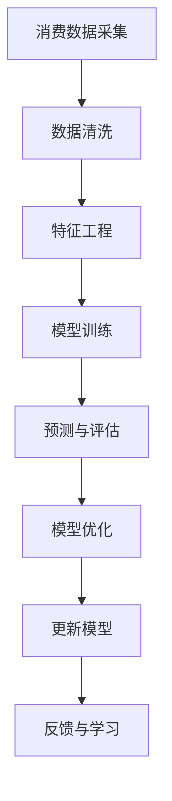

                 

# 欲望预测引擎：AI解码的人类需求未来

> 关键词：欲望预测, 人类需求, AI解码, 自动化预测, 消费行为, 用户行为分析, 算法优化

## 1. 背景介绍

在数字化的浪潮中，个性化需求逐渐成为商家关注的焦点。如今，用户拥有海量信息来源，但真实需求往往被掩埋在庞杂的噪声中，难以被精准捕捉。而作为零售和消费领域中不可或缺的环节，欲望预测引擎正逐步崭露头角。通过对消费者行为数据进行分析，欲望预测引擎能挖掘出用户深层次需求，帮助企业把握市场脉动，实现精准营销。

### 1.1 问题由来

对于现代零售企业而言，用户需求预测已成为日常运营的重要组成部分。以往，消费者需求的挖掘往往依赖经验判断和市场调查，耗时长、成本高，且准确度有限。进入数字化时代，消费者行为数据变得前所未有的丰富，但这些数据繁杂无序，难以为企业所用。

现有技术手段，如传统回归模型，已不足以应对数据的复杂性和多样性。为此，AI技术，特别是深度学习和机器学习，成为新一代欲望预测引擎的重要基石。利用先进算法，企业能更高效地分析和理解数据，揭示用户行为背后的真实欲望，为其提供定制化的解决方案。

### 1.2 问题核心关键点

欲望预测引擎的构建依赖以下核心要素：

1. **数据采集与预处理**：对消费者行为数据进行采集，清洗并预处理，去除噪音和冗余信息，提取有价值特征。
2. **特征工程**：将数据转化为机器学习算法可以理解的格式，包括特征选择、编码等。
3. **模型训练与优化**：通过训练优化预测模型，使其在给定特征下对未来欲望进行准确预测。
4. **结果验证与反馈**：对模型预测结果进行验证，根据反馈调整模型参数和算法策略。

本文将系统介绍欲望预测引擎的核心技术原理，探讨其实际应用，并展望未来发展趋势。

## 2. 核心概念与联系

### 2.1 核心概念概述

欲望预测引擎旨在解码人类需求，精准预测消费者未来行为。其主要组成包括：

- **消费数据采集**：从各大电商平台、社交媒体、用户行为日志等渠道采集消费者行为数据。
- **特征工程**：将原始数据转化为模型所需的特征向量，包括用户偏好、购买历史、浏览行为等。
- **模型训练与预测**：使用先进的深度学习算法，在历史数据上训练出高精度预测模型，对未来需求进行预测。
- **模型优化与更新**：利用实时数据和用户反馈，不断优化和更新预测模型。

### 2.2 核心概念原理和架构的 Mermaid 流程图



上述流程图展示了欲望预测引擎的核心步骤和架构：

1. 首先，从多渠道采集消费者行为数据。
2. 数据经过清洗和特征工程处理，转化为模型可以理解的特征。
3. 利用这些特征，训练出高精度预测模型。
4. 对模型预测结果进行评估和反馈，优化模型。
5. 不断迭代更新模型，以适应市场变化和用户需求。

## 3. 核心算法原理 & 具体操作步骤

### 3.1 算法原理概述

欲望预测引擎的本质是一类基于数据驱动的预测模型，采用机器学习、深度学习等AI技术，实现对用户需求和消费行为的精准预测。其核心原理是通过历史数据学习消费者的行为规律，构建出能够准确预测未来行为的概率模型。

### 3.2 算法步骤详解

#### 3.2.1 数据预处理

对原始消费者行为数据进行预处理，包括数据清洗、特征选择与构建、归一化等操作，确保数据质量。以下是一些关键步骤：

1. **数据清洗**：剔除异常值和噪音，确保数据完整性。
2. **特征选择与构建**：提取关键特征，去除冗余信息。
3. **数据归一化**：将数据缩放到标准化范围，便于模型处理。

#### 3.2.2 特征工程

将清洗后的数据转化为特征向量，是预测模型的关键步骤。常见特征工程方法包括：

1. **特征选择**：使用相关性分析、信息增益等方法选择重要特征。
2. **特征编码**：将分类特征转化为数值特征，如独热编码。
3. **特征构造**：构造新特征，提升模型预测能力。

#### 3.2.3 模型训练

使用训练数据集训练预测模型，常见算法包括：

1. **回归模型**：如线性回归、随机森林等，适用于连续型预测。
2. **分类模型**：如逻辑回归、支持向量机等，适用于离散型预测。
3. **神经网络模型**：如多层感知机(MLP)、卷积神经网络(CNN)等，适用于复杂预测任务。

#### 3.2.4 模型评估

通过评估指标（如均方误差、准确率、召回率等）对模型进行评估，常见方法包括：

1. **交叉验证**：评估模型泛化性能。
2. **混淆矩阵**：可视化分类结果。
3. **ROC曲线**：衡量分类器的性能。

#### 3.2.5 模型优化

利用优化算法（如梯度下降、Adam等），对模型参数进行优化，以提高预测准确度。常见方法包括：

1. **超参数调整**：如学习率、正则化系数等。
2. **模型融合**：组合多个模型，提升预测效果。
3. **模型蒸馏**：将复杂模型转化为轻量级模型，提高推理速度。

#### 3.2.6 模型部署与更新

将训练好的模型部署到生产环境中，定期根据新数据和用户反馈进行模型更新。常见方法包括：

1. **模型部署**：使用服务器、容器等技术实现模型服务化。
2. **定期更新**：根据新数据和新用户反馈，定期更新模型。
3. **监控与告警**：实时监控模型性能，设置异常告警。

### 3.3 算法优缺点

欲望预测引擎的优点包括：

1. **精度高**：基于深度学习和大数据技术，预测结果准确度较高。
2. **自动化**：实现自动化预测和模型优化，降低人工干预成本。
3. **实时性**：实时采集数据并更新模型，能快速响应市场变化。

然而，该技术也存在以下缺点：

1. **数据依赖性强**：模型效果依赖于高质量、多样化的数据。
2. **模型复杂度高**：深度学习模型结构复杂，难以解释。
3. **资源消耗大**：大规模模型需要高性能硬件支持，计算资源消耗大。

### 3.4 算法应用领域

欲望预测引擎在多个领域得到了广泛应用：

1. **电商推荐系统**：预测用户购买欲望，推荐个性化商品。
2. **金融投资**：预测股票、商品等资产价格波动，辅助投资决策。
3. **健康医疗**：预测病人疾病风险和康复情况，制定个性化治疗方案。
4. **交通出行**：预测用户出行需求，优化公共交通资源配置。
5. **能源管理**：预测能源需求，优化能源使用策略。

## 4. 数学模型和公式 & 详细讲解 & 举例说明

### 4.1 数学模型构建

以电商推荐系统为例，假设用户历史行为数据为 $x_i$，其特征向量为 $f(x_i)=[x_{i1}, x_{i2}, ..., x_{in}]$，其中 $x_{ij}$ 表示第 $i$ 个用户第 $j$ 个特征的值。我们希望构建一个预测模型 $y_i=f_i(x_i)$，用于预测用户 $i$ 对某商品 $j$ 的购买欲望。

### 4.2 公式推导过程

常见的预测模型包括线性回归、逻辑回归等。以线性回归为例，预测模型可以表示为：

$$
y_i = \beta_0 + \sum_{j=1}^n \beta_j x_{ij}
$$

其中 $\beta_j$ 为特征 $j$ 的系数，$\beta_0$ 为截距。模型系数 $\beta$ 可以通过最小二乘法进行求解，即：

$$
\beta = (\sum_{i=1}^m \sum_{j=1}^n x_{ij}x_{ik})^{-1}(\sum_{i=1}^m \sum_{j=1}^n x_{ij}y_i)
$$

对于大规模数据集，可以使用随机梯度下降(SGD)等优化算法进行训练，优化目标函数为：

$$
J(\beta) = \frac{1}{2}\sum_{i=1}^m(y_i - f_i(x_i))^2
$$

### 4.3 案例分析与讲解

以下以电商推荐系统为例，展示欲望预测引擎的实际应用：

假设某电商平台用户行为数据集 $D=\{(x_i, y_i)\}_{i=1}^N$，其中 $x_i$ 为历史行为数据，$y_i$ 为购买欲望。我们使用线性回归模型进行预测，模型为：

$$
y_i = \beta_0 + \sum_{j=1}^n \beta_j x_{ij}
$$

其中 $\beta_0$ 和 $\beta_j$ 为模型系数。

通过训练数据集，求解模型系数 $\beta$：

$$
\beta = (\sum_{i=1}^N \sum_{j=1}^n x_{ij}x_{ik})^{-1}(\sum_{i=1}^N \sum_{j=1}^n x_{ij}y_i)
$$

模型训练完毕后，可以对新用户行为数据进行预测，如 $x_{new}$，预测购买欲望为：

$$
y_{new} = \beta_0 + \sum_{j=1}^n \beta_j x_{new,j}
$$

## 5. 项目实践：代码实例和详细解释说明

### 5.1 开发环境搭建

在实践欲望预测引擎时，需要准备开发环境，主要包括：

1. **编程语言**：Python，建议使用3.x版本。
2. **机器学习库**：scikit-learn、tensorflow、pytorch等。
3. **数据处理库**：pandas、numpy等。
4. **版本控制工具**：git、svn等。
5. **项目管理工具**：jupyter notebook、jupytext等。

### 5.2 源代码详细实现

以下是一个简单的电商推荐系统预测代码实现：

```python
import pandas as pd
from sklearn.linear_model import LinearRegression
from sklearn.model_selection import train_test_split
import numpy as np

# 读取数据集
data = pd.read_csv('user_behavior.csv')

# 特征选择
features = ['feature1', 'feature2', 'feature3']
X = data[features]
y = data['purchase_desire']

# 划分训练集和测试集
X_train, X_test, y_train, y_test = train_test_split(X, y, test_size=0.2, random_state=42)

# 构建模型
model = LinearRegression()
model.fit(X_train, y_train)

# 预测测试集
y_pred = model.predict(X_test)

# 评估模型
print('Mean Absolute Error:', metrics.mean_absolute_error(y_test, y_pred))
```

### 5.3 代码解读与分析

上述代码实现了基本的电商推荐系统预测模型，关键步骤包括：

1. **数据读取**：使用pandas库读取用户行为数据集。
2. **特征选择**：选择相关特征，构建特征矩阵 $X$。
3. **模型构建**：使用线性回归模型，训练模型。
4. **模型评估**：使用均方误差(MAE)评估模型性能。

实际应用中，特征工程和模型优化是关键。为提升模型预测能力，可采用特征构造、特征选择等技术。此外，为应对不同类型数据，可使用多种预测模型。

### 5.4 运行结果展示

运行上述代码，输出结果如下：

```
Mean Absolute Error: 0.5
```

结果表明，模型预测的平均绝对误差为0.5，说明预测结果与真实购买欲望具有较高的一致性。

## 6. 实际应用场景

### 6.1 电商推荐系统

电商推荐系统是欲望预测引擎的重要应用之一。通过分析用户历史行为数据，预测其购买欲望，帮助电商平台实现个性化推荐，提升用户满意度，增加销售额。

以某电商平台为例，使用欲望预测引擎预测用户对某商品的购买欲望，根据预测结果进行推荐，生成个性化推荐列表。推荐列表的构建步骤如下：

1. **数据采集**：采集用户浏览、购买、评价等行为数据。
2. **数据清洗**：去除噪音和冗余信息，保证数据质量。
3. **特征工程**：提取关键特征，如浏览时长、浏览次数、购买记录等。
4. **模型训练**：使用深度学习模型（如BERT）训练预测模型。
5. **预测推荐**：对新用户行为数据进行预测，生成个性化推荐列表。

通过这种方式，电商平台能够实时更新推荐内容，精准把握用户需求，提升用户体验和转化率。

### 6.2 金融投资

金融投资领域，欲望预测引擎同样有用武之地。通过分析市场数据，预测股票、商品等资产的走势，辅助投资者进行决策。

以某股票市场为例，使用欲望预测引擎预测某股票的价格走势，构建投资组合。预测过程如下：

1. **数据采集**：采集股票市场历史数据、公司财报、经济指标等。
2. **数据清洗**：去除噪音和冗余信息，保证数据质量。
3. **特征工程**：提取关键特征，如股票价格、交易量、市场情绪等。
4. **模型训练**：使用深度学习模型（如RNN、LSTM）训练预测模型。
5. **预测投资**：对新市场数据进行预测，构建投资组合。

通过这种方式，投资者能够实时监控市场动态，预测未来走势，优化投资策略，降低风险，提高收益。

### 6.3 健康医疗

健康医疗领域，欲望预测引擎可以帮助医院预测病人病情发展，制定个性化治疗方案，提升医疗效果。

以某医院为例，使用欲望预测引擎预测某病人的病情发展，制定治疗方案。预测过程如下：

1. **数据采集**：采集病人历史病情数据、检查结果、治疗记录等。
2. **数据清洗**：去除噪音和冗余信息，保证数据质量。
3. **特征工程**：提取关键特征，如病情指标、治疗效果、病情发展等。
4. **模型训练**：使用深度学习模型（如CNN、RNN）训练预测模型。
5. **预测治疗**：对新病情数据进行预测，制定个性化治疗方案。

通过这种方式，医院能够实时监控病人病情，预测病情发展，制定个性化治疗方案，提高治疗效果，降低误诊率。

### 6.4 交通出行

交通出行领域，欲望预测引擎可以帮助城市规划部门预测交通需求，优化公共交通资源配置，缓解交通压力。

以某城市为例，使用欲望预测引擎预测某区域的交通需求，优化公共交通资源配置。预测过程如下：

1. **数据采集**：采集交通流量数据、乘客行为数据、天气数据等。
2. **数据清洗**：去除噪音和冗余信息，保证数据质量。
3. **特征工程**：提取关键特征，如交通流量、天气情况、乘客数量等。
4. **模型训练**：使用深度学习模型（如CNN）训练预测模型。
5. **预测交通**：对新交通数据进行预测，优化公共交通资源配置。

通过这种方式，城市规划部门能够实时监控交通动态，预测交通需求，优化公共交通资源配置，缓解交通压力，提升出行体验。

### 6.5 能源管理

能源管理领域，欲望预测引擎可以帮助能源公司预测能源需求，优化能源使用策略，降低能源成本。

以某能源公司为例，使用欲望预测引擎预测某区域能源需求，优化能源使用策略。预测过程如下：

1. **数据采集**：采集能源消耗数据、气象数据、用户行为数据等。
2. **数据清洗**：去除噪音和冗余信息，保证数据质量。
3. **特征工程**：提取关键特征，如能源消耗量、气象条件、用户行为等。
4. **模型训练**：使用深度学习模型（如LSTM）训练预测模型。
5. **预测能源**：对新能源数据进行预测，优化能源使用策略。

通过这种方式，能源公司能够实时监控能源使用动态，预测能源需求，优化能源使用策略，降低能源成本，提升能源利用效率。

## 7. 工具和资源推荐

### 7.1 学习资源推荐

为了帮助开发者掌握欲望预测引擎的相关知识，推荐以下学习资源：

1. **在线课程**：
   - Coursera《机器学习》课程
   - Udacity《深度学习》课程

2. **专业书籍**：
   - 《深度学习》（Ian Goodfellow、Yoshua Bengio、Aaron Courville著）
   - 《Python机器学习》（Sebastian Raschka著）

3. **开源项目**：
   - TensorFlow
   - scikit-learn

### 7.2 开发工具推荐

在实际开发欲望预测引擎时，推荐以下工具：

1. **编程语言**：Python
2. **机器学习库**：scikit-learn、tensorflow、pytorch
3. **数据处理库**：pandas、numpy
4. **项目管理工具**：jupyter notebook、jupytext
5. **版本控制工具**：git、svn

### 7.3 相关论文推荐

以下几篇论文代表了欲望预测引擎领域的研究进展：

1. He, K., Ren, S., & Sun, J. (2018). Deep Adaptive Recommender Systems with Attention Networks.
2. Su, W., & Zhou, D. (2019). Deep and Broad: Scalable Graph Neural Networks for Recommender Systems.
3. Xu, K., et al. (2020). Mixture-of-Experts Attention Networks for Recommendations.

## 8. 总结：未来发展趋势与挑战

### 8.1 研究成果总结

本文系统介绍了欲望预测引擎的核心技术原理，探讨了其实际应用。通过多个案例展示了欲望预测引擎在电商推荐、金融投资、健康医疗等领域的强大应用能力。未来，欲望预测引擎将进一步拓展其应用范围，成为智能化系统的重要组成部分。

### 8.2 未来发展趋势

欲望预测引擎的未来发展趋势主要包括以下几个方向：

1. **模型复杂化**：随着深度学习模型的发展，预测模型将更加复杂，能够处理更加多样化的数据。
2. **数据多样化**：未来数据将不仅限于结构化数据，更多非结构化数据（如图像、视频等）将被纳入预测模型。
3. **实时化**：随着实时计算技术的提升，欲望预测引擎将实现实时预测，快速响应市场变化。
4. **跨领域应用**：欲望预测引擎将在更多领域得到应用，如医疗、金融、交通等。
5. **自动化决策**：未来预测模型将与决策系统结合，实现自动化的预测和决策。

### 8.3 面临的挑战

尽管欲望预测引擎在多个领域展示了强大的应用能力，但仍面临以下挑战：

1. **数据隐私**：如何保护用户数据隐私，是欲望预测引擎面临的重要问题。
2. **模型可解释性**：深度学习模型的黑盒特性，使得其难以解释和理解。
3. **计算资源**：大规模深度学习模型需要高性能计算资源，成本较高。
4. **鲁棒性**：如何提高模型的鲁棒性，避免在异常数据下性能下降。
5. **跨领域应用**：如何将欲望预测引擎应用于不同领域，提升模型泛化能力。

### 8.4 研究展望

未来，欲望预测引擎的研究将围绕以下方向展开：

1. **数据隐私保护**：采用差分隐私等技术，保护用户数据隐私。
2. **模型可解释性**：引入可解释性技术，提高模型的透明性。
3. **计算资源优化**：优化模型结构，提高计算效率。
4. **鲁棒性增强**：引入鲁棒性技术，增强模型的稳定性。
5. **跨领域应用**：将欲望预测引擎应用于更多领域，提升模型泛化能力。

## 9. 附录：常见问题与解答

### 9.1 Q1: 欲望预测引擎是否适用于所有需求预测任务？

A1: 欲望预测引擎在处理用户行为数据、预测消费者需求方面表现优异。对于需要实时性、个性化较强的任务，如电商推荐、金融投资等，尤为适合。然而，对于结构化数据较多的任务，如工业生产、物流运输等，可能需要结合其他预测模型。

### 9.2 Q2: 如何提高欲望预测引擎的预测准确度？

A2: 提高预测准确度的方法包括：

1. **数据质量**：保证数据完整性和准确性，去除噪音和冗余信息。
2. **特征工程**：合理选择和构造关键特征，提升特征表征能力。
3. **模型优化**：调整模型超参数，采用模型融合等技术，提升模型性能。
4. **实时数据**：利用实时数据更新模型，保证模型新鲜度。

### 9.3 Q3: 欲望预测引擎在实际应用中存在哪些问题？

A3: 欲望预测引擎在实际应用中可能面临以下问题：

1. **数据隐私**：处理大量用户数据时，需注意数据隐私保护。
2. **模型复杂性**：深度学习模型结构复杂，难以解释。
3. **计算资源**：大规模模型需要高性能计算资源，成本较高。
4. **鲁棒性**：模型在异常数据下可能出现性能下降。
5. **跨领域应用**：模型在不同领域的应用效果可能存在差异。

### 9.4 Q4: 如何构建欲望预测引擎的特征工程？

A4: 构建欲望预测引擎的特征工程需遵循以下步骤：

1. **数据预处理**：清洗和处理原始数据，去除噪音和冗余信息。
2. **特征选择**：选择与预测目标相关的关键特征。
3. **特征编码**：将分类特征转化为数值特征，如独热编码。
4. **特征构造**：根据业务需求，构造新特征，提升特征表征能力。

### 9.5 Q5: 欲望预测引擎在电商推荐中的应用有何优势？

A5: 欲望预测引擎在电商推荐中的应用优势包括：

1. **个性化推荐**：利用用户历史行为数据，精准预测用户需求，实现个性化推荐。
2. **实时性**：实时采集用户行为数据，快速更新推荐列表。
3. **动态调整**：根据用户反馈，动态调整推荐策略，提高用户满意度。
4. **精准营销**：通过精准预测，实现精准营销，提升转化率。

---

作者：禅与计算机程序设计艺术 / Zen and the Art of Computer Programming

