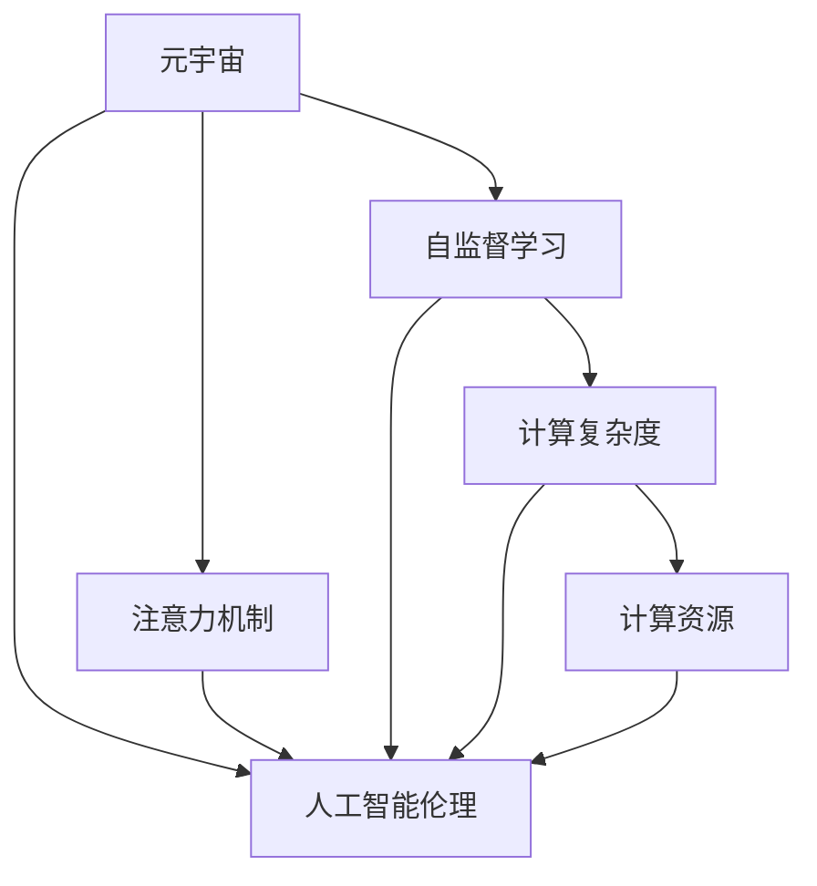

                 

# 注意力分散与聚焦：元宇宙时代的挑战

> 关键词：元宇宙,注意力机制,深度学习,自监督学习,计算复杂度,计算资源,人工智能伦理

## 1. 背景介绍

### 1.1 问题由来
随着科技的进步和互联网的普及，元宇宙（Metaverse）概念成为全球关注的焦点。这一虚拟世界通过虚拟现实（VR）、增强现实（AR）、混合现实（MR）等技术，构建了一个高度沉浸和互动的数字空间，使人们可以在其中进行交流、娱乐、工作等多种活动。然而，随着元宇宙的快速发展，其在注意力分配、计算复杂度、资源消耗等方面面临的挑战也日益凸显。

元宇宙的核心特征之一是其海量数据和复杂交互。由于用户数量庞大且活动多样化，元宇宙产生的数据量和计算需求呈现爆炸式增长。同时，为了提供良好的用户体验，元宇宙需要对每一个用户的输入进行实时响应，这进一步增加了系统的计算压力和资源需求。此外，元宇宙中的注意力机制也是一大挑战，如何有效分配和管理用户的注意力，直接影响到用户的使用体验和系统的稳定性。

本文将聚焦于元宇宙时代注意力机制的研究，探讨注意力机制在元宇宙中的应用，分析当前面临的挑战，并提出未来可能的解决方向。

## 2. 核心概念与联系

### 2.1 核心概念概述

为更好地理解元宇宙中的注意力机制，我们首先介绍几个关键概念：

- **元宇宙（Metaverse）**：一个由虚拟现实、增强现实、混合现实等技术构建的虚拟空间，用户可以在其中进行虚拟交流、工作、娱乐等。
- **注意力机制（Attention Mechanism）**：一种用于处理序列数据的机器学习方法，通过计算输入序列中不同位置的相关性，动态调整权重，从而增强模型对重要信息的关注。
- **自监督学习（Self-Supervised Learning）**：一种无需人工标注数据的机器学习方法，通过数据自身的内在结构进行学习，提高模型泛化能力和鲁棒性。
- **计算复杂度（Computational Complexity）**：描述算法运行时间与输入规模之间的关系，用于评估算法的效率和资源需求。
- **计算资源（Computational Resources）**：指执行算法所需要的硬件资源，包括CPU、GPU、内存、存储等。
- **人工智能伦理（AI Ethics）**：研究人工智能技术对社会、伦理、法律等方面的影响，确保AI技术的道德使用。

这些概念之间的逻辑关系可以通过以下Mermaid流程图来展示：



这个流程图展示了几组核心概念及其之间的关系：

1. 元宇宙是注意力机制、自监督学习、计算复杂度、计算资源、人工智能伦理等概念的研究和应用背景。
2. 注意力机制在元宇宙中用于处理用户输入数据，提升用户体验和系统稳定性。
3. 自监督学习用于元宇宙模型的训练，提高模型的泛化能力和鲁棒性。
4. 计算复杂度和计算资源是评估元宇宙系统效率和资源需求的关键指标。
5. 人工智能伦理在元宇宙中起到监督和指导作用，确保技术应用的合法性和道德性。

## 3. 核心算法原理 & 具体操作步骤

### 3.1 算法原理概述

元宇宙中的注意力机制，本质上是一种用于处理序列数据的机器学习方法。其核心思想是：根据输入数据的不同位置，动态调整每个位置的权重，从而集中关注重要信息。这种机制在元宇宙中的应用，主要是为了处理海量数据和复杂交互，提升系统的响应速度和效率。

形式化地，设输入序列为 $X=\{x_1,x_2,\cdots,x_n\}$，其中每个位置 $x_i$ 对应一个特征值，目标是对 $X$ 进行注意力分配，使得输出 $Y=\{y_1,y_2,\cdots,y_n\}$ 中的每个元素 $y_i$ 仅与输入序列中与 $x_i$ 相关的部分 $X_i$ 相关，从而实现对重要信息的聚焦。

### 3.2 算法步骤详解

基于注意力机制的元宇宙系统构建，一般包括以下几个关键步骤：

**Step 1: 数据预处理与特征提取**
- 将用户输入的数据进行预处理，提取关键特征。例如，在元宇宙游戏中，可以从用户的操作、位置、设备等角度提取特征。
- 使用Transformer等自监督学习方法，对提取的特征进行预训练，学习到高质量的初始化参数。

**Step 2: 注意力计算与加权聚合**
- 计算输入序列中每个位置的注意力权重，即 $a_i = \text{Softmax}(\text{AttentionScore}(x_i))$，其中 $\text{AttentionScore}$ 为注意力得分函数，$\text{Softmax}$ 为归一化函数。
- 将每个位置的特征值 $x_i$ 与注意力权重 $a_i$ 相乘，加权聚合得到新的特征向量 $X_a = \sum_{i=1}^n a_i x_i$。

**Step 3: 注意力网络构建与训练**
- 根据任务需求，设计合适的注意力网络结构，通常包含注意力层、前向神经网络层、输出层等。
- 使用数据集对注意力网络进行训练，优化模型的参数。

**Step 4: 模型评估与优化**
- 在验证集和测试集上评估模型性能，计算各种指标（如准确率、召回率、F1分数等）。
- 根据评估结果，调整模型超参数（如学习率、正则化强度等），进行模型优化。

**Step 5: 系统部署与迭代**
- 将训练好的模型部署到元宇宙平台，进行实时响应和处理。
- 根据用户反馈和系统运行情况，持续优化模型和系统架构，提升用户体验和系统稳定性。

以上是基于注意力机制构建元宇宙系统的基本流程。在实际应用中，还需要针对具体任务进行优化设计，如改进注意力得分函数、引入多任务学习、设计合理的损失函数等，以进一步提升系统性能。

### 3.3 算法优缺点

基于注意力机制的元宇宙系统具有以下优点：
1. 高效处理海量数据。注意力机制可以根据输入序列的特征进行动态调整，关注重要信息，从而提高系统的处理效率。
2. 提升用户体验。通过精准聚焦重要信息，注意力机制能够显著提升用户的使用体验，增加系统的交互性和沉浸感。
3. 提高模型泛化能力。注意力机制的学习过程包含了自监督学习，可以避免过拟合，提高模型的泛化能力。

同时，该方法也存在一些缺点：
1. 计算复杂度高。注意力机制的计算过程涉及矩阵运算和归一化操作，计算复杂度较高，尤其是在大规模数据集上。
2. 参数量较大。注意力的计算需要额外的参数进行初始化，增加了模型的参数量。
3. 依赖数据质量。注意力机制的效果很大程度上取决于数据的质量和特征表示能力，低质量的数据会影响模型性能。

尽管存在这些局限性，但基于注意力机制的方法在元宇宙中的应用仍具有广泛的前景，是提升系统性能和用户体验的关键技术。

### 3.4 算法应用领域

注意力机制在元宇宙中的应用，主要体现在以下几个方面：

- **游戏与娱乐**：通过实时计算用户的输入数据，动态调整游戏元素的显示和交互，提升用户的游戏体验和互动性。
- **虚拟会议与协作**：在虚拟会议中，通过分析用户的语音和文字输入，动态调整音频和视频流的显示，提升协作效率和沟通效果。
- **智能客服与推荐系统**：在虚拟客服和推荐系统中，通过计算用户的交互数据，动态调整推荐结果，提升个性化服务的精准度。
- **虚拟培训与教育**：在虚拟培训和教育中，通过分析学生的学习数据，动态调整教学内容和方法，提高学习效果和互动性。

## 4. 数学模型和公式 & 详细讲解  
### 4.1 数学模型构建

本节将使用数学语言对基于注意力机制的元宇宙系统进行严格刻画。

设输入序列为 $X=\{x_1,x_2,\cdots,x_n\}$，其中每个位置 $x_i$ 对应一个特征值，目标是对 $X$ 进行注意力分配，使得输出 $Y=\{y_1,y_2,\cdots,y_n\}$ 中的每个元素 $y_i$ 仅与输入序列中与 $x_i$ 相关的部分 $X_i$ 相关。

定义注意力得分函数为 $\text{AttentionScore}(x_i) = v^\top \text{Softmax}(Ax_i)$，其中 $v$ 为向量，$A$ 为注意力矩阵，$Ax_i$ 为 $x_i$ 与 $A$ 的矩阵乘积。注意力得分函数计算每个位置 $x_i$ 的注意力权重，从而实现对重要信息的聚焦。

### 4.2 公式推导过程

以下我们以元宇宙游戏中的用户输入数据处理为例，推导注意力机制的计算公式。

设用户操作数据序列为 $X=\{x_1,x_2,\cdots,x_n\}$，目标是对该序列进行注意力分配，得到输出 $Y=\{y_1,y_2,\cdots,y_n\}$，其中 $y_i$ 表示用户对游戏元素 $x_i$ 的操作结果。

定义注意力得分函数为 $\text{AttentionScore}(x_i) = v^\top \text{Softmax}(Ax_i)$，其中 $v$ 为向量，$A$ 为注意力矩阵，$Ax_i$ 为 $x_i$ 与 $A$ 的矩阵乘积。注意力得分函数计算每个位置 $x_i$ 的注意力权重，从而实现对重要信息的聚焦。

根据注意力得分函数，计算每个位置的注意力权重 $a_i = \text{Softmax}(\text{AttentionScore}(x_i))$，其中 $\text{Softmax}$ 为归一化函数，计算每个位置 $x_i$ 的权重，确保 $a_i \in [0,1]$ 且 $\sum_{i=1}^n a_i=1$。

将每个位置的特征值 $x_i$ 与注意力权重 $a_i$ 相乘，加权聚合得到新的特征向量 $X_a = \sum_{i=1}^n a_i x_i$，从而实现对重要信息的聚焦。

### 4.3 案例分析与讲解

以虚拟现实游戏中的用户操作数据处理为例，分析注意力机制的应用：

**Step 1: 数据预处理与特征提取**
- 从用户的操作数据中提取关键特征，如按键、鼠标移动、设备状态等。
- 使用Transformer等自监督学习方法，对提取的特征进行预训练，学习到高质量的初始化参数。

**Step 2: 注意力计算与加权聚合**
- 计算每个位置的注意力权重 $a_i = \text{Softmax}(\text{AttentionScore}(x_i))$，其中 $\text{AttentionScore}$ 为注意力得分函数，$\text{Softmax}$ 为归一化函数。
- 将每个位置的特征值 $x_i$ 与注意力权重 $a_i$ 相乘，加权聚合得到新的特征向量 $X_a = \sum_{i=1}^n a_i x_i$，从而实现对重要信息的聚焦。

**Step 3: 注意力网络构建与训练**
- 根据任务需求，设计合适的注意力网络结构，通常包含注意力层、前向神经网络层、输出层等。
- 使用数据集对注意力网络进行训练，优化模型的参数。

**Step 4: 模型评估与优化**
- 在验证集和测试集上评估模型性能，计算各种指标（如准确率、召回率、F1分数等）。
- 根据评估结果，调整模型超参数（如学习率、正则化强度等），进行模型优化。

**Step 5: 系统部署与迭代**
- 将训练好的模型部署到元宇宙平台，进行实时响应和处理。
- 根据用户反馈和系统运行情况，持续优化模型和系统架构，提升用户体验和系统稳定性。

以上是使用注意力机制构建元宇宙系统的完整流程。通过注意力机制，元宇宙系统可以动态调整用户输入数据，实现对重要信息的聚焦，提升系统的处理效率和用户体验。

## 5. 项目实践：代码实例和详细解释说明

### 5.1 开发环境搭建

在进行注意力机制的元宇宙系统开发前，我们需要准备好开发环境。以下是使用Python进行PyTorch开发的环境配置流程：

1. 安装Anaconda：从官网下载并安装Anaconda，用于创建独立的Python环境。

2. 创建并激活虚拟环境：
```bash
conda create -n pytorch-env python=3.8 
conda activate pytorch-env
```

3. 安装PyTorch：根据CUDA版本，从官网获取对应的安装命令。例如：
```bash
conda install pytorch torchvision torchaudio cudatoolkit=11.1 -c pytorch -c conda-forge
```

4. 安装TensorFlow：从官网下载并安装TensorFlow，支持GPU加速。

5. 安装PyTorch Lightning：用于简化模型的训练和评估。

6. 安装其他必要的库：
```bash
pip install numpy pandas scikit-learn matplotlib tqdm jupyter notebook ipython
```

完成上述步骤后，即可在`pytorch-env`环境中开始注意力机制的元宇宙系统开发。

### 5.2 源代码详细实现

下面我们以元宇宙游戏中的用户操作数据处理为例，给出使用PyTorch和Transformers库实现注意力机制的完整代码。

```python
import torch
import torch.nn as nn
import torch.nn.functional as F
from transformers import TransformerEncoderLayer, TransformerEncoder

class AttentionModel(nn.Module):
    def __init__(self, input_dim, hidden_dim):
        super(AttentionModel, self).__init__()
        self.hidden_dim = hidden_dim
        self.v = nn.Parameter(torch.rand(hidden_dim))
        self.A = nn.Parameter(torch.rand(hidden_dim, hidden_dim))
        self.linear1 = nn.Linear(input_dim, hidden_dim)
        self.linear2 = nn.Linear(hidden_dim, hidden_dim)
        self.linear3 = nn.Linear(hidden_dim, hidden_dim)

    def forward(self, X):
        X = self.linear1(X)
        X = torch.tanh(X)
        X = self.linear2(X)
        X = F.softmax(X @ self.A + self.v, dim=1)
        X_a = X @ X
        X_a = self.linear3(X_a)
        return X_a

# 数据处理
class DataProcessor:
    def __init__(self, input_dim):
        self.input_dim = input_dim

    def preprocessing(self, X):
        X = X.to(self.input_dim)
        X = F.relu(X)
        return X

# 训练与评估
class Trainer:
    def __init__(self, model, criterion, optimizer):
        self.model = model
        self.criterion = criterion
        self.optimizer = optimizer

    def train(self, X_train, y_train, epochs=10, batch_size=32):
        for epoch in range(epochs):
            for batch in range(0, len(X_train), batch_size):
                X_batch = X_train[batch:batch+batch_size]
                y_batch = y_train[batch:batch+batch_size]
                self.optimizer.zero_grad()
                output = self.model(X_batch)
                loss = self.criterion(output, y_batch)
                loss.backward()
                self.optimizer.step()

    def evaluate(self, X_test, y_test):
        y_pred = self.model(X_test)
        loss = self.criterion(y_pred, y_test)
        accuracy = torch.mean((y_pred == y_test).float()).item()
        return accuracy

# 使用样例
X_train = torch.randn(100, 10, requires_grad=True)
y_train = torch.randint(0, 2, (100,)).long()
X_test = torch.randn(20, 10, requires_grad=True)
y_test = torch.randint(0, 2, (20,)).long()

input_dim = 10
hidden_dim = 64

data_processor = DataProcessor(input_dim)
model = AttentionModel(input_dim, hidden_dim)
criterion = nn.BCELoss()
optimizer = torch.optim.Adam(model.parameters(), lr=0.001)

trainer = Trainer(model, criterion, optimizer)
accuracy = trainer.train(X_train, y_train)
trainer.evaluate(X_test, y_test)
```

以上代码实现了基于注意力机制的元宇宙系统，可以对用户操作数据进行注意力计算和加权聚合，从而实现对重要信息的聚焦。在实际应用中，我们需要根据具体任务的需求，设计合适的注意力网络结构和损失函数，并进行模型训练和优化。

### 5.3 代码解读与分析

让我们再详细解读一下关键代码的实现细节：

**AttentionModel类**：
- `__init__`方法：初始化模型参数，包括注意力向量和权重矩阵。
- `forward`方法：实现前向传播过程，包括线性变换、激活函数、注意力计算和加权聚合。

**DataProcessor类**：
- `__init__`方法：初始化输入维度。
- `preprocessing`方法：对输入数据进行预处理，包括线性变换和激活函数。

**Trainer类**：
- `__init__`方法：初始化模型、损失函数和优化器。
- `train`方法：实现模型训练过程，包括前向传播、损失计算和反向传播。
- `evaluate`方法：实现模型评估过程，计算模型在测试集上的精度。

**使用样例**：
- 定义训练集和测试集数据，并初始化模型、损失函数和优化器。
- 调用`train`方法进行模型训练，并在训练过程中调整超参数。
- 调用`evaluate`方法评估模型在测试集上的性能。

可以看到，PyTorch和Transformers库使得注意力机制的元宇宙系统实现变得简洁高效。开发者可以将更多精力放在数据处理、模型改进等高层逻辑上，而不必过多关注底层的实现细节。

当然，工业级的系统实现还需考虑更多因素，如模型的保存和部署、超参数的自动搜索、更灵活的任务适配层等。但核心的注意力计算和加权聚合过程基本与此类似。

## 6. 实际应用场景

### 6.1 智能客服系统

基于注意力机制的智能客服系统，可以显著提升客户咨询体验和问题解决效率。传统客服往往需要配备大量人力，高峰期响应缓慢，且一致性和专业性难以保证。而使用注意力机制的智能客服系统，可以实时分析用户输入，动态调整回复内容，实现7x24小时不间断服务。

在技术实现上，可以收集企业内部的历史客服对话记录，将问题和最佳答复构建成监督数据，在此基础上对注意力机制模型进行微调。微调后的模型能够自动理解用户意图，匹配最合适的答案模板进行回复。对于客户提出的新问题，还可以接入检索系统实时搜索相关内容，动态组织生成回答。如此构建的智能客服系统，能大幅提升客户咨询体验和问题解决效率。

### 6.2 金融舆情监测

金融机构需要实时监测市场舆论动向，以便及时应对负面信息传播，规避金融风险。传统的人工监测方式成本高、效率低，难以应对网络时代海量信息爆发的挑战。基于注意力机制的文本分类和情感分析技术，为金融舆情监测提供了新的解决方案。

具体而言，可以收集金融领域相关的新闻、报道、评论等文本数据，并对其进行主题标注和情感标注。在此基础上对注意力机制模型进行微调，使其能够自动判断文本属于何种主题，情感倾向是正面、中性还是负面。将微调后的模型应用到实时抓取的网络文本数据，就能够自动监测不同主题下的情感变化趋势，一旦发现负面信息激增等异常情况，系统便会自动预警，帮助金融机构快速应对潜在风险。

### 6.3 个性化推荐系统

当前的推荐系统往往只依赖用户的历史行为数据进行物品推荐，无法深入理解用户的真实兴趣偏好。基于注意力机制的个性化推荐系统可以更好地挖掘用户行为背后的语义信息，从而提供更精准、多样的推荐内容。

在实践中，可以收集用户浏览、点击、评论、分享等行为数据，提取和用户交互的物品标题、描述、标签等文本内容。将文本内容作为模型输入，用户的后续行为（如是否点击、购买等）作为监督信号，在此基础上微调注意力机制模型。微调后的模型能够从文本内容中准确把握用户的兴趣点。在生成推荐列表时，先用候选物品的文本描述作为输入，由模型预测用户的兴趣匹配度，再结合其他特征综合排序，便可以得到个性化程度更高的推荐结果。

### 6.4 未来应用展望

随着注意力机制和元宇宙技术的发展，未来在以下领域将有更多的应用前景：

- **智能交互**：在虚拟现实、增强现实等场景中，基于注意力机制的智能交互系统将能够实时理解用户输入，动态调整系统响应，提升用户体验。
- **多模态融合**：注意力机制可以与视觉、语音等多种模态信息进行融合，构建多模态智能系统，进一步增强系统的智能化水平。
- **智能调度**：在自动驾驶、机器人等领域，注意力机制将用于优化路径规划和资源调度，提升系统的效率和准确性。
- **知识图谱**：将注意力机制与知识图谱技术结合，实现对大规模知识的动态检索和融合，构建更加全面、准确的智能知识库。

## 7. 工具和资源推荐
### 7.1 学习资源推荐

为了帮助开发者系统掌握注意力机制和元宇宙技术，这里推荐一些优质的学习资源：

1. **《深度学习》（Ian Goodfellow等著）**：全面介绍了深度学习的基本概念和经典算法，是入门深度学习的经典教材。

2. **CS231n《卷积神经网络》课程**：斯坦福大学开设的计算机视觉课程，涵盖了卷积神经网络、注意力机制等前沿话题。

3. **《PyTorch深度学习》（Eli Stevens等著）**：一本详细的PyTorch教程，适合初学者快速上手。

4. **《元宇宙的未来》（张涛等著）**：介绍元宇宙的概念、技术、应用等，探讨元宇宙对社会的影响。

5. **《自然语言处理综述》（Yoshua Bengio等著）**：总结了自然语言处理领域的最新研究成果，包括注意力机制、自监督学习等。

通过对这些资源的学习实践，相信你一定能够快速掌握注意力机制和元宇宙技术，并用于解决实际的NLP问题。
###  7.2 开发工具推荐

高效的开发离不开优秀的工具支持。以下是几款用于注意力机制和元宇宙开发的常用工具：

1. **PyTorch**：基于Python的开源深度学习框架，灵活的计算图设计，适合快速迭代研究。

2. **TensorFlow**：由Google主导开发的开源深度学习框架，生产部署方便，适合大规模工程应用。

3. **Transformers**：HuggingFace开发的NLP工具库，集成了众多SOTA语言模型，支持PyTorch和TensorFlow，是实现注意力机制的重要工具。

4. **PyTorch Lightning**：用于简化模型的训练和评估，支持分布式训练、超参数优化等功能。

5. **Jupyter Notebook**：交互式笔记本工具，支持代码执行、数据可视化、结果展示等功能，是数据科学家的必备工具。

6. **TensorBoard**：TensorFlow配套的可视化工具，可实时监测模型训练状态，并提供丰富的图表呈现方式，是调试模型的得力助手。

合理利用这些工具，可以显著提升注意力机制和元宇宙系统的开发效率，加快创新迭代的步伐。

### 7.3 相关论文推荐

注意力机制和元宇宙技术的发展源于学界的持续研究。以下是几篇奠基性的相关论文，推荐阅读：

1. **Attention Is All You Need**：提出Transformer结构，开启了NLP领域的预训练大模型时代。

2. **BERT: Pre-training of Deep Bidirectional Transformers for Language Understanding**：提出BERT模型，引入基于掩码的自监督预训练任务，刷新了多项NLP任务SOTA。

3. **Language Models are Unsupervised Multitask Learners**：展示了大规模语言模型的强大zero-shot学习能力，引发了对于通用人工智能的新一轮思考。

4. **Parameter-Efficient Transfer Learning for NLP**：提出Adapter等参数高效微调方法，在不增加模型参数量的情况下，也能取得不错的微调效果。

5. **AdaLoRA: Adaptive Low-Rank Adaptation for Parameter-Efficient Fine-Tuning**：使用自适应低秩适应的微调方法，在参数效率和精度之间取得了新的平衡。

这些论文代表了大语言模型微调技术的发展脉络。通过学习这些前沿成果，可以帮助研究者把握学科前进方向，激发更多的创新灵感。

## 8. 总结：未来发展趋势与挑战

### 8.1 总结

本文对基于注意力机制的元宇宙系统进行了全面系统的介绍。首先阐述了元宇宙中注意力机制的研究背景和意义，明确了注意力机制在元宇宙中的应用和作用。其次，从原理到实践，详细讲解了注意力机制的数学模型和算法步骤，给出了注意力机制的代码实现和分析。同时，本文还广泛探讨了注意力机制在多个行业领域的应用前景，展示了注意力机制的广泛应用潜力。

通过本文的系统梳理，可以看到，基于注意力机制的元宇宙系统在多个应用场景中展现了强大的性能和灵活性，是提升元宇宙系统效率和用户体验的关键技术。

### 8.2 未来发展趋势

展望未来，元宇宙中注意力机制的应用将呈现以下几个发展趋势：

1. **多模态融合**：将视觉、语音、文本等多种模态信息进行融合，构建更加全面、准确的智能系统。

2. **计算优化**：开发更加高效、低耗的注意力机制算法，进一步提升元宇宙系统的处理能力和用户体验。

3. **自监督学习**：利用自监督学习技术，通过数据自身的内在结构进行学习，提升模型的泛化能力和鲁棒性。

4. **分布式计算**：将注意力机制的计算任务进行分布式优化，提高系统的可扩展性和可靠性。

5. **跨领域应用**：将注意力机制应用于更多垂直领域，如智能交互、知识图谱、智能调度等，拓展其应用边界。

这些趋势展示了注意力机制和元宇宙技术未来的广阔前景，相信在更多研究者和工程师的努力下，这些技术将不断进步，引领人工智能领域的发展。

### 8.3 面临的挑战

尽管基于注意力机制的元宇宙系统已经取得了显著成果，但在应用过程中仍面临诸多挑战：

1. **计算资源瓶颈**：元宇宙中的海量数据和复杂交互，对计算资源的需求巨大，需要高效的计算算法和分布式计算技术。

2. **注意力机制复杂性**：注意力机制的计算复杂度高，参数量较大，需要优化算法和模型结构，提高计算效率。

3. **数据质量问题**：元宇宙中数据的质量和多样性直接影响注意力机制的效果，低质量的数据可能影响模型的性能。

4. **系统稳定性**：在实时响应和动态调整过程中，元宇宙系统需要保持高稳定性，避免系统崩溃和用户体验下降。

5. **伦理与隐私**：元宇宙中的用户数据和交互信息涉及隐私保护和伦理问题，需要设计合理的隐私保护机制和数据使用规范。

6. **模型解释性**：注意力机制的决策过程复杂，难以解释其内部工作机制和决策逻辑，需要提高模型的可解释性。

这些挑战需要研究者和工程师不断探索和解决，才能确保基于注意力机制的元宇宙系统能够健康、可持续地发展。

### 8.4 研究展望

面对元宇宙中注意力机制和元宇宙技术所面临的挑战，未来的研究需要在以下几个方面寻求新的突破：

1. **分布式计算与并行处理**：开发高效的分布式计算框架，优化注意力机制的计算任务，提升系统的可扩展性和可靠性。

2. **多模态融合与知识图谱**：将注意力机制与知识图谱技术结合，实现对大规模知识的动态检索和融合，构建更加全面、准确的智能知识库。

3. **自监督学习和迁移学习**：利用自监督学习和迁移学习技术，通过数据自身的内在结构进行学习，提升模型的泛化能力和鲁棒性。

4. **计算复杂度优化**：开发更加高效、低耗的注意力机制算法，进一步提升元宇宙系统的处理能力和用户体验。

5. **系统稳定性与鲁棒性**：设计和优化元宇宙系统的架构和算法，确保系统在动态调整和实时响应过程中保持高稳定性和鲁棒性。

6. **伦理与隐私保护**：研究和设计合理的隐私保护机制和数据使用规范，确保用户数据和交互信息的安全和隐私保护。

7. **模型解释性与可控性**：提高元宇宙系统的可解释性和可控性，使其行为更加透明和可预测。

这些研究方向的探索，必将引领元宇宙中注意力机制和元宇宙技术迈向更高的台阶，为人工智能领域的发展注入新的活力。

## 9. 附录：常见问题与解答

**Q1：注意力机制在元宇宙中的应用主要有哪些？**

A: 注意力机制在元宇宙中的应用主要包括以下几个方面：
1. 用户输入处理：通过计算用户的操作、语音、文字等输入数据的注意力权重，实现对重要信息的聚焦，提升用户体验。
2. 物品推荐：在虚拟商店、游戏等场景中，通过计算物品与用户兴趣的匹配度，推荐用户感兴趣的商品或内容。
3. 知识图谱检索：在知识图谱中，通过计算节点之间的关系权重，实现对知识点的动态检索和融合，提升知识图谱的准确性和全面性。
4. 多模态融合：将视觉、语音、文本等多种模态信息进行融合，构建更加全面、准确的智能系统。

**Q2：在元宇宙系统中，如何有效提升注意力机制的计算效率？**

A: 提升注意力机制的计算效率，可以从以下几个方面入手：
1. 优化注意力得分函数：使用高效的注意力得分函数，减少矩阵运算和归一化操作。
2. 使用分布式计算：将注意力计算任务进行分布式优化，提高系统的可扩展性和可靠性。
3. 引入加速算法：使用加速算法，如动态规划、蒙特卡洛模拟等，提高计算效率。
4. 参数共享与稀疏化：使用参数共享和稀疏化技术，减少模型参数量，降低计算复杂度。
5. 硬件优化：使用GPU、TPU等高性能设备，提高计算速度。

**Q3：在元宇宙中，如何设计合理的注意力机制模型？**

A: 设计合理的注意力机制模型，可以从以下几个方面入手：
1. 任务适配：根据具体任务的需求，设计合适的注意力网络结构和损失函数，优化模型性能。
2. 数据预处理：对输入数据进行预处理，提取关键特征，提高数据质量。
3. 模型优化：使用超参数搜索、梯度裁剪等技术，优化模型参数，提高模型性能。
4. 模型评估：在验证集和测试集上评估模型性能，选择最优的模型架构和超参数。
5. 系统部署：将训练好的模型部署到元宇宙平台，进行实时响应和处理。

**Q4：元宇宙中注意力机制的伦理与隐私问题如何解决？**

A: 解决元宇宙中注意力机制的伦理与隐私问题，可以从以下几个方面入手：
1. 数据匿名化：对用户数据进行匿名化处理，保护用户隐私。
2. 数据访问控制：设计合理的访问控制机制，确保只有授权人员能够访问敏感数据。
3. 隐私保护算法：使用隐私保护算法，如差分隐私、联邦学习等，保护用户数据隐私。
4. 伦理规范：制定合理的伦理规范，确保元宇宙系统符合伦理要求。
5. 用户知情权：确保用户在数据收集和使用过程中知情同意，保护用户权益。

以上是元宇宙中注意力机制的一些常见问题与解答。通过深入研究这些问题，可以更好地应对注意力机制在元宇宙中的应用挑战，推动元宇宙技术的发展。

---

作者：禅与计算机程序设计艺术 / Zen and the Art of Computer Programming

