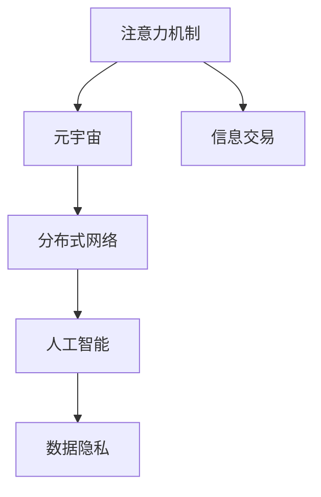

                 

# 注意力市场：元宇宙时代下的信息交易

> 关键词：注意力机制, 元宇宙, 信息交易, 分布式网络, 人工智能, 数据隐私

## 1. 背景介绍

### 1.1 问题由来
随着技术的不断进步，元宇宙的概念从科幻电影逐渐走向现实，成为全球科技公司和研究机构竞相探索的领域。元宇宙是一个高度互动和沉浸的虚拟空间，其中人们可以体验到各种虚拟社交、工作和娱乐活动。然而，元宇宙的真正价值并不仅仅在于虚拟体验的沉浸感，更重要的是它将彻底改变人们获取、处理和交易信息的方式，构建一个基于“注意力”的交易市场。

### 1.2 问题核心关键点
在元宇宙时代，信息交易不再是简单的买卖关系，而是一种基于注意力的价值交换。这种全新的信息交易范式不仅涉及到内容的生产与消费，更涉及到用户对内容的关注度、互动和参与度的权衡。通过对用户注意力的分析和交易，元宇宙中的信息市场可以实现高度定制化的内容推荐、精准广告投放以及个性化社交互动等功能，极大提升用户体验和效率。

## 2. 核心概念与联系

### 2.1 核心概念概述

为了更好地理解元宇宙中的注意力市场，我们首先需要了解以下几个核心概念：

- **注意力机制(Attention Mechanism)**：一种计算方法，用于衡量输入数据中的权重，以决定模型对不同部分信息的关注程度。在自然语言处理、计算机视觉等领域中，注意力机制被广泛应用于文本生成、图像识别和推理等任务。

- **元宇宙(Metaverse)**：一个虚拟的、持续的多人在线体验平台，提供高质量的图形、声音、互动等功能。用户可以置身其中，体验虚拟社交、购物、工作等活动。

- **信息交易(Information Trading)**：利用数字货币或虚拟货币进行信息交换的活动，包括内容订阅、广告投放、数据分析等。

- **分布式网络(Distributed Network)**：由多个节点组成的非中心化网络，每个节点可以独立运行并与其他节点进行通信。在元宇宙中，分布式网络是实现去中心化信息交易和注意力交易的基础。

- **人工智能(Artificial Intelligence, AI)**：通过算法和大数据训练的机器，可以自主地进行学习、推理和决策。在元宇宙中，AI算法能够实时分析用户行为，提供个性化的推荐和互动。

- **数据隐私(Privacy)**：指个人或组织对其数据的收集、处理和存储方式的控制和保护。在元宇宙中，确保数据隐私是构建信任、保障用户安全的重要前提。

这些核心概念之间的逻辑关系可以通过以下Mermaid流程图来展示：



这个流程图展示了一些核心概念及其之间的关联：

1. **注意力机制**：为元宇宙提供了一种高效的信息处理方法，是元宇宙信息交易的基础。
2. **元宇宙**：构建了一个沉浸式的虚拟环境，通过分布式网络实现信息交易和注意力交易。
3. **信息交易**：基于元宇宙和注意力机制，实现更加多样和灵活的信息交换方式。
4. **分布式网络**：提供了一个去中心化的基础设施，支持元宇宙和信息交易的稳定运行。
5. **人工智能**：利用算力和数据训练出智能模型，实现个性化的推荐和互动。
6. **数据隐私**：在保障用户隐私的同时，构建元宇宙的信任基础。

## 3. 核心算法原理 & 具体操作步骤

### 3.1 算法原理概述

元宇宙中的注意力交易市场，本质上是一个基于用户注意力的价值交换平台。通过用户对内容的互动和反馈，平台能够实时计算出内容的价值，并根据用户的行为动态调整价格，实现高效的信息交易。这种交易模型不仅依赖于注意力机制，还需要利用分布式网络、人工智能和大数据技术，实现用户行为分析和市场动态调整。

在算法层面，注意力交易市场主要分为以下几个步骤：

1. **内容生成与标注**：用户可以创作各种形式的内容，如文本、图片、视频等。平台对内容进行标注和分析，生成元数据。

2. **注意力计算**：通过注意力机制，计算用户对每个内容的关注程度。通常使用注意力得分矩阵，记录用户对内容的关注时间和互动情况。

3. **价值评估**：根据注意力得分，评估内容的价值。内容价值与用户互动频率、停留时间等指标成正比。

4. **价格动态调整**：根据内容价值和市场需求，动态调整内容的价格。通过分布式网络，实现全平台的定价协商。

5. **交易执行**：用户通过数字货币或虚拟货币，进行内容的购买、订阅或交换。

### 3.2 算法步骤详解

**Step 1: 内容生成与标注**

在元宇宙中，用户可以通过VR/AR设备或其他输入设备，创作各种形式的内容。平台需要对内容进行标注和分析，生成元数据。标注内容通常包括文本、图片、视频等，需要添加元数据如作者、创作时间、所属类别等。

具体流程如下：

1. **内容提交**：用户将创作的内容提交到元宇宙平台。
2. **元数据生成**：平台自动提取内容的元数据，包括标题、描述、发布时间、作者信息等。
3. **注意力分配**：对每个内容进行初始的注意力得分分配，记录用户的观看、点赞、评论等行为。

**Step 2: 注意力计算**

注意力机制用于计算用户对内容的关注程度。常用的注意力计算方法包括Attention和Transformer模型，其中Transformer模型在自然语言处理中被广泛应用。

在Transformer模型中，每个内容被表示为向量形式，用户行为也被转换为向量形式。注意力得分矩阵表示用户对每个内容的关注程度，通过计算注意力得分矩阵，平台能够实时评估用户对内容的关注程度。

具体流程如下：

1. **内容向量表示**：将每个内容转换为向量形式，通常使用词向量或图像特征向量。
2. **用户行为向量表示**：将用户的观看、点赞、评论等行为转换为向量形式。
3. **注意力得分计算**：通过计算注意力得分矩阵，得到用户对每个内容的关注程度。

**Step 3: 价值评估**

通过注意力得分，平台可以对内容的价值进行评估。通常，内容价值与用户互动频率、停留时间等指标成正比。

具体流程如下：

1. **关注度计算**：计算用户对每个内容的平均关注度，即注意力得分矩阵的平均值。
2. **停留时间计算**：计算用户对每个内容的平均停留时间，即用户观看视频或阅读文章的时间长度。
3. **价值评估**：根据关注度和停留时间，评估内容的价值。

**Step 4: 价格动态调整**

价格动态调整是元宇宙中信息交易的核心，通过分布式网络，平台可以实时调整内容的价格，实现高效的交易。

具体流程如下：

1. **市场供需分析**：平台根据市场需求和供给情况，动态调整内容的价格。
2. **价格协商**：通过分布式网络，平台进行全平台的价格协商，确保价格的合理性和透明度。
3. **价格调整**：根据市场供需和用户反馈，平台实时调整内容的价格。

**Step 5: 交易执行**

在元宇宙中，用户可以通过数字货币或虚拟货币进行内容的购买、订阅或交换。

具体流程如下：

1. **支付方式选择**：用户选择支付方式，可以是加密货币、NFT等。
2. **交易执行**：用户和内容创作者进行交易，交易过程通过智能合约自动执行。
3. **交易记录存储**：平台记录交易记录，保障交易透明和可追溯。

### 3.3 算法优缺点

元宇宙中的注意力交易市场具有以下优点：

1. **高效的交易机制**：通过实时计算和动态调整，平台能够高效地进行信息交易，满足用户和内容创作者的个性化需求。
2. **精准的推荐系统**：基于注意力机制和价值评估，平台能够提供精准的内容推荐，提升用户体验。
3. **去中心化网络**：分布式网络提供了一个去中心化的基础设施，保障了信息交易的公平性和透明性。
4. **数据隐私保护**：平台能够对用户数据进行匿名处理，保障用户隐私。

同时，该市场也存在以下局限性：

1. **技术门槛高**：元宇宙中的注意力交易涉及复杂的算法和大数据处理，技术门槛较高。
2. **市场风险大**：由于市场供需变化和用户行为的不确定性，平台面临较高的市场风险。
3. **价格波动大**：由于实时动态调整，内容价格可能会剧烈波动，影响市场的稳定性。
4. **隐私保护难题**：在保护用户隐私的同时，平台需要确保数据的安全和完整性。

尽管存在这些局限性，元宇宙中的注意力交易市场仍是一种具有巨大潜力的信息交易模式，有望彻底改变人们的获取和交易信息的方式，带来全新的体验和价值。

### 3.4 算法应用领域

元宇宙中的注意力交易市场可以应用于以下几个领域：

- **虚拟社交**：平台可以根据用户对内容的关注度，推荐适合的社交内容，提升用户互动和参与度。
- **在线教育**：平台可以根据用户对课程的关注度和互动情况，动态调整课程价格，提升课程质量。
- **虚拟购物**：平台可以根据用户对商品的关注度和购买情况，推荐适合的商品，提升购物体验。
- **虚拟娱乐**：平台可以根据用户对游戏的关注度和体验情况，动态调整游戏价格，提升游戏体验。

此外，元宇宙中的注意力交易市场还可以应用于金融、医疗、旅游等更多领域，为各行各业带来新的机遇和挑战。

## 4. 数学模型和公式 & 详细讲解

### 4.1 数学模型构建

在元宇宙中的注意力交易市场中，数学模型主要包括以下几个部分：

1. **内容向量表示**：将每个内容转换为向量形式。常用的向量表示方法包括词向量、图像特征向量等。

2. **用户行为向量表示**：将用户的观看、点赞、评论等行为转换为向量形式。

3. **注意力得分计算**：计算用户对每个内容的关注程度。

4. **价值评估**：根据注意力得分和用户互动情况，评估内容的价值。

5. **价格动态调整**：根据内容价值和市场需求，动态调整内容的价格。

### 4.2 公式推导过程

以下以Attention模型为例，推导注意力得分的计算公式。

设内容向量为 $x_i$，用户行为向量为 $u_i$，注意力得分为 $a_{ij}$，其中 $i$ 表示内容，$j$ 表示用户。

注意力得分的计算公式为：

$$
a_{ij} = \frac{\exp(s(x_i, u_i))}{\sum_{k=1}^{n} \exp(s(x_k, u_i))}
$$

其中 $s(x_i, u_i)$ 为注意力得分函数，可以是余弦相似度、点积等。

在元宇宙中，内容向量 $x_i$ 和用户行为向量 $u_i$ 可以是文本、图片、视频等形式，需要根据具体情况选择不同的向量表示方法。

### 4.3 案例分析与讲解

以虚拟购物为例，分析元宇宙中注意力交易市场的具体应用。

**Step 1: 内容生成与标注**

用户可以在元宇宙中创建虚拟商品，并将商品信息提交到平台。平台自动提取商品的元数据，包括商品名称、价格、描述等。

**Step 2: 注意力计算**

用户对商品进行观看、点赞、评论等互动行为，平台通过Attention模型计算用户对每个商品的关注度。

**Step 3: 价值评估**

根据用户对商品的关注度和互动情况，平台评估商品的价值。通常，商品价值与用户互动频率、停留时间等指标成正比。

**Step 4: 价格动态调整**

平台根据市场需求和供给情况，动态调整商品的价格。通过分布式网络，平台进行全平台的价格协商，确保价格的合理性和透明度。

**Step 5: 交易执行**

用户可以选择数字货币或虚拟货币进行商品的购买或订阅，平台记录交易记录，保障交易透明和可追溯。

通过以上流程，平台能够实时调整商品价格，提供精准的商品推荐，提升用户购物体验。

## 5. 项目实践：代码实例和详细解释说明

### 5.1 开发环境搭建

在进行元宇宙注意力交易市场的开发前，我们需要准备好开发环境。以下是使用Python进行元宇宙开发的环境配置流程：

1. **安装Python**：从官网下载并安装Python，推荐使用最新版本的Python 3.8。

2. **安装虚拟环境**：使用virtualenv或conda创建虚拟环境。

3. **安装依赖库**：安装必要的依赖库，如TensorFlow、PyTorch、Pillow等。

4. **配置分布式网络**：配置分布式网络，可以使用如Flask、Tornado等Web框架搭建分布式应用。

完成上述步骤后，即可在虚拟环境中开始元宇宙注意力交易市场的开发。

### 5.2 源代码详细实现

下面以元宇宙中的虚拟社交为例，给出使用TensorFlow进行Attention模型实现的PyTorch代码实现。

```python
import tensorflow as tf
from tensorflow.keras.layers import Input, Dense, Embedding, Dot, Add
from tensorflow.keras.models import Model

# 定义内容向量表示
def content_vector(input_shape):
    x = Input(shape=input_shape)
    x = Embedding(input_dim=10000, output_dim=64)(x)
    x = tf.keras.layers.GlobalAveragePooling1D()(x)
    return x

# 定义用户行为向量表示
def user_vector(input_shape):
    y = Input(shape=input_shape)
    y = Dense(64, activation='relu')(y)
    return y

# 定义注意力得分计算
def attention(input1, input2):
    dot = Dot(axes=[1, 1])([input1, input2])
    return tf.keras.layers.Activation('softmax')(dot)

# 定义价值评估
def value_assessment(input1, input2):
    dot = Dot(axes=[1, 1])([input1, input2])
    return tf.keras.layers.Activation('relu')(dot)

# 定义模型
input_shape = (128,)
content = content_vector(input_shape)
user = user_vector(input_shape)
attention_score = attention(content, user)
value = value_assessment(attention_score, content)
model = Model(inputs=[content, user], outputs=value)

# 编译模型
model.compile(optimizer='adam', loss='mse')

# 训练模型
model.fit([content_data, user_data], value_data, epochs=10, batch_size=32)
```

在这个代码中，我们使用TensorFlow构建了一个简单的Attention模型，用于计算用户对内容的关注程度。模型包含内容向量表示、用户行为向量表示、注意力得分计算和价值评估等部分。

**内容向量表示**：将内容转换为向量形式，使用Embedding层和GlobalAveragePooling1D层进行特征提取。

**用户行为向量表示**：将用户行为转换为向量形式，使用Dense层进行特征提取。

**注意力得分计算**：使用Dot层计算用户对每个内容的关注度，并使用Softmax激活函数进行归一化。

**价值评估**：使用Dot层计算内容价值，并使用ReLU激活函数进行非线性变换。

**模型训练**：使用adam优化器进行模型训练，损失函数为均方误差（mse）。

在实际开发中，需要根据具体场景和需求，对以上代码进行优化和调整。例如，可以增加层数、使用不同的激活函数、引入Dropout等技术，以提高模型的性能和鲁棒性。

### 5.3 代码解读与分析

在以上代码中，我们使用了TensorFlow构建了一个简单的Attention模型，用于计算用户对内容的关注程度。以下是代码的详细解读：

- **内容向量表示**：使用Embedding层将内容转换为向量形式，使用GlobalAveragePooling1D层进行特征提取。

- **用户行为向量表示**：使用Dense层将用户行为转换为向量形式。

- **注意力得分计算**：使用Dot层计算用户对每个内容的关注度，并使用Softmax激活函数进行归一化。

- **价值评估**：使用Dot层计算内容价值，并使用ReLU激活函数进行非线性变换。

- **模型编译与训练**：使用adam优化器进行模型训练，损失函数为均方误差（mse）。

在实际开发中，需要根据具体场景和需求，对以上代码进行优化和调整。例如，可以增加层数、使用不同的激活函数、引入Dropout等技术，以提高模型的性能和鲁棒性。

## 6. 实际应用场景

### 6.1 虚拟社交

在元宇宙中，虚拟社交是一个重要的应用场景。用户可以通过虚拟社交平台，与虚拟角色或现实中的朋友进行互动，体验各种虚拟活动。平台可以根据用户对内容的关注度和互动情况，推荐适合的社交内容，提升用户互动和参与度。

以虚拟社交为例，分析元宇宙中注意力交易市场的具体应用。

**Step 1: 内容生成与标注**

用户可以在元宇宙中创建虚拟角色，并将角色信息提交到平台。平台自动提取角色的元数据，包括角色名称、头像、性格等。

**Step 2: 注意力计算**

用户对虚拟角色进行互动，如聊天、点赞、送礼等行为，平台通过Attention模型计算用户对每个角色的关注度。

**Step 3: 价值评估**

根据用户对虚拟角色的关注度和互动情况，平台评估角色的价值。通常，角色价值与用户互动频率、停留时间等指标成正比。

**Step 4: 价格动态调整**

平台根据市场需求和供给情况，动态调整角色的价格。通过分布式网络，平台进行全平台的价格协商，确保价格的合理性和透明度。

**Step 5: 交易执行**

用户可以选择数字货币或虚拟货币进行角色的购买或订阅，平台记录交易记录，保障交易透明和可追溯。

通过以上流程，平台能够实时调整角色价格，提供精准的角色推荐，提升用户社交体验。

### 6.2 在线教育

在元宇宙中，在线教育是一个重要的应用场景。平台可以根据用户对课程的关注度和互动情况，动态调整课程价格，提升课程质量。

以在线教育为例，分析元宇宙中注意力交易市场的具体应用。

**Step 1: 内容生成与标注**

教师在元宇宙中创建课程内容，并将课程信息提交到平台。平台自动提取课程的元数据，包括课程名称、难度、时长等。

**Step 2: 注意力计算**

用户对课程进行观看、点赞、评论等互动行为，平台通过Attention模型计算用户对每个课程的关注度。

**Step 3: 价值评估**

根据用户对课程的关注度和互动情况，平台评估课程的价值。通常，课程价值与用户互动频率、停留时间等指标成正比。

**Step 4: 价格动态调整**

平台根据市场需求和供给情况，动态调整课程的价格。通过分布式网络，平台进行全平台的价格协商，确保价格的合理性和透明度。

**Step 5: 交易执行**

用户可以选择数字货币或虚拟货币进行课程的购买或订阅，平台记录交易记录，保障交易透明和可追溯。

通过以上流程，平台能够实时调整课程价格，提供精准的课程推荐，提升用户学习体验。

### 6.3 虚拟购物

在元宇宙中，虚拟购物是一个重要的应用场景。平台可以根据用户对商品的关注度和购买情况，推荐适合的商品，提升购物体验。

以虚拟购物为例，分析元宇宙中注意力交易市场的具体应用。

**Step 1: 内容生成与标注**

用户在元宇宙中创建虚拟商品，并将商品信息提交到平台。平台自动提取商品的元数据，包括商品名称、价格、描述等。

**Step 2: 注意力计算**

用户对商品进行观看、点赞、评论等互动行为，平台通过Attention模型计算用户对每个商品的关注度。

**Step 3: 价值评估**

根据用户对商品的关注度和互动情况，平台评估商品的价值。通常，商品价值与用户互动频率、停留时间等指标成正比。

**Step 4: 价格动态调整**

平台根据市场需求和供给情况，动态调整商品的价格。通过分布式网络，平台进行全平台的价格协商，确保价格的合理性和透明度。

**Step 5: 交易执行**

用户可以选择数字货币或虚拟货币进行商品的购买或订阅，平台记录交易记录，保障交易透明和可追溯。

通过以上流程，平台能够实时调整商品价格，提供精准的商品推荐，提升用户购物体验。

## 7. 工具和资源推荐

### 7.1 学习资源推荐

为了帮助开发者系统掌握元宇宙中注意力交易市场的理论基础和实践技巧，这里推荐一些优质的学习资源：

1. **《深度学习》课程**：斯坦福大学开设的深度学习课程，涵盖了深度学习的基本原理和应用。

2. **《机器学习》课程**：Coursera上的机器学习课程，介绍了机器学习的基本算法和模型。

3. **《TensorFlow官方文档》**：TensorFlow的官方文档，提供了完整的API文档和示例代码，是学习和实践TensorFlow的好资源。

4. **《元宇宙白皮书》**：各大科技公司和研究机构的元宇宙白皮书，提供了元宇宙的架构和应用场景。

5. **《人工智能白皮书》**：百度、谷歌等公司的AI白皮书，介绍了人工智能的基本概念和前沿技术。

通过对这些资源的学习实践，相信你一定能够快速掌握元宇宙中注意力交易市场的精髓，并用于解决实际的元宇宙应用问题。

### 7.2 开发工具推荐

高效的开发离不开优秀的工具支持。以下是几款用于元宇宙注意力交易市场开发的常用工具：

1. **TensorFlow**：由谷歌主导开发的深度学习框架，提供了丰富的算法和工具，支持大规模分布式计算。

2. **PyTorch**：由Facebook主导开发的深度学习框架，支持动态图和静态图，灵活性高。

3. **Flask**：轻量级的Web框架，支持分布式网络搭建和API接口设计。

4. **Tornado**：高并发的Web框架，适合处理大规模并发请求。

5. **TensorBoard**：TensorFlow的可视化工具，可以实时监控模型训练状态，提供丰富的图表呈现方式。

6. **Docker**：容器化技术，支持分布式应用部署和管理。

合理利用这些工具，可以显著提升元宇宙注意力交易市场的开发效率，加快创新迭代的步伐。

### 7.3 相关论文推荐

元宇宙中注意力交易市场的相关研究已经取得了丰硕成果，以下是几篇奠基性的相关论文，推荐阅读：

1. **《元宇宙：未来互联网的形态》**：论文讨论了元宇宙的基本概念、技术架构和应用场景。

2. **《注意力机制在自然语言处理中的应用》**：论文介绍了注意力机制在自然语言处理中的基本原理和应用方法。

3. **《分布式网络中的去中心化信息交易》**：论文讨论了分布式网络中的去中心化信息交易机制和算法。

4. **《元宇宙中的个性化推荐系统》**：论文讨论了元宇宙中的个性化推荐系统及其应用。

5. **《基于注意力机制的虚拟社交平台》**：论文讨论了基于注意力机制的虚拟社交平台的实现和应用。

这些论文代表了大元宇宙中注意力交易市场的方向和前沿技术，通过学习这些研究成果，可以帮助研究者把握元宇宙的前进方向，激发更多的创新灵感。

## 8. 总结：未来发展趋势与挑战

### 8.1 总结

本文对元宇宙中注意力交易市场进行了全面系统的介绍。首先阐述了元宇宙中的注意力交易市场的背景和意义，明确了其对信息交易的颠覆性影响。其次，从原理到实践，详细讲解了元宇宙注意力交易市场的核心算法和具体操作步骤，给出了具体的代码实现。同时，本文还探讨了注意力交易市场在虚拟社交、在线教育、虚拟购物等多个领域的应用前景，展示了其广阔的应用潜力。此外，本文精选了元宇宙注意力交易市场的各类学习资源和工具，力求为读者提供全方位的技术指引。

通过本文的系统梳理，可以看到，元宇宙中的注意力交易市场正在成为信息交易的新范式，极大地提升了信息获取和处理的效率和灵活性。未来，伴随元宇宙的普及和技术的不断演进，元宇宙中的注意力交易市场必将成为数字经济的重要组成部分，为各行各业带来新的机遇和挑战。

### 8.2 未来发展趋势

展望未来，元宇宙中的注意力交易市场将呈现以下几个发展趋势：

1. **技术演进加速**：伴随深度学习、分布式网络等技术的不断发展，元宇宙中的注意力交易市场将更加高效和智能。

2. **应用场景拓展**：随着元宇宙技术的成熟，注意力交易市场将在更多领域得到应用，如虚拟医疗、金融、教育等。

3. **数据隐私保护**：随着数据隐私保护技术的不断发展，元宇宙中的注意力交易市场将更加注重用户数据的隐私和安全。

4. **市场机制优化**：随着市场机制的不断优化，元宇宙中的注意力交易市场将更加公平和透明。

5. **跨平台互通**：随着跨平台技术的不断发展，元宇宙中的注意力交易市场将实现跨平台的互通和互操作。

以上趋势凸显了元宇宙中注意力交易市场的广阔前景。这些方向的探索发展，必将进一步提升元宇宙系统的性能和应用范围，为数字经济的繁荣贡献力量。

### 8.3 面临的挑战

尽管元宇宙中的注意力交易市场前景广阔，但在迈向更加智能化、普适化应用的过程中，它仍面临诸多挑战：

1. **技术门槛高**：元宇宙中的注意力交易涉及复杂的算法和大数据处理，技术门槛较高。

2. **市场风险大**：由于市场供需变化和用户行为的不确定性，市场面临较高的风险。

3. **价格波动大**：由于实时动态调整，内容价格可能会剧烈波动，影响市场的稳定性。

4. **隐私保护难题**：在保护用户隐私的同时，需要确保数据的安全和完整性。

尽管存在这些挑战，元宇宙中的注意力交易市场仍是一种具有巨大潜力的信息交易模式，有望彻底改变人们的获取和交易信息的方式，带来全新的体验和价值。

### 8.4 研究展望

面向未来，元宇宙中的注意力交易市场需要在以下几个方面寻求新的突破：

1. **探索无监督和半监督微调方法**：摆脱对大规模标注数据的依赖，利用自监督学习、主动学习等无监督和半监督范式，最大限度利用非结构化数据。

2. **研究参数高效和计算高效的微调范式**：开发更加参数高效的微调方法，在固定大部分预训练参数的同时，只更新极少量的任务相关参数。

3. **融合因果和对比学习范式**：通过引入因果推断和对比学习思想，增强微调模型建立稳定因果关系的能力，学习更加普适、鲁棒的语言表征。

4. **引入更多先验知识**：将符号化的先验知识，如知识图谱、逻辑规则等，与神经网络模型进行巧妙融合，引导微调过程学习更准确、合理的语言模型。

5. **结合因果分析和博弈论工具**：将因果分析方法引入微调模型，识别出模型决策的关键特征，增强输出解释的因果性和逻辑性。

6. **纳入伦理道德约束**：在模型训练目标中引入伦理导向的评估指标，过滤和惩罚有偏见、有害的输出倾向。加强人工干预和审核，建立模型行为的监管机制。

这些研究方向的探索，必将引领元宇宙中注意力交易市场技术迈向更高的台阶，为构建安全、可靠、可解释、可控的智能系统铺平道路。面向未来，元宇宙中的注意力交易市场还需要与其他人工智能技术进行更深入的融合，如知识表示、因果推理、强化学习等，多路径协同发力，共同推动元宇宙的繁荣发展。只有勇于创新、敢于突破，才能不断拓展元宇宙的边界，让智能技术更好地造福人类社会。

## 9. 附录：常见问题与解答

**Q1：元宇宙中注意力交易市场的技术难度高吗？**

A: 元宇宙中注意力交易市场涉及复杂的算法和大数据处理，技术难度较高。需要掌握深度学习、分布式网络、大数据等技术，并具备一定的算法实现能力。

**Q2：元宇宙中的注意力交易市场有哪些优势？**

A: 元宇宙中的注意力交易市场有以下优势：
1. 高效的交易机制：实时计算和动态调整，提升信息交易效率。
2. 精准的推荐系统：基于注意力机制，提供个性化推荐，提升用户体验。
3. 去中心化网络：分布式网络提供去中心化的基础设施，保障信息交易的公平性和透明性。
4. 数据隐私保护：通过匿名处理，保障用户数据的隐私和安全。

**Q3：元宇宙中的注意力交易市场有哪些潜在风险？**

A: 元宇宙中的注意力交易市场面临以下潜在风险：
1. 技术门槛高：涉及复杂的算法和大数据处理，技术难度较大。
2. 市场风险大：市场供需变化和用户行为的不确定性，带来较高的风险。
3. 价格波动大：实时动态调整，内容价格可能会剧烈波动，影响市场的稳定性。
4. 隐私保护难题：在保护用户隐私的同时，需要确保数据的安全和完整性。

**Q4：元宇宙中的注意力交易市场有哪些应用场景？**

A: 元宇宙中的注意力交易市场可以应用于多个领域，如虚拟社交、在线教育、虚拟购物、虚拟娱乐等。

**Q5：如何保障元宇宙中注意力交易市场的公平性和透明性？**

A: 通过分布式网络进行全平台的价格协商，确保价格的合理性和透明度。同时，采用去中心化的共识算法，如PoW、PoS等，保障市场的公平性。

---

作者：禅与计算机程序设计艺术 / Zen and the Art of Computer Programming

