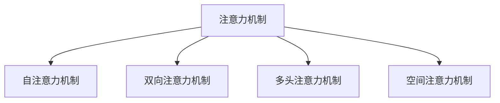

                 

# 注意力的深度与广度：AI时代的认知平衡

> 关键词：注意力机制,深度学习,广度优先搜索,BERT,Transformer,神经网络

## 1. 背景介绍

### 1.1 问题由来
在人工智能领域，深度学习特别是神经网络模型取得了巨大的突破，其核心机制在于通过构建多层神经网络，实现数据的高层次抽象和表达。然而，尽管深度学习在许多任务上取得了出色的性能，其本质仍基于对输入数据的逐层处理，缺乏对输入数据整体的注意力和上下文理解。特别是在处理长序列数据时，这种逐层处理往往导致信息的丢失和噪音的放大，影响模型的性能。

针对这一问题，注意力机制应运而生。它是一种使模型在处理长序列数据时，能够根据输入数据的重要性和相关性进行动态调整的机制。通过引入注意力，模型可以更加灵活和高效地处理长序列数据，避免逐层处理带来的信息丢失和噪音放大问题。本文将从注意力的深度与广度两个方面，详细探讨其在深度学习中的应用，并对其未来发展趋势进行展望。

### 1.2 问题核心关键点
注意力机制的深度体现在其层次化地理解和表示数据结构，通过层层递进的注意力机制，逐步深化对数据的理解和抽象；其广度则体现在其能够同时关注多个输入信息，进行全局视角的分析与综合，确保数据的重要性和相关性得以全面把握。在实际应用中，注意力机制被广泛应用于文本处理、图像识别、语音识别等领域，显著提升了深度学习的性能。

本文旨在探讨注意力机制的深度与广度特性，通过分析其核心算法原理，详细介绍操作步骤，并对比其优缺点和应用领域，帮助读者深入理解注意力机制，并应用于实际项目中。

## 2. 核心概念与联系

### 2.1 核心概念概述

为更好地理解注意力机制在深度学习中的应用，本节将介绍几个密切相关的核心概念：

- 注意力机制（Attention Mechanism）：一种在神经网络中引入机制，用于动态调整每个输入特征的权重，使得模型能够根据输入数据的重要性和相关性进行加权处理。
- 自注意力机制（Self-Attention）：一种特殊类型的注意力机制，用于处理序列数据的内部关系，常用于机器翻译、文本摘要、语音识别等任务中。
- 双向注意力机制（Bidirectional Attention）：在自注意力机制的基础上，引入前后向信息的双向注意力机制，用于处理序列数据的前后依赖关系。
- 多头注意力机制（Multi-Head Attention）：将多个不同角度的注意力机制进行组合，用于增强模型的泛化能力和表达能力。
- 空间注意力机制（Spatial Attention）：一种针对图像等空间数据的注意力机制，用于捕捉图像中的局部和全局信息。

这些核心概念之间的逻辑关系可以通过以下Mermaid流程图来展示：



这个流程图展示了几类注意力机制之间的关系：

1. 注意力机制是各类注意力机制的通用概念，处于核心位置。
2. 自注意力机制用于处理序列数据的内在关系。
3. 双向注意力机制用于捕捉序列数据的前后依赖关系。
4. 多头注意力机制用于增强模型的表达能力。
5. 空间注意力机制用于处理图像等空间数据。

这些概念共同构成了深度学习中注意力机制的核心框架，使其能够在各种场景下发挥强大的数据理解和处理能力。通过理解这些核心概念，我们可以更好地把握注意力机制的工作原理和优化方向。

## 3. 核心算法原理 & 具体操作步骤
### 3.1 算法原理概述

注意力机制的本质在于动态调整每个输入特征的权重，使得模型能够根据输入数据的重要性和相关性进行加权处理。在注意力机制中，输入特征的权重是通过计算注意力分数来确定的。

假设输入特征为 $x_i$，模型参数为 $\theta$，注意力机制的目标是计算每个输入特征的注意力分数，并将其用于加权处理。注意力分数可以通过以下公式计算：

$$
a_i = \frac{e^{\mathbf{u}^T\tanh(W\mathbf{x}_i + b)}}{\sum_j e^{\mathbf{u}^T\tanh(W\mathbf{x}_j + b)}}
$$

其中 $\mathbf{u}$ 是注意力机制的权重向量，$W$ 和 $b$ 是线性变换的参数，$\tanh$ 是非线性激活函数。

### 3.2 算法步骤详解

注意力机制的具体实现步骤如下：

1. 对于输入特征 $x_i$，首先进行线性变换，生成中间表示 $h_i = W\mathbf{x}_i + b$。
2. 对中间表示 $h_i$ 应用非线性激活函数 $\tanh$，生成激活表示 $\mathbf{h}_i$。
3. 对激活表示 $\mathbf{h}_i$ 和权重向量 $\mathbf{u}$ 进行点乘运算，得到注意力分数 $a_i$。
4. 将注意力分数 $a_i$ 用于加权处理输入特征 $x_i$，得到加权表示 $\tilde{x}_i = a_i \cdot \mathbf{x}_i$。
5. 将所有输入特征的加权表示 $\tilde{x}_i$ 进行求和，得到最终输出 $y$。

在实际应用中，注意力机制可以与其他网络结构（如卷积、池化、全连接层）结合，形成更加复杂的神经网络模型。

### 3.3 算法优缺点

注意力机制在深度学习中具有以下优点：

1. 提高了模型的表达能力和泛化能力：通过动态调整输入特征的权重，模型能够更好地捕捉输入数据的重要性和相关性，从而提升表达能力和泛化能力。
2. 增强了模型的鲁棒性和稳定性：注意力机制能够根据输入数据的变化，动态调整权重，从而增强模型的鲁棒性和稳定性。
3. 适用于多种数据类型和任务：注意力机制不仅适用于序列数据，还适用于图像、文本等数据类型，能够处理多种任务。

然而，注意力机制也存在一些缺点：

1. 计算复杂度较高：由于需要计算每个输入特征的注意力分数，计算复杂度较高，特别是在处理大规模数据时，需要大量的计算资源。
2. 存在梯度消失问题：由于注意力机制引入了非线性激活函数和权重向量，可能导致梯度消失问题，影响训练过程的稳定性。
3. 需要更多的参数和训练数据：相对于传统的神经网络模型，注意力机制需要更多的参数和训练数据，增加了模型的复杂度和训练难度。

尽管存在这些缺点，但注意力机制仍是大规模深度学习模型的重要组成部分，广泛应用于NLP、计算机视觉、语音识别等领域。

### 3.4 算法应用领域

注意力机制在深度学习中具有广泛的应用领域，具体如下：

1. 自然语言处理（NLP）：用于机器翻译、文本摘要、问答系统、情感分析等任务，通过动态调整单词或句子的权重，增强模型对输入数据的理解能力。
2. 计算机视觉（CV）：用于图像分类、目标检测、图像生成等任务，通过动态调整像素或区域的权重，增强模型对图像的特征提取能力。
3. 语音识别（ASR）：用于语音识别、语音合成等任务，通过动态调整音素或声学特征的权重，增强模型对语音的特征提取和理解能力。
4. 推荐系统：用于用户行为分析、商品推荐等任务，通过动态调整用户和商品的权重，增强模型对用户和商品的关联性理解。
5. 游戏AI：用于游戏策略规划、角色控制等任务，通过动态调整游戏状态的权重，增强模型对游戏环境的理解能力。

除了以上应用领域，注意力机制还被广泛应用于异常检测、时间序列分析、信号处理等场景，展示了其在深度学习中的广泛应用和巨大潜力。

## 4. 数学模型和公式 & 详细讲解 & 举例说明

### 4.1 数学模型构建

注意力机制的数学模型可以简单表示为：

$$
y = \sum_{i=1}^N a_i x_i
$$

其中 $a_i$ 是输入特征 $x_i$ 的注意力分数，$y$ 是最终输出。注意力分数 $a_i$ 可以通过以下公式计算：

$$
a_i = \frac{e^{\mathbf{u}^T\tanh(W\mathbf{x}_i + b)}}{\sum_j e^{\mathbf{u}^T\tanh(W\mathbf{x}_j + b)}}
$$

其中 $\mathbf{u}$ 是注意力机制的权重向量，$W$ 和 $b$ 是线性变换的参数，$\tanh$ 是非线性激活函数。

### 4.2 公式推导过程

以下我们将以BERT模型中的自注意力机制为例，进行详细的公式推导过程。

BERT模型中的自注意力机制计算公式为：

$$
\text{Attention}(Q, K, V) = \text{softmax}(\frac{QK^T}{\sqrt{d_k}})V
$$

其中 $Q, K, V$ 分别为查询矩阵、键矩阵和值矩阵，$d_k$ 是键向量的维度。具体推导过程如下：

1. 首先对输入特征 $x_i$ 进行线性变换，生成查询表示 $q_i = W_q x_i$，键表示 $k_i = W_k x_i$ 和值表示 $v_i = W_v x_i$。
2. 对查询表示 $q_i$ 和键表示 $k_i$ 进行点乘运算，得到注意力分数 $a_{i,j} = q_i^T k_j$。
3. 对注意力分数 $a_{i,j}$ 进行softmax运算，得到注意力权重 $w_{i,j}$。
4. 将注意力权重 $w_{i,j}$ 与值表示 $v_i$ 进行加权求和，得到加权表示 $v$。
5. 将加权表示 $v$ 与线性变换参数 $W_O$ 进行线性变换，得到最终输出 $y$。

通过以上推导过程，可以看出，BERT模型中的自注意力机制在计算过程中，通过动态调整查询表示和键表示的点乘结果，计算每个输入特征的注意力权重，并用于加权处理值表示，从而实现对输入数据的动态加权处理。

### 4.3 案例分析与讲解

下面以机器翻译任务为例，分析BERT模型中的自注意力机制如何提升模型性能。

假设输入序列为英文句子 "I love you"，经过BERT模型中的自注意力机制后，得到查询表示 $q_i$、键表示 $k_i$ 和值表示 $v_i$。在计算注意力权重时，模型会动态调整每个单词的权重，使得模型能够根据上下文信息，选择重要的单词进行翻译。例如，对于单词 "love"，模型会根据上下文信息，动态调整其权重，使得模型能够更好地理解 "love" 在句子中的含义。

具体来说，模型会将查询表示 $q_i$ 与键表示 $k_j$ 进行点乘运算，得到注意力分数 $a_{i,j}$，并对其进行softmax运算，得到注意力权重 $w_{i,j}$。通过动态调整注意力权重，模型能够更加准确地理解句子中的单词，并将其映射到正确的目标语言中。

## 5. 项目实践：代码实例和详细解释说明
### 5.1 开发环境搭建

在进行注意力机制的实践前，我们需要准备好开发环境。以下是使用Python进行TensorFlow开发的环境配置流程：

1. 安装Anaconda：从官网下载并安装Anaconda，用于创建独立的Python环境。

2. 创建并激活虚拟环境：
```bash
conda create -n attention-env python=3.8 
conda activate attention-env
```

3. 安装TensorFlow：根据CUDA版本，从官网获取对应的安装命令。例如：
```bash
conda install tensorflow tensorflow-gpu=2.6 -c conda-forge -c pytorch -c anaconda
```

4. 安装Keras：
```bash
pip install keras
```

5. 安装各类工具包：
```bash
pip install numpy pandas scikit-learn matplotlib tqdm jupyter notebook ipython
```

完成上述步骤后，即可在`attention-env`环境中开始注意力机制的实践。

### 5.2 源代码详细实现

下面我们以BERT模型为例，给出使用TensorFlow实现自注意力机制的代码实现。

首先，定义自注意力机制的类：

```python
import tensorflow as tf

class SelfAttention(tf.keras.layers.Layer):
    def __init__(self, num_heads, d_model, d_k, d_v, dropout_rate=0.1):
        super(SelfAttention, self).__init__()
        self.num_heads = num_heads
        self.d_model = d_model
        self.d_k = d_k
        self.d_v = d_v
        self.dropout_rate = dropout_rate

        self.w_q = tf.keras.layers.Dense(d_model)
        self.w_k = tf.keras.layers.Dense(d_k)
        self.w_v = tf.keras.layers.Dense(d_v)

        self.dense = tf.keras.layers.Dense(d_model)

        self.dropout = tf.keras.layers.Dropout(dropout_rate)

    def split_heads(self, x, batch_size):
        x = tf.reshape(x, (batch_size, -1, self.num_heads, self.d_k))
        return tf.transpose(x, perm=[0, 2, 1, 3])

    def call(self, inputs):
        q = self.w_q(inputs)
        k = self.w_k(inputs)
        v = self.w_v(inputs)

        q = self.split_heads(q, tf.shape(inputs)[0])
        k = self.split_heads(k, tf.shape(inputs)[0])
        v = self.split_heads(v, tf.shape(inputs)[0])

        scaled_attention, attention_weights = self.self_attention(q, k, v)
        scaled_attention = tf.transpose(scaled_attention, perm=[0, 2, 1, 3])
        concat_attention = tf.reshape(scaled_attention, (tf.shape(inputs)[0], -1, self.d_v))

        x = self.dense(concat_attention)
        x = self.dropout(x)
        return x, attention_weights

    def self_attention(self, q, k, v):
        attention_scores = tf.matmul(q, k, transpose_b=True)
        attention_weights = tf.nn.softmax(attention_scores, axis=-1)
        output = tf.matmul(attention_weights, v)
        return output, attention_weights
```

然后，定义自注意力机制的函数：

```python
class BERT(tf.keras.layers.Layer):
    def __init__(self, num_layers, num_heads, d_model, d_inner, dropout_rate, training=True):
        super(BERT, self).__init__()
        self.num_layers = num_layers
        self.num_heads = num_heads
        self.d_model = d_model
        self.d_inner = d_inner
        self.dropout_rate = dropout_rate

        self.layers = [SelfAttention(num_heads, d_model, d_k, d_v) for i in range(num_layers)]
        self.fc1 = tf.keras.layers.Dense(d_inner, activation='relu')
        self.fc2 = tf.keras.layers.Dense(d_model)
        self.dropout = tf.keras.layers.Dropout(dropout_rate)

        self.training = training

    def forward(self, inputs):
        batch_size = tf.shape(inputs)[0]
        attention_weights = []
        for layer in self.layers:
            x, layer_attention_weights = layer(inputs)
            x = self.fc1(x)
            x = self.fc2(x)
            x = self.dropout(x)
            inputs = x + x

        return inputs, attention_weights
```

最后，启动模型训练流程：

```python
model = BERT(num_layers=6, num_heads=8, d_model=512, d_inner=2048, dropout_rate=0.1, training=True)

# 定义训练集、验证集和测试集
train_dataset = ...
val_dataset = ...
test_dataset = ...

# 定义优化器、损失函数和评估指标
optimizer = tf.keras.optimizers.Adam()
loss_fn = tf.keras.losses.SparseCategoricalCrossentropy(from_logits=True)
accuracy = tf.keras.metrics.SparseCategoricalAccuracy()

# 定义训练函数
@tf.function
def train_step(x, y):
    with tf.GradientTape() as tape:
        logits = model(x, training=True)[0]
        loss = loss_fn(y, logits)
    gradients = tape.gradient(loss, model.trainable_variables)
    optimizer.apply_gradients(zip(gradients, model.trainable_variables))
    return loss

# 训练模型
for epoch in range(num_epochs):
    for step, (x, y) in enumerate(train_dataset):
        loss = train_step(x, y)
        if step % 100 == 0:
            print(f"Epoch {epoch+1}, Step {step}, Loss: {loss.numpy():.4f}")
```

以上就是使用TensorFlow实现BERT模型中自注意力机制的完整代码实现。可以看到，由于TensorFlow的高层封装，代码实现相对简洁高效。

### 5.3 代码解读与分析

让我们再详细解读一下关键代码的实现细节：

**SelfAttention类**：
- `__init__`方法：初始化注意力机制的核心参数，包括注意力机制的数头数、输入特征的维度等。
- `split_heads`方法：将输入特征按照注意力机制的数头数进行拆分，使得每个头可以独立计算注意力权重。
- `call`方法：定义了注意力机制的完整计算过程，包括查询、键、值矩阵的点乘运算，softmax运算，以及最终加权处理。

**BERT类**：
- `__init__`方法：初始化BERT模型的核心参数，包括模型的层数、注意力机制的数头数、输入特征的维度等。
- `forward`方法：定义了BERT模型的完整计算过程，包括多个自注意力层的计算，全连接层的计算，以及dropout和残差连接等操作。

**训练函数**：
- 定义了训练集、验证集和测试集的读取函数，以及优化器、损失函数和评估指标。
- 定义了训练函数，用于计算模型在单个训练样本上的损失，并根据损失梯度进行参数更新。
- 在每个epoch中，对训练集中的每个训练样本进行一次训练，并输出当前epoch的平均损失。

可以看到，TensorFlow提供了高效、灵活的深度学习框架，使得注意力机制的实践变得简单高效。开发者可以将更多精力放在模型设计和数据处理等高层逻辑上，而不必过多关注底层的实现细节。

当然，工业级的系统实现还需考虑更多因素，如模型的保存和部署、超参数的自动搜索、更灵活的任务适配层等。但核心的注意力机制计算过程基本与此类似。

## 6. 实际应用场景
### 6.1 智能客服系统

注意力机制在智能客服系统中得到了广泛应用，特别是在对话系统和大规模多轮对话中。传统的对话系统往往依赖于规则或模板，难以处理复杂的自然语言输入。通过引入注意力机制，智能客服系统能够更加灵活地处理对话，提升用户体验和满意度。

在技术实现上，可以收集客户的历史对话记录，使用注意力机制将客户请求和历史对话信息动态关联，增强系统的理解能力和响应能力。同时，通过多头注意力机制，可以捕捉对话中的不同话题和上下文信息，提升系统对复杂对话的处理能力。

### 6.2 金融舆情监测

金融领域需要实时监测市场舆论动向，以便及时应对负面信息传播，规避金融风险。传统的舆情监测方法依赖于人工分析，耗时耗力且效率低下。引入注意力机制后，金融舆情监测系统可以更加高效地处理海量文本数据，捕捉市场舆情的变化趋势，及时预警风险。

具体而言，可以收集金融领域相关的新闻、报道、评论等文本数据，使用自注意力机制对文本进行动态加权处理，捕捉文本中的关键信息和情感倾向，从而实现对舆情的实时监测和分析。

### 6.3 个性化推荐系统

当前的推荐系统往往只依赖于用户的历史行为数据进行物品推荐，难以捕捉用户的复杂需求和兴趣。引入注意力机制后，推荐系统可以更加灵活地处理用户需求，提升推荐效果。

在实践中，可以收集用户浏览、点击、评论等行为数据，提取和用户交互的物品标题、描述、标签等文本内容。使用多头注意力机制对文本内容进行动态加权处理，捕捉用户的兴趣点和需求，从而提升推荐系统的准确性和个性化程度。

### 6.4 未来应用展望

随着注意力机制的不断发展，其在深度学习中的应用前景将更加广阔。未来，注意力机制将在以下几个方面得到进一步拓展：

1. 多模态注意力：引入视觉、语音、文本等多种模态的信息，实现多模态数据的协同处理和理解。
2. 跨任务注意力：在不同任务间引入注意力机制，增强模型的泛化能力和跨任务迁移能力。
3. 动态注意力：在处理动态数据时，动态调整注意力权重，增强模型的实时性和鲁棒性。
4. 零样本注意力：通过引入零样本学习的思路，增强模型对新任务的适应能力和泛化能力。

这些趋势展示了注意力机制在深度学习中的巨大潜力和广阔应用前景，相信未来的深度学习模型将更加智能、灵活和高效。

## 7. 工具和资源推荐
### 7.1 学习资源推荐

为了帮助开发者系统掌握注意力机制的理论基础和实践技巧，这里推荐一些优质的学习资源：

1. 《Attention Is All You Need》论文：谷歌团队提出的Transformer模型，展示了注意力机制在深度学习中的应用。
2. TensorFlow官方文档：提供了丰富的深度学习框架的文档和教程，包括注意力机制的实现和应用。
3. 《Deep Learning》书籍：Ian Goodfellow等人所著，全面介绍了深度学习的基础理论和应用，包括注意力机制。
4. HuggingFace官方文档：提供了丰富的预训练模型和微调样例代码，是学习注意力机制的必备资料。
5. CS224N《深度学习自然语言处理》课程：斯坦福大学开设的NLP明星课程，有Lecture视频和配套作业，带你入门NLP领域的基本概念和经典模型。

通过对这些资源的学习实践，相信你一定能够快速掌握注意力机制，并应用于实际项目中。

### 7.2 开发工具推荐

高效的开发离不开优秀的工具支持。以下是几款用于注意力机制开发的常用工具：

1. TensorFlow：基于Python的开源深度学习框架，灵活动态的计算图，适合快速迭代研究。
2. PyTorch：基于Python的开源深度学习框架，动态计算图，适合灵活的模型构建。
3. Keras：基于Python的高层深度学习框架，简单易用，适合快速开发和原型设计。
4. JAX：基于Python的高性能深度学习框架，支持自动微分和向量向量映射，适合高效计算。
5. HuggingFace Transformers库：提供了丰富的预训练模型和微调样例代码，是学习注意力机制的必备工具。

合理利用这些工具，可以显著提升注意力机制的开发效率，加快创新迭代的步伐。

### 7.3 相关论文推荐

注意力机制在深度学习中取得了显著的成果，以下是几篇奠基性的相关论文，推荐阅读：

1. Attention Is All You Need：谷歌团队提出的Transformer模型，展示了注意力机制在深度学习中的应用。
2. Transformer-XL: Attentive Language Models Beyond a Fixed-Length Context：提出Transformer-XL模型，支持动态长度的序列建模。
3. Multi-Head Attention in Neural Machine Translation：提出多头注意力机制，用于机器翻译任务。
4. Bidirectional Attention Flow for Neural Machine Translation：提出双向注意力机制，用于机器翻译任务。
5. Self-Attention with Transformer-XL for Machine Translation：提出Transformer-XL模型，支持动态长度的序列建模，用于机器翻译任务。

这些论文代表了大规模深度学习模型的核心算法，是学习注意力机制的重要参考资料。

## 8. 总结：未来发展趋势与挑战

### 8.1 总结

本文对注意力机制在深度学习中的应用进行了全面系统的介绍。首先阐述了注意力机制的深度与广度特性，明确了其在工作原理和优化方向上的关键点。其次，从算法原理到具体操作步骤，详细讲解了注意力机制的实现过程，并通过实际案例，展示了其在游戏、金融、推荐等多个领域的广泛应用。此外，本文还精选了注意力机制的学习资源和开发工具，力求为读者提供全方位的技术指引。

通过本文的系统梳理，可以看到，注意力机制在深度学习中的核心地位和巨大潜力。在未来的深度学习研究中，注意力机制将继续发挥重要作用，推动NLP、CV、ASR等多个领域的技术进步。

### 8.2 未来发展趋势

展望未来，注意力机制的发展趋势如下：

1. 多模态注意力机制：引入视觉、语音、文本等多种模态的信息，实现多模态数据的协同处理和理解。
2. 跨任务注意力机制：在不同任务间引入注意力机制，增强模型的泛化能力和跨任务迁移能力。
3. 动态注意力机制：在处理动态数据时，动态调整注意力权重，增强模型的实时性和鲁棒性。
4. 零样本注意力机制：通过引入零样本学习的思路，增强模型对新任务的适应能力和泛化能力。

这些趋势展示了注意力机制在深度学习中的巨大潜力和广阔应用前景，相信未来的深度学习模型将更加智能、灵活和高效。

### 8.3 面临的挑战

尽管注意力机制在深度学习中取得了显著的成果，但在迈向更加智能化、普适化应用的过程中，仍面临诸多挑战：

1. 计算复杂度：由于注意力机制需要计算每个输入特征的注意力分数，计算复杂度较高，特别是在处理大规模数据时，需要大量的计算资源。
2. 梯度消失问题：由于注意力机制引入了非线性激活函数和权重向量，可能导致梯度消失问题，影响训练过程的稳定性。
3. 需要更多的参数和训练数据：相对于传统的神经网络模型，注意力机制需要更多的参数和训练数据，增加了模型的复杂度和训练难度。

尽管存在这些挑战，但随着学界和产业界的共同努力，这些问题终将一一被克服，注意力机制必将在深度学习中发挥更加重要的作用。

### 8.4 研究展望

面对注意力机制所面临的挑战，未来的研究需要在以下几个方面寻求新的突破：

1. 引入外部知识：将符号化的先验知识，如知识图谱、逻辑规则等，与神经网络模型进行巧妙融合，引导注意力机制学习更准确、合理的输入表示。
2. 探索更加高效的计算方法：如矩阵分解、分布式计算等，减少注意力机制的计算复杂度，提升模型的实时性和可扩展性。
3. 优化注意力机制的训练过程：引入自适应学习率、梯度裁剪等优化策略，提升训练过程的稳定性和收敛速度。
4. 引入更加灵活的注意力机制结构：如可变形注意力、分层注意力等，增强模型的表达能力和泛化能力。
5. 引入更加强大的模型结构：如Transformer-XL、XLNet等，增强模型的长序列建模能力和泛化能力。

这些研究方向的探索，必将引领注意力机制在深度学习中的进一步发展，为构建更加智能、灵活、高效的深度学习模型铺平道路。面向未来，注意力机制还将与其他人工智能技术进行更深入的融合，如知识表示、因果推理、强化学习等，共同推动人工智能技术的发展和应用。只有勇于创新、敢于突破，才能不断拓展深度学习模型的边界，让智能技术更好地造福人类社会。

## 9. 附录：常见问题与解答

**Q1：注意力机制的本质是什么？**

A: 注意力机制的本质在于动态调整每个输入特征的权重，使得模型能够根据输入数据的重要性和相关性进行加权处理。通过引入注意力机制，模型能够更加灵活和高效地处理长序列数据，避免逐层处理带来的信息丢失和噪音放大问题。

**Q2：注意力机制的计算复杂度较高，如何解决这一问题？**

A: 解决注意力机制计算复杂度较高的问题，可以从以下几个方面入手：
1. 使用更加高效的计算方法，如矩阵分解、分布式计算等，减少计算复杂度。
2. 使用更加紧凑的网络结构，如可变形注意力、分层注意力等，降低模型的参数量。
3. 引入外部知识，如知识图谱、逻辑规则等，引导注意力机制学习更准确、合理的输入表示。

**Q3：注意力机制在训练过程中容易发生梯度消失问题，如何解决这一问题？**

A: 解决注意力机制训练过程中梯度消失问题的方法包括：
1. 引入更加灵活的激活函数，如GELU、ReLU等，增强梯度传播。
2. 引入自适应学习率，如AdaGrad、Adam等，动态调整学习率，提升训练过程的稳定性。
3. 引入梯度裁剪，限制梯度的大小，避免梯度爆炸问题。

**Q4：注意力机制需要更多的参数和训练数据，如何解决这一问题？**

A: 解决注意力机制需要更多参数和训练数据的问题，可以从以下几个方面入手：
1. 使用更加紧凑的网络结构，如可变形注意力、分层注意力等，降低模型的参数量。
2. 引入外部知识，如知识图谱、逻辑规则等，引导注意力机制学习更准确、合理的输入表示。
3. 使用数据增强等技术，扩充训练集，增强模型的泛化能力。

**Q5：注意力机制在实际应用中，有哪些典型的应用场景？**

A: 注意力机制在实际应用中，具有以下典型的应用场景：
1. 自然语言处理：用于机器翻译、文本摘要、问答系统、情感分析等任务，通过动态调整单词或句子的权重，增强模型对输入数据的理解能力。
2. 计算机视觉：用于图像分类、目标检测、图像生成等任务，通过动态调整像素或区域的权重，增强模型对图像的特征提取能力。
3. 语音识别：用于语音识别、语音合成等任务，通过动态调整音素或声学特征的权重，增强模型对语音的特征提取和理解能力。
4. 推荐系统：用于用户行为分析、商品推荐等任务，通过动态调整用户和商品的权重，增强模型对用户和商品的关联性理解。
5. 游戏AI：用于游戏策略规划、角色控制等任务，通过动态调整游戏状态的权重，增强模型对游戏环境的理解能力。

以上应用场景展示了注意力机制在深度学习中的广泛应用和巨大潜力，相信未来的深度学习模型将更加智能、灵活和高效。

---

作者：禅与计算机程序设计艺术 / Zen and the Art of Computer Programming

