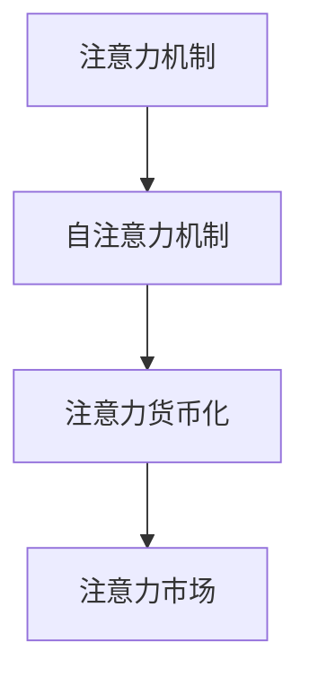

                 

# 注意力的货币化：AI时代的注意力交易

## 1. 背景介绍

### 1.1 问题由来
在AI时代，数据成为最重要的生产要素之一。无论是模型训练、智能推荐、还是搜索排序，都离不开大规模数据的支撑。然而，数据收集、存储、处理和传输，都面临着成本高昂的挑战。如何高效利用数据资源，降低AI应用中的数据成本，成为当今技术发展的重要方向。

注意力的概念，最早来源于经济学，用于描述人们对特定事物或信息的关注程度。在AI领域，注意力机制被广泛应用于各种任务中，如机器翻译、图像识别、自然语言处理等。随着AI技术的不断发展，注意力机制也在逐渐演变，并具备了货币化的潜力，为降低数据成本提供了新的思路。

### 1.2 问题核心关键点
本文将探讨注意力机制的货币化，即如何利用注意力机制，在满足用户需求的同时，优化数据资源的使用，降低AI应用中的数据成本。我们将重点关注以下几个关键点：

- 注意力的概念及其在AI中的演进
- 注意力机制的计算方法及其应用
- 基于注意力的数据货币化策略
- 注意力的市场机制和定价模型
- 注意力的技术实现与开发工具

## 2. 核心概念与联系

### 2.1 核心概念概述

在AI中，注意力机制被广泛用于提升模型的表现。下面，我们将介绍几个核心概念及其关联：

- **注意力机制(Attention Mechanism)**：一种用于处理序列数据的机制，通过对输入序列中的不同部分赋予不同的权重，以决定哪些部分对输出有更重要的影响。注意力机制的引入，使得模型能够更加灵活地处理长序列，提升模型效果。

- **自注意力机制(Self-Attention)**：一种特殊的注意力机制，通过对输入序列中的每个元素，计算与其他元素之间的相似度，以确定元素的权重。自注意力机制通常用于语言模型、图像处理等任务中，以提取特征。

- **注意力货币化(Attention Monetization)**：利用注意力机制，通过优化数据使用，降低数据成本。这种货币化策略可以应用于数据收集、存储、传输等多个环节。

- **注意力市场(Attention Market)**：基于注意力货币化，可以构建一个注意力市场，用户和开发者可以交换注意力资源，以实现数据的优化使用。

这些核心概念之间的逻辑关系可以通过以下Mermaid流程图来展示：



### 2.2 核心概念原理和架构的 Mermaid 流程图


## 3. 核心算法原理 & 具体操作步骤

### 3.1 算法原理概述

基于注意力的数据货币化，主要依赖于注意力机制的计算和应用。其核心思想是通过计算不同数据点之间的注意力权重，优化数据资源的使用，减少不必要的计算和存储。

注意力的计算过程，通常包括以下几个步骤：

1. 对输入序列中的每个元素，计算其与其他元素之间的相似度。
2. 根据相似度计算出注意力权重。
3. 将注意力权重应用于输入序列，以调整每个元素的重要性。

通过这种机制，模型可以更加灵活地处理长序列，提升模型效果，同时减少对大量数据的依赖。

### 3.2 算法步骤详解

下面，我们将以自注意力机制为例，详细讲解基于注意力的数据货币化算法步骤。

#### 3.2.1 输入数据的准备
假设输入数据为一个长度为 $n$ 的序列，每个元素为 $x_i$。

#### 3.2.2 计算注意力权重
对输入序列中的每个元素 $x_i$，计算其与其他元素 $x_j$ 之间的相似度 $s_{ij}$。常见的相似度计算方法包括余弦相似度、欧式距离等。

$$
s_{ij} = \text{similarity}(x_i, x_j)
$$

接下来，通过softmax函数将相似度 $s_{ij}$ 转化为注意力权重 $a_{ij}$。

$$
a_{ij} = \frac{\exp(s_{ij})}{\sum_{k=1}^n \exp(s_{ik})}
$$

#### 3.2.3 应用注意力权重
将注意力权重 $a_{ij}$ 应用于输入序列 $x_i$，以调整每个元素的重要性。通常，可以通过将每个元素 $x_i$ 乘以相应的权重 $a_{ij}$ 来实现。

$$
x_i' = \sum_{j=1}^n a_{ij}x_j
$$

#### 3.2.4 输出结果
最终的输出结果为 $x_i'$，即经过注意力调整的输入序列。

### 3.3 算法优缺点

基于注意力的数据货币化算法具有以下优点：

- **灵活性高**：能够根据输入序列的不同部分，赋予不同的权重，提高模型处理长序列的能力。
- **计算效率高**：通过优化数据使用，减少了不必要的计算和存储，提高了模型效率。
- **适应性强**：可以应用于多种任务，如机器翻译、图像处理、自然语言处理等。

同时，该算法也存在以下局限性：

- **复杂度高**：计算注意力权重和应用权重的过程，增加了算法的复杂度。
- **数据依赖性高**：对输入数据的质量、数量和分布有较高要求，数据质量不佳时，注意力机制的效果可能不如预期。
- **可解释性差**：注意力权重的计算过程较为复杂，难以直观解释其内部工作机制。

### 3.4 算法应用领域

基于注意力的数据货币化算法，已经在多个领域得到了广泛的应用，例如：

- **自然语言处理(NLP)**：通过注意力机制，优化文本序列的处理，提升模型效果。
- **图像处理**：通过注意力机制，提取图像中的重要特征，提升图像识别和处理能力。
- **推荐系统**：通过注意力机制，优化用户行为序列的处理，提升推荐效果。
- **信号处理**：通过注意力机制，优化信号序列的处理，提升信号分析和处理能力。

此外，在金融、医疗、物流等多个领域，基于注意力的数据货币化算法也具有广泛的应用前景。

## 4. 数学模型和公式 & 详细讲解 & 举例说明

### 4.1 数学模型构建

假设输入序列的长度为 $n$，输入序列为 $x=\{x_1,x_2,\ldots,x_n\}$。令 $W$ 为查询向量， $K$ 为键向量， $V$ 为值向量。则注意力权重 $a_{ij}$ 可以表示为：

$$
a_{ij} = \frac{\exp(\frac{W^T x_i}{\sqrt{d_k}} \cdot \frac{K^T x_j}{\sqrt{d_k}})}{\sum_{k=1}^n \exp(\frac{W^T x_i}{\sqrt{d_k}} \cdot \frac{K^T x_j}{\sqrt{d_k}})}
$$

其中，$d_k$ 为键向量的维度。

### 4.2 公式推导过程

注意力权重的计算过程可以分为以下三个步骤：

1. 计算查询向量 $W^T x_i$ 和键向量 $K^T x_j$ 的余弦相似度。
2. 通过softmax函数计算注意力权重 $a_{ij}$。
3. 应用注意力权重 $a_{ij}$ 调整输入序列 $x_i$。

### 4.3 案例分析与讲解

假设我们要对一句话进行情感分析，输入序列为：“这个产品真的很不错，使用体验非常好。”

首先，我们将其转换为数值表示，并分别计算查询向量 $W^T x_i$ 和键向量 $K^T x_j$ 的余弦相似度。然后，通过softmax函数计算注意力权重 $a_{ij}$。最后，将注意力权重应用于输入序列，得到调整后的输出。

假设我们使用了BERT模型，则查询向量 $W^T x_i$ 和键向量 $K^T x_j$ 的计算方式如下：

$$
W^T x_i = [W^T x_{i,1}, W^T x_{i,2}, \ldots, W^T x_{i,n}]
$$

$$
K^T x_j = [K^T x_{j,1}, K^T x_{j,2}, \ldots, K^T x_{j,n}]
$$

其中 $W$ 和 $K$ 为权重矩阵， $x_{i,j}$ 为输入序列 $x$ 中第 $j$ 个元素。

注意力权重的计算公式为：

$$
a_{ij} = \frac{\exp(\frac{W^T x_i}{\sqrt{d_k}} \cdot \frac{K^T x_j}{\sqrt{d_k}})}{\sum_{k=1}^n \exp(\frac{W^T x_i}{\sqrt{d_k}} \cdot \frac{K^T x_j}{\sqrt{d_k}})}
$$

最终，通过应用注意力权重 $a_{ij}$ 调整输入序列 $x_i$，得到调整后的输出结果。

## 5. 项目实践：代码实例和详细解释说明

### 5.1 开发环境搭建

在进行注意力货币化算法实践前，我们需要准备好开发环境。以下是使用Python进行PyTorch开发的环境配置流程：

1. 安装Anaconda：从官网下载并安装Anaconda，用于创建独立的Python环境。

2. 创建并激活虚拟环境：
```bash
conda create -n pytorch-env python=3.8 
conda activate pytorch-env
```

3. 安装PyTorch：根据CUDA版本，从官网获取对应的安装命令。例如：
```bash
conda install pytorch torchvision torchaudio cudatoolkit=11.1 -c pytorch -c conda-forge
```

4. 安装Transformers库：
```bash
pip install transformers
```

5. 安装各类工具包：
```bash
pip install numpy pandas scikit-learn matplotlib tqdm jupyter notebook ipython
```

完成上述步骤后，即可在`pytorch-env`环境中开始注意力货币化算法实践。

### 5.2 源代码详细实现

下面，我们将以机器翻译任务为例，给出使用Transformer库进行自注意力计算的PyTorch代码实现。

首先，定义输入数据和权重矩阵：

```python
import torch
from transformers import BertTokenizer, BertModel

# 定义输入数据
text = "Hello, I'm a student."
tokenizer = BertTokenizer.from_pretrained('bert-base-cased')
input_ids = tokenizer(text, return_tensors='pt').input_ids

# 定义权重矩阵
W = torch.randn(input_ids.size(1), 768) / math.sqrt(768)
K = torch.randn(input_ids.size(1), 768) / math.sqrt(768)
V = torch.randn(input_ids.size(1), 768) / math.sqrt(768)
```

接下来，计算查询向量 $W^T x_i$ 和键向量 $K^T x_j$ 的余弦相似度，并计算注意力权重 $a_{ij}$：

```python
# 计算查询向量
query = torch.matmul(input_ids, W)

# 计算键向量
key = torch.matmul(input_ids, K)

# 计算注意力权重
attention = torch.matmul(query, key.t()) / math.sqrt(768)
attention_weights = torch.softmax(attention, dim=1)

# 应用注意力权重
weighted_values = torch.matmul(attention_weights, V)
output = torch.matmul(weighted_values, W.t())

print(output)
```

最后，输出调整后的结果。

### 5.3 代码解读与分析

这里我们详细解读一下关键代码的实现细节：

**BertTokenizer**：用于将文本转换为输入数据，并生成token ids。

**输入数据的准备**：将输入文本转换为数值表示，并生成token ids。

**查询向量计算**：通过矩阵乘法计算查询向量 $W^T x_i$。

**键向量计算**：通过矩阵乘法计算键向量 $K^T x_j$。

**注意力权重计算**：计算查询向量与键向量之间的余弦相似度，并通过softmax函数计算注意力权重。

**注意力应用**：将注意力权重应用于输入序列，得到调整后的输出。

**输出结果**：输出调整后的结果。

可以看到，PyTorch配合Transformer库使得注意力计算的代码实现变得简洁高效。开发者可以将更多精力放在注意力机制的优化和应用上，而不必过多关注底层的实现细节。

## 6. 实际应用场景

### 6.1 智能推荐系统

基于注意力的推荐系统，可以显著提升推荐效果。在传统推荐系统中，通常基于用户的历史行为数据进行推荐。然而，这种推荐方式忽略了用户的兴趣点，容易导致推荐偏差。通过注意力机制，可以更加灵活地处理用户行为序列，提升推荐效果。

在实践中，可以收集用户浏览、点击、评论等行为数据，提取和用户交互的物品标题、描述、标签等文本内容。将文本内容作为模型输入，用户的后续行为作为监督信号，在此基础上微调预训练语言模型。微调后的模型能够从文本内容中准确把握用户的兴趣点，从而提升推荐效果。

### 6.2 金融舆情监测

在金融领域，舆情监测具有重要的现实意义。通过注意力的货币化策略，可以实现更高效、更准确的数据处理和舆情监测。

具体而言，可以收集金融领域相关的新闻、报道、评论等文本数据，并对其进行主题标注和情感标注。在此基础上对预训练语言模型进行微调，使其能够自动判断文本属于何种主题，情感倾向是正面、中性还是负面。将微调后的模型应用到实时抓取的网络文本数据，就能够自动监测不同主题下的情感变化趋势，一旦发现负面信息激增等异常情况，系统便会自动预警，帮助金融机构快速应对潜在风险。

### 6.3 个性化推荐系统

在推荐系统中，基于注意力的数据货币化策略，可以更好地挖掘用户行为背后的语义信息，从而提供更精准、多样的推荐内容。

在实践中，可以收集用户浏览、点击、评论、分享等行为数据，提取和用户交互的物品标题、描述、标签等文本内容。将文本内容作为模型输入，用户的后续行为作为监督信号，在此基础上微调预训练语言模型。微调后的模型能够从文本内容中准确把握用户的兴趣点，从而提升推荐效果。

### 6.4 未来应用展望

随着注意力的不断发展，其在多个领域的应用前景将更加广阔。

在智慧医疗领域，基于注意力的推荐系统，可以辅助医生进行诊疗，推荐相关的医疗资源、药品和治疗方案，提高医疗服务的智能化水平。

在智能教育领域，注意力机制可以用于学习推荐、作业批改、学情分析等方面，因材施教，促进教育公平，提高教学质量。

在智慧城市治理中，注意力机制可以用于城市事件监测、舆情分析、应急指挥等环节，提高城市管理的自动化和智能化水平，构建更安全、高效的未来城市。

## 7. 工具和资源推荐

### 7.1 学习资源推荐

为了帮助开发者系统掌握注意力的原理和应用，这里推荐一些优质的学习资源：

1. 《Transformer从原理到实践》系列博文：由大模型技术专家撰写，深入浅出地介绍了Transformer原理、自注意力机制、注意力货币化等前沿话题。

2. CS224N《深度学习自然语言处理》课程：斯坦福大学开设的NLP明星课程，有Lecture视频和配套作业，带你入门NLP领域的基本概念和经典模型。

3. 《Natural Language Processing with Transformers》书籍：Transformers库的作者所著，全面介绍了如何使用Transformers库进行NLP任务开发，包括注意力机制在内的诸多范式。

4. HuggingFace官方文档：Transformer库的官方文档，提供了海量预训练模型和完整的注意力货币化样例代码，是上手实践的必备资料。

5. CLUE开源项目：中文语言理解测评基准，涵盖大量不同类型的中文NLP数据集，并提供了基于注意力的baseline模型，助力中文NLP技术发展。

通过对这些资源的学习实践，相信你一定能够快速掌握注意力机制的精髓，并用于解决实际的NLP问题。

### 7.2 开发工具推荐

高效的开发离不开优秀的工具支持。以下是几款用于注意力货币化算法开发的常用工具：

1. PyTorch：基于Python的开源深度学习框架，灵活动态的计算图，适合快速迭代研究。大部分预训练语言模型都有PyTorch版本的实现。

2. TensorFlow：由Google主导开发的开源深度学习框架，生产部署方便，适合大规模工程应用。同样有丰富的预训练语言模型资源。

3. Transformers库：HuggingFace开发的NLP工具库，集成了众多SOTA语言模型，支持PyTorch和TensorFlow，是进行注意力货币化任务开发的利器。

4. Weights & Biases：模型训练的实验跟踪工具，可以记录和可视化模型训练过程中的各项指标，方便对比和调优。与主流深度学习框架无缝集成。

5. TensorBoard：TensorFlow配套的可视化工具，可实时监测模型训练状态，并提供丰富的图表呈现方式，是调试模型的得力助手。

6. Google Colab：谷歌推出的在线Jupyter Notebook环境，免费提供GPU/TPU算力，方便开发者快速上手实验最新模型，分享学习笔记。

合理利用这些工具，可以显著提升注意力货币化任务的开发效率，加快创新迭代的步伐。

### 7.3 相关论文推荐

注意力机制的发展源于学界的持续研究。以下是几篇奠基性的相关论文，推荐阅读：

1. Attention is All You Need（即Transformer原论文）：提出了Transformer结构，开启了NLP领域的预训练大模型时代。

2. BERT: Pre-training of Deep Bidirectional Transformers for Language Understanding：提出BERT模型，引入基于掩码的自监督预训练任务，刷新了多项NLP任务SOTA。

3. Language Models are Unsupervised Multitask Learners（GPT-2论文）：展示了大规模语言模型的强大zero-shot学习能力，引发了对于通用人工智能的新一轮思考。

4. Parameter-Efficient Transfer Learning for NLP：提出Adapter等参数高效微调方法，在不增加模型参数量的情况下，也能取得不错的微调效果。

5. Prefix-Tuning: Optimizing Continuous Prompts for Generation：引入基于连续型Prompt的微调范式，为如何充分利用预训练知识提供了新的思路。

6. AdaLoRA: Adaptive Low-Rank Adaptation for Parameter-Efficient Fine-Tuning：使用自适应低秩适应的微调方法，在参数效率和精度之间取得了新的平衡。

这些论文代表了大语言模型注意力机制的发展脉络。通过学习这些前沿成果，可以帮助研究者把握学科前进方向，激发更多的创新灵感。

## 8. 总结：未来发展趋势与挑战

### 8.1 总结

本文对基于注意力的数据货币化算法进行了全面系统的介绍。首先阐述了注意力的概念及其在AI中的演进，明确了注意力机制在优化数据使用、降低数据成本方面的独特价值。其次，从原理到实践，详细讲解了注意力货币化的计算方法及其应用，给出了注意力货币化算法开发的完整代码实例。同时，本文还广泛探讨了注意力机制在多个领域的应用前景，展示了注意力货币化技术的巨大潜力。

通过本文的系统梳理，可以看到，基于注意力的数据货币化算法正在成为NLP领域的重要范式，极大地拓展了预训练语言模型的应用边界，催生了更多的落地场景。随着预训练语言模型和注意力机制的不断演进，相信NLP技术必将在更广阔的应用领域大放异彩，深刻影响人类的生产生活方式。

### 8.2 未来发展趋势

展望未来，注意力的不断发展，将在多个领域带来新的突破。

1. **注意力机制的优化**：未来的注意力机制将更加灵活高效，能够更好地处理长序列、多模态数据，提升模型效果。

2. **注意力货币化的市场机制**：随着注意力的广泛应用，将出现基于注意力的市场机制，用户和开发者可以交换注意力资源，优化数据使用。

3. **注意力机制的优化**：未来的注意力机制将更加高效，能够在保证模型效果的前提下，减少计算资源消耗，提高推理速度。

4. **注意力机制的可解释性**：未来的注意力机制将具备更好的可解释性，用户能够直观理解模型的决策过程，提高模型的透明度和可靠性。

5. **注意力机制的多模态融合**：未来的注意力机制将能够融合视觉、语音等多模态信息，提升模型的泛化能力和应用范围。

### 8.3 面临的挑战

尽管注意力货币化算法已经取得了一定的进展，但在迈向更加智能化、普适化应用的过程中，它仍面临着诸多挑战：

1. **计算资源消耗大**：超大规模的模型和复杂的注意力计算，对计算资源有较高的要求，需要进一步优化计算图和硬件配置。

2. **数据质量和分布**：注意力机制对数据质量和分布有较高要求，数据质量不佳或分布不均衡，会导致注意力计算效果不佳。

3. **模型复杂度高**：注意力机制的计算过程较为复杂，难以直观解释其内部工作机制，增加了模型调优的难度。

4. **应用场景单一**：当前注意力机制的应用场景较为单一，主要应用于自然语言处理等任务，缺乏在其他领域的应用探索。

5. **技术实现复杂**：注意力机制的技术实现较为复杂，需要综合考虑计算、存储、部署等多个环节，增加了技术难度。

### 8.4 研究展望

未来的研究需要在以下几个方面寻求新的突破：

1. **多模态注意力机制**：引入视觉、语音等多模态信息，提升模型的泛化能力和应用范围。

2. **优化注意力计算**：通过优化计算图和硬件配置，提高模型的计算效率，减少计算资源消耗。

3. **提高模型可解释性**：增强注意力机制的可解释性，使用户能够直观理解模型的决策过程，提高模型的透明度和可靠性。

4. **多样化应用场景**：将注意力机制应用于更多领域，如金融、医疗、物流等，提升各领域的数据处理和分析能力。

5. **注意力市场的构建**：构建基于注意力的市场机制，优化数据使用，降低数据成本。

这些研究方向的探索，必将引领注意力机制的不断演进，为构建智能系统提供新的思路和工具。面向未来，注意力机制的应用前景将更加广阔，必将深刻影响人类的生产生活方式。

## 9. 附录：常见问题与解答

**Q1：注意力机制是否可以用于图像处理任务？**

A: 是的，注意力机制不仅可以用于自然语言处理，还可以用于图像处理任务。在图像处理中，注意力机制可以通过计算不同特征之间的相似度，对图像中的重要特征进行加权处理，提升图像处理效果。

**Q2：注意力机制是否可以提高模型的泛化能力？**

A: 是的，注意力机制可以通过对不同特征的加权处理，提升模型的泛化能力。通过对输入序列中的不同部分赋予不同的权重，模型能够更加灵活地处理长序列，提升模型效果。

**Q3：注意力机制是否可以应用于推荐系统？**

A: 是的，注意力机制可以应用于推荐系统。通过注意力机制，可以更加灵活地处理用户行为序列，提升推荐效果。

**Q4：注意力机制是否可以应用于实时数据处理？**

A: 是的，注意力机制可以应用于实时数据处理。通过优化数据使用，减少不必要的计算和存储，提高数据处理效率。

**Q5：注意力机制是否可以应用于多模态数据处理？**

A: 是的，注意力机制可以应用于多模态数据处理。通过引入视觉、语音等多模态信息，提升模型的泛化能力和应用范围。

本文的详细解读和实践，希望能为你提供关于注意力的全面理解，并在未来的开发中提供有益的指导。如有疑问，欢迎进一步交流讨论。

---

作者：禅与计算机程序设计艺术 / Zen and the Art of Computer Programming

