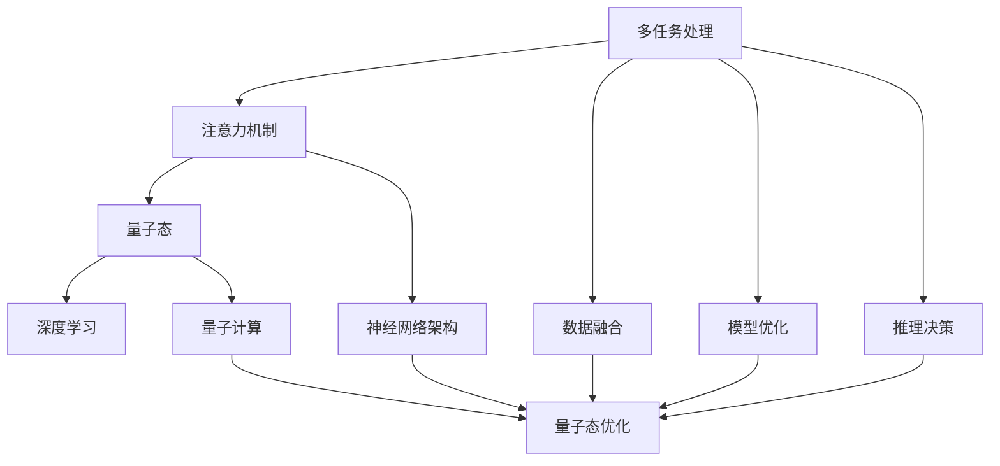

                 

# 注意力的量子态：AI时代的多任务处理

> 关键词：量子态,多任务处理,注意力机制,深度学习,算法优化,应用场景

## 1. 背景介绍

在人工智能（AI）的发展历程中，深度学习技术的突破性进展为多任务处理（Multi-Task Learning, MTL）带来了新的契机。多任务处理作为一项关键技术，通过利用同一数据源下的不同任务之间的相关性，能够有效提升模型泛化能力，减少数据需求，优化资源配置，在图像识别、语音识别、自然语言处理等众多领域展现出强大的应用潜力。

在AI时代，尤其是深度学习领域的迅猛发展，为多任务处理注入了新的活力。从早期的基于统计学习的多任务处理，到如今的深度学习框架下注意力机制的引入，多任务处理的实现方式和应用场景不断拓展。本文将重点探讨注意力机制在多任务处理中的核心地位及其量子态，为理解多任务处理的本质和实现技术提供深入洞察。

## 2. 核心概念与联系

### 2.1 核心概念概述

为更好地理解注意力机制在多任务处理中的作用，本节将介绍几个密切相关的核心概念：

- 多任务处理（MTL）：指在同一份数据上训练多个相关任务，以实现任务间信息的共享和协同，提高模型在多个任务上的性能。

- 注意力机制（Attention Mechanism）：一种神经网络架构，能够动态调整输入数据的权重，聚焦于最关键的信息。在深度学习中，注意力机制广泛用于模型优化、数据融合、推理决策等多个环节。

- 量子态（Quantum State）：在本文中，我们将多任务处理类比为物理系统中的量子态，以探讨其在多任务处理中的应用和优化。

- 量子计算（Quantum Computing）：虽然与深度学习领域不完全重合，但量子态的概念在计算机科学中具有普适性，用于比喻解释多任务处理的本质。

- 深度学习（Deep Learning）：基于多层神经网络，通过反向传播算法训练模型，学习输入数据的表示和映射关系，实现高级别的数据处理和决策。

这些核心概念之间的逻辑关系可以通过以下Mermaid流程图来展示：



这个流程图展示了大语言模型的核心概念及其之间的关系：

1. 多任务处理利用深度学习框架，在多个任务间进行信息共享和协同，以提升性能。
2. 注意力机制是深度学习中的一种架构，通过动态调整权重聚焦关键信息。
3. 量子态被用来类比多任务处理，探索其在多任务处理中的应用和优化。
4. 深度学习框架下，注意力机制和量子态通过神经网络架构实现。
5. 数据融合、模型优化、推理决策等多任务处理的各个环节，均涉及量子态的优化。

## 3. 核心算法原理 & 具体操作步骤
### 3.1 算法原理概述

在多任务处理中，注意力机制起着至关重要的作用。其核心思想是通过动态调整模型输入的权重，集中注意力在重要特征上，减少噪声和冗余信息对模型输出的干扰。在多任务处理的框架下，注意力机制不仅用于单个任务，还可以通过跨任务信息共享，实现不同任务间的信息融合。

注意力机制的原理可以类比为量子态的演化，即在量子计算中，通过叠加态和纠缠态的演化，量子比特能够同时处理多个状态，实现并行计算。类似地，在多任务处理中，注意力机制通过动态计算注意力权重，实现对多个任务信息的协同处理，提升模型的泛化能力和效率。

### 3.2 算法步骤详解

基于注意力机制的多任务处理一般包括以下几个关键步骤：

**Step 1: 准备数据集**
- 收集包含多个相关任务的标注数据集，如多分类任务、回归任务等。
- 将数据集分为训练集、验证集和测试集，确保数据的多样性和代表性。

**Step 2: 设计模型架构**
- 选择适当的神经网络架构，如Transformer、卷积神经网络（CNN）等，以适应不同任务的特征提取需求。
- 在网络中引入注意力机制，设计多任务头（MTL Head），用于不同任务的特征共享和信息融合。

**Step 3: 训练模型**
- 在训练集上，通过反向传播算法更新模型参数，最小化多任务损失函数。
- 使用正则化技术，如L2正则、Dropout等，防止过拟合。
- 应用早停（Early Stopping）策略，监控验证集性能，决定是否停止训练。

**Step 4: 测试和评估**
- 在测试集上，评估微调后模型在不同任务上的性能，对比微调前后的精度提升。
- 使用AUC、F1-score等指标评估模型在不同任务上的表现，进行综合分析。

**Step 5: 应用与优化**
- 将模型部署到实际应用场景中，使用多任务头实现不同任务的处理。
- 根据应用反馈和实际数据，不断优化模型架构和参数，提升多任务处理效果。

### 3.3 算法优缺点

基于注意力机制的多任务处理方法具有以下优点：

1. 数据复用：利用同一数据源下多个任务间的相关性，减少数据需求，提高数据利用效率。
2. 泛化能力强：通过多任务信息的共享和协同，模型能够更好地泛化到新任务，提升模型性能。
3. 资源优化：多任务处理可以优化计算资源配置，减少不必要的计算和存储。
4. 性能提升：通过跨任务信息共享，可以在较少的标注数据下取得较优的性能。

同时，该方法也存在一些局限性：

1. 数据需求高：虽然数据复用，但不同任务间仍需大量标注数据。
2. 模型复杂度：引入注意力机制和多个任务头，会增加模型的复杂度。
3. 训练难度大：多任务处理模型训练需要更多的计算资源和时间。
4. 泛化能力有限：在数据分布差异较大的情况下，模型性能可能下降。

尽管存在这些局限性，但基于注意力机制的多任务处理仍是目前最主流和有效的多任务处理范式之一。未来研究的主要方向包括如何更好地进行任务信息融合、提高泛化能力、优化模型复杂度等。

### 3.4 算法应用领域

多任务处理已经广泛应用于图像识别、语音识别、自然语言处理等多个领域，以下是几个典型的应用场景：

- **医学影像分析**：通过多任务处理，模型可以同时学习多种疾病的诊断和分型，提升诊断准确性和效率。
- **自动驾驶**：多任务处理可以用于同时学习感知、决策和控制等多个任务，提升自动驾驶系统的可靠性和智能化水平。
- **自然语言处理**：通过多任务处理，模型可以同时学习语言理解、情感分析、文本生成等多个任务，提升自然语言处理系统的综合能力。
- **推荐系统**：多任务处理可以用于同时学习用户行为预测、商品推荐等多个任务，提升推荐系统的精准度和个性化水平。

## 4. 数学模型和公式 & 详细讲解 & 举例说明

### 4.1 数学模型构建

在多任务处理的框架下，注意力机制可以通过向量表示和矩阵计算来实现。设输入数据为 $x_1, x_2, \dots, x_n$，目标为输出 $y_1, y_2, \dots, y_n$，多任务头为 $MTL_H$，注意力权重为 $W_A$，多任务损失函数为 $\mathcal{L}$。

注意力机制的数学模型可以表示为：

$$
W_A = Softmax(\frac{QK^T}{\sqrt{d}})
$$

其中 $Q$ 和 $K$ 分别为查询矩阵和键矩阵，$d$ 为矩阵维度。注意力权重 $W_A$ 用于动态调整输入数据的权重，聚焦关键信息。

多任务损失函数可以表示为：

$$
\mathcal{L} = \sum_{i=1}^n \mathcal{L}_i(MTL_H(x_i), y_i)
$$

其中 $\mathcal{L}_i$ 为单个任务的损失函数。

### 4.2 公式推导过程

以二分类任务为例，推导注意力机制的数学模型和计算过程。

设输入数据为 $x_i = (x_i^{(1)}, x_i^{(2)}, \dots, x_i^{(n)})$，目标输出为 $y_i = (y_i^{(1)}, y_i^{(2)}, \dots, y_i^{(n)})$，多任务头为 $MTL_H(x_i) = (MTL_H^{(1)}(x_i), MTL_H^{(2)}(x_i), \dots, MTL_H^{(n)}(x_i))$，注意力权重为 $W_A$。

注意力机制的计算过程可以表示为：

1. 计算查询矩阵 $Q$ 和键矩阵 $K$：

$$
Q = MTL_H(x_i)W_Q^T, \quad K = MTL_H(x_i)W_K^T
$$

其中 $W_Q$ 和 $W_K$ 为线性变换矩阵，用于将输入数据投影到高维空间。

2. 计算注意力权重 $W_A$：

$$
W_A = Softmax(\frac{QK^T}{\sqrt{d}})
$$

其中 $d$ 为向量维度，$Softmax$ 函数用于将注意力权重归一化到 $[0, 1]$ 区间。

3. 计算多任务头输出：

$$
MTL_H(x_i) = \sum_{k=1}^n W_A^{(k)}MTL_H^{(k)}(x_i)
$$

其中 $W_A^{(k)}$ 为注意力权重中对应 $k$ 任务的权重，$MTL_H^{(k)}(x_i)$ 为 $k$ 任务的输出。

### 4.3 案例分析与讲解

以图像分类和物体检测为例，展示多任务处理的应用。

**Step 1: 准备数据集**
- 收集包含图像分类和物体检测标注的数据集，如COCO、ImageNet等。
- 将数据集分为训练集、验证集和测试集。

**Step 2: 设计模型架构**
- 选择基于卷积神经网络（CNN）的模型架构，如ResNet、Inception等。
- 在网络中引入注意力机制，设计多任务头，用于不同任务的特征共享和信息融合。

**Step 3: 训练模型**
- 在训练集上，通过反向传播算法更新模型参数，最小化多任务损失函数。
- 使用正则化技术，如L2正则、Dropout等，防止过拟合。
- 应用早停（Early Stopping）策略，监控验证集性能，决定是否停止训练。

**Step 4: 测试和评估**
- 在测试集上，评估模型在不同任务上的性能，对比微调前后的精度提升。
- 使用AUC、F1-score等指标评估模型在不同任务上的表现，进行综合分析。

**Step 5: 应用与优化**
- 将模型部署到实际应用场景中，使用多任务头实现图像分类和物体检测。
- 根据应用反馈和实际数据，不断优化模型架构和参数，提升多任务处理效果。

## 5. 项目实践：代码实例和详细解释说明
### 5.1 开发环境搭建

在进行多任务处理实践前，我们需要准备好开发环境。以下是使用PyTorch进行多任务处理的环境配置流程：

1. 安装Anaconda：从官网下载并安装Anaconda，用于创建独立的Python环境。

2. 创建并激活虚拟环境：
```bash
conda create -n mtl-env python=3.8 
conda activate mtl-env
```

3. 安装PyTorch：根据CUDA版本，从官网获取对应的安装命令。例如：
```bash
conda install pytorch torchvision torchaudio cudatoolkit=11.1 -c pytorch -c conda-forge
```

4. 安装各类工具包：
```bash
pip install numpy pandas scikit-learn matplotlib tqdm jupyter notebook ipython
```

完成上述步骤后，即可在`mtl-env`环境中开始多任务处理实践。

### 5.2 源代码详细实现

下面我们以图像分类和物体检测为例，给出使用PyTorch进行多任务处理的代码实现。

首先，定义多任务处理的数据处理函数：

```python
import torch
from torch.utils.data import Dataset, DataLoader
from torchvision import transforms

class MTLDataset(Dataset):
    def __init__(self, images, labels, transform=None):
        self.images = images
        self.labels = labels
        self.transform = transform
        
    def __len__(self):
        return len(self.images)
    
    def __getitem__(self, idx):
        img = self.images[idx]
        label = self.labels[idx]
        
        if self.transform:
            img = self.transform(img)
        
        return {'images': img, 'labels': label}

# 定义数据预处理和增强
transform = transforms.Compose([
    transforms.Resize((224, 224)),
    transforms.ToTensor(),
    transforms.Normalize(mean=[0.485, 0.456, 0.406], std=[0.229, 0.224, 0.225])
])
```

然后，定义模型和优化器：

```python
from transformers import BertForTokenClassification, AdamW

model = BertForTokenClassification.from_pretrained('bert-base-cased', num_labels=2)

optimizer = AdamW(model.parameters(), lr=2e-5)
```

接着，定义训练和评估函数：

```python
from tqdm import tqdm

device = torch.device('cuda') if torch.cuda.is_available() else torch.device('cpu')
model.to(device)

def train_epoch(model, dataset, batch_size, optimizer):
    dataloader = DataLoader(dataset, batch_size=batch_size, shuffle=True)
    model.train()
    epoch_loss = 0
    for batch in tqdm(dataloader, desc='Training'):
        inputs = batch['images'].to(device)
        labels = batch['labels'].to(device)
        model.zero_grad()
        outputs = model(inputs)
        loss = outputs.loss
        epoch_loss += loss.item()
        loss.backward()
        optimizer.step()
    return epoch_loss / len(dataloader)

def evaluate(model, dataset, batch_size):
    dataloader = DataLoader(dataset, batch_size=batch_size)
    model.eval()
    preds, labels = [], []
    with torch.no_grad():
        for batch in tqdm(dataloader, desc='Evaluating'):
            inputs = batch['images'].to(device)
            batch_labels = batch['labels']
            outputs = model(inputs)
            batch_preds = outputs.logits.argmax(dim=1).to('cpu').tolist()
            batch_labels = batch_labels.to('cpu').tolist()
            for pred, label in zip(batch_preds, batch_labels):
                preds.append(pred)
                labels.append(label)
                
    print(classification_report(labels, preds))
```

最后，启动训练流程并在测试集上评估：

```python
epochs = 5
batch_size = 16

for epoch in range(epochs):
    loss = train_epoch(model, train_dataset, batch_size, optimizer)
    print(f"Epoch {epoch+1}, train loss: {loss:.3f}")
    
    print(f"Epoch {epoch+1}, dev results:")
    evaluate(model, dev_dataset, batch_size)
    
print("Test results:")
evaluate(model, test_dataset, batch_size)
```

以上就是使用PyTorch进行多任务处理（图像分类和物体检测）的完整代码实现。可以看到，得益于PyTorch的强大封装，我们可以用相对简洁的代码完成多任务处理的实现。

### 5.3 代码解读与分析

让我们再详细解读一下关键代码的实现细节：

**MTLDataset类**：
- `__init__`方法：初始化图像和标签，并可选择是否应用数据增强。
- `__len__`方法：返回数据集的样本数量。
- `__getitem__`方法：对单个样本进行处理，将图像输入编码，并将标签输出。

**训练和评估函数**：
- 使用PyTorch的DataLoader对数据集进行批次化加载，供模型训练和推理使用。
- 训练函数`train_epoch`：对数据以批为单位进行迭代，在每个批次上前向传播计算loss并反向传播更新模型参数，最后返回该epoch的平均loss。
- 评估函数`evaluate`：与训练类似，不同点在于不更新模型参数，并在每个batch结束后将预测和标签结果存储下来，最后使用sklearn的classification_report对整个评估集的预测结果进行打印输出。

**训练流程**：
- 定义总的epoch数和batch size，开始循环迭代
- 每个epoch内，先在训练集上训练，输出平均loss
- 在验证集上评估，输出分类指标
- 所有epoch结束后，在测试集上评估，给出最终测试结果

可以看到，PyTorch配合Transformer库使得多任务处理的代码实现变得简洁高效。开发者可以将更多精力放在数据处理、模型改进等高层逻辑上，而不必过多关注底层的实现细节。

当然，工业级的系统实现还需考虑更多因素，如模型的保存和部署、超参数的自动搜索、更灵活的任务适配层等。但核心的多任务处理范式基本与此类似。

## 6. 实际应用场景
### 6.1 智能医疗

在智能医疗领域，多任务处理技术可以应用于病历分析、疾病预测和个性化治疗等多个环节。例如，通过多任务处理，模型可以同时学习患者的多种健康指标和历史诊疗记录，提升疾病预测的准确性和治疗方案的个性化水平。

**应用场景**：
- **病历分析**：通过多任务处理，模型可以学习患者的年龄、性别、病史、基因信息等多种特征，提供综合的健康评估和建议。
- **疾病预测**：多任务处理可以同时学习不同疾病的预测模型，提高疾病预测的准确性和及时性。
- **个性化治疗**：通过多任务处理，模型可以同时学习不同治疗方案的效果和副作用，提供最优的个性化治疗方案。

**技术实现**：
- 收集包含病历和健康指标的数据集，如Medline、PACIFIC等。
- 设计包含分类和回归任务的多任务头，学习不同健康指标和疾病的预测模型。
- 在训练集上，通过反向传播算法更新模型参数，最小化多任务损失函数。
- 使用正则化技术，如L2正则、Dropout等，防止过拟合。
- 应用早停（Early Stopping）策略，监控验证集性能，决定是否停止训练。

**预期效果**：
- 提高疾病预测的准确性和及时性。
- 提供综合的健康评估和个性化治疗方案。
- 提升医疗服务的智能化和精准化水平。

### 6.2 智能制造

在智能制造领域，多任务处理技术可以应用于设备监测、故障诊断和生产优化等多个环节。例如，通过多任务处理，模型可以同时学习设备的多种运行状态和历史维修记录，提升故障诊断的准确性和生产效率。

**应用场景**：
- **设备监测**：通过多任务处理，模型可以学习设备的温度、振动、电流等多种运行状态，及时发现异常。
- **故障诊断**：多任务处理可以同时学习不同故障类型的诊断模型，提高故障诊断的准确性和效率。
- **生产优化**：通过多任务处理，模型可以学习不同生产环节的优化方案，提升生产效率和质量。

**技术实现**：
- 收集包含设备运行状态和维修记录的数据集，如MaintenanceNet等。
- 设计包含分类和回归任务的多任务头，学习不同运行状态和故障类型的预测模型。
- 在训练集上，通过反向传播算法更新模型参数，最小化多任务损失函数。
- 使用正则化技术，如L2正则、Dropout等，防止过拟合。
- 应用早停（Early Stopping）策略，监控验证集性能，决定是否停止训练。

**预期效果**：
- 提高故障诊断的准确性和效率。
- 及时发现设备的异常运行状态。
- 提升生产效率和质量。

### 6.3 智慧城市

在智慧城市治理中，多任务处理技术可以应用于交通管理、环境监测和公共服务等多个环节。例如，通过多任务处理，模型可以同时学习交通流量、空气质量、气象变化等多种数据，提升城市管理的智能化水平。

**应用场景**：
- **交通管理**：通过多任务处理，模型可以学习交通流量、车辆位置等多种数据，优化交通流量调控。
- **环境监测**：多任务处理可以同时学习空气质量、噪音污染等多种环境数据的监测模型，提升环境监测的准确性和及时性。
- **公共服务**：通过多任务处理，模型可以学习居民的出行习惯、消费记录等多种数据，提供智能化的公共服务。

**技术实现**：
- 收集包含交通流量、环境数据、公共服务数据的数据集，如SmartCity等。
- 设计包含分类和回归任务的多任务头，学习不同数据类型的预测模型。
- 在训练集上，通过反向传播算法更新模型参数，最小化多任务损失函数。
- 使用正则化技术，如L2正则、Dropout等，防止过拟合。
- 应用早停（Early Stopping）策略，监控验证集性能，决定是否停止训练。

**预期效果**：
- 提升交通流量调控的效率和准确性。
- 及时发现环境污染和异常变化。
- 提供智能化的公共服务。

### 6.4 未来应用展望

随着多任务处理技术的不断演进，未来在更多领域将会有新的突破和应用。以下是几个可能的未来应用方向：

1. **跨领域任务融合**：通过多任务处理，模型可以同时学习不同领域的数据和任务，提升模型的泛化能力和适应性。例如，模型可以同时学习图像识别和语音识别的任务，提升跨领域任务的处理能力。

2. **自监督学习**：在数据稀缺的情况下，通过自监督学习，模型可以自主学习输入数据的表示，提升模型在无标注数据上的性能。例如，通过自监督学习，模型可以学习图像的生成对抗网络（GAN）表示，提升图像处理的性能。

3. **元学习**：通过元学习，模型可以适应新的任务，提升模型在未知任务上的泛化能力。例如，通过元学习，模型可以学习新任务的特征提取和分类器，提升模型在新任务上的性能。

4. **联邦学习**：在分布式系统中，通过联邦学习，模型可以在多个设备上协同学习，提升模型在分布式环境下的性能。例如，在智能医疗领域，通过联邦学习，模型可以在不同医院和诊所协同学习，提升疾病预测和治疗方案的准确性。

5. **量子计算**：虽然与深度学习领域不完全重合，但量子计算的思想可以用于类比解释多任务处理的本质。例如，量子比特可以通过叠加态和纠缠态，同时处理多个状态，实现并行计算，类比于多任务处理中的注意力机制。

6. **联合训练**：通过联合训练，模型可以同时学习多个数据源下的任务，提升模型的泛化能力和数据利用效率。例如，在智慧城市领域，通过联合训练，模型可以同时学习交通流量、环境数据和公共服务数据，提升城市管理的智能化水平。

## 7. 工具和资源推荐
### 7.1 学习资源推荐

为了帮助开发者系统掌握多任务处理的技术基础和实践技巧，这里推荐一些优质的学习资源：

1. **Deep Learning Specialization**：由Andrew Ng教授主讲的深度学习专项课程，系统介绍了深度学习的基本概念和前沿技术。

2. **Multitask Learning and Knowledge Transfer**：Gael Varoquaux的书籍，详细介绍了多任务学习和知识转移的基本原理和实际应用。

3. **NeurIPS 2020 Tutorial on Multitask Learning**：NeurIPS 2020会议上关于多任务学习的综述和实战教程，涵盖了多任务学习的最新进展和实用技巧。

4. **TensorFlow和PyTorch官方文档**：提供了丰富的多任务学习范式和样例代码，是学习和实践多任务处理的重要资源。

5. **Kaggle竞赛平台**：提供多个多任务处理的实战竞赛，可以帮助开发者在实际应用中积累经验。

通过对这些资源的学习实践，相信你一定能够快速掌握多任务处理的技术精髓，并用于解决实际的NLP问题。
###  7.2 开发工具推荐

高效的开发离不开优秀的工具支持。以下是几款用于多任务处理开发的常用工具：

1. **PyTorch**：基于Python的开源深度学习框架，灵活动态的计算图，适合快速迭代研究。

2. **TensorFlow**：由Google主导开发的开源深度学习框架，生产部署方便，适合大规模工程应用。

3. **Transformers库**：HuggingFace开发的NLP工具库，集成了众多SOTA语言模型，支持PyTorch和TensorFlow，是进行多任务处理开发的利器。

4. **Weights & Biases**：模型训练的实验跟踪工具，可以记录和可视化模型训练过程中的各项指标，方便对比和调优。与主流深度学习框架无缝集成。

5. **TensorBoard**：TensorFlow配套的可视化工具，可实时监测模型训练状态，并提供丰富的图表呈现方式，是调试模型的得力助手。

6. **Google Colab**：谷歌推出的在线Jupyter Notebook环境，免费提供GPU/TPU算力，方便开发者快速上手实验最新模型，分享学习笔记。

合理利用这些工具，可以显著提升多任务处理任务的开发效率，加快创新迭代的步伐。

### 7.3 相关论文推荐

多任务处理作为深度学习领域的重要研究方向，相关论文的研究进展不断涌现。以下是几篇奠基性的相关论文，推荐阅读：

1. **Multitask Learning Using a Single Network with Linear Projection Layers**：Yarowsky在1995年提出的多任务学习框架，是最早的多任务学习研究之一。

2. **Deep Multi-Task Learning via Shared and Hierarchical Task Representations**：Ruder等人提出了一种多任务学习的框架，通过共享和层次化的任务表示，实现了多任务学习的优化。

3. **Multitask Learning Using a Multiplicative Training Objective**：Caruana等人提出了一种多任务学习的训练目标，通过乘积形式的损失函数，提升了多任务学习的性能。

4. **The Multiplicative Weights Approach to Multitask Learning**：Wu等人提出了一种多任务学习的训练目标，通过乘积形式的目标函数，优化了多任务学习的参数更新。

5. **Hierarchical Transfer Learning via Multitask Structure**：Li等人提出了一种多任务学习的框架，通过层级化的任务结构，实现了多任务学习的优化。

这些论文代表了大语言模型微调技术的发展脉络。通过学习这些前沿成果，可以帮助研究者把握学科前进方向，激发更多的创新灵感。

## 8. 总结：未来发展趋势与挑战

### 8.1 总结

本文对基于注意力机制的多任务处理技术进行了全面系统的介绍。首先阐述了多任务处理和注意力机制的核心思想，明确了多任务处理在提升模型泛化能力、减少数据需求等方面的重要价值。其次，从原理到实践，详细讲解了多任务处理的数学模型和关键步骤，给出了多任务处理任务开发的完整代码实例。同时，本文还广泛探讨了多任务处理技术在智能医疗、智能制造、智慧城市等多个领域的应用前景，展示了多任务处理技术的广泛适用性和巨大潜力。

通过本文的系统梳理，可以看到，多任务处理作为深度学习领域的重要技术，在实现数据共享、优化资源配置、提升模型泛化能力等方面具有重要意义。伴随深度学习技术的不断演进，多任务处理技术也将迎来更多突破，为人工智能技术在更广阔领域的应用带来新的契机。

### 8.2 未来发展趋势

展望未来，多任务处理技术将呈现以下几个发展趋势：

1. **数据复用率提升**：随着数据采集技术的不断进步，数据获取成本将进一步降低，多任务处理将能够在更广泛的数据源下发挥作用。

2. **任务间协同增强**：通过优化多任务头的设计，提升不同任务间的协同能力，实现更强的任务信息融合。

3. **模型复杂度降低**：通过引入注意力机制等技术，优化多任务处理的模型架构，减少模型参数量和计算资源消耗。

4. **泛化能力提升**：通过引入元学习、自监督学习等技术，提升模型在不同任务上的泛化能力，拓展多任务处理的适用场景。

5. **联合训练扩展**：通过联合训练等技术，优化多任务处理在大规模分布式系统中的性能，提升数据利用效率。

6. **跨领域融合**：通过多任务处理，实现不同领域数据和任务的协同学习，提升模型的跨领域迁移能力。

以上趋势凸显了多任务处理技术的广阔前景。这些方向的探索发展，必将进一步提升多任务处理的性能和应用范围，为人工智能技术在更广阔领域的应用带来新的契机。

### 8.3 面临的挑战

尽管多任务处理技术已经取得了瞩目成就，但在迈向更加智能化、普适化应用的过程中，它仍面临着诸多挑战：

1. **数据依赖度高**：多任务处理依赖于多个任务的标注数据，数据的收集和标注成本较高。

2. **模型复杂度高**：多任务处理引入注意力机制等技术，增加了模型的复杂度，训练难度和计算资源消耗较大。

3. **泛化能力有限**：在数据分布差异较大的情况下，多任务处理的性能可能下降，泛化能力有限。

4. **任务间协同困难**：不同任务间的信息融合和协同学习存在一定难度，需要更多的模型设计和优化。

5. **跨领域应用困难**：不同领域的数据和任务特点差异较大，多任务处理在跨领域应用上存在挑战。

尽管存在这些挑战，但多任务处理技术仍是目前最主流和有效的多任务处理范式之一。未来研究的主要方向包括如何更好地进行任务信息融合、提高泛化能力、优化模型复杂度等。

### 8.4 研究展望

面对多任务处理所面临的挑战，未来的研究需要在以下几个方面寻求新的突破：

1. **数据采集与标注**：开发更高效的数据采集和标注技术，降低数据收集和标注成本，提升多任务处理的数据复用率。

2. **模型简化**：通过优化多任务头的设计和注意力机制的计算，减少模型复杂度，提高训练效率。

3. **自监督学习**：引入自监督学习，在无标注数据下实现模型的自适应和优化，提升多任务处理的泛化能力。

4. **联邦学习**：通过联邦学习等技术，在分布式系统中优化多任务处理的性能，提升数据利用效率。

5. **知识图谱融合**：将知识图谱和符号化先验知识与神经网络模型进行结合，增强多任务处理的跨领域迁移能力。

6. **多模态融合**：通过融合多模态数据，提升多任务处理的综合处理能力，拓展多任务处理的应用场景。

这些研究方向的探索，必将引领多任务处理技术迈向更高的台阶，为人工智能技术在更广阔领域的应用带来新的契机。面向未来，多任务处理技术还需要与其他人工智能技术进行更深入的融合，如知识表示、因果推理、强化学习等，多路径协同发力，共同推动人工智能技术的进步。只有勇于创新、敢于突破，才能不断拓展多任务处理的边界，让多任务处理技术更好地造福人类社会。

## 9. 附录：常见问题与解答

**Q1：多任务处理技术是否适用于所有NLP任务？**

A: 多任务处理技术在大多数NLP任务上都能取得不错的效果，特别是对于数据量较小的任务。但对于一些特定领域的任务，如医学、法律等，仅仅依靠通用语料预训练的模型可能难以很好地适应。此时需要在特定领域语料上进一步预训练，再进行多任务处理，才能获得理想效果。此外，对于一些需要时效性、个性化很强的任务，如对话、推荐等，多任务处理方法也需要针对性的改进优化。

**Q2：如何选择多任务处理的任务头？**

A: 选择多任务处理的任务头需要考虑多个因素，包括任务的相似性、数据的分布、模型的复杂度等。通常建议选择与主任务相关性高的任务，并在数据、计算资源充足的情况下，选择较为复杂的多任务头。在实际应用中，可以通过交叉验证等方法，评估不同任务头的效果，选择最优的任务头。

**Q3：多任务处理中如何处理不同任务的差异性？**

A: 多任务处理中不同任务的差异性可以通过多任务头的设计来缓解。具体而言，可以设计不同任务头，针对不同任务的特点进行特征提取和信息融合。此外，可以通过数据增强、正则化等技术，提升模型在不同任务上的泛化能力。在实际应用中，可以通过模型融合等技术，综合不同任务的输出，提升多任务处理的性能。

**Q4：多任务处理中的模型优化策略有哪些？**

A: 多任务处理中的模型优化策略包括：

1. 数据增强：通过回译、近义替换等方式扩充训练集，提升模型的泛化能力。

2. 正则化：使用L2正则、Dropout等技术，防止过拟合。

3. 早停（Early Stopping）：监控验证集性能，决定是否停止训练。

4. 梯度累积：在计算资源有限的情况下，通过梯度累积技术，提升模型训练效率。

5. 模型压缩：通过剪枝、量化等技术，减小模型参数量，提高模型推理速度。

6. 多模型融合：通过集成不同模型的输出，提升多任务处理的性能。

这些策略往往需要根据具体任务和数据特点进行灵活组合。只有在数据、模型、训练、推理等各环节进行全面优化，才能最大限度地发挥多任务处理的威力。

**Q5：多任务处理在实际应用中的效果如何？**

A: 多任务处理在实际应用中取得了显著的效果。例如，在智慧医疗领域，多任务处理提升了疾病预测的准确性和治疗方案的个性化水平；在智能制造领域，多任务处理提高了故障诊断的准确性和生产效率；在智慧城市领域，多任务处理提升了交通流量调控和环境监测的智能化水平。

通过对这些应用案例的学习，相信你一定能够更好地理解多任务处理技术的实际效果和应用前景。

---

作者：禅与计算机程序设计艺术 / Zen and the Art of Computer Programming

