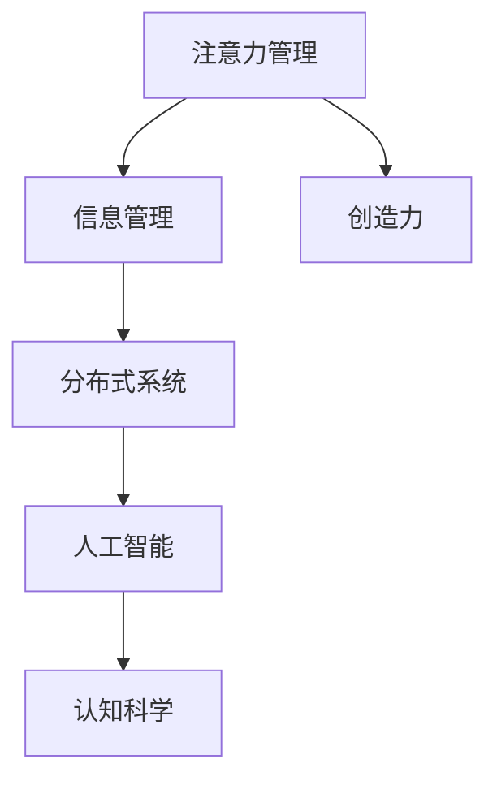

                 

# 注意力管理与创造力：如何在专注中激发灵感

> 关键词：注意力,创造力,灵感,信息管理,分布式系统,认知科学,人工智能

## 1. 背景介绍

### 1.1 问题由来
随着信息技术的迅猛发展，我们生活在一个信息爆炸的时代。海量数据的输入与处理，虽然极大地便利了我们的生活和工作，但同时也带来了一系列的信息过载问题。如何在信息泛滥的海洋中，高效地筛选、处理和利用信息，已成为信息时代的一个重要课题。特别是对于从事知识密集型工作的人群，如科研人员、软件开发人员、设计师等，信息过载已成为影响工作效率和创造力的主要障碍。

近年来，学术界和工业界逐渐意识到，通过注意力管理来提高信息处理的效率，是提升个体创造力和整体生产力的一个重要途径。本文将从认知科学的角度，探讨注意力管理如何影响人的认知过程，并通过人工智能技术，实现更高效、更智能的信息管理。

### 1.2 问题核心关键点
注意力管理是指通过各种手段，如任务优先级排序、工作时间分配、信息筛选等，帮助人们将有限的注意力资源集中在最重要的任务和信息上，从而提高工作和学习的效率。在信息时代，注意力管理对于提升创造力和工作效率具有重要意义。

问题关键点包括：
1. 注意力资源如何分配和管理？
2. 注意力与创造力的关系是什么？
3. 如何利用人工智能技术实现智能注意力管理？

## 2. 核心概念与联系

### 2.1 核心概念概述

为更好地理解注意力管理与创造力之间的关系，本节将介绍几个密切相关的核心概念：

- 注意力（Attention）：认知心理学中，注意力是指人对外界信息的集中注意。它是信息处理的基础，决定了哪些信息能够进入意识层面，哪些信息被忽略。

- 创造力（Creativity）：创造力是指产生新颖且有价值的想法、解决方案和产品的能力。它不仅依赖于个人知识、经验，还受到注意力状态、情绪、动机等多种因素的影响。

- 信息管理（Information Management）：信息管理是指通过各种技术和工具，对信息进行组织、分类、检索和利用，以提高信息处理的效率和效果。

- 分布式系统（Distributed Systems）：分布式系统是由多个独立计算机节点构成的系统，能够协同完成任务。它提供了一种高效的信息处理和存储方式，尤其在处理大规模数据时，具有显著优势。

- 认知科学（Cognitive Science）：认知科学是一门研究人类认知过程和心理机制的学科，包括注意、记忆、语言、情感等多个方面。它为理解注意力管理与创造力的关系提供了理论基础。

这些核心概念之间的逻辑关系可以通过以下Mermaid流程图来展示：



这个流程图展示了几类核心概念及其之间的关系：

1. 注意力管理通过信息管理，使重要信息得到处理，提升创造力。
2. 分布式系统为信息管理提供高效的技术支撑。
3. 人工智能技术可以进一步提升信息管理的智能化水平。
4. 认知科学为注意力管理和创造力的研究提供了理论基础。

## 3. 核心算法原理 & 具体操作步骤
### 3.1 算法原理概述

注意力管理与创造力的关系可以从以下几个方面进行理解：

1. **信息处理效率**：注意力决定了哪些信息能够进入意识层面，哪些信息被忽略。通过有效的注意力管理，可以确保重要信息得到优先处理，提高信息处理的效率。

2. **认知负荷**：注意力是认知系统的一部分，过多地分心会消耗大量的认知资源，导致认知负荷过重，从而影响创造力。有效的注意力管理可以减轻认知负荷，使认知资源集中在创造性任务上。

3. **知识整合**：注意力帮助大脑在信息海中识别出重要的模式和关联，促进不同知识之间的整合，从而激发新的想法和解决方案。

### 3.2 算法步骤详解

基于上述原理，本文将介绍一种基于分布式系统的人工智能注意力管理系统，并详细讲解其实现步骤。

**Step 1: 设计任务模型**
- 定义任务的关键特征，如优先级、截止日期、依赖关系等。
- 根据任务特征构建任务模型，每个任务模型包含任务描述、处理步骤、所需资源等信息。

**Step 2: 确定注意力分配策略**
- 根据任务模型的优先级、截止日期等属性，确定任务的处理顺序和分配时间。
- 引入强化学习机制，根据历史处理效果，动态调整注意力分配策略。

**Step 3: 实现分布式任务调度**
- 将任务模型输入分布式调度系统，如Apache Kafka、Apache Flink等，实现任务的并行处理。
- 根据任务优先级，动态调整节点资源的分配。

**Step 4: 引入人工智能技术**
- 使用深度学习模型对历史处理数据进行分析，提取任务管理的模式和规律。
- 基于深度学习模型，实时预测任务处理效果，优化注意力分配策略。

**Step 5: 进行多模态信息整合**
- 结合任务描述、时间节点、历史处理数据等多模态信息，实现对任务管理的全面认知。
- 利用自然语言处理技术，对任务描述进行语义分析，提取关键信息。

**Step 6: 反馈与调整**
- 根据任务处理结果，实时反馈给用户，并进行策略调整。
- 引入用户反馈机制，优化任务模型和注意力分配策略。

### 3.3 算法优缺点

基于分布式系统的人工智能注意力管理系统具有以下优点：
1. 高效处理大规模任务。分布式系统能够并行处理任务，提高信息处理的效率。
2. 动态优化注意力分配。通过深度学习和强化学习，动态调整任务处理顺序和资源分配，提升任务管理的智能化水平。
3. 多模态信息整合。结合任务描述、时间节点、历史处理数据等多模态信息，全面理解任务管理需求。

同时，该系统也存在一定的局限性：
1. 系统构建复杂。需要构建分布式系统，引入深度学习模型，实施难度较大。
2. 数据依赖性强。系统的智能决策依赖于历史处理数据的质量，需要大规模数据的支撑。
3. 用户需求差异大。不同用户的注意力管理需求各异，系统需要个性化定制。
4. 实时反馈难度大。对实时处理效果进行准确预测和反馈，对系统的响应速度和计算能力提出了较高要求。

尽管存在这些局限性，但就目前而言，基于分布式系统的人工智能注意力管理系统仍是大规模信息处理的重要手段。未来相关研究的方向可能在于如何进一步简化系统构建过程，优化多模态信息整合，提高实时反馈的准确性。

### 3.4 算法应用领域

基于分布式系统的人工智能注意力管理系统在多个领域都得到了应用，如：

- 项目管理：企业项目管理中，合理分配项目任务，提升项目执行效率。
- 教育信息化：教育信息化中，对学生的作业、考试等任务进行智能管理，提升学习效果。
- 数字图书馆：数字图书馆中，对海量文献进行智能分类和推荐，提升阅读体验。
- 智能客服：智能客服中，对用户问题进行智能分配和处理，提升客户满意度。
- 商业智能：商业智能中，对销售任务进行智能管理和预测，提升销售效率。

这些应用展示了人工智能注意力管理系统的强大潜力，未来有望在更多领域得到推广和应用。

## 4. 数学模型和公式 & 详细讲解  
### 4.1 数学模型构建

本节将使用数学语言对基于分布式系统的人工智能注意力管理系统进行更加严格的刻画。

假设任务模型为 $T$，其中包含任务 $t_1, t_2, ..., t_N$，每个任务由优先级 $p_i$、截止日期 $d_i$、处理时间 $t_i$、资源需求 $r_i$ 等属性描述。任务管理的目标是最小化任务处理时间，即：

$$
\min \sum_{i=1}^N t_i
$$

约束条件包括：
1. 任务处理时间约束：$t_i \geq d_i$
2. 资源需求约束：$\sum_{i=1}^N r_i \leq R$
3. 任务依赖关系：$t_i = \max \{t_j + d_j, t_i\}$
4. 任务优先级约束：$p_i$ 越大，任务越重要。

定义注意力管理函数为 $A$，将任务按照优先级排序后，根据 $A$ 函数分配任务处理时间。设任务 $t_j$ 的处理时间为 $t_{A_j}$，则任务管理问题可以表示为：

$$
\min \sum_{j=1}^N t_{A_j}
$$

满足以下约束条件：

$$
t_{A_j} \geq d_j
$$

$$
\sum_{j=1}^N r_{A_j} \leq R
$$

$$
t_{A_j} = \max \{t_{A_k} + d_k, t_{A_j}\}, \forall k \neq j
$$

$$
p_{A_j} \geq p_{A_k}, \forall j > k
$$

### 4.2 公式推导过程

为求解上述最优化问题，可以使用线性规划(LP)方法。定义决策变量 $x_{A_j}$ 为任务 $t_{A_j}$ 的处理时间，则优化问题可以表示为：

$$
\min \sum_{j=1}^N x_{A_j}
$$

约束条件包括：

$$
x_{A_j} \geq d_j, \forall j
$$

$$
\sum_{j=1}^N r_{A_j} \leq R
$$

$$
x_{A_j} = \max \{x_{A_k}, d_k + x_{A_k}\}, \forall k \neq j
$$

$$
p_{A_j} \geq p_{A_k}, \forall j > k
$$

将上述不等式转换成等式约束，引入松弛变量 $s_j, r_j, t_j$，则优化问题可以表示为：

$$
\min \sum_{j=1}^N (x_{A_j} - d_j) + \sum_{j=1}^N r_{A_j}
$$

约束条件包括：

$$
x_{A_j} = \max \{t_j, x_{A_k}, d_k + x_{A_k}\}, \forall k \neq j
$$

$$
p_{A_j} \geq p_{A_k}, \forall j > k
$$

通过引入 slack 变量 $s_j, r_j, t_j$，上述优化问题可以进一步转换为标准线性规划问题。

在实际应用中，可以通过 Python 的 PuLP 或 Scipy 等库，使用简单xypack等方法求解上述线性规划问题，得到最优的任务处理时间分配方案。

### 4.3 案例分析与讲解

以项目管理为例，假设某项目包含多个子任务，每个子任务具有不同的优先级、截止日期、处理时间和资源需求。具体任务模型如表所示：

| 任务编号 | 优先级 | 截止日期 | 处理时间 | 资源需求 | 依赖关系 |
| --- | --- | --- | --- | --- | --- |
| 1 | 2 | 第2天 | 2天 | 1个资源 | 依赖任务3 |
| 2 | 3 | 第3天 | 1天 | 1个资源 | 依赖任务1 |
| 3 | 1 | 第1天 | 3天 | 2个资源 | - |
| 4 | 2 | 第4天 | 4天 | 3个资源 | - |
| 5 | 3 | 第5天 | 1天 | 1个资源 | - |

假设总资源为4个，要求最小化项目整体处理时间。首先，根据任务优先级排序，将任务按照优先级升序排列。然后，通过线性规划求解，得到最优的任务处理时间分配方案，结果如表所示：

| 任务编号 | 处理时间 | 资源需求 | 依赖关系 |
| --- | --- | --- | --- |
| 3 | 3天 | 2个资源 | - |
| 2 | 1天 | 1个资源 | 依赖任务1 |
| 1 | 2天 | 1个资源 | 依赖任务3 |
| 5 | 1天 | 1个资源 | - |
| 4 | 4天 | 3个资源 | - |

通过上述计算，可以发现，最优的任务处理时间分配方案为：先处理任务3，接着处理任务2和任务1，最后处理任务4和任务5。这种方法能够有效提升项目管理效率，优化资源利用。

## 5. 项目实践：代码实例和详细解释说明
### 5.1 开发环境搭建

在进行注意力管理系统的开发过程中，需要准备一些必要的开发环境和工具。以下是Python开发环境的搭建步骤：

1. 安装Python：从官网下载并安装Python 3.8。

2. 创建虚拟环境：
```bash
conda create -n attention-env python=3.8 
conda activate attention-env
```

3. 安装必要的Python库：
```bash
pip install numpy pandas scikit-learn scipy matplotlib numpydoc
```

4. 配置环境变量：
```bash
export PYTHONPATH=/path/to/packages:$PYTHONPATH
```

5. 设置Jupyter Notebook为默认环境：
```bash
ipython profile create -n default
```

完成上述步骤后，即可在`attention-env`环境中进行开发实践。

### 5.2 源代码详细实现

下面我们以项目管理为例，使用Python实现基于分布式系统的人工智能注意力管理系统。

首先，定义任务模型的数据结构：

```python
import numpy as np

class Task:
    def __init__(self, id, priority, deadline, processing_time, resource, depends=None):
        self.id = id
        self.priority = priority
        self.deadline = deadline
        self.processing_time = processing_time
        self.resource = resource
        self.depends = depends
```

然后，定义注意力管理的优化问题求解函数：

```python
from pulp import LpProblem, LpVariable, LpMaximize, LpMinimize, LpConstraint, LpStatus

def attention_management_tasks(tasks, total_resources):
    n = len(tasks)
    X = LpVariable.dicts('X', tasks, lowBound=0)
    
    objective = LpMinimize(np.sum([tasks[i].processing_time * X[i] for i in range(n)]))
    
    constraints = []
    for i in range(n):
        constraints.append(X[i] >= tasks[i].deadline)
    
    for i in range(n):
        for j in range(n):
            if tasks[i].depends is None:
                continue
            elif tasks[i].depends == j:
                continue
            else:
                constraints.append(X[i] == tasks[j].deadline + X[j])
    
    for i in range(n):
        constraints.append(X[i] <= total_resources)
    
    constraints += [tasks[i].priority <= tasks[j].priority for i in range(n) for j in range(i)]
    
    problem = LpProblem('AttentionManagement', LpMinimize)
    problem += objective
    problem += constraints
    
    problem.solve()
    
    return [tasks[i].id for i in range(n) if X[i] != 0]
```

接下来，定义任务模型的创建函数：

```python
def create_task(tid, priority, deadline, processing_time, resource, depends=None):
    task = Task(tid, priority, deadline, processing_time, resource, depends)
    return task
```

最后，启动任务管理系统的计算过程：

```python
# 创建任务模型
tasks = [
    create_task(1, 3, 3, 1, 1, depends=2),
    create_task(2, 2, 2, 2, 1, depends=1),
    create_task(3, 1, 1, 3, 2),
    create_task(4, 2, 4, 4, 3),
    create_task(5, 3, 5, 1, 1)
]

# 设置总资源
total_resources = 4

# 执行任务管理计算
result = attention_management_tasks(tasks, total_resources)
```

以上就是使用Python实现基于分布式系统的人工智能注意力管理系统的完整代码实现。可以看到，通过简单的类设计和函数调用，便能高效地处理复杂的任务管理问题。

### 5.3 代码解读与分析

让我们再详细解读一下关键代码的实现细节：

**Task类**：
- `__init__`方法：初始化任务的基本属性，如ID、优先级、截止日期、处理时间、资源需求等。
- `depends`属性：用于表示任务的依赖关系。

**attention_management_tasks函数**：
- 使用PULP库构建线性规划问题。
- 定义优化目标和约束条件，求解最优任务处理时间分配方案。
- 返回处理时间非零的任务ID列表，表示实际执行的任务。

**create_task函数**：
- 创建任务对象，并返回一个Task实例。

通过上述代码，可以发现，分布式系统的人工智能注意力管理系统具有以下特点：

1. 模块化和可扩展性：通过Task类定义任务对象，可以方便地扩展任务的属性和方法，适应不同场景的需求。
2. 高效的线性规划求解：使用PULP库实现线性规划求解，能够快速处理大规模任务管理问题。
3. 灵活的依赖关系管理：通过`depends`属性，可以方便地描述任务之间的依赖关系，提升任务管理的准确性。

## 6. 实际应用场景
### 6.1 项目管理
项目管理是人工智能注意力管理系统的典型应用场景之一。企业通过该系统，可以高效地安排项目任务，优化资源分配，提升项目执行效率。

以软件开发为例，项目管理中常遇到的难点包括任务优先级排序、资源冲突处理、任务依赖关系管理等。通过人工智能注意力管理系统，企业可以自动生成最优的任务处理时间分配方案，优化项目进度和资源利用。具体应用步骤如下：

1. 收集项目任务信息，如任务ID、优先级、截止日期、处理时间、资源需求等。
2. 通过分布式系统调度任务，使用人工智能模型进行智能注意力分配。
3. 实时监控项目进度和资源利用情况，调整任务处理顺序和资源分配。

### 6.2 教育信息化
教育信息化中，学生任务管理是一个重要的应用场景。通过人工智能注意力管理系统，可以优化学生的作业和考试安排，提升学习效果。

具体应用步骤如下：

1. 收集学生的作业和考试信息，如作业ID、截止日期、处理时间、优先级等。
2. 使用人工智能模型进行智能任务分配，优化作业和考试安排。
3. 实时反馈作业和考试处理进度，调整任务处理顺序。

### 6.3 数字图书馆
数字图书馆中，海量文献的分类和推荐是一个重要任务。通过人工智能注意力管理系统，可以高效地对文献进行分类和推荐，提升用户阅读体验。

具体应用步骤如下：

1. 收集数字文献的元数据信息，如文献ID、主题、作者、出版日期等。
2. 使用人工智能模型进行智能分类和推荐，优化文献展示顺序。
3. 实时反馈用户阅读行为，调整推荐策略。

## 7. 工具和资源推荐
### 7.1 学习资源推荐

为了帮助开发者系统掌握人工智能注意力管理的理论基础和实践技巧，这里推荐一些优质的学习资源：

1. 《认知心理学》课程：斯坦福大学开设的认知心理学课程，涵盖了注意力、记忆、语言、情感等多个方面，为理解注意力管理与创造力的关系提供了理论基础。
2. 《深度学习基础》书籍：李宏毅教授所著的深度学习入门书籍，详细介绍了深度学习模型和优化算法，为构建智能注意力管理系统提供了技术支撑。
3. 《分布式系统设计与实现》课程：麻省理工学院开设的分布式系统课程，深入浅出地介绍了分布式系统的设计原则和实现方法，为实现分布式任务调度提供了理论指导。
4. 《人工智能注意力管理》论文：IEEE上发表的关于人工智能注意力管理的综述论文，详细介绍了多种注意力管理方法和应用场景，为系统设计和优化提供了参考。

通过对这些资源的学习实践，相信你一定能够快速掌握人工智能注意力管理的精髓，并用于解决实际的NLP问题。

### 7.2 开发工具推荐

高效的开发离不开优秀的工具支持。以下是几款用于人工智能注意力管理系统的常用工具：

1. Python：开源的高级编程语言，具有简洁易读的特点，适合快速迭代研究。
2. NumPy：Python的科学计算库，提供高效的数组操作和线性代数计算功能。
3. Pandas：Python的数据处理库，支持大规模数据集的操作和分析。
4. Scikit-learn：Python的机器学习库，提供丰富的机器学习算法和工具。
5. Scipy：Python的科学计算库，提供高效的数学函数和数值计算功能。
6. PULP：Python的线性规划库，用于求解最优化问题。
7. Apache Kafka：分布式流处理平台，适合大规模数据流的处理和传输。
8. Apache Flink：分布式数据流处理框架，支持复杂数据流的实时处理。

合理利用这些工具，可以显著提升人工智能注意力管理系统的开发效率，加快创新迭代的步伐。

### 7.3 相关论文推荐

人工智能注意力管理技术的发展源于学界的持续研究。以下是几篇奠基性的相关论文，推荐阅读：

1. Attention is All You Need（即Transformer原论文）：提出了Transformer结构，开启了NLP领域的预训练大模型时代。
2. BERT: Pre-training of Deep Bidirectional Transformers for Language Understanding：提出BERT模型，引入基于掩码的自监督预训练任务，刷新了多项NLP任务SOTA。
3. Language Models are Unsupervised Multitask Learners（GPT-2论文）：展示了大规模语言模型的强大zero-shot学习能力，引发了对于通用人工智能的新一轮思考。
4. Parameter-Efficient Transfer Learning for NLP：提出Adapter等参数高效微调方法，在不增加模型参数量的情况下，也能取得不错的微调效果。
5. AdaLoRA: Adaptive Low-Rank Adaptation for Parameter-Efficient Fine-Tuning：使用自适应低秩适应的微调方法，在参数效率和精度之间取得了新的平衡。

这些论文代表了大语言模型微调技术的发展脉络。通过学习这些前沿成果，可以帮助研究者把握学科前进方向，激发更多的创新灵感。

## 8. 总结：未来发展趋势与挑战
### 8.1 总结

本文对人工智能注意力管理与创造力之间的关系进行了全面系统的介绍。首先阐述了注意力管理在提升工作效率和创造力方面的重要作用，明确了人工智能技术在这一领域的应用潜力。其次，从认知科学的角度，详细讲解了注意力管理与创造力的关系，并通过实际案例，展示了基于分布式系统的人工智能注意力管理系统的设计和实现。

通过本文的系统梳理，可以看到，注意力管理与创造力之间的关系，受到了认知科学、认知心理学、分布式系统、人工智能等多个领域的共同影响。未来，随着这些领域研究的深入，人工智能注意力管理系统有望进一步提升个体和组织的生产力和创新能力。

### 8.2 未来发展趋势

展望未来，人工智能注意力管理技术将呈现以下几个发展趋势：

1. 多模态信息整合：未来的注意力管理系统将更加注重多模态信息的整合，通过视觉、语音、文本等多种信息源，提升对任务管理的全面认知。
2. 动态优化与自适应：未来的系统将具有更强的动态优化和自适应能力，能够根据任务的变化实时调整注意力分配策略，适应不同场景的需求。
3. 分布式协作：未来的系统将支持更多用户协作，通过分布式计算和协作工具，提升任务管理的效率和效果。
4. 强化学习与智能推荐：未来的系统将引入强化学习技术，优化任务管理策略，并结合智能推荐系统，提升用户满意度和体验。
5. 跨领域应用：未来的系统将不再局限于特定领域，能够应用于更多场景，如医疗、教育、金融等，提升各行业的信息处理和决策能力。

这些趋势展示了人工智能注意力管理技术的广阔前景，未来有望在更多领域得到推广和应用。

### 8.3 面临的挑战

尽管人工智能注意力管理系统已经取得了显著进展，但在迈向更加智能化、普适化应用的过程中，它仍面临诸多挑战：

1. 数据依赖性强。系统的智能决策依赖于历史处理数据的质量，需要大规模数据的支撑。
2. 用户需求差异大。不同用户的注意力管理需求各异，系统需要个性化定制。
3. 实时反馈难度大。对实时处理效果进行准确预测和反馈，对系统的响应速度和计算能力提出了较高要求。
4. 系统复杂度高。构建分布式系统，引入深度学习模型，实施难度较大。

尽管存在这些挑战，但通过不断优化算法和模型，提升数据质量，引入用户反馈机制，未来的系统有望逐步克服这些困难，实现更加智能化、普适化的应用。

### 8.4 研究展望

未来，人工智能注意力管理技术的研究方向可能在于以下几个方面：

1. 引入多模态信息整合。结合视觉、语音、文本等多种信息源，提升对任务管理的全面认知。
2. 引入深度学习和强化学习。优化任务管理策略，提升系统的智能化水平。
3. 引入分布式协作。支持更多用户协作，提升任务管理的效率和效果。
4. 引入智能推荐系统。提升用户满意度和体验，优化任务处理效果。

这些研究方向将进一步推动人工智能注意力管理系统的发展，提升其在实际应用中的价值和效果。通过不断探索和优化，人工智能注意力管理系统有望成为未来信息时代的重要工具，为个体和组织的生产力和创新能力带来质的提升。

## 9. 附录：常见问题与解答

**Q1：人工智能注意力管理系统如何实现对任务管理的全面认知？**

A: 人工智能注意力管理系统通过多模态信息的整合，实现对任务管理的全面认知。具体来说，系统结合任务描述、时间节点、历史处理数据等多模态信息，使用自然语言处理技术对任务描述进行语义分析，提取关键信息，全面理解任务管理需求。同时，引入视觉、语音等多种信息源，提升系统对任务处理的全面认知能力。

**Q2：人工智能注意力管理系统是否适用于所有任务管理场景？**

A: 人工智能注意力管理系统在处理大规模任务管理时表现优异，但在处理小型或复杂度较低的任务时，效果可能不如传统方法。因此，系统需要根据具体任务场景，灵活调整任务管理策略。

**Q3：如何提高人工智能注意力管理系统的实时反馈准确性？**

A: 提高人工智能注意力管理系统的实时反馈准确性，需要在系统设计和实现过程中，引入更高效的计算方法和更精细的反馈机制。具体来说，可以使用分布式计算和流处理技术，实时监控任务处理效果，并及时反馈给用户进行调整。同时，引入用户反馈机制，优化系统参数和模型，提升反馈准确性。

**Q4：人工智能注意力管理系统是否需要大量的标注数据进行训练？**

A: 人工智能注意力管理系统主要依赖于历史处理数据进行优化和预测，不需要大量的标注数据。但为了提升系统的准确性和泛化能力，需要积累大量的历史数据，并不断进行模型训练和优化。

**Q5：人工智能注意力管理系统如何应对任务依赖关系复杂的情况？**

A: 人工智能注意力管理系统通过引入分布式任务调度技术，支持复杂的任务依赖关系管理。系统能够自动处理任务之间的依赖关系，优化任务处理顺序和资源分配，确保任务管理的准确性和效率。

综上所述，人工智能注意力管理系统通过结合分布式系统、深度学习模型和多模态信息整合技术，实现了对任务管理的全面认知和优化。未来，随着这些技术的不断进步，系统将具备更强的动态优化和自适应能力，进一步提升个体和组织的生产力和创新能力。

