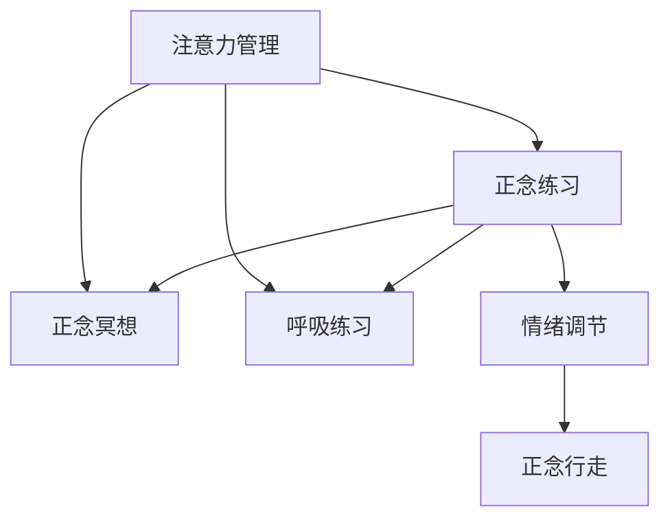

                 

# 注意力管理与正念练习：通过当下增强专注力和心灵清晰度

## 1. 背景介绍

### 1.1 问题由来
在现代社会，人们的生活节奏越来越快，工作压力越来越大，很多人面临着注意力分散、焦虑、抑郁等心理问题。为了应对这些挑战，一种新兴的心理技术应运而生——注意力管理和正念练习。这种技术通过引导人们集中注意力，深入当下，提升内心清晰度和情绪稳定性，对身心健康有着积极的影响。

### 1.2 问题核心关键点
注意力管理和正念练习的核心在于通过一系列的心理训练方法，帮助个体改善注意力集中能力，提高对当前状况的觉察，增强情绪调节能力，从而在复杂多变的环境中保持良好心态。

### 1.3 问题研究意义
研究注意力管理和正念练习的原理和技术，对于提升个体心理健康水平、促进社会和谐、提高工作效率具有重要意义。通过掌握这种技术，人们可以更好地应对生活中的各种压力，实现身心的和谐发展。

## 2. 核心概念与联系

### 2.1 核心概念概述

为了更好地理解注意力管理和正念练习，本节将介绍几个密切相关的核心概念：

- **注意力管理(Attention Management)**：指通过一系列的心理训练方法，帮助个体提高注意力集中和维持的能力。常见方法包括正念冥想、呼吸练习等。

- **正念练习(Mindfulness Practice)**：指通过觉察当前状况，放下对过去和未来的担忧，培养一种全然专注的状态。正念练习包括正念冥想、正念行走等。

- **正念冥想(Mindfulness Meditation)**：一种通过专注呼吸、身体觉察、情绪体验等方式，培养正念的技术。正念冥想能够提升个体的自我觉察和情绪调节能力。

- **呼吸练习(Breathing Exercises)**：通过调整呼吸频率和深度，缓解焦虑、提升注意力的一种练习方法。常见的有腹式呼吸、瑜伽呼吸等。

- **情绪调节(Emotion Regulation)**：指通过各种手段，如正念练习、认知行为疗法等，调节情绪，增强心理韧性。情绪调节能够帮助个体更好地应对生活中的各种挑战。

- **正念行走(Mindful Walking)**：一种通过感受脚底接触地面、周围环境等方式，培养正念的练习方法。正念行走能够帮助个体放松身心，提升专注力。

这些核心概念之间的逻辑关系可以通过以下Mermaid流程图来展示：



这个流程图展示了一些关键概念及其之间的关系：

1. 注意力管理通过正念练习、呼吸练习等方法提升个体的注意力集中能力。
2. 正念练习包括正念冥想、正念行走等，帮助个体培养全然专注的状态。
3. 正念冥想和呼吸练习能够增强个体的自我觉察和情绪调节能力。
4. 情绪调节能够提升个体的心理韧性，帮助其更好地应对生活中的各种挑战。
5. 正念行走是一种放松身心、提升专注力的练习方法。

## 3. 核心算法原理 & 具体操作步骤

### 3.1 算法原理概述

注意力管理和正念练习的核心算法原理主要基于心理学的认知行为疗法（Cognitive Behavioral Therapy, CBT）和正念心理学的理论，通过一系列的心理训练方法，逐步提升个体的注意力集中和情绪调节能力。

具体而言，注意力管理的心理训练过程通常包括：
- 专注训练：通过重复性练习，提升个体对当前状况的觉察和专注能力。
- 情绪调节训练：通过正念冥想、呼吸练习等方法，帮助个体调整情绪，增强心理韧性。

正念练习的心理训练过程通常包括：
- 正念冥想：通过引导个体专注呼吸、身体觉察、情绪体验等方式，培养正念。
- 正念行走：通过感受脚底接触地面、周围环境等方式，培养正念。

这些训练方法的实施需要遵循以下基本原则：
- **专注当下**：将注意力集中在当前状况，避免对过去和未来的过度担忧。
- **接受不评判**：接受当前状况，不对其进行评判，允许自己体验各种情绪和感受。
- **持续练习**：通过持续的练习，逐步提升正念和注意力管理能力。

### 3.2 算法步骤详解

#### 3.2.1 专注训练步骤

1. **环境准备**：选择一个安静、舒适的环境，确保能够专注于练习。
2. **设定目标**：明确本次专注训练的目标，如保持专注10分钟。
3. **开始训练**：选择一个对象（如呼吸、身体部位等），集中注意力观察和感受。
4. **观察与记录**：在观察过程中，记录任何出现的感受和情绪，不进行评判，接受这些体验。
5. **结束训练**：练习结束后，花一些时间记录感受，评估专注时间和效果。

#### 3.2.2 正念冥想步骤

1. **环境准备**：选择一个安静、舒适的环境，保持舒适的姿势，如盘腿坐或躺下。
2. **呼吸调节**：集中注意力在呼吸上，感受空气进入和离开身体的过程。
3. **身体觉察**：逐渐将注意力转移到身体的不同部位，感受身体的每一个部分。
4. **情绪体验**：注意任何情绪和感受的出现，接受而不评判，观察其如何变化。
5. **结束练习**：练习结束后，慢慢恢复正常的呼吸，记录感受和体会。

#### 3.2.3 呼吸练习步骤

1. **环境准备**：选择一个安静的环境，坐在椅子上，保持舒适的姿势。
2. **呼吸调节**：缓慢地深呼吸，感受空气进入和离开身体的过程。
3. **腹式呼吸**：将呼吸集中在腹部，感受腹部随着呼吸的起伏。
4. **控制呼吸**：逐步延长呼气和吸气的时间，保持呼吸的深度和节奏。
5. **结束练习**：练习结束后，慢慢恢复正常呼吸，记录感受和体会。

### 3.3 算法优缺点

注意力管理和正念练习的心理训练方法具有以下优点：
1. **简单易行**：不需要特殊设备或复杂技术，适合各种年龄和背景的个体。
2. **效果显著**：通过持续练习，可以显著提升个体的注意力集中和情绪调节能力。
3. **副作用小**：无副作用，适合长期练习。
4. **适用范围广**：适用于各种心理问题和压力源，如焦虑、抑郁、注意力分散等。

同时，这种心理训练方法也存在一些局限性：
1. **需要持续练习**：效果取决于个体的持续练习和坚持。
2. **对环境要求高**：需要一个安静、舒适的环境，干扰因素较多时可能效果不佳。
3. **个体差异大**：不同个体对训练方法的接受程度和效果存在差异。
4. **难以量化**：难以通过客观指标量化训练效果，需要个体自我评估。

### 3.4 算法应用领域

注意力管理和正念练习的心理训练方法已经广泛应用于心理治疗、教育、职场等多个领域：

#### 3.4.1 心理治疗
在心理治疗中，正念练习和专注训练常用于缓解焦虑、抑郁、创伤后应激障碍等心理问题。例如，通过正念冥想和呼吸练习，帮助个体放松身心，增强情绪调节能力。

#### 3.4.2 教育
在教育领域，注意力管理和正念练习用于提升学生的学习专注度和情绪管理能力。例如，通过正念行走和专注训练，帮助学生缓解学习压力，提升学习效率。

#### 3.4.3 职场
在职场中，注意力管理和正念练习用于提升员工的工作专注度和情绪稳定性。例如，通过呼吸练习和正念冥想，帮助员工应对工作压力，提升工作效率和心理韧性。

## 4. 数学模型和公式 & 详细讲解 & 举例说明

### 4.1 数学模型构建

注意力管理和正念练习的数学模型主要涉及以下几个方面的数学构建：

- **注意力集中度**：通过注意力训练的持续时间（如分钟数）来衡量个体的注意力集中程度。
- **情绪稳定性**：通过情绪调节训练前后的情绪评分（如焦虑、抑郁等）来衡量个体的情绪稳定性。
- **专注时间**：通过专注训练和正念练习中个体能够保持专注的时间来衡量训练效果。

### 4.2 公式推导过程

#### 4.2.1 注意力集中度公式
设个体在单次专注训练中能够保持专注的时间为 $T$，总训练次数为 $n$，则个体的平均专注时间为：

$$
\overline{T} = \frac{1}{n} \sum_{i=1}^n T_i
$$

其中 $T_i$ 表示第 $i$ 次训练中的专注时间。

#### 4.2.2 情绪稳定性公式
设个体在情绪调节训练前后的情绪评分分别为 $S_{pre}$ 和 $S_{post}$，则情绪变化量 $\Delta S$ 为：

$$
\Delta S = S_{post} - S_{pre}
$$

### 4.3 案例分析与讲解

#### 4.3.1 案例描述
某学生在进行注意力管理的训练后，能够从每次专注训练中保持专注10分钟，共进行了5次训练。在情绪调节训练后，焦虑评分从6分降至4分。

#### 4.3.2 案例分析
1. **注意力集中度计算**：该学生的平均专注时间为 $\overline{T} = \frac{1}{5} \times 10 = 2$ 分钟。
2. **情绪稳定性计算**：情绪变化量为 $\Delta S = 4 - 6 = -2$ 分。

通过这两个公式，我们可以量化个体的注意力集中度和情绪稳定性，评估训练效果。

## 5. 项目实践：代码实例和详细解释说明

### 5.1 开发环境搭建

在进行注意力管理和正念练习的心理训练项目实践中，需要一个简洁高效的环境，建议使用 Python 编程语言和相关库。以下是环境搭建的具体步骤：

1. **安装 Python**：从官网下载并安装 Python 3.x。
2. **安装相关库**：安装 NumPy、Pandas、Matplotlib 等常用库，用于数据处理和可视化。
3. **创建 Python 文件**：创建一个 Python 文件，如 `attention_management.py`。

### 5.2 源代码详细实现

以下是使用 Python 实现的注意力管理和正念练习的代码示例：

```python
import numpy as np
import pandas as pd
import matplotlib.pyplot as plt

# 设定训练数据
training_data = pd.DataFrame({
    'T': [10, 8, 9, 9, 10],
    'pre_S': [6, 7, 5, 5, 6],
    'post_S': [4, 6, 3, 4, 5]
})

# 计算平均专注时间和情绪变化量
avg_time = np.mean(training_data['T'])
delta_S = np.mean(training_data['post_S']) - np.mean(training_data['pre_S'])

# 可视化结果
plt.bar(['Average Focus Time', 'Emotional Stability'], [avg_time, delta_S])
plt.xlabel('Metric')
plt.ylabel('Value')
plt.title('Attention Management and Mindfulness Practice Results')
plt.show()
```

### 5.3 代码解读与分析

**代码解读**：
1. **导入库**：导入 NumPy、Pandas 和 Matplotlib 库，用于数据处理和可视化。
2. **设定训练数据**：创建 DataFrame 对象，记录注意力集中度和情绪变化量。
3. **计算平均专注时间和情绪变化量**：使用 NumPy 计算平均专注时间和情绪变化量。
4. **可视化结果**：使用 Matplotlib 绘制柱状图，展示训练效果。

**分析**：
- **平均专注时间**：表示个体在专注训练中保持专注的平均时间，反映其注意力集中程度。
- **情绪变化量**：表示情绪调节训练前后的情绪变化量，反映其情绪稳定性。

## 6. 实际应用场景

### 6.1 学生学习焦虑管理
某学生面临学习压力大、注意力分散的问题，通过持续的注意力管理和正念练习训练，能够有效缓解焦虑，提升学习效率。例如，通过正念冥想和专注训练，学生能够在课堂上集中注意力，减少分心行为，从而提升学习效果。

### 6.2 职场压力缓解
某员工在繁忙的工作中面临压力大、情绪不稳的问题，通过定期进行正念练习和呼吸练习，能够有效缓解压力，提升工作效率。例如，通过正念行走和呼吸练习，员工在休息时间放松身心，增强心理韧性，更好地应对工作挑战。

### 6.3 老年人心智提升
老年人面临记忆力衰退、心理问题频发的困扰，通过参与注意力管理和正念练习，能够有效提升心智水平，改善生活质量。例如，通过专注训练和正念冥想，老年人能够增强注意力集中能力和情绪调节能力，提升生活质量。

### 6.4 未来应用展望

随着社会的发展，心理健康问题日益突出，注意力管理和正念练习的心理训练方法将在更多领域得到应用：

#### 6.4.1 智能穿戴设备
未来的智能穿戴设备将集成注意力管理和正念练习的功能，通过监测生理指标和心理状态，提供个性化的训练方案，实时调整训练计划，提升训练效果。

#### 6.4.2 远程心理辅导
远程心理辅导平台可以集成注意力管理和正念练习的训练课程，帮助远程咨询者进行心理训练，缓解压力，提升心理韧性。

#### 6.4.3 教育改革
教育系统可以引入注意力管理和正念练习的训练课程，帮助学生培养注意力集中和情绪调节能力，提升学习效果。

## 7. 工具和资源推荐

### 7.1 学习资源推荐

为了帮助开发者和实践者系统掌握注意力管理和正念练习的理论基础和实践技巧，这里推荐一些优质的学习资源：

1. **《正念与心理健康的科学基础》**：由正念心理学家撰写，全面介绍正念冥想和注意力管理的理论基础及实践方法。
2. **《认知行为疗法》**：由心理学家撰写，详细讲解认知行为疗法的基本原理和应用技巧。
3. **《正念冥想入门》**：由正念冥想专家撰写，提供系统化的正念冥想训练课程和指导。
4. **《情绪调节与心理韧性》**：由心理学教授撰写，介绍情绪调节和心理韧性的基本原理和训练方法。
5. **《呼吸训练手册》**：由呼吸训练专家撰写，提供呼吸练习的详细指导和训练方法。

这些学习资源能够帮助开发者和实践者深入理解注意力管理和正念练习的原理和技术，掌握训练方法，提升应用效果。

### 7.2 开发工具推荐

在注意力管理和正念练习的心理训练项目开发中，需要一个高效便捷的工具支持，建议使用 Python 编程语言和相关库。以下是推荐使用的工具：

1. **NumPy**：用于数组和矩阵计算，适合处理注意力集中度等数值数据。
2. **Pandas**：用于数据处理和分析，适合记录和可视化训练数据。
3. **Matplotlib**：用于数据可视化，适合展示注意力集中度和情绪变化量等训练结果。
4. **Jupyter Notebook**：用于交互式编程和数据可视化，适合开发者进行实验和探索。

### 7.3 相关论文推荐

注意力管理和正念练习的心理训练方法在心理学领域已经得到广泛应用，以下是几篇具有代表性的相关论文，推荐阅读：

1. **《正念与注意力：基于实证研究的心理机制》**：深入探讨正念和注意力之间的心理机制，提供理论基础和实证支持。
2. **《认知行为疗法在心理治疗中的应用》**：详细讲解认知行为疗法的基本原理和应用技巧，提供实际案例和效果评估。
3. **《正念冥想对心理健康的长期影响》**：基于大量实证研究，探讨正念冥想对心理健康的影响，提供科学依据。
4. **《情绪调节与心理韧性的理论框架》**：介绍情绪调节和心理韧性的理论框架，提供系统化的训练方法。
5. **《呼吸训练对压力管理的实证研究》**：基于实证研究，探讨呼吸训练对压力管理的效果，提供科学支持。

这些论文能够帮助开发者和实践者深入理解注意力管理和正念练习的理论基础和实践方法，提供实证支持和科学依据。

## 8. 总结：未来发展趋势与挑战

### 8.1 研究成果总结

注意力管理和正念练习的心理训练方法在心理健康领域已经取得显著成效，能够帮助个体提升注意力集中和情绪调节能力，改善心理健康水平。在现代社会，这种心理训练方法的应用前景广阔，具有巨大的社会和经济价值。

### 8.2 未来发展趋势

展望未来，注意力管理和正念练习的心理训练方法将呈现以下几个发展趋势：

1. **技术与科学的结合**：未来的心理训练方法将更多地结合心理学、神经科学和人工智能等领域的研究成果，提供更加科学和个性化的训练方案。
2. **移动化的普及**：未来的智能穿戴设备和移动应用将集成心理训练功能，方便用户随时随地进行训练。
3. **实时化的监测**：未来的心理训练平台将实现实时监测和反馈，帮助用户及时调整训练方案，提升训练效果。
4. **社区化的互动**：未来的心理训练平台将实现社区化互动，提供社交支持，提升用户参与度和训练效果。

### 8.3 面临的挑战

尽管注意力管理和正念练习的心理训练方法已经取得显著成效，但在推广和应用过程中仍面临诸多挑战：

1. **个体差异大**：不同个体的心理状态和训练效果存在差异，如何制定个性化的训练方案是关键。
2. **训练效果难以量化**：缺乏客观的评估指标，难以量化训练效果，需要更多实证研究支持。
3. **训练方法复杂**：部分训练方法需要较长时间和持续练习，用户难以坚持。
4. **隐私保护**：心理训练平台需要收集用户数据，如何保护用户隐私是一个重要问题。

### 8.4 研究展望

为了应对未来发展的挑战，未来的研究需要在以下几个方面进行突破：

1. **个性化训练方案**：开发更加个性化的训练方案，根据用户心理状态和需求，实时调整训练计划。
2. **实证研究支持**：开展更多的实证研究，提供科学依据，验证训练效果。
3. **智能化优化**：引入人工智能技术，如机器学习、自然语言处理等，优化训练方案和效果。
4. **隐私保护措施**：制定严格的数据保护措施，确保用户隐私安全。

总之，注意力管理和正念练习的心理训练方法将在未来发挥更加重要的作用，帮助人们应对复杂多变的生活挑战，提升心理健康水平，实现身心的和谐发展。开发者和实践者需要不断探索和优化训练方法，为心理健康领域带来更多的创新和突破。

## 9. 附录：常见问题与解答

**Q1：注意力管理和正念练习需要多长时间才能见效？**

A: 注意力管理和正念练习的效果因人而异，通常需要持续训练数周或数月才能见效。效果取决于个体的坚持和训练方法的有效性。建议每日练习，逐渐增加训练时间和强度。

**Q2：注意力管理和正念练习的训练方法有哪些？**

A: 常见的训练方法包括正念冥想、呼吸练习、专注训练、正念行走等。具体选择哪些方法，需要根据个体需求和训练目标进行灵活调整。

**Q3：注意力管理和正念练习是否适用于所有人？**

A: 注意力管理和正念练习适用于大多数人，但效果因人而异。对于有严重心理疾病或认知障碍的个体，建议在有资质的心理咨询师的指导下进行。

**Q4：注意力管理和正念练习对注意力集中度的提升效果如何？**

A: 研究表明，持续的注意力管理和正念练习能够显著提升个体的注意力集中度。具体效果取决于训练方法和个体坚持度。

**Q5：注意力管理和正念练习对情绪调节的效果如何？**

A: 持续的注意力管理和正念练习能够有效缓解焦虑、抑郁等情绪问题，提升情绪稳定性。具体效果取决于训练方法和个体坚持度。

---

作者：禅与计算机程序设计艺术 / Zen and the Art of Computer Programming

