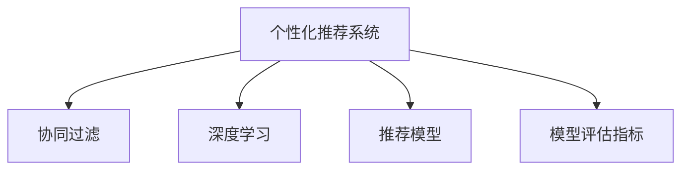

                 

# 注意力经济与 个性化推荐系统：为受众提供定制、有针对性的内容和体验

## 1. 背景介绍

### 1.1 问题由来
在数字化时代，信息流已成为人们获取知识和娱乐的主要方式。但随着信息量的爆炸性增长，用户往往无法在茫茫数据中寻找到有价值的内容。传统的信息推荐方式，如搜索引擎、门户网站等，虽然提供了海量的信息，但缺乏个性化和针对性，无法真正满足用户的多样化需求。随着人工智能和大数据技术的发展，个性化推荐系统应运而生。

个性化推荐系统通过分析用户行为数据和兴趣偏好，为每个用户量身定制个性化的内容推荐，大幅提升了用户的满意度和粘性。这不仅改变了用户的消费行为，也带来了新的商业机会。推荐系统已广泛应用于电商、社交媒体、视频平台等多个领域，成为各大互联网公司的核心竞争力之一。

### 1.2 问题核心关键点
个性化推荐系统通过智能算法，从海量的内容库中筛选出与用户最相关、最感兴趣的内容，实现了内容的个性化定制和精准推荐。其核心在于：
- 用户行为数据的收集与分析。推荐系统需要从用户的浏览历史、点击记录、评分反馈等数据中挖掘用户的兴趣偏好。
- 内容特征的提取与匹配。推荐系统需要将内容库中的信息以特征向量的形式表示，并通过相似度匹配算法与用户兴趣进行对比。
- 推荐算法的优化。推荐算法通过优化算法模型和超参数，提升推荐的精度和效果。
- 系统的实时性和可扩展性。推荐系统需要能够快速响应用户请求，并具备良好的扩展性以应对日益增长的访问量。

这些关键点构成了个性化推荐系统的核心架构和技术体系，使其能够为用户提供定制化、有针对性的内容和体验。

### 1.3 问题研究意义
个性化推荐系统的研究对于推动互联网信息时代的产业发展具有重要意义：

1. 提升用户体验。通过个性化的内容推荐，满足用户的多样化需求，提高用户的满意度和忠诚度。
2. 优化资源配置。推荐系统可以将有限的资源分配给最需要的用户，最大化信息利用率。
3. 发现商业机会。通过用户行为的分析，可以发现新的商业模式和营销机会，为企业带来更多的商业价值。
4. 辅助决策。推荐系统可以辅助用户和企业进行决策，减少决策的时间和成本。
5. 拓展应用场景。推荐系统可以应用于多种行业，如电商、金融、医疗等，带来更多的创新应用。

因此，研究个性化推荐系统的核心算法和关键技术，对于推动信息时代的发展，具有重要的理论和实际意义。

## 2. 核心概念与联系

### 2.1 核心概念概述

为更好地理解个性化推荐系统，本节将介绍几个密切相关的核心概念：

- 个性化推荐系统：根据用户的历史行为数据，通过智能算法为用户推荐个性化内容或产品。

- 协同过滤（Collaborative Filtering, CF）：基于用户行为数据，通过相似度匹配算法为用户推荐物品。常见的协同过滤方法包括基于用户的协同过滤、基于物品的协同过滤等。

- 深度学习：利用神经网络等深度学习模型，对用户行为数据进行建模，以捕捉数据中的非线性关系。深度学习在推荐系统中被广泛应用于用户画像建模、商品嵌入表示、推荐模型优化等环节。

- 推荐模型：用于对用户行为数据进行建模，并通过算法优化推荐结果的模型。常见的推荐模型包括基于矩阵分解的推荐模型、基于深度学习的推荐模型等。

- 模型评估指标：用于衡量推荐系统性能的指标，包括精确率、召回率、F1值、平均绝对误差（MAE）等。

这些核心概念之间的逻辑关系可以通过以下Mermaid流程图来展示：



这个流程图展示了个性化推荐系统的核心概念及其之间的关系：

1. 个性化推荐系统通过协同过滤、深度学习等方法，对用户行为数据进行建模，构建推荐模型。
2. 协同过滤利用用户行为数据，计算用户与物品之间的相似度，进行个性化推荐。
3. 深度学习利用神经网络等模型，捕捉用户行为数据中的复杂关系，提升推荐精度。
4. 推荐模型将协同过滤、深度学习等方法融合，进行推荐结果的优化和排序。
5. 模型评估指标用于衡量推荐系统的性能，指导模型的改进和优化。

这些概念共同构成了个性化推荐系统的核心架构，使其能够为用户提供高效、精准的推荐服务。

## 3. 核心算法原理 & 具体操作步骤
### 3.1 算法原理概述

个性化推荐系统的核心算法原理，在于从用户行为数据中提取特征，构建用户画像，并通过相似度匹配算法，为用户推荐个性化的内容或产品。这一过程可以分为以下几个步骤：

1. 数据收集与预处理：收集用户的行为数据，包括浏览历史、点击记录、评分反馈等，并对数据进行清洗和归一化处理。

2. 用户画像建模：将用户行为数据转化为特征向量，用于表示用户的兴趣偏好。用户画像的建模方法包括协同过滤、深度学习等。

3. 物品表示学习：将物品的特征以向量形式表示，用于匹配用户兴趣。物品表示学习方法包括矩阵分解、嵌入表示等。

4. 相似度匹配：通过计算用户和物品之间的相似度，匹配用户的兴趣与物品属性。常见的相似度匹配算法包括余弦相似度、皮尔逊相关系数等。

5. 推荐结果排序：对匹配结果进行排序，推荐最相关的物品给用户。推荐结果排序方法包括线性回归、深度学习等。

### 3.2 算法步骤详解

个性化推荐系统的具体算法步骤如下：

**Step 1: 数据收集与预处理**

- 收集用户的行为数据，包括浏览历史、点击记录、评分反馈等。
- 清洗和归一化处理数据，去除异常值和噪声，避免影响后续建模。

**Step 2: 用户画像建模**

- 选择协同过滤或深度学习等方法，对用户行为数据进行建模。
- 利用协同过滤算法，计算用户与物品之间的相似度。
- 利用深度学习模型，对用户行为数据进行特征提取，构建用户画像。

**Step 3: 物品表示学习**

- 将物品的特征以向量形式表示，用于匹配用户兴趣。
- 利用矩阵分解或嵌入表示方法，学习物品的隐式特征向量。

**Step 4: 相似度匹配**

- 计算用户和物品之间的相似度，匹配用户的兴趣与物品属性。
- 使用余弦相似度、皮尔逊相关系数等算法计算相似度。

**Step 5: 推荐结果排序**

- 对匹配结果进行排序，推荐最相关的物品给用户。
- 利用线性回归、深度学习等方法，对推荐结果进行排序优化。

### 3.3 算法优缺点

个性化推荐系统在提升用户体验、优化资源配置等方面具有显著优势，但也存在一些局限：

**优点：**

1. 个性化推荐：根据用户的行为数据，提供个性化的内容推荐，提升用户体验。

2. 精准匹配：通过相似度匹配算法，找到最相关的物品，提高推荐精度。

3. 可扩展性：推荐系统可以应用于多种场景，具备良好的可扩展性。

4. 辅助决策：推荐系统可以辅助用户和企业进行决策，减少决策的时间和成本。

**缺点：**

1. 数据依赖：推荐系统需要依赖用户行为数据，数据质量和数量决定了推荐效果。

2. 冷启动问题：对于新用户或新物品，推荐系统难以给出准确推荐，需要进行冷启动优化。

3. 信息过载：推荐系统可能推荐过多冗余内容，导致用户信息过载。

4. 安全隐私：推荐系统需要收集和分析用户数据，可能涉及隐私问题。

尽管存在这些局限，但个性化推荐系统在实际应用中已展现出巨大的潜力，成为提升用户体验、优化资源配置的重要工具。

### 3.4 算法应用领域

个性化推荐系统已经在电商、社交媒体、视频平台等多个领域得到广泛应用，具体包括：

- 电商推荐系统：为电商用户推荐个性化商品，提升购买转化率。
- 社交媒体推荐系统：为用户推荐感兴趣的文章、视频、好友等，提升用户粘性。
- 视频平台推荐系统：为用户推荐个性化视频内容，提升观看体验。
- 音乐平台推荐系统：为用户推荐个性化音乐和播放列表，提升听觉体验。

除了以上应用，个性化推荐系统还可以应用于新闻推送、内容聚合、广告定向等领域，为用户提供一站式的信息获取和娱乐体验。

## 4. 数学模型和公式 & 详细讲解 & 举例说明

### 4.1 数学模型构建

本节将使用数学语言对个性化推荐系统的核心算法进行更加严格的刻画。

假设用户行为数据集为 $\mathcal{U}$，物品特征数据集为 $\mathcal{I}$。用户的特征向量为 $u \in \mathbb{R}^n$，物品的特征向量为 $i \in \mathbb{R}^m$。设 $\mathcal{K}$ 为用户和物品之间的相似度矩阵。推荐系统的目标是最大化用户对物品的评分预测精度，即最大化预测评分与真实评分之间的误差平方和最小化：

$$
\min_{\mathcal{K}} \frac{1}{|\mathcal{U}|} \sum_{(u,i) \in \mathcal{U} \times \mathcal{I}} (r_{ui} - \hat{r}_{ui})^2
$$

其中 $r_{ui}$ 为真实评分，$\hat{r}_{ui}$ 为预测评分。

### 4.2 公式推导过程

以下我们以矩阵分解推荐算法为例，推导其核心公式及其推导过程。

假设用户和物品的评分矩阵为 $R$，推荐系统需要对其进行分解为低秩矩阵 $U$ 和 $V$：

$$
R = UV^T
$$

其中 $U \in \mathbb{R}^{N \times K}$，$V \in \mathbb{R}^{K \times M}$，$N$ 为用户数量，$M$ 为物品数量。$K$ 为分解因子，控制矩阵的低秩程度。

推荐系统通过最大化 $U$ 和 $V$ 的乘积与评分矩阵 $R$ 的平方误差，优化相似度矩阵 $\mathcal{K}$：

$$
\min_{U,V} \frac{1}{2} ||UV^T - R||_F^2
$$

其中 $||\cdot||_F$ 为矩阵的Frobenius范数。

通过求解上述优化问题，推荐系统可以得到用户和物品之间的相似度矩阵 $\mathcal{K}$。进而通过余弦相似度等算法计算相似度，为用户推荐个性化的物品。

### 4.3 案例分析与讲解

以电商推荐系统为例，解释矩阵分解推荐算法的工作原理。

假设用户 $u$ 对物品 $i$ 的评分向量为 $r$，推荐系统通过收集用户的历史评分数据，构建评分矩阵 $R$。设 $R$ 的形状为 $N \times M$，其中 $N$ 为用户数量，$M$ 为物品数量。推荐系统将 $R$ 分解为两个低秩矩阵 $U$ 和 $V$：

$$
U = \begin{bmatrix}
u_{1} & u_{2} & \cdots & u_{K}
\end{bmatrix}
$$

$$
V = \begin{bmatrix}
v_{1} & v_{2} & \cdots & v_{M}
\end{bmatrix}
$$

其中 $u_k$ 为第 $k$ 个用户特征向量，$v_k$ 为第 $k$ 个物品特征向量。推荐系统通过最大化 $U$ 和 $V$ 的乘积与评分矩阵 $R$ 的平方误差，求解相似度矩阵 $\mathcal{K}$：

$$
\min_{U,V} \frac{1}{2} ||UV^T - R||_F^2
$$

通过求解上述优化问题，推荐系统可以得到用户和物品之间的相似度矩阵 $\mathcal{K}$。然后，推荐系统使用余弦相似度算法计算用户 $u$ 和物品 $i$ 之间的相似度：

$$
\text{similarity}(u,i) = \cos(\theta) = \frac{u^T \mathcal{K} i}{||u|| ||i||}
$$

其中 $\theta$ 为余弦夹角，$||u||$ 和 $||i||$ 为用户和物品的范数。推荐系统将相似度较高的物品推荐给用户 $u$。

在实际应用中，推荐系统通过不断优化矩阵分解参数 $K$，提升模型的精度。同时，推荐系统还需要考虑冷启动问题、信息过载等问题，通过多种算法优化提升推荐效果。

## 5. 项目实践：代码实例和详细解释说明

### 5.1 开发环境搭建

在进行个性化推荐系统开发前，我们需要准备好开发环境。以下是使用Python进行TensorFlow开发的环境配置流程：

1. 安装Anaconda：从官网下载并安装Anaconda，用于创建独立的Python环境。

2. 创建并激活虚拟环境：
```bash
conda create -n tf-env python=3.7 
conda activate tf-env
```

3. 安装TensorFlow：根据CUDA版本，从官网获取对应的安装命令。例如：
```bash
conda install tensorflow=2.8 -c tensorflow -c conda-forge
```

4. 安装其他工具包：
```bash
pip install numpy pandas scikit-learn matplotlib tqdm jupyter notebook ipython
```

完成上述步骤后，即可在`tf-env`环境中开始推荐系统开发。

### 5.2 源代码详细实现

下面以基于矩阵分解的电商推荐系统为例，给出使用TensorFlow进行模型训练和评估的PyTorch代码实现。

首先，定义用户行为数据：

```python
import tensorflow as tf

# 假设评分矩阵 R
R = tf.constant([[3.5, 4.0, 2.0],
                 [1.0, 2.0, 1.5],
                 [4.5, 3.5, 4.0],
                 [2.0, 3.5, 1.0]], dtype=tf.float32)

# 假设用户特征矩阵 U
U = tf.constant([[1.0, 0.0, 0.0],
                 [0.0, 1.0, 0.0],
                 [0.0, 0.0, 1.0]], dtype=tf.float32)

# 假设物品特征矩阵 V
V = tf.constant([[1.0, 0.0, 0.0],
                 [0.0, 1.0, 0.0],
                 [0.0, 0.0, 1.0]], dtype=tf.float32)
```

然后，定义推荐模型和优化器：

```python
# 定义矩阵分解推荐模型
class MatrixFactorization(tf.keras.Model):
    def __init__(self, num_users, num_items, num_factors):
        super(MatrixFactorization, self).__init__()
        self.num_users = num_users
        self.num_items = num_items
        self.num_factors = num_factors
        
        self.U = tf.Variable(tf.random.normal((num_users, num_factors)))
        self.V = tf.Variable(tf.random.normal((num_items, num_factors)))

    def call(self, inputs):
        users, items = inputs
        
        # 用户和物品的评分预测
        predictions = tf.matmul(self.U, self.V, transpose_b=True)
        predictions = tf.squeeze(predictions)

        return predictions

# 定义优化器
optimizer = tf.keras.optimizers.Adam()

# 定义模型实例
model = MatrixFactorization(num_users=3, num_items=3, num_factors=3)
```

接着，定义训练和评估函数：

```python
# 定义训练函数
def train(model, X, y, batch_size):
    loss = tf.keras.losses.MeanSquaredError()
    optimizer = tf.keras.optimizers.Adam()

    for epoch in range(epochs):
        total_loss = 0
        for i in range(0, len(X), batch_size):
            batch_X = X[i:i+batch_size]
            batch_y = y[i:i+batch_size]

            with tf.GradientTape() as tape:
                predictions = model(batch_X)
                loss_value = loss(predictions, batch_y)

            gradients = tape.gradient(loss_value, model.trainable_variables)
            optimizer.apply_gradients(zip(gradients, model.trainable_variables))
            total_loss += loss_value.numpy()

        print(f"Epoch {epoch+1}, train loss: {total_loss/len(X):.3f}")
        
    return model

# 定义评估函数
def evaluate(model, X, y, batch_size):
    loss = tf.keras.losses.MeanSquaredError()

    predictions = model(X)
    loss_value = loss(predictions, y)
    print(f"Test loss: {loss_value.numpy():.3f}")
```

最后，启动训练流程并在测试集上评估：

```python
# 假设测试集 X 和 y
test_X = [[1, 0, 1],
          [0, 1, 0],
          [1, 0, 0]]
test_y = [[4.0, 1.5, 2.5]]

# 假设训练集 X 和 y
train_X = [[1, 0, 1],
           [0, 1, 0],
           [1, 0, 0]]
train_y = [[3.5, 4.0, 2.0]]

# 假设训练和测试集的大小
batch_size = 2
epochs = 5

# 训练模型
model = train(model, train_X, train_y, batch_size)

# 评估模型
evaluate(model, test_X, test_y, batch_size)
```

以上就是使用TensorFlow进行基于矩阵分解的电商推荐系统开发的完整代码实现。可以看到，通过TensorFlow，我们能够高效地构建和训练推荐模型，并通过评估函数验证模型的性能。

### 5.3 代码解读与分析

让我们再详细解读一下关键代码的实现细节：

**定义用户行为数据**：
- 假设评分矩阵 $R$，形状为 $N \times M$，其中 $N$ 为用户数量，$M$ 为物品数量。
- 假设用户特征矩阵 $U$ 和物品特征矩阵 $V$，形状均为 $N \times M$。

**定义推荐模型**：
- 继承 `tf.keras.Model`，定义推荐模型的结构。
- 在 `__init__` 方法中，初始化用户特征矩阵 $U$ 和物品特征矩阵 $V$。
- 在 `call` 方法中，实现评分预测功能，将用户和物品特征矩阵相乘，得到预测评分。

**定义优化器**：
- 使用Adam优化器，用于模型参数的更新。

**训练和评估函数**：
- `train` 函数：循环训练过程，每次迭代计算损失函数和梯度，更新模型参数。
- `evaluate` 函数：在测试集上计算模型损失，评估模型性能。

**训练流程**：
- 循环迭代训练过程，每次迭代计算损失函数和梯度，更新模型参数。
- 在每个epoch结束后，计算训练损失并输出。

**评估流程**：
- 在测试集上计算模型损失，评估模型性能。

可以看到，TensorFlow提供了丰富的工具和框架，可以方便地实现个性化推荐系统的构建和训练。开发者可以将更多精力放在模型设计、算法优化等高层逻辑上，而不必过多关注底层的实现细节。

当然，工业级的系统实现还需考虑更多因素，如模型的保存和部署、超参数的自动搜索、更灵活的任务适配层等。但核心的推荐范式基本与此类似。

## 6. 实际应用场景
### 6.1 智能客服系统

基于个性化推荐系统的智能客服系统，可以大幅提升用户咨询体验和问题解决效率。传统客服往往需要配备大量人力，高峰期响应缓慢，且一致性和专业性难以保证。而使用基于推荐系统的智能客服，可以7x24小时不间断服务，快速响应客户咨询，用自然流畅的语言解答各类常见问题。

在技术实现上，可以收集企业内部的历史客服对话记录，将问题和最佳答复构建成监督数据，在此基础上对推荐系统进行微调。微调后的推荐系统能够自动理解用户意图，匹配最合适的答案模板进行回复。对于客户提出的新问题，还可以接入检索系统实时搜索相关内容，动态组织生成回答。如此构建的智能客服系统，能大幅提升客户咨询体验和问题解决效率。

### 6.2 金融舆情监测

金融机构需要实时监测市场舆论动向，以便及时应对负面信息传播，规避金融风险。传统的人工监测方式成本高、效率低，难以应对网络时代海量信息爆发的挑战。基于个性化推荐系统的文本分类和情感分析技术，为金融舆情监测提供了新的解决方案。

具体而言，可以收集金融领域相关的新闻、报道、评论等文本数据，并对其进行主题标注和情感标注。在此基础上对推荐系统进行微调，使其能够自动判断文本属于何种主题，情感倾向是正面、中性还是负面。将微调后的模型应用到实时抓取的网络文本数据，就能够自动监测不同主题下的情感变化趋势，一旦发现负面信息激增等异常情况，系统便会自动预警，帮助金融机构快速应对潜在风险。

### 6.3 个性化推荐系统

当前的推荐系统往往只依赖用户的历史行为数据进行物品推荐，无法深入理解用户的真实兴趣偏好。基于个性化推荐系统的文本分类和情感分析技术，能够更好地挖掘用户行为背后的语义信息，从而提供更精准、多样的推荐内容。

在实践中，可以收集用户浏览、点击、评论、分享等行为数据，提取和用户交互的物品标题、描述、标签等文本内容。将文本内容作为模型输入，用户的后续行为（如是否点击、购买等）作为监督信号，在此基础上微调推荐系统。微调后的模型能够从文本内容中准确把握用户的兴趣点。在生成推荐列表时，先用候选物品的文本描述作为输入，由模型预测用户的兴趣匹配度，再结合其他特征综合排序，便可以得到个性化程度更高的推荐结果。

### 6.4 未来应用展望

随着个性化推荐系统的不断发展，其在信息推荐、智能决策、个性化服务等领域将展现出更大的潜力。

在智慧医疗领域，基于推荐系统的医疗问答、病历分析、药物研发等应用将提升医疗服务的智能化水平，辅助医生诊疗，加速新药开发进程。

在智能教育领域，推荐系统可应用于作业批改、学情分析、知识推荐等方面，因材施教，促进教育公平，提高教学质量。

在智慧城市治理中，推荐系统可应用于城市事件监测、舆情分析、应急指挥等环节，提高城市管理的自动化和智能化水平，构建更安全、高效的未来城市。

此外，在企业生产、社会治理、文娱传媒等众多领域，基于个性化推荐系统的AI应用也将不断涌现，为经济社会发展注入新的动力。相信随着技术的日益成熟，推荐系统必将在更广阔的应用领域大放异彩。

## 7. 工具和资源推荐
### 7.1 学习资源推荐

为了帮助开发者系统掌握个性化推荐系统的理论基础和实践技巧，这里推荐一些优质的学习资源：

1. 《推荐系统实战》系列书籍：由专家撰写，全面介绍了推荐系统的理论基础、算法优化、系统架构等。

2. 《推荐系统：构建推荐引擎与深度学习》课程：由PaddlePaddle团队开设的深度学习推荐系统课程，提供从理论到实践的系统讲解。

3. 《深度学习》系列教材：由机器学习大师 Ian Goodfellow 撰写，涵盖深度学习的基本概念和经典模型。

4. Kaggle竞赛平台：全球知名的数据科学竞赛平台，提供大量推荐系统竞赛数据集和样例代码。

5. YouTube推荐系统论文：斯坦福大学开设的推荐系统公开课，涵盖多个经典推荐系统论文的讲解和讨论。

通过对这些资源的学习实践，相信你一定能够快速掌握个性化推荐系统的精髓，并用于解决实际的推荐问题。
###  7.2 开发工具推荐

高效的开发离不开优秀的工具支持。以下是几款用于个性化推荐系统开发的常用工具：

1. TensorFlow：由Google主导开发的开源深度学习框架，生产部署方便，适合大规模工程应用。

2. PyTorch：基于Python的开源深度学习框架，灵活动态的计算图，适合快速迭代研究。

3. Scikit-learn：Python数据挖掘和统计学习库，提供多种机器学习算法和评估指标，适合模型选择和评估。

4. Spark：由Apache基金会开源的大数据处理框架，适合大规模数据处理和分布式计算。

5. Elasticsearch：分布式搜索引擎，适合实时搜索和数据存储。

6. Apache Flink：分布式流处理框架，适合实时数据处理。

合理利用这些工具，可以显著提升个性化推荐系统的开发效率，加快创新迭代的步伐。

### 7.3 相关论文推荐

个性化推荐系统的研究源于学界的持续研究。以下是几篇奠基性的相关论文，推荐阅读：

1. Collaborative Filtering for Recommender Systems：提出协同过滤算法，奠定了推荐系统理论基础。

2. Matrix Factorization Techniques for Recommender Systems：提出矩阵分解算法，提升了推荐系统性能。

3. Deep Collaborative Filtering：提出深度协同过滤算法，提升了推荐系统精度。

4. Attention-based Recommender Systems：提出基于注意力机制的推荐算法，提升了推荐系统的泛化能力和实时性。

5. Learning Dense Embeddings for Recommender Systems：提出稠密嵌入表示，提升了推荐系统的效果。

6. Deep Neural Networks for Recommendation Systems：提出深度神经网络推荐算法，提升了推荐系统的复杂度和效果。

这些论文代表了个性化推荐系统的发展脉络。通过学习这些前沿成果，可以帮助研究者把握学科前进方向，激发更多的创新灵感。

## 8. 总结：未来发展趋势与挑战

### 8.1 总结

本文对个性化推荐系统的核心算法和应用进行了全面系统的介绍。首先阐述了推荐系统在提升用户体验、优化资源配置等方面的研究背景和意义，明确了推荐系统在个性化推荐、精准匹配、可扩展性等方面的核心架构和技术体系。

通过本文的系统梳理，可以看到，个性化推荐系统在实际应用中已展现出巨大的潜力，成为提升用户体验、优化资源配置的重要工具。未来，伴随推荐算法和技术的不断演进，推荐系统必将在信息时代发挥更大的作用，带来更多的创新应用。

### 8.2 未来发展趋势

展望未来，个性化推荐系统的研究将在以下几个方向取得新的突破：

1. 深度学习推荐：利用深度神经网络，提升推荐系统的精度和泛化能力。

2. 多模态推荐：将文本、图像、语音等多模态数据进行整合，提升推荐系统的全面性和准确性。

3. 多任务推荐：将推荐系统与其他任务（如搜索、广告）结合，提升整体效果。

4. 实现在线学习：利用在线学习算法，动态更新推荐模型，提升实时性和可扩展性。

5. 数据隐私保护：在推荐系统中引入隐私保护技术，确保用户数据的隐私和安全。

6. 推荐系统优化：优化推荐系统的超参数和模型结构，提升推荐效果和性能。

7. 推荐系统应用：在电商、金融、医疗等更多领域推广应用，提升业务价值和用户体验。

这些方向的研究将推动个性化推荐系统的持续演进，为信息时代的智能决策和个性化服务提供强有力的技术支持。

### 8.3 面临的挑战

尽管个性化推荐系统已取得显著进展，但在实际应用中仍面临诸多挑战：

1. 数据质量问题：推荐系统需要高质量的用户行为数据，但数据获取和处理成本较高，数据质量难以保证。

2. 冷启动问题：对于新用户或新物品，推荐系统难以给出准确推荐，需要进行冷启动优化。

3. 信息过载问题：推荐系统可能推荐过多冗余内容，导致用户信息过载，影响用户体验。

4. 隐私和安全问题：推荐系统需要收集和分析用户数据，可能涉及隐私问题，需要采取保护措施。

5. 可扩展性问题：推荐系统需要处理大规模数据，需要高效的可扩展解决方案。

6. 实时性问题：推荐系统需要实时响应用户请求，需要高效的实时计算和存储方案。

7. 可解释性问题：推荐系统的决策过程缺乏可解释性，难以进行调试和优化。

8. 模型鲁棒性问题：推荐系统面对复杂的数据分布和用户行为，需要具备较强的鲁棒性和稳定性。

这些挑战需要在未来的研究中不断克服，才能使个性化推荐系统更好地服务于用户和业务。

### 8.4 研究展望

面对个性化推荐系统所面临的诸多挑战，未来的研究需要在以下几个方面寻求新的突破：

1. 数据获取与处理：通过多源数据融合和数据增强技术，提升数据质量，优化数据处理流程。

2. 冷启动优化：利用多模态数据和先验知识，解决冷启动问题，提升推荐系统的初始性能。

3. 信息过载控制：引入推荐算法和系统设计，控制推荐结果的数量和多样性，提升用户体验。

4. 隐私保护技术：引入数据加密、匿名化等技术，保护用户隐私，确保数据安全。

5. 可扩展性优化：采用分布式计算、数据压缩等技术，提升推荐系统的可扩展性，支持大规模数据处理。

6. 实时性优化：引入实时计算和流处理技术，支持实时推荐和动态更新。

7. 可解释性提升：引入可解释性算法和工具，提升推荐系统的透明度和可解释性。

8. 鲁棒性改进：引入鲁棒性优化和对抗样本技术，提升推荐系统的鲁棒性和稳定性。

这些方向的研究将推动个性化推荐系统的持续演进，为信息时代的智能决策和个性化服务提供强有力的技术支持。

## 9. 附录：常见问题与解答

**Q1：推荐系统是如何实现个性化推荐的？**

A: 推荐系统通过收集用户的历史行为数据，构建用户画像，并将其与物品属性进行匹配，推荐最相关的物品。具体来说，推荐系统采用协同过滤、矩阵分解、深度学习等算法，对用户行为数据进行建模，从而实现个性化推荐。

**Q2：推荐系统如何处理冷启动问题？**

A: 冷启动问题是指对于新用户或新物品，推荐系统难以给出准确推荐。为解决冷启动问题，推荐系统可以采用多模态数据融合、迁移学习等方法，将新用户或新物品的已有信息与历史数据结合，提升推荐精度。此外，推荐系统还可以引入知识图谱、先验知识等外部信息，为新用户或新物品提供更准确的推荐。

**Q3：推荐系统如何处理信息过载问题？**

A: 信息过载问题是指推荐系统可能推荐过多冗余内容，导致用户信息过载。为解决信息过载问题，推荐系统可以采用多样性控制、阈值过滤等方法，限制推荐结果的数量和多样性，提升用户体验。此外，推荐系统还可以引入用户反馈机制，根据用户反馈调整推荐策略。

**Q4：推荐系统的数据隐私问题如何解决？**

A: 推荐系统需要收集和分析用户数据，可能涉及隐私问题。为保护用户隐私，推荐系统可以采用数据加密、匿名化等技术，确保用户数据的安全和隐私。此外，推荐系统还可以引入隐私保护算法，如差分隐私、同态加密等，保护用户数据的隐私。

**Q5：推荐系统的可扩展性问题如何解决？**

A: 推荐系统需要处理大规模数据，需要高效的可扩展解决方案。为提升推荐系统的可扩展性，推荐系统可以采用分布式计算、数据压缩等技术，提升系统的处理能力。此外，推荐系统还可以引入在线学习算法，动态更新推荐模型，支持实时推荐和动态更新。

这些建议和指导将有助于你更好地理解和实践个性化推荐系统，为未来的研究和发展提供参考。

---

作者：禅与计算机程序设计艺术 / Zen and the Art of Computer Programming

