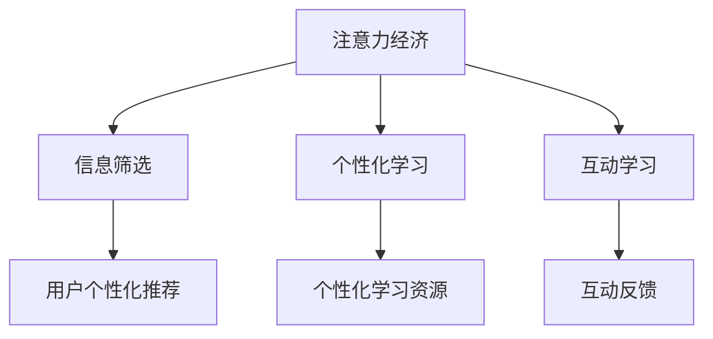

                 

# 注意力经济与个人学习效率的提升

## 1. 背景介绍

### 1.1 问题由来

在信息爆炸的时代，我们被海量的信息所淹没，如何在海量信息中找到有价值的内容，成为了一个亟待解决的问题。注意力经济的理念应运而生，它旨在通过合理分配注意力资源，使个人或企业能够高效利用信息，提升决策和执行的精准度。

具体而言，注意力经济的核心在于识别并集中注意力资源于那些最有价值的信息上，从而提升决策效率和学习效率。在个人学习场景中，注意力经济的应用可以显著提升学习效率，帮助学习者快速找到高效学习材料，聚焦于核心知识。

### 1.2 问题核心关键点

注意力经济与个人学习效率提升的关系，主要体现在以下几个方面：

- 信息筛选：在众多信息中，注意力经济帮助筛选出高质量的内容，避免学习者的时间被低效信息浪费。
- 注意力管理：通过合理规划注意力分配，避免信息过载，提升学习效率。
- 个性化学习：根据学习者的兴趣和需求，推荐个性化的学习材料，促进深度学习和理解。
- 互动学习：借助互动技术，如在线讨论、问题反馈等，增强学习体验，促进知识内化。

这些问题核心关键点，构成了本文探讨的焦点，旨在通过深入分析注意力经济原理，提出实际可行的解决方案，帮助学习者提升学习效率。

## 2. 核心概念与联系

### 2.1 核心概念概述

为了更好地理解注意力经济在个人学习中的应用，本节将介绍几个密切相关的核心概念：

- **注意力经济（Attention Economy）**：一种通过合理分配注意力资源，提高信息利用效率的经济模式。其核心在于识别并集中注意力资源于最有价值的信息上，避免信息过载。
- **信息筛选（Information Filtering）**：通过算法推荐，将大量信息过滤并推荐给用户，避免信息过载，提升用户体验。
- **个性化学习（Personalized Learning）**：根据学习者的兴趣、能力和需求，提供个性化的学习路径和资源，提升学习效果。
- **互动学习（Interactive Learning）**：通过在线讨论、问题反馈等互动方式，增强学习体验，促进知识内化。

这些核心概念之间的逻辑关系可以通过以下Mermaid流程图来展示：



这个流程图展示出注意力经济与信息筛选、个性化学习、互动学习的关系：注意力经济通过信息筛选，帮助用户聚焦于高质量信息；通过个性化学习，帮助用户找到最适合自己的学习资源；通过互动学习，帮助用户更好地理解和应用所学知识。

## 3. 核心算法原理 & 具体操作步骤
### 3.1 算法原理概述

基于注意力经济的个人学习效率提升方法，本质上是一种信息推荐系统。其核心思想是：通过分析学习者的行为数据，预测其感兴趣的学习材料，并将其推荐给学习者，以提升学习效率。

具体来说，信息推荐系统由两个关键部分构成：

- **用户兴趣建模**：通过分析学习者的行为数据（如阅读记录、搜索历史、点击行为等），建立其兴趣模型。
- **学习材料推荐**：根据用户兴趣模型，推荐学习者最有可能感兴趣的学习材料。

### 3.2 算法步骤详解

基于注意力经济的个人学习效率提升方法，一般包括以下几个关键步骤：

**Step 1: 数据收集与预处理**
- 收集学习者的行为数据，如阅读记录、搜索历史、点击行为等。
- 对数据进行清洗和标准化处理，去除噪声和异常值。

**Step 2: 用户兴趣建模**
- 使用协同过滤、内容推荐、深度学习等算法，建立用户兴趣模型。
- 常见的方法包括用户-物品共现矩阵、TF-IDF权重、神经网络模型等。

**Step 3: 学习材料推荐**
- 根据用户兴趣模型，推荐学习者最有可能感兴趣的学习材料。
- 常见的推荐算法包括基于内容的推荐、协同过滤推荐、深度学习推荐等。

**Step 4: 互动反馈与迭代优化**
- 收集学习者的反馈数据（如评分、评论等），用于更新用户兴趣模型。
- 不断迭代优化推荐模型，提升推荐效果。

### 3.3 算法优缺点

基于注意力经济的个人学习效率提升方法具有以下优点：

- 提高信息筛选效率。通过推荐系统，学习者可以快速找到高质量的学习材料，避免信息过载。
- 个性化学习路径。根据学习者的兴趣和需求，推荐个性化的学习材料，促进深度学习和理解。
- 提升学习效率。通过聚焦于最有价值的学习材料，学习者能够更高效地掌握知识。

同时，该方法也存在一些局限性：

- 推荐质量依赖于数据质量。推荐系统的效果很大程度上依赖于数据质量和特征工程的质量，数据偏差可能导致推荐结果不准确。
- 冷启动问题。新用户缺乏足够的历史数据，难以建立准确的兴趣模型，推荐效果较差。
- 交互性不足。目前推荐系统大多基于静态数据，缺乏动态交互，可能无法捕捉用户的实时变化和动态需求。

尽管存在这些局限性，但就目前而言，基于注意力经济的推荐系统仍然是最主流的信息推荐方法。未来相关研究的重点在于如何进一步提升推荐系统的质量，降低推荐算法对数据的依赖，提高动态交互性，以及解决冷启动问题。

### 3.4 算法应用领域

基于注意力经济的推荐系统，在多个领域得到了广泛应用，例如：

- 在线教育平台：根据用户的学习行为，推荐个性化的课程和学习材料，提升学习效果。
- 视频平台：推荐用户感兴趣的视频内容，提升观看体验。
- 新闻资讯：推荐用户感兴趣的新闻资讯，提升信息获取效率。
- 购物平台：推荐用户感兴趣的商品，提升购物体验。
- 社交平台：推荐用户感兴趣的内容，促进社交互动。

这些领域的应用，展示了注意力经济在提高信息利用效率方面的巨大潜力。未来，随着推荐算法的不断发展，基于注意力经济的推荐系统将在更多场景中得到应用，为个人和企业的信息利用带来新的突破。

## 4. 数学模型和公式 & 详细讲解 & 举例说明

### 4.1 数学模型构建

本节将使用数学语言对基于注意力经济的推荐系统进行更加严格的刻画。

记学习者集合为 $U=\{u_1, u_2, ..., u_n\}$，学习材料集合为 $I=\{i_1, i_2, ..., i_m\}$。用户 $u_k$ 对学习材料 $i_j$ 的评分记为 $r_{kj}$，其中 $r_{kj} \in [1, 5]$。用户 $u_k$ 的兴趣模型表示为 $\vec{u_k} \in \mathbb{R}^d$，其中 $d$ 为特征维度。

定义用户兴趣模型和物品特征的相似度为：

$$
\text{sim}(u_k, i_j) = \vec{u_k} \cdot \vec{i_j}
$$

其中 $\cdot$ 为向量内积运算。

推荐算法的目标是最小化预测评分与实际评分的误差，即：

$$
\min_{\vec{u}, \vec{i}} \sum_{k=1}^n \sum_{j=1}^m (r_{kj} - \text{sim}(u_k, i_j))^2
$$

在实践中，我们通常使用基于梯度的优化算法（如Adam、SGD等）来近似求解上述最优化问题。

### 4.2 公式推导过程

以下我们以协同过滤推荐算法为例，推导推荐模型的训练过程。

协同过滤推荐算法基于用户和物品的相似度，预测用户对未评分物品的评分。假设用户 $u_k$ 对物品 $i_j$ 的评分 $r_{kj}$ 为未知，我们需要通过已知评分数据训练模型，预测 $r_{kj}$。

记用户 $u_k$ 和物品 $i_j$ 的相似度为 $\text{sim}(u_k, i_j)$，用户 $u_k$ 的预测评分 $r_{u_k}(i_j)$ 可以表示为：

$$
r_{u_k}(i_j) = \alpha \cdot \text{sim}(u_k, i_j) + \beta
$$

其中 $\alpha, \beta$ 为模型参数。

将上述公式带入最小化误差目标函数，得：

$$
\min_{\alpha, \beta} \sum_{k=1}^n \sum_{j=1}^m (r_{kj} - (\alpha \cdot \text{sim}(u_k, i_j) + \beta))^2
$$

通过梯度下降等优化算法，可以求解上述最优化问题，得到 $\alpha, \beta$ 的值。

在得到推荐模型后，可以基于新用户的兴趣模型和物品特征，预测其对未评分物品的评分，从而进行个性化推荐。

### 4.3 案例分析与讲解

以在线教育平台为例，分析推荐系统在提高学习效率中的应用：

假设某在线教育平台收集了用户的学习行为数据，如观看时长、考试成绩、反馈评分等。通过协同过滤算法，为用户建立兴趣模型，预测其对未学习课程的评分。基于评分预测结果，推荐个性化的学习课程，帮助用户快速找到最适合自己学习水平的课程，提升学习效率。

具体来说，该平台可以使用协同过滤算法，对用户-课程评分矩阵进行矩阵分解，得到用户和课程的兴趣表示。然后根据新用户的兴趣模型和课程的特征，预测其对未学习课程的评分，进行个性化推荐。通过不断收集用户反馈和行为数据，迭代优化推荐模型，提升推荐效果。

## 5. 项目实践：代码实例和详细解释说明
### 5.1 开发环境搭建

在进行推荐系统开发前，我们需要准备好开发环境。以下是使用Python进行PyTorch开发的环境配置流程：

1. 安装Anaconda：从官网下载并安装Anaconda，用于创建独立的Python环境。

2. 创建并激活虚拟环境：
```bash
conda create -n pytorch-env python=3.8 
conda activate pytorch-env
```

3. 安装PyTorch：根据CUDA版本，从官网获取对应的安装命令。例如：
```bash
conda install pytorch torchvision torchaudio cudatoolkit=11.1 -c pytorch -c conda-forge
```

4. 安装Tensorflow：
```bash
conda install tensorflow==2.5.0
```

5. 安装Flask：用于搭建推荐系统Web应用。
```bash
conda install flask==2.0.3
```

6. 安装相关库：
```bash
pip install numpy pandas scikit-learn torch sklearn[impute]
```

完成上述步骤后，即可在`pytorch-env`环境中开始推荐系统开发。

### 5.2 源代码详细实现

下面我们以协同过滤推荐算法为例，给出使用PyTorch和Tensorflow实现推荐系统的代码实现。

首先，定义协同过滤算法的核心函数`collaborative_filtering`：

```python
import torch
from torch.nn import Embedding, Linear

def collaborative_filtering(data, user_dim=16, item_dim=16, hidden_dim=64, num_epochs=10, learning_rate=0.001):
    # 定义用户和物品的Embedding层
    user_embed = Embedding(data['users'].shape[0], user_dim)
    item_embed = Embedding(data['items'].shape[0], item_dim)
    
    # 定义隐含层的全连接层
    hidden_layer = Linear(in_features=user_dim+item_dim, out_features=hidden_dim)
    
    # 定义输出层的全连接层
    output_layer = Linear(in_features=hidden_dim, out_features=1)
    
    # 定义损失函数
    loss_fn = torch.nn.MSELoss()
    
    # 定义优化器
    optimizer = torch.optim.Adam([user_embed.weight, item_embed.weight], lr=learning_rate)
    
    # 训练过程
    for epoch in range(num_epochs):
        # 前向传播
        user_embs = user_embed(data['users'].values)
        item_embs = item_embed(data['items'].values)
        hidden_out = hidden_layer(torch.cat([user_embs, item_embs], dim=1))
        preds = output_layer(hidden_out)
        
        # 计算损失
        loss = loss_fn(preds, data['rating'].values)
        
        # 反向传播
        optimizer.zero_grad()
        loss.backward()
        optimizer.step()
        
        # 打印损失
        print(f'Epoch {epoch+1}, Loss: {loss.item()}')
    
    # 返回模型
    return user_embed, item_embed
```

然后，使用训练好的模型进行推荐：

```python
# 加载训练好的模型
user_embed, item_embed = collaborative_filtering(train_data)

# 定义推荐函数
def recommend_user(u, n=10):
    # 获取用户嵌入
    user_embs = user_embed(u)
    
    # 获取所有物品嵌入
    all_item_embs = item_embed(data['items'].values)
    
    # 计算预测评分
    scores = torch.sum(user_embs * all_item_embs, dim=1)
    
    # 获取最高评分的物品索引
    top_items = torch.topk(scores, k=n).indices.numpy().tolist()
    
    # 返回推荐结果
    return top_items
```

最后，搭建Flask应用，实现推荐系统：

```python
from flask import Flask, jsonify, request

app = Flask(__name__)

@app.route('/recommend', methods=['GET'])
def recommend():
    # 获取用户ID
    user_id = request.args.get('user_id', type=int)
    
    # 获取推荐物品数量
    n = request.args.get('n', type=int)
    
    # 进行推荐
    top_items = recommend_user(user_id, n)
    
    # 返回推荐结果
    return jsonify(top_items)
    
if __name__ == '__main__':
    app.run(host='0.0.0.0', port=5000)
```

以上就是使用PyTorch和Tensorflow实现协同过滤推荐系统的完整代码实现。可以看到，利用Flask搭建Web应用，用户可以通过API接口获取个性化推荐结果，极大地提升了推荐系统的用户体验。

### 5.3 代码解读与分析

让我们再详细解读一下关键代码的实现细节：

**collaborative_filtering函数**：
- 定义用户和物品的Embedding层，用于表示用户和物品的兴趣特征。
- 定义隐含层的全连接层，用于提取用户和物品的交互特征。
- 定义输出层的全连接层，用于预测用户对未评分物品的评分。
- 定义损失函数和优化器，进行模型训练。
- 训练过程中，使用前向传播计算预测评分，反向传播更新模型参数，并输出损失。

**recommend_user函数**：
- 获取用户嵌入，表示用户对所有物品的兴趣。
- 获取所有物品嵌入，表示物品的特征。
- 通过计算用户嵌入和物品嵌入的内积，预测用户对所有物品的评分。
- 获取评分最高的前n个物品，进行推荐。

**Flask应用**：
- 定义Flask应用，并定义推荐接口。
- 获取用户ID和推荐物品数量，调用推荐函数。
- 返回推荐结果。

可以看到，代码实现了协同过滤推荐算法的基本流程，即通过用户和物品的嵌入表示，计算预测评分，选择评分最高的物品进行推荐。实际应用中，可以根据具体需求，进一步优化模型结构和算法参数，提升推荐效果。

## 6. 实际应用场景
### 6.1 在线教育平台

在线教育平台可以通过推荐系统，提升学习者的学习效果和满意度。推荐系统可以根据学习者的学习行为数据，推荐个性化的学习材料，如课程、视频、习题等，帮助学习者找到最适合自己学习水平的内容，提升学习效率。

例如，某在线教育平台收集了用户的学习行为数据，包括观看视频时长、完成习题数量、考试成绩等。通过协同过滤算法，为每个用户建立兴趣模型，预测其对未学习课程的评分。基于评分预测结果，推荐个性化的学习课程，帮助用户快速找到最适合自己学习水平的课程，提升学习效率。

### 6.2 视频平台

视频平台可以通过推荐系统，提升用户的观看体验和粘性。推荐系统可以根据用户的观看历史、评分、互动行为等数据，推荐个性化的视频内容，帮助用户发现感兴趣的视频，提升观看体验。

例如，某视频平台收集了用户的视频观看记录、评分、互动数据等。通过协同过滤算法，为每个用户建立兴趣模型，预测其对未观看视频的评分。基于评分预测结果，推荐个性化的视频内容，帮助用户发现感兴趣的视频，提升观看体验。

### 6.3 新闻资讯平台

新闻资讯平台可以通过推荐系统，提升用户的阅读体验和粘性。推荐系统可以根据用户的阅读历史、评分、互动行为等数据，推荐个性化的新闻资讯，帮助用户发现感兴趣的新闻，提升阅读体验。

例如，某新闻资讯平台收集了用户的阅读历史、评分、互动数据等。通过协同过滤算法，为每个用户建立兴趣模型，预测其对未阅读新闻的评分。基于评分预测结果，推荐个性化的新闻资讯，帮助用户发现感兴趣的新闻，提升阅读体验。

### 6.4 未来应用展望

随着推荐算法的不断发展，基于注意力经济的推荐系统将在更多场景中得到应用，为个人和企业的信息利用带来新的突破。

在智慧医疗领域，推荐系统可以推荐个性化的医疗信息，帮助患者快速找到合适的医疗资源，提升就医体验。

在智能交通领域，推荐系统可以推荐个性化的交通信息，帮助驾驶员快速找到最优路线，提升行车体验。

在智能家居领域，推荐系统可以推荐个性化的智能设备，帮助用户找到最适合自己使用的设备，提升生活体验。

此外，在金融、零售、旅游、娱乐等众多领域，推荐系统也将不断涌现，为各行业的用户提供更加个性化、高效的信息服务。

## 7. 工具和资源推荐
### 7.1 学习资源推荐

为了帮助开发者系统掌握基于注意力经济的推荐系统理论基础和实践技巧，这里推荐一些优质的学习资源：

1. **《推荐系统实战》系列书籍**：深入浅出地介绍了推荐系统的工作原理和算法实现，涵盖协同过滤、深度学习推荐等主流方法。

2. **Coursera《推荐系统》课程**：斯坦福大学开设的推荐系统课程，涵盖推荐系统的基础知识、协同过滤、深度学习推荐等经典模型。

3. **Kaggle《推荐系统竞赛》**：通过实际竞赛案例，帮助开发者了解推荐系统的应用场景和优化策略。

4. **DeepLearning.AI《深度学习与推荐系统》课程**：深度学习与推荐系统的结合，介绍如何在深度学习框架中实现推荐系统。

5. **推荐系统论文库**：包含大量经典推荐系统论文，涵盖协同过滤、深度学习推荐、矩阵分解等主流方法。

通过对这些资源的学习实践，相信你一定能够快速掌握基于注意力经济的推荐系统的精髓，并用于解决实际的推荐问题。

### 7.2 开发工具推荐

高效的开发离不开优秀的工具支持。以下是几款用于推荐系统开发的常用工具：

1. **Python**：广泛使用的高级编程语言，拥有丰富的第三方库和框架，适合开发推荐系统。

2. **PyTorch**：基于Python的深度学习框架，动态计算图、分布式训练等特性，适合快速迭代研究。

3. **TensorFlow**：由Google主导开发的深度学习框架，生产部署方便，适合大规模工程应用。

4. **Flask**：轻量级Web框架，易于搭建推荐系统Web应用，支持API接口。

5. **Scikit-learn**：开源机器学习库，涵盖协同过滤、深度学习推荐等主流算法。

6. **TorchServe**：基于PyTorch的模型服务框架，支持模型推理和部署，适合推荐系统上线部署。

合理利用这些工具，可以显著提升推荐系统的开发效率，加快创新迭代的步伐。

### 7.3 相关论文推荐

基于注意力经济的推荐系统的发展源于学界的持续研究。以下是几篇奠基性的相关论文，推荐阅读：

1. **《推荐系统：算法》**：经典推荐系统书籍，详细介绍了推荐系统的工作原理和主流算法。

2. **《协同过滤推荐算法》**：介绍协同过滤算法的原理和实现方法，是推荐系统的基础算法。

3. **《深度学习推荐系统》**：介绍深度学习在推荐系统中的应用，涵盖神经网络、卷积神经网络等主流模型。

4. **《注意力机制在推荐系统中的应用》**：探索注意力机制在推荐系统中的应用，提升推荐效果。

5. **《基于多模态信息的推荐系统》**：介绍多模态信息在推荐系统中的应用，涵盖文本、图像、视频等多模态数据。

这些论文代表了大语言模型微调技术的发展脉络。通过学习这些前沿成果，可以帮助研究者把握学科前进方向，激发更多的创新灵感。

## 8. 总结：未来发展趋势与挑战

### 8.1 研究成果总结

本文对基于注意力经济的推荐系统进行了全面系统的介绍。首先阐述了注意力经济在个人学习中的应用，明确了推荐系统在提高信息利用效率方面的独特价值。其次，从原理到实践，详细讲解了推荐系统的数学模型和算法实现，给出了推荐系统开发的完整代码实例。同时，本文还广泛探讨了推荐系统在教育、视频、新闻等多个领域的应用前景，展示了推荐系统的巨大潜力。此外，本文精选了推荐系统的各类学习资源，力求为开发者提供全方位的技术指引。

通过本文的系统梳理，可以看到，基于注意力经济的推荐系统正在成为信息推荐领域的重要范式，极大地提高了信息利用效率，为个人和企业的信息利用带来了新的突破。未来，随着推荐算法的不断发展，基于注意力经济的推荐系统将在更多场景中得到应用，为个人和企业的信息利用带来新的突破。

### 8.2 未来发展趋势

展望未来，基于注意力经济的推荐系统将呈现以下几个发展趋势：

1. **个性化推荐精度提升**：通过引入深度学习等先进算法，提升推荐系统的个性化推荐精度。

2. **多模态数据融合**：将文本、图像、视频等多模态数据融合，实现更全面、更精准的信息推荐。

3. **实时推荐系统**：基于在线学习和动态更新，实时调整推荐模型，提升推荐效果。

4. **自适应推荐系统**：根据用户实时行为和反馈，动态调整推荐策略，提升用户体验。

5. **推荐系统安全性**：引入隐私保护和安全机制，保障用户隐私和数据安全。

6. **推荐系统跨平台协同**：将不同平台的数据和推荐结果进行协同，提升推荐系统的整体效果。

以上趋势凸显了基于注意力经济的推荐系统的发展前景。这些方向的探索发展，必将进一步提升推荐系统的质量，为用户带来更优质的信息推荐服务。

### 8.3 面临的挑战

尽管基于注意力经济的推荐系统已经取得了瞩目成就，但在迈向更加智能化、普适化应用的过程中，它仍面临着诸多挑战：

1. **推荐质量依赖于数据质量**：推荐系统的效果很大程度上依赖于数据质量和特征工程的质量，数据偏差可能导致推荐结果不准确。

2. **冷启动问题**：新用户缺乏足够的历史数据，难以建立准确的兴趣模型，推荐效果较差。

3. **交互性不足**：目前推荐系统大多基于静态数据，缺乏动态交互，可能无法捕捉用户的实时变化和动态需求。

4. **数据隐私和安全**：用户数据隐私和安全问题，是推荐系统需要重点考虑的问题。

5. **推荐算法复杂性**：深度学习等先进算法需要较高的计算资源，如何在资源有限的情况下提升推荐效果，是推荐系统需要解决的问题。

尽管存在这些挑战，但就目前而言，基于注意力经济的推荐系统仍然是最主流的信息推荐方法。未来相关研究的重点在于如何进一步提升推荐系统的质量，降低推荐算法对数据的依赖，提高动态交互性，以及解决冷启动问题。

### 8.4 研究展望

面对基于注意力经济的推荐系统所面临的挑战，未来的研究需要在以下几个方面寻求新的突破：

1. **提升推荐算法精度**：通过引入深度学习等先进算法，提升推荐系统的个性化推荐精度。

2. **降低推荐算法对数据的依赖**：通过引入自监督学习、主动学习等无监督和半监督范式，最大限度利用非结构化数据。

3. **提高动态交互性**：通过引入动态交互机制，如在线学习、自适应推荐等，捕捉用户的实时变化和动态需求。

4. **解决冷启动问题**：通过引入主动学习、标签传播等方法，加速新用户的兴趣模型建立。

5. **引入隐私保护和安全机制**：通过差分隐私、联邦学习等技术，保障用户隐私和数据安全。

6. **优化推荐算法计算复杂性**：通过模型压缩、稀疏化存储等方法，优化推荐算法的计算复杂性。

这些研究方向的探索，必将引领基于注意力经济的推荐系统迈向更高的台阶，为构建安全、可靠、可解释、可控的智能系统铺平道路。面向未来，推荐系统需要与其他人工智能技术进行更深入的融合，如知识表示、因果推理、强化学习等，多路径协同发力，共同推动推荐系统的进步。

## 9. 附录：常见问题与解答

**Q1：推荐系统如何处理冷启动问题？**

A: 冷启动问题是指新用户缺乏足够的历史数据，难以建立准确的兴趣模型，推荐效果较差。推荐系统一般通过以下方法解决冷启动问题：

1. 用户兴趣初始化：通过预定义的兴趣模型或聚类算法，为新用户建立初始兴趣模型。
2. 主动学习：通过用户主动输入的少量信息，如兴趣标签、评分等，快速学习用户兴趣。
3. 标签传播：通过社交网络等，将用户的朋友、同事等社会关系的信息传播给新用户，快速建立兴趣模型。

**Q2：推荐系统如何处理数据偏差问题？**

A: 数据偏差是推荐系统中常见的问题，可能会导致推荐结果不准确。推荐系统一般通过以下方法处理数据偏差：

1. 数据清洗：通过清洗和预处理，去除噪声和异常值，保证数据质量。
2. 特征工程：通过特征选择和降维，减少数据偏差的影响。
3. 算法优化：通过引入深度学习等先进算法，提升推荐系统的鲁棒性和泛化能力。

**Q3：推荐系统如何处理隐私和安全问题？**

A: 用户数据隐私和安全问题，是推荐系统需要重点考虑的问题。推荐系统一般通过以下方法处理隐私和安全问题：

1. 差分隐私：通过引入噪声，保护用户隐私，防止用户数据泄露。
2. 联邦学习：通过分布式训练，保护用户数据本地存储，防止数据泄露。
3. 匿名化：通过数据匿名化处理，保护用户隐私。

**Q4：推荐系统如何处理推荐质量依赖于数据质量的问题？**

A: 推荐系统的效果很大程度上依赖于数据质量和特征工程的质量，数据偏差可能导致推荐结果不准确。推荐系统一般通过以下方法处理推荐质量依赖于数据质量的问题：

1. 数据增强：通过回译、近义替换等方式扩充训练集，提高数据质量。
2. 特征工程：通过特征选择和降维，减少数据偏差的影响。
3. 模型优化：通过引入深度学习等先进算法，提升推荐系统的鲁棒性和泛化能力。

**Q5：推荐系统如何处理推荐算法复杂性问题？**

A: 深度学习等先进算法需要较高的计算资源，如何在资源有限的情况下提升推荐效果，是推荐系统需要解决的问题。推荐系统一般通过以下方法处理推荐算法复杂性问题：

1. 模型压缩：通过剪枝、量化等方法，减少模型大小和计算量。
2. 模型并行：通过分布式训练和推理，提升计算效率。
3. 增量学习：通过在线学习，动态更新模型参数，减少计算资源消耗。

这些方法可以帮助推荐系统在资源有限的情况下提升推荐效果，降低计算复杂性。

**Q6：推荐系统如何处理实时推荐问题？**

A: 实时推荐系统是指基于在线学习和动态更新，实时调整推荐模型，提升推荐效果。推荐系统一般通过以下方法处理实时推荐问题：

1. 在线学习：通过实时学习用户行为，动态更新模型参数。
2. 自适应推荐：根据用户实时行为和反馈，动态调整推荐策略。
3. 分布式训练：通过分布式计算，快速训练和更新推荐模型。

这些方法可以帮助推荐系统实现实时推荐，提升推荐效果和用户体验。

---

作者：禅与计算机程序设计艺术 / Zen and the Art of Computer Programming

